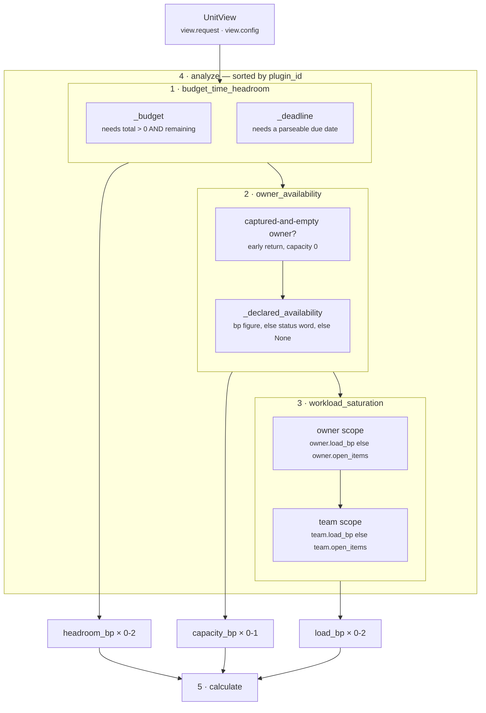

# 03 · Analyzer — the plugin seam for `core.resource`

**Stage 4:** `unit.py:ReasoningUnit.analyze(view)` — **base implementation, not overridden**
**Registered:** `resource_unit.py:ResourceUnit.plugins = (OwnerAvailabilityPlugin(), WorkloadSaturationPlugin(), HeadroomPlugin())`

---

## 1 · What it is for

The Analyzer is where this unit's intellectual property lives. Its job is to turn a frozen snapshot
into *partial claims* — never conclusions — each of which can be tested and tuned alone. For
`core.resource` the decomposition is the argument the module docstring opens with:

> *Three separate claims, three plugins, because they fail for different reasons and are evidenced by
> different facts. An owner on leave is not the same problem as an owner with forty open items, and
> neither is the same problem as a deadline six hours away — folding them into one "feasibility
> score" would produce a number nobody could act on.*

The test of that argument is what a human does with the answer. *Feasibility 3,200bp* prompts nothing.
*The owner is out of office, their queue is at 140% of capacity, and the customer's deadline is six
hours away* prompts three different, obvious actions — reassign, deprioritise, or escalate — and only
the decomposed form supports any of them.

---

## 2 · What exists

The inherited body, in full:

```python
def analyze(self, view: UnitView) -> tuple[Observation, ...]:
    observations: list[Observation] = []
    for plugin in sorted(self.plugins, key=lambda item: item.plugin_id):
        observations.extend(plugin.contribute(view))
    return tuple(observations)
```

`ResourceUnit` defines no `analyze`. Nothing in the roster does.

### 2.1 · Registration order versus execution order

```python
plugins = (OwnerAvailabilityPlugin(), WorkloadSaturationPlugin(), HeadroomPlugin())
```

Registration order is *owner, workload, headroom* — the order the docstring narrates the three
questions in. Execution order is the `plugin_id` sort:

| Execution position | `plugin_id` | Class | Registration position |
|---|---|---|---|
| 1 | `budget_time_headroom` | `HeadroomPlugin` | 3 |
| 2 | `owner_availability` | `OwnerAvailabilityPlugin` | 1 |
| 3 | `workload_saturation` | `WorkloadSaturationPlugin` | 2 |

The sort is not cosmetic. Observation order reaches `Verdict.findings`, which reaches
`ReasonerResult.semantic_hash`. Sorting on `plugin_id` makes that order a property of the unit's
composition rather than of whatever the class body happened to say the day someone added a plugin.
`ReasoningUnit.__init__` raises on duplicate `plugin_id`s for the same reason — a tie would make the
sort ambiguous and every hash below it unstable.

### 2.2 · The observation surface

| # | `kind` | Plugin | Metrics carried | Reason code |
|---|---|---|---|---|
| 1 | `resource.budget_headroom` | `budget_time_headroom` | `headroom_bp`, `remaining_minor` | `budget_headroom_declared` |
| 2 | `resource.deadline_headroom` | `budget_time_headroom` | `headroom_bp`, `hours_remaining` | `deadline_headroom_declared` or `deadline_passed` |
| 3 | `resource.owner_unassigned` | `owner_availability` | `capacity_bp` | `no_owner_to_execute` |
| 3′ | `resource.owner_availability` | `owner_availability` | `capacity_bp` | `owner_availability_declared` |
| 4 | `resource.owner_workload` | `workload_saturation` | `load_bp`, and `open_items` + `capacity_items` when derived from a count | `owner_workload_declared` |
| 5 | `resource.team_workload` | `workload_saturation` | `load_bp`, and `open_items` + `capacity_items` when derived from a count | `team_workload_declared` |

Rows 3 and 3′ are mutually exclusive — the unassigned branch returns early. So the cardinality is:

```text
observations  ∈  0 .. 5
    budget_time_headroom  → 0, 1 or 2
    owner_availability    → 0 or 1
    workload_saturation   → 0, 1 or 2
```

Every observation carries at least one metric. There is no path that produces an empty-metrics
observation: each plugin either has something to report or returns `()`.

`Observation.__post_init__` then enforces the framework's three constraints on all of them — every
metric must be a non-`bool` `int`, and `evidence_ids` and `reason_codes` are deduplicated and sorted
at construction.

---

## 3 · How the three compose



**The three plugins do not interact.** No plugin reads another's output, no plugin reads a prior
result, and no plugin shares a fact with another. Their fact sets are disjoint:

| Plugin | Facts it owns |
|---|---|
| `budget_time_headroom` | `budget.total_minor`, `budget.remaining_minor`, *`deadline_field`* |
| `owner_availability` | `deal.owner`, `owner.availability_bp`, `owner.status` |
| `workload_saturation` | `owner.load_bp`, `owner.open_items`, `team.load_bp`, `team.open_items` |

That disjointness is what makes the plugin seam here genuinely independent rather than nominally so.
Each can be tested in isolation — and the test file does exactly that for all three, constructing the
plugin directly and calling `contribute(view)` with a hand-built view before it ever evaluates the
assembled unit. **Eighteen of the suite's thirty-three tests never construct `ResourceUnit` at all** —
seven for `owner_availability`, six for `budget_time_headroom`, five for `workload_saturation`. The
remaining fifteen exercise the assembled unit.

The only shared surface is `view.config`, and even there the keys are partitioned:
`workload_capacity_items` belongs to one plugin, `owner_reduced_availability_bp` to another,
`deadline_field` and `deadline_window_hours` to the third. The three threshold keys belong to the
Evaluator, not to any plugin.

### The one coupling: the metric namespace

The plugins are independent in code and coupled in **naming**. `calculate` folds by metric name, not
by plugin, so:

- both workload observations write `load_bp`, and `max` across them is what makes *team saturated,
  owner free* bind on the team;
- both headroom observations write `headroom_bp`, and `min` across them is what lets the scarcer of
  money and time bind without either being converted into the other.

Adding a fourth plugin that emitted `capacity_bp` would silently join the `min` fold. That is the
intended extension mechanism — a second capacity source *should* be able to lower the reading — but
it means the Calculator's behaviour is defined by the union of what the plugins choose to name, not by
anything declared in one place. The `publishes` guard catches a genuinely new metric name; it does not
catch a new contributor to an existing one.

---

## 4 · Silence, per plugin

The framework's rule is that a plugin returning `()` means *this axis has nothing to contribute
here* — silence, not a zero. This unit takes that further than most, because a fabricated zero would
be actively dangerous: it would make every play look infeasible.

| Plugin | Returns `()` when |
|---|---|
| `budget_time_headroom` | no budget pair **and** no parseable deadline. Each half is independent — a budget with no deadline still emits one observation |
| `owner_availability` | `deal.owner` absent or non-empty, **and** no valid `owner.availability_bp`, **and** no recognised `owner.status` |
| `workload_saturation` | neither `*.load_bp` nor `*.open_items` is present and readable, for either scope |

Three tests pin the three silences directly:
`test_an_unmeasured_owner_produces_no_availability_claim`,
`test_no_workload_facts_means_no_workload_claim`, and
`test_budget_headroom_needs_both_sides_of_the_ratio` — the last of which asserts `()` twice, once for
a remaining figure with no allowance and once for a zero allowance.

The consequence in the Calculator is that silence and zero are *arithmetically* different, not just
semantically:

```text
three silent plugins    → metrics {resource_signal_count: 0}
                          capacity_bp absent → evaluate_meaning defaults it to 10,000 → no strain

three zero observations → metrics {capacity_bp: 0, load_bp: 0, headroom_bp: 0,
                                   resource_signal_count: 3}
                          → two strains, matched True, WARN rows on every play
```

An unmeasured owner and an owner measured at zero capacity produce opposite verdicts. That is the
whole reason the plugins return `()`.

---

## 5 · Examples and edge cases

### 5.1 · The Northwind renewal — four observations, in execution order

Facts: `deal.owner = "dana_whitfield"`, `owner.status = "out_of_office"`, `owner.open_items = 14`,
`budget.total_minor = 50000`, `budget.remaining_minor = 2000`,
`commitment.due_at = "2026-08-06T18:00:00+00:00"`, against `evaluation_time = 2026-08-06T12:00Z`.

```text
1  budget_time_headroom  resource.budget_headroom     {headroom_bp: 400,   remaining_minor: 2000}
2  budget_time_headroom  resource.deadline_headroom   {headroom_bp: 357,   hours_remaining: 6}
3  owner_availability    resource.owner_availability  {capacity_bp: 0}
4  workload_saturation   resource.owner_workload      {load_bp: 10000, open_items: 14,
                                                       capacity_items: 10}
```

Four observations, therefore `resource_signal_count == 4`. No team observation, because no `team.*`
fact was captured. The findings emerge in exactly this order, verified by direct evaluation.

Note that the **budget is not the constraint** — 2,000 of 50,000 is 400bp of headroom, against the
deadline's 357bp — but both are far below the 2,000bp floor, so the `min` picking 357 changes the
number without changing the verdict. The category README's summary table states this budget figure as
4,000bp; the arithmetic is `2,000 × 10,000 ÷ 50,000 = 400`, and `400` is what the code produces.

### 5.2 · A partial situation — team saturated, owner free

Facts: `deal.owner = "dana"`, `owner.status = "available"`, `team.open_items = 12`.

```text
1  budget_time_headroom  →  ()                       no budget pair, no deadline fact
2  owner_availability    →  resource.owner_availability  {capacity_bp: 10000}
3  workload_saturation   →  resource.team_workload       {load_bp: 10000, open_items: 12,
                                                          capacity_items: 10}

metrics      {resource_signal_count: 2, capacity_bp: 10000, load_bp: 10000}
matched      True
reason_codes ("owner_availability_declared", "team_workload_declared", "workload_saturated")
```

Two plugins spoke, one stayed silent, and the two that spoke disagree about whether the work can be
done. Neither is overruled: `capacity_bp` says the person is free, `load_bp` says the team is not, and
the reader is handed both. A single feasibility score would have had to pick one.

### 5.3 · Cross-plugin interference — there is none

The only way to make two plugins disagree about the same fact is to hand them the same fact name, and
their fact sets are disjoint. The nearest thing to a conflict in the code is *within* one plugin:
`owner_availability` reads both `owner.availability_bp` and `owner.status`, and resolves the tie by
specificity — the measured number outranks the coarse label. `WorkloadSaturationPlugin` resolves the
same shape of tie the same way, preferring a declared `owner.load_bp` over a recount of
`owner.open_items`. Both precedences are pinned by tests
(`test_a_measured_availability_outranks_a_status_label`,
`test_a_declared_load_is_used_directly_without_recounting_items`).

### 5.4 · A plugin that raises

`contribute` is not wrapped. A `ValueError` from `_config_count` or `_config_bp` propagates out of
`analyze`, out of `evaluate`, and is caught by `orchestrator.py:ReasoningOrchestrator._evaluate`,
which records `ResultStatus.FAILED` with the exception type and message in `diagnostics`. Because
this unit's `failure_policy` is `OPTIONAL`, the run continues without capacity rows.

The two plugin-level raises are both config faults, never data faults:

| Raise | Trigger | When it can fire |
|---|---|---|
| `ValueError("workload_capacity_items must be a positive integer")` | `_config_count` | every run — the read is unconditional |
| `ValueError("deadline_field must be a non-empty field name")` | inline check in `_deadline` | every run — `_deadline` always executes |
| `ValueError("deadline_window_hours must be a positive integer")` | `_config_count` | only once a parseable deadline exists |
| `ValueError("owner_reduced_availability_bp must be integer basis points")` | `_config_bp` | only once a `_REDUCED_STATUSES` word appears |

No fact value can make a plugin raise. Every fact read is wrapped in a `try` that degrades to
silence — which is the correct split, and is stated in the module: a malformed capacity is *unknown*
capacity, never full.

---

## Related

| Document | Covers |
|---|---|
| [03a-plugin-budget_time_headroom.md](03a-plugin-budget_time_headroom.md) | Money and clock on one scale |
| [03b-plugin-owner_availability.md](03b-plugin-owner_availability.md) | The three closed status vocabularies |
| [03c-plugin-workload_saturation.md](03c-plugin-workload_saturation.md) | Declared load versus counted items, owner versus team |
| [04-Calculator.md](04-Calculator.md) | How the observations fold by metric name |
| [../../README.md](../../README.md) | §4.2 — why plugins, and what an Observation is allowed to say |
