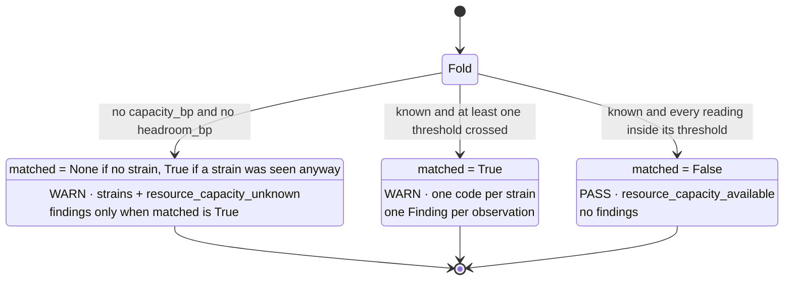

# 05 · Evaluator — `core.resource`

**Stage 6:** `resource_unit.py:ResourceUnit.evaluate_meaning(view, metrics, observations)` — `@abstractmethod`, implemented here
**Length:** 53 lines including the docstring
**Emits:** a `Verdict` with `matched`, `metrics`, `reason_codes`, `findings`, `checks`. **Never `adjustments`.**

---

## 1 · What it is for

The Evaluator turns numbers into meaning. For this unit that means three decisions, in order:

1. Did anything actually get measured?
2. If so, did any reading cross a line the capability author drew?
3. Which plays does the answer travel with, and as what kind of row?

The docstring states the semantics of `matched` first, and it is the least obvious thing in the file:

> *`matched` means **a resource shortfall is present** — the thing this unit looks for.*

Not *this play is feasible*. `matched=True` is bad news. It reads that way because `matched` across
the roster means *the thing this unit exists to detect was detected*, and this unit exists to detect
shortfalls.

---

## 2 · What exists

```python
capacity_floor = _config_bp(view, "capacity_floor_bp", 3_000)
load_ceiling   = _config_bp(view, "load_ceiling_bp", 8_000)
headroom_floor = _config_bp(view, "headroom_floor_bp", 2_000)

known = "capacity_bp" in metrics or "headroom_bp" in metrics

strains: list[str] = []
if metrics.get("capacity_bp", 10_000) <= capacity_floor:
    strains.append("owner_capacity_below_floor")
if metrics.get("headroom_bp", 10_000) <= headroom_floor:
    strains.append("resource_headroom_exhausted")
if metrics.get("load_bp", 0) >= load_ceiling:
    strains.append("workload_saturated")

matched: bool | None
if not known:
    outcome = CheckOutcome.WARN
    codes = tuple(strains) + ("resource_capacity_unknown",)
    matched = True if strains else None
elif strains:
    outcome, codes = CheckOutcome.WARN, tuple(strains)
    matched = True
else:
    outcome, codes = CheckOutcome.PASS, ("resource_capacity_available",)
    matched = False

detail = dict(metrics)
checks = tuple(
    CandidateCheck(play_id=play.play_id, stage="precondition", outcome=outcome,
                   reason_code=code, evaluator_id=self.unit_id,
                   evaluator_version=self.version, detail=detail)
    for play in sorted(view.request.capability.plays, key=lambda item: item.play_id)
    for code in codes)

findings = tuple(Finding(finding_id=item.kind, kind="resource", matched=True,
                         metrics=item.metrics, evidence_ids=item.evidence_ids,
                         reason_codes=item.reason_codes)
                 for item in observations) if matched else ()

reason_codes = tuple(sorted(
    set(codes) | {code for item in observations for code in item.reason_codes})) \
    if matched else codes
return Verdict(matched=matched, metrics=dict(metrics), reason_codes=reason_codes,
               findings=findings, checks=checks)
```

### 2.1 · The three thresholds

| Config key | Default | Comparison | Fires |
|---|---|---|---|
| `capacity_floor_bp` | **3,000** | `metrics.get("capacity_bp", 10_000) <= floor` | `owner_capacity_below_floor` |
| `headroom_floor_bp` | **2,000** | `metrics.get("headroom_bp", 10_000) <= floor` | `resource_headroom_exhausted` |
| `load_ceiling_bp` | **8,000** | `metrics.get("load_bp", 0) >= ceiling` | `workload_saturated` |

All three are validated **eagerly** — the three `_config_bp` calls are the first three statements, so
a malformed threshold fails every run of the capability regardless of what facts arrived.
`test_a_malformed_threshold_is_a_deployment_fault_not_a_silent_default` runs on a snapshot of
`{"deal.status": "open"}` — no resource facts at all — and still expects the raise.

**Both boundaries are inclusive.** `capacity_bp == 3,000` strains; `load_bp == 8,000` strains;
`headroom_bp == 2,000` strains. The inclusive floor is what makes `capacity_floor_bp: 0` still catch a
zero capacity — an owner on leave strains even against the most permissive floor a manifest can set.
That is worth knowing before someone tries to switch the capacity check off by setting the floor to
zero; there is no off.

**The defaults for an absent metric are chosen so that unmeasured never strains** — 10,000 for the
two floors, 0 for the ceiling. That is the Calculator's omission ([04 §3](04-Calculator.md#3--why-that-shape))
paying off: an unmeasured axis is silent here rather than being read as a shortfall.

None of the three defaults is tuned against outcome data. 3,000bp for *too thin to attempt* is a
judgement — *"What counts as 'too thin to attempt' is a business judgement, authored in Layer 3"* —
and `test_the_capacity_floor_is_capability_tunable` exists to prove the judgement is relocatable, not
to prove it is right.

### 2.2 · The strain order is fixed, not iterated

> *Fixed precedence, not set iteration: the order these codes appear in is the order a reader sees them
> in on every replay of the same situation.*

Capacity, then headroom, then load. Three sequential `if`s appending to a list, never a set. That
order reaches `checks` and therefore `ReasonerResult.semantic_hash`, so any construct with
non-deterministic iteration order would break replay.

The chosen order is *severity-ish*: no one to do it, then no time or money to do it in, then the
person is over-committed. Nothing in the code argues for that particular ranking, and nothing depends
on it beyond stability.

---

## 3 · The three readings



From the docstring, on why three and not two:

> * **unknown** — nothing about capacity or headroom was observed. `matched` is None, because "we did
>   not measure" is not "we are fine", and every play carries a precondition WARN so the blind spot
>   reaches the human instead of dying inside the unit.
> * **strained** — a declared capacity, load or headroom crossed its configured threshold. `matched` is
>   True and each strain is warned per play, with the reason it fired.
> * **comfortable** — signals exist and all sit inside their thresholds. `matched` is False and a PASS
>   is recorded per play, so the audit trail shows capacity was checked rather than skipped.

### `known` is defined on two axes, not three

```python
known = "capacity_bp" in metrics or "headroom_bp" in metrics
```

`load_bp` is deliberately excluded. A load reading alone does not tell you whether the work can be
resourced — it tells you the queue is long, which is a different claim — so a run that observed only
workload is still *blind* about capacity. But the unknown branch does not swallow the load reading:

> *A load reading without a capacity reading still says something real, so an observed saturation is
> warned alongside the blind spot rather than swallowed by it.*

`codes = tuple(strains) + ("resource_capacity_unknown",)` and `matched = True if strains else None`.
`test_an_observed_saturation_is_still_warned_when_capacity_itself_is_unmeasured` pins both halves:
`matched is True`, and the reason codes come out as
`["workload_saturated", "resource_capacity_unknown"]` in that order.

### What `matched` means, in one table

| Value | Meaning | Emitted when |
|---|---|---|
| `True` | a resource shortfall is present | any strain fired, in any branch |
| `False` | capacity was measured and is adequate | `known` and no strain |
| `None` | capacity was not measured and nothing strained | `not known` and no strain |

`ReasonerResult.matched` is `bool | None`, so all three survive to the result. A downstream reader
that treats `None` as `False` has decided *unmeasured means fine* on this unit's behalf — which is
exactly the conflation the three-valued design exists to prevent, and exactly the mistake the unit's
own code makes one line later (§6).

---

## 4 · The checks

```python
for play in sorted(view.request.capability.plays, key=lambda item: item.play_id)
for code in codes
```

A full cross product: **`|plays| × |codes|` rows**, all with the same `stage`, `outcome`,
`evaluator_id`, `evaluator_version` and `detail`.

| Field | Value |
|---|---|
| `play_id` | each declared play, in `play_id` order |
| `stage` | `"precondition"` — a member of `guards.py:CHECK_STAGES` |
| `outcome` | `WARN` in the unknown and strained branches, `PASS` in the comfortable one |
| `reason_code` | one row per code |
| `evaluator_id` | `"core.resource"` |
| `evaluator_version` | `"1.0.0"` |
| `detail` | `dict(metrics)` — the unit's four metrics, frozen to a `mappingproxy` by `CandidateCheck.__post_init__` |

### Never ELIMINATE

> *No outcome is ever ELIMINATE. Capacity is a caution this unit reports; whether a shortfall should
> stop a play is a decision, and decisions are Part 3's.*

`CheckOutcome` has four members — `PASS`, `WARN`, `ELIMINATE`, `ADJUST` — and this unit uses two.
`test_a_shortfall_never_eliminates_a_play` asserts all three properties at once on the worst situation
the suite constructs: every check is `precondition`, every outcome is `WARN`, none is `ELIMINATE`.

Downstream, `decision_maker.py:evaluate_candidates` eliminates a candidate only on
`item.outcome == CheckOutcome.ELIMINATE`, so a WARN attaches to the candidate and changes nothing
about its disposition or its utility. The shortfall rides along with the play into the record and onto
the card, and the human decides.

### Ordering

`sorted(..., key=lambda item: item.play_id)` — *"Sorted by play id so the check order is a property of
the capability's content, not of the order plays happened to be authored in."*
`test_checks_are_ordered_by_play_id_not_by_authoring_order` declares plays as
`(zeta_play, alpha_play)` and asserts the checks come out `["alpha_play", "zeta_play"]`.

Within a play, codes appear in the fixed strain order. That order survives into
`ReasonerResult.checks` — but **not** past the Decision Maker: `decision_maker.py:ordered_checks`
re-sorts each candidate's rows by `(stage, evaluator_id, evaluator_version, reason_code,
semantic_hash(detail))`, which is alphabetical on `reason_code`. For the strained branch the two
orders coincide by luck (`owner_… < resource_… < workload_…`); for the unknown branch they do not,
because `resource_capacity_unknown` sorts before `resource_headroom_exhausted` while the unit puts it
last. The unit's ordering argument therefore holds for the result artifact and not for the candidate
view of it.

### One `detail` object, shared

`detail = dict(metrics)` is built once, outside the comprehension, and the same object is handed to
every `CandidateCheck`. `CandidateCheck.__post_init__` passes it through `_mapping` → `_freeze`, so
each row holds an immutable view and no row can mutate another's. Verified: `type(check.detail)` is
`mappingproxy`. Sharing is safe and saves an allocation per row; it also guarantees every row on a
run reports identical metrics, which is correct — the metrics are unit-wide, not per-play.

**This unit's checks are per-play in shape but not in content.** Nothing in `detail`, `reason_code` or
`outcome` varies by play; only `play_id` does. That is honest — capacity is a property of the
organisation, not of the play — but it means an N-play capability gets N identical rows per code. With
`sales.deal_cooling_full`'s three plays and three strains, that is nine rows saying the same thing
three times.

---

## 5 · The findings and the reason codes

```python
findings = tuple(Finding(finding_id=item.kind, kind="resource", matched=True,
                         metrics=item.metrics, evidence_ids=item.evidence_ids,
                         reason_codes=item.reason_codes)
                 for item in observations) if matched else ()
```

One `Finding` per **observation**, not per strain. So a strained run publishes every reading it took,
including the comfortable ones:

> *Each shortfall survives as its own finding, so a card can explain which resource is missing.*

| Finding field | Value |
|---|---|
| `finding_id` | the observation's `kind` — e.g. `resource.deadline_headroom` |
| `kind` | the literal `"resource"` for every one |
| `matched` | hard-coded `True` — a finding exists because an observation exists, not because it strained |
| `metrics` | the observation's metrics verbatim, including `open_items`, `capacity_items`, `remaining_minor`, `hours_remaining` |
| `evidence_ids` | the observation's, already sorted and deduplicated |
| `reason_codes` | the observation's, e.g. `("deadline_passed",)` |

`finding_id` uniqueness holds because the six possible `kind` values are pairwise distinct and
`resource.owner_unassigned` and `resource.owner_availability` are mutually exclusive. Nothing enforces
it; a future plugin emitting a duplicate `kind` would produce two findings with the same
`finding_id`, which `ReasonerResult` does not reject.

`matched=True` on every finding is worth pausing on. It does *not* mean the reading was a problem —
`resource.owner_availability` with `capacity_bp: 10000` is emitted with `matched=True` in a strained
run. It means *this observation was made*. The per-finding judgement is not carried anywhere; the
strain lives in the checks.

### The reason codes lose the fixed order

```python
reason_codes = tuple(sorted(set(codes) | {code for item in observations
                                          for code in item.reason_codes})) if matched else codes
```

In the matched branch the strain codes are unioned with every observation's reason codes and the union
is **re-sorted alphabetically** — so the fixed precedence the checks preserve is discarded here. The
Northwind run produces:

```text
checks       owner_capacity_below_floor · resource_headroom_exhausted · workload_saturated
reason_codes budget_headroom_declared · deadline_headroom_declared · owner_availability_declared ·
             owner_capacity_below_floor · owner_workload_declared · resource_headroom_exhausted ·
             workload_saturated
```

Seven codes, alphabetical, strains and declarations interleaved. A reader scanning
`result.reason_codes` cannot tell a strain from a declaration without knowing the vocabulary — the
`_declared` suffix is the only cue and it is a convention, not a contract. In the unmatched branches
`reason_codes` is `codes` unchanged, so it is a one- or two-element tuple.

### No adjustments, ever

`Verdict.adjustments` defaults to `()` and this unit never sets it.
`test_the_unit_reports_and_does_not_decide` asserts `result.adjustments == ()` on a run with an
unassigned owner and 90 open items. The unit reports; it does not move a score. Nudging `effort` or
`risk` on a saturated owner would make it a second ranking authority, and ranking belongs to Part 3.

---

## 6 · The falsy-`None` finding drop

**The bug.** `if matched` treats `None` and `False` identically, but the three-valued `matched` was
introduced precisely to distinguish them. In the unknown branch with no strain, `matched` is `None`,
which is falsy, so **findings are dropped and observation reason codes are dropped** — even though
observations exist.

**Verified**, on `{"owner.open_items": 2}`:

```text
observations  resource.owner_workload  {load_bp: 2000, open_items: 2, capacity_items: 10}
                                       reason_codes ("owner_workload_declared",)

metrics       {resource_signal_count: 1, load_bp: 2000}
known         False   (no capacity_bp, no headroom_bp)
strains       []      (2,000 < 8,000)
matched       None
findings      ()                          ← the observation is gone
reason_codes  ("resource_capacity_unknown",)   ← owner_workload_declared is gone
checks        one WARN resource_capacity_unknown per play
```

The reading is real and it is discarded. A card built from this result can say *capacity is unknown*
but cannot say *we did see that this owner has two open items out of ten*, even though the unit
measured exactly that and published `load_bp: 2000` in the metrics. The metrics survive; the
explanation does not.

Scope of the damage:

| Situation | `matched` | Findings |
|---|---|---|
| No observations at all | `None` | `()` — correct, nothing to report |
| Observations, none strained, `known` false | `None` | **`()` — wrong, the readings are lost** |
| Observations, some strained, `known` false | `True` | emitted correctly |
| Observations, none strained, `known` true | `False` | `()` — deliberate, the comfortable branch reports nothing |
| Observations, some strained, `known` true | `True` | emitted correctly |

Only row two is a defect, and it is reachable by any snapshot that carries workload facts and no owner
or headroom facts — a plausible shape for a CRM that publishes queue depth but not availability.

The fix is one character wide: `if matched is not None` for the findings, which would also make the
comfortable branch emit findings. That second consequence is presumably why nobody has changed it:
the comfortable branch is deliberately quiet, and separating the two would need
`if matched or matched is None and observations` or a restructure. Either way, the current expression
conflates *undetermined* with *determined negative*, which is the exact conflation the
`matched: bool | None` type exists to prevent.

---

## 7 · A second, quieter problem: the PASS can be unearned

**Verified.** `{"commitment.due_at": "2026-08-13T12:00:00+00:00"}` and nothing else:

```text
observations  resource.deadline_headroom {headroom_bp: 10000, hours_remaining: 168}
metrics       {resource_signal_count: 1, headroom_bp: 10000}
known         True    ← headroom_bp is present
strains       []
matched       False
checks        one PASS resource_capacity_available per play
```

The unit has measured **no capacity of any kind** — no owner, no availability, no workload — and
emits an affirmative `PASS` saying `resource_capacity_available` on every play. `known` is satisfied
by the headroom axis alone, and the capacity axis's absent-metric default of 10,000 then passes the
floor silently.

A `PASS` is an affirmative claim that a rule was checked and cleared. Here it is not true: capacity
was never examined. The category README quotes `core.policy`'s argument for the opposite discipline —
*"recording a pass would suggest this unit had examined a question it never asked"* — and cites
`core.resource` as the counter-example where a PASS is honest because the rule applies to every play.
It is honest about *scope*, and this case shows it is not always honest about *evidence*.

The narrow fix is to require the capacity axis specifically for a PASS, or to split the code —
`resource_capacity_available` when `capacity_bp` was measured, something like
`resource_headroom_available` when only headroom was. Not done. As of this writing the shipped
selector supplies no deadline facts either, so the production path reaches the unknown branch and this
case does not arise — but it is one Layer 2 field away from arising.

---

## 8 · Worked examples

### 8.1 · Northwind — strained on three axes, one play

```text
metrics  {resource_signal_count: 4, capacity_bp: 0, load_bp: 10000, headroom_bp: 357}
config   defaults: floor 3,000 · floor 2,000 · ceiling 8,000

capacity   0      ≤ 3,000  → owner_capacity_below_floor
headroom   357    ≤ 2,000  → resource_headroom_exhausted
load       10,000 ≥ 8,000  → workload_saturated

known    True     matched True     outcome WARN
codes    ("owner_capacity_below_floor", "resource_headroom_exhausted", "workload_saturated")

checks   3 rows, all play_id "send_renewal_followup", all WARN,
         detail {resource_signal_count: 4, capacity_bp: 0, load_bp: 10000, headroom_bp: 357}
findings 4 — resource.budget_headroom · resource.deadline_headroom ·
             resource.owner_availability · resource.owner_workload
```

The play is still standing. `test_the_northwind_renewal_nobody_can_actually_staff` asserts all of it,
and closes with the reason: *"a human may well decide that one email from someone else is exactly the
right answer, and this unit is not entitled to take that option away."*

### 8.2 · The blind run against three plays

```text
facts    {"deal.status": "open"}
metrics  {resource_signal_count: 0}

known    False   strains []   matched None
codes    ("resource_capacity_unknown",)

checks   3 rows — one per play, in play_id order:
             clarify_next_step    WARN  resource_capacity_unknown
             multithread_account  WARN  resource_capacity_unknown
             restore_momentum     WARN  resource_capacity_unknown
         detail {resource_signal_count: 0}
findings ()
```

This is what the shipped `sales.deal_cooling_full` produces today: an honest report that Layer 2 does
not yet publish owner capacity for deals.

### 8.3 · The tunable floor, both ways

`test_the_capacity_floor_is_capability_tunable`, on `{"deal.owner": "dana_whitfield",
"owner.availability_bp": 5000}`:

```text
default config           5,000 > 3,000  → no strain
                         known True (capacity_bp present) → PASS resource_capacity_available
                         matched False

capacity_floor_bp 6,000  5,000 ≤ 6,000  → owner_capacity_below_floor
                         matched True, one WARN row
                         reason_codes ("owner_availability_declared",
                                       "owner_capacity_below_floor")
```

Same facts, opposite verdicts, one integer apart. That is the seam working as intended: what counts as
*too thin to attempt* is authored per capability rather than fixed in the engine.

### 8.4 · The worst case that still eliminates nothing

`test_a_shortfall_never_eliminates_a_play`, on an empty owner, 90 open items, a zero budget, and a
deadline five days past:

```text
metrics  {resource_signal_count: 4, capacity_bp: 0, load_bp: 10000, headroom_bp: 0}
strains  all three
checks   3 WARN rows, stage precondition, outcome WARN, none ELIMINATE
findings 4 — including resource.owner_unassigned with reason_code no_owner_to_execute
            and resource.deadline_headroom with reason_code deadline_passed
```

Every axis at its worst, and the candidate survives to ranking with three warnings attached.

---

## Related

| Document | Covers |
|---|---|
| [04-Calculator.md](04-Calculator.md) | Why the metrics arrive with holes in them, which this stage then defaults |
| [06-Builder-and-Metrics.md](06-Builder-and-Metrics.md) | What the `Verdict` becomes, and who reads the checks |
| [../../../03-Decision-Maker/README.md](../../../03-Decision-Maker/README.md) | `evaluate_candidates` and `ordered_checks` — where a WARN goes |
| [../README.md](../README.md) | Category 3 §4.2 — the three-reading state diagram as a summary |
