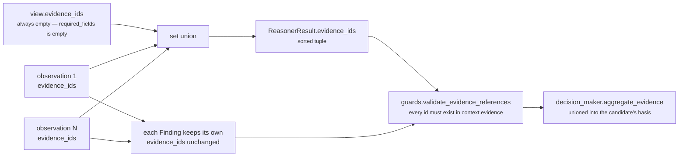

# 06 · Builder and Metrics — `core.resource`

**Stage 7 (Builder):** `unit.py:ReasoningUnit.build(view, verdict, observations)` — **base implementation, not overridden**
**Stage 8 (Metrics):** `resource_unit.py:ResourceUnit.publishes` — a four-name class attribute

---

## 1 · What it is for

The Builder assembles the one object shape every unit in the roster returns, so seventeen different
analyses become one thing the orchestrator, the Decision Maker, the store and the SQL re-prover can
all handle without knowing which unit produced it. The Metrics declaration is the other half of that
contract: what this unit is *allowed* to publish, stated up front rather than discovered by reading
its arithmetic.

`core.resource` overrides neither. `core.confidence` is the only unit in the roster that overrides
`build`, and it does so to route around the `publishes` guard — see the framework README §3.4. This
unit has no such problem: all four of its metric names are its own.

---

## 2 · What exists

### 2.1 · The inherited builder, in full

```python
def build(self, view: UnitView, verdict: Verdict,
          observations: Sequence[Observation]) -> ReasonerResult:
    evidence = set(view.evidence_ids)
    for observation in observations:
        evidence.update(observation.evidence_ids)
    return ReasonerResult(
        reasoner_id=self.unit_id,
        reasoner_version=self.version,
        status=ResultStatus.COMPLETED,
        matched=verdict.matched,
        metrics={name: clamp_bp(value) if name.endswith("_bp") else value
                 for name, value in verdict.metrics.items()},
        findings=verdict.findings,
        adjustments=verdict.adjustments,
        checks=verdict.checks,
        evidence_ids=tuple(sorted(evidence)),
        reason_codes=verdict.reason_codes,
    )
```

Three things it does for this unit:

| Behaviour | Effect on `core.resource` |
|---|---|
| **`status` is hard-coded `COMPLETED`** | the unit cannot skip itself. A unit returning `SKIPPED` is overwritten by the orchestrator with a `FAILED` carrying `reasoner_returned_skipped` — scheduling is Part 1's job |
| **Clamp every `_bp` name** | a no-op here: `capacity_bp`, `load_bp` and `headroom_bp` are already in range three times over (see [04 §6.4](04-Calculator.md#64--values-outside-010000)). `resource_signal_count` does not end in `_bp` and passes through untouched |
| **Union observation evidence** | the *only* source of evidence for this unit, because `view.evidence_ids` is always empty |

### 2.2 · The result shape

| Field | Value for `core.resource` |
|---|---|
| `reasoner_id` | `"core.resource"` |
| `reasoner_version` | `"1.0.0"` |
| `status` | `ResultStatus.COMPLETED` — or `FAILED` / `INSUFFICIENT_CONTEXT` if the orchestrator substitutes one |
| `matched` | `True` (shortfall), `False` (comfortable) or `None` (unmeasured) |
| `metrics` | 1 to 4 entries — `resource_signal_count` always, the other three conditionally |
| `findings` | 0 to 5 `Finding`s, `kind == "resource"`, in observation order |
| `adjustments` | **always `()`** |
| `checks` | one `CandidateCheck` per declared play per reason code, `stage == "precondition"` |
| `evidence_ids` | the sorted union of every observation's citations |
| `missing_fields` | `()` — set only on an `INSUFFICIENT_CONTEXT` result, which this unit cannot produce today |
| `reason_codes` | 1 to 7 codes, alphabetical when matched, the raw `codes` tuple otherwise |
| `semantic_hash` | derived; `test_the_same_situation_twice_yields_the_same_numbers_and_the_same_hash` pins its stability |

### 2.3 · `publishes`

```python
publishes = ("capacity_bp", "load_bp", "headroom_bp", "resource_signal_count")
```

| Metric | Range | Direction | Meaning | Absent when |
|---|---|---|---|---|
| `capacity_bp` | 0–10,000 | higher is better | how much of one person is available to carry this out. `10,000bp` = 1.00 = a fully available named owner; `0` = on leave, or nobody assigned | no observation carried `capacity_bp` |
| `load_bp` | 0–10,000 | **lower** is better | how much of the declared serving capacity is already committed, across owner and team, saturating at 100% | no observation carried `load_bp` |
| `headroom_bp` | 0–10,000 | higher is better | the tighter of *budget unspent* and *clock unspent*, as a fraction of the declared allowance | no observation carried `headroom_bp` |
| `resource_signal_count` | 0–5 | neutral | how many resource observations this run actually took | **never** — always emitted |

Basis points throughout: `7,500bp` means 0.75. `resource_signal_count` is a plain count and is
deliberately not `_bp`-suffixed, so `build` does not clamp it and `guards.py` does not range-check it.

**Three of the four are omitted rather than defaulted**, and that is the unit's central contract with
its readers. From the class docstring:

> *Publishes three orthogonal readings rather than one blended feasibility number, so a downstream
> reader can tell which resource is short. Each is omitted entirely when nothing was observed: an
> absent metric means unknown, and a reader that defaults it chooses its own default rather than
> inheriting a fabricated one.*

A reader that writes `metrics.get("capacity_bp", 0)` has decided *unmeasured means no capacity* and
will find every play infeasible. A reader that writes `metrics.get("capacity_bp", 10_000)` has decided
*unmeasured means fine* — which is what this unit's own Evaluator does, deliberately and with a WARN
attached to say so. Both are choices; the point is that the metric does not make them silently.

### 2.4 · The `publishes` guard

Between the Evaluator and the Builder:

```python
undeclared = sorted(set(verdict.metrics) - set(self.publishes)) if self.publishes else []
if undeclared:
    raise ValueError(f"{self.unit_id} published undeclared metrics: {', '.join(undeclared)}")
```

`Verdict.metrics` is always a subset of `publishes`, so the guard always passes. It earns its place
prospectively: a fourth plugin emitting `staffing_bp` would raise
`ValueError: core.resource published undeclared metrics: staffing_bp` on the first test run, rather
than six months later when something downstream started reading a metric nobody knew was moving.

`test_the_unit_never_publishes_a_metric_another_unit_is_the_authority_for` adds the other half:
`set(ResourceUnit.publishes)` is disjoint from `{confidence_bp, urgency_bp, priority_override_bp}`.
Those three are the metrics the Decision Maker reads from a named authority, and *"publishing
`confidence_bp` or `urgency_bp` here would silently re-score the whole system"*. The roster-wide
`test_no_unit_publishes_a_metric_another_unit_owns` confirms no other unit claims any of this unit's
four names.

---

## 3 · Evidence attachment



Two levels, and both matter:

- **Result level** — `ReasonerResult.evidence_ids` is the union. It answers *what did this unit stand
  on, in total?*
- **Finding level** — each `Finding` keeps only its own observation's citations. It answers *what did
  this particular claim stand on?*, which is what a card explaining *the deadline has passed* needs.

`guards.py:validate_evidence_references` checks both at the orchestrator boundary — it unions
`result.evidence_ids`, every finding's ids and every adjustment's ids, and raises if any is absent
from `request.context.evidence`. A unit cannot cite a row it invented.

Two properties worth stating plainly, both established in [02-Retriever §4](02-Retriever.md#4--where-the-evidence-actually-comes-from):

1. **All of it comes from observations.** `view.evidence_ids` contributes nothing, so a run with zero
   observations produces `evidence_ids == ()`.
2. **Citation is by field, not by use.** Each plugin cites every field name in its family, so an
   evidence id here proves the field was captured, not that its value produced the number.

And one that is not enforced anywhere: **a resource claim may cite nothing at all.** A capacity of 0
derived from `owner.status: "out_of_office"` produces `evidence_ids == ()` if Layer 2 attached no
`EvidenceRef` for that field, and nothing rejects the result. The `evidence_required` capability
policy is checked by `core.constraint` against *plays*, not against reasoner findings, so an
unevidenced shortfall travels to the card unchallenged. Thirty-two of the suite's thirty-three tests
pass `evidence=()` and assert real numbers, which is exactly this situation.

---

## 4 · Who consumes these metrics

The honest answer, verified by grep across `genios_engine/`: **nothing reads `capacity_bp`,
`load_bp`, `headroom_bp` or `resource_signal_count`.**

| Would-be consumer | Reads this unit's metrics? |
|---|---|
| Any other reasoning unit, via `UnitView.prior_metric` | **no.** No unit in the roster declares `core.resource` as a dependency, and no unit names any of the four metrics |
| `decision_maker.py:calculate_confidence` | no — reads `confidence_bp` only |
| `decision_maker.py:priority_metrics` | no — reads `urgency_bp` and `priority_override_bp` only |
| `decision_maker.py` utility weighting | no — utility is built from `CandidateAdjustment`s, and this unit emits none |
| `deliver/card_builder.py` | no — builds from signal reason codes and templates |
| `executive/` | no |

So the metrics are, today, **audit output**. They are persisted and they are readable; nothing acts on
them. `cost_unit.py` uses a *local variable* named `headroom_bp` at line 258, derived from
`core.opportunity`'s `opportunity_bp` — a name collision inside one function, not a read of this
unit's metric.

What *is* consumed is the checks:

| Consumer | What it does |
|---|---|
| `guards.py:validate_candidate_effects` | rejects a check naming an undeclared play, or a `stage` outside `CHECK_STAGES`. `"precondition"` is a member |
| `guards.py:validate_evidence_references` | rejects a citation outside the snapshot |
| `decision_maker.py:evaluate_candidates` | attaches each play's checks to its `ProposedCandidate`. Only `ELIMINATE` changes disposition, so a `WARN` attaches and changes nothing |
| `decision_maker.py:ordered_checks` | re-sorts each candidate's rows by `(stage, evaluator_id, evaluator_version, reason_code, semantic_hash(detail))` |
| `decision_maker.py:aggregate_evidence` | unions this unit's evidence ids into the candidate's evidential basis |
| `reason/store.py` | persists the rows to `reasoning_candidate_checks`, and re-derives them on replay — `_prepare_checks` compares the persisted rows against the immutable ones embedded in the reasoner output and raises `candidate checks differ from immutable reasoner result effects` on any drift |

`reason/authority.py`'s SQL re-proof indexes on `core.constraint`'s policy rows specifically, not on
every check, so this unit's WARNs are persisted and readable but are not part of the re-proved
invariant.

**The practical consequence:** a resource shortfall reaches a human only if something renders the
check rows. The metrics are inert, the findings are inert, and the WARN rows are the whole delivery
mechanism. That is consistent with the unit's stated purpose — *"the shortfall travels with the
candidate and is visible at the point of decision"* — but *visible* currently means *present in the
persisted candidate record*, not *shown on the card*. Closing that is a Layer 5.2 change, not a Layer 4
one.

---

## 5 · Worked example — the result object, in full

Northwind, one play, from `test_the_northwind_renewal_nobody_can_actually_staff`:

```text
ReasonerResult
  reasoner_id       "core.resource"
  reasoner_version  "1.0.0"
  status            COMPLETED
  matched           True

  metrics           resource_signal_count  4
                    capacity_bp            0        on leave
                    load_bp            10,000        14 items against a capacity of 10
                    headroom_bp           357        6 hours of a 168-hour window

  findings          resource.budget_headroom     {headroom_bp: 400, remaining_minor: 2000}
                                                 ("budget_headroom_declared",)
                    resource.deadline_headroom   {headroom_bp: 357, hours_remaining: 6}
                                                 ("deadline_headroom_declared",)
                    resource.owner_availability  {capacity_bp: 0}
                                                 ("owner_availability_declared",)
                    resource.owner_workload      {load_bp: 10000, open_items: 14,
                                                  capacity_items: 10}
                                                 ("owner_workload_declared",)
                    — every one kind="resource", matched=True

  adjustments       ()

  checks            send_renewal_followup · precondition · WARN · owner_capacity_below_floor
                    send_renewal_followup · precondition · WARN · resource_headroom_exhausted
                    send_renewal_followup · precondition · WARN · workload_saturated
                    — all evaluator_id "core.resource", evaluator_version "1.0.0",
                      detail = the four metrics above

  evidence_ids      ()      no EvidenceRefs in this fixture

  reason_codes      budget_headroom_declared · deadline_headroom_declared ·
                    owner_availability_declared · owner_capacity_below_floor ·
                    owner_workload_declared · resource_headroom_exhausted ·
                    workload_saturated
```

Note the ordering the result carries and where each comes from:

- **findings** in `plugin_id` order, from `analyze`'s sort;
- **checks** in `play_id` order, then in the Evaluator's fixed strain order;
- **reason_codes** alphabetical, from the matched branch's `sorted(set(...))`;
- **evidence_ids** sorted by id, from `build`.

Four different orderings, four different sorts, and every one of them deliberate. Together they are
what makes `test_the_same_situation_twice_yields_the_same_numbers_and_the_same_hash` hold: two
evaluations of the same frozen facts produce identical metrics *and* an identical `semantic_hash`.

---

## 6 · Edge cases

### 6.1 · The minimum result

```text
metrics       {resource_signal_count: 0}
matched       None
findings      ()
adjustments   ()
checks        one WARN resource_capacity_unknown per declared play
evidence_ids  ()
reason_codes  ("resource_capacity_unknown",)
```

One metric, no findings, one row per play. Not empty, and not zeroed.

### 6.2 · A capability with no plays

`checks` would be `()` — the cross product over an empty play list is empty — and the result would
carry metrics and findings with nothing to attach them to. `CapabilityManifest.__post_init__` is what
prevents this in practice; the unit itself does not check.

### 6.3 · A `FAILED` result

If a config typo raises, `orchestrator.py:_evaluate` records
`ReasonerResult(status=FAILED, ...)` with the exception type and message in `diagnostics`.
`ReasonerResult.__post_init__` forbids a non-`COMPLETED` result from carrying `matched`, metrics,
findings, adjustments, checks or evidence ids — so a half-built resource verdict cannot leak into the
Decision Maker. `diagnostics` is `compare=False, repr=False` and sits outside `to_semantic_dict`, so a
failure message can never move a hash.

Because the shipped spec is `FailurePolicy.OPTIONAL`, such a failure degrades the run rather than
ending it — and `decision_maker.py:calculate_confidence` caps confidence at
`optional_failure_confidence_cap_bp` (default 5,000) for a degraded run, so a capacity blind spot
caused by a config fault does at least depress the decision's stated confidence.

### 6.4 · `matched is None` reaching the record

`ReasonerResult.matched` is `bool | None` and the store round-trips it as `null`. Any consumer that
reads it as a boolean gets Python's falsiness and treats *unmeasured* as *no shortfall* — the same
conflation the Evaluator itself commits at [05 §6](05-Evaluator.md#6--the-falsy-none-finding-drop).
The three-valued type is only worth what its readers make of it.

---

## Related

| Document | Covers |
|---|---|
| [05-Evaluator.md](05-Evaluator.md) | The `Verdict` this stage assembles |
| [02-Retriever.md](02-Retriever.md) | Why all evidence comes from observations |
| [../../../_reference/Contracts-and-Dataflow.md](../../../_reference/Contracts-and-Dataflow.md) | `ReasonerResult`, `Finding`, `CandidateCheck` field by field |
| [../../../_reference/Determinism-Audit-Replay.md](../../../_reference/Determinism-Audit-Replay.md) | `semantic_hash`, and the store's replay comparison |
| [../../../03-Decision-Maker/README.md](../../../03-Decision-Maker/README.md) | `evaluate_candidates`, `ordered_checks`, `aggregate_evidence` |
