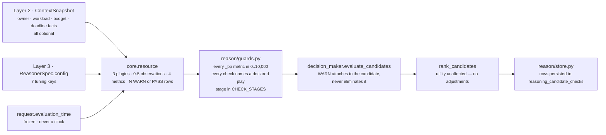
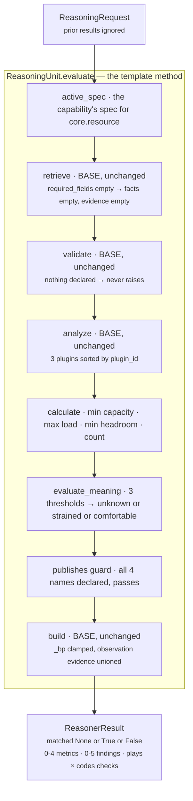
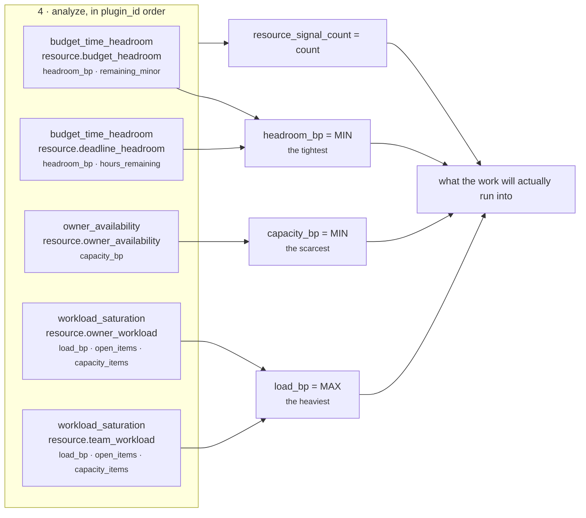

# `core.resource` — can we actually staff, fund and fit this?

**Module:** `genios_engine/reason/reasoners/resource_unit.py` (373 lines, 3 plugins)
**Tests:** `tests/test_unit_resource_unit.py` — 33 passing
**Identity:** `ResourceUnit.unit_id = "core.resource"` · `ResourceUnit.version = "1.0.0"`
**Category:** `UnitCategory.OPTIMIZATION`
**Registered as:** `reasoners/__init__.py:OPTIMIZATION` — `ResourceUnit`, second of five
**Declared by:** `packs/capabilities/deal_cooling_v2.py` — `_spec("core.resource")`, no dependencies, no `required_fields`, empty config, `FailurePolicy.OPTIONAL`, `latency_budget_ms=60`

---

## 1 · What it is for

**The business question:** *do we actually have what this would take?*

Every other unit in Layer 4 reasons about whether something is **worth** doing — how late, how big,
how risky, how much it would cost. This one reasons about whether it **can** be done at all with the
capacity the organisation has declared. Four sub-questions, from the module docstring:

> *is there a named owner, is that owner actually available, is that owner already carrying more
> commitments than they can serve, and is there any budget or clock left before the window closes.*

It publishes three orthogonal readings — capacity, load, headroom — rather than one blended
feasibility number, so a downstream reader can tell *which* resource is short. An owner on leave is
not the same problem as an owner with forty open items, and neither is the same problem as a deadline
six hours away.

**It never eliminates a play.** Running short of capacity is a caution, not a policy violation:

> *A saturated owner can still be the right person to send one email, and a human reading the card is
> a better judge of that than a threshold. Policy elimination belongs to `core.constraint`; this unit
> only ever raises a `precondition` WARN so the shortfall travels with the candidate and is visible
> at the point of decision.*

`test_a_shortfall_never_eliminates_a_play` pins that: every check is `stage == "precondition"`, every
outcome is `WARN`, and none is `ELIMINATE` — even when the owner field is empty, the queue is at 90
items, the budget is zero and the deadline is five days past.

---

## 2 · Its place in the pipeline

The unit takes **no prior results**. `spec.dependencies` is empty in the only capability that
declares it, and the module never calls `view.prior_metric`. It reads Layer 2 facts and its own
config, nothing else. That makes it one of the cheapest units in the roster to reason about: its
output is a pure function of the frozen snapshot and seven integers.

It also takes **no `required_fields`**, which means it can never return `INSUFFICIENT_CONTEXT` in the
shipped configuration — see [01-Input-and-Validator](01-Input-and-Validator.md).

---

## 3 · The plugins

Three seams, because the three failures are evidenced by different facts and are not
interchangeable. `analyze()` runs them in `plugin_id` order, which is alphabetical, and that order
determines observation order and therefore finding order in the result.

| # | Plugin class | `plugin_id` | Claim it makes | `kind` values it emits | Doc |
|---|---|---|---|---|---|
| 1 | `HeadroomPlugin` | `budget_time_headroom` | How much money and how much clock is left | `resource.budget_headroom`, `resource.deadline_headroom` | [03a](03a-plugin-budget_time_headroom.md) |
| 2 | `OwnerAvailabilityPlugin` | `owner_availability` | Is there a named human, and is that human available | `resource.owner_unassigned`, `resource.owner_availability` | [03b](03b-plugin-owner_availability.md) |
| 3 | `WorkloadSaturationPlugin` | `workload_saturation` | How much of the declared capacity is already spoken for | `resource.owner_workload`, `resource.team_workload` | [03c](03c-plugin-workload_saturation.md) |

Maximum five observations per run: one from `owner_availability` (the two kinds are mutually
exclusive), two from `workload_saturation` (owner scope and team scope), two from
`budget_time_headroom` (budget and deadline). Minimum zero.

### Published metrics

`publishes = ("capacity_bp", "load_bp", "headroom_bp", "resource_signal_count")`

| Metric | Range | Fold | Emitted when | Meaning |
|---|---|---|---|---|
| `capacity_bp` | 0–10,000 | `min` of every observed `capacity_bp` | at least one observation carries `capacity_bp` | how much of one person is available to do this |
| `load_bp` | 0–10,000 | `max` of every observed `load_bp` | at least one observation carries `load_bp` | how much of the declared serving capacity is already committed |
| `headroom_bp` | 0–10,000 | `min` of every observed `headroom_bp` | at least one observation carries `headroom_bp` | the tighter of money-left and clock-left, as a fraction of allowance |
| `resource_signal_count` | 0–5 | `len(observations)` | **always** | how many resource readings this run actually had |

Three of the four are **omitted entirely** when nothing was observed. That is the load-bearing
design choice of this unit, and `test_unknown_capacity_warns_rather_than_inventing_a_shortfall`
asserts it directly: `assert "capacity_bp" not in result.metrics`. From the class docstring:

> *an absent metric means unknown, and a reader that defaults it chooses its own default rather than
> inheriting a fabricated one.*

`resource_signal_count` is the exception, and it is the metric that makes the other three's absence
readable. `{resource_signal_count: 0}` means *nothing looked*; `{resource_signal_count: 1,
load_bp: 2000}` means *one thing looked and capacity is still unmeasured*.

**No other unit publishes any of these four names.** `test_no_unit_publishes_a_metric_another_unit_owns`
in the roster suite enforces one publisher per metric, and
`test_the_unit_never_publishes_a_metric_another_unit_is_the_authority_for` in this unit's own suite
asserts the publishes set is disjoint from `{confidence_bp, urgency_bp, priority_override_bp}`.

---

## 4 · Internal flow

**The unit overrides nothing but the two abstract stages.** `validate`, `retrieve`, `analyze` and
`build` are all the base class's, unmodified. That is the framework paying for itself, and it is also
why [02-Retriever](02-Retriever.md) has a real finding to report: because `retrieve` is unchanged and
`required_fields` is empty, `view.facts` is always empty and every plugin reads
`view.request.context.facts` directly through `common.py:fact_value`.

The fold from observations to metrics, drawn against the five possible observations:

---

## 5 · Configuration

Seven keys, all optional, all read out of `ReasonerSpec.config` for this unit. The shipped
`sales.deal_cooling_full` declares **none** of them, so every default below is what production
currently runs on. None of these defaults is tuned against outcome data — they are engineering
judgements written down so they can be argued with.

| Config key | Validator | Default | Type demanded | What it steers |
|---|---|---|---|---|
| `owner_reduced_availability_bp` | `_config_bp` | **4,000** | integer, `0 ≤ v ≤ 10,000`, `bool` rejected | capacity assigned to a `_REDUCED_STATUSES` word such as `busy` |
| `workload_capacity_items` | `_config_count` | **10** | integer `> 0`, `bool` rejected | denominator turning `open_items` into `load_bp` |
| `deadline_field` | inline check in `HeadroomPlugin._deadline` | **`"commitment.due_at"`** | non-empty `str`, stripped | which fact carries the clock |
| `deadline_window_hours` | `_config_count` | **168** (one week) | integer `> 0`, `bool` rejected | denominator turning `hours_remaining` into `headroom_bp` |
| `capacity_floor_bp` | `_config_bp` | **3,000** | integer bp | strain fires when `capacity_bp ≤ floor` |
| `load_ceiling_bp` | `_config_bp` | **8,000** | integer bp | strain fires when `load_bp ≥ ceiling` |
| `headroom_floor_bp` | `_config_bp` | **2,000** | integer bp | strain fires when `headroom_bp ≤ floor` |

**A misconfigured key is a deployment fault, not a silent default.** `_config_bp` and `_config_count`
raise `ValueError`, which the orchestrator turns into `ResultStatus.FAILED`. Two tests pin this:
`test_a_malformed_threshold_is_a_deployment_fault_not_a_silent_default` and
`test_a_zero_workload_capacity_is_rejected_where_it_is_authored`.

**But they are not all validated at the same time**, and that asymmetry is a real hazard:

| Key | Validated | Consequence of a typo |
|---|---|---|
| `capacity_floor_bp`, `load_ceiling_bp`, `headroom_floor_bp` | **every run** — the first three lines of `evaluate_meaning` | caught immediately by any test that evaluates the unit |
| `workload_capacity_items` | **every run** — first line of `WorkloadSaturationPlugin.contribute`, before the facts are even inspected | caught immediately |
| `deadline_field` | **every run** — first lines of `HeadroomPlugin._deadline`, which always executes | caught immediately |
| `owner_reduced_availability_bp` | only when a status word lands in `_REDUCED_STATUSES` | **dormant** — verified: a config of `20_000` with an owner whose status is absent raises nothing, and only fails the day someone's CRM says `busy` |
| `deadline_window_hours` | only when the deadline fact exists **and** parses | **dormant** — a nonsense window survives every run until a real due date arrives |

Two latent deployment faults that will surface on a Tuesday afternoon rather than in CI. Neither is
hard to close — hoisting both reads to the top of `contribute` would do it — and neither is closed.

### Facts read, all optional

| Fact | Read by | Read as |
|---|---|---|
| `deal.owner` | `owner_availability` | presence-checked in `request.context.facts`, then `str(...).strip()` |
| `owner.availability_bp` | `owner_availability` | `common.py:basis_points`, 0–10,000 |
| `owner.status` | `owner_availability` | `str(...).strip().lower()` against three closed vocabularies |
| `owner.load_bp` | `workload_saturation` | `basis_points` |
| `owner.open_items` | `workload_saturation` | `_optional_int` |
| `team.load_bp` | `workload_saturation` | `basis_points` |
| `team.open_items` | `workload_saturation` | `_optional_int` |
| `budget.total_minor` | `budget_time_headroom` | `_optional_int`, must be `> 0` |
| `budget.remaining_minor` | `budget_time_headroom` | `_optional_int` |
| *`deadline_field`* — default `commitment.due_at` | `budget_time_headroom` | `common.py:parse_time`, timezone-aware ISO-8601 |

Layer 2 may supply none of them. As of this writing the shipped selector supplies none of them for
`deal` entities, so the unit's production output is `{resource_signal_count: 0}` and one WARN per
play — an honest report that owner capacity is not yet captured.

---

## 6 · Silence semantics

This unit's whole reason for existing in the shape it has is the distinction between *unmeasured*
and *measured-empty*. It is the only unit in the roster that draws that line explicitly in code.

| Situation | What the unit does |
|---|---|
| No resource facts at all | 0 observations, `metrics == {resource_signal_count: 0}`, `matched is None`, one WARN `resource_capacity_unknown` per play |
| `deal.owner` never captured | `owner_availability` contributes **nothing** — no observation, no zero |
| `deal.owner` captured and empty | `resource.owner_unassigned` with `capacity_bp: 0` — *someone looked and there was no one* |
| `owner.status` present but unrecognised, e.g. `sabbatical_q3` | contributes nothing. An unknown status is *not known to be available* |
| `owner.availability_bp` present but malformed, e.g. `"plenty"` | contributes nothing. Corrupt input must never read as maximum capacity |
| `owner.open_items` absent | no workload observation for that scope. *An uncounted queue is not an empty queue* |
| `budget.remaining_minor` without `budget.total_minor` | no budget observation — a remaining figure with no allowance says nothing about headroom |
| `budget.total_minor <= 0` | no budget observation — the ratio would be undefined |
| Deadline fact absent or unparseable | no deadline observation. *An unparseable deadline is not a deadline* |
| Load observed, capacity not | `load_bp` published, `capacity_bp` omitted, `matched` becomes `True` if the load strains and `None` if it does not |
| A comfortable situation | `matched is False`, one `PASS` per play carrying `resource_capacity_available` — the audit trail shows capacity was checked, not skipped |

The unit never emits a metric it did not observe, and it never returns nothing at all: even the
fully-blind run produces `resource_signal_count` and a WARN row per play, because *"we did not
measure" is not "we are fine"* and the blind spot has to reach the human.

---

## 7 · Known gaps and compromises

Each is expanded in the file named.

| # | Gap | Verified | Where |
|---|---|---|---|
| 1 | **Findings vanish when `matched is None`.** `evaluate_meaning` builds findings as `tuple(...) if matched else ()`. `None` is falsy, so the unknown branch drops every observation from `findings` *and* drops every observation reason code from `reason_codes`. Worked: `{"owner.open_items": 2}` yields `load_bp: 2000`, `resource_signal_count: 1`, `findings == ()` and `reason_codes == ("resource_capacity_unknown",)` — the `owner_workload_declared` code is gone even though the observation exists | yes, by direct evaluation | [05](05-Evaluator.md) §6 |
| 2 | **A deadline less than an hour away reads as `deadline_passed`.** `hours_remaining` is integer-floored, so 45 minutes to go floors to `0`, and the branch is `<= 0`. The reader is told the window closed when it has not | yes — `{'headroom_bp': 0, 'hours_remaining': 0}` with `reason_codes == ("deadline_passed",)` | [03a](03a-plugin-budget_time_headroom.md) §6 |
| 3 | **A missed deadline over-reports by up to an hour.** Python floor division on a negative: missed by 3h01m reports `hours_remaining = -4`. Future readings truncate toward zero, past readings floor away from it | yes — `-4` for a 3h01m overrun | [03a](03a-plugin-budget_time_headroom.md) §6 |
| 4 | **An overspent budget loses its magnitude.** `_ratio_bp` clamps the numerator at zero and `remaining_minor` is `max(remaining, 0)`, so `-4,000` of `50,000` reports `{headroom_bp: 0, remaining_minor: 0}` — identical to exactly-exhausted. The deadline path deliberately keeps its sign; the budget path does not | yes | [03a](03a-plugin-budget_time_headroom.md) §6 |
| 5 | **`capacity_bp` does not require a named human.** The plugin's docstring asks *"is there a named human, and is that human actually available?"* but `_declared_availability` never checks that `deal.owner` exists. `{"owner.availability_bp": 9000}` alone yields `capacity_bp: 9000` with **no** evidence ids and no owner | yes | [03b](03b-plugin-owner_availability.md) §6 |
| 6 | **The `UnitView.facts` slice is dead.** `required_fields` is empty, so `retrieve` selects nothing and `view.evidence_ids` is `()`. Every plugin bypasses the view and reads the raw snapshot. Adding a `required_field` would populate `view.facts` and change nothing about behaviour except adding an abstention path | yes | [02](02-Retriever.md) §3 |
| 7 | **Two config keys are validated lazily** — `owner_reduced_availability_bp` and `deadline_window_hours` only raise once the fact that uses them appears | yes | §5 above |
| 8 | **`reason_codes` loses the fixed precedence the checks keep.** The strain order is deliberately fixed — capacity, headroom, load — and survives into `checks`, but the matched branch re-sorts `reason_codes` alphabetically after unioning the observation codes | yes | [05](05-Evaluator.md) §5 |

---

## 8 · The files

| File | Covers |
|---|---|
| [01-Input-and-Validator.md](01-Input-and-Validator.md) | What arrives, why `required_fields` is empty, why `validate()` is the base implementation, and why this unit can never say INSUFFICIENT_CONTEXT today |
| [02-Retriever.md](02-Retriever.md) | The base `retrieve()`, why `view.facts` is empty, and where the evidence ids actually come from |
| [03-Analyzer.md](03-Analyzer.md) | The plugin seam: composition, execution order, the observation cardinality table, and how the three plugins avoid interacting |
| [03a-plugin-budget_time_headroom.md](03a-plugin-budget_time_headroom.md) | `HeadroomPlugin` — money and clock on one scale |
| [03b-plugin-owner_availability.md](03b-plugin-owner_availability.md) | `OwnerAvailabilityPlugin` — the three closed status vocabularies and the unassigned case |
| [03c-plugin-workload_saturation.md](03c-plugin-workload_saturation.md) | `WorkloadSaturationPlugin` — declared load versus counted items, owner scope versus team scope |
| [04-Calculator.md](04-Calculator.md) | `calculate()` — why min/max/min and not a mean, with a worked combination |
| [05-Evaluator.md](05-Evaluator.md) | `evaluate_meaning()` — the three thresholds, the three readings, the check cross-product, and the falsy-`None` finding drop |
| [06-Builder-and-Metrics.md](06-Builder-and-Metrics.md) | The base `build()`, the exact result shape, evidence attachment, and who reads these metrics downstream |

## Related

| Document | Covers |
|---|---|
| [../README.md](../README.md) | Category 3 as a whole; §4.2 is the summary this folder expands |
| [../../README.md](../../README.md) | The unit framework — the eight stages, four of which this unit inherits verbatim |
| [../../01-Situation-Understanding/core.constraint/README.md](../../01-Situation-Understanding/core.constraint/README.md) | The unit that *does* eliminate, and why this one deliberately does not |
| [../../../_reference/Contracts-and-Dataflow.md](../../../_reference/Contracts-and-Dataflow.md) | `ReasonerResult`, `Finding`, `CandidateCheck` in full |
| [../../../_reference/Determinism-Audit-Replay.md](../../../_reference/Determinism-Audit-Replay.md) | Why `evaluation_time` rather than a clock is what makes the deadline reading replayable |
| [../../../03-Decision-Maker/README.md](../../../03-Decision-Maker/README.md) | How a `WARN` row travels with a candidate without changing its utility |
