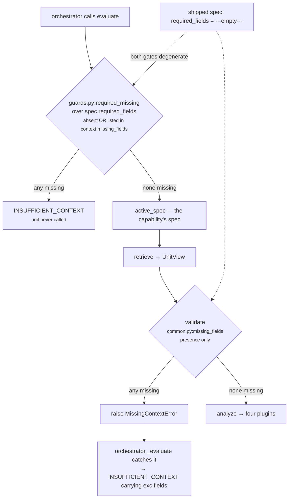

# 01 · Input and Validator — `core.scheduling`

**Stages 1 and 2 of the eight.** Neither is overridden by this unit; both are the base-class
implementations in `genios_engine/reason/unit.py`.

---

## 1 · What it is for

Stage 1 answers *what did the capability hand this unit?* Stage 2 answers *is that enough to reason
from, or should the unit refuse?*

For `core.scheduling` the answer to the second question is **it never refuses under the shipped
manifest** — and, more interestingly, refusing would be the wrong behaviour for this unit even if a
capability asked for it. A scheduling unit with no timing facts has a genuine, useful, publishable
answer: *nothing in the situation argues against acting now*. Collapsing that into
`INSUFFICIENT_CONTEXT` would throw away the only thing the unit is certain of.

---

## 2 · What exists

### 2.1 · The input pair

`unit.py:ReasoningUnit.evaluate(request, prior_results)` takes two arguments and nothing else:

| Argument | Type | Contents for `core.scheduling` |
|---|---|---|
| `request` | `contracts/reasoning.py:ReasoningRequest` | org id, the `CapabilityManifest`, the frozen `ContextSnapshot`, `evaluation_time`, `trigger_kind`, `config_snapshot_id` |
| `prior_results` | `Mapping[str, ReasonerResult]` | `{}` — the shipped spec declares `dependencies=()`, and **the module never reads `view.prior` at all** |

The unit reads these parts of the request and no others:

```text
request.evaluation_time            the frozen "now" — the only clock a unit may read
request.context.facts              via common.py:fact_value, in all four plugins
request.capability.reasoners       via active_spec, to find this unit's own ReasonerSpec
request.context.evidence           via common.py:evidence_ids, for attribution only
```

It never touches `request.context.neighbor_facts`, `request.context.missing_fields`,
`request.capability.plays`, `request.capability.policies`, `request.capability.metadata` or
`request.trigger_kind`. `UnitView.prior_metric` — the framework's dependency reader — is never
called. That makes the unit's output a pure function of `(facts, evaluation_time, config)`, which is
why it can be scheduled at any position in a capability DAG without changing its answer.

### 2.2 · The facts it looks for

Four, all optional, all resolved through a config key so a capability can rename any of them:

| Config key | Default fact | Read by | Absent behaviour |
|---|---|---|---|
| `next_interaction_field` | `calendar.next_meeting_at` | `upcoming_interaction` | plugin silent |
| `deadline_field` | `deal.close_date` | `deadline_pressure` | plugin silent |
| `last_contact_field` | `deal.last_outbound` | `cadence_spacing` | plugin silent |
| `quiet_until_field` | `schedule.quiet_until` | `quiet_window` | plugin silent |

Values are read through `common.py:fact_value`, which unwraps a `{"value": …}` record if Layer 2
supplied one and otherwise takes the raw value:

```python
def fact_value(request, field, *, neighbor=False):
    record = fact_record(request, field, neighbor=neighbor)
    return record.get("value") if isinstance(record, Mapping) and "value" in record else record
```

Verified — both fact shapes produce the identical observation:

```text
{"calendar.next_meeting_at": "<+18h iso>"}                              → against_now_bp 7,500
{"calendar.next_meeting_at": {"value": "<+18h iso>", "confidence": …}}  → against_now_bp 7,500
```

Note that a `confidence` of `0.9` cannot appear in a real snapshot: `ContextSnapshot.__post_init__`
freezes `facts` through `platform/canonical.py:canonicalize`, which raises `CanonicalizationError:
floats are forbidden in semantic artifacts`. Layer 2 writes confidence as a `Decimal` or an integer.

**The unit reads no other fact.** Not `deal.status`, not `deal.last_inbound`, not
`thread.ball_in_court`. Whether the deal is open, whether the buyer is waiting, whether anyone is
assigned — none of it changes a timing answer, and reading it would give the unit an opinion it is
not entitled to.

### 2.3 · `required_fields`

**The unit declares none of its own.** `required_fields` is not a class attribute on
`ReasoningUnit` — it lives on the per-capability `ReasonerSpec`:

```python
# contracts/reasoning.py:ReasonerSpec
required_fields: tuple[str, ...] = ()
```

`SchedulingUnit.__init__` builds a descriptor `ReasonerSpec(reasoner_id="core.scheduling",
version="1.0.0")` with the default empty tuple, but that descriptor is only the unit's identity
card. `evaluate()` calls `common.py:active_spec(request, self.unit_id)`, which scans
`request.capability.reasoners` and returns the **capability's** spec for this unit — raising
`ValueError: capability does not declare reasoner core.scheduling` if the capability never named it.

What the one shipped capability authors (`packs/capabilities/deal_cooling_v2.py:109`):

```python
_spec("core.scheduling")
#     dependencies=()   required_fields=()   config={}
#     latency_budget_ms=60   failure_policy=OPTIONAL   gating=False
```

`required_fields=()`. So the declared requirement is: nothing.

### 2.4 · `validate()` — base implementation, unchanged

```python
# unit.py:ReasoningUnit.validate
def validate(self, view: UnitView) -> None:
    absent = missing_fields(view.request, view.spec.required_fields)
    if absent:
        raise MissingContextError(*absent)
```

`SchedulingUnit` defines no `validate`. Six of the seventeen framework units override this stage;
this is not one of them.

`common.py:missing_fields` checks **presence only**, honouring a `neighbor:` prefix by looking in
`request.context.neighbor_facts` instead:

```python
for field in fields:
    if field.startswith("neighbor:"):
        if field.split(":", 1)[1] not in request.context.neighbor_facts:
            missing.append(field)
    elif field not in request.context.facts:
        missing.append(field)
return tuple(sorted(missing))
```

---

## 3 · How it works

### 3.1 · The refusal path, and why it is currently unreachable



Two gates, two different definitions of "missing", and with `required_fields=()` **both are
vacuous**. `missing_fields(request, ())` iterates an empty tuple and returns `()`, so `validate`
cannot raise. The unit is therefore reached on every run of the capability and can never produce
`ResultStatus.INSUFFICIENT_CONTEXT`.

The stricter of the two definitions lives in `guards.py:required_missing`, which also treats a field
as missing when Layer 2 explicitly listed it in `context.missing_fields`. In the orchestrated path
that gate runs first, so the unit's own validator is effectively unreachable even when
`required_fields` is non-empty. It matters mainly when the unit is invoked directly from a test.

### 3.2 · Why not overriding `validate` is the right call here

Three arguments, and the third is specific to this unit in a way that is not true of most of the
roster.

**No single fact is indispensable.** The unit forms four independent claims from four independent
facts. Any one of them alone produces a usable result; any three of them absent costs exactly the
claim that depended on the missing one. There is no field whose absence makes every claim
impossible, so there is nothing honest to put in a hard-coded requirement.

**The absence *is* the answer, and it is a strong one.** With no timing fact at all, `calculate`
returns `timing_fit_bp: 10,000` and `evaluate_meaning` adds `timing_unconstrained`. That is not a
degraded result — it is a positive, correct, load-bearing claim: *we looked at the calendar, the
close date, the last outbound and the quiet window, and none of them argues against acting now.*
Refusing would replace a measured green light with a shrug, and `ReasonerResult.__post_init__`
forbids a non-`COMPLETED` result from carrying any metrics at all, so the green light would be
unrecoverable.

Contrast `core.timeline`, which faces the same input poverty and answers `matched=None` — *we cannot
see the shape*. `core.scheduling` answers `matched=False` — *the clock does not constrain us*. The
difference is that a missing timeline makes the timeline unknowable, while a missing calendar entry
genuinely is the absence of a meeting. The unit is allowed to read "no fact" as "no constraint" here
precisely because a constraint is the kind of thing that has to be recorded to exist.

**The requirement belongs to the capability.** A capability that genuinely cannot act without a
calendar can author `required_fields=("calendar.next_meeting_at",)` in its `ReasonerSpec` and get the
refusal for free, with no code change.

### 3.3 · What a refusal would look like

If a capability author wrote:

```python
_spec("core.scheduling", required_fields=("calendar.next_meeting_at", "schedule.quiet_until"))
```

and Layer 2 supplied neither, then — verified directly:

```text
missing_fields(request, ("calendar.next_meeting_at", "schedule.quiet_until"))
    → ('calendar.next_meeting_at', 'schedule.quiet_until')        # sorted
raise MissingContextError('calendar.next_meeting_at', 'schedule.quiet_until')

orchestrator._evaluate catches MissingContextError
    → ReasonerResult(reasoner_id="core.scheduling",
                     status=ResultStatus.INSUFFICIENT_CONTEXT,
                     matched=None, metrics={}, findings=(), evidence_ids=())
```

`ReasonerSpec.__post_init__` sorts and dedupes `required_fields`, and `missing_fields` sorts its
output, so the field list in the error is deterministic regardless of authoring order.

**This would be a bad thing to author.** Under `failure_policy=OPTIONAL` the run continues with
`optional_failed:core.scheduling` in the uncertainty list and no timing metrics at all — strictly
worse than the `timing_unconstrained` result the same snapshot would otherwise have produced. The
declaration only earns its keep if the capability's whole point depends on a calendar existing.

### 3.4 · The requirement the validator would not catch

`required_fields` names a *fact*, and the unit reads its facts through *config keys*. A capability
that renames a field in config and declares the old name gets a validator guarding the wrong thing:

```python
_spec("core.scheduling",
      required_fields=("deal.close_date",),               # validated
      config={"deadline_field": "crm.renewal_date"})      # actually read
```

The run refuses when `deal.close_date` is absent, and reads `crm.renewal_date` when it is present.
Nothing connects the two declarations. This is a general property of the framework — the base
retriever and validator only know `required_fields`, and every fact name in this unit is dynamic —
but it bites harder here than in most units because *all four* of this unit's fact names are
configurable.

---

## 4 · Examples and edge cases

### 4.1 · The empty snapshot — the case the unit is designed around

```python
facts = {"deal.status": "open"}
```

No calendar, no close date, no outbound, no quiet window. Verified end to end
(`test_an_unconstrained_situation_reports_a_perfect_fit_and_says_so`):

```text
validate              → no raise (required_fields is empty)
cadence_spacing       → ()   no deal.last_outbound
deadline_pressure     → ()   no deal.close_date
quiet_window          → ()   no schedule.quiet_until
upcoming_interaction  → ()   no calendar.next_meeting_at
observations          → ()

calculate             → {timing_fit_bp: 10,000, wait_hours: 0,
                         constraint_count: 0, deadline_pressure_bp: 0}
evaluate_meaning      → Verdict(matched=False, reason_codes=('timing_unconstrained',))

result.status   == COMPLETED
result.matched  is False              ← not None, and not a refusal
result.findings == ()
```

`matched=False` with zero findings and a perfect fit is the unit's healthy state, and it is
distinguishable from every other state by `constraint_count == 0`.

### 4.2 · One fact present, three absent

```python
facts = {"deal.close_date": "<+216h iso>"}
```

```text
constraint_count 1 · deadline_pressure_bp 3,571 · timing_fit_bp 10,000 · wait_hours 0
matched False · reason_codes ('deadline_within_window',)
```

The deadline contributes pressure and a ceiling but no opposition, so the fit stays at the ceiling
and the wait stays at zero. Three silent plugins cost exactly the three claims they would have made,
and nothing else. This is the shape the shipped capability actually produces in production today —
see README §7.5.

### 4.3 · Malformed input never reaches the validator

`validate` checks *presence*, never *shape*. A field present with garbage in it passes validation and
is then treated as absent inside the plugin:

| Fact value | Passes `validate`? | Effect |
|---|---|---|
| `"next tuesday-ish"` | yes | `parse_time` raises, `_hours_ahead` returns `None`, plugin silent |
| `"2026-08-07T06:00:00"` (naive) | yes | `parse_time` raises "must be timezone-aware", plugin silent |
| `1754568000` (an epoch int) | yes | `parse_time` accepts only `datetime` or `str`, plugin silent |
| `""` | yes | not parseable, plugin silent |
| `None` | yes | `fact_value` returns `None`; the plugin's explicit `is None` guard fires |
| `"2026-08-07T06:00:00Z"` | yes | accepted — `parse_time` rewrites `Z` to `+00:00` |
| `"2026-08-07T11:30:00+05:30"` | yes | accepted — normalised to UTC, gives the same `hours_ahead: 18` |

`test_an_unparseable_meeting_timestamp_is_treated_as_absent` pins the first case with the reason:
*"bad source data must not crash a reasoning run or invent a meeting time."*

The quietest of these is `None`. A snapshot in which Layer 2 explicitly recorded
`{"schedule.quiet_until": None}` — *"we looked and there is no quiet window"* — is indistinguishable
from a snapshot in which the field was never captured. Both produce silence. For three of the four
plugins that is the right reading anyway; for `cadence_spacing`, where an explicit null could
plausibly mean "we have never written to them", the distinction would be worth something and is not
available.

### 4.4 · Bad config raises before any fact is looked at

`validate` runs before `analyze`, but the config validators live *inside* the plugins, so a malformed
key surfaces as a `ValueError` out of stage 4 or stage 6 rather than as a `MissingContextError` out
of stage 2. The orchestrator converts it to `ResultStatus.FAILED`, not `INSUFFICIENT_CONTEXT`.

Because every plugin reads its config **before** testing its fact, this happens even on a completely
empty snapshot. Verified with `facts = {}`:

| Config | Raised from | Message |
|---|---|---|
| `{"min_gap_hours": 0}` | `_config_hours`, stage 4 | `min_gap_hours must be a whole number of hours between 1 and 8760` |
| `{"interaction_horizon_hours": 0}` | `_config_hours`, stage 4 | same shape |
| `{"deadline_window_hours": 0}` | `_config_hours`, stage 4 | same shape |
| `{"deadline_urgent_bp": 20000}` | `_config_bp`, stage 4 | `deadline_urgent_bp must be integer basis points` |
| `{"next_interaction_field": "  "}` | `_config_field`, stage 4 | `next_interaction_field must be a fact name` |
| `{"timing_fit_threshold_bp": Decimal("6000")}` | `_config_bp`, stage 6 | `timing_fit_threshold_bp must be integer basis points` |
| `{"timing_fit_threshold_bp": 6000.0}` | **`canonicalize`, before the unit runs** | `floats are forbidden in semantic artifacts; use integer basis points or Decimal` |

The last row is the one worth remembering: a float in capability config never reaches this unit at
all, because `ReasonerSpec` freezes its `config` mapping at construction. See README §7.7.

The two classes of failure are meant to look different in the trace. A missing *fact* is
`INSUFFICIENT_CONTEXT` and says the situation was thin; a malformed *config value* is `FAILED` and
says the capability is misauthored.

### 4.5 · The boundary the validator does not guard

`required_fields` accepts a `neighbor:`-prefixed name and `missing_fields` honours it — verified,
`required_fields=("neighbor:account.freeze",)` on a snapshot with no neighbour facts raises
`MissingContextError('neighbor:account.freeze')`. But `core.scheduling` never reads
`context.neighbor_facts`: every read goes through `fact_value(view.request, field)` with the default
`neighbor=False`. A capability author who declared a neighbour-scoped requirement would get a
validator that refuses when the neighbour fact is absent and a unit that ignores it when it is
present. This is the framework-wide asymmetry recorded in the unit-framework README §3.1, reaching
this unit unchanged.

---

## Related

| Document | Covers |
|---|---|
| [README](README.md) | the unit's map, config keys, known problems |
| [02 · Retriever](02-Retriever.md) | what `UnitView` the validator was handed, and why `view.facts` is empty |
| [03 · Analyzer](03-Analyzer.md) | where the facts are actually read |
| [05 · Evaluator](05-Evaluator.md) | the `matched=False` verdict that stands in for a refusal |
| `genios_engine/reason/protocols.py` | `MissingContextError` |
| `genios_engine/reason/guards.py` | `required_missing`, the stricter pre-call gate |
