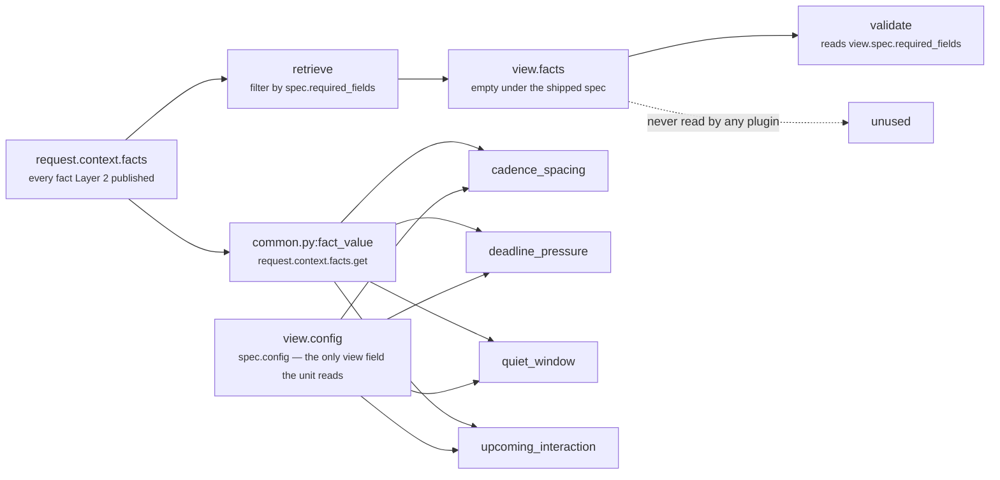

# 02 · Retriever — `core.scheduling`

**Stage 3 of the eight.** Not overridden. `core.scheduling` uses `unit.py:ReasoningUnit.retrieve`
exactly as written.

---

## 1 · What it is for

The Retriever's job is to select the slice of the frozen snapshot this unit is allowed to see, and to
hand it over as a `UnitView` — one object a reviewer can inspect to answer *what was this unit
looking at?* without reading the unit's body.

**The Retriever does not fetch.** Units are forbidden a database, network, clock, random source or
language model. Retrieval already happened when Layer 2 froze the `ContextSnapshot` and Layer 4
hashed its content into the request id. "Retrieve" here means *select and shape* from that frozen
input — the only form of retrieval that survives replay.

For this unit there is an honest complication, and it is the main content of this file: under the
shipped manifest the view is built **empty**, and the plugins read around it.

---

## 2 · What exists

### 2.1 · The base implementation, unchanged

```python
# unit.py:ReasoningUnit.retrieve
def retrieve(self, request: ReasoningRequest, spec: ReasonerSpec,
             prior: Mapping[str, ReasonerResult]) -> UnitView:
    wanted = tuple(field for field in spec.required_fields
                   if not field.startswith("neighbor:"))
    facts = {name: request.context.facts[name]
             for name in wanted if name in request.context.facts}
    evidence = tuple(sorted(item.evidence_id for item in request.context.evidence
                            if item.field in facts))
    return UnitView(request=request, spec=spec, prior=prior,
                    facts=MappingProxyType(facts), evidence_ids=evidence)
```

`SchedulingUnit` defines no `retrieve`. Three of the seventeen framework units override this stage
(`core.constraint` among them); this is not one of them.

### 2.2 · The `UnitView` it produces

| Field | Type | Contents for `core.scheduling` under the shipped spec |
|---|---|---|
| `request` | `ReasoningRequest` | the whole frozen request, passed through untouched |
| `spec` | `ReasonerSpec` | the **capability's** spec for `core.scheduling`, found by `active_spec` |
| `prior` | `Mapping[str, ReasonerResult]` | `{}` — the spec declares `dependencies=()`, and the module never reads this field anyway |
| `facts` | `MappingProxyType` | `{}` — the spec declares `required_fields=()` |
| `evidence_ids` | `tuple[str, ...]` | `()` — derived from `facts`, which is empty |

Plus one convenience property:

```python
@property
def config(self) -> Mapping[str, Any]:
    return self.spec.config
```

`view.config` is the only part of the view the unit reads heavily — all nine tuning keys go through
it, in `_config_field`, `_config_hours` and `_config_bp`.

Verified directly:

```text
request facts    {"calendar.next_meeting_at": "<+18h iso>"}
evidence         (EvidenceRef(evidence_id="ev_meet", field="calendar.next_meeting_at", …),)
spec             required_fields=()

view.facts          → {}
view.evidence_ids   → ()
result.evidence_ids → ('ev_meet',)     ← attached by the plugin, not by the retriever
```

---

## 3 · How it works

### 3.1 · The plugins bypass `view.facts` entirely

`view.facts` appears **nowhere** in `scheduling_unit.py`. Every fact read in the module goes through
`common.py:fact_value(request, field)`, which reads `request.context.facts` — the whole snapshot, not
the selected window:

```python
# the two read sites in the module, both taking view.request
def _hours_ahead(request, field):
    value = fact_value(request, field)          # upcoming_interaction, deadline_pressure, quiet_window
    ...

# CadenceSpacingPlugin.contribute
if fact_value(view.request, field) is None:     # presence check
    return ()
elapsed = elapsed_hours(view.request, field)    # common.py, also reads request.context.facts
```



**Why it is not a bug, and why it is still worth writing down.** This unit's fact set is *dynamic*.
All four field names come from config keys — `next_interaction_field`, `deadline_field`,
`last_contact_field`, `quiet_until_field` — so which facts constitute a timing constraint is decided
per capability at analysis time, not at spec-authoring time. The base retriever can only select
`required_fields`, which is a different declaration for a different purpose, and narrowing through it
would give the unit a window that lies: it would look narrow while the code reads wide.

The cost is that `UnitView`'s promise — *"a unit's inputs are visible in one place and a reviewer can
see exactly what it was allowed to look at"* — does not hold for this unit. To answer *what did
`core.scheduling` read?* you must read the four `_config_field` defaults, not the view.

`core.constraint` faced the identical tension and resolved it in the opposite direction, overriding
`retrieve` to hand back the whole snapshot explicitly, on the argument that *"any narrowing here
would be a window that lies about what the unit actually reads."* `core.scheduling` inherits the
narrow window and reads around it. Both are defensible; only one of them is legible from the code.

### 3.2 · The slice the unit actually selects

Stated plainly, `core.scheduling`'s real retrieval is four fact reads and one clock read, all inside
stage 4:

```text
from request.context.facts:
    <next_interaction_field>   default calendar.next_meeting_at   → a future instant, or nothing
    <deadline_field>           default deal.close_date            → a future instant, or nothing
    <last_contact_field>       default deal.last_outbound         → a past instant, or nothing
    <quiet_until_field>        default schedule.quiet_until       → a future instant, or nothing

from request:
    evaluation_time            the frozen "now"; every interval is measured against it

from request.context.evidence:
    evidence_ids whose .field equals the field a firing plugin read
```

Nothing else. Four facts, one clock, and — uniquely in the roster — no prior result at all.

### 3.3 · The two clock helpers, and why the unit needed a second one

`common.py:elapsed_hours` measures *backwards* and refuses a future timestamp:

```python
def elapsed_hours(request, field) -> int:
    occurred = parse_time(fact_value(request, field), field)
    seconds = int((request.evaluation_time - occurred).total_seconds())
    if seconds < 0:
        raise ValueError(f"{field} is in the future")
    return seconds // 3600
```

Three of this unit's four constraints are *ahead* of us, so the module defines the mirror image
locally:

```python
def _hours_ahead(request: ReasoningRequest, field: str) -> int | None:
    value = fact_value(request, field)
    if value is None:
        return None
    try:
        moment = parse_time(value, field)
    except ValueError:
        return None
    seconds = int((moment - request.evaluation_time).total_seconds())
    return None if seconds <= 0 else seconds // 3600
```

The docstring is precise about what `None` means and why it must not become a number:

> *None means "this is not a future constraint" — absent, unparseable, or already past — and the
> caller must then say nothing rather than substitute a zero, which would read downstream as "it is
> happening right now".*

Three collapses into one sentinel:

| Situation | `_hours_ahead` |
|---|---|
| fact absent, or `None` | `None` |
| fact present but unparseable, naive, or not a `str`/`datetime` | `None` (the `ValueError` is swallowed) |
| fact present and at or before `evaluation_time` | `None` (`seconds <= 0`) |
| fact present and in the future | `seconds // 3600`, so `0` for anything under an hour |

Two consequences follow, and only the first is documented in the module.

**`elapsed_hours` raises where `_hours_ahead` returns.** `CadenceSpacingPlugin` therefore has to
catch: a `deal.last_outbound` stamped in the future raises out of `elapsed_hours` and is caught with
the comment *"we cannot measure the gap, so we do not claim one. Guessing here would suppress a
legitimate follow-up on bad source data."* Verified: `deal.last_outbound = evaluation_time + 4h`
produces silence, not a maximum-crowding observation.

**The floor is the source of the sub-hour bug.** `seconds // 3600` on a meeting 59 minutes away
returns `0`, which every plugin reads as "at this instant" — maximum urgency, zero wait. Verified in
README §7.2.

### 3.4 · Which evidence ids land where

Evidence is attached by the plugins through `common.py:evidence_ids`, never by the retriever:

```python
# common.py
def evidence_ids(request, *fields):
    wanted = set(fields)
    return tuple(sorted(item.evidence_id for item in request.context.evidence
                        if item.field in wanted))
```

Each plugin cites exactly one field — its own:

| Plugin | Cites | Result |
|---|---|---|
| `cadence_spacing` | `evidence_ids(view.request, last_contact_field)` | evidence for the outbound timestamp |
| `deadline_pressure` | `evidence_ids(view.request, deadline_field)` | evidence for the close date |
| `quiet_window` | `evidence_ids(view.request, quiet_until_field)` | evidence for the quiet-until stamp |
| `upcoming_interaction` | `evidence_ids(view.request, next_interaction_field)` | evidence for the meeting time |

This is the tightest attribution in Category 3 — one claim, one fact, one evidence set — and it is
right, because each observation is a statement about exactly one moment. Verified on a snapshot with
three facts and one evidence row each:

```text
facts     calendar.next_meeting_at +18h   → ev_meet
          deal.close_date          +84h   → ev_close
          deal.status              open   → ev_status

finding scheduling.deadline_pressure      evidence_ids ('ev_close',)
finding scheduling.upcoming_interaction   evidence_ids ('ev_meet',)
result.evidence_ids                       ('ev_close', 'ev_meet')
```

`ev_status` is attached to nothing: `deal.status` is not a field this unit reads, so no observation
cites it and the empty `view.evidence_ids` contributes nothing to the union.
`test_the_evidence_behind_a_constraint_travels_with_the_result` pins the mechanism with the reason:
*"a timing claim with no evidence id cannot be replayed or challenged."*

### 3.5 · Two known limits of the evidence match

**`context_scope` is ignored.** `EvidenceRef` carries `context_scope` of `"root"` or `"neighbor"`;
`common.py:evidence_ids` matches only on `item.field in wanted`. A neighbour-scoped evidence row
whose field name collided with one of this unit's four fields would be attached as though the unit
had observed it. Harmless today because no shipped capability has a colliding name; it is the
framework-wide issue recorded in the unit-framework README §3.1.

**A firing plugin with no evidence row is silent about it.** `evidence_ids` returns `()` when nothing
matches, and `Observation.__post_init__` accepts an empty tuple without complaint. A snapshot whose
`calendar.next_meeting_at` was written with no accompanying `EvidenceRef` produces a fully-formed
timing claim citing nothing — the claim is still deterministic and replayable from the snapshot, but
it cannot be traced to a source row. Nothing in the unit flags the difference between "no evidence
exists" and "evidence exists and I cited it".

---

## 4 · Examples and edge cases

### 4.1 · A capability that does declare required fields

```python
_spec("core.scheduling", required_fields=("calendar.next_meeting_at",))
```

Now the retriever does something visible. Verified:

```text
wanted            = ('calendar.next_meeting_at',)
view.facts        = {'calendar.next_meeting_at': '2026-08-07T06:00:00+00:00'}
view.evidence_ids = ('ev_meet',)                # rows whose .field is calendar.next_meeting_at
view.prior        = {}
```

`build` unions `view.evidence_ids` with the observation evidence. Because `upcoming_interaction`
already cites `calendar.next_meeting_at`, the union is the same set — the declaration changes what
the view records, not what the result carries.

The only case where a declared field would *add* an evidence id is one where the field is required
but its plugin stays silent: a required `calendar.next_meeting_at` holding a past or malformed
timestamp, whose evidence row reaches `result.evidence_ids` through the view while contributing
nothing to the reasoning. That produces a result citing evidence for a claim it did not make.

### 4.2 · Renaming every field in config

The retriever is untouched by this — it only ever knows `required_fields` — but it is the case that
shows why the view is empty by design. Verified:

```python
config = {"deadline_field": "crm.renewal_date",
          "last_contact_field": "ticket.last_reply",
          "min_gap_hours": 12}
facts  = {"crm.renewal_date": "<+84h iso>", "ticket.last_reply": "<-6h iso>"}
```

```text
view.facts        = {}                     ← unchanged; required_fields is still empty
timing_fit_bp     = 8,750                  ← 10,000 − 5,000 (cadence) + 3,750 (relief)
wait_hours        = 6
constraint_count  = 2
deadline_pressure_bp = 7,500
reason_codes      ('act_before_deadline', 'deadline_within_window', 'too_soon_after_last_contact')
```

Two constraints measured, from two facts the retriever never selected, under names no default
mentions. That is the unit working correctly and the `UnitView` telling a reviewer nothing about it.

### 4.3 · `prior` is structurally unused

`view.prior` is `{}` under the shipped spec because `dependencies=()`, and unlike `core.timeline` —
whose `prior_metric("core.temporal", "drop_bp", 0)` is a *live read that silently returns its default*
— this unit has no consumer at all. `prior_metric` is never called. There is therefore no
under-wiring failure mode available here: no reason code can go dark because a dependency was not
declared, and adding dependencies to the spec would change nothing but the DAG's shape.

That is a property worth keeping. Three of the five Optimization units have a dependency-shaped hole
in the shipped manifest (Category 3 README §3.4); `core.scheduling` has none, because it never
reaches for another unit's number.

### 4.4 · What the base retriever does with a `neighbor:` field

```python
required_fields = ("neighbor:account.freeze_until",)
```

```text
retrieve:  wanted = ()                     ← the neighbor: prefix is filtered out of selection
           view.facts = {}
validate:  missing_fields honours the prefix and checks request.context.neighbor_facts
           → raises MissingContextError('neighbor:account.freeze_until') when absent
analyze:   every plugin reads request.context.facts with neighbor=False
           → the neighbour fact is invisible even when present
```

The declaration is validated, never selected, and never read. Covered in `01` §4.5 and in the
unit-framework README §3.1.

---

## Related

| Document | Covers |
|---|---|
| [README](README.md) | the unit's map and config keys |
| [01 · Input and Validator](01-Input-and-Validator.md) | why `required_fields` is empty in the shipped spec |
| [03 · Analyzer](03-Analyzer.md) | `_hours_ahead` and the four fact reads — where retrieval really happens |
| [README · Builder and Metrics](README.md) | how `view.evidence_ids` and observation evidence are unioned |
| Unit framework README §3.1 | the base retriever's three consequences, `neighbor:` included |
