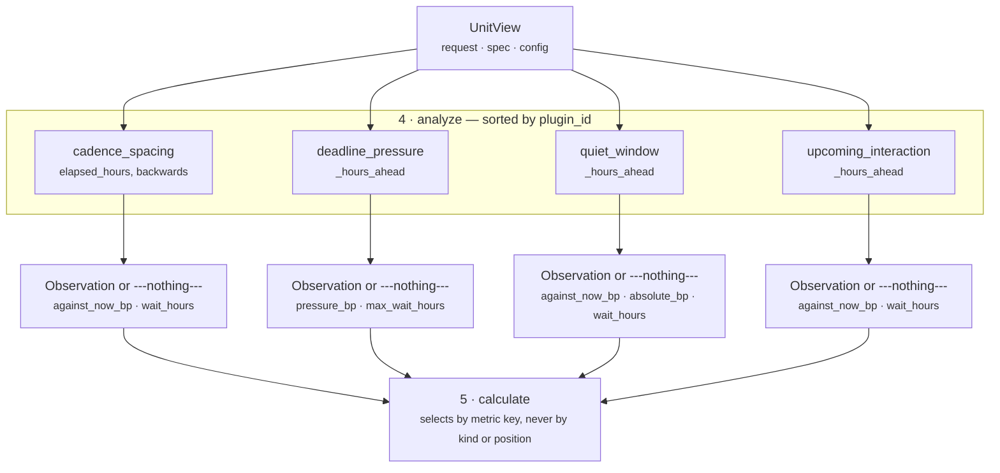
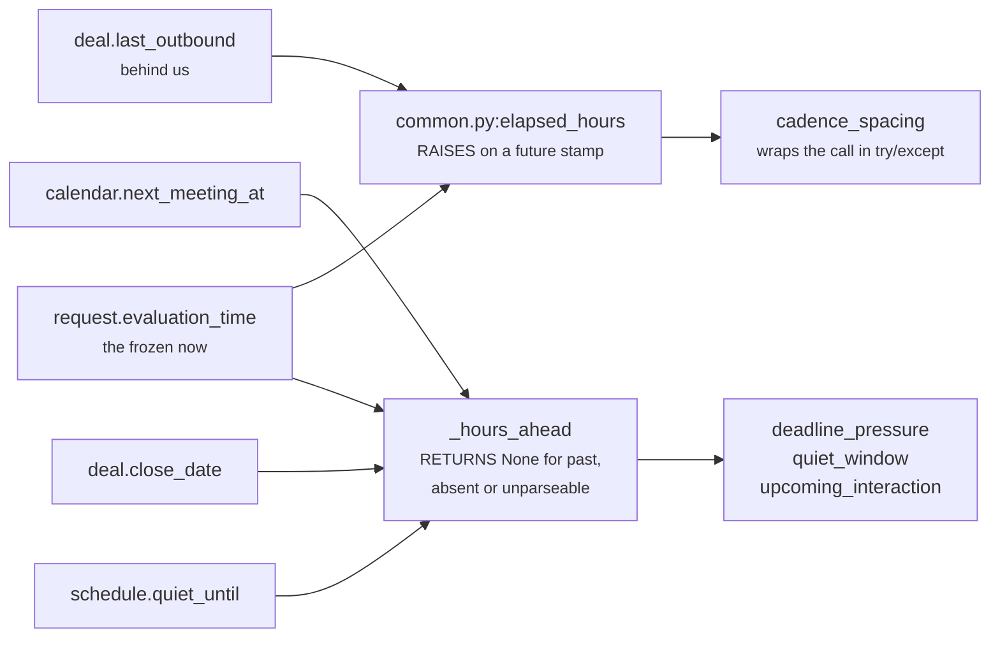

# 03 · Analyzer — `core.scheduling`

**Stage 4 of the eight.** Not overridden. `core.scheduling` uses `unit.py:ReasoningUnit.analyze`
exactly as written. The unit's intellectual property lives in the four plugins it registers, and this
file is about how they compose.

---

## 1 · What it is for

The Analyzer is the plugin seam. Its job is to turn one bounded view of a frozen situation into a
tuple of `Observation`s — small, deterministic, conclusion-free partial claims — and to do it in an
order that is a property of the unit's composition rather than of whoever last edited the class body.

For this unit the seam is doing something specific: **four different kinds of "not now", measured
from four different facts, that must not be allowed to add up.** Folding them into one "timing score"
inside a single plugin would lose the distinction the Calculator depends on — that three of them
oppose acting now and one of them opposes waiting, and that exactly one of them is absolute.

---

## 2 · What exists

### 2.1 · The base implementation, unchanged

```python
# unit.py:ReasoningUnit.analyze
def analyze(self, view: UnitView) -> tuple[Observation, ...]:
    observations: list[Observation] = []
    for plugin in sorted(self.plugins, key=lambda item: item.plugin_id):
        observations.extend(plugin.contribute(view))
    return tuple(observations)
```

No unit in the roster overrides this stage.

### 2.2 · The registration, and the order it actually runs in

```python
class SchedulingUnit(ReasoningUnit):
    plugins = (UpcomingInteractionPlugin(), DeadlinePressurePlugin(),
               CadenceSpacingPlugin(), QuietWindowPlugin())
```

```text
registration order:  upcoming_interaction · deadline_pressure · cadence_spacing · quiet_window
execution order:     cadence_spacing · deadline_pressure · quiet_window · upcoming_interaction
```

Alphabetical, because `analyze` sorts on `plugin_id`. `ReasoningUnit.__init__` refuses a duplicate
`plugin_id` at construction — *"a unit that registers a duplicate analyzer plugin"* — which is what
keeps the sort total and therefore keeps every hash below it stable.

**Four plugins.** `core.scheduling` is the only unit in the seventeen that registers more than
three (unit-framework README §2.3: *"Sixteen framework units register exactly three plugins;
`core.scheduling` registers four"*). There is no framework rule about the count; four exists because
four distinct facts carry four distinct timing constraints and none of them subsumes another.

### 2.3 · What each plugin contributes

| Plugin (execution order) | `kind` | Metrics it emits | Reason codes |
|---|---|---|---|
| `cadence_spacing` | `scheduling.cadence_spacing` | `against_now_bp`, `elapsed_hours`, `wait_hours` | `too_soon_after_last_contact` |
| `deadline_pressure` | `scheduling.deadline_pressure` | `pressure_bp`, `hours_left`, `max_wait_hours` | `deadline_within_window` (+ `act_before_deadline`) |
| `quiet_window` | `scheduling.quiet_window` | `against_now_bp`, **`absolute_bp`**, `hours_remaining`, `wait_hours` | `inside_quiet_period` |
| `upcoming_interaction` | `scheduling.upcoming_interaction` | `against_now_bp`, `hours_ahead`, `wait_hours` | `defer_until_after_meeting` |

Every plugin returns either exactly one observation or an empty tuple. None of them can return two.

### 2.4 · The shared helpers

Four module-level functions do all the work the plugins have in common:

| Symbol | Purpose |
|---|---|
| `scheduling_unit.py:_config_field(view, key, default)` | resolve and validate a fact name; raises `ValueError: <key> must be a fact name` on a non-string or blank |
| `scheduling_unit.py:_config_hours(view, key, default)` | resolve and validate a whole-hours knob, `1..8_760`; `bool` rejected first |
| `scheduling_unit.py:_config_bp(view, key, default)` | resolve and validate integer basis points, `0..10_000`; `bool` rejected first |
| `scheduling_unit.py:_hours_ahead(request, field)` | whole hours until a future fact, or `None` for absent / unparseable / already past |

plus `common.py:elapsed_hours` (backwards, raises on a future stamp), `common.py:clamp_bp`,
`common.py:divide_half_up` and `common.py:evidence_ids`.

---

## 3 · How it works

### 3.1 · The seam



**The plugins do not communicate.** There is no shared cache, no ordering dependency, no plugin that
reads another's output. Each opens `view.config`, resolves one fact name, reads one fact, and either
speaks or does not. Running them in reverse order would produce the same four observations in a
different sequence and the same metrics out of `calculate`.

**Execution order still matters, for one reason.** The observation tuple's order becomes the finding
tuple's order in `evaluate_meaning`, and findings reach `ReasonerResult.semantic_hash`. Sorting on
`plugin_id` makes that order a property of the composition rather than of registration order — and
registration order is whatever the class body happened to say the day someone added a plugin.

### 3.2 · How the plugins interact — through the metric vocabulary, not through each other

This is the design decision that makes four independent plugins compose into one coherent answer. The
Calculator never asks *which plugin produced this*; it asks *what shape of claim is this*, by looking
for a metric key:

```python
opposition = max((int(item.metrics.get("against_now_bp", 0)) for item in observations), default=0)
pressure   = max((int(item.metrics.get("pressure_bp",   0)) for item in observations), default=0)
absolute   = any("absolute_bp" in item.metrics for item in observations)
demanded   = max((int(item.metrics["wait_hours"])     for item in observations
                  if "wait_hours"     in item.metrics), default=0)
ceilings   = [int(item.metrics["max_wait_hours"])     for item in observations
              if "max_wait_hours" in item.metrics]
```

So the four metric names are a small, load-bearing protocol between the Analyzer and the Calculator:

| Metric key | Means | Emitted by | Calculator does |
|---|---|---|---|
| `against_now_bp` | this argues against acting **now** | cadence, quiet, interaction | takes the **max** — the binding objection |
| `pressure_bp` | this argues against **waiting** | deadline | takes the **max**, halves it, adds it back as relief |
| `absolute_bp` | this is a boundary, not a preference | quiet only | its **presence** withdraws all relief; the value is never read |
| `wait_hours` | how long until this constraint clears | cadence, quiet, interaction | takes the **max** — a window opens only when all have cleared |
| `max_wait_hours` | this constraint will not wait longer than this | deadline | takes the **min** — the earliest deadline binds |

Two things follow from this being a vocabulary rather than a switch statement.

**A fifth plugin needs no Calculator change.** A hypothetical `regulatory_freeze` plugin emitting
`against_now_bp` and `absolute_bp` would compose correctly on the day it was registered, without
anybody editing `calculate`. It would need a line in `publishes` only if it wanted a new metric name
in the result.

**A plugin can change the whole answer by emitting one extra key.** `absolute_bp` is the sharpest
example. Its value is `10_000` and is never read; the source comment is explicit:

> *`absolute_bp` is the marker the calculator looks for: its presence, not its size, is what
> withdraws deadline relief.*

A plugin author who added `absolute_bp` to `cadence_spacing` "for symmetry" would silently make every
recently-contacted account immune to deadline relief. Nothing in the code or the tests would catch
it.

### 3.3 · Silence, and why every plugin has more silent paths than speaking ones

Every plugin returns `()` far more often than it speaks. Counted across the four:

| Silence | Plugins that have it |
|---|---|
| the fact is absent | all four |
| the fact is present but unparseable, naive, or not a `str`/`datetime` | all four |
| the fact is on the wrong side of `evaluation_time` | all four (past for the three forward-looking; future for cadence) |
| the constraint exists but has cleared / is out of range | `cadence_spacing` (`elapsed >= min_gap`), `deadline_pressure` (`left >= window`), `upcoming_interaction` (`ahead > horizon`) |

`quiet_window` is the only plugin with no range check at all: a quiet window nine months out is still
a quiet window, so any future stamp fires at full strength.

The unit's own framing, from the module docstring, is the reason all of these are `()` rather than a
zero-valued observation:

> *A constraint this unit cannot evidence is a constraint it stays silent about — an invented "wait
> 24 hours" is worse than no timing advice at all, because it is indistinguishable from a measured
> one.*

The mechanism that makes this load-bearing is `constraint_count = len(observations)`. Three silent
plugins produce `constraint_count: 1`; three plugins each reporting `against_now_bp: 0` would produce
the same `timing_fit_bp` with `constraint_count: 4`, which downstream reads as *four constraints were
found and none of them bites* — a materially different claim from *one constraint was found*.

**And one plugin breaks the rule.** `upcoming_interaction` uses `ahead > horizon` where the other two
range-checked plugins use `>=`, so a meeting at exactly the horizon emits `against_now_bp: 0` and
inflates `constraint_count` by one while publishing `wait_hours = 72`. README §7.1.

### 3.4 · The two clocks, and the asymmetry between them



The two helpers report failure differently — one raises, one returns `None` — because they were
written for different callers. `elapsed_hours` is shared across the roster and its future-stamp
`ValueError` is meaningful to units that want to fail on corrupt data. `_hours_ahead` is local to
this unit and folds three distinct failures into one sentinel because this unit's response to all
three is identical: say nothing.

The consequence is a shape difference in the plugins. Three of them read
`if ahead is None: return ()`; the fourth needs a two-step guard:

```python
if fact_value(view.request, field) is None:
    return ()                                    # absent
try:
    elapsed = elapsed_hours(view.request, field)
except ValueError:
    return ()                                    # unparseable, or stamped in the future
```

Both branches exist and both are exercised — verified, `deal.last_outbound = evaluation_time + 4h`
returns `()` rather than raising out of `analyze` and failing the whole run.

### 3.5 · Where config is validated

Every plugin reads and validates its config keys **before** it looks at any fact. That is not
incidental — it means a misauthored capability fails on its first evaluation regardless of what the
snapshot contains:

```python
def contribute(self, view: UnitView) -> tuple[Observation, ...]:
    field = _config_field(view, "deadline_field", "deal.close_date")
    window = _config_hours(view, "deadline_window_hours", 336)
    urgent_bp = _config_bp(view, "deadline_urgent_bp", 7_500)
    left = _hours_ahead(view.request, field)          # ← the fact is read only after all three
    if left is None or left >= window:
        return ()
```

Verified on a completely empty snapshot: `{"deadline_window_hours": 0}` with `facts = {}` raises
`ValueError: deadline_window_hours must be a whole number of hours between 1 and 8760`. Compare
`core.timeline`, whose `corroborating_drop_bp` is read inside a conditional branch and can therefore
sit misauthored in a shipped capability until the first run that happens to take that branch
(`core.timeline` README §7.8). `core.scheduling` has no lazy config read anywhere.

The one config key that is *not* read here is `timing_fit_threshold_bp`, which belongs to stage 6 and
is read unconditionally at the top of `evaluate_meaning` — so it too is validated on every run.

---

## 4 · Examples and edge cases

### 4.1 · All four speaking at once

```python
facts = {"calendar.next_meeting_at": "<+2h>",   "deal.last_outbound": "<-1h>",
         "deal.close_date":          "<+48h>",  "schedule.quiet_until": "<+10h>"}
```

`analyze` returns four observations, in `plugin_id` order. Verified:

```text
1  scheduling.cadence_spacing        {against_now_bp: 9_792, elapsed_hours: 1,  wait_hours: 47}
2  scheduling.deadline_pressure      {pressure_bp:    8_571, hours_left:   48, max_wait_hours: 48}
3  scheduling.quiet_window           {against_now_bp: 10_000, absolute_bp: 10_000,
                                      hours_remaining: 10, wait_hours: 10}
4  scheduling.upcoming_interaction   {against_now_bp: 9_722, hours_ahead:  2,  wait_hours:  2}

→ calculate: opposition 10_000 · pressure 8_571 · absolute True · relief 0
             demanded max(47, 10, 2) = 47 · ceiling min(48) = 48 · wait = 47
             timing_fit_bp 0 · wait_hours 47 · constraint_count 4 · deadline_pressure_bp 8_571
```

Note what the vocabulary did without any plugin knowing about any other: the quiet window's
`absolute_bp` cancelled 4,286bp of relief the deadline had earned, and the cadence plugin's 47-hour
wait outlasted the quiet window's own 10 hours. Four independent claims, one coherent window.

### 4.2 · All four silent

```python
facts = {"deal.status": "open"}
```

```text
analyze → ()
calculate → {timing_fit_bp: 10_000, wait_hours: 0, constraint_count: 0, deadline_pressure_bp: 0}
```

Every `max(..., default=0)` and the `_wait_window` defaults exist for exactly this case:
`max(())` would raise, `default=0` makes an empty analysis produce an unopposed, unpressured,
unbounded now. `ceilings` is `[]`, so `_wait_window` returns `(0, None)` and `calculate` takes the
`ceiling is None` branch rather than calling `min` on an empty list.

### 4.3 · The one plugin that fires without opposing

```python
facts = {"deal.close_date": "<+84h>"}
```

```text
analyze → (scheduling.deadline_pressure {pressure_bp: 7_500, hours_left: 84, max_wait_hours: 84},)

opposition = max(metrics.get("against_now_bp", 0)) = 0     ← the key is absent, the default is used
pressure   = 7_500
relief     = divide_half_up(7_500, 2) = 3_750
timing_fit_bp = clamp_bp(10_000 − 0 + 3_750) = 10_000      ← clamped, not 13_750
wait_hours    = min(demanded 0, ceiling 84) = 0
constraint_count = 1
```

A constraint was counted, a pressure was published, and the timing fit did not move — because there
was nothing for the relief to relieve. `test_a_closing_deadline_creates_pressure_but_never_opposes_acting_now`
asserts `"against_now_bp" not in observation.metrics`, which is the assertion that keeps this true.

### 4.4 · A plugin returning `()` versus returning a zero

The difference is visible only in `constraint_count`, and it is the whole reason the silence
convention exists. Contrived side by side:

| Snapshot | Observations | `timing_fit_bp` | `constraint_count` | Reads as |
|---|---|---|---|---|
| no timing facts at all | `()` | 10,000 | **0** | nothing was measured — `timing_unconstrained` |
| meeting at exactly +72h | one, `against_now_bp: 0` | 10,000 | **1** | one constraint was measured and it does not bite |
| meeting at +73h | `()` | 10,000 | **0** | nothing was measured |

Rows one and three are the same claim reached honestly. Row two is the bug in README §7.1: the
numbers are identical to row one but it also publishes `wait_hours: 72`, which rows one and three
correctly report as `0`.

### 4.5 · Determinism

`test_the_same_situation_reasons_identically_twice` asserts equal `metrics`, equal `reason_codes` and
equal `semantic_hash` across two evaluations of the same request. Four properties of this stage make
that a real assertion rather than a tautology:

- **No clock.** Every interval is measured against `request.evaluation_time`, which is an input.
  `test_no_unit_reaches_for_a_clock_or_a_database` in `test_unit_roster.py` scans the module for
  `datetime.now`, `time.time`, `random.`, `os.environ`, `requests.`, `sqlalchemy`, `openai`,
  `anthropic` — none present.
- **No prior result.** `view.prior` is never read, so no upstream unit's timing can perturb this one.
- **Total plugin order.** `sorted(plugins, key=plugin_id)` with ids proven unique at construction.
- **Integer arithmetic only.** `divide_half_up` rounds half-up deterministically on every machine,
  and `Observation.__post_init__` rejects any non-`int` metric — including `bool`, explicitly,
  because `isinstance(True, int)` is `True` in Python.

---

## Related

| Document | Covers |
|---|---|
| [README](README.md) | the unit's map, the plugin table, known problems |
| [03a · `cadence_spacing`](03a-plugin-cadence_spacing.md) | the only plugin that measures backwards |
| [03b · `deadline_pressure`](03b-plugin-deadline_pressure.md) | the only plugin that emits `pressure_bp` and `max_wait_hours` |
| [03c · `quiet_window`](03c-plugin-quiet_window.md) | the only plugin that emits `absolute_bp` |
| [03d · `upcoming_interaction`](03d-plugin-upcoming_interaction.md) | the horizon, and its off-by-one boundary |
| [04 · Calculator](04-Calculator.md) | how the five metric keys are folded into four published numbers |
| Unit framework README §4.2 | why plugins, and what an `Observation` is allowed to say |
