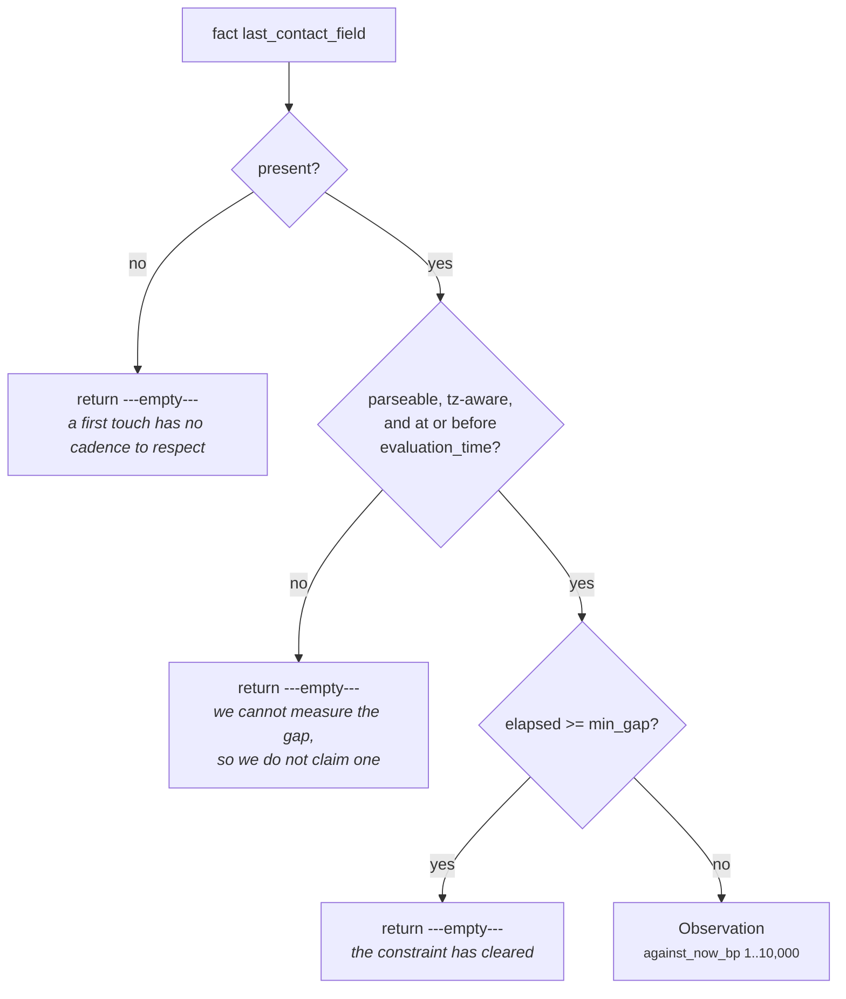

# 03a · Plugin `cadence_spacing`

**Class:** `scheduling_unit.py:CadenceSpacingPlugin`
**`plugin_id`:** `cadence_spacing`
**Observation `kind`:** `scheduling.cadence_spacing`
**Executes:** first of four (alphabetically)
**Default fact:** `deal.last_outbound`

---

## 1 · The claim it makes

*We wrote to them recently, and writing again this soon reads as pressure.*

The class docstring makes two arguments, and the second is the one that decides the plugin's shape:

> *Cadence is the difference between persistence and harassment, and it is not a property of our
> urgency — it is a property of how long ago **they** last heard from us. The gap is declared per
> capability in Layer 3 rather than inferred, because the right spacing for an enterprise renewal and
> for a support escalation are hours apart and no formula recovers that from the snapshot.*

Two consequences follow.

**The measurement is of our own outbound, not of their inbound.** The default fact is
`deal.last_outbound`. Whether the buyer replied is somebody else's question — `core.opportunity`
answers it with `unanswered_inbound`. This plugin asks only: how long since *we* spoke, and is that
long enough that speaking again is not crowding.

**The gap is declared, never observed.** The plugin does not look at the historical rhythm of the
relationship and infer a norm. `core.timeline`'s `event_ordering` publishes `gap_hours` — the median
observed gap — and a plugin that used *that* as the yardstick would be measuring the relationship
against its own habits, which is a weaker claim and a different one. A declared minimum gap is a
statement of business intent, which is why breaching it means something an operator can act on.

This is the plugin that turned out to be the **binding** objection in the unit's own flagship
scenario — stronger than the meeting the scenario is named after. See §4.4.

---

## 2 · What exists

```python
class CadenceSpacingPlugin:
    plugin_id = "cadence_spacing"

    def contribute(self, view: UnitView) -> tuple[Observation, ...]:
        field = _config_field(view, "last_contact_field", "deal.last_outbound")
        min_gap = _config_hours(view, "min_gap_hours", 48)
        if fact_value(view.request, field) is None:
            return ()
        try:
            elapsed = elapsed_hours(view.request, field)
        except ValueError:
            # Unparseable, or stamped in the future: we cannot measure the gap, so we do not claim
            # one. Guessing here would suppress a legitimate follow-up on bad source data.
            return ()
        if elapsed >= min_gap:
            return ()
        crowding_bp = clamp_bp(10_000 - divide_half_up(elapsed * 10_000, min_gap))
        return (Observation(
            plugin_id=self.plugin_id,
            kind="scheduling.cadence_spacing",
            metrics={"against_now_bp": crowding_bp, "elapsed_hours": elapsed,
                     "wait_hours": min_gap - elapsed},
            evidence_ids=evidence_ids(view.request, field),
            reason_codes=("too_soon_after_last_contact",),
        ),)
```

### 2.1 · Inputs

| Source | Name | Type | Range |
|---|---|---|---|
| config | `last_contact_field` | `str`, non-blank | any fact name; default `"deal.last_outbound"` |
| config | `min_gap_hours` | `int` | `1..8_760`; default `48` |
| fact | whatever `last_contact_field` names | ISO-8601 `str` or `datetime`, timezone-aware | at or before `evaluation_time` |
| derived | `request.evaluation_time` | `datetime` | the frozen "now" |

### 2.2 · Outputs

| Metric | Range | Meaning |
|---|---|---|
| `against_now_bp` | `1..10000` | how much of the declared gap is still unspent — the crowding |
| `elapsed_hours` | `0..min_gap−1` | whole hours since we last wrote |
| `wait_hours` | `1..min_gap` | `min_gap − elapsed`, the remaining gap |

| Reason code | When |
|---|---|
| `too_soon_after_last_contact` | always, when the plugin speaks at all |

There is no on-track counterpart. A gap that has cleared produces silence, not a positive
observation — the opposite choice from `core.timeline`'s `cadence_adherence`, which emits
`cadence_on_track`. §5.2 argues both.

Evidence: `evidence_ids(view.request, field)` — the evidence rows for the single fact this plugin
read.

---

## 3 · How it works

### 3.1 · The arithmetic

```text
elapsed     = (evaluation_time − last_outbound).total_seconds() // 3600     # truncated whole hours
crowding_bp = clamp_bp(10,000 − divide_half_up(elapsed × 10,000, min_gap))
wait_hours  = min_gap − elapsed

divide_half_up(n, d) = (n + d // 2) // d          for n >= 0
clamp_bp(v)          = min(10_000, max(0, int(v)))
```

One linear ramp, from full crowding at the instant we sent to nothing at the declared gap. Three
decisions are encoded in three lines.

**The ramp is linear, not a step.** Writing again one hour after an email and writing again 47 hours
into a 48-hour gap are both technically "too soon", and treating them identically would make the
metric useless for ranking one against the other. `208bp` of crowding at 47 hours is the honest
reading: a constraint that has almost cleared.

**`clamp_bp` cannot bind on the upper end.** `elapsed < min_gap` is guaranteed by the guard above it,
so `divide_half_up(elapsed × 10,000, min_gap)` is strictly below `10,000` and `crowding_bp` is
strictly above `0`. The clamp is defensive, not functional — the plugin can never emit a zero-strength
observation, which is precisely the property `upcoming_interaction` lacks (README §7.1).

**Rounding is half-up, not truncating.** `divide_half_up` is `(n + d//2) // d`, deterministic on
every machine and hand-verifiable from a trace. One hour into a 48-hour gap gives
`(10,000 + 24) // 48 = 208`, so `crowding_bp = 9,792` — the true ratio is 208.33, rounded down; the
complement is rounded up.

### 3.2 · The full curve, at the default 48-hour gap

| `elapsed_hours` | `against_now_bp` | `wait_hours` | Reading |
|---|---|---|---|
| 0 | **10,000** | 48 | we sent within the hour |
| 1 | 9,792 | 47 | |
| 3 | 9,375 | 45 | |
| 6 | **8,750** | 42 | we wrote this morning — the flagship scenario |
| 12 | 7,500 | 36 | |
| 18 | 6,250 | 30 | |
| 24 | **5,000** | 24 | one day: exactly half the gap spent |
| 30 | 3,750 | 18 | |
| 36 | 2,500 | 12 | |
| 42 | 1,250 | 6 | |
| 47 | 208 | 1 | the last hour before it clears |
| 48 | *silent* | — | the gap has been respected |
| 60 | *silent* | — | |

Every value in this table is computed from the formula and the 6h, 24h and 47h rows are verified
directly against the code.

### 3.3 · Why silence rather than an on-track observation



The docstring states the rule the whole unit follows and this plugin implements exactly:

> *Silence when the gap has already been respected is deliberate: a constraint that has cleared is
> not an observation, and emitting a zero-strength one would inflate the constraint count.*

`constraint_count` is `len(observations)`. A respected gap emitting `against_now_bp: 0` would leave
`timing_fit_bp` unchanged at 10,000 while raising `constraint_count`, and a reader would see *"two
constraints were found and neither bites"* where the truth is *"one constraint was found"*.

Contrast `core.timeline:CadenceAdherencePlugin`, which deliberately *does* emit `cadence_on_track`,
on the argument that *"a healthy rhythm is a real observation; suppressing it would make health
unprovable."* The two units are asking different questions. `core.timeline` is describing the shape
of a relationship, where "the rhythm is healthy" is a finding worth publishing. `core.scheduling` is
answering *may we act now*, where a cleared constraint is not an answer, it is the absence of an
objection — and the unit already has a way to say "nothing is in the way": `constraint_count: 0`.

### 3.4 · Why a future timestamp produces silence rather than a failure

`elapsed_hours` raises `ValueError: <field> is in the future` on a timestamp ahead of
`evaluation_time`. The plugin catches it with a comment that is worth reading as policy, not as
defensive coding:

> *Unparseable, or stamped in the future: we cannot measure the gap, so we do not claim one. Guessing
> here would suppress a legitimate follow-up on bad source data.*

The failure being avoided is specific. If the plugin swallowed a future stamp as `elapsed = 0`, a
clock-skewed CRM export would produce maximum crowding on every deal it touched, and the system would
go quiet on a whole book of business because one integration wrote timestamps in the wrong timezone.
The safe direction on unreadable data is *fewer constraints*, not more — because a fabricated
constraint suppresses work, and the unit's whole premise is that suppressing work needs evidence.

Verified: `deal.last_outbound = evaluation_time + 4h` returns `()`, and does not raise out of
`analyze`.

### 3.5 · Config keys

| Key | Type | Default | Effect |
|---|---|---|---|
| `last_contact_field` | `str`, non-blank | `"deal.last_outbound"` | which fact carries our last outbound |
| `min_gap_hours` | `int`, `1..8_760` | `48` | the declared minimum spacing; also the maximum `wait_hours` this plugin can demand |

Both are read **before** the fact, so a bad value raises on an empty snapshot. Verified:

```text
{"min_gap_hours": 0}     → ValueError: min_gap_hours must be a whole number of hours between 1 and 8760
{"min_gap_hours": 8761}  → same
{"min_gap_hours": True}  → same (bool is rejected before the int check)
{"last_contact_field": "  "} → ValueError: last_contact_field must be a fact name
```

`min_gap_hours` is the knob the docstring says belongs to Layer 3, and the test that pins it is named
for the reason: `test_a_capability_can_declare_its_own_cadence_gap` — *"enterprise renewals and
support escalations are hours apart; Layer 3 owns that number."*

**Untuned.** `48` is authored from domain reasoning, not fitted to outcome data. Nothing in the repo
has calibrated it against a reply-rate or a complaint-rate, and the one shipped capability overrides
it with nothing.

---

## 4 · Worked examples

### 4.1 · Six hours after this morning's email — the flagship case

```python
facts = {"deal.last_outbound": "<6h ago>"}      # we emailed at 06:00, it is now 12:00
```

```text
min_gap     = 48                                # default, no config
elapsed     = (12:00 − 06:00) // 1h                        = 6
crowding_bp = clamp_bp(10,000 − divide_half_up(6 × 10,000, 48))
            = clamp_bp(10,000 − (60,000 + 24) // 48)
            = clamp_bp(10,000 − 60,024 // 48)
            = clamp_bp(10,000 − 1,250)                     = 8_750
wait_hours  = 48 − 6                                       = 42

Observation(kind="scheduling.cadence_spacing",
            metrics={against_now_bp: 8_750, elapsed_hours: 6, wait_hours: 42},
            reason_codes=("too_soon_after_last_contact",))
```

`test_writing_again_six_hours_after_the_last_email_is_crowding` pins all three numbers. `8,750bp` is
`0.875` — seven eighths of the declared gap is still unspent.

### 4.2 · A capability that declares a twelve-hour gap

```python
facts  = {"deal.last_outbound": "<6h ago>"}
config = {"min_gap_hours": 12}
```

```text
min_gap     = 12                                           # from config
elapsed     = 6
crowding_bp = 10,000 − divide_half_up(60,000, 12)
            = 10,000 − (60,000 + 6) // 12
            = 10,000 − 5,000                               = 5_000
wait_hours  = 12 − 6                                       = 6
```

`test_a_capability_can_declare_its_own_cadence_gap`. The identical snapshot produced `8,750bp` under
the default and `5,000bp` here — and, more importantly, `wait_hours` fell from 42 to 6. For a support
escalation where a six-hour-old reply is normal spacing, the default would have parked the situation
for the better part of two days.

### 4.3 · A respected gap — silence, and what it costs downstream

```python
facts = {"deal.last_outbound": "<60h ago>"}
```

```text
elapsed = 60
60 >= 48                                          → return ()
```

`test_a_respected_cadence_gap_produces_no_observation`. On a snapshot where this is the only timing
fact, the whole unit then reports:

```text
timing_fit_bp 10,000 · wait_hours 0 · constraint_count 0 · deadline_pressure_bp 0
matched False · reason_codes ('timing_unconstrained',)
```

Note what is *not* published: there is no `elapsed_hours: 60` anywhere in the result. A downstream
reader that wanted "how long since we wrote" cannot get it from this unit — that is
`core.timeline`'s `elapsed_hours`, from a different fact set. This unit publishes constraints, not
measurements.

### 4.4 · Cadence outranking the calendar — the flagship scenario

```python
facts = {"calendar.next_meeting_at": "<+18h>",   # a call at 06:00 tomorrow
         "deal.last_outbound":       "<-6h>",    # we wrote at 06:00 today
         "deal.close_date":          "<+216h>"}  # nine days out
```

```text
upcoming_interaction  against_now_bp 7_500
cadence_spacing       against_now_bp 8_750       ← the binding objection
deadline_pressure     pressure_bp    3_571

opposition = max(7_500, 8_750)                   = 8_750
relief     = divide_half_up(3_571, 2)            = 1_786
timing_fit_bp = 10,000 − 8_750 + 1_786           = 3_036
wait_hours    = max(18, 42) = 42, ceiling 216 does not bind
```

`test_the_night_before_the_call_is_reported_as_a_bad_moment_to_write`. The scenario is named for the
meeting and the meeting is not what stops us — the fact that we already wrote this morning is a
stronger objection than the fact that we have a call tomorrow. That inversion is the argument for
having this plugin at all: a unit that only checked the calendar would have reported `7,500bp` of
opposition and a wait of 18 hours, both of which understate the problem.

### 4.5 · The last hour before the gap clears

```python
facts = {"deal.last_outbound": "<47h ago>"}
```

```text
crowding_bp = 10,000 − (470,000 + 24) // 48
            = 10,000 − 470,024 // 48
            = 10,000 − 9,792                               = 208
wait_hours  = 1
```

`208bp` against a default `timing_fit_threshold_bp` of `6,000` gives `timing_fit_bp = 9,792`, so
`matched` is `False`: the unit records the constraint as a finding and reports that it does not
materially bite. Exactly one hour later the plugin is silent and `constraint_count` drops from 1 to 0.
The transition is clean because the strength is already near zero when it happens — the property
`upcoming_interaction` does not have at its own boundary.

---

## 5 · Silence and edge cases

### 5.1 · The four silences

| Condition | Returns | Why |
|---|---|---|
| the fact is absent, or its value is `None` | `()` | a first touch has no cadence to respect |
| the fact is present but unparseable, naive, or not a `str`/`datetime` | `()` | we cannot measure the gap, so we do not claim one |
| the fact is stamped **after** `evaluation_time` | `()` | same — `elapsed_hours` raises and is caught |
| `elapsed >= min_gap` | `()` | the constraint has cleared |

`test_never_having_contacted_them_imposes_no_spacing_constraint` pins the first with the reason *"a
first touch has no cadence to respect."*

The absent case has a sharp edge worth naming: `fact_value` returns `None` both when Layer 2 never
captured the field and when Layer 2 explicitly recorded a null. *"We have never written to them"* and
*"we do not track outbound on this object"* are different situations with different right answers,
and this plugin cannot tell them apart. For the other three plugins the collapse is harmless — an
absent meeting really is no meeting — but here the distinction is meaningful and unavailable.

### 5.2 · Boundary values

| `elapsed` vs `min_gap` | Outcome |
|---|---|
| `elapsed = min_gap − 1` | fires, at the minimum non-zero strength for that gap |
| `elapsed = min_gap` | **silent** — the comparison is `>=` |
| `elapsed = 0` (sent within the last hour) | fires at `10,000bp`, `wait_hours = min_gap` |
| `min_gap = 1` | any sub-hour outbound fires at `10,000bp` with `wait_hours = 1`; anything older is silent |
| `min_gap = 8_760` | a full year of crowding; `wait_hours` up to 8,760 |

`elapsed = 0` is the widest band in the plugin: because `elapsed_hours` truncates, everything from
"sent this second" to "sent 59 minutes ago" reports the same maximum crowding and the same full-gap
wait. That is the correct direction — a message sent minutes ago genuinely is maximum crowding — and
it is the one place in this plugin where the hour-floor does not produce a contradiction, unlike the
forward-looking plugins (README §7.2).

### 5.3 · Value shapes the plugin accepts

| Fact value | Result |
|---|---|
| `"2026-08-06T06:00:00+00:00"` | accepted |
| `"2026-08-06T06:00:00Z"` | accepted — `parse_time` rewrites `Z` to `+00:00` |
| `"2026-08-06T11:30:00+05:30"` | accepted, normalised to UTC |
| `datetime(2026, 8, 6, 6, tzinfo=timezone.utc)` | accepted |
| `{"value": "<iso>", "confidence": Decimal("0.9")}` | accepted — `fact_value` unwraps the record |
| `"2026-08-06T06:00:00"` (naive) | **silent** — `parse_time` raises "must be timezone-aware" |
| `"last tuesday"` | **silent** |
| an epoch integer | **silent** — `parse_time` accepts only `datetime` and `str` |
| a float | **cannot reach the plugin** — `ContextSnapshot.__post_init__` canonicalizes facts and raises `CanonicalizationError: floats are forbidden in semantic artifacts` |

### 5.4 · The fact has no writer in Layer 2

`deal.last_outbound` is written by nothing in `genios_engine/`. Layer 2 writes
`thread.last_outbound` on **person/thread** nodes (`context/pipeline.py:370`, the outbound-reset
path), and the cross-tool join `signals_derived.py:deal_activity_facts` derives only
`deal.last_inbound` onto the deal node — `_INBOUND_FIELDS = ("thread.last_inbound",)`, with no
outbound counterpart.

So on a deal-rooted capability this plugin is structurally silent in production, and the constraint
that the unit's own flagship scenario proves is the *binding* one cannot fire. Two fixes, neither of
them in this file: add an outbound half to `deal_activity_facts`, or author
`{"last_contact_field": "thread.last_outbound"}` in the capability config for a thread-rooted
capability. README §7.5.

---

## Related

| Document | Covers |
|---|---|
| [03 · Analyzer](03-Analyzer.md) | the metric vocabulary, and why this plugin's `against_now_bp` competes rather than sums |
| [03d · `upcoming_interaction`](03d-plugin-upcoming_interaction.md) | the other soft objection, and the one this plugin outranked in §4.4 |
| [04 · Calculator](04-Calculator.md) | how `against_now_bp` and `wait_hours` are folded |
| `core.timeline` [03a · `cadence_adherence`](../../01-Situation-Understanding/core.timeline/03a-plugin-cadence_adherence.md) | the other cadence plugin — declared rhythm, not minimum spacing, and it emits an on-track code |
| README §7.5 | why `deal.last_outbound` never arrives |
