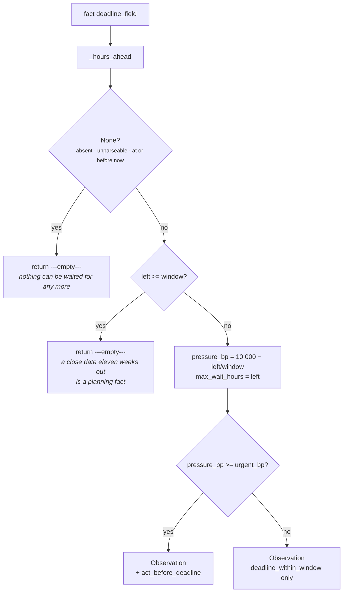

# 03b · Plugin `deadline_pressure`

**Class:** `scheduling_unit.py:DeadlinePressurePlugin`
**`plugin_id`:** `deadline_pressure`
**Observation `kind`:** `scheduling.deadline_pressure`
**Executes:** second of four (alphabetically)
**Default fact:** `deal.close_date`

---

## 1 · The claim it makes

*A dated commitment is closing, which compresses every window around it.*

This is the only plugin in the unit that never argues against acting now. The class docstring states
the asymmetry and its consequence in one breath:

> *A deadline is the one timing constraint that never argues against acting now — it only argues
> against waiting. So this plugin contributes no opposition at all; it contributes pressure and,
> critically, a ceiling: no other constraint may push the recommended wait past the deadline it would
> blow. That ceiling is what stops "wait for Thursday's meeting" from being emitted when the contract
> expires on Wednesday.*

Two outputs, two jobs:

* **`pressure_bp`** is a *relief* term. The Calculator halves it and adds it back to the timing fit,
  because as a commitment closes, the cost of waiting rises and the same pre-emption risk becomes
  more tolerable. It is the only plugin whose contribution can make the fit *better*.
* **`max_wait_hours`** is a *hard ceiling*. `_wait_window` takes the minimum across every ceiling, so
  the earliest deadline binds the reported wait no matter how long the calendar would demand.

`test_a_closing_deadline_creates_pressure_but_never_opposes_acting_now` asserts
`"against_now_bp" not in observation.metrics`. That absence is the plugin's entire contract with the
Calculator: `calculate` reads `item.metrics.get("against_now_bp", 0)`, so the missing key is what
keeps a deadline out of the opposition maximum.

---

## 2 · What exists

```python
class DeadlinePressurePlugin:
    plugin_id = "deadline_pressure"

    def contribute(self, view: UnitView) -> tuple[Observation, ...]:
        field = _config_field(view, "deadline_field", "deal.close_date")
        window = _config_hours(view, "deadline_window_hours", 336)   # two weeks
        urgent_bp = _config_bp(view, "deadline_urgent_bp", 7_500)
        left = _hours_ahead(view.request, field)
        # A deadline already in the past is not a scheduling constraint — nothing this unit
        # reports can be waited for any more. That is a risk observation and belongs to core.risk.
        if left is None or left >= window:
            return ()
        pressure_bp = clamp_bp(10_000 - divide_half_up(left * 10_000, window))
        codes = ("deadline_within_window",)
        if pressure_bp >= urgent_bp:
            codes += ("act_before_deadline",)
        return (Observation(
            plugin_id=self.plugin_id,
            kind="scheduling.deadline_pressure",
            metrics={"pressure_bp": pressure_bp, "hours_left": left, "max_wait_hours": left},
            evidence_ids=evidence_ids(view.request, field),
            reason_codes=codes,
        ),)
```

### 2.1 · Inputs

| Source | Name | Type | Range |
|---|---|---|---|
| config | `deadline_field` | `str`, non-blank | any fact name; default `"deal.close_date"` |
| config | `deadline_window_hours` | `int` | `1..8_760`; default `336` (two weeks) |
| config | `deadline_urgent_bp` | `int` | `0..10_000`; default `7_500` |
| fact | whatever `deadline_field` names | ISO-8601 `str` or `datetime`, timezone-aware | strictly after `evaluation_time` |
| derived | `request.evaluation_time` | `datetime` | the frozen "now" |

### 2.2 · Outputs

| Metric | Range | Meaning |
|---|---|---|
| `pressure_bp` | `1..10000` | how far into the deadline window the commitment has travelled |
| `hours_left` | `0..window−1` | whole hours until the deadline |
| `max_wait_hours` | `0..window−1` | the same number, published under the name the Calculator reads as a ceiling |

**`hours_left` and `max_wait_hours` are the same integer under two names.** That is not redundancy by
accident: `max_wait_hours` is a *protocol* key that `_wait_window` looks for, while `hours_left` is a
*description* for a human reading the finding. Renaming either would break something different — the
first would break the ceiling, the second would make the trace less legible.

| Reason code | When |
|---|---|
| `deadline_within_window` | always, when the plugin speaks at all |
| `act_before_deadline` | `pressure_bp >= deadline_urgent_bp` — at the defaults, `hours_left <= 84` |

`Observation.__post_init__` sorts the code tuple, so the published order is
`('act_before_deadline', 'deadline_within_window')` — alphabetical, not the order the code appends
them.

Evidence: `evidence_ids(view.request, field)` — the evidence rows for the deadline fact alone.

---

## 3 · How it works

### 3.1 · The arithmetic

```text
left        = (close_date − evaluation_time).total_seconds() // 3600     # truncated whole hours
pressure_bp = clamp_bp(10,000 − divide_half_up(left × 10,000, window))
max_wait    = left

divide_half_up(n, d) = (n + d // 2) // d          for n >= 0
clamp_bp(v)          = min(10_000, max(0, int(v)))
```

A linear ramp from nothing at the far edge of the window to maximum at the deadline itself. It is the
mirror image of `cadence_spacing`'s curve, run in the opposite direction over a different quantity —
and, like that plugin, the range guard makes `clamp_bp` defensive rather than functional:
`left < window` is guaranteed, so `pressure_bp` is strictly above `0` and the plugin can never emit a
zero-strength observation.

### 3.2 · The full curve, at the default 336-hour window

| `hours_left` | Days | `pressure_bp` | `act_before_deadline`? |
|---|---|---|---|
| 0 | today | **10,000** | yes |
| 1 | | 9,970 | yes |
| 12 | | 9,643 | yes |
| 24 | 1 | 9,286 | yes |
| 48 | 2 | 8,571 | yes |
| **84** | 3.5 | **7,500** | **yes — the exact urgency boundary** |
| 85 | | 7,470 | no |
| 120 | 5 | 6,429 | no |
| 168 | 7 | **5,000** | no — one week is exactly half the window |
| 216 | 9 | 3,571 | no |
| 252 | 10.5 | 2,500 | no |
| 288 | 12 | 1,429 | no |
| 335 | ~14 | 30 | no |
| 336 | 14 | *silent* | — |
| 1,000 | 42 | *silent* | — |

Every value computed from the formula; the 1h, 84h, 85h, 216h, 288h and 335h rows are verified
directly against the code.

### 3.3 · Why a deadline is relief and not opposition

This is the term most likely to be misread, and the argument for it lives in `calculate`'s docstring
rather than here:

> *The deadline term is relief rather than opposition: as a dated commitment closes, the cost of
> waiting rises, so the same pre-emption risk becomes more tolerable.*

Concretely: a slightly awkward email the day before a call is a small cost. Missing a renewal because
we waited for the call is a large one. As the second cost grows, our tolerance for the first should
grow with it — but only up to a point, which is why the Calculator caps the relief at half the
pressure and withdraws it entirely against an absolute constraint. Those two guards are not this
plugin's; it publishes a raw pressure and the Calculator decides what it buys.

The consequence for a reader of the result: `deadline_pressure_bp` is **not** a measure of how bad
the timing is. It is a measure of how expensive waiting has become. A run reporting
`deadline_pressure_bp: 10,000` and `timing_fit_bp: 10,000` is a good moment made better by urgency; a
run reporting `deadline_pressure_bp: 10,000` and `timing_fit_bp: 0` is a quiet window that urgency
cannot buy through.

### 3.4 · Why a passed deadline is silent



The source comment is unusually specific about where the missed deadline goes instead:

> *A deadline already in the past is not a scheduling constraint — nothing this unit reports can be
> waited for any more. That is a risk observation and belongs to `core.risk`.*

That is a jurisdiction argument, not a convenience. This unit's two outputs are "how good is now" and
"how long to wait". A blown deadline changes neither: you cannot wait for it, and its being blown
does not make now a worse moment to act — arguably it makes now the only moment. What it *does*
change is exposure, and exposure is `core.risk`'s and `core.cost`'s question.

`test_a_deadline_that_has_already_passed_is_not_a_scheduling_constraint` pins it: *"nothing can be
waited for any more; a missed deadline belongs to `core.risk`, not here."*

### 3.5 · Why the window exists at all

The upper guard — `left >= window` → silent — exists because otherwise every deal with a close date
would carry a permanent timing constraint. From the docstring:

> *Pressure rises linearly as the deadline enters the configured window and the plugin is silent
> outside it, because a close date eleven weeks out is a planning fact, not a timing constraint.*

`test_a_deadline_outside_the_window_stays_silent` uses 1,000 hours — about six weeks — with the same
framing.

The window has a second, less obvious job: it also gates the **ceiling**. A deadline outside the
window contributes no `max_wait_hours`, so it cannot cap a deferral. That is the right coupling — a
close date three months out should not be allowed to shorten "wait until after Thursday's call" — but
it means the ceiling and the pressure switch on together, at a threshold tuned for the pressure. A
capability that wanted a very long ceiling and a very short pressure ramp cannot express it.

### 3.6 · Config keys

| Key | Type | Default | Effect |
|---|---|---|---|
| `deadline_field` | `str`, non-blank | `"deal.close_date"` | which fact carries the dated commitment |
| `deadline_window_hours` | `int`, `1..8_760` | `336` | how far ahead a deadline starts to matter; also the ceiling's reach |
| `deadline_urgent_bp` | `int`, `0..10_000` | `7_500` | the `act_before_deadline` bar |

All three are read **before** the fact, so a bad value raises on an empty snapshot. Verified:

```text
{"deadline_window_hours": "336"} → ValueError: deadline_window_hours must be a whole number of hours
                                               between 1 and 8760
{"deadline_window_hours": 0}     → same
{"deadline_urgent_bp": 20000}    → ValueError: deadline_urgent_bp must be integer basis points
{"deadline_urgent_bp": True}     → same (bool rejected before the int check)
```

`deadline_urgent_bp` and `deadline_window_hours` interact directly: the urgency boundary in hours is
`left <= window × (10,000 − urgent_bp) / 10,000`. At the defaults that is
`336 × 2,500 / 10,000 = 84` hours. Raising the window without raising `deadline_urgent_bp` widens the
urgent band in absolute time — a 720-hour window at the default 7,500bp fires `act_before_deadline`
at 180 hours out, which is seven and a half days and probably not what the author meant by "urgent".

**Untuned.** `336` and `7,500` are both authored from domain reasoning. Nothing has fitted either
against close-rate or win-rate data, and the shipped capability overrides neither.

---

## 4 · Worked examples

### 4.1 · Three and a half days out — the urgency boundary, exactly

```python
facts = {"deal.close_date": "<+84h>"}
```

```text
window      = 336                                # default
left        = 84
pressure_bp = clamp_bp(10,000 − divide_half_up(84 × 10,000, 336))
            = clamp_bp(10,000 − (840,000 + 168) // 336)
            = clamp_bp(10,000 − 840,168 // 336)
            = clamp_bp(10,000 − 2,500)                     = 7_500
7,500 >= 7,500                                             → act_before_deadline fires

Observation(kind="scheduling.deadline_pressure",
            metrics={pressure_bp: 7_500, hours_left: 84, max_wait_hours: 84},
            reason_codes=('act_before_deadline', 'deadline_within_window'))
```

`test_a_closing_deadline_creates_pressure_but_never_opposes_acting_now` pins `pressure_bp`,
`max_wait_hours`, the absence of `against_now_bp`, and the urgency code. The boundary is exact:
one hour later, at 85 hours, `pressure_bp` is `7,470` and `act_before_deadline` does not fire.

On a snapshot where this is the only timing fact, the whole unit then reports:

```text
opposition = 0 (no against_now_bp anywhere)   relief = divide_half_up(7,500, 2) = 3,750
timing_fit_bp = clamp_bp(10,000 − 0 + 3,750)  = 10,000       ← clamped from 13,750
wait_hours    = min(demanded 0, ceiling 84)   = 0
constraint_count 1 · deadline_pressure_bp 7,500 · matched False
```

A deadline alone can never move the fit, because there is nothing to relieve. The relief term only
becomes visible when an objection exists.

### 4.2 · Softening a pre-emption by exactly half

```python
facts = {"calendar.next_meeting_at": "<+18h>",   # 7,500 against now
         "deal.close_date":          "<+84h>"}   # 7,500 of pressure
```

```text
opposition    = 7_500
pressure      = 7_500
absolute      = False
relief        = divide_half_up(7_500, 2)                   = 3_750
timing_fit_bp = clamp_bp(10,000 − 7_500 + 3_750)           = 6_250
wait_hours    = min(demanded 18, ceiling 84)               = 18
constraint_count 2 · matched False (6,250 >= 6,000)
```

`test_a_closing_deadline_softens_a_soft_objection_by_at_most_half`, whose docstring is the argument
for the cap: *"as the cost of waiting rises the same pre-emption risk becomes more tolerable — but the
relief is capped so pressure can never manufacture a good moment out of a bad one."*

Note the verdict flip. Without the deadline this snapshot reports `timing_fit_bp = 2,500` and
`matched = True`; with it, `6,250` and `matched = False`. The deadline did not change the calendar —
it changed what an acceptable moment means when waiting has a price.

### 4.3 · The ceiling binding, and the conflict named

```python
facts = {"calendar.next_meeting_at": "<+60h>",   # clearing takes 60h
         "deal.close_date":          "<+36h>"}   # only 36h available
```

```text
upcoming_interaction  against_now_bp 1_667, wait_hours 60
deadline_pressure     pressure_bp 8_929, hours_left 36, max_wait_hours 36

demanded = 60 · ceiling = 36 · wait = min(60, 36)          = 36
demanded > ceiling                                          → timing_conflict_deadline_before_clearance

relief        = divide_half_up(8_929, 2)                    = 4_465
timing_fit_bp = clamp_bp(10,000 − 1_667 + 4_465)
              = clamp_bp(12_798)                            = 10_000
matched       = False                                       ← 10,000 is not < 6,000
```

`test_a_deadline_caps_a_deferral_and_the_conflict_is_named`: *"'wait for Thursday's meeting' must
never be published when the contract expires Wednesday."*

Two things in this run are worth carrying forward. The ceiling worked — `wait_hours` is 36, not 60.
And the run's most important output is a **reason code on a `matched=False` result**: a consumer
filtering on `matched` would discard a run that is reporting an irreconcilable conflict at a nominally
perfect timing fit. README §7.4.

### 4.4 · A deadline inside the hour

```python
facts = {"deal.close_date": "<+30 minutes>"}
```

```text
_hours_ahead: seconds = 1,800 > 0, so not None; 1,800 // 3600           = 0
pressure_bp = clamp_bp(10,000 − divide_half_up(0, 336)) = 10,000 − 0    = 10_000
hours_left      = 0
max_wait_hours  = 0
```

`max_wait_hours = 0` then caps **every** other constraint's wait to zero, whatever they demanded. On
a snapshot that also carries a 200-hour quiet window that produces `timing_fit_bp: 0` (never act) and
`wait_hours: 0` (wait no time). Both numbers are individually defensible and together they are a
contradiction. README §7.2 and §7.3.

### 4.5 · Renaming the fact

```python
facts  = {"crm.renewal_date": "<+84h>"}
config = {"deadline_field": "crm.renewal_date"}
```

```text
pressure_bp 7_500 · hours_left 84 · max_wait_hours 84
reason_codes ('act_before_deadline', 'deadline_within_window')
```

Identical to §4.1. The default fact name is a convenience, not a coupling — the module docstring's
framing is *"different capabilities carry the same constraint under different names."* A subscription
capability points this at `subscription.current_period_end`; a support capability points it at an SLA
expiry. Note that `deal.close_date` is the **only** one of the unit's four defaults that Layer 2
actually writes (README §7.5), so this plugin is the one that needs renaming least.

---

## 5 · Silence and edge cases

### 5.1 · The three silences

| Condition | Returns | Why |
|---|---|---|
| the fact is absent, or its value is `None` | `()` | no dated commitment is known |
| the fact is present but unparseable, naive, not a `str`/`datetime`, or **at or before** `evaluation_time` | `()` | `_hours_ahead` folds all four into `None` |
| `left >= window` | `()` | a planning fact, not a timing constraint |

The second row collapses "we cannot read this date" with "this date has passed", and for this plugin
that collapse is harmless: both mean *there is no future deadline to compress anything*.

### 5.2 · Boundary values

| Situation | Outcome |
|---|---|
| deadline at exactly `evaluation_time` | **silent** — `_hours_ahead` requires `seconds > 0` |
| deadline 1 second ahead | fires, `hours_left 0`, `pressure_bp 10,000`, `max_wait_hours 0` |
| deadline at `window − 1` hours | fires, at the minimum non-zero pressure for that window (`30bp` at the default) |
| deadline at exactly `window` hours | **silent** — the comparison is `>=` |
| `pressure_bp` exactly equal to `deadline_urgent_bp` | `act_before_deadline` **fires** — the comparison is `>=` |
| `deadline_urgent_bp = 0` | `act_before_deadline` fires on every observation the plugin makes |
| `deadline_urgent_bp = 10_000` | fires only at `hours_left = 0` |

The `>=` at the window boundary is the correct choice and is what `upcoming_interaction` should have
used (README §7.1): a deadline exactly at the window edge would otherwise emit `pressure_bp: 0` and
a `max_wait_hours` equal to the whole window, silently capping every deferral in the run at two weeks
for no measured reason.

### 5.3 · Value shapes

Identical to `cadence_spacing` §5.3 — `parse_time` is shared. ISO strings with `Z` or an offset,
timezone-aware `datetime`s, and `{"value": …}` records are accepted; naive strings, unparseable
strings, epoch integers and non-string non-datetime values are all treated as absent. Floats cannot
reach the plugin at all: `ContextSnapshot` canonicalizes its facts and rejects them at the Layer 2
boundary.

### 5.4 · What this plugin is *not* measuring

`core.resource:BudgetTimeHeadroomPlugin` also reads a deadline, and reports `headroom_bp` and a
signed `hours_remaining` — *how much room is left to do the work*. This plugin reports
`pressure_bp` — *how expensive waiting has become*. The two answer different questions from
potentially the same fact, and neither reads the other. A capability that wired both against the same
close date would publish two independent readings of one date under two names, which is correct but
worth knowing before someone tries to reconcile them.

---

## Related

| Document | Covers |
|---|---|
| [03 · Analyzer](03-Analyzer.md) | the metric vocabulary — why the missing `against_now_bp` is load-bearing |
| [03c · `quiet_window`](03c-plugin-quiet_window.md) | the `absolute_bp` marker that withdraws this plugin's relief entirely |
| [04 · Calculator](04-Calculator.md) | the half-cap on relief, and `min(demanded, ceiling)` |
| [05 · Evaluator](05-Evaluator.md) | `timing_conflict_deadline_before_clearance` |
| README §7.3 | the ceiling clamping an absolute boundary, and the `wait_hours` it produces |
