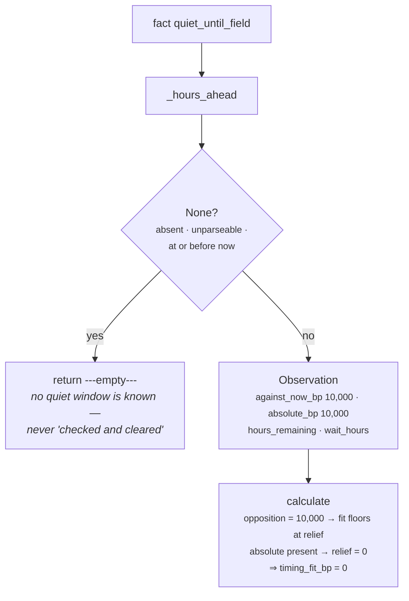

# 03c · Plugin `quiet_window`

**Class:** `scheduling_unit.py:QuietWindowPlugin`
**`plugin_id`:** `quiet_window`
**Observation `kind`:** `scheduling.quiet_window`
**Executes:** third of four (alphabetically)
**Default fact:** `schedule.quiet_until`

---

## 1 · The claim it makes

*Somebody said "not until". That is not a preference to be weighed, it is a boundary.*

The class docstring is the shortest in the module and it argues one thing:

> *An out-of-office, a stated review period, a legal freeze — whatever produced the fact, the
> counterparty has told us when we may next speak. This unit marks the observation absolute so that
> no amount of deadline pressure can dress "acting now" up as acceptable: a closing deadline is our
> problem, not a licence to ignore what they asked for.*

This is the only plugin in the unit with **no gradient and no range check**. Every other plugin
computes a strength from how far into some window we are; this one publishes a flat `10,000bp` for
any future stamp at any distance. There is no partial compliance with "do not contact me until the
15th".

It is also the only plugin that emits `absolute_bp`. That key is a marker, not a magnitude — the
source comment says so directly:

> *`absolute_bp` is the marker the calculator looks for: its presence, not its size, is what
> withdraws deadline relief.*

---

## 2 · What exists

```python
class QuietWindowPlugin:
    plugin_id = "quiet_window"

    def contribute(self, view: UnitView) -> tuple[Observation, ...]:
        field = _config_field(view, "quiet_until_field", "schedule.quiet_until")
        remaining = _hours_ahead(view.request, field)
        if remaining is None:
            return ()
        return (Observation(
            plugin_id=self.plugin_id,
            kind="scheduling.quiet_window",
            metrics={"against_now_bp": 10_000, "absolute_bp": 10_000,
                     "hours_remaining": remaining, "wait_hours": remaining},
            evidence_ids=evidence_ids(view.request, field),
            reason_codes=("inside_quiet_period",),
        ),)
```

Eleven lines, one config key, one guard, no arithmetic. It is the simplest plugin in Category 3 and
the one with the largest effect on the published result.

### 2.1 · Inputs

| Source | Name | Type | Range |
|---|---|---|---|
| config | `quiet_until_field` | `str`, non-blank | any fact name; default `"schedule.quiet_until"` |
| fact | whatever `quiet_until_field` names | ISO-8601 `str` or `datetime`, timezone-aware | strictly after `evaluation_time` |
| derived | `request.evaluation_time` | `datetime` | the frozen "now" |

**One config key.** There is no `quiet_window_horizon_hours`, no strength knob, no threshold. Nothing
about this constraint is tunable per capability except which fact carries it, and that is the point:
a knob that softened a stated boundary would be a knob for ignoring what a counterparty asked for.

### 2.2 · Outputs

| Metric | Value | Meaning |
|---|---|---|
| `against_now_bp` | **always `10_000`** | maximum opposition; there is no partial version of a boundary |
| `absolute_bp` | **always `10_000`** | the marker; the Calculator tests `"absolute_bp" in item.metrics` and never reads the value |
| `hours_remaining` | `0..8760+` | whole hours until the window expires |
| `wait_hours` | the same integer | published under the name `_wait_window` reads |

Like `deadline_pressure`'s `hours_left`/`max_wait_hours` pair, `hours_remaining` and `wait_hours`
are one number under two names — one for a human reading the finding, one for the Calculator's
protocol.

| Reason code | When |
|---|---|
| `inside_quiet_period` | always, when the plugin speaks at all |

Evidence: `evidence_ids(view.request, field)` — the evidence rows for the quiet-until fact alone.

---

## 3 · How it works

### 3.1 · There is no arithmetic



Whenever this plugin speaks, `timing_fit_bp` is `0`. Two independent mechanisms produce it and either
alone would be enough:

```text
opposition = max(against_now_bp) = 10,000
absolute   = True                       → relief = 0
timing_fit_bp = clamp_bp(10,000 − 10,000 + 0) = 0
```

The `absolute_bp` marker is the belt to `against_now_bp`'s braces. Without the marker, a maximum
opposition of 10,000 against 10,000bp of deadline pressure would still yield
`10,000 − 10,000 + 5,000 = 5,000` — a middling timing fit, which downstream would read as *"a bit
awkward but workable"*. With it, the answer is `0`.

`test_deadline_pressure_cannot_talk_the_system_past_a_quiet_window` pins exactly that:
*"our deadline is our problem. An absolute boundary withdraws the relief entirely."*

### 3.2 · Why absence is not clearance

> *The fact is optional and often absent; absence means no quiet window is known, never that one has
> been checked and cleared.*

This is the sharpest silence in the unit and the one with the most dangerous alternative reading. If
`constraint_count: 0` were interpreted downstream as *"we verified there is no quiet period"*, the
system would be making a compliance-shaped claim on the basis of a fact nobody wrote. The unit says
nothing, and `constraint_count` counts what was measured rather than what was checked — the same
distinction `core.policy` makes when it emits *no check at all* rather than a `PASS` for a play a
rule does not reach.

Note what this means for a reader of the result. There is no metric anywhere in the roster that says
*"we looked for a quiet window and there is not one"*. The absence of `inside_quiet_period` from
`reason_codes` is the only signal, and it is indistinguishable from the field never having been
populated by any connector — which, today, is what it always is (§5.4).

### 3.3 · Why there is no horizon

The three other plugins all bound their reach: `upcoming_interaction` at 72 hours, `deadline_pressure`
at 336, `cadence_spacing` at whatever gap is declared. This plugin has none. A `schedule.quiet_until`
nine months out fires at full strength today, producing `timing_fit_bp: 0` and `wait_hours: 6,552`.

That is defensible as written — a stated boundary is stated regardless of length, and truncating one
would be the unit deciding a counterparty's instruction had an expiry date it did not give. But it is
also the plugin's largest unguarded surface. Every other constraint in the unit degrades to silence if
its fact is stale or wrong; this one does not. A connector that wrote a timezone-aware "never"
sentinel — `"9999-12-31T00:00:00+00:00"`, a common shape in CRM exports — takes the deal permanently
unactionable with no diagnostic. Verified:

```text
facts   schedule.quiet_until = "9999-12-31T00:00:00+00:00"
result  timing_fit_bp 0 · wait_hours 69,893,388 · constraint_count 1
        reason_codes ('inside_quiet_period',)
```

Seven thousand years of recommended wait, published as an integer, unclamped. (The naive form
`"9999-12-31"` is rejected by `parse_time` for having no timezone and produces silence instead —
so whether a "never" sentinel bricks the deal or is ignored entirely depends on whether the exporting
connector wrote an offset.) `_config_hours` bounds every *config* duration at 8,760 hours precisely
because a year is where the module stops believing a number; no equivalent bound applies to this
*fact*.

### 3.4 · Config keys

| Key | Type | Default | Effect |
|---|---|---|---|
| `quiet_until_field` | `str`, non-blank | `"schedule.quiet_until"` | which fact carries the stated boundary |

Read before the fact, so a bad value raises on an empty snapshot. Verified:

```text
{"quiet_until_field": 5}    → ValueError: quiet_until_field must be a fact name
{"quiet_until_field": "  "} → same
{"quiet_until_field": ""}   → same
```

`_config_field` strips the value before returning it, so `"  schedule.quiet_until  "` resolves
correctly while `"   "` is rejected.

---

## 4 · Worked examples

### 4.1 · Thirty hours of stated quiet

```python
facts = {"schedule.quiet_until": "<+30h>"}
```

```text
remaining = (quiet_until − evaluation_time) // 1h                  = 30

Observation(kind="scheduling.quiet_window",
            metrics={against_now_bp: 10_000, absolute_bp: 10_000,
                     hours_remaining: 30, wait_hours: 30},
            reason_codes=("inside_quiet_period",))
```

`test_a_stated_quiet_window_is_reported_as_an_absolute_constraint` pins all four metrics with the
framing *"they told us when we may next speak; the unit marks that so nothing can trade it away."*

On a snapshot where this is the only timing fact, the whole unit reports:

```text
opposition 10,000 · pressure 0 · absolute True · relief 0
timing_fit_bp 0 · wait_hours 30 · constraint_count 1 · deadline_pressure_bp 0
matched True · reason_codes ('inside_quiet_period',)
```

### 4.2 · A closing deadline cannot buy through it

```python
facts = {"schedule.quiet_until": "<+30h>",
         "deal.close_date":      "<+84h>"}    # 7,500bp of pressure
```

```text
opposition    = max(10,000)                                = 10_000
pressure      = 7_500
absolute      = True                                       → relief = 0
timing_fit_bp = clamp_bp(10,000 − 10,000 + 0)              = 0

demanded      = max(30)                                    = 30
ceiling       = min(84)                                    = 84
wait_hours    = min(30, 84)                                = 30
constraint_count 2 · deadline_pressure_bp 7,500 · matched True
reason_codes ('act_before_deadline', 'deadline_within_window', 'inside_quiet_period')
```

`test_deadline_pressure_cannot_talk_the_system_past_a_quiet_window`. Compare against the same
deadline with a *soft* objection of the same size (`03b` §4.2): there, 7,500 of pressure against
7,500 of opposition gave `timing_fit_bp = 6,250` and `matched = False`. Here, 7,500 of pressure
against 10,000 of *absolute* opposition gives `0`. The difference is not the 2,500bp of extra
opposition — it is the marker. Had the quiet window emitted `against_now_bp: 10,000` without
`absolute_bp`, the fit would have been `3,750`, and a downstream ranker weighing timing against
opportunity could have talked itself into acting.

Note that `deadline_pressure_bp` is still published at `7,500`. The unit does not suppress the
pressure; it refuses to let the pressure buy anything. A reader can see both facts — the deadline is
real *and* it does not authorise us to write.

### 4.3 · The deadline ceiling shortening the wait through the boundary

```python
facts = {"schedule.quiet_until": "<+200h>",
         "deal.close_date":      "<+2h>"}
```

Verified end to end:

```text
quiet_window       against_now_bp 10,000 · absolute_bp 10,000 · wait_hours 200
deadline_pressure  pressure_bp 9,940 · hours_left 2 · max_wait_hours 2

opposition 10,000 · absolute True → relief 0
timing_fit_bp   = 0                              ← the boundary is honoured
demanded 200 · ceiling 2 · wait_hours = min(200, 2) = 2      ← the boundary is NOT honoured
demanded > ceiling                               → timing_conflict_deadline_before_clearance

result  timing_fit_bp 0 · wait_hours 2 · constraint_count 2 · deadline_pressure_bp 9,940
        matched True
        reason_codes ('act_before_deadline', 'deadline_within_window',
                      'inside_quiet_period', 'timing_conflict_deadline_before_clearance')
```

The two published numbers contradict each other. `timing_fit_bp: 0` says never; `wait_hours: 2` says
the window opens in two hours, and it does not — it opens in 200. `calculate` applies
`min(demanded, ceiling)` with no exception for an absolute constraint, so the deadline that must not
be allowed to override the boundary is allowed to override the *wait* the boundary implies.

The mitigation is the conflict reason code, which is real and correct: the unit is naming two true,
irreconcilable facts and handing the resolution to Part 3. But a consumer reading `wait_hours`
without reading the codes gets a wrong number rather than no number, and the unit's founding argument
is that a fabricated wait is worse than none at all. No test covers this combination. README §7.3.

### 4.4 · An expired boundary

```python
facts = {"schedule.quiet_until": "<-1h>"}
```

```text
_hours_ahead: seconds = −3,600, which is <= 0                     → None
→ return ()
```

`test_an_expired_quiet_window_no_longer_constrains`: *"the boundary was time-boxed; once it passes it
stops being a boundary."* The result reverts to whatever the other three plugins say — on a snapshot
with nothing else, `timing_fit_bp: 10,000, constraint_count: 0, reason_codes: ('timing_unconstrained',)`.

The transition is a cliff, not a ramp: at 1 hour remaining the unit reports `timing_fit_bp: 0`, and
one hour later `10,000`. That is correct for this constraint — a boundary does not fade — and it is
the one place in the unit where a discontinuity is the honest shape.

### 4.5 · A quiet window under an hour

```python
facts = {"schedule.quiet_until": "<+30 minutes>"}
```

```text
_hours_ahead: seconds = 1,800 > 0 → not None; 1,800 // 3600        = 0
metrics {against_now_bp: 10_000, absolute_bp: 10_000,
         hours_remaining: 0, wait_hours: 0}

result  timing_fit_bp 0 · wait_hours 0 · matched True
```

*"Absolutely do not act — wait no time at all."* The boundary is still 30 minutes away and the
reported wait is zero, because `_hours_ahead` floors. README §7.2. The `inside_quiet_period` code is
still published, so the trace is not wrong, only the number is.

### 4.6 · Renaming the fact

```python
facts  = {"contact.do_not_disturb_until": "<+30h>"}
config = {"quiet_until_field": "contact.do_not_disturb_until"}
```

Identical output to §4.1. The rename is the only lever a capability has over this plugin — and it is
the lever that would matter most, because the default name has no writer anywhere in the codebase
(§5.4).

---

## 5 · Silence and edge cases

### 5.1 · The one silence

| Condition | Returns | Why |
|---|---|---|
| `_hours_ahead` returns `None` — the fact is absent, `None`, unparseable, naive, not a `str`/`datetime`, or at or before `evaluation_time` | `()` | no quiet window is known |

One guard, six causes. Unlike `cadence_spacing`, which distinguishes "absent" from "unreadable" with
two separate checks (and treats them identically anyway), this plugin folds everything into one
`is None`.

That collapse hides something worth naming. A `schedule.quiet_until` holding
`"out of office until further notice"` — free text a connector might plausibly write — parses as
nothing and is treated exactly like a field that was never populated. The counterparty said *do not
contact me*, the string is in the snapshot, and the unit reports `timing_unconstrained`. The failure
is unlikely and the fail-open direction is the wrong one for this particular constraint; every other
plugin in the unit fails open harmlessly, and this one does not.

### 5.2 · Boundary values

| Situation | Outcome |
|---|---|
| quiet-until exactly at `evaluation_time` | **silent** — `_hours_ahead` requires `seconds > 0` |
| quiet-until 1 second ahead | fires, `hours_remaining 0`, `wait_hours 0`, `timing_fit_bp 0` |
| quiet-until 1 hour ahead | fires, `hours_remaining 1`, `wait_hours 1` |
| quiet-until 8,760 hours ahead (one year) | fires at full strength, `wait_hours 8,760` |
| quiet-until 87,600 hours ahead (ten years) | fires at full strength, `wait_hours 87,600` — verified, **no upper bound** |

The last row is the unbounded surface from §3.3. `wait_hours` is published without a clamp —
`calculate` applies `max(0, wait)`, which guards only the lower end — and `wait_hours` does not end
in `_bp`, so `ReasoningUnit.build`'s `clamp_bp` pass does not touch it either. A ten-year quiet
window produces a ten-year wait in the result, and nothing anywhere flags it.

### 5.3 · Value shapes

Identical to the other three plugins — `parse_time` is shared. ISO strings with `Z` or an offset,
timezone-aware `datetime`s, and `{"value": …}` records are accepted; naive strings, unparseable
strings, epoch integers and other types are treated as absent. Floats cannot reach the plugin:
`ContextSnapshot.__post_init__` canonicalizes facts and raises
`CanonicalizationError: floats are forbidden in semantic artifacts`.

### 5.4 · The fact has no writer anywhere

`schedule.quiet_until` appears in exactly one place in the repository: this module. No connector, no
Layer 2 pipeline, no derivation, no capability config, and no test fixture outside
`test_unit_scheduling_unit.py` writes it. There is no `schedule.*` namespace at all.

So the plugin has never fired outside a test, and the unit's strongest guarantee — that no amount of
commercial pressure can talk the system past a stated boundary — is currently guarding nothing.
Making it real is a Layer 1/2 job: an out-of-office auto-reply is already parsed by the email lane
(`context/pipeline.py` treats an outbound auto-reply as noise for the ball-in-court reset), and its
stated return date is exactly this fact. README §7.5.

---

## Related

| Document | Covers |
|---|---|
| [03 · Analyzer](03-Analyzer.md) | the `absolute_bp` marker as a protocol between plugin and Calculator |
| [03b · `deadline_pressure`](03b-plugin-deadline_pressure.md) | the relief this plugin withdraws, and the ceiling that still binds |
| [04 · Calculator](04-Calculator.md) | `absolute = any("absolute_bp" in item.metrics for item in observations)` |
| `core.policy` `timing_rules` | blackout windows — the tenant's boundary rather than the counterparty's |
| README §7.3 | the `wait_hours` contradiction this plugin is on one side of |
