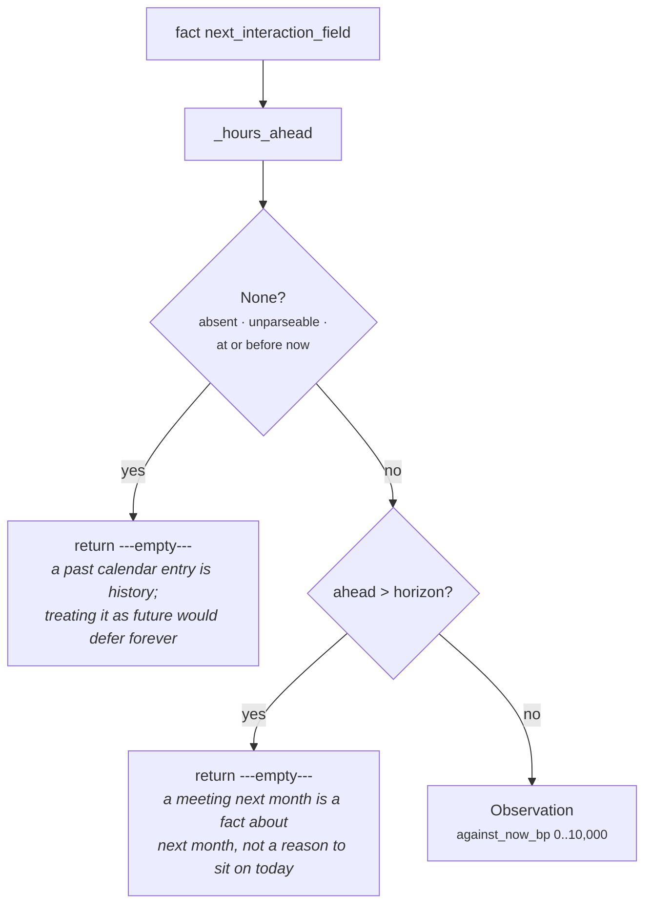

# 03d · Plugin `upcoming_interaction`

**Class:** `scheduling_unit.py:UpcomingInteractionPlugin`
**`plugin_id`:** `upcoming_interaction`
**Observation `kind`:** `scheduling.upcoming_interaction`
**Executes:** fourth of four (alphabetically), first in registration order
**Default fact:** `calendar.next_meeting_at`

---

## 1 · The claim it makes

*A scheduled interaction is already booked, and acting now would spend its reason.*

This is the constraint the unit was built for, and the class docstring is the clearest statement of
why it matters:

> *If there is a call with this counterparty in the calendar, the outreach we are considering is the
> agenda of that call; sending it early does not accelerate anything, it removes the reason to hold
> the meeting and signals we were not tracking it.*

The insight worth holding onto is that the follow-up and the meeting are **the same conversation**.
This is not a scheduling conflict in the calendar sense — nothing is double-booked. It is that the
value of a booked meeting is the unresolved thing it will resolve, and an email sent the night before
resolves it badly and for free.

The pre-emption is strongest at the moment of the meeting and fades linearly to nothing at a
configured horizon:

> *A call in two hours makes acting now nearly indefensible, a call in three days barely constrains
> today at all. Beyond the horizon the plugin is silent — a meeting next month is a fact about next
> month, not a reason to sit on today's work.*

---

## 2 · What exists

```python
class UpcomingInteractionPlugin:
    plugin_id = "upcoming_interaction"

    def contribute(self, view: UnitView) -> tuple[Observation, ...]:
        field = _config_field(view, "next_interaction_field", "calendar.next_meeting_at")
        horizon = _config_hours(view, "interaction_horizon_hours", 72)
        ahead = _hours_ahead(view.request, field)
        if ahead is None or ahead > horizon:
            return ()
        preempt_bp = clamp_bp(10_000 - divide_half_up(ahead * 10_000, horizon))
        return (Observation(
            plugin_id=self.plugin_id,
            kind="scheduling.upcoming_interaction",
            # `wait_hours` is the meeting itself: it is the next moment at which this situation is
            # genuinely different, so it is the honest point to re-evaluate from.
            metrics={"against_now_bp": preempt_bp, "hours_ahead": ahead, "wait_hours": ahead},
            evidence_ids=evidence_ids(view.request, field),
            reason_codes=("defer_until_after_meeting",),
        ),)
```

### 2.1 · Inputs

| Source | Name | Type | Range |
|---|---|---|---|
| config | `next_interaction_field` | `str`, non-blank | any fact name; default `"calendar.next_meeting_at"` |
| config | `interaction_horizon_hours` | `int` | `1..8_760`; default `72` (three days) |
| fact | whatever `next_interaction_field` names | ISO-8601 `str` or `datetime`, timezone-aware | strictly after `evaluation_time` |
| derived | `request.evaluation_time` | `datetime` | the frozen "now" |

### 2.2 · Outputs

| Metric | Range | Meaning |
|---|---|---|
| `against_now_bp` | `0..10000` | how much of the horizon is still unspent — the pre-emption risk |
| `hours_ahead` | `0..horizon` | whole hours until the meeting |
| `wait_hours` | the same integer | the meeting itself, published under the name `_wait_window` reads |

| Reason code | When |
|---|---|
| `defer_until_after_meeting` | always, when the plugin speaks at all |

Evidence: `evidence_ids(view.request, field)` — the evidence rows for the calendar fact alone.

**`against_now_bp` can be `0` here, and only here.** The other two objection-emitting plugins are
structurally unable to reach zero: `cadence_spacing`'s guard is `elapsed >= min_gap` and
`quiet_window` is flat at 10,000. This plugin's guard is `ahead > horizon`, one comparison weaker,
which lets a meeting at exactly the horizon through at zero strength. §5.2 and README §7.1.

### 2.3 · Why `wait_hours` is the meeting and not the meeting-plus-something

The inline comment is the argument, and it is a good one:

> *`wait_hours` is the meeting itself: it is the next moment at which this situation is genuinely
> different, so it is the honest point to re-evaluate from.*

The naive alternative — waiting until the meeting *ends* — would require knowing a duration the
snapshot does not carry, and the alternative to that is guessing one. Waiting until the meeting
*starts* is both measurable and semantically right: at that instant, the situation has materially
changed and the whole run should be re-evaluated rather than resumed from a stale conclusion. This
unit does not schedule the re-evaluation; it reports the moment at which the answer stops being
trustworthy.

---

## 3 · How it works

### 3.1 · The arithmetic

```text
ahead      = (meeting_at − evaluation_time).total_seconds() // 3600     # truncated whole hours
preempt_bp = clamp_bp(10,000 − divide_half_up(ahead × 10,000, horizon))
wait_hours = ahead

divide_half_up(n, d) = (n + d // 2) // d          for n >= 0
clamp_bp(v)          = min(10_000, max(0, int(v)))
```

The same linear ramp shape as `cadence_spacing`, over a different quantity and in the same direction:
full strength at the moment, nothing at the horizon.

### 3.2 · The full curve, at the default 72-hour horizon

| `hours_ahead` | `against_now_bp` | `wait_hours` | Reading |
|---|---|---|---|
| 0 | **10,000** | 0 | the meeting is inside the hour |
| 2 | 9,722 | 2 | nearly indefensible |
| 4 | 9,444 | 4 | |
| 6 | 9,167 | 6 | |
| 12 | 8,333 | 12 | |
| **18** | **7,500** | 18 | the call is at 06:00 tomorrow |
| 24 | 6,667 | 24 | |
| 36 | **5,000** | 36 | half the horizon |
| 48 | 3,333 | 48 | two days out |
| 60 | 1,667 | 60 | |
| 71 | 139 | 71 | |
| **72** | **0** | **72** | still fires — see §5.2 |
| 73 | *silent* | — | |
| 96 | *silent* | — | a call next week |

Every value computed from the formula; the 2h, 18h, 60h, 71h, 72h and 73h rows are verified directly
against the code.

Note how fast the curve moves at the near end and how flat the objection is in the middle. A meeting
tomorrow morning still carries 7,500bp — three quarters of maximum — which is why the flagship
scenario needed a *stronger* constraint (an email six hours ago, at 8,750bp) to displace it as the
binding objection.

### 3.3 · Why linear decay to a horizon



Three decisions in that flow.

**A past meeting constrains nothing.** `test_a_meeting_that_already_happened_constrains_nothing`:
*"a past calendar entry is history; treating it as a future constraint would defer forever."* If a
stale `calendar.next_meeting_at` were read as a constraint, a deal whose last call was in March would
be permanently deferred — the exact failure mode the unit exists to prevent, inverted.

**A distant meeting constrains nothing.** `test_a_meeting_beyond_the_horizon_is_not_a_timing_constraint`:
*"a call next week must not freeze this week's work."* Without the horizon, any account with a
standing quarterly review would carry a permanent pre-emption objection.

**A missing calendar is unknown, not clear.**
`test_a_missing_calendar_fact_produces_no_observation_rather_than_a_zero`: *"no calendar in the
snapshot means unknown, not clear. A zero here would read as 'go now'."* This is the silence that
matters most in the shipped system, because `calendar.next_meeting_at` has no writer (§5.4) — so
today the unit reports "no meeting known" on every run, and it must not be mistakable for "we
checked the calendar and it is empty".

### 3.4 · Config keys

| Key | Type | Default | Effect |
|---|---|---|---|
| `next_interaction_field` | `str`, non-blank | `"calendar.next_meeting_at"` | which fact carries the booked interaction |
| `interaction_horizon_hours` | `int`, `1..8_760` | `72` | how far ahead a meeting starts to matter; also the slope of the decay |

Both read **before** the fact, so a bad value raises on an empty snapshot. Verified:

```text
{"interaction_horizon_hours": 0}    → ValueError: interaction_horizon_hours must be a whole number
                                                  of hours between 1 and 8760
{"interaction_horizon_hours": True} → same (bool rejected before the int check)
{"next_interaction_field": "  "}    → ValueError: next_interaction_field must be a fact name
```

The horizon is a single knob doing two jobs — it sets both the **reach** and the **slope**, and the
two move together in a direction that is easy to get backwards. Opposition is `1 − ahead/horizon`, so
widening the horizon makes every meeting inside it look *more* constraining, not less:

| `interaction_horizon_hours` | Reach | `against_now_bp` for a meeting 18h out |
|---|---|---|
| 24 | one day | `10,000 − divide_half_up(180,000, 24) = 2,500` |
| 72 (default) | three days | `10,000 − divide_half_up(180,000, 72) = 7,500` |
| 168 | one week | `10,000 − divide_half_up(180,000, 168) = 8,929` |

There is no way to express *"care about meetings up to a week out, but only steeply inside 24
hours"*. An author who widens the reach to catch next week's call also makes tonight's call harder to
act around — a coupling nothing in the code or the config names.

**Untuned.** `72` is authored from domain reasoning. Nothing has fitted it against reply-rate or
meeting-outcome data, and the shipped capability overrides it with nothing.

---

## 4 · Worked examples

### 4.1 · The call at 06:00 tomorrow

```python
facts = {"calendar.next_meeting_at": "<+18h>"}     # it is 12:00; the call is at 06:00 tomorrow
```

```text
horizon    = 72                                    # default
ahead      = 18
preempt_bp = clamp_bp(10,000 − divide_half_up(18 × 10,000, 72))
           = clamp_bp(10,000 − (180,000 + 36) // 72)
           = clamp_bp(10,000 − 180,036 // 72)
           = clamp_bp(10,000 − 2,500)                        = 7_500
wait_hours = 18

Observation(kind="scheduling.upcoming_interaction",
            metrics={against_now_bp: 7_500, hours_ahead: 18, wait_hours: 18},
            reason_codes=("defer_until_after_meeting",))
```

`test_a_meeting_in_the_morning_makes_acting_tonight_a_preemption` pins all three metrics and the
code: *"the follow-up we would send is the agenda of the call already booked for 06:00 tomorrow."*
`7,500bp` is `0.75` — three quarters of the pre-emption pressure remains.

On a snapshot where this is the only timing fact, the whole unit reports:

```text
opposition 7,500 · pressure 0 · absolute False · relief 0
timing_fit_bp 2,500 · wait_hours 18 · constraint_count 1 · deadline_pressure_bp 0
matched True · reason_codes ('defer_until_after_meeting',)
```

`2,500 < 6,000`, so the clock materially constrains acting now.

### 4.2 · Two soft constraints do not compound

```python
facts = {"calendar.next_meeting_at": "<+18h>",     # 7,500 against now
         "deal.last_outbound":       "<-24h>"}     # 5,000 against now
```

```text
opposition    = max(7_500, 5_000)                            = 7_500
timing_fit_bp = clamp_bp(10,000 − 7_500 + 0)                 = 2_500      ← not 10,000 − 12,500
demanded      = max(18, 24)                                  = 24         ← not 42
constraint_count 2 · matched True
```

`test_the_binding_objection_sets_the_fit_rather_than_the_sum_of_objections`: *"two soft constraints
must not compound into a prohibition on a busy account."* This example is the clearest illustration
of the Calculator's central choice, and it is worth noting that the *wait* follows the opposite
plugin from the *fit*: the meeting sets the fit (7,500 is the stronger objection) while cadence sets
the wait (24 hours is the longer clearance). Neither number is "the meeting's" or "the cadence's" —
each is the binding one on its own axis.

### 4.3 · Beyond the horizon

```python
facts = {"calendar.next_meeting_at": "<+96h>"}     # a call in four days
```

```text
ahead = 96
96 > 72                                            → return ()

result  timing_fit_bp 10,000 · wait_hours 0 · constraint_count 0
        matched False · reason_codes ('timing_unconstrained',)
```

`test_a_meeting_beyond_the_horizon_is_not_a_timing_constraint`. Note that the *whole unit* falls back
to `timing_unconstrained` — the silence is complete, and the result carries no trace at all that a
meeting exists four days out. That is the intended semantics ("a fact about next month"), but it does
mean the audit record for this run cannot answer *"did the system know about the call?"*.

### 4.4 · A past meeting

```python
facts = {"calendar.next_meeting_at": "<-4h>"}      # the call was at 08:00 this morning
```

```text
_hours_ahead: seconds = −14,400, which is <= 0     → None
→ return ()
```

`test_a_meeting_that_already_happened_constrains_nothing`. Worth noting what this plugin does *not*
do with that information: a call four hours ago is arguably a strong reason to follow up *now*, and
this plugin says nothing about it. That is `core.timeline`'s and `core.opportunity`'s territory. This
plugin only ever argues one direction.

### 4.5 · A meeting inside the hour

```python
facts = {"calendar.next_meeting_at": "<+59 minutes>"}
```

```text
_hours_ahead: seconds = 3,540 > 0 → not None; 3,540 // 3600           = 0
preempt_bp = clamp_bp(10,000 − divide_half_up(0, 72))                 = 10_000
metrics {against_now_bp: 10_000, hours_ahead: 0, wait_hours: 0}

result  timing_fit_bp 0 · wait_hours 0 · constraint_count 1 · matched True
```

*"This is the worst possible moment to act; wait no time at all."* The opposition reading is right —
a call starting in 59 minutes really is maximum pre-emption — and the wait is wrong. README §7.2.

### 4.6 · Renaming the fact and the horizon

```python
facts  = {"meetings.next_scheduled": "<+18h>"}
config = {"next_interaction_field": "meetings.next_scheduled",
          "interaction_horizon_hours": 24}
```

```text
horizon    = 24
ahead      = 18
preempt_bp = 10,000 − divide_half_up(180,000, 24)
           = 10,000 − (180,000 + 12) // 24
           = 10,000 − 7,500                                  = 2_500
wait_hours = 18
```

The identical snapshot that produced `7,500bp` under a 72-hour horizon produces `2,500bp` under a
24-hour one. For a support desk where a call tomorrow morning is routine and only an imminent one
should stop an update, that is the correct reading — and the resulting `timing_fit_bp` of `7,500`
sits above the default threshold, so `matched` flips to `False`.

---

## 5 · Silence and edge cases

### 5.1 · The two silences

| Condition | Returns | Why |
|---|---|---|
| `_hours_ahead` returns `None` — absent, `None`, unparseable, naive, not a `str`/`datetime`, or at or before `evaluation_time` | `()` | no future meeting is known |
| `ahead > horizon` | `()` | a fact about next month, not a reason to sit on today's work |

`test_an_unparseable_meeting_timestamp_is_treated_as_absent` covers the malformed case: *"bad source
data must not crash a reasoning run or invent a meeting time."*
`test_a_missing_calendar_fact_produces_no_observation_rather_than_a_zero` covers the absent case with
the sharper reason: *"a zero here would read as 'go now'."*

### 5.2 · The horizon boundary — an off-by-one that publishes a contradiction

The comparison is `>`, not `>=`:

```python
if ahead is None or ahead > horizon:          # upcoming_interaction — this plugin
if left is None or left >= window:            # deadline_pressure
if elapsed >= min_gap:                        # cadence_spacing
```

So `ahead == horizon` fires, at zero strength. Because `_hours_ahead` floors to whole hours, that is
a **full hour-wide band** — every real meeting time from 72h00m00s to 72h59m59s. Verified:

| `hours_ahead` | Observation | Whole-unit result |
|---|---|---|
| 71 | `{against_now_bp: 139, hours_ahead: 71, wait_hours: 71}` | `timing_fit_bp 9,861 · wait_hours 71 · count 1` |
| **72** | `{against_now_bp: 0, hours_ahead: 72, wait_hours: 72}` | `timing_fit_bp 10,000 · wait_hours 72 · count 1 · matched False · codes ('defer_until_after_meeting',)` |
| 73 | — silent | `timing_fit_bp 10,000 · wait_hours 0 · count 0 · codes ('timing_unconstrained',)` |

The 72-hour row publishes *"nothing argues against acting now"* alongside *"wait three days, and
defer until after the meeting."* Both numbers are in the same result and they contradict each other.
The 73-hour row, one hour later, is the honest version of the same situation.

`cadence_spacing`'s docstring states the rule this plugin should follow:

> *A constraint that has cleared is not an observation, and emitting a zero-strength one would
> inflate the constraint count.*

One character closes it. No test covers the boundary, and no test covers `wait_hours` on a
zero-strength observation. README §7.1.

### 5.3 · Value shapes

Identical to the other three plugins — `parse_time` is shared:

| Fact value | Result |
|---|---|
| `"2026-08-07T06:00:00+00:00"` | accepted |
| `"2026-08-07T06:00:00Z"` | accepted — `Z` is rewritten to `+00:00`; verified `hours_ahead 18` |
| `"2026-08-07T11:30:00+05:30"` | accepted, normalised to UTC; verified `hours_ahead 18` |
| `datetime(2026, 8, 7, 6, tzinfo=timezone.utc)` | accepted |
| `{"value": "<iso>", …}` | accepted — `fact_value` unwraps the record; verified `against_now_bp 7,500` |
| `"2026-08-07T06:00:00"` (naive) | **silent** — must be timezone-aware |
| `"next tuesday-ish"` | **silent** |
| an epoch integer | **silent** |
| a float | **cannot reach the plugin** — rejected by `canonicalize` at the Layer 2 boundary |

The timezone normalisation is worth one line of emphasis: the plugin does no local-time reasoning at
all. A meeting at 09:00 in the buyer's timezone and one at 09:00 UTC are the same constraint if they
are the same instant. Compare `core.policy`, which *does* shift `evaluation_time` by
`org_utc_offset_minutes` because a blackout date and a working hour are statements about a business's
calendar rather than about an instant. A booked meeting is an instant, so this plugin is right not to
care.

### 5.4 · The fact has no writer in Layer 2

`calendar.next_meeting_at` is written by nothing. It appears in exactly two places outside this
module, both in `packs/capabilities/deal_cooling.py`: as a play's `required_context` (line 116) and
in an evidence field list (line 404). No connector, no structured mapping, no derivation writes it —
`capture/structured/registry.py` has no calendar mapping at all.

So the plugin has never fired outside a test, and the constraint the unit is *named for* in its own
module docstring cannot fire in production. Making it real is a Layer 1 job: a calendar connector
writing the next scheduled event onto the deal or person node, joined the same way
`signals_derived.py:deal_activity_facts` joins email activity onto a deal. README §7.5.

---

## Related

| Document | Covers |
|---|---|
| [03 · Analyzer](03-Analyzer.md) | why this plugin's `against_now_bp` competes with cadence rather than summing |
| [03a · `cadence_spacing`](03a-plugin-cadence_spacing.md) | the objection that outranked this one in the flagship scenario |
| [03b · `deadline_pressure`](03b-plugin-deadline_pressure.md) | the relief that softens this objection, capped at half |
| [04 · Calculator](04-Calculator.md) | `opposition = max(against_now_bp)` and `demanded = max(wait_hours)` |
| README §7.1 | the horizon boundary, in full |
