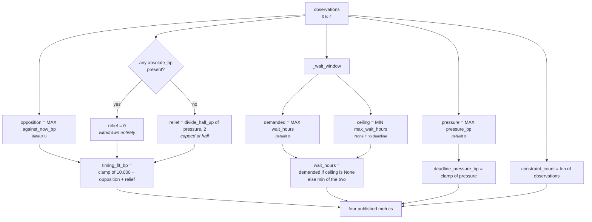
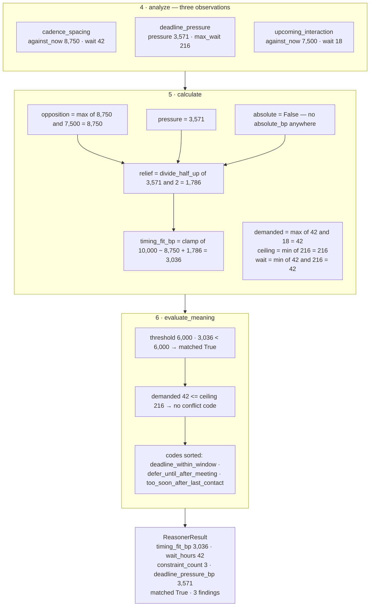

# 04 · Calculator — `core.scheduling`

**Stage 5 of the eight.** `@abstractmethod` on the base class — every unit must implement it. This is
one of the two stages a `ReasoningUnit` cannot inherit, and it is where four independent observations
become four published numbers.

---

## 1 · What it is for

The Calculator's job is to fold the Analyzer's partial evidence into this unit's metrics, using pure
integer arithmetic and nothing else. No IO, no clock, no floats, no branching on anything outside the
observations and `view.config`.

For `core.scheduling` the fold has to answer two questions that pull in opposite directions:

* **How good is *now*?** — which is a question about the strongest objection.
* **How long until it is better?** — which is a question about the longest clearance, bounded by the
  earliest deadline.

Neither answer is a sum. The docstring argues both, and this file mines that argument rather than
inventing another.

---

## 2 · What exists

```python
def calculate(self, view: UnitView,
              observations: Sequence[Observation]) -> Mapping[str, int]:
    """Strongest objection sets the fit; a closing deadline buys back at most half of it.

    Deliberately not additive. Two soft constraints do not compound into a prohibition — the
    binding objection is the one that most argues against acting now, and summing them would
    make any busy account permanently unactionable.

    The deadline term is relief rather than opposition: as a dated commitment closes, the cost
    of waiting rises, so the same pre-emption risk becomes more tolerable. It is capped at half
    the pressure so that pressure can soften a judgement but never manufacture a good moment,
    and it is withdrawn entirely when any constraint is marked absolute.
    """
    opposition = max((int(item.metrics.get("against_now_bp", 0)) for item in observations),
                     default=0)
    pressure = max((int(item.metrics.get("pressure_bp", 0)) for item in observations),
                   default=0)
    absolute = any("absolute_bp" in item.metrics for item in observations)
    relief = 0 if absolute else divide_half_up(pressure, 2)
    demanded, ceiling = _wait_window(observations)
    wait = demanded if ceiling is None else min(demanded, ceiling)
    return {"timing_fit_bp": clamp_bp(10_000 - opposition + relief),
            "wait_hours": max(0, wait),
            "constraint_count": len(observations),
            "deadline_pressure_bp": clamp_bp(pressure)}
```

and its one helper:

```python
def _wait_window(observations: Sequence[Observation]) -> tuple[int, int | None]:
    """The longest wait any constraint demands, and the hardest ceiling any constraint imposes.

    Waits take the maximum because a window only opens once *every* constraint has cleared;
    ceilings take the minimum because the earliest deadline is the one that binds.
    """
    demanded = max((int(item.metrics["wait_hours"]) for item in observations
                    if "wait_hours" in item.metrics), default=0)
    ceilings = [int(item.metrics["max_wait_hours"]) for item in observations
                if "max_wait_hours" in item.metrics]
    return demanded, (min(ceilings) if ceilings else None)
```

`_wait_window` is called **twice per evaluation** — once here and once in `evaluate_meaning`, which
needs `demanded` and `ceiling` again to decide whether to emit the conflict code. It is pure and
cheap at these input sizes (at most four observations), and the alternative — threading the tuple
through the `Verdict` — would give the Calculator an output the framework does not have a slot for.

### 2.1 · The five inputs and the four outputs

| Read from observations | By | Aggregation |
|---|---|---|
| `against_now_bp` | `cadence_spacing`, `quiet_window`, `upcoming_interaction` | **max**, default `0` |
| `pressure_bp` | `deadline_pressure` | **max**, default `0` |
| `absolute_bp` | `quiet_window` | **presence**, never the value |
| `wait_hours` | `cadence_spacing`, `quiet_window`, `upcoming_interaction` | **max**, default `0` |
| `max_wait_hours` | `deadline_pressure` | **min**, `None` if absent |

| Published | Formula |
|---|---|
| `timing_fit_bp` | `clamp_bp(10,000 − opposition + relief)` |
| `wait_hours` | `max(0, demanded if ceiling is None else min(demanded, ceiling))` |
| `constraint_count` | `len(observations)` |
| `deadline_pressure_bp` | `clamp_bp(pressure)` |

`view` is accepted and **never used**. There is no config read in this stage; the only tuning key
that reaches the Calculator's inputs (`deadline_urgent_bp`, the horizons, the gap) has already done
its work inside the plugins.

---

## 3 · How it works

### 3.1 · The whole fold, in one picture



The shape worth noticing: the fit and the wait are computed on **opposite polarities**, from
overlapping but different inputs. Opposition maximises and ceilings minimise; the deadline is the
only source of a ceiling and the only thing that never contributes opposition. That is the whole
design compressed into two lines of aggregation.

### 3.2 · Why the maximum, not the sum

```text
timing_fit_bp = clamp( 10,000 − MAX(against_now_bp) + relief )
```

> *Deliberately not additive. Two soft constraints do not compound into a prohibition — the binding
> objection is the one that most argues against acting now, and summing them would make any busy
> account permanently unactionable.*

The argument is about a specific failure and it is worth spelling out. A well-managed account has a
lot of timing facts: a call in the diary, an email sent yesterday, a renewal date. Under a sum, each
of those subtracts, so the *better* an account is managed the less actionable it becomes — and the
accounts the system most wants to protect are exactly the ones it would go silent on.

The max says something more defensible: *there is one reason not to act right now, and it is the
strongest one.* Verified,
`test_the_binding_objection_sets_the_fit_rather_than_the_sum_of_objections`:

```text
meeting +18h    → against_now_bp 7,500
outbound −24h   → against_now_bp 5,000

sum:  10,000 − 12,500 = −2,500 → clamp → 0        "never act"
max:  10,000 −  7,500 =  2,500                    "a poor moment"   ← what the code does
```

Under the sum the two constraints together would read as an absolute prohibition — the same reading
`quiet_window` produces from a stated boundary. Collapsing "two soft objections" into "a boundary"
would make `absolute_bp` meaningless.

The cost of the max is real and unrecorded: two 7,500bp objections read exactly as one does. The unit
publishes `constraint_count` so a reader can tell the two situations apart, but nothing in
`timing_fit_bp` reflects the second constraint at all. That is the accepted trade — a corroboration
lift of the kind `core.opportunity` uses (`strongest + Σ(rest) ÷ 4`) would have been available and
was not taken, presumably because a *bounded* lift on top of a max is still a compounding, and this
unit's failure mode is compounding.

### 3.3 · Why relief and not opposition

```text
relief = 0                              if any constraint is absolute
       = divide_half_up(pressure, 2)    otherwise
```

> *The deadline term is relief rather than opposition: as a dated commitment closes, the cost of
> waiting rises, so the same pre-emption risk becomes more tolerable.*

The deadline is the only constraint in the unit that argues against *waiting* rather than against
*acting*, so it enters the arithmetic with the opposite sign. What is being modelled is not "the
deadline makes now a good time" — it is "the deadline makes the alternative to now expensive", which
raises the bar for what counts as a good enough reason to defer.

Two guards keep that from becoming a licence.

**Capped at half.** *"It is capped at half the pressure so that pressure can soften a judgement but
never manufacture a good moment."* At maximum pressure the relief is 5,000bp, which cannot cancel a
maximum objection of 10,000. A maximum objection therefore always leaves `timing_fit_bp <= 5,000` —
below the default 6,000 threshold — so a maximally-objected moment is always `matched=True` no matter
how urgent the deadline. Without the cap, `10,000 − 10,000 + 10,000 = 10,000` would report the worst
possible moment as the best possible one.

**Withdrawn entirely when a constraint is absolute.** *"…and it is withdrawn entirely when any
constraint is marked absolute."* Our deadline is our problem. A quiet window plus a closing deadline
yields `0`, not `3,750`.

Note the exact mechanism: `any("absolute_bp" in item.metrics for item in observations)` tests for the
**key**, not for a truthy value. A hypothetical plugin emitting `absolute_bp: 0` would still withdraw
all relief. That is deliberate per the source comment — *"its presence, not its size, is what
withdraws deadline relief"* — and it is a sharp edge for anyone adding a fifth plugin (`03` §3.2).

### 3.4 · Why `clamp_bp` around the fit, and where it binds

```text
timing_fit_bp = clamp_bp(10,000 − opposition + relief)
```

Both ends of the clamp are reachable.

**The upper end binds whenever relief exceeds opposition.** A deadline 36 hours out against a meeting
60 hours out gives `10,000 − 1,667 + 4,465 = 12,798`, clamped to `10,000`. That is intentional but
lossy: the run "wanted" to report a fit of 128% and the metric has no room for it, so a moment made
*better* by urgency is indistinguishable from a moment that was already unconstrained.

**The lower end binds only through `absolute`, in practice.** Since `relief >= 0` and
`opposition <= 10,000`, the expression can only go negative if opposition is at its maximum and relief
is zero — which is exactly the quiet-window case, and it lands on `0` rather than below it. With the
`max` aggregation there is no path to a large negative, because the sum path that would produce one
was rejected in §3.2.

`ReasoningUnit.build` clamps every `_bp`-suffixed metric a second time on the way out, so
`timing_fit_bp` and `deadline_pressure_bp` pass through two clamps and `wait_hours` and
`constraint_count` pass through none.

### 3.5 · The wait window, and its two polarities

```python
demanded = max(wait_hours over observations that have it,      default=0)
ceilings = [max_wait_hours over observations that have it]
ceiling  = min(ceilings) if ceilings else None
wait     = demanded if ceiling is None else min(demanded, ceiling)
result   = max(0, wait)
```

> *Waits take the maximum because a window only opens once **every** constraint has cleared; ceilings
> take the minimum because the earliest deadline is the one that binds.*

Both halves are correct in isolation and the composition is where the unit's sharpest problem lives.

**`max` over waits is right.** Clearing a 42-hour cadence gap and an 18-hour meeting takes 42 hours,
not 18 and not 60. The window opens when the last constraint clears.

**`min` over ceilings is right.** Two deadlines — a contract expiry and an SLA — bind at the earlier
one. (Today only `deadline_pressure` emits a ceiling and there is at most one of it per run, so the
`min` is guarding a case that cannot yet occur.)

**`min(demanded, ceiling)` is where it goes wrong.** The composition is applied with no exception for
an absolute constraint, so a deadline can shorten a wait that a stated boundary makes unshortenable:

```text
schedule.quiet_until = +200h    (absolute)
deal.close_date      = +2h

demanded 200 · ceiling 2 · wait = 2
timing_fit_bp = 0        ← the boundary IS honoured in the fit
wait_hours    = 2        ← and is NOT honoured in the wait
```

The published pair says *never act* and *the window opens in two hours*. The Evaluator's
`timing_conflict_deadline_before_clearance` code fires here, which is the mitigation and is a real
one — the unit is naming an irreconcilable pair rather than resolving it — but the number itself is
fabricated in exactly the way the module docstring says a fabricated number must never be. README
§7.3.

### 3.6 · The empty analysis

Every aggregation carries an explicit default so an empty observation tuple is a first-class case
rather than an exception:

```text
observations = ()
opposition   = max((), default=0)        = 0
pressure     = max((), default=0)        = 0
absolute     = any(())                   = False
relief       = divide_half_up(0, 2)      = 0
demanded     = max((), default=0)        = 0
ceilings     = []                        → ceiling = None
wait         = demanded (the None branch) = 0

timing_fit_bp 10,000 · wait_hours 0 · constraint_count 0 · deadline_pressure_bp 0
```

The `ceiling is None` branch is not decoration: `min([])` raises `ValueError` in Python, so without
the sentinel every run with no deadline would crash. `None` here means *no ceiling exists* and is
distinguished from a ceiling of `0`, which is a real value a deadline inside the hour produces.

---

## 4 · A worked combination, end to end

The unit's flagship scenario, `test_the_night_before_the_call_is_reported_as_a_bad_moment_to_write`.
Northwind renewal, 6 August 12:00 UTC. The buyer's call is at 06:00 tomorrow, we emailed them six
hours ago, and the contract lapses in nine days.

```python
facts = {"deal.status": "open",
         "calendar.next_meeting_at": "<+18h>",     # 06:00 on 7 August
         "deal.last_outbound":       "<-6h>",      # we emailed at 06:00 today
         "deal.close_date":          "<+216h>"}    # nine days out, inside the 14-day window
```

### 4.1 · Stage 4 — three observations, in `plugin_id` order

```text
cadence_spacing        {against_now_bp: 8_750, elapsed_hours: 6,  wait_hours: 42}
deadline_pressure      {pressure_bp:    3_571, hours_left:  216, max_wait_hours: 216}
upcoming_interaction   {against_now_bp: 7_500, hours_ahead: 18,  wait_hours: 18}
```

`quiet_window` is silent — no `schedule.quiet_until` in the snapshot.

### 4.2 · Stage 5 — the arithmetic



In arithmetic:

```text
opposition = max(8_750, 7_500)                       = 8_750     ← cadence binds, not the calendar
pressure   = 3_571
absolute   = False
relief     = divide_half_up(3_571, 2) = (3_571 + 1) // 2         = 1_786

timing_fit_bp = clamp_bp(10_000 − 8_750 + 1_786)
              = clamp_bp(3_036)                                  = 3_036

demanded   = max(42, 18)                             = 42
ceiling    = min(216)                                = 216
wait       = min(42, 216)                            = 42        ← the deadline does not bind
wait_hours = max(0, 42)                                          = 42

constraint_count     = len(observations)                         = 3
deadline_pressure_bp = clamp_bp(3_571)                           = 3_571
```

The test pins every number:

```python
assert result.metrics["deadline_pressure_bp"] == 3_571
assert result.metrics["timing_fit_bp"] == 10_000 - 8_750 + 1_786
assert result.metrics["wait_hours"] == 42
```

### 4.3 · What the fold decided that no single plugin knew

Three things, and none of them is visible from any one observation:

**The cadence outranked the calendar.** The scenario is named for the meeting, and the meeting is not
the binding objection — the fact that we already wrote this morning is. A unit that only checked the
calendar would have reported 7,500bp of opposition and an 18-hour wait, understating both.

**The deadline bought back exactly half of the pressure it earned, and no more.** 3,571bp of pressure
became 1,786bp of relief — enough to move the fit from 1,250 to 3,036, not enough to move it past the
6,000 threshold. Nine days is real urgency and it is not enough urgency to make this morning's
follow-up a good idea.

**The ceiling did not bind, so no conflict was claimed.** 42 hours of clearance against 216 hours of
runway. Had the close date been 36 hours out instead, `wait_hours` would have been 36 and
`timing_conflict_deadline_before_clearance` would have been published — the case
`test_a_deadline_caps_a_deferral_and_the_conflict_is_named` covers.

---

## 5 · Edge cases

### 5.1 · A metric key that is absent versus present-and-zero

`opposition` and `pressure` use `.get(key, 0)`; `demanded` and `ceilings` use `if key in metrics`.
The difference matters:

| Situation | `opposition` | `demanded` | `ceiling` |
|---|---|---|---|
| deadline only | `0` (key absent, default used) | `0` (no `wait_hours` key anywhere) | `84` |
| meeting at exactly the horizon | `0` (key present, **value is zero**) | `72` | `None` |

The second row is the off-by-one from README §7.1 seen from the Calculator's side. `against_now_bp: 0`
and no `against_now_bp` at all produce the same `opposition`; but the observation still carries
`wait_hours: 72`, so it moves `demanded` and `constraint_count` while contributing nothing to the
fit. The `.get(…, 0)` pattern is what makes the zero invisible here — the Calculator cannot tell a
measured zero from an absent key, and the plugin is where that distinction was supposed to be
enforced.

### 5.2 · Rounding

`divide_half_up(pressure, 2)` is `(pressure + 1) // 2` for non-negative input. Odd pressures round
**up**:

| `pressure_bp` | `relief` |
|---|---|
| 3,571 | 1,786 |
| 7,500 | 3,750 |
| 8,929 | 4,465 |
| 9,999 | 5,000 |
| 1 | 1 |

Rounding the relief up rather than down is a one-basis-point bias toward acting. It is immaterial at
these magnitudes and it is deterministic, which is the property that actually matters:
`divide_half_up` is integer arithmetic with no floating-point step anywhere, so the same inputs give
the same basis points on every machine and the semantic hash is reproducible.

### 5.3 · `constraint_count` counts observations, not distinct constraints

`len(observations)`, not `len({o.kind for o in observations})`. Today every plugin returns at most one
observation, so the two are identical and `constraint_count` is bounded at 4. A future plugin
returning two observations — one per meeting on a busy day, say — would raise the count without any
of the aggregations changing, and `constraint_count` would silently start meaning "observations"
rather than "constraints".

### 5.4 · What the Calculator cannot express

Three things, all deliberate and all worth knowing before someone tries to add them:

**Corroboration.** Two independent 7,000bp objections read exactly as one does. `core.opportunity`
and `core.cost` both use a `strongest + Σ(rest) ÷ 4` lift for exactly this situation; this unit does
not, because a lift is a bounded compounding and compounding is the failure mode §3.2 exists to
prevent.

**Which constraint is binding.** The result publishes `timing_fit_bp` but not *whose* objection set
it. A reader can recover it from the findings — each carries its own `against_now_bp` — but there is
no `binding_constraint` metric, and `reason_codes` is a sorted set with no ordering by strength.
Compare `core.tradeoff`, which publishes an explicit `headline.favours.*` for the same reason.

**A wait in anything finer than hours.** Everything is whole hours, floored, from `_hours_ahead` and
`elapsed_hours` upward. That is what produces the sub-hour contradictions in README §7.2, and fixing
it is a change to the two clock helpers rather than to this stage.

---

## Related

| Document | Covers |
|---|---|
| [03 · Analyzer](03-Analyzer.md) | the five metric keys this stage reads, and why they are a protocol |
| [03b · `deadline_pressure`](03b-plugin-deadline_pressure.md) | where `pressure_bp` and `max_wait_hours` come from |
| [03c · `quiet_window`](03c-plugin-quiet_window.md) | the `absolute_bp` marker that zeroes `relief` |
| [05 · Evaluator](05-Evaluator.md) | the second call to `_wait_window`, and the conflict code |
| [README · Builder and Metrics](README.md) | the second `clamp_bp` pass, and the `publishes` guard |
| README §7.3 | `min(demanded, ceiling)` applied through an absolute constraint |
