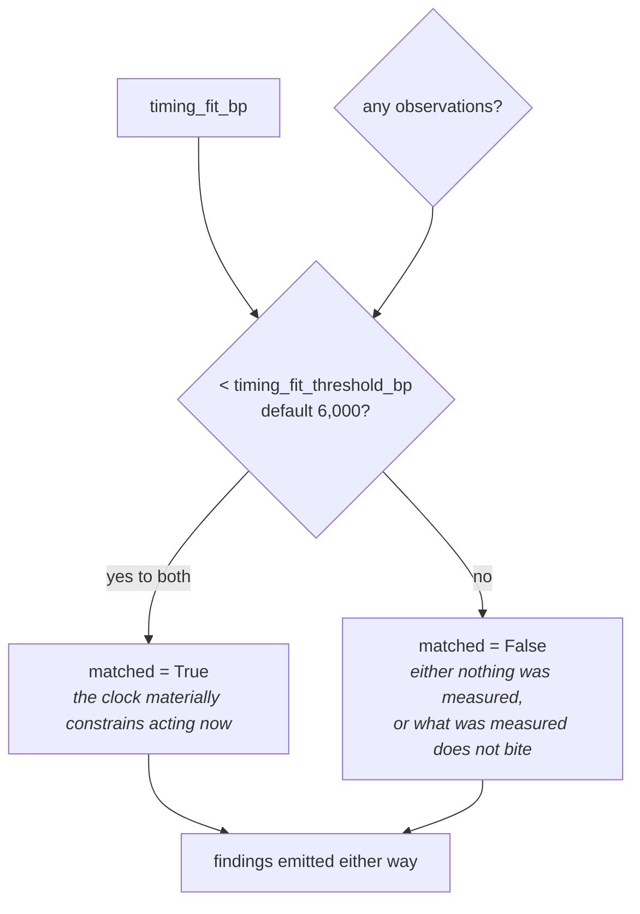

# 05 · Evaluator — `core.scheduling`

**Stage 6 of the eight.** `@abstractmethod` on the base class — every unit must implement it. This is
where four numbers become a reading: *does the clock materially constrain acting now, and what is the
trace that proves it?*

---

## 1 · What it is for

The Evaluator turns the Calculator's arithmetic into meaning, in this unit's own terms. It owns three
decisions:

* **The verdict** — one threshold, one comparison, no gradient.
* **The trace** — one `Finding` per observed constraint, emitted whatever the verdict says.
* **The vocabulary** — the union of the plugins' reason codes, plus two the Evaluator alone can add.

It owns one non-decision as well, and it is the most important thing about this stage: it emits **no
`CandidateAdjustment` and no `CandidateCheck`**, ever. The `Verdict`'s `adjustments` and `checks`
fields are left at their defaults on every path.

---

## 2 · What exists

```python
def evaluate_meaning(self, view: UnitView, metrics: Mapping[str, int],
                     observations: Sequence[Observation]) -> Verdict:
    """`matched` means the clock materially constrains acting now — not that we should wait.

    Every observed constraint becomes a finding regardless of the verdict, because "we checked
    the calendar and the meeting was three days out" is exactly the trace someone needs when
    they later ask why the system sent something the day before a call.
    """
    threshold = _config_bp(view, "timing_fit_threshold_bp", 6_000)
    constrained = bool(observations) and metrics["timing_fit_bp"] < threshold
    findings = tuple(Finding(
        finding_id=f"scheduling.{item.plugin_id}",
        kind="scheduling",
        matched=True,
        metrics=item.metrics,
        evidence_ids=item.evidence_ids,
        reason_codes=item.reason_codes,
    ) for item in observations)
    codes = {code for item in observations for code in item.reason_codes}
    demanded, ceiling = _wait_window(observations)
    if ceiling is not None and demanded > ceiling:
        # The wait that clears the calendar runs past the deadline it would blow. Both facts
        # are true and irreconcilable; naming the conflict is the unit's job, resolving it is
        # the Decision Maker's.
        codes.add("timing_conflict_deadline_before_clearance")
    if not observations:
        codes.add("timing_unconstrained")
    return Verdict(
        matched=constrained,
        metrics=dict(metrics),
        findings=findings,
        reason_codes=tuple(sorted(codes)),
    )
```

### 2.1 · The one threshold

| Key | Type | Default | Read |
|---|---|---|---|
| `timing_fit_threshold_bp` | `int`, `0..10_000` | `6_000` | unconditionally, first line of the stage |

Read before anything else, so a misauthored value fails on every run rather than only on runs that
happen to take a branch. `test_a_float_threshold_authored_in_layer_three_fails_loudly` exercises it —
though the guard that actually catches a `float` is `canonicalize` at `ReasonerSpec` construction,
one layer up (README §7.7); `_config_bp`'s own branch is reached by a `Decimal`:

```text
{"timing_fit_threshold_bp": 6000.0}          → CanonicalizationError (a ValueError) at spec build
{"timing_fit_threshold_bp": Decimal("6000")} → ValueError: timing_fit_threshold_bp must be integer
                                                           basis points                ← _config_bp
{"timing_fit_threshold_bp": -1}              → same
{"timing_fit_threshold_bp": 10001}           → same
{"timing_fit_threshold_bp": True}            → same (bool rejected before the int check)
```

**Untuned.** `6,000bp` is authored from domain reasoning and has never been fitted against outcome
data. The shipped capability overrides it with nothing.

### 2.2 · What the Verdict carries, and what it does not

| Field | Value |
|---|---|
| `matched` | `constrained` — a `bool`, **never `None`** |
| `metrics` | `dict(metrics)` — a copy of the Calculator's four, unchanged |
| `findings` | one per observation, in `plugin_id` order |
| `reason_codes` | `tuple(sorted(codes))` |
| `adjustments` | `()` — the default, on every path |
| `checks` | `()` — the default, on every path |

`test_the_unit_analyses_and_never_decides` asserts the last two on a snapshot where all four plugins
fire: *"no adjustment, no check, no ranking: synthesis belongs to the Decision Maker alone."*

This is the category-level rule from [Category 3 README §3.1](../README.md). Four of the five
Optimization units may only inform Part 3; only `core.policy` may shrink the field. `core.scheduling`
is squarely in the first group, and the reason is jurisdictional rather than technical: *"a bad
moment"* is a judgement a human may reasonably overrule, and a unit that removed the play would
remove the human's ability to overrule it.

---

## 3 · How it works

### 3.1 · The verdict

```python
constrained = bool(observations) and metrics["timing_fit_bp"] < threshold
```

> *`matched` means the clock materially constrains acting now — not that we should wait.*

That distinction is the whole of stage 6 and it is easy to lose. `matched=True` is a statement about
the *situation*, not an instruction about the *response*. The unit is saying: there is something real
here that a decision about timing has to account for. What to do about it — send anyway, defer, pick
a different play — is Part 3's.

Reading it as "we should wait" produces a specific inversion, recorded in README §7.8:
`orchestrator.py:213` turns `gating and matched is False` into `DecisionOutcome.NO_ACTION`, so a
capability that gated on this unit would stop the run precisely when the timing was perfect.
`ReasonerSpec` forbids `gating` on an `OPTIONAL` reasoner, so the shipped manifest cannot do it, but
nothing names the trap.

**`bool(observations)` can never be the deciding term.** With no observations `timing_fit_bp` is
`10,000`, and `timing_fit_threshold_bp` is capped at `10,000`, so `10_000 < threshold` is `False` on
every legal configuration. The guard is documentary — it states that a verdict of "constrained"
requires an evidenced constraint — rather than functional. Worth knowing before someone "simplifies"
it away: it would become load-bearing the moment any future change let `timing_fit_bp` fall below
10,000 without an observation.

### 3.2 · Where the threshold actually bites



`matched=False` is doing double duty and there is no metric that separates the two readings except
`constraint_count`:

| `constraint_count` | `matched` | Reading |
|---|---|---|
| `0` | `False` | nothing was measured — the code `timing_unconstrained` says so |
| `> 0` | `False` | constraints were measured and none of them bites |
| `> 0` | `True` | the clock materially constrains acting now |

Verified boundary, with a lone meeting at the default 72-hour horizon and 6,000bp threshold:

| `hours_ahead` | `against_now_bp` | `timing_fit_bp` | `matched` |
|---|---|---|---|
| 42 | 4,167 | 5,833 | **True** |
| 43 | 4,028 | 5,972 | **True** |
| **44** | 3,889 | **6,111** | **False** |
| 45 | 3,750 | 6,250 | False |

So under the shipped defaults, a meeting inside roughly 43 hours materially constrains and one
outside it does not. Neither 72 nor 6,000 was fitted to data, so that 43-hour line is the product of
two independent guesses.

### 3.3 · Why findings are emitted whatever the verdict

> *Every observed constraint becomes a finding regardless of the verdict, because "we checked the
> calendar and the meeting was three days out" is exactly the trace someone needs when they later ask
> why the system sent something the day before a call.*

This is the opposite of `core.opportunity`, which emits **no findings and no reason codes** below its
threshold, and it is the right choice for this unit. The question an operator asks after a bad send
is never *"was the timing score high?"* — it is *"did you know about the call?"*. A result that
suppressed its findings below the threshold could not answer that, and a run that correctly noticed a
meeting three days out and correctly decided it did not matter would be indistinguishable from a run
that never looked.

`test_every_observed_constraint_becomes_an_auditable_finding`: *"someone will later ask why we wrote
the day before a call; the trace must answer."*

Each finding is:

```text
finding_id     f"scheduling.{item.plugin_id}"      → scheduling.cadence_spacing, etc.
kind           "scheduling"                        → the same for all four
matched        True                                → always, see §5.3
metrics        item.metrics                        → the observation's own, verbatim
evidence_ids   item.evidence_ids                   → the one fact this plugin read
reason_codes   item.reason_codes                   → the plugin's own
```

`Finding.__post_init__` re-validates every `_bp`-suffixed metric through `_bp(value, …)`, so
`against_now_bp`, `absolute_bp` and `pressure_bp` are checked a second time on the way into the
finding. All three are already clamped in-plugin, so the check never fires — but it is what would
catch a future plugin that computed a strength without clamping it.

### 3.4 · The two codes only the Evaluator can add

```python
codes = {code for item in observations for code in item.reason_codes}
demanded, ceiling = _wait_window(observations)
if ceiling is not None and demanded > ceiling:
    codes.add("timing_conflict_deadline_before_clearance")
if not observations:
    codes.add("timing_unconstrained")
```

**`timing_conflict_deadline_before_clearance`.** The wait that clears the calendar runs past the
deadline it would blow. The source comment is a statement of jurisdiction:

> *Both facts are true and irreconcilable; naming the conflict is the unit's job, resolving it is the
> Decision Maker's.*

`_wait_window` is called a second time here, duplicating the Calculator's call. It is pure and cheap
at four observations; the alternative would be threading the tuple through the `Verdict`, which has
no slot for it.

**`timing_unconstrained`.** The only positive statement the unit makes about absence. It exists for
the reason `core.policy` emits `organisation_policy_clear` and `core.tradeoff` — noted as a bug in
Category 3 README §4.1 — does not: a silent result must be distinguishable from an unconfigured one.

**And one that does not exist.** There is no code for *"constraints were measured and none of them
bites"*. A run with a meeting 70 hours out publishes `('defer_until_after_meeting',)` and
`matched=False`, which is legible; but there is no `timing_clear` counterpart to
`timing_unconstrained`, so the only way to distinguish "measured and fine" from "not measured" is
`constraint_count`.

### 3.5 · Code ordering and determinism

`codes` is a `set`, whose iteration order is not stable across runs in the general case, and it is
published as `tuple(sorted(codes))`. The sort is what makes
`test_the_same_situation_reasons_identically_twice` — which asserts equal `semantic_hash` — a real
assertion. `ReasonerResult.__post_init__` sorts and dedupes again on the way in, so the ordering is
enforced twice.

`findings` is **not** sorted here. It inherits the observation order, which is `plugin_id` order from
`analyze`. Finding order reaches the semantic hash, so that inherited sort is load-bearing.

### 3.6 · `matched` is never `None`

Every other silence in this unit is expressed as absence; the verdict is not. `constrained` is a
`bool` on every path, so `ReasonerResult.matched` is always `True` or `False`.

That is a deliberate difference from `core.timeline` (`matched=None` when no event can be dated) and
`core.resource` (`matched=None` when nothing was measured). Both of those units are describing a
state of the world that they may be blind to. This unit is answering a question whose "no evidence"
answer is a real answer: with no timing fact in the snapshot, *the clock does not constrain us* is
the correct claim, not an admission of blindness. `01` §3.2 argues the same point about the validator.

The cost is that a genuinely blind case — Layer 2 down, no facts at all — is indistinguishable from a
genuinely clear one. Both report `matched=False, constraint_count=0, timing_unconstrained`. The unit
has no way to know the difference, because it never reads `context.missing_fields`.

---

## 4 · Worked examples

### 4.1 · Constrained — the flagship scenario

```python
facts = {"deal.status": "open", "calendar.next_meeting_at": "<+18h>",
         "deal.last_outbound": "<-6h>", "deal.close_date": "<+216h>"}
```

```text
threshold   = 6_000                                    # default
timing_fit_bp 3_036 < 6_000  and  3 observations       → matched True

findings (in plugin_id order)
  scheduling.cadence_spacing        {against_now_bp: 8_750, elapsed_hours: 6,  wait_hours: 42}
  scheduling.deadline_pressure      {pressure_bp: 3_571, hours_left: 216, max_wait_hours: 216}
  scheduling.upcoming_interaction   {against_now_bp: 7_500, hours_ahead: 18,  wait_hours: 18}

codes  {'too_soon_after_last_contact', 'deadline_within_window', 'defer_until_after_meeting'}
demanded 42 · ceiling 216 · 42 <= 216                  → no conflict code
observations present                                   → no timing_unconstrained

reason_codes ('deadline_within_window', 'defer_until_after_meeting',
              'too_soon_after_last_contact')
```

`test_the_night_before_the_call_is_reported_as_a_bad_moment_to_write` pins the exact tuple. Note that
`act_before_deadline` is **absent**: 3,571bp of pressure is below the 7,500bp urgency bar, so nine
days out is inside the window but not urgent.

### 4.2 · Unconstrained — the empty snapshot

```python
facts = {"deal.status": "open"}
```

```text
observations ()                                        → matched = False (short-circuits)
findings     ()
codes        set() → {'timing_unconstrained'}

result  timing_fit_bp 10,000 · wait_hours 0 · constraint_count 0 · deadline_pressure_bp 0
        matched False · reason_codes ('timing_unconstrained',) · findings ()
```

`test_an_unconstrained_situation_reports_a_perfect_fit_and_says_so`: *"with nothing in the diary and
no recent contact, 'now' must not be penalised."*

### 4.3 · Measured, but not biting

```python
facts = {"calendar.next_meeting_at": "<+70h>"}
```

```text
against_now_bp 278 → timing_fit_bp 9_722 · 9_722 >= 6_000       → matched False
findings [Finding('scheduling.upcoming_interaction', matched=True,
                  {against_now_bp: 278, hours_ahead: 70, wait_hours: 70})]
reason_codes ('defer_until_after_meeting',)
constraint_count 1
```

The verdict says the clock does not materially constrain us; the finding records that we looked and
found a meeting three days out. Note the two `matched` values in one result: `False` at the unit level
and `True` on the finding. §5.3.

### 4.4 · The conflict, on a perfect fit

```python
facts = {"calendar.next_meeting_at": "<+60h>",     # clearing takes 60h
         "deal.close_date":          "<+36h>"}     # only 36h available
```

```text
opposition 1_667 · pressure 8_929 · relief 4_465
timing_fit_bp = clamp_bp(10,000 − 1_667 + 4_465) = clamp_bp(12_798)   = 10_000
10_000 >= 6_000                                                       → matched False

demanded = max(60) = 60 · ceiling = min(36) = 36 · 60 > 36
                                     → timing_conflict_deadline_before_clearance

result  timing_fit_bp 10,000 · wait_hours 36 · constraint_count 2 · deadline_pressure_bp 8,929
        matched False
        reason_codes ('act_before_deadline', 'deadline_within_window',
                      'defer_until_after_meeting',
                      'timing_conflict_deadline_before_clearance')
```

`test_a_deadline_caps_a_deferral_and_the_conflict_is_named` asserts `wait_hours == 36` and the code's
presence. What it does not assert, and what matters downstream, is that **the run's most important
output is a reason code on a `matched=False` result at a maximum timing fit.** A consumer filtering
on `matched is True` drops it. README §7.4.

### 4.5 · The absolute case

```python
facts = {"schedule.quiet_until": "<+30h>", "deal.close_date": "<+84h>"}
```

```text
opposition 10,000 · absolute True → relief 0
timing_fit_bp 0 · 0 < 6_000 · 2 observations                    → matched True

demanded 30 · ceiling 84 · 30 <= 84                             → no conflict code
reason_codes ('act_before_deadline', 'deadline_within_window', 'inside_quiet_period')
```

`test_deadline_pressure_cannot_talk_the_system_past_a_quiet_window` asserts
`timing_fit_bp == 0` and `'inside_quiet_period' in reason_codes`.

Both codes travel together, and they are the two halves of a sentence a human can read: *the deal
closes in three and a half days, and we may not write until tomorrow afternoon.* Neither is
suppressed in favour of the other, which is the unit refusing to resolve a tension it is not
authorised to resolve.

### 4.6 · A capability that raises the bar

```python
facts  = {"calendar.next_meeting_at": "<+18h>"}
config = {"timing_fit_threshold_bp": 2_000}
```

```text
timing_fit_bp 2_500 · 2_500 >= 2_000                            → matched False
```

The identical snapshot is `matched=True` under the default 6,000 threshold. Lowering the threshold
narrows what counts as a material constraint — appropriate for a capability whose plays are cheap and
reversible, where a slightly awkward moment should not register as a real obstacle. Nothing else in
the result changes: the finding, the metrics and the reason codes are byte-identical. Only the
reading moves.

---

## 5 · Edge cases

### 5.1 · The threshold boundary is exact and undefended

`constrained` uses `<`, not `<=`. A `timing_fit_bp` exactly equal to `timing_fit_threshold_bp` is
**not** constrained. No test pins the boundary in either direction, and no snapshot in the suite lands
on it. Given that both the horizon and the threshold are untuned guesses, the exact boundary is not
currently meaningful — but it is the kind of thing that becomes meaningful the day someone calibrates
one of them.

### 5.2 · `act_before_deadline` is the only imperative in the vocabulary

Six of the seven reason codes describe a state: `deadline_within_window`,
`defer_until_after_meeting`, `too_soon_after_last_contact`, `inside_quiet_period`,
`timing_conflict_deadline_before_clearance`, `timing_unconstrained`. One is phrased as an
instruction: `act_before_deadline`.

On a unit whose entire premise is *"it does not choose an action, does not rank plays"*, that is a
naming inconsistency rather than a behavioural one — nothing downstream reads the code, and the
observation it rides on emits no opposition. But it is the one string in the module that reads like
advice, on a result that carries none. `deadline_urgent` or `deadline_imminent` would say the same
thing without the imperative.

### 5.3 · Every finding claims `matched=True`

`Finding(..., matched=True)` is hard-coded. There is no path on which this unit emits a finding with
`matched=False` or `None`, so the field carries no information at the finding level.

The intended reading is presumably *this constraint was observed* — which is true, and is also
exactly what the finding's existence already says. The confusion is that the same field name means
something different one level up: on `ReasonerResult`, `matched` is a threshold reading, and on a run
where the unit concluded `matched=False` the result carries findings that say `True`. Verified in
§4.3. Nothing in the code notes the shift.

### 5.4 · `metrics=item.metrics` shares the observation's mapping

The finding is constructed with the `Observation`'s own metrics object, which is a
`MappingProxyType` frozen by `Observation.__post_init__`. `Finding.__post_init__` then runs it
through `_mapping(...)`, which freezes it again. No mutation is possible at either level, so the
sharing is safe — but it does mean the finding's metric names are the *plugin's* vocabulary
(`against_now_bp`, `hours_ahead`, `max_wait_hours`) rather than the unit's published vocabulary
(`timing_fit_bp`, `wait_hours`). A reader of the result sees two different metric namespaces: four
names in `result.metrics` and up to nine different ones across the findings, with no overlap at all.

That is defensible — the finding is a record of a plugin's observation, not a decomposition of the
published number — but it means the published `timing_fit_bp` cannot be reconstructed from the
findings without knowing the Calculator's formula. Compare `core.confidence`, which publishes an
explicit decomposition finding for exactly this reason.

### 5.5 · The `publishes` guard runs immediately after this stage

```python
undeclared = sorted(set(verdict.metrics) - set(self.publishes)) if self.publishes else []
if undeclared:
    raise ValueError(f"{self.unit_id} published undeclared metrics: {', '.join(undeclared)}")
```

`Verdict.metrics` is `dict(metrics)` — an unmodified copy of the Calculator's four keys — so
`undeclared` is always empty for this unit. `test_published_metrics_are_exactly_the_declared_ones`
pins both directions: `set(result.metrics) <= set(SchedulingUnit.publishes)` and equality with the
literal four names.

If a future change added, say, `binding_constraint_bp` to the Calculator's return without adding it
to `publishes`, the run would raise
`ValueError: core.scheduling published undeclared metrics: binding_constraint_bp` — at development
time, on the first test, not six months later when something downstream started reading a metric
nobody knew was moving. Covered in `06`.

---

## Related

| Document | Covers |
|---|---|
| [04 · Calculator](04-Calculator.md) | where `timing_fit_bp` comes from, and the first `_wait_window` call |
| [README · Builder and Metrics](README.md) | how the `Verdict` becomes a `ReasonerResult`, and who reads it |
| [03b · `deadline_pressure`](03b-plugin-deadline_pressure.md) | `act_before_deadline` and its 7,500bp bar |
| [Category 3 README §3.1](../README.md) | why only `core.policy` may emit `ELIMINATE` |
| README §7.4, §7.8, §7.9 | the conflict-on-`matched=False` case, the gating inversion, the finding `matched` |
