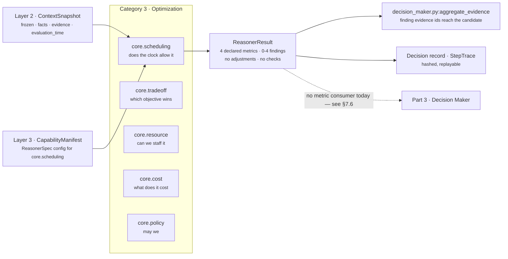
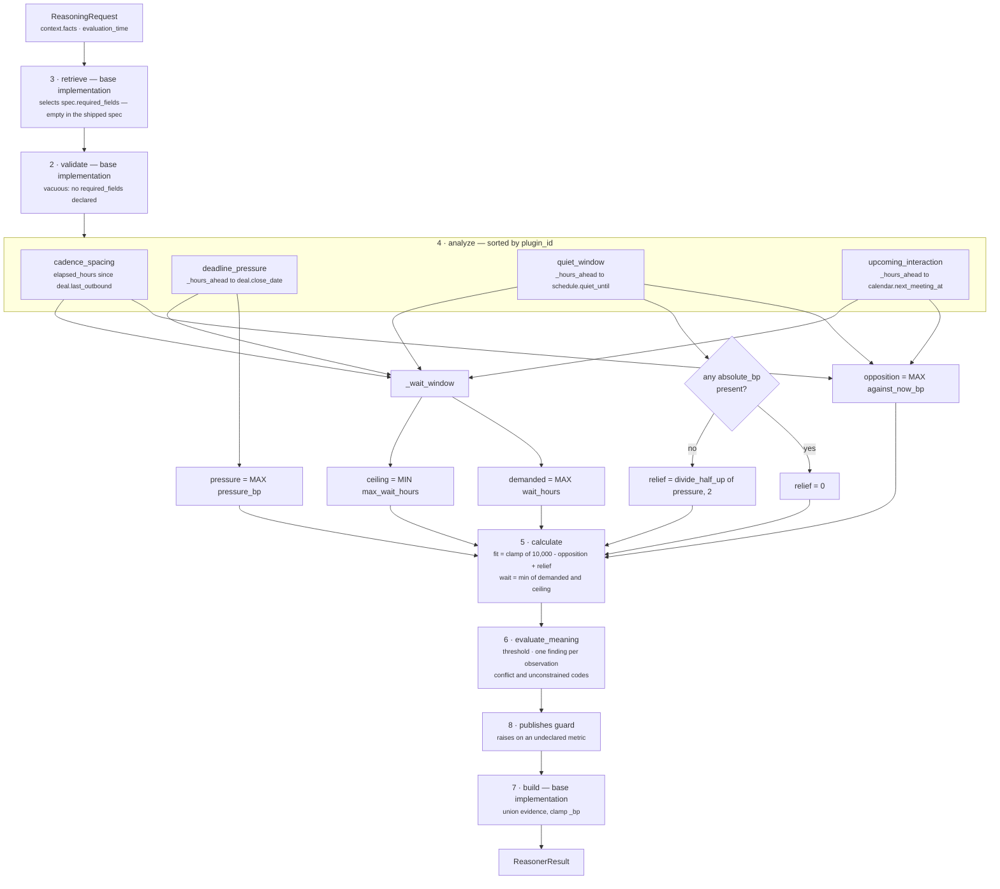

# `core.scheduling` — does the clock allow this now, and if not, when?

**Module:** `genios_engine/reason/reasoners/scheduling_unit.py` (318 lines)
**Tests:** `tests/test_unit_scheduling_unit.py` — 28 assertions, all passing
**Category:** `UnitCategory.OPTIMIZATION` (Category 3, unit 3 of 5)
**Version:** `1.0.0`
**Registered:** `reasoners/__init__.py:OPTIMIZATION = (TradeoffUnit, ResourceUnit, SchedulingUnit, CostUnit, PolicyUnit)`
**Plugins:** 4 — the only unit in the seventeen that registers more than three

---

## 1 · What it is for

**The business question:** *does the clock allow this to happen now, and if not, when does it?*

"When" is half of a good recommendation and the half GeniOS used to get wrong. The module docstring
puts the failure mode in one sentence, and it is the whole reason the unit exists:

> *"Follow up today" is not advice, it is damage, if the same buyer has a call with us tomorrow
> morning: the follow-up pre-empts the meeting, burns the reason to meet, and makes the sender look
> like they do not know their own calendar.*

So the unit collects the timing constraints that are **actually evidenced in the snapshot** — a
scheduled interaction, a dated deadline, a declared cadence gap, a stated quiet period — and reports
two numbers:

* `timing_fit_bp` — how well *acting now* sits with those constraints. `10,000bp` means nothing in
  the situation argues against now.
* `wait_hours` — the shortest wait that clears every constraint at once, bounded by any deadline
  that will not wait for it.

**What it deliberately does not do.** It chooses no action, ranks no play, and emits **no candidate
adjustments and no candidate checks**. `test_the_unit_analyses_and_never_decides` asserts
`result.adjustments == ()` and `result.checks == ()`. It reports the shape of the window; the
Decision Maker decides what to put inside it.

**Silence is the design.** A constraint the snapshot cannot evidence is a constraint the unit says
nothing about:

> *An invented "wait 24 hours" is worse than no timing advice at all, because it is
> indistinguishable from a measured one.*

### Why this is not `core.policy`'s `timing_rules`

The two both read clocks and they are not duplicates. `policy_unit.py:349` draws the line:

| | `core.policy` · `timing_rules` | `core.scheduling` (this unit) |
|---|---|---|
| Reads | rules **the tenant wrote down** — blackout dates, working hours | timing facts **the situation carries** — a meeting, a close date, a quiet window |
| Owner | the organisation's handbook, in capability config | Layer 2's snapshot of the world |
| May emit | `CandidateCheck` WARN and ELIMINATE | nothing — metrics and findings only |
| Failure of the other | writing during a declared blackout | writing the night before the call |

A blackout is a rule about *us*. A booked meeting is a fact about *them*. Only one of those is a
compliance question, which is why only one of them may remove a play.

---

## 2 · Its place in the pipeline



The unit declares **no dependencies** and reads **no prior result**. `view.prior` is unused in the
entire module: every number comes from `request.context.facts` and `request.evaluation_time`. That
means it can be scheduled anywhere in a capability DAG without changing its answer, and it is one of
the few units whose output is a pure function of Layer 2's snapshot alone.

In `sales.deal_cooling_full` v2 — the only capability that names it — the whole declaration is:

```python
_spec("core.scheduling")
#     dependencies=()   required_fields=()   config={}
#     latency_budget_ms=60   failure_policy=OPTIONAL   gating=False
```

`core.scheduling` is not in `deal_cooling_v2.py:_REQUIRED`, so its `failure_policy` is `OPTIONAL`: a
failure degrades confidence rather than blocking advice. The manifest ships with
`live_delivery_enabled=False`.

---

## 3 · Plugins

`analyze()` is the base implementation, so execution order is **alphabetical by `plugin_id`**, not
the order of the `plugins` tuple in the class body.

```python
plugins = (UpcomingInteractionPlugin(), DeadlinePressurePlugin(),
           CadenceSpacingPlugin(), QuietWindowPlugin())
# registration: upcoming_interaction · deadline_pressure · cadence_spacing · quiet_window
# execution:    cadence_spacing · deadline_pressure · quiet_window · upcoming_interaction
```

| # | `plugin_id` | Class | Observation `kind` | Default fact | Claim | Silent when |
|---|---|---|---|---|---|---|
| 1 | `cadence_spacing` | `CadenceSpacingPlugin` | `scheduling.cadence_spacing` | `deal.last_outbound` | we wrote to them too recently | fact absent, unparseable, future-stamped, or the gap has cleared |
| 2 | `deadline_pressure` | `DeadlinePressurePlugin` | `scheduling.deadline_pressure` | `deal.close_date` | a dated commitment is closing | fact absent, unparseable, already past, or outside the window |
| 3 | `quiet_window` | `QuietWindowPlugin` | `scheduling.quiet_window` | `schedule.quiet_until` | they told us when we may next speak | fact absent, unparseable, or expired |
| 4 | `upcoming_interaction` | `UpcomingInteractionPlugin` | `scheduling.upcoming_interaction` | `calendar.next_meeting_at` | a booked meeting would be pre-empted | fact absent, unparseable, past, or beyond the horizon |

The plugins do not communicate. `calculate()` selects by **metric key presence**
(`against_now_bp`, `pressure_bp`, `absolute_bp`, `wait_hours`, `max_wait_hours`), never by position
or by `kind`, so execution order affects only the order findings are emitted in — which reaches the
semantic hash and is therefore why the sort exists at all.

**Three of the four argue against acting now; the deadline argues only against waiting.** That
asymmetry is the entire design of the Calculator, and it is expressed in the metric names: the
deadline plugin emits **no `against_now_bp` at all** (`test_a_closing_deadline_creates_pressure_but_never_opposes_acting_now`
asserts the key is absent), and `quiet_window` is the only plugin that emits `absolute_bp`.

Detail on each is in `03a`–`03d`.

---

## 4 · Published metrics

```python
publishes = ("constraint_count", "deadline_pressure_bp", "timing_fit_bp", "wait_hours")
```

| Metric | Range | Meaning | Present when |
|---|---|---|---|
| `timing_fit_bp` | `0..10000` | how well acting **now** sits with every constraint; `10,000` = nothing argues against now | **always** |
| `wait_hours` | `0..8760` | shortest wait that clears every constraint, capped by the earliest deadline | **always** |
| `constraint_count` | `0..4` | how many constraints were actually evidenced | **always** |
| `deadline_pressure_bp` | `0..10000` | how far into the deadline window the commitment has travelled | **always** (`0` when no deadline fired) |

Unlike most units in the roster, **all four metrics are always published**. There is no
absent-means-unknown convention here; the "we measured nothing" state is expressed by
`constraint_count == 0` together with the reason code `timing_unconstrained`, and that pairing is
what a reader must key off. `test_an_unconstrained_situation_reports_a_perfect_fit_and_says_so` pins
the shape:

```text
timing_fit_bp 10,000 · wait_hours 0 · constraint_count 0 · deadline_pressure_bp 0
matched False · reason_codes ("timing_unconstrained",)
```

None of the four is a reserved shared metric.
`test_the_unit_never_touches_a_reserved_shared_metric` pins `publishes` disjoint from
`{confidence_bp, urgency_bp, priority_override_bp}`, with the class docstring's reason:

> *…a scheduling unit that touched them would silently re-score every capability in the roster every
> time somebody put a meeting in a calendar.*

### Reason codes

| Code | Emitted by | When |
|---|---|---|
| `defer_until_after_meeting` | `upcoming_interaction` | the plugin fired at all |
| `deadline_within_window` | `deadline_pressure` | the plugin fired at all |
| `act_before_deadline` | `deadline_pressure` | `pressure_bp ≥ deadline_urgent_bp` (default 7,500 → ≤ 84h left) |
| `too_soon_after_last_contact` | `cadence_spacing` | the plugin fired at all |
| `inside_quiet_period` | `quiet_window` | the plugin fired at all |
| `timing_conflict_deadline_before_clearance` | `evaluate_meaning` | `demanded > ceiling` — the wait that clears the calendar runs past the deadline it would blow |
| `timing_unconstrained` | `evaluate_meaning` | no observation at all |

Codes are collected into a `set`, then published `tuple(sorted(codes))`, so a reader gets one
deterministic alphabetical tuple regardless of plugin execution order.

---

## 5 · Internal flow



Two properties of that diagram carry the design, and both are argued in `calculate`'s docstring.

**Opposition is a maximum, never a sum.** *"Two soft constraints do not compound into a
prohibition — the binding objection is the one that most argues against acting now, and summing them
would make any busy account permanently unactionable."* A meeting in 18 hours (7,500) plus an
outbound 24 hours ago (5,000) gives `timing_fit_bp = 2,500`, not `−2,500 → 0`.

**Waits maximise, ceilings minimise.** `_wait_window` takes `max(wait_hours)` because a window only
opens once *every* constraint has cleared, and `min(max_wait_hours)` because the earliest deadline is
the one that binds. That opposite polarity is what stops "wait for Thursday's meeting" being
published when the contract expires on Wednesday.

---

## 6 · Configuration

Every key is read off `view.config`, which is `spec.config` — per-capability tuning authored in
Layer 3 and versioned with the capability. The shipped capability authors **none of them**.

| Key | Validator | Type | Default | Read by |
|---|---|---|---|---|
| `next_interaction_field` | `_config_field` | non-blank `str` | `"calendar.next_meeting_at"` | `upcoming_interaction` |
| `interaction_horizon_hours` | `_config_hours` | `int`, `1..8760` | `72` | `upcoming_interaction` |
| `deadline_field` | `_config_field` | non-blank `str` | `"deal.close_date"` | `deadline_pressure` |
| `deadline_window_hours` | `_config_hours` | `int`, `1..8760` | `336` (two weeks) | `deadline_pressure` |
| `deadline_urgent_bp` | `_config_bp` | `int`, `0..10000` | `7_500` | `deadline_pressure` |
| `last_contact_field` | `_config_field` | non-blank `str` | `"deal.last_outbound"` | `cadence_spacing` |
| `min_gap_hours` | `_config_hours` | `int`, `1..8760` | `48` | `cadence_spacing` |
| `quiet_until_field` | `_config_field` | non-blank `str` | `"schedule.quiet_until"` | `quiet_window` |
| `timing_fit_threshold_bp` | `_config_bp` | `int`, `0..10000` | `6_000` | `evaluate_meaning` |

**Fact names are configurable on purpose.** From the module docstring: *"different capabilities carry
the same constraint under different names, but every default points at a field Layer 2 already
publishes for deals."* Section 7.5 records that the second half of that sentence is only true for one
of the four.

**Every config read is eager.** All nine keys are read *before* the plugin checks whether its fact
exists, so a misauthored capability raises on the very first evaluation — including on a completely
empty snapshot. Verified:

```text
config {"min_gap_hours": 0}, facts {} → ValueError: min_gap_hours must be a whole number of hours
                                                    between 1 and 8760
```

This is the opposite of `core.timeline`'s `corroborating_drop_bp`, which is read inside a branch and
can therefore lie dormant in a shipped capability for weeks. `core.scheduling` has no such hole.

**Hours are validated as hours, not as basis points.** `_config_hours` allows `1..8_760`; `_config_bp`
allows `0..10_000`. The docstring is explicit about why the two validators exist separately:

> *A 336-hour deadline window is legitimate, a 336bp one would be a typo nobody catches.*

**Bad config raises; bad data does not.** Every one of the nine validators raises `ValueError` rather
than falling back to the default, because *"silent coercion would change decision hashes without
changing the manifest."* A malformed **fact**, by contrast, is treated as absent everywhere in the
unit — `"next tuesday-ish"` in `calendar.next_meeting_at` produces silence, not a failure.

Verified rejections:

| Config | Message |
|---|---|
| `{"min_gap_hours": 0}` | `min_gap_hours must be a whole number of hours between 1 and 8760` |
| `{"min_gap_hours": 8761}` | same |
| `{"interaction_horizon_hours": True}` | same shape — `bool` rejected before the `int` check |
| `{"deadline_window_hours": "336"}` | same shape — a string is not an `int` |
| `{"deadline_urgent_bp": 20000}` | `deadline_urgent_bp must be integer basis points` |
| `{"timing_fit_threshold_bp": -1}` | same |
| `{"next_interaction_field": "  "}` | `next_interaction_field must be a fact name` |
| `{"quiet_until_field": 5}` | `quiet_until_field must be a fact name` |

---

## 7 · Known problems

Recorded here because this folder is the truth of the code, not a brochure for it.

### 7.1 · The horizon boundary emits a measured zero, and it lies

Three of the four plugins go silent with `>=`. `upcoming_interaction` uses `>`:

```python
if ahead is None or ahead > horizon:          # upcoming_interaction
if left is None or left >= window:            # deadline_pressure
if elapsed >= min_gap:                        # cadence_spacing
```

So a meeting at *exactly* the horizon fires with zero strength. Because `_hours_ahead` floors to
whole hours, "exactly" is a full hour-wide band — 72h00m through 72h59m. Verified end to end:

```text
facts   calendar.next_meeting_at = evaluation_time + 72h
obs     {against_now_bp: 0, hours_ahead: 72, wait_hours: 72}
result  timing_fit_bp 10,000 · wait_hours 72 · constraint_count 1 · matched False
        reason_codes ("defer_until_after_meeting",)
```

Read literally: *"nothing argues against acting now — wait three days, and defer until after the
meeting."* One hour later (73h) the plugin is silent and `wait_hours` drops to `0`. The
`cadence_spacing` docstring argues the correct rule for the whole unit and this plugin does not
follow it:

> *Silence when the gap has already been respected is deliberate: a constraint that has cleared is
> not an observation, and emitting a zero-strength one would inflate the constraint count.*

One character (`>` → `>=`) closes it. No test covers the boundary.

### 7.2 · Sub-hour constraints report "wait 0 hours"

`_hours_ahead` is `seconds // 3600` and `elapsed_hours` truncates the same way. Anything inside the
next hour therefore reads as *zero hours away*, which produces maximum urgency **and** a zero wait:

| Fact | Value | `hours_*` | Result |
|---|---|---|---|
| `calendar.next_meeting_at` | `+59 min` | `hours_ahead 0` | `timing_fit_bp 0`, `wait_hours 0`, `matched True` |
| `schedule.quiet_until` | `+30 min` | `hours_remaining 0` | `timing_fit_bp 0`, `wait_hours 0`, `matched True` |
| `deal.close_date` | `+30 min` | `hours_left 0` | `pressure_bp 10,000`, `max_wait_hours 0` → caps every other wait to `0` |

*"This is the worst possible moment to act; wait no time at all."* Nothing downstream reads
`wait_hours` as an instruction today (§7.6), so no decision is wrong yet, but any consumer that
renders "recommended wait" would print a contradiction. The honest fix is a floor of one hour on any
non-zero future constraint, or reporting the wait in minutes.

### 7.3 · The deadline ceiling clamps an absolute boundary — and `wait_hours` lies about it

This is the sharpest problem in the unit. `calculate` applies `min(demanded, ceiling)` uniformly,
with no exception for a constraint marked absolute. So a closing deadline shortens the reported wait
*through* a quiet window it is not allowed to cross:

```text
facts   schedule.quiet_until = +200h        (absolute)
        deal.close_date      = +2h

result  timing_fit_bp 0          ← the absolute boundary IS honoured here: relief withdrawn
        wait_hours    2          ← but the window does not open in 2 hours. It opens in 200.
        deadline_pressure_bp 9,940 · constraint_count 2 · matched True
        reason_codes ('act_before_deadline', 'deadline_within_window', 'inside_quiet_period',
                      'timing_conflict_deadline_before_clearance')
```

The two published numbers contradict each other: `timing_fit_bp = 0` says *never*, `wait_hours = 2`
says *shortly*. The unit's own docstring calls `wait_hours` *"the shortest wait that clears every
constraint at once"*, and 2 hours clears nothing.

The mitigation is real but partial: `timing_conflict_deadline_before_clearance` is emitted, which is
exactly the unit naming an irreconcilable pair and handing it up. But a consumer reading the metric
without reading the reason codes gets a wrong number rather than no number, and the unit's whole
argument is that a fabricated wait is worse than none. No test exercises an absolute constraint
against a binding ceiling.

### 7.4 · `matched` and the conflict code are independent, and the conflict can ride on a perfect fit

`matched` is `bool(observations) and timing_fit_bp < threshold`. Deadline relief can push the fit
back to the ceiling while the conflict is live:

```text
facts   calendar.next_meeting_at = +60h     → against_now_bp 1,667
        deal.close_date          = +36h     → pressure_bp 8,929, relief 4,465

result  timing_fit_bp 10,000 (clamped from 12,798) · wait_hours 36 · matched False
        reason_codes (…, 'timing_conflict_deadline_before_clearance')
```

`test_a_deadline_caps_a_deferral_and_the_conflict_is_named` asserts `wait_hours == 36` and the code's
presence, and asserts nothing about `matched` — correctly, because the code is the load-bearing
output here. But a downstream reader that filters results on `matched is True` will drop a run that
is reporting a genuine irreconcilable conflict at a nominally perfect timing fit.

### 7.5 · Three of the four default facts have no writer in Layer 2

Grep-verified across `genios_engine/`:

| Fact | Written by | Status |
|---|---|---|
| `deal.close_date` | `capture/structured/registry.py:67` — `FieldMap("closedate", "deal.close_date", "timestamp")` on `hubspot.deal.v1` | **lands**, wherever a HubSpot deal connector is wired |
| `calendar.next_meeting_at` | nothing — named only in `deal_cooling.py:116` as a play's `required_context` and in an evidence field list | never written |
| `deal.last_outbound` | nothing — Layer 2 writes `thread.last_outbound` on **person/thread** nodes (`context/pipeline.py:370`), and `signals_derived.py:deal_activity_facts` derives only `deal.last_inbound` onto the deal | never written |
| `schedule.quiet_until` | nothing — the name appears nowhere outside this module | never written |

So in production today the unit is a deadline-pressure reporter with three dark plugins. A HubSpot
deal with a close date nine days out produces `timing_fit_bp 10,000, deadline_pressure_bp 3,571,
constraint_count 1, wait_hours 0, matched False` — correct, and one quarter of what the unit is for.

**Correction to a sibling document.** [Category 3 README §4.3](../README.md) states that Layer 2
"publishes `thread.last_inbound` and `deal.last_inbound` for deals but none of those four" and
concludes the unit "currently reports `timing_fit_bp = 10,000, constraint_count = 0`". That is right
for three of the four facts and wrong for `deal.close_date`, which the HubSpot deal mapping has been
writing since the cross-tool bridge landed. The outbound cadence half of the join is the real gap:
`deal_activity_facts` derives an inbound clock for a deal and no outbound one, so
`cadence_spacing` — the plugin that turned out to be the *binding* objection in the unit's own
flagship scenario — cannot fire on any deal.

### 7.6 · Nothing downstream reads any of the four metrics

Grep-verified across `genios_engine/` and `tests/`: no unit, no plugin, and no part of
`decision_maker.py` reads `timing_fit_bp`, `wait_hours`, `constraint_count` or
`deadline_pressure_bp`. `decision_maker.py` never reads any result's `reason_codes` either.

What *does* travel is the evidence. `decision_maker.py:aggregate_evidence` unions
`result.evidence_ids` with every `finding.evidence_ids`, so the evidence rows behind a timing claim
reach the candidate's evidential basis even though the timing numbers reach nobody. And
`orchestrator.py:229` copies `result.reason_codes` into the `StepTrace`, so the codes are in the
audit record. The unit is currently **write-only into the trace**. Detail in `06`.

### 7.7 · The float-config test passes one layer above where the docstring claims

`_config_bp`'s docstring says a float authored in Layer 3 *"must fail loudly here"*. It fails loudly,
but not there. `ReasonerSpec.config` is frozen through `platform/canonical.py:canonicalize` at
construction, which rejects floats outright:

```text
config {"timing_fit_threshold_bp": 6000.0}
→ CanonicalizationError: floats are forbidden in semantic artifacts; use integer basis points or Decimal
  raised while building ReasonerSpec — the unit is never reached
```

`test_a_float_threshold_authored_in_layer_three_fails_loudly` asserts `pytest.raises(ValueError)` and
`CanonicalizationError` subclasses `ValueError`, so the test passes on the contract layer's guard.
`_config_bp`'s own non-`int` branch is reachable only through `Decimal`, which canonicalization
permits:

```text
config {"timing_fit_threshold_bp": Decimal("6000")}
→ ValueError: timing_fit_threshold_bp must be integer basis points     ← this is _config_bp
```

Both behaviours are correct. The comment is describing a guard that is one layer up from where it
sits.

### 7.8 · Gating this unit would invert its meaning

`orchestrator.py:213` reads `elif spec.gating and result.matched is False: terminal =
DecisionOutcome.NO_ACTION`. For this unit `matched is False` means *the clock does **not** materially
constrain acting now* — a good moment. A capability author who set `gating=True` would therefore
produce `NO_ACTION` exactly when the timing is perfect, and let the run proceed when a quiet window
is in force.

It cannot happen by accident today: `ReasonerSpec.__post_init__` requires
`gating → failure_policy == REQUIRED`, and the shipped spec is `OPTIONAL`. But the trap is one
manifest edit away and nothing names it. `evaluate_meaning`'s docstring is the only defence:
*"`matched` means the clock materially constrains acting now — not that we should wait."*

### 7.9 · Findings always claim `matched=True`

Every observation becomes `Finding(..., matched=True)` regardless of the unit's verdict. On a run
where the unit concluded `matched=False`, the result carries findings that say `True`:

```text
facts   calendar.next_meeting_at = +70h
result  matched False
        findings [('scheduling.upcoming_interaction', matched=True, {against_now_bp: 278, …})]
```

Defensible — at the finding level `matched` means *this constraint was observed*, and it was — but
the same field carries two different meanings one level apart, and nothing in the code says so. A
consumer reading `finding.matched` learns nothing, because it is `True` on every finding this unit
has ever produced.

---

## 8 · The files

| File | Stage | Covers |
|---|---|---|
| [01 · Input and Validator](01-Input-and-Validator.md) | 1–2 | what arrives, `required_fields`, why `validate()` is not overridden, when it would refuse |
| [02 · Retriever](02-Retriever.md) | 3 | which slice of the snapshot it selects, and why the plugins read around it |
| [03 · Analyzer](03-Analyzer.md) | 4 | the plugin seam: composition, execution order, how four independent claims interact |
| [03a · plugin `cadence_spacing`](03a-plugin-cadence_spacing.md) | 4 | too soon after we last wrote |
| [03b · plugin `deadline_pressure`](03b-plugin-deadline_pressure.md) | 4 | pressure and a ceiling, never opposition |
| [03c · plugin `quiet_window`](03c-plugin-quiet_window.md) | 4 | the absolute boundary |
| [03d · plugin `upcoming_interaction`](03d-plugin-upcoming_interaction.md) | 4 | the meeting we would pre-empt |
| [04 · Calculator](04-Calculator.md) | 5 | `calculate()` in full — max not sum, relief not opposition, capped at half |
| [05 · Evaluator](05-Evaluator.md) | 6 | `evaluate_meaning()`, the threshold, `matched`, findings, the conflict code |
| [README · Builder and Metrics](README.md) | 7–8 | the `ReasonerResult`, evidence attachment, who consumes what |

---

## 9 · Verify

```bash
cd /Users/rohitswerashi/genios-brain && .venv/bin/python -m pytest tests/test_unit_scheduling_unit.py -q
# 28 passed
```

---

## Related

| Document | Covers |
|---|---|
| [Category 3 README](../README.md) | the five Optimization units together; §4.3 is this unit's summary |
| [Unit framework](../../README.md) | the eight stages and the plugin seam this unit implements |
| [`core.policy`](../core.policy/) | `timing_rules` — the tenant's clock, as opposed to the situation's |
| [`core.resource`](../core.resource/) | `budget_time_headroom`, which also reads a deadline, for a different question |
| `genios_engine/reason/unit.py` | `ReasoningUnit`, `UnitView`, `Observation`, `Verdict` |
| `genios_engine/reason/reasoners/common.py` | `clamp_bp`, `divide_half_up`, `parse_time`, `elapsed_hours`, `fact_value`, `evidence_ids` |
