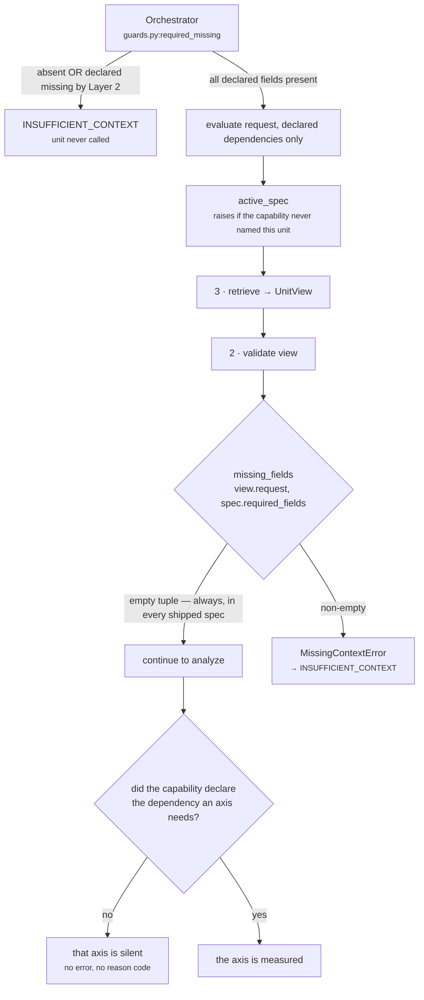

# `core.tradeoff` · Stage 1 — Input · Stage 2 — Validator

**Source:** `genios_engine/reason/reasoners/tradeoff_unit.py` (declares neither stage)
**Framework:** `genios_engine/reason/unit.py:ReasoningUnit.validate` (lines 179–188)

---

## 1 · What it is for

Stage 1 is what the capability handed the unit. Stage 2 is the unit's one chance to say *I will not
guess* before any arithmetic happens.

For `core.tradeoff` both stages are unusual, and for the same reason: **this unit reads no facts.**
It takes its entire input from the metrics other units published. That makes its fact-level input
empty, its validator vacuous, and its dependency declaration — which the validator does not check —
the thing that actually determines whether it can reason at all.

---

## 2 · What exists

### 2.1 · The input pair

`unit.py:ReasoningUnit.evaluate` takes exactly two arguments and every unit in the roster gets the
same shape:

```python
def evaluate(self, request: ReasoningRequest,
             prior_results: Mapping[str, ReasonerResult]) -> ReasonerResult:
```

| Argument | Type | What `core.tradeoff` uses it for |
|---|---|---|
| `request` | `ReasoningRequest` | Only to find its own spec, via `common.py:active_spec(request, "core.tradeoff")`. It never reads `context.facts`, `context.evidence`, `context.neighbor_facts`, or `evaluation_time` |
| `prior_results` | `Mapping[str, ReasonerResult]` | **Everything.** All six inputs to all three axes come from here |

That second column is the whole unit. From the module docstring:

> *It reads only metrics other units already published, so it adds no new fact dependency and can be
> scheduled last in any capability without changing what Layer 2 must supply.*

### 2.2 · `required_fields` — what this unit declares

`required_fields` is not a unit attribute. It lives on `ReasonerSpec`, so it is authored per
capability in Layer 3:

```python
@dataclass(frozen=True, slots=True)
class ReasonerSpec:
    reasoner_id: str
    version: str
    ...
    dependencies: tuple[str, ...] = ()
    required_fields: tuple[str, ...] = ()
```

**Every shipped spec for `core.tradeoff` leaves it empty.** Verified against both places the unit is
scheduled:

```python
# packs/capabilities/deal_cooling_v2.py:116
_spec("core.tradeoff", ("core.risk", "core.opportunity", "core.impact", "core.cost"))

# tests/test_l4_end_to_end.py:56
_spec("core.tradeoff", ("core.risk", "core.opportunity", "core.impact", "core.cost"))
```

Neither passes `required_fields`. The dataclass default `()` stands. Read straight out of the
shipped manifest:

```text
ReasonerSpec(reasoner_id='core.tradeoff', version='1.0.0', input_kind='context_snapshot',
             output_kind='finding',
             dependencies=('core.cost', 'core.impact', 'core.opportunity', 'core.risk'),
             required_fields=(), latency_budget_ms=60,
             failure_policy=FailurePolicy.OPTIONAL, gating=False, config=mappingproxy({}))
```

Three things there were authored, not defaulted. `deal_cooling_v2` sets `latency_budget_ms=60` and
leaves the unit out of its `_REQUIRED` set, so `failure_policy` is `OPTIONAL`: *"a situation that
cannot feed a unit degrades confidence rather than blocking advice the buyer is actively waiting
for."* `config` is empty, so every one of the eight config keys in
[README §5](README.md#5--config-keys) takes its hard-coded default.

The fixture in `tests/test_unit_tradeoff_unit.py` builds a bare
`ReasonerSpec("core.tradeoff", "1.0.0", config=config or {})`, which takes the dataclass defaults —
`latency_budget_ms=100`, `failure_policy=REQUIRED`, `dependencies=()`. That difference matters when
reading the tests: the test harness passes `prior` directly to `evaluate`, bypassing the
orchestrator's dependency filter entirely, so the test file's axes fire on priors the shipped
manifest would never show the unit.

### 2.3 · `validate()` — not overridden

`TradeoffUnit` does **not** define `validate`. The base implementation runs unchanged:

```python
def validate(self, view: UnitView) -> None:
    """Refuse inputs that cannot support a conclusion.

    The default enforces the unit's declared `required_fields`.  Raising `MissingContextError`
    is how a unit says "I will not guess" — the orchestrator turns it into a typed
    insufficient-context result instead of letting a fabricated answer through.
    """
    absent = missing_fields(view.request, view.spec.required_fields)
    if absent:
        raise MissingContextError(*absent)
```

Six of seventeen roster units override this stage. `core.tradeoff` is not one of them, and the
reason is honest rather than lazy: **there is nothing for a fact-level validator to check.** A
validator that refused when `core.risk` had not run would be doing the plugins' job, and doing it
worse — the plugins can refuse *one axis* while the other two proceed, where a validator can only
refuse the whole unit.

That is the design decision worth naming. The unit's real precondition — "at least one pair of
prior metrics is available" — is deliberately **not** enforced at stage 2. It is enforced per-axis at
stage 4, because a unit that can measure two of three arguments should report the two rather than
refuse all three.

---

## 3 · How it works



The diagram's lower half is the part that matters for this unit and it is the part stage 2 has no
opinion about. `orchestrator.py` builds the `prior` mapping as
`{item: prior[item] for item in spec.dependencies if item in prior}` — a unit sees only what its
spec declared. So the question "can this unit reason?" is answered by the `dependencies` tuple, and
nothing in the validator, in the framework, or in any test looks at whether that tuple is adequate.

**The failure mode is silent and it is live.** `deal_cooling_v2` omits `core.temporal` and
`core.confidence` from the tradeoff spec's dependencies, so `speed_vs_certainty` cannot fire. Both
units complete successfully in the same run. Nothing reports a problem: no exception, no reason
code, no `missing_fields`, no telemetry. One third of the unit is switched off by an omission in a
tuple. See [03-Analyzer.md](03-Analyzer.md) §5.

### 3.1 · Two definitions of "missing" coexist

The framework has this asymmetry and it applies here as it applies everywhere:

| Definition | Symbol | Treats a field as missing when |
|---|---|---|
| Orchestrator's, stricter | `guards.py:required_missing` | it is absent from `context.facts` **or** Layer 2 explicitly listed it in `context.missing_fields` |
| Unit's, laxer | `common.py:missing_fields` | it is absent from `context.facts` |

In the orchestrated path the stricter one runs first, so the unit's own validator is effectively
unreachable. It becomes reachable when a test calls `TradeoffUnit().evaluate(...)` directly, which is
exactly how `tests/test_unit_tradeoff_unit.py` calls it. With `required_fields=()` on both paths, the
distinction has no observable consequence for this unit today.

---

## 4 · Examples and edge cases

### 4.1 · The shipped input — what actually arrives

Executing `sales.deal_cooling_full` on the `tests/test_capability_deal_cooling_full.py` fixture (a
£500k open deal, engagement halved, buyer silent ten days), the mapping handed to `core.tradeoff` is:

```text
prior = {
    "core.risk":        COMPLETED  {risk_bp: 5934}
    "core.opportunity": COMPLETED  {opportunity_bp: 7000, opportunity_count: 2}
    "core.impact":      COMPLETED  {revenue_exposure_bp: 10000, impact_signal_count: 1,
                                    impact_bp: 10000}
    "core.cost":        COMPLETED  {cost_bp: 2160, effort_bp: 3600, exposure_bp: 0,
                                    delay_cost_bp: 0, do_nothing_cost_bp: 0,
                                    cost_benefit_gap_bp: 2160}
}
```

Four entries, because four dependencies were declared. `core.temporal` (`urgency_bp: 9360`) and
`core.confidence` (`confidence_bp: 6950`) completed in the same run and are **not in this mapping**.

`view.facts` is `{}` and `view.evidence_ids` is `()`, because `required_fields` is empty. The unit
proceeds to stage 4 with an empty fact window and a four-entry dependency window.

### 4.2 · The validator refusing — the one way it can

The unit can return `INSUFFICIENT_CONTEXT` only if a capability author gives it `required_fields`.
Nobody does today, but the path works. Verified by constructing a spec with
`required_fields=("deal.owner",)` against a snapshot whose facts are `{"deal.status": "open"}`:

```text
TradeoffUnit().validate(view)
    → MissingContextError: missing required context: deal.owner
    → exc.fields == ('deal.owner',)

orchestrator wraps it:
    ReasonerResult(status=INSUFFICIENT_CONTEXT,
                   missing_fields=('deal.owner',),
                   reason_codes=('required_context_missing',))
```

`ReasonerResult.__post_init__` then enforces that a non-`COMPLETED` result carries no `matched`, no
metrics, no findings, no adjustments, no checks and no evidence ids — so a refused tradeoff leaves
no partial claim behind.

In the shipped manifest the spec is `OPTIONAL`, so a refusal degrades the run rather than blocking
it. Under the framework default of `REQUIRED` — which is what a new capability gets unless it says
otherwise — the same refusal is fail-closed. Either way, declaring `required_fields` on this unit
buys nothing: it would make the unit refuse over a fact no plugin reads. **Do not author
`required_fields` on `core.tradeoff`.**

### 4.3 · The boundary table

| Input state | Stage 2 behaviour | Result |
|---|---|---|
| `required_fields=()` — every shipped spec | `missing_fields` returns `()`, no raise | proceeds |
| `required_fields=("deal.status",)`, fact present | no raise | proceeds; the retriever now selects a fact no plugin reads |
| `required_fields=("deal.status",)`, fact absent | `MissingContextError("deal.status")` | `INSUFFICIENT_CONTEXT` |
| `required_fields=("neighbor:contact.email",)`, neighbour fact absent | `MissingContextError("neighbor:contact.email")` | `INSUFFICIENT_CONTEXT`. `missing_fields` honours the `neighbor:` prefix even though `retrieve` filters those fields out of the view |
| `prior` empty — nothing ran before it | **no raise** | `COMPLETED` with `tension_bp 0 · margin_bp 0 · axis_count 0 · contested_count 0`, `matched=False`, `findings ()`, `reason_codes ()` |
| Capability never named `core.tradeoff` in its `reasoners` tuple | `active_spec` raises `ValueError: capability does not declare reasoner core.tradeoff` before stage 2 runs | `FAILED` |

The fifth row is the one to internalise. `test_a_run_with_no_prior_units_publishes_an_empty_tension_not_a_guess`
pins it:

> *Scheduled first by mistake, the unit must say nothing rather than invent a dilemma.*

An empty `prior` is not a validation error. It is a completed run reporting that nothing was
comparable — which is the right shape, spoiled slightly by the fact that the result carries no
reason code saying so. See [05-Evaluator.md](05-Evaluator.md) §4.

---

## Related

| Document | Covers |
|---|---|
| [README](README.md) | The unit's map, config keys, and the gap list |
| [02-Retriever.md](02-Retriever.md) | What the empty `required_fields` means for the `UnitView` |
| [03-Analyzer.md](03-Analyzer.md) | Where the real precondition — two published sides — is enforced |
| [Part 2 · The Unit Framework](../../README.md) | §4.3 on `prior_metric` and the declared-dependency trap |
