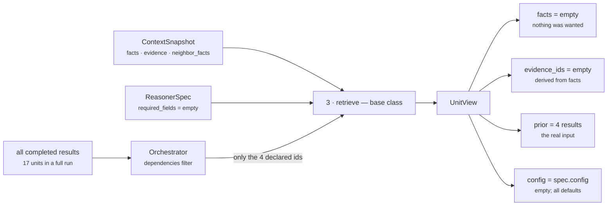

# `core.tradeoff` · Stage 3 — Retriever

**Source:** `genios_engine/reason/reasoners/tradeoff_unit.py` (does not declare this stage)
**Framework:** `genios_engine/reason/unit.py:ReasoningUnit.retrieve` (lines 190–200)

---

## 1 · What it is for

The Retriever selects the slice of the frozen snapshot this unit is allowed to look at, and packages
it as a `UnitView`. It is the answer to *"what was this unit permitted to see?"* asked without
reading the unit's body.

For `core.tradeoff` the answer is: **nothing from the snapshot at all.** The unit's window is the
prior-results mapping, which the framework carries on the same `UnitView` but does not select — the
orchestrator built it before `retrieve` was called. This is the only unit in Category 3 whose fact
window is empty by design rather than by circumstance.

---

## 2 · What exists

`TradeoffUnit` does **not** override `retrieve`. Three of seventeen roster units do; this is not one
of them. The base implementation runs unchanged:

```python
def retrieve(self, request: ReasoningRequest, spec: ReasonerSpec,
             prior: Mapping[str, ReasonerResult]) -> UnitView:
    """Select this unit's window on the frozen snapshot. Selection only — never IO."""
    wanted = tuple(field for field in spec.required_fields
                   if not field.startswith("neighbor:"))
    facts = {name: request.context.facts[name]
             for name in wanted if name in request.context.facts}
    evidence = tuple(sorted(item.evidence_id for item in request.context.evidence
                            if item.field in facts))
    return UnitView(request=request, spec=spec, prior=prior,
                    facts=MappingProxyType(facts), evidence_ids=evidence)
```

**Why it is not overridden:** because there is nothing to select. `required_fields` is `()` in every
shipped spec, so `wanted` is empty, so `facts` is empty, so `evidence` is empty. Overriding the
stage to return an empty view would be the same view with more code. The framework paying for itself
is exactly this: a unit whose Retriever does nothing writes no Retriever.

### 2.1 · What lands in the `UnitView`

| Field | Type | Value for `core.tradeoff` on every shipped run |
|---|---|---|
| `request` | `ReasoningRequest` | The full frozen request. Available, never read by this unit |
| `spec` | `ReasonerSpec` | The capability's spec — the source of `config` |
| `prior` | `Mapping[str, ReasonerResult]` | **The only input that matters.** Built by the orchestrator from `spec.dependencies`, not by this stage |
| `facts` | `MappingProxyType` | `{}` |
| `evidence_ids` | `tuple[str, ...]` | `()` |

Verified by calling `TradeoffUnit().retrieve(request, spec, {})` against the shipped manifest and the
`test_capability_deal_cooling_full` snapshot:

```text
view.facts          {}
view.evidence_ids   ()
spec.required_fields ()
```

### 2.2 · The one property the unit does read

`UnitView` exposes one convenience property and this unit uses it in all eight config reads:

```python
@property
def config(self) -> Mapping[str, Any]:
    """Per-capability tuning for this unit, authored in Layer 3 and versioned with it."""
    return self.spec.config
```

Both `_config_bp` and `_config_id` go through `view.config.get(key, default)`.

### 2.3 · The dependency reader — used, but not a Retriever concern

The unit's actual input path is `UnitView.prior_metric`, wrapped by `tradeoff_unit.py:_prior_bp`:

```python
def _prior_bp(view: UnitView, key: str, default_unit: str, metric: str) -> int | None:
    """One side of a tradeoff, or None when the unit that owns it did not complete."""
    value = view.prior_metric(_config_id(view, key, default_unit), metric, _ABSENT)
    return None if value == _ABSENT else clamp_bp(value)
```

That reads `view.prior`, which `retrieve` copied through untouched. The selection of *which* prior
results are visible happened one layer up, in `orchestrator.py`:

```python
dependencies = {item: prior[item] for item in spec.dependencies if item in prior}
```

So for this unit the sentence "the Retriever selects the unit's window" is true of the prior mapping
and vacuous of the snapshot — and the selection was made by the capability author's `dependencies`
tuple, not by any code in `reason/reasoners/`.

---

## 3 · How it works



The picture makes the asymmetry visible. The two arrows the framework designed the stage around —
facts and evidence — carry nothing. The arrow that carries everything bypasses the stage entirely.

**Evidence is derived from selection, not asserted.** That is the framework's rule and it is what
makes a unit unable to cite a row it did not look at. For this unit the rule produces the correct
answer for a slightly wrong reason: the unit cites nothing because it selected nothing, not because
it consciously declined to cite prior units' evidence. See §4.2.

---

## 4 · Examples and edge cases

### 4.1 · The shipped run

`sales.deal_cooling_full` on the standard fixture. The snapshot carries five facts and five evidence
rows:

```text
facts     deal.status · deal.value · derived.engagement · thread.last_inbound
          relationship.verified_stakeholder_count
evidence  ev_status · ev_value · ev_engagement · ev_inbound · ev_stakeholders
```

`core.tradeoff` selects **zero of each**, and the result it publishes carries `evidence_ids == ()`.
Confirmed by executing the capability:

```text
core.tradeoff → COMPLETED
    metrics       {tension_bp: 5301, margin_bp: 1066, axis_count: 1, contested_count: 1}
    evidence_ids  ()
    findings      tradeoff.risk_vs_reward  matched=True  evidence_ids=()
```

Every claim this unit makes is uncited. That is defensible — the unit's evidence *is* the prior
results, and a `ReasonerResult` has no field for citing another `ReasonerResult` — but it is
uncited all the same, and §4.3 explains what that costs.

### 4.2 · The trap: declaring `required_fields` fabricates a citation

Because `evidence_ids` is derived from `facts`, and `facts` is derived from `required_fields`, a
capability author who declares a field on this unit attaches that field's evidence to a claim the
unit's arithmetic never touched.

Verified. A spec with `required_fields=("deal.status",)` against a snapshot carrying
`EvidenceRef("ev_status", "deal.status", ...)`, priors `opportunity_bp 8,000` and `risk_bp 7,500`:

```text
metrics              {tension_bp: 7125, margin_bp: 500, axis_count: 1, contested_count: 1}
result.evidence_ids  ('ev_status',)          ← attached by the base retriever
finding.evidence_ids ()                       ← the plugin attached nothing
```

The tension of 7,125bp was computed from `opportunity_bp` and `risk_bp`. `deal.status` played no
part in it. The result nonetheless cites `ev_status`, and `core.validation`'s
`EvidenceSufficiencyPlugin` — which asks only whether an asserting result cites *any* producible
evidence — would count this claim as grounded.

This is not a bug in `core.tradeoff`; it is the base retriever's contract applied to a unit that has
no facts. It is a reason not to author `required_fields` here, on top of the fail-closed reason in
[01-Input-and-Validator.md](01-Input-and-Validator.md) §4.2.

### 4.3 · What the empty citation costs today, and what it would cost tomorrow

`core.validation`'s `_asserts_a_claim` returns `True` when `result.matched is True` **or** when any
finding is not an explicit negative. A contested tradeoff satisfies both. Cited evidence: none. So a
tradeoff result reaching `core.validation` would be counted as an ungrounded claim and would emit:

```text
reason_codes = ("claim_without_evidence", "claimant:core.tradeoff")
```

It does not happen today, because `deal_cooling_v2` declares `core.validation`'s dependencies as
`("core.risk", "core.opportunity", "core.impact", "core.confidence")` — `core.tradeoff` is not among
them. The moment someone adds it, the run gains an ungrounded-claim finding and
`evidence_sufficiency_bp` drops. Worth knowing before that edit is made, because the correct fix is
not to silence the validator: it is for the plugins to forward the evidence ids of the results they
read. They currently forward none.

### 4.4 · Boundary table

| Snapshot / spec state | `view.facts` | `view.evidence_ids` | Consequence |
|---|---|---|---|
| `required_fields=()` — every shipped spec | `{}` | `()` | The unit cites nothing; findings are uncited |
| `required_fields=("deal.status",)`, fact and evidence present | `{"deal.status": "open"}` | `("ev_status",)` | A citation the arithmetic did not use |
| `required_fields=("deal.status",)`, fact present, no evidence row | `{"deal.status": "open"}` | `()` | Fact selected, nothing to cite |
| `required_fields=("deal.status",)`, fact absent | never reached — `validate` raises first | — | `INSUFFICIENT_CONTEXT` |
| `required_fields=("neighbor:contact.email",)` | `{}` — the `neighbor:` prefix is filtered out of `wanted` | `()` | The validator still demands the neighbour fact. This asymmetry is framework-wide, documented in [Part 2 §3.1](../../README.md) |
| Snapshot has an evidence row whose `field` matches a selected fact but whose `context_scope` is `"neighbor"` | fact selected | the neighbour row **is** attached | The base retriever ignores `context_scope`. Framework-wide; harmless here only because this unit selects nothing |

---

## Related

| Document | Covers |
|---|---|
| [README](README.md) | The unit's map and the gap list |
| [01-Input-and-Validator.md](01-Input-and-Validator.md) | Why `required_fields` should stay empty on this unit |
| [03-Analyzer.md](03-Analyzer.md) | The `prior` mapping, which is the input this stage did not select |
| [06-Builder-and-Metrics.md](06-Builder-and-Metrics.md) | How `build` unions `view.evidence_ids` with observation evidence, and what that union is here |
| [Part 2 · The Unit Framework](../../README.md) | §3.1 — the three consequences of a Retriever that selects rather than fetches |
