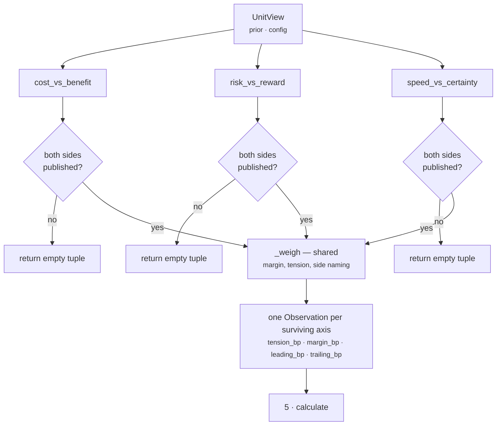

# `core.tradeoff` · Stage 4 — Analyzer

**Source:** `genios_engine/reason/reasoners/tradeoff_unit.py` lines 45–176
**Framework:** `genios_engine/reason/unit.py:ReasoningUnit.analyze` (lines 202–211, not overridden)

---

## 1 · What it is for

The Analyzer is where a unit's IP lives. For most units that means three plugins each running a
different algorithm over different facts. For `core.tradeoff` the shape is inverted: **three plugins
that share one algorithm and differ only in which pair of published metrics they feed it.**

That inversion is the design. A tradeoff is one comparison. If `risk_vs_reward` scored contests
differently from `speed_vs_certainty`, the two axes would not be comparable — and the Calculator's
whole job is to rank them against each other and publish the sharpest. Putting the arithmetic in one
module-level function makes cross-axis comparability a property of the code rather than a matter of
three authors agreeing.

---

## 2 · What exists

### 2.1 · Registration and order

```python
plugins = (CostVersusBenefitPlugin(), RiskVersusRewardPlugin(), SpeedVersusCertaintyPlugin())
```

`analyze` is the base implementation, unchanged:

```python
def analyze(self, view: UnitView) -> tuple[Observation, ...]:
    observations: list[Observation] = []
    for plugin in sorted(self.plugins, key=lambda item: item.plugin_id):
        observations.extend(plugin.contribute(view))
    return tuple(observations)
```

Execution order is `plugin_id` order, which here is alphabetical and happens to match registration
order:

```text
1. cost_vs_benefit
2. risk_vs_reward
3. speed_vs_certainty
```

**Order does not affect the result of this unit**, and that is deliberate rather than lucky. The
plugins share no state, read no output of each other, and the Calculator re-sorts everything by
`_ranked` before publishing anything. `analyze`'s sort still matters for the one thing it always
matters for: it makes the observation tuple — and therefore every hash below it — a property of the
unit's composition rather than of whatever order the class body happened to list.

`ReasoningUnit.__init__` rejects duplicate `plugin_id`s at construction. Three distinct ids here, so
the sort is total.

### 2.2 · The three plugins, side by side

Each is eight lines. All three have the same body shape.

| `plugin_id` | Side A (source key → default unit → metric) | Side B | Axis label | Side names |
|---|---|---|---|---|
| `cost_vs_benefit` | `benefit_source` → `core.impact` → `impact_bp` | `cost_source` → `core.effort` → `effort_bp` | `cost_vs_benefit` | `benefit` / `restraint` |
| `risk_vs_reward` | `reward_source` → `core.opportunity` → `opportunity_bp` | `risk_source` → `core.risk` → `risk_bp` | `risk_vs_reward` | `reward` / `caution` |
| `speed_vs_certainty` | `speed_source` → `core.temporal` → `urgency_bp` | `certainty_source` → `core.confidence` → `confidence_bp`, **inverted** | `speed_vs_certainty` | `speed` / `certainty` |

Full detail per plugin: [03a](03a-plugin-cost_vs_benefit.md) · [03b](03b-plugin-risk_vs_reward.md) ·
[03c](03c-plugin-speed_vs_certainty.md).

### 2.3 · The two shared helpers

**`_prior_bp` — read one side, or refuse.**

```python
_ABSENT = -1

def _prior_bp(view: UnitView, key: str, default_unit: str, metric: str) -> int | None:
    """One side of a tradeoff, or None when the unit that owns it did not complete."""
    value = view.prior_metric(_config_id(view, key, default_unit), metric, _ABSENT)
    return None if value == _ABSENT else clamp_bp(value)
```

The sentinel is the mechanism behind the unit's headline property:

> *Basis points are 0..10000 by law, so a negative sentinel can never collide with a real published
> value. It is how a plugin distinguishes "the unit said zero" from "the unit never ran" — the
> difference between a measured absence of pressure and a blind spot.*

The `clamp_bp` on the return is belt-and-braces. Every metric these plugins read ends in `_bp`, and
`ReasonerResult.__post_init__` already validates every `_bp` metric into `0..10000` at construction:

```python
for name, value in self.metrics.items():
    if name.endswith("_bp"):
        _bp(value, f"reasoner metrics.{name}")
```

so a published value outside the range cannot exist to be clamped, and the `-1` sentinel cannot be
forged by a well-formed result. The same contract check makes `prior_metric`'s own `bool` guard
unreachable through this path — verified: a `ReasonerResult` with `metrics={"risk_bp": True}` raises
`TypeError: reasoner metrics.risk_bp must be integer basis points` at construction, long before any
plugin sees it.

**`_weigh` — score one contested axis.** This is the whole algorithm.

```python
def _weigh(view, plugin_id, axis, first_side, first_bp, second_side, second_bp):
    margin = abs(first_bp - second_bp)
    tension = divide_half_up(min(first_bp, second_bp) * (10_000 - margin), 10_000)
    codes = [f"tradeoff.{axis}"]
    if margin < _config_bp(view, "decisive_margin_bp", 500):
        codes.append(f"balanced.{axis}")
    elif first_bp > second_bp:
        codes.extend((f"favours.{first_side}", f"concedes.{second_side}"))
    else:
        codes.extend((f"favours.{second_side}", f"concedes.{first_side}"))
    return (Observation(
        plugin_id=plugin_id,
        kind=f"tradeoff.{axis}",
        metrics={"tension_bp": clamp_bp(tension), "margin_bp": clamp_bp(margin),
                 "leading_bp": max(first_bp, second_bp),
                 "trailing_bp": min(first_bp, second_bp)},
        reason_codes=tuple(codes),
    ),)
```

---

## 3 · How it works



### 3.1 · The arithmetic, in words

```text
margin  = |A − B|
tension = min(A, B) × (10,000 − margin) ÷ 10,000        rounded half-up
```

Two judgements are encoded and the docstring argues both:

> * **The weaker side sets the ceiling.** A tradeoff is only as real as its weakest pressure.
>   Enormous upside against no downside is not a dilemma, it is a free move, and reporting it as
>   maximum tension would make every strong opportunity look agonising.
> * **Distance discounts it.** Two pressures that are both strong *and* close is the situation a
>   human actually has to think about; a four-thousand-point gap has already been settled by the
>   evidence, whatever its absolute level.

The rounding is `common.py:divide_half_up`, which is integer division with half-up rounding:

```python
def divide_half_up(numerator: int, denominator: int) -> int:
    if denominator <= 0:
        raise ValueError("denominator must be positive")
    if numerator >= 0:
        return (numerator + denominator // 2) // denominator
    return -((-numerator + denominator // 2) // denominator)
```

The negative branch is unreachable here: both operands of the product are in `0..10000`, so the
numerator is never negative. Neither `clamp_bp` in `_weigh` can bind either — the maximum tension is
`10000 × 10000 ÷ 10000 = 10000` (both sides at maximum, zero margin) and the maximum margin is
`10000`. Both clamps are defensive, not load-bearing.

### 3.2 · The deadband

`decisive_margin_bp`, default **500bp**. Below it the axis publishes `balanced.<axis>` and names no
winner:

> *A lean the width of rounding noise is not a lean, and letting one basis point decide which
> objective "won" would produce explanations that flip between runs on immaterial input drift.*

The comparison is `margin < decisive_margin_bp`, so a margin of exactly 500 **does** name a side.
Verified at the boundary with `opportunity_bp` and `risk_bp`:

| A (reward) | B (caution) | margin | Codes |
|---|---|---|---|
| 6,500 | 6,000 | 500 | `favours.reward` · `concedes.caution` |
| 6,499 | 6,000 | 499 | `balanced.risk_vs_reward` |

`test_an_immaterial_lean_names_no_winner` pins the second row's shape at margin 100, and asserts the
absence of *both* the `favours.` and `concedes.` prefixes — the deadband suppresses the pair, never
just one half of it.

### 3.3 · Naming the loser

Every named lean is a pair. There is no code path that emits `favours.x` without `concedes.y`, and
none that emits `concedes.y` alone. The module docstring gives the reason in one sentence:

> *A recommendation nobody can argue with is a recommendation nobody can audit.*

The six side names are fixed in code, not configurable: `benefit` / `restraint`, `reward` /
`caution`, `speed` / `certainty`. A capability can substitute which *unit* supplies a side; it cannot
rename the side. That is correct — the names are the vocabulary a renderer and a play-support table
match against, and letting a tenant rename `caution` would break every consumer of the code at once.

---

## 4 · How the plugins interact

**They do not.** This is the shortest interaction section in the folder and the fact is worth stating
plainly, because most units in the roster have plugins that feed each other.

| Interaction that exists in other units | Present here |
|---|---|
| One plugin reads another's observation | no — each reads only `view.prior` and `view.config` |
| Plugins share a config key | yes, one: `decisive_margin_bp`, read inside `_weigh` by all three |
| A plugin's silence changes another's output | no |
| Plugins are blended in the Calculator | **no** — the Calculator ranks and picks a maximum, it does not combine |

The only place the three axes meet is `_ranked`, and there they compete rather than combine. See
[04-Calculator.md](04-Calculator.md).

**One shared edge worth knowing.** Because `decisive_margin_bp` is read inside `_weigh`, a malformed
value fails on the *first* axis that fires, whichever it is — and the plugins run in `plugin_id`
order, so it is `cost_vs_benefit` first if that axis is live. The exception propagates out of
`analyze`, out of `evaluate`, and the orchestrator turns it into a `FAILED` result with the
`ValueError` message in `diagnostics`. `test_a_malformed_margin_setting_is_a_manifest_fault` pins the
raise at the plugin level:

```python
with pytest.raises(ValueError, match="basis points"):
    RiskVersusRewardPlugin().contribute(_view(..., config={"decisive_margin_bp": 25_000}))
```

**A tie with the deadband disabled names an arbitrary winner.** With `decisive_margin_bp: 0` and
`A == B`, `margin < 0` is false, `first_bp > second_bp` is false, so control falls to the `else`
branch and the *second* side is named the winner. Verified — `opportunity_bp 6,000` against
`risk_bp 6,000` with `decisive_margin_bp: 0`:

```text
tension_bp 6000 · margin_bp 0 · leading_bp 6000 · trailing_bp 6000
reason_codes  concedes.reward · favours.caution · tradeoff.risk_vs_reward
```

A dead-level contest reported as a win for caution. The default deadband of 500 hides this
completely, and no test covers it, but a capability that sets the key to `0` — a plausible reading of
"I want every lean reported" — gets a fabricated winner on every exact tie.

---

## 5 · Which axes actually fire

This is the most important operational fact about the unit and it belongs in the Analyzer chapter,
because it is decided entirely by which priors reach `contribute`.

A plugin can only see a prior result whose reasoner id the **capability declared as a dependency**.
`orchestrator.py` builds the mapping as `{item: prior[item] for item in spec.dependencies if item in
prior}`, precisely so that passing every earlier result cannot create hidden order-dependent edges.

`deal_cooling_v2` declares four:

```python
_spec("core.tradeoff", ("core.risk", "core.opportunity", "core.impact", "core.cost"))
```

Cross that against what each axis needs:

| Axis | Needs | Declared? | Fires? |
|---|---|---|---|
| `risk_vs_reward` | `core.opportunity`, `core.risk` | both | **yes** |
| `cost_vs_benefit` | `core.impact`, `core.effort` | `core.impact` yes; **`core.effort` is not a unit that exists** | no |
| `speed_vs_certainty` | `core.temporal`, `core.confidence` | neither declared, though both complete in the run | no |

Measured on the shipped `sales.deal_cooling_full` fixture:

```text
                                       axis_count  contested_count  tension_bp  margin_bp
shipped, as authored                        1            1            5,301      1,066
+ config {"cost_source": "core.cost"}       2            1            5,301      1,066
+ dependencies core.temporal, core.confidence
                                            3            1            5,301      1,066
```

The headline never moves, because `risk_vs_reward` is the sharpest axis in that situation anyway.
What moves is the explanation. At `axis_count: 1` the result says *one argument existed and the
upside won it*. At `axis_count: 3` it says *three arguments existed, the upside/exposure one was the
hard part, and here is what the other two conceded*:

```text
axis_count 3, findings:
  tradeoff.risk_vs_reward      matched=True   tension 5,301  margin 1,066  lead 7,000  trail 5,934
                               favours.reward · concedes.caution
  tradeoff.cost_vs_benefit     matched=False  tension 1,296  margin 6,400  lead 10,000 trail 3,600
                               favours.benefit · concedes.restraint
  tradeoff.speed_vs_certainty  matched=False  tension 1,125  margin 6,310  lead 9,360  trail 3,050
                               favours.speed · concedes.certainty
```

Two of three axes are dark in production. Neither is a bug in this unit:

1. **`core.effort` does not exist.** No module in `reasoners/` declares `unit_id = "core.effort"`.
   The metric `effort_bp` is published by `core.cost` — which the manifest *does* declare as a
   dependency. Setting `cost_source: "core.cost"` lights the axis with no code change.
2. **`core.temporal` and `core.confidence` are not declared.** Both complete successfully in the same
   run. Adding two ids to the dependencies tuple lights the third axis.

Nothing reports either condition. No exception, no reason code, no `missing_fields`, no telemetry —
the run is valid, deterministic, and two thirds blind. That silence is the correct behaviour for one
missing side of one axis (a blind spot must not become a landslide) and the wrong behaviour for a
*misconfiguration*, which is what both of these are.

---

## 6 · Examples and edge cases

### 6.1 · All three axes, fully wired

Priors from `test_the_quiet_enterprise_renewal_leans_to_the_upside_and_says_what_it_gave_up` — a
£400k renewal gone quiet with three weeks left:

```text
core.temporal     urgency_bp     9,000
core.confidence   confidence_bp  5,200   → doubt = 10,000 − 5,200 = 4,800
core.opportunity  opportunity_bp 8,500
core.risk         risk_bp        5,000
core.impact       impact_bp      7,000
core.effort       effort_bp      3,000
```

Axis by axis:

```text
cost_vs_benefit      A 7,000  B 3,000
    margin  = |7000 − 3000| = 4,000
    tension = 3000 × (10000 − 4000) ÷ 10000 = 3000 × 6000 ÷ 10000 = 1,800
    margin 4,000 ≥ 500 and A > B → favours.benefit · concedes.restraint

risk_vs_reward       A 8,500  B 5,000
    margin  = 3,500
    tension = 5000 × 6500 ÷ 10000 = 3,250
    margin 3,500 ≥ 500 and A > B → favours.reward · concedes.caution

speed_vs_certainty   A 9,000  B 4,800
    margin  = 4,200
    tension = 4800 × 5800 ÷ 10000 = 2,784
    margin 4,200 ≥ 500 and A > B → favours.speed · concedes.certainty
```

Three observations, tensions `{1,800 · 3,250 · 2,784}`. The Calculator publishes 3,250 — the
maximum, not the mean of 2,611. `axis_count 3`, `contested_count 1` (only 3,250 clears the 3,000bp
threshold). The test asserts exactly those four numbers.

### 6.2 · Rounding, at the half

`divide_half_up` rounds `.5` away from zero. A case where it bites — `opportunity_bp 3,333` against
`risk_bp 1,111`:

```text
margin  = 2,222
product = 1111 × (10000 − 2222) = 1111 × 7778 = 8,641,358
tension = (8,641,358 + 5,000) ÷ 10,000  →  864   (plain truncation would also give 864)
```

And one where the half is exact — `opportunity_bp 9,500` against `risk_bp 1,000`, from
`test_a_wide_gap_is_a_settled_question_however_large_the_numbers`:

```text
margin  = 8,500
tension = 1000 × 1500 ÷ 10000 = 1,500,000 ÷ 10,000 = 150   exactly
```

The test's comment says "rounded half up" on a division that happens to be exact; the rounding is
real in the general case, not in that one.

### 6.3 · Boundary table for `_weigh`

| A | B | margin | tension | Codes | Reading |
|---|---|---|---|---|---|
| 0 | 0 | 0 | 0 | `balanced` | Both sides measured, neither pressing. Reported as a balanced non-dilemma |
| 10,000 | 10,000 | 0 | **10,000** | `balanced` | Maximum tension. Two maximal pressures, dead level |
| 10,000 | 0 | 10,000 | 0 | `favours.A` · `concedes.B` | A free move, correctly reported as no dilemma |
| 5,000 | 5,000 | 0 | 5,000 | `balanced` | Tension equals the shared level when margin is zero |
| 8,000 | 7,900 | 100 | 7,821 | `balanced` | *"the situation a human is actually needed for"* — and no side named, because 100 < 500 |
| 3,000 | 3,000 | 0 | 3,000 | `balanced` | The **lowest** pair of equal values that still counts as contested at the default threshold |
| 6,500 | 6,000 | 500 | 5,700 | `favours.A` · `concedes.B` | The deadband boundary: exactly 500 names a side |
| 6,499 | 6,000 | 499 | 5,701 | `balanced` | One basis point below it does not |

Row 5 is worth pausing on. `8,000` against `7,900` produces the highest tension in the test suite —
7,821bp — and names **no winner**, because the margin is inside the deadband. A consumer reading
`matched=True` on that axis learns *this is genuinely hard* and, correctly, *nobody can tell you
which way it goes.* That combination is the unit working exactly as intended.

Row 1 is the semantic oddity. Two sides that both measured zero produce
`balanced.<axis>` — a code whose plain-English reading is "these are evenly matched" applied to a
situation where neither pressure exists at all. `tension_bp: 0` disambiguates it for a machine;
nothing disambiguates it for a renderer that reads codes.

---

## Related

| Document | Covers |
|---|---|
| [README](README.md) | The unit's map, config table, and gap list |
| [03a-plugin-cost_vs_benefit.md](03a-plugin-cost_vs_benefit.md) | Is the prize worth the work, and the missing `core.effort` |
| [03b-plugin-risk_vs_reward.md](03b-plugin-risk_vs_reward.md) | Upside against exposure — the only live axis |
| [03c-plugin-speed_vs_certainty.md](03c-plugin-speed_vs_certainty.md) | The confidence inversion |
| [04-Calculator.md](04-Calculator.md) | `_ranked` and why the maximum, not the mean |
| [Part 2 · The Unit Framework](../../README.md) | §4.2 — why plugins, and what an `Observation` may say |
