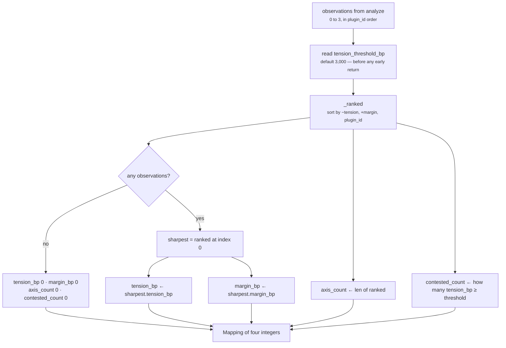
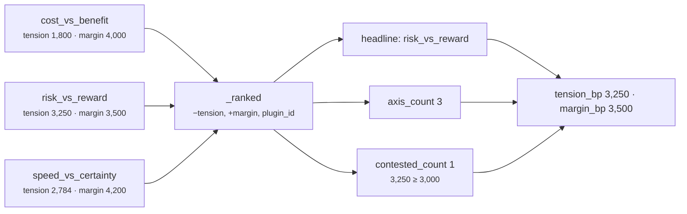

# `core.tradeoff` · Stage 5 — Calculator

**Source:** `genios_engine/reason/reasoners/tradeoff_unit.py:TradeoffUnit.calculate` (lines 191–211)
and `TradeoffUnit._ranked` (lines 244–256)
**Framework:** `unit.py:ReasoningUnit.calculate` is `@abstractmethod` — every unit must implement it

---

## 1 · What it is for

Stage 5 turns a bag of observations into the unit's published metrics, using pure integer arithmetic
and nothing else. For most units that means blending — `core.opportunity` takes the strongest claim
plus a quarter of the rest, `core.cost` takes a weighted average of effort and exposure.

`core.tradeoff` **does not blend.** It ranks the axes and publishes the sharpest one, plus two
counts. Four numbers out of what may be three observations, and only two of them come from a single
axis.

---

## 2 · What exists

```python
def calculate(self, view: UnitView,
              observations: Sequence[Observation]) -> Mapping[str, int]:
    """The hardest dilemma sets the headline; the settled ones are still counted.

    Deliberately a maximum, not a mean. A situation containing one genuinely contested axis and
    two settled ones is a hard situation — averaging would report it as easy and hide the exact
    thing a human is needed for. `axis_count` says how many comparisons were possible at all,
    which is how a reviewer tells "nothing was contested" apart from "nothing was measurable".
    """
    threshold = _config_bp(view, "tension_threshold_bp", 3_000)
    ranked = self._ranked(observations)
    if not ranked:
        return {"tension_bp": 0, "margin_bp": 0, "axis_count": 0, "contested_count": 0}
    sharpest = ranked[0]
    return {
        "tension_bp": int(sharpest.metrics["tension_bp"]),
        "margin_bp": int(sharpest.metrics["margin_bp"]),
        "axis_count": len(ranked),
        "contested_count": sum(1 for item in ranked
                               if int(item.metrics["tension_bp"]) >= threshold),
    }
```

```python
@staticmethod
def _ranked(observations: Sequence[Observation]) -> tuple[Observation, ...]:
    """Total order over axes: tightest contest first, then the narrower margin, then plugin id.

    The final key is not decoration. Two axes can tie on both numbers, and if the winner were
    then decided by iteration order the headline — and every hash downstream of it — would
    depend on registration order rather than on the evidence.
    """
    return tuple(sorted(observations, key=lambda item: (
        -int(item.metrics["tension_bp"]),
        int(item.metrics["margin_bp"]),
        item.plugin_id,
    )))
```

### The four outputs

| Metric | Source | Range |
|---|---|---|
| `tension_bp` | `ranked[0].metrics["tension_bp"]` — one axis's number, verbatim | 0–10,000 |
| `margin_bp` | `ranked[0].metrics["margin_bp"]` — the same axis's number, verbatim | 0–10,000 |
| `axis_count` | `len(ranked)` — every observation, contested or not | 0–3 today |
| `contested_count` | how many observations clear `tension_threshold_bp` | 0–`axis_count` |

`leading_bp` and `trailing_bp` exist on the observation and are **not** promoted to unit metrics.
They survive only inside the headline axis's `Finding`. That is a deliberate scoping choice: at unit
level "how strong was the winning side" is meaningless without knowing *which* side won, and the
metric namespace has no room to carry that. The finding carries both together, where they mean
something.

### Config

| Key | Default | Read where | Notes |
|---|---|---|---|
| `tension_threshold_bp` | `3_000` | first line of `calculate`, before the early return | Read on **every** run, including one with no observations, so a malformed value always fails the run |

---

## 3 · Why that shape

The code's own docstring makes the argument, and it is the right argument:

> *Deliberately a maximum, not a mean. A situation containing one genuinely contested axis and two
> settled ones is a hard situation — averaging would report it as easy and hide the exact thing a
> human is needed for.*

Work the alternative through with the numbers from
`test_the_quiet_enterprise_renewal_leans_to_the_upside_and_says_what_it_gave_up`:

```text
axis tensions:  risk_vs_reward 3,250 · speed_vs_certainty 2,784 · cost_vs_benefit 1,800

maximum   3,250   ≥ threshold 3,000  →  matched = True   "there is a real dilemma here"
mean      2,611   <  threshold 3,000  →  matched = False  "nothing much to think about"
minimum   1,800   <  threshold 3,000  →  matched = False
```

Three summaries of the same situation, and only one of them is true. The situation *contains* a
3,250bp contest between upside and exposure on a £400k renewal. A mean reports 2,611 — below the
threshold — and the human never sees the argument. The mean is not a conservative approximation of
the maximum; it is a different and wrong claim, and the more axes the unit gains the worse it gets,
because every settled axis added dilutes the one contested axis further.

The maximum has a real cost and the design pays it deliberately: **it discards how many arguments
there were.** `tension_bp: 3,250` alone cannot distinguish "one hard argument" from "one hard
argument among three" from "one hard argument and nothing else was measurable". That is precisely
what the two counts restore:

> *`axis_count` says how many comparisons were possible at all, which is how a reviewer tells
> "nothing was contested" apart from "nothing was measurable".*

| `axis_count` | `contested_count` | `tension_bp` | Reading |
|---|---|---|---|
| 0 | 0 | 0 | Nothing was measurable. No axis had two published sides |
| 3 | 0 | 2,100 | Three arguments existed and all three were settled |
| 3 | 1 | 3,250 | Three arguments; one is genuinely hard |
| 1 | 1 | 5,301 | One argument, and it is hard. Two axes were dark |
| 3 | 3 | 8,900 | Everything is contested. Escalate |

Row 1 and row 2 are the pair `axis_count` exists to separate, and the pair that — per
[05-Evaluator.md](05-Evaluator.md) §4 — the reason codes fail to separate.

### 3.1 · The three-key total order

```text
sort key = (−tension_bp, +margin_bp, plugin_id)
```

| Key | Direction | Why |
|---|---|---|
| `tension_bp` | descending | The sharpest contest is the headline. This is the whole ranking |
| `margin_bp` | ascending | Between two equally tense axes, the *closer* one is the harder call. A tie on tension with different margins means different underlying levels; the tighter contest is the one a human is needed for |
| `plugin_id` | ascending | Determinism. Nothing else |

The third key is the one the docstring defends:

> *Two axes can tie on both numbers, and if the winner were then decided by iteration order the
> headline — and every hash downstream of it — would depend on registration order rather than on the
> evidence.*

That is not hypothetical. `test_a_perfect_tie_between_axes_is_broken_by_name_not_by_order`
constructs it deliberately:

```text
core.opportunity  opportunity_bp 6,000    core.impact  impact_bp  6,000
core.risk         risk_bp        4,000    core.effort  effort_bp  4,000

both axes:  margin 2,000 · tension = 4000 × 8000 ÷ 10000 = 3,200

sort key    risk_vs_reward   (−3200, 2000, "risk_vs_reward")
            cost_vs_benefit  (−3200, 2000, "cost_vs_benefit")
                                            ↑ "c" < "r"  → cost_vs_benefit is the headline
```

```python
assert "headline.favours.benefit" in result.reason_codes
assert "headline.favours.reward" not in result.reason_codes
```

Alphabetical tie-breaking looks arbitrary until you name the alternative: the winner would be
whichever plugin someone happened to list first in the class body. The `plugin_id` key is not a
better answer to "which axis matters more"; it is a *stable* answer, which is the only property that
matters once the two axes are genuinely indistinguishable.

### 3.2 · Note what `calculate` does not do

| Not done | Why it would be wrong |
|---|---|
| Blend the axes | Three different arguments are not one argument with an average difficulty |
| Emit an adjustment | *"Selecting a play, ranking plays, or emitting a score adjustment would make it a second decision authority, and GeniOS has exactly one."* |
| Promote `leading_bp` / `trailing_bp` | Meaningless without knowing which side led; the finding carries both together |
| Read `view.facts` | It is empty. The unit reads only prior metrics |
| Count only contested axes in `axis_count` | That is `contested_count`. The distinction is the point |

---

## 4 · How it works



Two mechanical points worth noting.

**The threshold is read before the early return.** `threshold = _config_bp(...)` is the first
statement, above `if not ranked`. So a capability with a malformed `tension_threshold_bp` fails even
on a run with nothing to measure. That is the right ordering — a manifest fault should not hide
behind an empty situation — and it is the asymmetry with `decisive_margin_bp`, which is read inside
`_weigh` and therefore only validated when an axis fires. See [README §5](README.md#5--config-keys).

**The empty return is a real reading, not an error.** `{0, 0, 0, 0}` is a `COMPLETED` result with
`matched=False`. `test_a_run_with_no_prior_units_publishes_an_empty_tension_not_a_guess` pins the
exact dict:

```python
assert dict(result.metrics) == {"tension_bp": 0, "margin_bp": 0,
                                "axis_count": 0, "contested_count": 0}
```

---

## 5 · Worked combination

### 5.1 · Three axes, full arithmetic

The `test_the_quiet_enterprise_renewal_...` scenario, end to end. *A £400k renewal has gone quiet
with three weeks left.*

**Stage 4 output** — three observations, emitted in `plugin_id` order:

```text
cost_vs_benefit      impact 7,000  vs effort 3,000
    margin  = 4,000
    tension = 3000 × (10000 − 4000) ÷ 10000 = 3000 × 6000 ÷ 10000 = 1,800
    codes   favours.benefit · concedes.restraint

risk_vs_reward       opportunity 8,500 vs risk 5,000
    margin  = 3,500
    tension = 5000 × 6500 ÷ 10000 = 3,250
    codes   favours.reward · concedes.caution

speed_vs_certainty   urgency 9,000 vs doubt 10,000 − 5,200 = 4,800
    margin  = 4,200
    tension = 4800 × 5800 ÷ 10000 = 2,784
    codes   favours.speed · concedes.certainty
```

**Stage 5 · ranking:**

```text
sort key                                        order
(−3250, 3500, "risk_vs_reward")       →  1st    headline
(−2784, 4200, "speed_vs_certainty")   →  2nd
(−1800, 4000, "cost_vs_benefit")      →  3rd
```

**Stage 5 · the four metrics:**

```text
tension_bp      = 3,250        from ranked[0]
margin_bp       = 3,500        from ranked[0]
axis_count      = 3            len(ranked)
contested_count = 1            only 3,250 ≥ 3,000
```

Verified by executing the unit — the test asserts all four.



### 5.2 · The headline is not the first plugin

From `test_the_headline_is_the_sharpest_axis_not_the_first_plugin` — *"Registration order must never
decide which tension a human is shown."*

```text
core.impact       impact_bp      9,000  ┐ cost_vs_benefit: margin 8,800
core.effort       effort_bp        200  ┘ tension = 200 × 1200 ÷ 10000 = 24

core.opportunity  opportunity_bp 6,000  ┐ risk_vs_reward: margin 100
core.risk         risk_bp        5,900  ┘ tension = 5900 × 9900 ÷ 10000 = 5,841

sort key   (−5841, 100, "risk_vs_reward")   → 1st
           (−24, 8800, "cost_vs_benefit")   → 2nd

tension_bp 5,841 · margin_bp 100 · axis_count 2 · contested_count 1
headline.balanced.risk_vs_reward
```

`cost_vs_benefit` sorts first alphabetically and runs first in `analyze`. It is not the headline,
because 24 is not 5,841. The headline is also `balanced` — margin 100 is inside the deadband — so
the result says *this is the hardest argument in the situation and the evidence does not settle it*,
which is a perfectly coherent thing to publish.

### 5.3 · The shipped run

```text
observations   risk_vs_reward only  (see 03-Analyzer §5)
    tension 5,301 · margin 1,066

tension_bp      = 5,301
margin_bp       = 1,066
axis_count      = 1
contested_count = 1
```

One axis. The maximum of a one-element set is that element, so the Calculator's whole argument is
inert in production today — it becomes load-bearing the moment either of the two dark axes is
lit.

### 5.4 · Edge cases

| Observations | `tension_bp` | `margin_bp` | `axis_count` | `contested_count` |
|---|---|---|---|---|
| none | 0 | 0 | 0 | 0 |
| one, tension 5,301 | 5,301 | 1,066 | 1 | 1 |
| one, tension 75 (`9,000` vs `500`) | 75 | 8,500 | 1 | 0 |
| three: 3,250 / 2,784 / 1,800 | 3,250 | 3,500 | 3 | 1 |
| two tied exactly on tension **and** margin | the tie-winner's | the tie-winner's | 2 | 0 or 2 — both share a tension, so both clear the threshold or neither does |
| one, tension exactly 3,000 (e.g. `3,000` vs `3,000`) | 3,000 | 0 | 1 | **1** — the comparison is `>=` |
| `tension_threshold_bp: 1_000`, one axis at 75 | 75 | 8,500 | 1 | 0 |
| `tension_threshold_bp: 20_000`, any observations at all — or none | `ValueError: tension_threshold_bp must be integer basis points` | — | — | — |

Row 6 is the contested boundary and it is worth stating in inputs rather than outputs: **the lowest
pair of equal pressures that counts as contested at the default threshold is 3,000 against 3,000.**
Anything weaker than that on the trailing side cannot reach 3,000bp of tension no matter how tight
the margin, because the weaker side sets the ceiling.

---

## Related

| Document | Covers |
|---|---|
| [03-Analyzer.md](03-Analyzer.md) | Where the observations come from, and `_weigh`'s arithmetic |
| [05-Evaluator.md](05-Evaluator.md) | The second `_ranked` call, the per-axis `matched`, and the `headline.` prefix |
| [06-Builder-and-Metrics.md](06-Builder-and-Metrics.md) | What happens to these four numbers on the way out |
| [Category 3 · Optimization](../README.md) | §4.1 — the same maximum-not-mean argument at category level |
