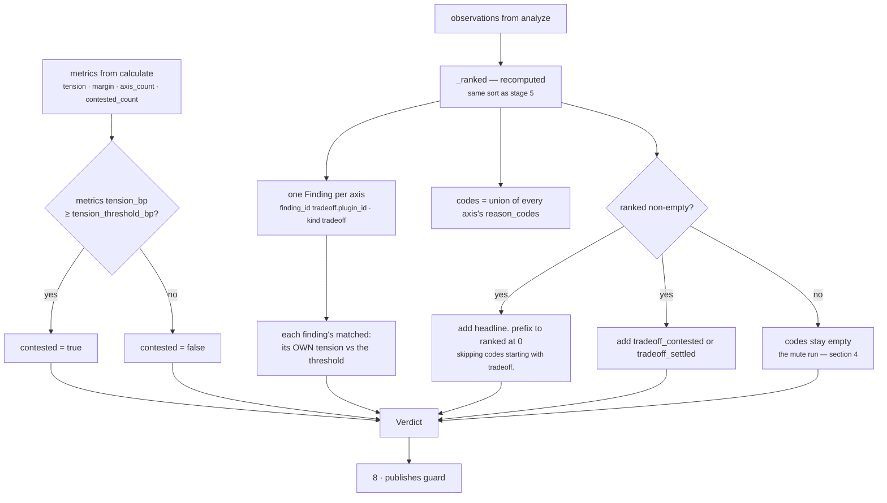

# `core.tradeoff` · Stage 6 — Evaluator

**Source:** `genios_engine/reason/reasoners/tradeoff_unit.py:TradeoffUnit.evaluate_meaning`
(lines 213–242)
**Framework:** `unit.py:ReasoningUnit.evaluate_meaning` is `@abstractmethod`

---

## 1 · What it is for

Stage 6 turns numbers into meaning. For most units that is "82 → high risk". For this unit it is
narrower and the docstring is careful about it:

> *`matched` means "a real dilemma exists here", not "do the leading thing".*

That distinction is the unit's whole boundary. `matched=True` is a claim about the *difficulty* of
the situation, not a recommendation about its resolution. A consumer that read `matched=True` and
acted on `favours.reward` would be treating a comparison as a decision — which is exactly the
authority this unit refuses to take.

---

## 2 · What exists

```python
def evaluate_meaning(self, view: UnitView, metrics: Mapping[str, int],
                     observations: Sequence[Observation]) -> Verdict:
    """`matched` means "a real dilemma exists here", not "do the leading thing".

    Every axis becomes a finding whether or not it was close, because what was given up is part
    of the explanation even when the call was easy. The sharpest axis's lean is repeated under a
    `headline.` prefix so a renderer can name one tension without re-deriving the ranking.
    """
    ranked = self._ranked(observations)
    contested = metrics["tension_bp"] >= _config_bp(view, "tension_threshold_bp", 3_000)
    findings = tuple(Finding(
        finding_id=f"tradeoff.{item.plugin_id}",
        kind="tradeoff",
        matched=int(item.metrics["tension_bp"]) >= _config_bp(
            view, "tension_threshold_bp", 3_000),
        metrics=item.metrics,
        evidence_ids=item.evidence_ids,
        reason_codes=item.reason_codes,
    ) for item in ranked)
    codes = {code for item in ranked for code in item.reason_codes}
    if ranked:
        codes.update(f"headline.{code}" for code in ranked[0].reason_codes
                     if not code.startswith("tradeoff."))
        codes.add("tradeoff_contested" if contested else "tradeoff_settled")
    return Verdict(
        matched=contested,
        metrics=dict(metrics),
        findings=findings,
        reason_codes=tuple(sorted(codes)),
    )
```

### What the `Verdict` carries — and what it deliberately does not

| Field | Value |
|---|---|
| `matched` | `True` iff the **headline** axis's tension clears `tension_threshold_bp` |
| `metrics` | `dict(metrics)` — the Calculator's four numbers, passed through untouched |
| `findings` | one `Finding` per axis, in `_ranked` order, each with its own `matched` |
| `reason_codes` | sorted union of every axis's codes, plus `headline.*` and one of `tradeoff_contested` / `tradeoff_settled` |
| `adjustments` | **never populated** |
| `checks` | **never populated** |

The last two rows are the unit's most important property and the module docstring states why:

> *Selecting a play, ranking plays, or emitting a score adjustment would make it a second decision
> authority, and GeniOS has exactly one (`reason/decision_maker.py`). So this unit emits no
> adjustments and no checks at all.*

`test_the_unit_never_touches_a_candidate` asserts `result.adjustments == ()` and
`result.checks == ()` on a contested run, and `test_a_contested_reading_is_not_a_recommendation`
additionally asserts that no reason code starts with `recommend`.

### Thresholds

| Key | Default | Applied to | Effect |
|---|---|---|---|
| `tension_threshold_bp` | `3_000` | the headline's tension → `Verdict.matched` | Above it: `matched=True` and `tradeoff_contested` |
| `tension_threshold_bp` | `3_000` | each axis's own tension → `Finding.matched` | Per-axis, independent of the headline |

The same key, applied at two scopes. **`matched` on the result and `matched` on the headline finding
are always equal**, because the result's `matched` is computed from `metrics["tension_bp"]`, which is
the headline's tension. Non-headline findings can and do differ.

`3_000` is not fitted to anything. It is the same untuned default `core.opportunity` uses for its own
threshold, which suggests a house convention rather than a measurement.

---

## 3 · How it works



### 3.1 · Every axis becomes a finding

> *Every axis becomes a finding whether or not it was close, because what was given up is part of
> the explanation even when the call was easy.*

There is no threshold filter on finding emission. A settled axis still produces a `Finding`, carrying
`matched=False` and its full `concedes.*` code. This is a deliberate departure from the pattern most
units follow — `core.opportunity`, for instance, emits **no findings at all** below its threshold.

The reason is that a tradeoff's value is asymmetric. An opportunity below threshold is genuinely not
worth mentioning. A *concession* below threshold is still a concession: "we leaned to the upside and
gave up 5,000bp of caution" is worth saying whether or not the call was hard.

`test_every_axis_becomes_a_finding_even_when_the_call_was_easy` pins it:

```python
result = TradeoffUnit().evaluate(_request(), {...opportunity 9_000, risk 500...})

assert result.matched is False
assert "tradeoff_settled" in result.reason_codes
finding, = result.findings
assert finding.matched is False
assert "concedes.caution" in finding.reason_codes
```

Findings arrive in `_ranked` order — sharpest first — not in `plugin_id` order. A renderer that takes
`result.findings[0]` gets the headline axis for free.

### 3.2 · The `headline.` prefix

```python
codes.update(f"headline.{code}" for code in ranked[0].reason_codes
             if not code.startswith("tradeoff."))
```

> *The sharpest axis's lean is repeated under a `headline.` prefix so a renderer can name one
> tension without re-deriving the ranking.*

The filter matters. `ranked[0].reason_codes` always contains `tradeoff.<axis>`, and prefixing that
would produce `headline.tradeoff.risk_vs_reward` — a code carrying no information the axis code does
not already carry. What survives the filter is exactly the *lean*:

| Headline axis's codes | Prefixed copies added |
|---|---|
| `tradeoff.risk_vs_reward`, `favours.reward`, `concedes.caution` | `headline.favours.reward`, `headline.concedes.caution` |
| `tradeoff.risk_vs_reward`, `balanced.risk_vs_reward` | `headline.balanced.risk_vs_reward` |

The second row is worth noting: `balanced.<axis>` does not start with `tradeoff.`, so it *is*
prefixed. `test_the_headline_is_the_sharpest_axis_not_the_first_plugin` asserts
`"headline.balanced.risk_vs_reward" in result.reason_codes` — a renderer can therefore distinguish
"the headline tension leans this way" from "the headline tension is a dead heat" without touching the
findings.

The originals are kept alongside the prefixed copies. A non-headline axis's `favours.speed` and the
headline's `headline.favours.reward` coexist in the same sorted tuple, which is what
`test_the_quiet_enterprise_renewal_...` checks:

```python
assert "headline.favours.reward" in result.reason_codes
assert "headline.concedes.caution" in result.reason_codes
# The quieter axes are still on the record: speed won its own argument against certainty.
assert "favours.speed" in result.reason_codes
assert "concedes.certainty" in result.reason_codes
```

There is an ambiguity in that flattening worth knowing about. Given three axes, the unprefixed set
`{favours.reward, favours.speed, favours.benefit}` does not say which code came from which axis —
the `tradeoff.<axis>` codes are in the same flat set with no linkage. Only the findings preserve the
pairing. A consumer that reads result-level codes alone can tell *what* was favoured but not *in what
argument*, which is fine for a renderer naming one headline and wrong for anything trying to
reconstruct the full picture.

### 3.3 · `tradeoff_contested` / `tradeoff_settled`

One of the two, always, provided at least one axis ran. They are the machine-readable form of the
headline threshold check, and they are redundant with `matched` — deliberately, because
`reason_codes` is what `core.recommendation` matches play-support tables against, and `matched` is
not visible in that channel.

---

## 4 · The mute empty run

```python
if ranked:
    codes.update(...)
    codes.add("tradeoff_contested" if contested else "tradeoff_settled")
```

Both code emissions are inside the guard. With no observations, `codes` stays empty and the `Verdict`
carries `reason_codes=()`.

Verified:

```text
TradeoffUnit().evaluate(request, {})   # nothing ran before it
→ COMPLETED · matched False
  metrics      {tension_bp: 0, margin_bp: 0, axis_count: 0, contested_count: 0}
  findings     ()
  reason_codes ()
```

Compare that with a run where three axes fired and every one of them was settled — priors
`opportunity 9,000 / risk 2,500`, `impact 8,000 / effort 2,000`, `urgency 9,000 / confidence 8,000`:

```text
→ COMPLETED · matched False
  metrics      {tension_bp: 875, margin_bp: 6500, axis_count: 3, contested_count: 0}
  findings     3, all matched False
  reason_codes concedes.caution · concedes.certainty · concedes.restraint
               favours.benefit · favours.reward · favours.speed
               headline.concedes.caution · headline.favours.reward
               tradeoff.cost_vs_benefit · tradeoff.risk_vs_reward
               tradeoff.speed_vs_certainty · tradeoff_settled
```

Same `matched`. Same *shape* of metrics. The only distinguishing signals are `axis_count` — which no
consumer in the repository reads — and the presence of the reason codes, which is a negative signal:
a consumer would have to notice an *absence*.

**This is the unit's one clear silence failure**, and it is a deviation from Law 3 of the layer
(*silence is not zero*) at result level, in a unit that honours the same law scrupulously at axis
level. The pattern to copy is one folder over: `core.policy` emits `organisation_policy_clear` when
it has nothing to report, so a silent result cannot be mistaken for an unconfigured one. The tradeoff
unit should emit `tradeoff_not_measurable` and does not.

The fix would be one line inside an `else:` branch and would not break the suite —
`test_a_run_with_no_prior_units_publishes_an_empty_tension_not_a_guess` asserts the metrics dict and
`findings == ()`, never `reason_codes == ()`. That is the correct shape for a test of this behaviour:
it pins what must not be invented without freezing what may still be said.

---

## 5 · Recomputation

Two things are computed more than once per evaluation.

**`_ranked` runs twice.** Once in `calculate`, once in `evaluate_meaning`, from the same
`observations` sequence. It is a pure static method over an immutable tuple, so the two results are
byte-identical; there is no correctness issue. It is the framework's shape rather than the unit's
choice — `Verdict` has no channel to carry derived structure from stage 5 into stage 6, and
`evaluate_meaning`'s signature receives the raw observations rather than the ranking.

**`_config_bp("tension_threshold_bp")` runs `2 + N` times.** Once for `contested`, then once inside
the generator expression for **each** finding. Reading it once above the comprehension would be the
obvious tidy-up:

```python
threshold = _config_bp(view, "tension_threshold_bp", 3_000)
```

At three axes this is five dictionary lookups and five type checks. It is not a performance problem
at any plausible axis count; it is noted because it is the kind of thing a reader assumes is
deliberate when it is not.

---

## 6 · Examples and edge cases

### 6.1 · Contested — the shipped run

```text
metrics from stage 5   tension_bp 5,301 · margin_bp 1,066 · axis_count 1 · contested_count 1

contested = 5,301 ≥ 3,000 → True

findings
    tradeoff.risk_vs_reward  kind=tradeoff  matched=True
        metrics       tension_bp 5,301 · margin_bp 1,066 · leading_bp 7,000 · trailing_bp 5,934
        evidence_ids  ()
        reason_codes  concedes.caution · favours.reward · tradeoff.risk_vs_reward

codes union             {tradeoff.risk_vs_reward, favours.reward, concedes.caution}
headline. prefixes  +   {headline.favours.reward, headline.concedes.caution}
contested marker    +   {tradeoff_contested}

Verdict.matched      True
Verdict.reason_codes ('concedes.caution', 'favours.reward',
                      'headline.concedes.caution', 'headline.favours.reward',
                      'tradeoff.risk_vs_reward', 'tradeoff_contested')
```

### 6.2 · Settled — an easy call, fully explained

From `test_every_axis_becomes_a_finding_even_when_the_call_was_easy`:

```text
opportunity_bp 9,000 · risk_bp 500
    margin  = 8,500
    tension = 500 × 1500 ÷ 10000 = 75

contested = 75 ≥ 3,000 → False

Verdict.matched      False
findings             one, matched=False, carrying concedes.caution
reason_codes         concedes.caution · favours.reward
                     headline.concedes.caution · headline.favours.reward
                     tradeoff.risk_vs_reward · tradeoff_settled
```

`matched=False` and the explanation is still complete. That is the shape a downstream renderer wants:
*we leaned to the upside, we gave up 500bp of caution, and it was not a close call.*

### 6.3 · Mixed — one contested axis among three

The `test_the_quiet_enterprise_renewal_...` scenario:

```text
findings, in _ranked order:
  tradeoff.risk_vs_reward      matched=True    tension 3,250   ← headline
  tradeoff.speed_vs_certainty  matched=False   tension 2,784
  tradeoff.cost_vs_benefit     matched=False   tension 1,800

Verdict.matched      True          (the headline cleared 3,000)
contested_count      1             (only the headline cleared it)
reason_codes         concedes.caution · concedes.certainty · concedes.restraint
                     favours.benefit · favours.reward · favours.speed
                     headline.concedes.caution · headline.favours.reward
                     tradeoff.cost_vs_benefit · tradeoff.risk_vs_reward
                     tradeoff.speed_vs_certainty · tradeoff_contested
```

Twelve codes. Three arguments, each with its winner and its loser named, and one of them flagged as
the one that actually matters.

### 6.4 · Boundary table

| Situation | `matched` | Findings | `tradeoff_*` code |
|---|---|---|---|
| Headline tension exactly `3_000` | `True` — the comparison is `>=` | headline's `matched=True` | `tradeoff_contested` |
| Headline tension `2_999` | `False` | headline's `matched=False` | `tradeoff_settled` |
| Headline contested, two other axes settled | `True` | 1 `True`, 2 `False` | `tradeoff_contested` |
| No axis ran | `False` | `()` | **neither** — the mute run |
| Headline is `balanced` | follows the tension only | unaffected | follows the tension only |
| `tension_threshold_bp: 1_000`, one axis at 75 | `False` | one, `matched=False` | `tradeoff_settled` |
| `tension_threshold_bp: 0`, at least one axis | `True` — every tension is `>= 0` | all `True` | `tradeoff_contested` |
| `tension_threshold_bp: 0`, **no** axis | `True` | `()` | **neither** |

The last two rows are a legitimate configuration with two surprising consequences. Verified:

```text
config {"tension_threshold_bp": 0}, opportunity 9,000 vs risk 0
    → matched True · tension_bp 0 · axis_count 1 · contested_count 1 · tradeoff_contested

config {"tension_threshold_bp": 0}, nothing ran before it
    → matched True · tension_bp 0 · axis_count 0 · contested_count 0 · reason_codes ()
```

The first says a `tension_bp: 0` free move is "contested". The second is worse: **`matched=True` with
no findings and no reason codes at all** — the unit asserting a dilemma exists while unable to name
one. `_config_bp` accepts `0` because `0 <= 0 <= 10_000`, so nothing refuses it, and the `if ranked:`
guard suppresses the codes that would otherwise contradict the claim. A capability that means "report
every axis" should set the threshold low but not to zero, or should read `contested_count` against
`axis_count` rather than reading `matched`.

---

## Related

| Document | Covers |
|---|---|
| [04-Calculator.md](04-Calculator.md) | Where `metrics["tension_bp"]` comes from, and the `_ranked` order these findings inherit |
| [06-Builder-and-Metrics.md](06-Builder-and-Metrics.md) | What the `Verdict` becomes, and the guard between the two |
| [03-Analyzer.md](03-Analyzer.md) | Where each axis's reason codes are minted |
| [Category 3 · Optimization](../README.md) | §4.1 "Known issue: the empty run is mute", and `core.policy`'s better handling of the same case |
