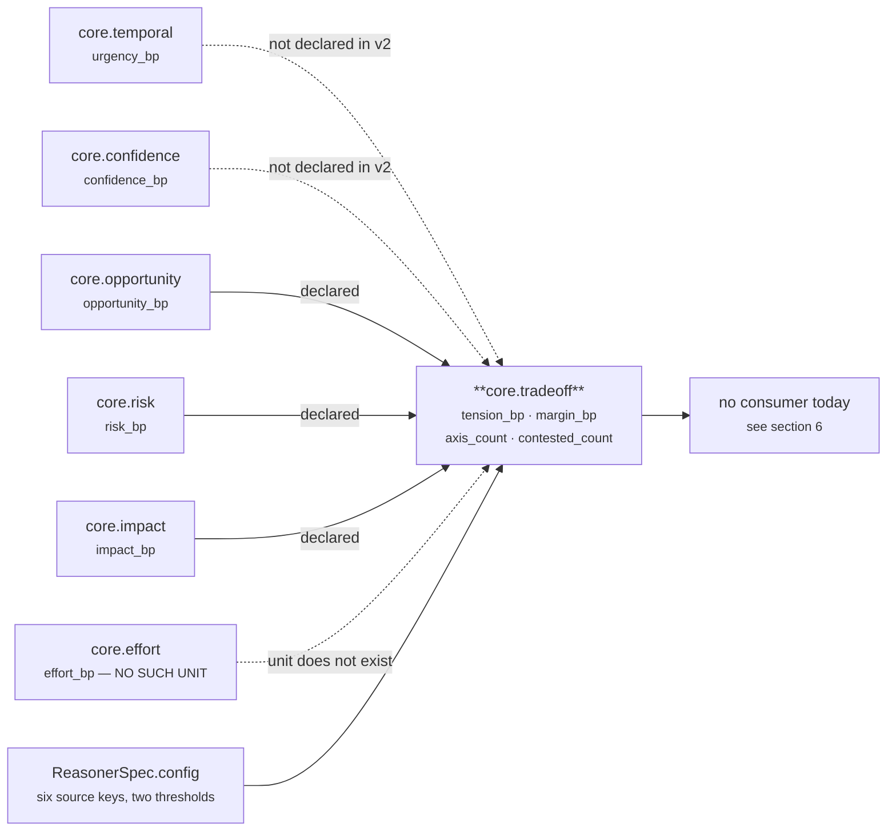
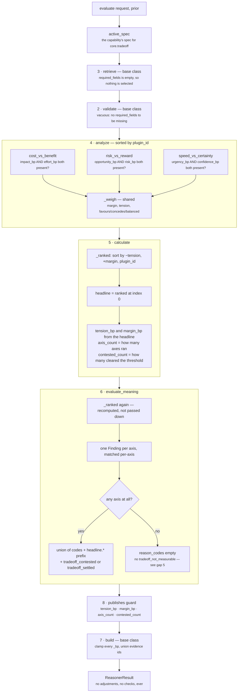

# `core.tradeoff` — the Tradeoff Unit

**Module:** `genios_engine/reason/reasoners/tradeoff_unit.py` (260 lines)
**Class:** `tradeoff_unit.py:TradeoffUnit`
**Category:** `UnitCategory.OPTIMIZATION` (Category 3)
**Version:** `1.0.0`
**Registered:** `reason/reasoners/__init__.py:OPTIMIZATION` — first of five
**Named by:** `sales.deal_cooling_full` v2 (`packs/capabilities/deal_cooling_v2.py:116`) and the
`FULL_ROSTER` fixture in `tests/test_l4_end_to_end.py:56`. `sales.deal_cooling` v1 does not run it.
**Dedicated test file:** `tests/test_unit_tradeoff_unit.py` — 24 tests, all passing

---

## 1 · What it is for

> *Which competing objective is winning here, and what is being given up?*

Every real business decision is contested. The module docstring puts the case in one paragraph:

> *Closing this week protects the quarter but concedes margin. Sending now protects momentum but
> concedes certainty. Chasing the upside concedes caution. The rest of Layer 4 is built out of units
> that each look at one side of that argument — risk looks at downside, opportunity at upside,
> temporal at time pressure — and each one is honest inside its own frame. Nobody, until this unit,
> holds two of those frames against each other and says these two are pulling in opposite
> directions, and this is how hard.*

And the line it draws around itself:

> *An operator asks "is this risky?"; an executive asks "risky compared to what am I giving up by
> waiting?" This unit does the comparison and nothing more.*

It reads **only metrics other units already published**. It touches no fact, no evidence row, no
clock. That is what lets it be scheduled last in any capability without changing anything Layer 2
has to supply — and it is also why the whole unit can go dark when a capability forgets to declare
a dependency, which is exactly what happens in the shipped manifest (§7, gap 2).

Three properties are stated as deliberate in the source, and all three are pinned by tests:

| Property | Mechanism | Test that holds it |
|---|---|---|
| **It compares, it never chooses** | `Verdict` carries no `adjustments` and no `checks` — the fields are never populated | `test_the_unit_never_touches_a_candidate` |
| **It names the loser** | Every lean emits `concedes.<side>` next to `favours.<side>` | `test_heavy_effort_against_modest_benefit_concedes_the_benefit` |
| **It is silent unless both sides spoke** | `_prior_bp` returns `None` on a `-1` sentinel; the plugin returns `()` | `test_one_published_side_is_a_blind_spot_not_a_landslide` |

The third is the one that makes the unit trustworthy rather than merely clever. *"Inventing the
missing side as zero would fabricate a landslide out of a blind spot."*

---

## 2 · Its place in the pipeline



The unit sits at the end of Category 3, after every unit whose metrics it reads. `deal_cooling_v2`
schedules it last in the optimisation block and declares four dependencies:

```python
_spec("core.tradeoff", ("core.risk", "core.opportunity", "core.impact", "core.cost"))
```

That declaration is the whole story of what the unit can see. `orchestrator.py` hands a unit only
the prior results its spec named, so `core.temporal` and `core.confidence` — both of which complete
successfully in the same run — are invisible to it. Measured on the shipped
`sales.deal_cooling_full` fixture:

```text
core.temporal   urgency_bp    9,360   → not declared → speed_vs_certainty silent
core.confidence confidence_bp 6,950   → not declared → speed_vs_certainty silent
core.opportunity opportunity_bp 7,000 → declared     ┐
core.risk        risk_bp       5,934  → declared     ┘ risk_vs_reward fires
core.impact      impact_bp    10,000  → declared     ┐
core.effort      —                    → no such unit ┘ cost_vs_benefit silent

result: tension_bp 5,301 · margin_bp 1,066 · axis_count 1 · contested_count 1
```

One of three axes fires. The unit is behaving exactly as designed; the manifest is under-wired. See
[03-Analyzer.md](03-Analyzer.md) §5 for the two-line config change that lights the other two.

---

## 3 · The plugins

Three plugins, three contested axes, one shared scoring routine (`tradeoff_unit.py:_weigh`). Unlike
most units in the roster, the plugins here carry no arithmetic of their own — each one resolves two
sources, refuses if either is absent, and hands the pair to `_weigh`. The IP is in the formula and
in the silence rule, not in the plugins.

`analyze()` runs them in `plugin_id` order, which is alphabetical and therefore the order the
findings would be emitted in were the ranking not applied afterwards.

| # | `plugin_id` | Class | The argument | Side A | Side B | Doc |
|---|---|---|---|---|---|---|
| 1 | `cost_vs_benefit` | `CostVersusBenefitPlugin` | Is the prize worth the work? | `benefit_source.impact_bp` | `cost_source.effort_bp` | [03a](03a-plugin-cost_vs_benefit.md) |
| 2 | `risk_vs_reward` | `RiskVersusRewardPlugin` | Chase the upside, or protect the downside? | `reward_source.opportunity_bp` | `risk_source.risk_bp` | [03b](03b-plugin-risk_vs_reward.md) |
| 3 | `speed_vs_certainty` | `SpeedVersusCertaintyPlugin` | Move now, or wait until we are surer? | `speed_source.urgency_bp` | `10,000 − certainty_source.confidence_bp` | [03c](03c-plugin-speed_vs_certainty.md) |

Every plugin emits the same four observation metrics and the same reason-code shape:

| Observation metric | Meaning |
|---|---|
| `tension_bp` | How hard this particular argument is. `min(A,B) × (10,000 − margin) ÷ 10,000` |
| `margin_bp` | `abs(A − B)` — how far apart the two pressures are |
| `leading_bp` | `max(A, B)` — the winning side's level |
| `trailing_bp` | `min(A, B)` — the conceded side's level |

| Reason code | When |
|---|---|
| `tradeoff.<axis>` | always, on every observation this plugin emits |
| `balanced.<axis>` | `margin_bp < decisive_margin_bp` |
| `favours.<side>` + `concedes.<other>` | otherwise — always emitted as a pair |

### Published metrics

| Metric | Type | Range | Meaning |
|---|---|---|---|
| `tension_bp` | integer basis points | 0–10,000 | The **sharpest** axis's tension, not a blend. `10,000bp` means 1.00 |
| `margin_bp` | integer basis points | 0–10,000 | The sharpest axis's margin — how decisively that one argument was won |
| `axis_count` | plain integer | 0–3 today | How many comparisons were possible at all |
| `contested_count` | plain integer | 0–3 today | How many of those cleared `tension_threshold_bp` |

All four are declared in `TradeoffUnit.publishes`. The framework's undeclared-metric guard in
`unit.py:ReasoningUnit.evaluate` refuses any other name. `test_the_unit_never_republishes_a_reserved_shared_metric`
additionally pins that `confidence_bp`, `urgency_bp` and `priority_override_bp` are **not** in that
tuple — this unit reads two of those three and must never become a second writer of either.

---

## 4 · Internal flow



Four things in that picture are decisions rather than accidents.

**The plugins are thin and `_weigh` is thick.** All three plugins are eight lines: resolve two
sources, refuse on `None`, delegate. Putting the formula in one module-level function means the
three axes cannot drift apart — a change to how tension is scored changes all three at once, which
is the correct blast radius for a comparison that is supposed to be the *same* comparison applied to
different pairs.

**`_ranked` is computed twice.** `calculate` sorts the observations, then `evaluate_meaning` sorts
them again from the same input. It is pure and deterministic so the two results are identical; it is
also the framework's fault rather than the unit's, because `Verdict` has no channel to carry derived
structure from stage 5 to stage 6. Harmless at three observations; worth knowing it is there.

**The maximum, never the mean.** `calculate` publishes the sharpest axis. *"A situation containing
one genuinely contested axis and two settled ones is a hard situation — averaging would report it as
easy and hide the exact thing a human is needed for."* See [04-Calculator.md](04-Calculator.md).

**Every axis becomes a finding, contested or not.** *"What was given up is part of the explanation
even when the call was easy."* An axis below the threshold still emits a `Finding` with
`matched=False` carrying its `concedes.*` code. See [05-Evaluator.md](05-Evaluator.md).

---

## 5 · Config keys

Eight keys. Two thresholds validated by `tradeoff_unit.py:_config_bp`, six source-unit names
validated by `tradeoff_unit.py:_config_id`.

```python
def _config_bp(view: UnitView, key: str, default: int) -> int:
    value = view.config.get(key, default)
    if isinstance(value, bool) or not isinstance(value, int) or not 0 <= value <= 10_000:
        raise ValueError(f"{key} must be integer basis points")
    return value


def _config_id(view: UnitView, key: str, default: str) -> str:
    """Which unit supplies one side of an axis, so a capability can substitute its own authority."""
    value = view.config.get(key, default)
    if not isinstance(value, str) or not value.strip():
        raise ValueError(f"{key} must name a reasoning unit")
    return value.strip()
```

| Key | Default | Read by | Validated | Effect |
|---|---|---|---|---|
| `tension_threshold_bp` | `3_000` | `calculate`, `evaluate_meaning` | **always**, even on an empty run | At or above it an axis is *contested*; the unit's `matched` follows the headline |
| `decisive_margin_bp` | `500` | `_weigh`, via any plugin | **lazily** — only when at least one axis fires | Below this margin no side is named; the axis emits `balanced.<axis>` instead |
| `speed_source` | `"core.temporal"` | `SpeedVersusCertaintyPlugin` | lazily | Which unit supplies `urgency_bp` |
| `certainty_source` | `"core.confidence"` | `SpeedVersusCertaintyPlugin` | lazily | Which unit supplies `confidence_bp`, which is then inverted |
| `reward_source` | `"core.opportunity"` | `RiskVersusRewardPlugin` | lazily | Which unit supplies `opportunity_bp` |
| `risk_source` | `"core.risk"` | `RiskVersusRewardPlugin` | lazily | Which unit supplies `risk_bp` |
| `benefit_source` | `"core.impact"` | `CostVersusBenefitPlugin` | lazily | Which unit supplies `impact_bp` |
| `cost_source` | `"core.effort"` | `CostVersusBenefitPlugin` | lazily | Which unit supplies `effort_bp`. **No unit in the roster is called `core.effort`** |

**No shipped capability authors any of these.** Verified by grep across `genios_engine/packs/` — the
only occurrences of all eight key names in the repository are their definitions in
`tradeoff_unit.py`. Every number and every source id in production today is the hard-coded default.

**Both thresholds are guesses.** Neither `3_000` nor `500` has been fitted to outcome data. The
500bp margin is defended in the docstring on stability grounds rather than accuracy grounds — *"a
lean the width of rounding noise is not a lean"* — which is a good argument for *some* deadband and
no argument at all for that particular width.

**Validation timing is asymmetric, and it is observable.** `tension_threshold_bp` is read on the
first line of `calculate`, before the `if not ranked` early return, so a malformed value fails the
run even when there is nothing to measure. `decisive_margin_bp` is read inside `_weigh`, so a
capability that authors `decisive_margin_bp: 99_999` and never gets two sides on any axis runs
clean. Verified:

```text
config {"tension_threshold_bp": 20_000}, no prior units
    → ValueError: tension_threshold_bp must be integer basis points

config {"decisive_margin_bp": 99_999}, no prior units
    → COMPLETED · tension_bp 0 · margin_bp 0 · axis_count 0 · contested_count 0
```

**A float in any key fails earlier and elsewhere.** `CapabilityManifest` deep-freezes
`ReasonerSpec.config` through `platform/canonical.py:canonicalize`, which raises
`CanonicalizationError: floats are forbidden in semantic artifacts` at manifest construction.
`_config_bp` is the second line of defence, not the first.

---

## 6 · Silence semantics

The unit has four distinct quiet states and they are not interchangeable.

| Situation | Metrics | `matched` | Findings | Reason codes |
|---|---|---|---|---|
| No axis had both sides | `0 · 0 · 0 · 0` | `False` | `()` | **`()` — completely mute** |
| Axes ran, none cleared the threshold | headline's numbers, `contested_count: 0` | `False` | one per axis, all `matched=False` | axis codes + `headline.*` + `tradeoff_settled` |
| At least one axis cleared the threshold | headline's numbers | `True` | one per axis, `matched` per-axis | axis codes + `headline.*` + `tradeoff_contested` |
| A declared `required_fields` entry is absent | none | — | — | `INSUFFICIENT_CONTEXT` with `required_context_missing` |

Row 1 is the unit's one real silence failure and it is worth stating in the sharpest terms available:
**an unmeasurable run and a fully-settled run produce the same `matched` and nearly the same
metrics.** The only distinguishing signal is `axis_count`, and — per §7 gap 4 — no consumer in the
repository reads it. `core.policy`, in the same category, handles the identical situation better by
emitting `organisation_policy_clear` so a silent result cannot be mistaken for an unconfigured one.

The **per-axis** silence rule, by contrast, is the unit's best property and is pinned four ways:

| Input state | What the plugin does | Test |
|---|---|---|
| Neither side's unit ran | `()` | `test_no_axis_is_reported_when_nothing_ran_before_it` |
| One side ran, one did not | `()` | `test_one_published_side_is_a_blind_spot_not_a_landslide` |
| One side `FAILED` | `()` — failure is absence, not zero | `test_a_unit_that_failed_is_treated_as_absent_not_as_zero` |
| Both ran, one measured `0` | a real axis with `tension_bp: 0` | `test_a_measured_zero_still_produces_an_axis` |

That last row is the distinction the whole `_ABSENT = -1` sentinel exists to make:

> *Basis points are 0..10000 by law, so a negative sentinel can never collide with a real published
> value. It is how a plugin distinguishes "the unit said zero" from "the unit never ran" — the
> difference between a measured absence of pressure and a blind spot.*

---

## 7 · Known gaps, verified against the source

| # | Gap | Where |
|---|---|---|
| 1 | **`core.effort` does not exist.** `cost_source` defaults to a unit id no module declares. `effort_bp` is published by `core.cost`. The axis is dark under default config in every capability that runs the unit. A one-key config change fixes it | [03a](03a-plugin-cost_vs_benefit.md) §3 |
| 2 | **Two of three axes are dark in the shipped manifest.** `deal_cooling_v2` does not declare `core.temporal` or `core.confidence` as dependencies of `core.tradeoff`, so `speed_vs_certainty` never sees either — despite both completing in the same run. Measured `axis_count = 1` | [03-Analyzer.md](03-Analyzer.md) §5 |
| 3 | **The empty run is mute.** `evaluate_meaning` guards code emission on `if ranked:`, so a run with no measurable axis publishes `reason_codes == ()`. Nothing says `tradeoff_not_measurable` | [05-Evaluator.md](05-Evaluator.md) §4 |
| 4 | **Nothing downstream consumes any of the four metrics.** No name in `publishes` appears anywhere in `decision_maker.py`, `deliver/`, or `executive/`. `core.validation` and `core.recommendation` could read its findings and codes but neither declares it as a dependency in v2 | [06-Builder-and-Metrics.md](06-Builder-and-Metrics.md) §5 |
| 5 | **Findings cite nothing, and the result may cite something it never read.** No plugin attaches `evidence_ids`. The base retriever still attaches evidence for any `required_fields` the capability declares — fields no plugin touches. Verified: with `required_fields=("deal.status",)` the result carries `ev_status` while its arithmetic used only prior metrics | [02-Retriever.md](02-Retriever.md) §4 |
| 6 | **A perfect tie with `decisive_margin_bp: 0` names an arbitrary winner.** With the deadband disabled and `A == B`, `_weigh` falls to the `else` branch and emits `favours.<second_side>`. For `risk_vs_reward` that is `favours.caution` / `concedes.reward` on a dead-level pair | [03-Analyzer.md](03-Analyzer.md) §4 |
| 7 | **Both thresholds are untuned.** `3_000` and `500` were authored from domain reasoning, never fitted to outcome data | §5 above |
| 8 | **`_ranked` runs twice per evaluation**, and `_config_bp("tension_threshold_bp")` runs `2 + N` times in `evaluate_meaning`. Pure and cheap, but it is recomputation the `Verdict` shape forces | [05-Evaluator.md](05-Evaluator.md) §5 |
| 9 | **`speed_source` defaults to `core.temporal`**, a supplementary reasoner that publishes `urgency_bp` without declaring a `publishes` tuple — the metric `test_unit_roster.py` reserves for `core.priority`. The default therefore reads the *un-audited* publisher of a reserved metric | [03c](03c-plugin-speed_vs_certainty.md) §3 |

---

## 8 · The files

| File | Stage | Covers |
|---|---|---|
| [01-Input-and-Validator.md](01-Input-and-Validator.md) | 1 · Input, 2 · Validator | What arrives, the empty `required_fields`, why `validate()` is **not** overridden and why that makes it vacuous here, and the one way this unit can still return `INSUFFICIENT_CONTEXT` |
| [02-Retriever.md](02-Retriever.md) | 3 · Retriever | Why `retrieve()` is **not** overridden, why `view.facts` is empty on every shipped run, and the evidence the base class attaches to claims it did not ground |
| [03-Analyzer.md](03-Analyzer.md) | 4 · Analyzer | The plugin seam: three thin plugins over one shared `_weigh`, execution order, the `_ABSENT` sentinel, and why the axes never interact |
| [03a-plugin-cost_vs_benefit.md](03a-plugin-cost_vs_benefit.md) | 4 | Is the prize worth the work — and the missing `core.effort` that keeps it dark |
| [03b-plugin-risk_vs_reward.md](03b-plugin-risk_vs_reward.md) | 4 | Upside against exposure — the only axis that fires in production |
| [03c-plugin-speed_vs_certainty.md](03c-plugin-speed_vs_certainty.md) | 4 | Move now or wait — the confidence inversion, and the read-never-publish rule |
| [04-Calculator.md](04-Calculator.md) | 5 · Calculator | `calculate()` — the maximum not the mean, the three-key total order, and why `axis_count` exists |
| [05-Evaluator.md](05-Evaluator.md) | 6 · Evaluator | `evaluate_meaning()` — thresholds, what `matched` means here, the `headline.` prefix, and the absence of adjustments and checks |
| [06-Builder-and-Metrics.md](06-Builder-and-Metrics.md) | 7 · Builder, 8 · Metrics | The `ReasonerResult`, why `build()` is **not** overridden, evidence attachment, and the empty consumer list |

---

## 9 · Verification

```console
$ cd /Users/rohitswerashi/genios-brain && .venv/bin/python -m pytest tests/test_unit_tradeoff_unit.py -q
........................                                                 [100%]
24 passed in 0.08s
```

The test file's own framing names the five properties it defends:

> *Two sides or nothing. The loser is named. It compares, it never chooses. Total ordering. Metric
> authority is respected.*

Numbers in this folder come from two places, and each is labelled where it appears: assertions
already pinned in `tests/test_unit_tradeoff_unit.py`, and values produced by **executing the real
unit** — either `TradeoffUnit().evaluate(...)` against the test file's own fixtures, or the full
`sales.deal_cooling_full` capability through `ReasoningOrchestrator`. Nothing here is inferred from
reading the formula.

What the suite does **not** pin, and could change silently:

| Unpinned | Consequence of a regression |
|---|---|
| `tension_threshold_bp` default of `3_000` | Every `matched` and every `contested_count` in the system moves |
| The `axis_count` / `contested_count` arithmetic beyond the single end-to-end scenario | A miscount would surface only in that one test's `== 3` and `== 1` |
| The mute empty run — asserted as `findings == ()`, never as `reason_codes == ()` | Adding `tradeoff_not_measurable` would not break the suite, which is the right shape for a fix |
| Any interaction with a real consumer | There is no consumer to break |

---

## Related

| Document | Covers |
|---|---|
| [Category 3 · Optimization](../README.md) | The five optimisation units side by side, and the category's shared silence law |
| [Part 2 · The Unit Framework](../../README.md) | The eight stages, the plugin seam, `prior_metric`, the `publishes` guard |
| [Layer 4 · Overview](../../../00-Overview.md) | The five laws, including Law 3 — *silence is not zero* |
| [Part 3 · Decision Maker](../../../03-Decision-Maker/README.md) | The one decision authority this unit deliberately is not |
| [`core.opportunity`](../../02-Business-Evaluation/core.opportunity/README.md) | The publisher of `opportunity_bp`, one side of `risk_vs_reward` |
