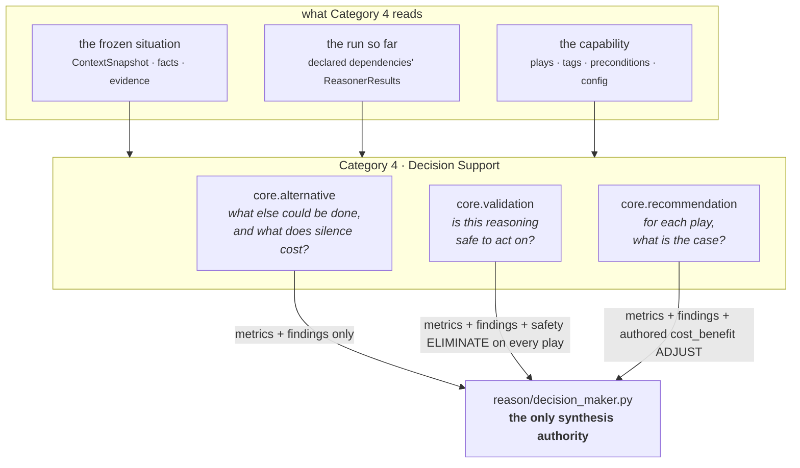
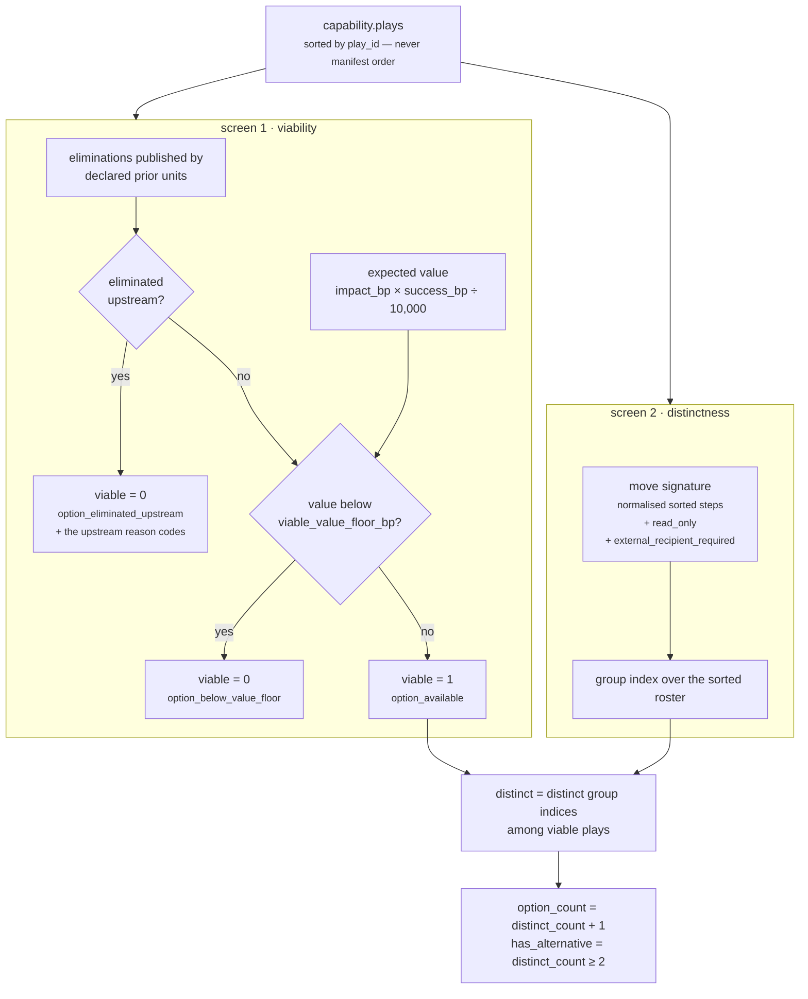
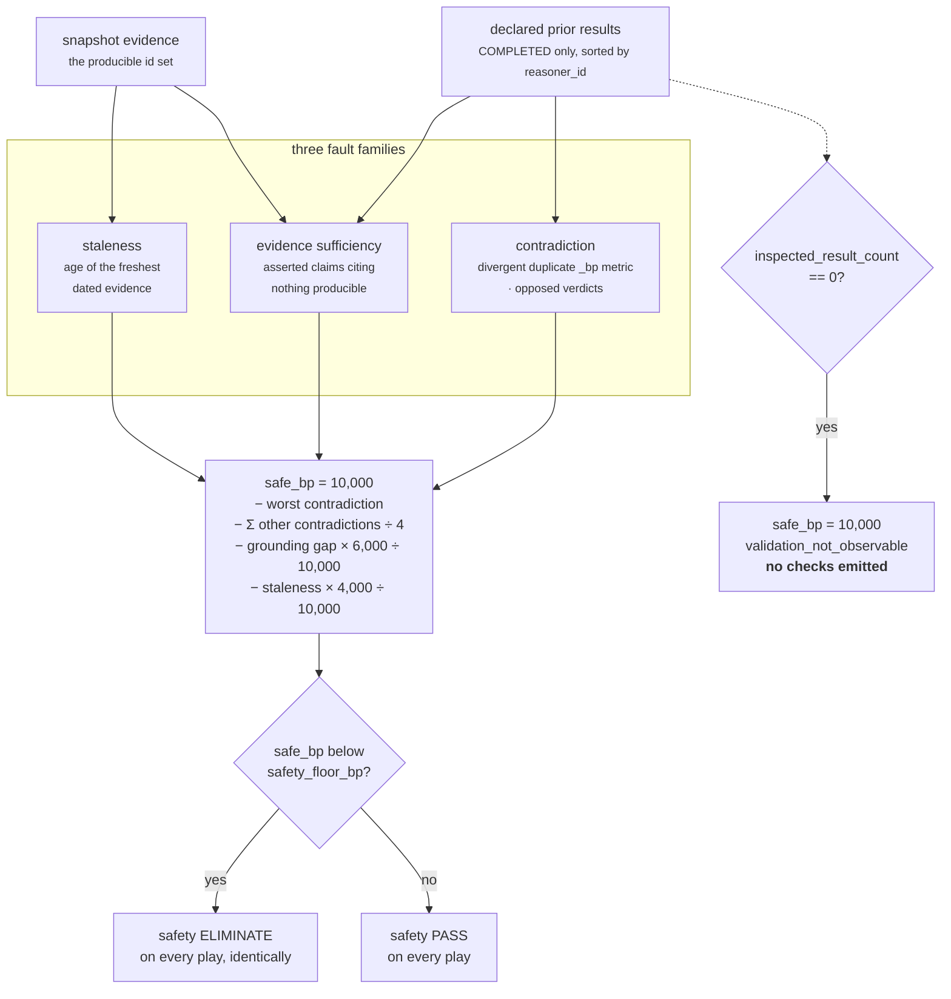
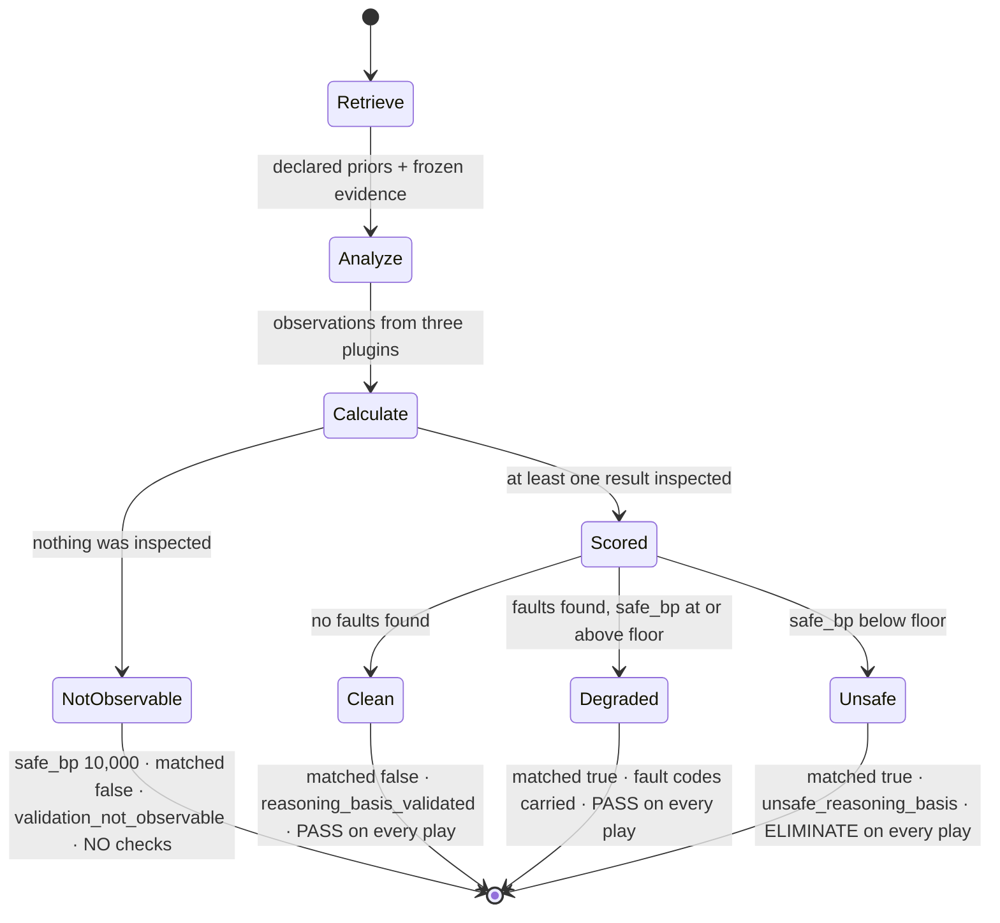
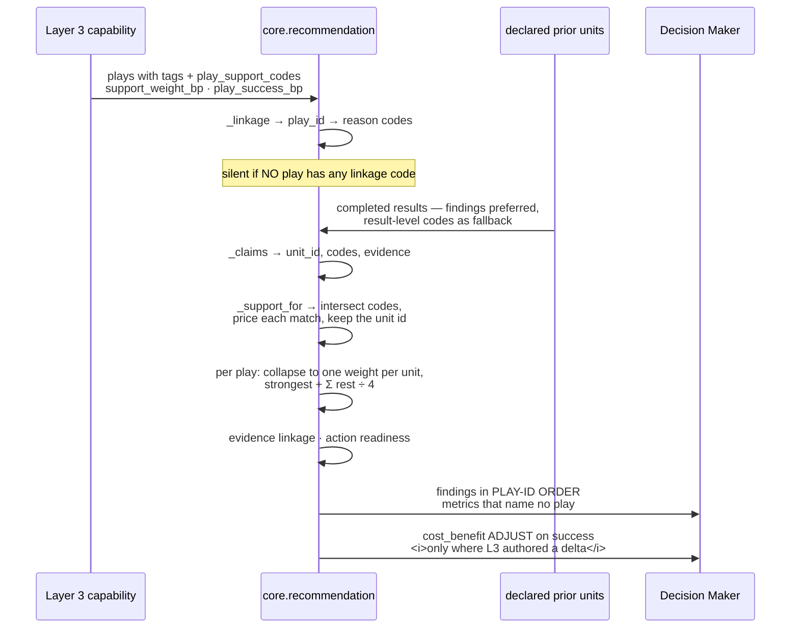

# Category 4 · Decision Support

**Units:** `core.alternative` · `core.validation` · `core.recommendation`
**Files:** `reason/reasoners/alternative_unit.py`, `validation_unit.py`, `recommendation_unit.py`
**Tests:** `tests/test_unit_alternative_unit.py` (26) · `tests/test_unit_validation_unit.py` (32) ·
`tests/test_unit_recommendation_unit.py` (30) — **88 passing**
**Question they answer:** *what does the Decision Maker need in front of it before it is allowed to
choose?*

These three prepare the field. They do not judge it. That sentence is the whole document.

---

## 1 · What the blueprint asked for

The architecture names seventeen units in four categories and gives Category 4 one line:

> | 4 · Decision Support | Alternative, Validation, Recommendation | Prepare inputs for the final decision |

"Prepare inputs" is doing enormous work in that sentence, and the architecture knows it. The same
document draws the constraint that makes this category the hardest one to build honestly:

> *If it starts making decisions, then you've accidentally created two reasoning engines. That's
> architectural leakage. There should only be one place where thinking happens.*

Applied to Category 1 that constraint is easy — a Timeline unit that reports elapsed hours is
obviously not deciding anything. Applied here it is genuinely difficult, because all three units
sit one step from the answer:

- A unit named **Alternative** exists to describe the option set. An option set with an implied
  ordering *is* a recommendation.
- A unit named **Validation** is the only thing in the layer permitted to stop a run. A veto applied
  selectively *is* a preference.
- A unit named **Recommendation** must not recommend. It is the most misnamed symbol in the
  codebase and the docstring says so in its own way: *"it assembles a case; it never argues one."*

The blueprint also asks every unit to share the same anatomy — Input → Validator → Retriever →
Analyzer → Calculator → Evaluator → Output Builder, with plugins inside the Analyzer. All three
comply; see [02 · Unit Framework](../README.md) for why the stages are methods on
`reason/unit.py:ReasoningUnit` rather than eight files.

What the blueprint does **not** specify is where the analysis/synthesis line actually falls for
these three. That line had to be drawn in code, and §3 is mostly about where it was drawn and what
it cost.

---

## 2 · What exists

All three units, on the common framework, with nine analyzer plugins between them.



| Unit | Plugins | Publishes | Emits candidate effects? |
|---|---|---|---|
| `core.alternative` | `play_viability`, `move_distinctness`, `do_nothing_baseline` | 7 metrics | **Never.** No check, no adjustment. |
| `core.validation` | `contradiction`, `evidence_sufficiency`, `staleness` | 7 metrics | One `safety` check per play — `PASS` or `ELIMINATE`, identical across all plays. |
| `core.recommendation` | `play_support`, `evidence_linkage`, `action_readiness` | 6 metrics | A `cost_benefit` `ADJUST` on `success`, only where Layer 3 authored `play_success_bp`. |

### The published metrics

Every one of these is an integer in basis points or a plain count. `7,500bp` means 0.75 — there are
no floats anywhere in `reason/`, because a float would make the decision hash machine-dependent.

| Unit | Metric | Meaning |
|---|---|---|
| alternative | `declared_count` | Plays in the manifest that got a viability reading |
| | `viable_count` | Plays that survived both screens |
| | `distinct_count` | Distinct **moves** among the viable, not manifest entries |
| | `duplicate_count` | `viable_count − distinct_count` |
| | `option_count` | `distinct_count + 1` — the null option never leaves the table |
| | `has_alternative` | 1 only when `distinct_count >= 2` |
| | `do_nothing_baseline_bp` | The price of standing still |
| validation | `contradiction_count` | Incompatible pairs found across the inspected results |
| | `evidence_sufficiency_bp` | Share of asserted claims citing producible evidence |
| | `ungrounded_claim_count` | Claims that cited nothing the snapshot can produce |
| | `staleness_bp` | How far past the age limit the **freshest** evidence is |
| | `stale_evidence_count` | Rows older than the limit |
| | `inspected_result_count` | How much was actually looked at |
| | `safe_bp` | The composite: how sound the basis is |
| recommendation | `declared_play_count` | Plays a case file was assembled for |
| | `supported_play_count` | Plays whose case cleared `support_threshold_bp` |
| | `support_strength_bp` | Strongest case in the field — **unattributed** |
| | `support_coverage_bp` | Share of the field argued for at all |
| | `evidence_linked_count` | Distinct snapshot rows behind the whole field |
| | `ready_play_count` | Plays at or above `readiness_threshold_bp` |

### The tuning knobs

All authored in Layer 3, versioned inside the capability, validated as integer basis points on read.
A malformed value raises rather than rounding: *"a safety floor that silently became zero would mean
this unit never stopped anything again."*

| Unit | Key | Default | What it governs |
|---|---|---|---|
| alternative | `viable_value_floor_bp` | `500bp` | Below this expected value a play is a manifest leftover, not an option |
| | `inaction_cost_source` | `core.cost` | Who owns the price of inaction |
| | `headroom_source` / `momentum_source` / `exposure_source` | `core.opportunity` / `core.temporal` / `core.risk` | The three fallback signals |
| validation | `contradiction_gap_bp` | `5,000bp` | Gap between two publishers of one `_bp` metric that counts as a clash |
| | `verdict_clash_severity_bp` | `8,000bp` | Flat severity of a yes/no verdict clash |
| | `grounding_weight_bp` | `6,000bp` | How much a missing citation costs |
| | `staleness_weight_bp` | `4,000bp` | How much age costs |
| | `safety_floor_bp` | `4,000bp` | Below this, veto every play |
| | `max_evidence_age_hours` | `168` — one week | When the basis stops describing now |
| recommendation | `default_support_bp` | `5,000bp` | Weight of a linkage the author never priced |
| | `support_threshold_bp` | `3,000bp` | What counts as a real case |
| | `readiness_threshold_bp` | `10,000bp` | "Ready" means fully ready, by default |
| | `support_weight_bp` | `{}` | Per-reason-code prices |
| | `play_support_codes` | `{}` | Explicit finding→play linkage |
| | `play_success_bp` | `{}` | The authored nudge, per play |
| | `dependency_source` | `core.dependency` | Who owns freedom-to-proceed |

The shipped candidate capability `sales.deal_cooling_full`
(`packs/capabilities/deal_cooling_v2.py:_full_roster`) overrides exactly one of these:
`safety_floor_bp: 3_000`, on the reasoning that a read-only draft awaiting human approval is a lower
bar to *consider* than an irreversible move — *"It still cannot be built on a contradiction."*

---

## 3 · The gap, and why

Six differences between the specified category and the built one. Four are decisions. Two are
admissions.

### 3.1 · "Recommendation" does not recommend, and that is the point

The name comes from the blueprint. The behaviour does not. `core.recommendation` builds the
findings-to-plays join that nothing else in Layer 4 builds, reports the strength of the strongest
case in the field — and deliberately does not say which play holds it.

Three mechanisms enforce that, and each is separately tested:

1. **No metric names a play.** `support_strength_bp` is the field maximum with the play id
   stripped off. Per-play numbers live on the findings, where they read as description rather than
   as a shortlist. `test_the_unit_never_names_a_winner` asserts no metric name contains a play id.
2. **Findings are emitted in play-id order, never support order.**
   `test_findings_are_ordered_by_play_id_and_never_by_strength` builds a field where `zeta_play`
   holds the strongest case at `6,250bp` and asserts it is still reported last. *"Ordering output by
   strength would be a ranking, whatever the docstring claimed."*
3. **Unit-level reason codes are categorical.** The `play:` prefixed codes stay on their findings;
   only `play_case_assembled` / `no_play_case_assembled` and the plugin vocabulary reach the top.

The one thing that *does* move a score is bounded the same way: `_tilt` scales a nudge Layer 3
authored in `play_success_bp`. The author supplies the judgement — which play a well-evidenced case
should favour, and by how much at full strength — and the unit supplies only the measured magnitude.
Hardcoding a play name here *"would make this unit a decision authority by the back door."*

### 3.2 · Validation holds a veto, and it is symmetric by construction

This is the only unit outside `core.constraint` and the legacy gate that can stop a run, and the
only Decision Support unit permitted to emit a `CandidateCheck` with outcome `ELIMINATE`.

The bound that keeps it analysis rather than synthesis is structural, not a convention: the check
list is built by iterating **every play the capability declares**, sorted, with the same `outcome`,
the same `reason_code`, and the same `detail` payload on each. There is no branch in
`ValidationUnit.evaluate_meaning` that can produce a different verdict for two different plays.
The unit stops the run or it does not; it can never pick.

The passing case emits a check too, which is not redundancy. A candidate whose trace shows
`safety: PASS` was genuinely validated; a candidate with no safety check at all never was, and those
two must not look alike in an audit six months later.

### 3.3 · The deliberate fail-open, and its tell

When `inspected_result_count == 0`, `safe_bp` is set to `10,000bp` and the unit returns early with
`matched=False`, reason code `validation_not_observable`, and **no checks at all**.

That is a fail-open in a layer whose fourth law is *fail closed*, so it needs defending. The
argument in the code is that eliminating on the grounds of having looked at nothing *"would veto
every plan in which validation happens to be scheduled first, which would be a bug wearing the
costume of caution."* A validator that vetoes when it has no evidence of a fault is not cautious; it
is broken in a way that makes the whole plan order load-bearing.

What makes the fail-open survivable is that it is **legible**. `inspected_result_count` is published
precisely so that a `safe_bp = 10,000` from an empty room and a `safe_bp = 10,000` from a clean run
are distinguishable by any consumer that bothers to look:

> *``safe_bp = 10,000`` from nothing inspected and ``safe_bp = 10,000`` from a clean run are entirely
> different claims, and a consumer that cannot tell them apart will eventually act on silence.*

**The residual risk is real and worth naming for anyone taking this to production.** Nothing in
`reason/` currently reads `inspected_result_count` — see §3.6. The fail-open is safe today only
because `sales.deal_cooling_full` declares `core.validation` with `FailurePolicy.REQUIRED` and four
dependencies, so a run in which none of them completed has already terminated on the required-unit
path before validation's opinion matters. That is a property of one manifest, not of the unit. A
capability that scheduled `core.validation` with no dependencies would get a confident all-clear
over an empty room, and only the reason code would say so.

### 3.4 · A unit sees only its declared dependencies — validation included

`reason/orchestrator.py` passes each unit exactly the results it declared:

```python
dependencies = {item: prior[item] for item in spec.dependencies if item in prior}
```

with the comment *"Passing every earlier result would create hidden, order-dependent edges."* That
is right for every analytical unit. For `core.validation` it has a consequence the docstring does
not mention: the unit that *"reasons about the reasoning"* can only reason about the part of the
reasoning an author remembered to wire.

On the shipped candidate, `core.validation` declares four dependencies — `core.risk`,
`core.opportunity`, `core.impact`, `core.confidence`. The capability runs **twenty** units. So
`inspected_result_count` is 4, and sixteen results are outside its window entirely.

This is not hypothetical. `Rohit_Updates/Layer 4.md` records a known live metric collision:
`core.confidence` emits `completeness_bp`, a name `core.context` already declares. In the shipped
run both publish `10,000bp`, so no gap exists today — but if they ever diverged by `5,000bp` or
more, validation could not report it, because `core.context` is not one of its four declared edges.

**This is the honest limitation of the unit.** Contradiction detection is scoped to the declared
DAG, and the correctness of "the run holds together" is therefore only as good as the capability
author's dependency list. Two fixes are available and neither has been made: give `core.validation`
a privileged whole-run view in the orchestrator, or add a planner check that warns when a capability
schedules `core.validation` with fewer dependencies than it has units. The first breaks the
declared-edges invariant; the second is cheap and has simply not been written.

### 3.5 · The alternative unit publishes a zero it should omit

Law 3 of the layer is *silence is not zero* — *"A published `0` is a claim; an absent metric is an
admission."* `core.recommendation` obeys it strictly: `support_strength_bp`, `support_coverage_bp`,
`evidence_linked_count` and `ready_play_count` are each omitted when their plugin had nothing to
observe.

`core.alternative` does not:

```python
"do_nothing_baseline_bp": int(baseline.metrics["do_nothing_baseline_bp"]) if baseline
else 0}
```

When nothing priced the silence, `do_nothing_baseline_bp = 0` is published — the exact reading the
unit's own docstring calls *"the single most expensive thing this unit could get wrong."* It is
mitigated, not fixed: `evaluate_meaning` adds the reason code `do_nothing_cost_unknown`, and
`test_a_single_play_capability_is_reported_as_a_forced_move` pins that code. So a consumer reading
codes is told; a consumer reading only metrics is misled.

The two units are inconsistent on a law the layer states as absolute. Bringing `alternative` into
line means dropping the key from the mapping when `baseline is None`, which is a small, hash-breaking
change and a decision for whoever ships this.

### 3.6 · Nothing downstream reads these metrics by name

A grep across `genios_engine/` for `safe_bp`, `support_strength_bp`, `do_nothing_baseline_bp`,
`has_alternative`, `option_count` and `inspected_result_count` returns hits only inside the three
unit files themselves. Neither `reason/decision_maker.py` nor `executive/` nor `deliver/` consumes
any of them.

So the *mechanical* effect of Category 4 on a decision today is exactly two things: validation's
symmetric safety elimination, and recommendation's authored `success` adjustment. Everything else —
the option set, the distinctness analysis, the price of silence, the per-play case files, the
evidence linkage, the readiness — travels into `ReasoningTrace` as explanation and is read by a
human or by nothing at all.

That is defensible for a shadow-mode candidate: an explanation surface that has to prove itself
before anything is wired to depend on it. It is worth stating plainly rather than implying that
`safe_bp` currently drives anything beyond its own floor comparison.

### 3.7 · `core.recommendation` does nothing useful on the shipped corpus

The unit's linkage rule is that **a finding supports a play because Layer 3 said so** — via the
play's own `tags` or an explicit `play_support_codes` map — *"not because this unit guessed that
`inbound_awaiting_reply` sounds like it goes with `send a reply`."* Guessing the join *"would make
the explanation confident and wrong, which is worse than absent."*

The 25-rule shipped corpus reaches Layer 4 through `reason/adapters/legacy_pack.py`, which compiles
one capability per rule with a six-unit roster: `legacy.rule`, `legacy.score_gate`,
`core.constraint`, `core.priority`, `core.confidence`, `core.planning`. `core.recommendation` is not
in that roster, and the single synthesised `PlayDefinition` carries no `tags`. **The unit does not
run on the shipped corpus at all.**

On `sales.deal_cooling_full`, where it does run, the outcome is worse than silence — and this is
where the code contradicts its own docstring. The guard is:

```python
linkage = _linkage(view)
if not any(linkage.values()):
    return ()                     # no declared join exists; we have nothing to report
```

`_linkage` unions a play's `tags` into its linkage vocabulary. The three `deal_cooling` plays carry
`("draft", "human_approval", "re_engagement")`, `("draft", "human_approval", "relationship")` and
`("draft", "human_approval", "next_step")`. Those are **descriptive labels, not reason codes** — no
unit in the layer publishes any of them. But they are non-empty, so `any(linkage.values())` is true,
the guard does not fire, and the plugin speaks.

Verified against the live orchestrated run:

```text
core.recommendation  matched = False
  declared_play_count   3
  supported_play_count  0
  support_strength_bp   0        ← published, not omitted
  support_coverage_bp   0        ← published, not omitted
  ready_play_count      3
  reason_codes: no_play_case_assembled, readiness.inputs_present, support.absent
```

`support_strength_bp = 0` is precisely the fabrication the docstring promises to prevent:

> *A published `support_strength_bp = 0` from a capability that never declared any linkage would be
> indistinguishable from a situation where nothing genuinely supports anything — the exact
> fabrication this layer exists to prevent.*

The unit's own distinction between `support.unlinked` — an authoring gap — and `support.absent` — a
fact about the situation — collapses here for the same reason: every play reports `support.absent`
when the truth is that the vocabulary was never wired.

**The root cause is a namespace conflict.** `PlayDefinition.tags` is a general-purpose field already
in use for delivery hints and execution boundaries; `play_support_codes` is a reason-code namespace.
Unioning them means any capability whose plays are tagged for another purpose gets a false-positive
linkage. The narrow fix is to make the guard check whether any linkage code is a code some completed
prior unit actually published, and stay silent otherwise. The broader fix is to stop reading `tags`
as linkage at all and require the explicit map. Neither has been made.

Until L3 authors `play_support_codes` and `support_weight_bp` for a capability, this unit is
**inert at best and misleading at worst**. It is the least finished thing in the layer.

---

## 4 · How it works inside

### 4.1 · `core.alternative` — counting moves, not manifest rows



**Why "distinct moves" and not "declared plays".** The docstring is direct about the failure mode it
is preventing: *"Layer 3 capabilities accumulate plays. Two authors solve the same problem, a variant
is added for a segment that no longer exists, and the roster quietly grows to five entries that are
three moves."* Counting rows would report a rich set of alternatives that does not exist, and *"a
false choice is worse than an honest single option because it manufactures a feeling of deliberation
nobody did."*

**Why the signature is those three things and nothing else.** `_move_signature` takes the steps —
lowercased, whitespace-collapsed, sorted — plus `read_only` and
`metadata["external_recipient_required"]`. Label, author's impact estimate, and tags are excluded on
purpose: *"A different label, a different author's impact estimate, or a different tag does not
change what a human is being asked to do… otherwise renaming a play would silently manufacture a
second option."* Sorting the steps means two plays listing the same instructions in a different order
are *"the same work in a different write-up"*.

Reversibility and external reach are in, because *"A read-only draft and an auto-send of the same
text are genuinely different moves with genuinely different consequences, and collapsing them would
hide the only choice that matters between them."*

**Why `option_count = distinct_count + 1`.** The null option never leaves the table. An option set
that omitted it *"would overstate how forced the situation is"*. Where every play is eliminated,
`option_count` is 1 — not zero — and the whole story is the price of that one remaining option
(`test_an_option_set_with_nothing_viable_still_reports_the_null_option`).

**Why `has_alternative` is strict at `>= 2`.** Act-or-do-nothing is a decision. It is not a choice
*between courses of action*, and *"conflating the two is how a forced move gets presented as if it
had been deliberated."* One surviving move sets `has_alternative = 0` and the reason code
`single_course_of_action`, so a human is told the move was not chosen from a field — it *was* the
field.

**The do-nothing arithmetic.** Two paths, and the first wins outright:

| Condition | Result |
|---|---|
| `inaction_cost_source` published `do_nothing_cost_bp` | Report it verbatim; `inaction_priced_upstream` |
| Otherwise, one or more of headroom / momentum / exposure published | `clamp_bp(strongest + Σ(rest) ÷ 4)`, half-up |
| None published | **No observation at all** |

The corroboration shape — strongest reading leads, the rest add a quarter each — is used because the
three signals are *"three views of one silence rather than three separate silences."* Summing would
let three weak correlated readings out-argue one decisive one. Worked example from
`test_the_strongest_lapsing_signal_leads_and_the_rest_corroborate`: opportunity `6,000bp`, temporal
drop `4,000bp`, risk `2,000bp` → `6,000 + (4,000 + 2,000) ÷ 4 = 7,500bp`.

The ordering key is `(-value, code)` — a total order, *"so the leading signal never depends on which
unit happened to be scheduled first."*

**A measured zero is kept distinct from an unmeasured one.** If the signals were published and all
read zero, the code is `inaction_appears_costless`; if nothing published, the plugin returns nothing
and the unit adds `do_nothing_cost_unknown`. The metric is still `0` in both cases — see §3.5.

**Live example.** `sales.deal_cooling_full` on a $500k open deal, buyer silent ten days:

| Play | impact_bp | success_bp | expected value | viable |
|---|---|---|---|---|
| `restore_momentum` | 8,000 | 5,500 | 4,400 | 1 |
| `clarify_next_step` | 6,500 | 6,000 | 3,900 | 1 |
| `multithread_account` | 7,500 | 4,000 | 3,000 | 1 |

`declared_count 3, viable_count 3, distinct_count 3, duplicate_count 0, option_count 4,
has_alternative 1` — three genuinely different moves plus the null option.

And `do_nothing_baseline_bp = 0` with `inaction_priced_upstream`. That is not a bug in the
arithmetic; `core.cost` really did publish `do_nothing_cost_bp = 0` in that run, and this unit
correctly deferred to the declared authority rather than deriving a second, disagreeing number. It
is worth flagging for tuning that the deferral is unconditional: because `_prior_bp` only treats the
`-1` sentinel as absent, a published zero from `core.cost` silences the three fallback signals
entirely — on this run, `core.opportunity` had `7,000bp` and `core.temporal` `6,000bp` of decay that
never reached the baseline. On a $500k deal that has been quiet for ten days, the card would say
standing still is free.

### 4.2 · `core.validation` — reasoning about the run, not the situation

Every other unit in the plan looks at the world. This one looks at what the plan produced. The
argument for it, from the module docstring:

> *the failure mode of an intelligence system is not usually a bad rule. It is a plausible-looking
> answer assembled out of parts that never agreed with each other, or that cited nothing, or that
> rested on evidence old enough to describe a different world.*

> *a unit that asserts `risk_bp = 9,200` has no idea that another unit in the same run asserted
> `risk_bp = 1,000`, and the Decision Maker will happily score a play on whichever value it reads
> last.*



#### Contradiction — two structurally detectable forms

The design constraint is that both must be judgeable *without knowing any domain meaning*, because
*"a validator that needed to understand every metric it policed would need updating every time a
unit was added."*

**Divergent duplicate metric.** Two units publish the same metric name, values `contradiction_gap_bp`
or further apart. Three restrictions:

- **Only `_bp` names are compared.** Basis points share one scale, so a gap is meaningful. *"a gap of
  '31' between two `elapsed_hours` metrics is not comparable to anything."*
- **`AUTHORITY_RESOLVED_METRICS` are exempt** — `confidence_bp`, `urgency_bp`,
  `priority_override_bp`. Several units are *expected* to observe these and exactly one publishes the
  value the decision uses. Flagging that *"would report the system working as intended as a fault —
  and drown the genuine ones in noise."* Confirmed in the live run: `urgency_bp` is `9,360` from both
  `core.priority` and `core.temporal`, and no contradiction is reported.
- **Severity is the gap itself.** *"two units 9,000bp apart on the same quantity have a worse
  disagreement than two units 5,000bp apart, and the number is already in the right units to say
  so."*

**Opposed verdicts.** Two *different* units emit findings of the same `kind`, one `matched=True` and
one `matched=False`. Severity is flat at `verdict_clash_severity_bp` because *"a straight yes/no
clash has no magnitude to read."* The different-units condition is deliberate: *"one unit reporting
several findings of mixed polarity is describing a mixed situation, which is honest work, not
self-contradiction"* (`test_one_unit_reporting_both_polarities_is_describing_a_mixed_situation`).

**The known coarseness.** Name equality is the only notion of "the same quantity". Two units that
legitimately measure different things under one name produce a false contradiction; two units that
disagree about the same thing under different names produce none. `core.risk` publishes `risk_bp` at
`5,934bp` and `core.relationship` publishes `relationship_risk_bp` at `3,334bp` in the live run —
plausibly a real disagreement, structurally invisible. This is the price of a domain-blind validator
and it is the right price, but it should be understood as a floor on detection, not a ceiling.

#### Evidence sufficiency — the engine's equivalent of hallucination

> *That is this engine's equivalent of a hallucination: not an invented fact, but an assertion nobody
> can retrace.*

Two definitions carry the whole plugin:

- **Producible** means present in `request.context.evidence`. A citation to anything else *"may be a
  stale id from an earlier run or a typo in a hand-authored fixture; either way a reviewer following
  the citation finds nothing, which is indistinguishable from no citation at all."* Note this is a
  *second* line of defence: `reason/guards.py:validate_evidence_references` already rejects a result
  citing outside the snapshot. Validation's copy exists because it also inspects the intersection —
  a result can cite nothing at all and pass the guard.
- **A claim** is `result.matched is True`, or any finding whose `matched is not False`. A unit
  publishing `elapsed_hours = 31` and matching nothing *"has made an observation about the snapshot,
  not a claim about the world, and demanding a citation for it would turn the evidence metric into
  noise."*

Each ungrounded claim is named by its claimant, because *"'3 of 5 claims are ungrounded' is an
engineering metric while 'core.opportunity asserted an opportunity and cited nothing' is something a
reviewer can act on."* And `evidence_sufficiency_bp` is published **only when at least one claim was
asserted** — a zero there would read as "everything is ungrounded", *"a much stronger and quite
different statement"*.

#### Staleness — the freshest thing governs

Age is judged against the *newest* dated evidence, not the average or the oldest, because *"one
recent observation is enough to say the picture is current: a thread with a message from this morning
is live regardless of how many year-old attachments hang off it."*

```
overshoot_bp = clamp_bp( round_half_up( (freshest_hours − limit_hours) × 10,000 ÷ limit_hours ) )
             = 0 when freshest_hours <= limit_hours
```

Linear past the limit, fully stale at twice it: *"a day past a one-week limit is a mild concern, two
weeks on a one-week limit means nobody has looked at this since it mattered."*

Two edge cases are handled explicitly. Undated evidence is skipped entirely — *"it is not evidence
about time at all"* — and a run with no dated evidence produces **no observation** rather than a
fabricated zero. Evidence dated *after* `evaluation_time` is floored to age zero rather than going
negative, *"which would otherwise make a clock-skewed row look like the freshest thing in the run by
an arbitrary margin."*

#### The arithmetic — worst contradiction governs

```
contradiction_penalty = worst_severity + round_half_up( Σ(remaining severities) ÷ 4 )
grounding_penalty     = round_half_up( (10,000 − evidence_sufficiency_bp) × grounding_weight_bp ÷ 10,000 )
staleness_penalty     = round_half_up( staleness_bp × staleness_weight_bp ÷ 10,000 )
safe_bp               = clamp_bp( 10,000 − contradiction_penalty − grounding_penalty − staleness_penalty )
```

**Why not a sum of complaints.** *"Three mild faults do not make a run three times more unsafe than
one outright contradiction — a basis that contradicts itself is broken on its own, and the sharpest
break sets the level."* Further contradictions still count at a quarter each, *"because each is
another thing that has to be reconciled before anybody can trust the output."*

**Why contradictions outrank citations and age.** *"A claim with no citation may still be perfectly
true and a week-old fact may still be current; both make the basis weaker without making it
incoherent. A contradiction is the only fault here that guarantees something in the run is actually
wrong."* That ranking is why `grounding_weight_bp` and `staleness_weight_bp` are fractional
multipliers at `6,000bp` and `4,000bp` while contradiction severity enters at full weight.

**Worked example — the Northwind run**
(`test_a_run_that_disagrees_with_itself_on_stale_uncited_facts_is_stopped`). `core.risk` read the
account as nearly lost at `9,200bp` from a May email; a tenant legacy rule read the same deal as
healthy at `1,000bp` and cited nothing.

| Term | Value |
|---|---|
| contradiction gap | `9,200 − 1,000 = 8,200bp`, only one → penalty `8,200` |
| evidence sufficiency | 1 of 2 claims retraceable → `5,000bp`, gap `5,000` → penalty `5,000 × 6,000 ÷ 10,000 = 3,000` |
| staleness | freshest fact 2,331h against a 168h limit → `10,000bp` → penalty `10,000 × 4,000 ÷ 10,000 = 4,000` |
| `safe_bp` | `10,000 − 8,200 − 3,000 − 4,000 = −5,200` → **clamped to 0** |

Below the `4,000bp` floor, so both plays receive `safety: ELIMINATE / unsafe_reasoning_basis`.

**Worked example — the live shipped candidate.** `sales.deal_cooling_full`, same $500k deal:

| Term | Value |
|---|---|
| `inspected_result_count` | 4 — its declared dependencies, out of 20 units in the run |
| `contradiction_count` | 0 |
| claims / grounded | 4 / 1 → `evidence_sufficiency_bp = 2,500bp` |
| grounding penalty | `(10,000 − 2,500) × 6,000 ÷ 10,000 = 4,500` |
| staleness | freshest evidence 6h old → `0bp`; `stale_evidence_count = 1` |
| `safe_bp` | `10,000 − 4,500 = 5,500bp` |

Above the capability's `3,000bp` floor, so all three plays get `safety: PASS`. Note what the run is
saying: **three of the four inspected units — `core.risk`, `core.opportunity`, `core.confidence` —
asserted claims citing no producible evidence.** `ungrounded_claim_count = 3` is the most actionable
number Category 4 produces today, and it is a finding about the current state of Categories 2 and 3,
not about the deal.

#### The four readings



`matched=true` here means *"an integrity fault was found"* — not "act". It is the one unit in the
layer where a positive match is bad news, and the `Degraded` state is why the check outcome and
`matched` are reported separately rather than collapsed: a run can carry named faults and still be
sound enough to advise on.

**Finding identity is by subject, not position.** `_finding_id` names a fault after the thing it is
about — `validation.contradiction.risk_bp`, `validation.evidence_sufficiency.legacy.rule` — because
*"Findings are compared between runs to see what changed. A positional id would make a repaired
contradiction and a newly appeared one indistinguishable — everything after the repair would shift up
one place and read as churn"*
(`test_findings_keep_a_stable_identity_when_one_fault_is_repaired`).

### 4.3 · `core.recommendation` — the join nothing else builds



#### Building the linkage table

`_linkage` unions two authoring routes per play. A play's `tags` are the lightweight route; the
explicit `play_support_codes` map is *"for capabilities that keep tags for other purposes."* Unioning
rather than overriding means *"adding an explicit map never silently drops a linkage a tag already
declared."* Output is sorted, *"because this table's iteration order reaches the reason codes on a
finding."*

The union is also the source of §3.7's defect: a play tagged for delivery purposes gets a linkage
vocabulary made of words no unit publishes.

#### Collecting claims

`_claims` walks `view.prior` in sorted unit-id order and takes, per completed unit:

- every finding with `matched is not False`, if the result has findings at all;
- otherwise the result-level `reason_codes`, when `matched is not False`.

Findings are preferred *"because a result's `reason_codes` are usually the union of its findings'
codes… and counting both would let one observation support a play twice."* The result-level fallback
exists *"for the older reasoners that publish codes without findings — dropping those would silently
un-support half the corpus"*, and is pinned by
`test_a_reasoner_that_publishes_codes_without_findings_still_counts`.

A finding its own author marked `matched=False` is excluded, because *"A supporting unit that says
nothing matched is not support… counting it would let a unit's absence of a finding argue for a
play."*

#### The support arithmetic

Three collapses in sequence, each preventing a different way of gaming the number:

| Step | Rule | What it prevents |
|---|---|---|
| Within one claim | Weight = `max` over matched codes | A claim carrying three linked codes is *"still one unit saying one thing"* |
| Within one unit | Keep that unit's strongest claim | *"breadth of sources is what raises the case, not verbosity of one source"* |
| Across units | `clamp_bp(strongest + Σ(rest) ÷ 4)` | *"Summing would let four weak, correlated observations out-argue one decisive one; averaging would let a weak corroborator drag a decisive case down"* |

This is the same corroboration shape `opportunity.py` uses and the same shape
`alternative_unit.py:DoNothingBaselinePlugin` uses — one arithmetic idiom for "several imperfect
witnesses to one thing", applied consistently across the layer.

An unpriced code takes `default_support_bp = 5,000bp` — *"a neutral half, so an unpriced linkage
still counts as support without pretending to be a strong one."*

Four vocabulary outcomes, and the first two are the distinction that matters operationally:

| Code | Condition | What an operator does about it |
|---|---|---|
| `support.unlinked` | The play declared no linkage codes | Fix the capability authoring |
| `support.absent` | Linkage declared, nothing matched | Nothing — it is a fact about the situation |
| `support.single_source` | Exactly one unit argued for it | Read the case with one source's caveats |
| `support.corroborated` | Two or more units argued for it | Independent agreement |

*"one is an authoring gap and the other is a fact about the situation, and an operator who cannot
tell them apart will go looking for the wrong problem."* §3.7 records where that distinction breaks.

#### Evidence linkage — reported apart from strength on purpose

> *Support strength and evidential grounding are different properties and they fail apart. Two units
> can agree loudly about a deal while both reading the same single stale CRM row; one unit can make a
> modest claim that cites three independent sources.*

So `evidence_count` and `unevidenced_support_count` are separate metrics from `support_bp`, and an
unevidenced claim is *"not disallowed here; it is disclosed, and the disclosure travels with the play
into Part 3"* — where `core.constraint` may act on an `evidence_required` policy. The plugin is
silent for a play with no support, since *"reporting '0 evidence' would double-count the absence the
support plugin already reported."*

At unit level, `evidence_linked_count` counts **distinct** rows across the whole field, *"so three
plays citing one email do not read as three sources."*

#### Action readiness — observability, not permission

Readiness answers *"could this play actually be started, with what is in hand right now?"* — a
question nothing else in the layer carried to the ranker, because `core.constraint` *eliminates* on
a failed precondition but *"says nothing about the plays that survive with half their inputs
missing."*

```
observable = count of preconditions whose field is present in the named scope,
             plus any precondition whose op is "absent"
declared   = count of preconditions with a non-empty field
ratio_bp   = 10,000 if declared == 0
             else clamp_bp( round_half_up( observable × 10,000 ÷ declared ) )

readiness_bp = 0                                    if eliminated upstream
             = ratio_bp                             if the dependency authority did not run
             = min(ratio_bp, clamp_bp(unblocked_bp)) otherwise
```

Three deliberate choices:

- **A play with no preconditions is fully ready.** *"the play itself is the authority on what it
  needs, and second-guessing that would be inventing requirements."*
- **An `absent` precondition is observable by construction**, *"since absence is exactly what it
  asserts."*
- **An upstream `ELIMINATE` drops readiness to zero**, because *"presenting it as ready would put a
  contradiction in front of a human."*

The `_ABSENT = -1` sentinel is what separates *"the dependency unit reported total blockage"* from
*"the dependency unit never ran — the second is a blind spot, not a green light."* Basis points are
`0..10,000` by law, so a negative sentinel can never collide with a published value; the same trick
appears in `alternative_unit.py`. Pinned by
`test_an_absent_dependency_unit_is_not_read_as_total_blockage`.

Note `readiness_threshold_bp` defaults to `10,000bp` — `ready_play_count` counts only *fully* ready
plays. In the end-to-end test where `core.dependency` reports `unblocked_bp = 3,000`, every play's
readiness is capped at `3,000bp` and `ready_play_count` is 0 despite two plays having strong,
well-evidenced cases. That is the intended reading: a good case for work that cannot begin.

#### Describing the field without ordering it

```
supported_play_count = count of plays with support_bp >= support_threshold_bp
support_strength_bp  = max support_bp across the field          ← play id deliberately discarded
support_coverage_bp  = clamp_bp( round_half_up( plays_with_support_bp_above_0 × 10,000 ÷ declared_play_count ) )
```

`support_strength_bp` *"tells Part 3 and the explanation layer what quality of argument this run
managed to assemble at all, which is the difference between 'we picked the best of three strong
cases' and 'we picked the least bad of three thin ones'. Naming which play holds it would be
selection."*

`support_coverage_bp` is *"the guard against a run that looks decisive because only one play was ever
wired up."*

Every derived metric is omitted rather than zeroed when its plugin had nothing to observe — with the
caveat that §3.7 shows the omission guard failing on descriptive tags. `matched` is `None`, not
`False`, when no support was observable, because *"'no capability linkage was declared' is a
statement about our wiring and must not collapse into 'nothing supports anything here'."*

#### The tilt

```
scaled_delta_bp = round_half_up( authored_delta_bp × support_bp ÷ 10,000 )
```

emitted only when all four hold: the author declared a delta for that play; a case file exists;
`support_bp >= support_threshold_bp`; the play was not eliminated upstream. And skipped when
`scaled == 0`, since *"a tilt that rounds away is noise in the audit trail."*

The delta may be negative — *"evidence can also argue a play is the wrong shape"* — and is bounded to
`±10,000` by `_delta_bp`. Worked example from
`test_a_well_supported_play_moves_only_the_nudge_its_author_declared`: authored `2,000bp`, measured
case `6,250bp` → `2,000 × 6,250 ÷ 10,000 = 1,250bp` on the `success` component. The authored delta is
a **ceiling reached by a maximal case**, not a flat bonus handed to anything over the line.

`reason/guards.py:CANDIDATE_COMPONENTS` restricts adjustments to `impact · success · urgency · effort
· risk` and `CHECK_STAGES` restricts checks to seven named stages, both as closed sets — *"an unknown
component or stage is a deployment fault, never a silent no-op."* This unit only ever touches
`success` / `cost_benefit`; validation only ever touches `safety`.

**Worked example — the stalled enterprise renewal**
(`test_the_stalled_enterprise_renewal_assembles_three_cases_and_chooses_none`). The capability prices
`inbound_awaiting_reply` at `8,000bp` and `gate_awaiting_decision` at `4,000bp`.

| Play | Supporting units | Arithmetic | `support_bp` | Readiness |
|---|---|---|---|---|
| `reply_to_buyer` | `core.opportunity` at 8,000, `core.risk` at the 5,000 default | `8,000 + 5,000 ÷ 4` | **9,250** | capped at 3,000 |
| `wait_for_legal` | `core.dependency` only, priced 4,000 | single source | **4,000** | capped at 3,000 |
| `escalate_to_exec` | none — nothing observed single-threading | — | **0** | capped at 3,000 |

Field: `declared_play_count 3`, `supported_play_count 2`, `support_strength_bp 9,250`,
`support_coverage_bp 6,667` — two of three, rounded half up — `evidence_linked_count 3`,
`ready_play_count 0`. Findings come back alphabetically: `escalate_to_exec`, `reply_to_buyer`,
`wait_for_legal`. **Nothing in that output says which play to run.**

### 4.4 · What the three share

| Property | How all three obey it |
|---|---|
| **Total ordering everywhere** | Plays sorted by `play_id`; prior results iterated in sorted `reasoner_id` order; observations sorted by `plugin_id` in `unit.py:ReasoningUnit.analyze`; reason codes and evidence ids sorted in `Observation.__post_init__` |
| **Integer basis points only** | Every knob validated on read; `divide_half_up` from `reasoners/common.py` for every division; `clamp_bp` before publication |
| **Completed results only** | *"a unit that crashed has no opinion"* — a FAILED prior can never eliminate an option, be the second voice in a contradiction, or contribute support |
| **Sentinel, not zero, for absence** | `_ABSENT = -1` in `alternative_unit.py` and `recommendation_unit.py`; basis points are `0..10,000` by law so it cannot collide |
| **Malformed config raises** | Never rounded into range — *"a deployment fault rather than something to quietly round"* |
| **No reserved shared metric** | None publishes `confidence_bp`, `urgency_bp` or `priority_override_bp`; `unit.py:ReasoningUnit.evaluate` raises on any undeclared metric, and `tests/test_unit_roster.py` enforces single ownership globally |
| **Replay-identical** | Each unit has a test asserting `first.semantic_hash == second.semantic_hash`, and validation additionally asserts the *prior-result mapping order* cannot reach output |

One un-enforced assumption worth knowing before adding a plugin:
`RecommendationUnit._by_play` merges plugin metrics into one case file and relies on plugins
publishing **disjoint metric names**. The docstring states it — *"Plugins publish disjoint metric
names on purpose, so the merge is total and no plugin can overwrite another's claim"* — but nothing
checks it. A fourth plugin reusing `readiness_bp` would silently win or lose depending on its
`plugin_id`'s sort position. Cheap to assert; not asserted.

---

## Related

- [00 · Overview](../../00-Overview.md) — the three parts, the five laws, the four ways a run can end
- [02 · Unit Framework](../README.md) — the eight stages and the plugin seam these three sit on
- [03 · Situation Understanding](../01-Situation-Understanding/README.md) — `core.dependency` supplies `unblocked_bp`; `core.constraint` supplies the eliminations both `alternative` and `recommendation` read
- [04 · Business Evaluation](../02-Business-Evaluation/README.md) — `core.opportunity` and `core.risk` feed the do-nothing baseline; `core.confidence` owns the metric validation must not touch
- [05 · Optimization](../03-Optimization/README.md) — `core.cost` owns `do_nothing_cost_bp`, the authority `core.alternative` defers to
- [07 · Decision Maker](../../03-Decision-Maker/README.md) — the only synthesis authority, and what it does with a `safety: ELIMINATE`
- [09 · Determinism, Audit & Replay](../../_reference/Determinism-Audit-Replay.md) — why every ordering in this document is total
