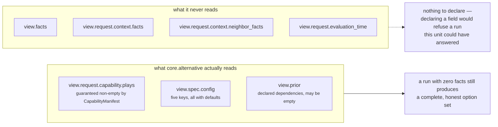
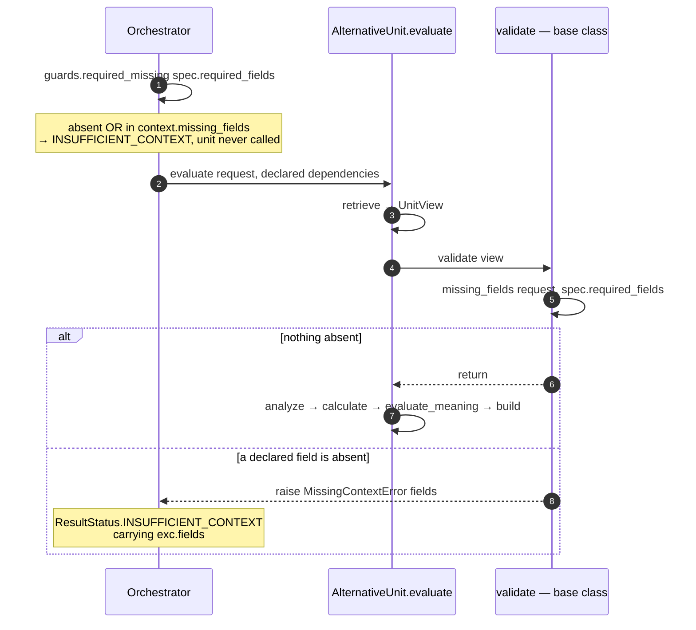

# 01 · Input and Validator — `core.alternative`

**Stages 1–2 of eight.** Stage 1 is fixed by the framework's template method; stage 2 is the base
class implementation, unchanged.

---

## 1 · What it is for

Before this unit reasons about anything it has to answer one question: *do I have enough to say
something true?* For most units that means checking that Layer 2 actually supplied the facts they
read. For this one it means almost nothing, and the reason is worth stating precisely: **the
Alternative Unit's primary input is not the snapshot at all — it is the capability manifest.**

---

## 2 · What exists

### 2.1 · Stage 1 · Input

The input is fixed by `unit.py:ReasoningUnit.evaluate` and cannot be varied by a subclass:

```python
def evaluate(self, request: ReasoningRequest,
             prior_results: Mapping[str, ReasonerResult]) -> ReasonerResult:
    spec = active_spec(request, self.unit_id)
    view = self.retrieve(request, spec, prior_results)
    self.validate(view)
    ...
```

| Argument | Type | What this unit actually uses from it |
|---|---|---|
| `request` | `ReasoningRequest` | **`request.capability.plays`** — the entire roster, via `_plays(view)`. Nothing else. Not `context.facts`, not `context.evidence`, not `evaluation_time`, not `trigger_kind` |
| `prior_results` | `Mapping[str, ReasonerResult]` | The **declared dependencies only**. `orchestrator.py` builds it as `{item: prior[item] for item in spec.dependencies if item in prior}` |

`active_spec(request, "core.alternative")` (`reasoners/common.py:13`) locates this unit's
`ReasonerSpec` inside the manifest, and raises before any stage runs if the capability does not
declare the unit:

```text
ValueError: capability does not declare reasoner core.alternative
```

That is a plan-construction fault, not a context fault, and the orchestrator records it as
`ResultStatus.FAILED` rather than `INSUFFICIENT_CONTEXT`.

### 2.2 · Stage 2 · Validator — the base class, unchanged

`AlternativeUnit` does **not** override `validate`. The inherited implementation is
`unit.py:ReasoningUnit.validate` (lines 179–188):

```python
def validate(self, view: UnitView) -> None:
    absent = missing_fields(view.request, view.spec.required_fields)
    if absent:
        raise MissingContextError(*absent)
```

and `reasoners/common.py:missing_fields` (lines 116–124):

```python
def missing_fields(request: ReasoningRequest, fields: tuple[str, ...]) -> tuple[str, ...]:
    missing = []
    for field in fields:
        if field.startswith("neighbor:"):
            if field.split(":", 1)[1] not in request.context.neighbor_facts:
                missing.append(field)
        elif field not in request.context.facts:
            missing.append(field)
    return tuple(sorted(missing))
```

### 2.3 · What `required_fields` this unit declares

**None — and it cannot declare any of its own.** `required_fields` is not a class attribute of the
unit; it lives on `ReasonerSpec`, which is authored per capability in Layer 3. The unit's own
`self._descriptor` (built in `ReasoningUnit.__init__`) carries the default `required_fields = ()`,
but that descriptor is only used for identity — `evaluate` reads the capability's spec instead.

The shipped capability authors nothing:

```python
# packs/capabilities/deal_cooling_v2.py:122
_spec("core.alternative", ("core.constraint", "core.cost")),
```

`_spec`'s signature defaults `required_fields: tuple[str, ...] = ()`, so
`view.spec.required_fields == ()`, `missing_fields` returns `()`, and `validate` is a no-op on every
shipped run.

---

## 3 · How it works

### 3.1 · Why an empty `required_fields` is correct here

The unit reads three things and none of them is a fact:



Every input the unit needs is guaranteed by a contract that is checked earlier and elsewhere:

| Input | Guaranteed by | If it were missing |
|---|---|---|
| At least one play | `contracts/reasoning.py:380` — `raise ValueError("capability requires at least one play")` | The manifest cannot be constructed at all |
| Unique play ids | `contracts/reasoning.py:390` — `raise ValueError("duplicate play in capability")` | Grouping and viability dicts would collide |
| Every play has a step | `contracts/reasoning.py:332` — `raise ValueError("a play requires at least one step")` | `_move_signature` would produce an empty tuple for many plays and collapse them all into one move |
| `impact_bp` and `success_probability_bp` in 0–10,000 | `contracts/reasoning.py:337-338` — `_bp(...)` | `_expected_value` could exceed the scale; `clamp_bp` would hide it |
| Prior results are `ReasonerResult`s | the orchestrator's own typing | — |

So the three constructor guarantees in `PlayDefinition` and `CapabilityManifest` are this unit's
real validator. Declaring a `required_field` would only make it **refuse runs it could have
answered**: a capability with no facts at all still has a roster, and reporting *"three moves are
available, nobody priced the silence"* is a truthful and useful answer.

### 3.2 · The one path to `INSUFFICIENT_CONTEXT`

A capability author *can* make this unit refuse, by declaring a required field on the spec. It is the
only mechanism, and it exists for a specific side effect covered in [02 · Retriever](02-Retriever.md)
— attaching evidence to the result.



Two definitions of *missing* coexist and the orchestrator's is stricter. `guards.py:required_missing`
treats a field as missing when it is absent **or** when Layer 2 explicitly listed it in
`context.missing_fields`; the unit's default validator via `common.py:missing_fields` checks presence
only. In the orchestrated path the stricter check runs first, so the unit's own validator is
effectively unreachable — it matters when the unit is called directly, which is exactly what the
test file does.

### 3.3 · What a refusal actually produces

`MissingContextError` is defined in `reason/protocols.py` and carries the field names. The
orchestrator converts it to a typed result rather than letting it escape:

```text
ResultStatus.INSUFFICIENT_CONTEXT
missing_fields = the sorted tuple from exc.fields
matched = None, metrics = {}, findings = (), evidence_ids = ()
```

`ReasonerResult.__post_init__` enforces that shape: *"non-completed reasoner results cannot carry
decision effects or evidence"*. A refusal cannot leave a partial option count behind.

---

## 4 · Examples and edge cases

### 4.1 · The default — no required fields, no refusal

```text
spec     ReasonerSpec("core.alternative", "1.0.0", dependencies=("core.constraint", "core.cost"))
         required_fields = ()
context  facts = {"deal.status": "open"}

missing_fields(request, ())  → ()
validate                     → returns, no exception
```

Every one of the 26 tests in `tests/test_unit_alternative_unit.py` runs this path. Not one of them
declares a required field, and not one asserts a `MissingContextError` — the validator is
**completely untested for this unit**, because there is nothing unit-specific to test.

### 4.2 · An author declares a field that is present

Re-derived live:

```text
spec     required_fields = ("deal.status",)
context  facts    = {"deal.status": "open"}
         evidence = (EvidenceRef(evidence_id="ev_status", field="deal.status",
                                 value="open", source_ref_id="crm_1"),)

validate       → passes
retrieve       → view.facts = {"deal.status": "open"}   (selected, then never read)
                 view.evidence_ids = ("ev_status",)
build          → result.evidence_ids = ("ev_status",)   ← the reason an author would do this
```

The unit's own findings still carry `evidence_ids = ()`; only the result-level tuple is populated.
See [02 · Retriever](02-Retriever.md) §3.3.

### 4.3 · An author declares a field that is absent

```text
spec     required_fields = ("deal.owner",)
context  facts = {"deal.status": "open"}

missing_fields → ("deal.owner",)
validate       → raise MissingContextError("deal.owner")
                 exc.fields == ("deal.owner",)
orchestrator   → ResultStatus.INSUFFICIENT_CONTEXT, missing_fields = ("deal.owner",)
```

Verified against the live unit. Note the cost of this: the capability now gets **no option set at
all** because one unrelated fact was absent. That is why an empty `required_fields` is the right
default, and why the evidence-attachment lever in §4.2 is a trade rather than a free win.

### 4.4 · A neighbour-scoped required field

```text
spec     required_fields = ("neighbor:contact.verified_recipient",)
```

`missing_fields` honours the `neighbor:` prefix and checks `request.context.neighbor_facts`. But
`retrieve` filters `neighbor:` fields out of `wanted`, so the fact is validated and then **never
selected** — and since this unit reads no facts at all, the only effect of declaring one is the
refusal. This is the framework-wide asymmetry recorded in
[Part 2 §3.1](../../README.md#31--the-retriever-does-not-fetch--it-selects), not something specific
to this unit.

### 4.5 · The boundary cases the contract absorbs

| Input | What happens | Where it is caught |
|---|---|---|
| Capability declares zero plays | `ValueError: capability requires at least one play` | `CapabilityManifest.__post_init__`, at manifest construction — the unit never sees it |
| Two plays share a `play_id` | `ValueError: duplicate play in capability` | same |
| A play declares no steps | `ValueError: a play requires at least one step` | `PlayDefinition.__post_init__` |
| `impact_bp = 12_000` | rejected as not basis points | `PlayDefinition.__post_init__` |
| Capability does not declare `core.alternative` | `ValueError: capability does not declare reasoner core.alternative` | `common.py:active_spec`, before stage 3 |
| `prior_results` is `{}` | **valid** — the unit reports `viability_unscreened` and no baseline | `_rulings` returns `({}, frozenset())`; `_prior_bp` returns `None` for every source |
| A dependency `FAILED` | treated as absent — `_rulings` skips non-`COMPLETED` results, `prior_metric` returns the default | `alternative_unit.py:115`, `unit.py:130-132` |

The last two are the ones that make this unit unusually robust: it has no input whose absence stops
it, only inputs whose absence changes what it can honestly claim.

---

| ← | → |
|---|---|
| [README](README.md) | [02 · Retriever](02-Retriever.md) |
