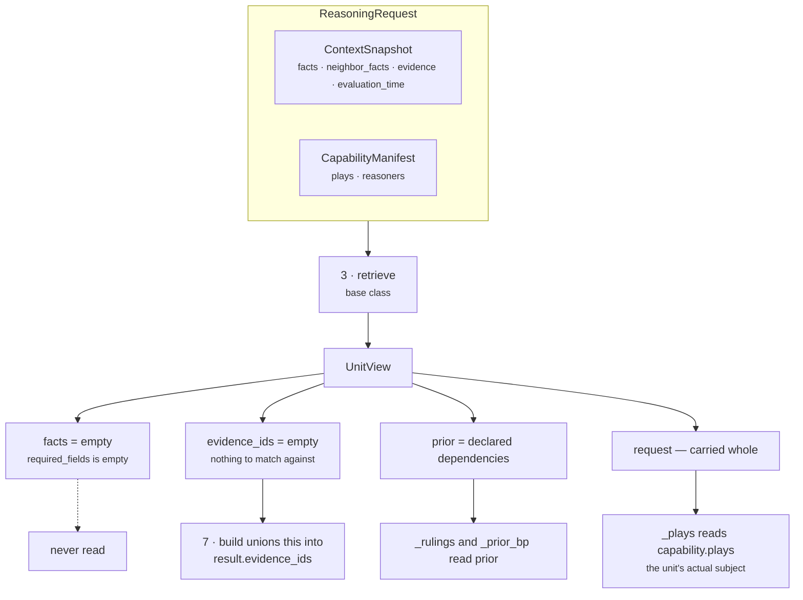

# 02 · Retriever — `core.alternative`

**Stage 3 of eight.** The base class implementation, unchanged — and for this unit it selects
nothing.

---

## 1 · What it is for

The Retriever's job is to answer *what was this unit allowed to look at?* in one place, so a reviewer
never has to read a unit's body to find out. For `core.alternative` the honest answer is unusual:
**the retrieved window is empty, and the unit does not need it.** Its subject is the capability's
option roster, which travels on the request itself rather than in the frozen snapshot.

That is worth documenting rather than skipping, because an empty `UnitView.facts` has one real
consequence downstream — the unit cites no evidence.

---

## 2 · What exists

`AlternativeUnit` does **not** override `retrieve`. The inherited implementation is
`unit.py:ReasoningUnit.retrieve` (lines 190–200):

```python
def retrieve(self, request: ReasoningRequest, spec: ReasonerSpec,
             prior: Mapping[str, ReasonerResult]) -> UnitView:
    wanted = tuple(field for field in spec.required_fields
                   if not field.startswith("neighbor:"))
    facts = {name: request.context.facts[name]
             for name in wanted if name in request.context.facts}
    evidence = tuple(sorted(item.evidence_id for item in request.context.evidence
                            if item.field in facts))
    return UnitView(request=request, spec=spec, prior=prior,
                    facts=MappingProxyType(facts), evidence_ids=evidence)
```

Three things happen and none of them is IO. *"The Retriever does not fetch"* — retrieval already
happened when Layer 2 froze the `ContextSnapshot`, and a unit that fetched anything would be reading
state the decision was never hashed against.

### 2.1 · What lands in the `UnitView` on a shipped run

`sales.deal_cooling_full` declares `core.alternative` with `required_fields = ()`. Therefore:

| `UnitView` field | Value on every shipped run | Read by this unit? |
|---|---|---|
| `request` | the full `ReasoningRequest` | **yes** — `_plays` reads `request.capability.plays` |
| `spec` | `ReasonerSpec("core.alternative", "1.0.0", dependencies=("core.constraint", "core.cost"))` | **yes** — via `view.config`, five keys |
| `prior` | `{"core.constraint": ..., "core.cost": ...}` | **yes** — `_rulings` and `_prior_bp` |
| `facts` | `{}` — empty | **no** |
| `evidence_ids` | `()` — empty | not by the unit; consumed by `build` |

`wanted` is `()`, so the fact comprehension produces `{}`, so the evidence filter `item.field in
facts` matches nothing regardless of how rich `context.evidence` is.

### 2.2 · Which slice of the snapshot it therefore selects

**None of it.** No `core.alternative` code path touches `view.facts`, `request.context.facts`,
`request.context.neighbor_facts`, `request.context.evidence`, or `request.evaluation_time`. Verified
by reading all 416 lines: the only `view.request` access in the module is
`view.request.capability.plays`, at `alternative_unit.py:94`.



---

## 3 · How it works

### 3.1 · Why the base implementation is the right one

There is nothing to override. A custom `retrieve` would exist to do one of two things — select a
different slice, or shape it — and this unit needs neither:

- **Nothing to select.** The roster is not in the snapshot. `CapabilityManifest.plays` is versioned
  Layer 3 content that travels with the request and is hashed into the request id, so reading it is
  as replayable as reading a fact.
- **Nothing to shape.** `_plays(view)` does the one piece of shaping the unit wants — sorting the
  roster by `play_id` — and it does it at the point of use, inside each plugin, so both roster
  plugins provably see the same order.

Three units in the roster do override `retrieve`; this is not one of them, and the reason is
structural rather than incidental.

### 3.2 · The determinism the sort provides

`_plays` (`alternative_unit.py:92-94`):

```python
def _plays(view: UnitView) -> tuple[PlayDefinition, ...]:
    """The declared roster in one total order — never manifest order, never set order."""
    return tuple(sorted(view.request.capability.plays, key=lambda play: play.play_id))
```

`CapabilityManifest.plays` is a tuple and preserves authoring order. That order is a property of who
edited the file last, and it reaches two places where it would be visible: the assignment of group
indices in `MoveDistinctnessPlugin`, and the emission order of observations and findings, which
reaches the `semantic_hash`.

`test_the_option_count_does_not_depend_on_the_order_plays_were_authored` pins the metrics half of
this. Verified: `(alpha, zeta)` and `(zeta, alpha)` produce identical metric mappings.

### 3.3 · The one lever an author has — and what it costs

Because `build` unions `view.evidence_ids` into the result, declaring a `required_field` is the
**only** way to make `core.alternative` cite anything. Re-derived live:

```text
spec     required_fields = ("deal.status",)
context  facts    = {"deal.status": "open"}
         evidence = (EvidenceRef(evidence_id="ev_status", field="deal.status",
                                 value="open", source_ref_id="crm_1"),)

retrieve → view.facts        = {"deal.status": "open"}
           view.evidence_ids = ("ev_status",)
build    → result.evidence_ids = ("ev_status",)
           finding.evidence_ids = ()  for every one of the findings
```

versus the default:

```text
spec     required_fields = ()
build    → result.evidence_ids = ()
```

The trade is stated in [01 · Input and Validator](01-Input-and-Validator.md) §4.3: the same
declaration makes the unit refuse the whole run when that fact is absent. An author buying a citation
is also buying an `INSUFFICIENT_CONTEXT` failure mode for a unit that would otherwise always answer.

**Why this matters.** `validation_unit.py:_asserts_a_claim` counts a result as a claim when
`matched is True` **or** any finding is not explicitly negative. `core.alternative` almost always
satisfies that — its viability findings carry `matched=True` for every surviving play. With
`evidence_ids == ()` the claim is ungrounded, and `EvidenceSufficiencyPlugin` would emit
`claim_without_evidence` naming `core.alternative`. It does not happen today only because
`core.validation` is declared with four dependencies — `core.risk`, `core.opportunity`, `core.impact`,
`core.confidence` — and `core.alternative` is not among them. This is a latent interaction, not a
current defect, and it is recorded as defect 8 in the [README](README.md#6--known-defects-and-compromises).

### 3.4 · The framework asymmetries this unit inherits

Two known inconsistencies live in the base `retrieve` and apply here in principle, though neither can
bite while `required_fields` is empty:

| Inconsistency | Effect on `core.alternative` |
|---|---|
| `neighbor:`-prefixed fields are **validated** by `missing_fields` but filtered out of `wanted`, so they never reach `view.facts` and their evidence is never selected | An author declaring `neighbor:contact.verified_recipient` gets the refusal but no citation — the lever in §3.3 silently does not work for neighbour fields |
| The evidence filter matches on `item.field in facts` and ignores `EvidenceRef.context_scope` | A neighbour-scoped evidence row whose field name collides with a selected root fact would be attached as though observed. No shipped capability has a colliding name |

Both are documented in [Part 2 §3.1](../../README.md#31--the-retriever-does-not-fetch--it-selects).

---

## 4 · Examples and edge cases

### 4.1 · The shipped run

```text
spec.required_fields = ()
context.facts        = {"deal.status": "open", "deal.value": 500000, "deal.last_inbound": "..."}
context.evidence     = 6 EvidenceRefs

wanted   = ()
facts    = {}
evidence = ()

UnitView(facts={}, evidence_ids=())
```

Six evidence rows are in the snapshot and none is selected, because the unit declared no interest in
any field. That is the retriever working correctly: *"a unit's `evidence_ids` are exactly the ids of
the fields it was allowed to look at"* — this unit was allowed to look at none.

### 4.2 · A rich snapshot changes nothing

```text
context.facts = 40 fields · context.evidence = 30 rows
spec.required_fields = ()

→ view.facts = {} · view.evidence_ids = ()
→ every metric identical to the empty-snapshot run
```

`test_the_same_situation_reasons_identically_twice` and
`test_the_option_count_does_not_depend_on_the_order_plays_were_authored` both rely on this: the unit's
output is a pure function of `capability.plays`, `spec.config` and `prior`.

### 4.3 · Edge cases

| Input | Result | Note |
|---|---|---|
| `required_fields = ()` (the shipped case) | `facts = {}`, `evidence_ids = ()` | the dict and evidence comprehensions both produce empty |
| `required_fields = ("deal.status",)`, fact present | `facts = {"deal.status": "open"}` — selected, never read | only the evidence side has any effect |
| `required_fields = ("deal.status",)`, fact absent | `retrieve` succeeds with `facts = {}`; `validate` then raises | retrieve runs **before** validate, and selection over an immutable mapping cannot fail |
| `required_fields = ("neighbor:contact.verified",)` | filtered out of `wanted`; `facts = {}`, `evidence_ids = ()` | validated, never selected — §3.4 |
| Field present, no `EvidenceRef` for it | `facts` populated, `evidence_ids = ()` | the fact is real; the citation is absent |
| Two `EvidenceRef`s on one selected field | both ids, sorted | `sorted(...)` inside the comprehension |
| `context.evidence = ()` | `evidence_ids = ()` regardless of `required_fields` | |

---

| ← | → |
|---|---|
| [01 · Input and Validator](01-Input-and-Validator.md) | [03 · Analyzer](03-Analyzer.md) |
