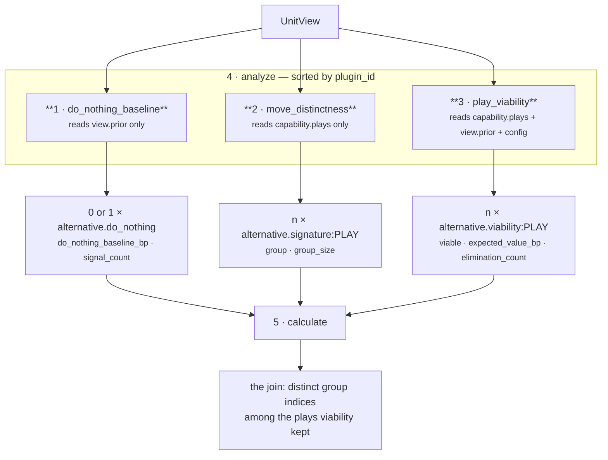

# 03 · Analyzer — `core.alternative`

**Stage 4 of eight.** The base class implementation, unchanged; the IP lives in the three plugins it
runs.

---

## 1 · What it is for

The Analyzer is the seam where an option set stops being one opaque judgement and becomes three
separable claims. The unit's module docstring names them and, crucially, names them as *separable*:

> *"Three separable claims, one per plugin: **Viability** … **Distinctness** … **The do-nothing
> baseline** …"*

That separation is what lets each be argued with alone. *"Is this play available?"* is a question
about policy and expectation. *"Is this really a different move?"* is a question about the text of
the plays. *"What does waiting cost?"* is a question about the situation and has nothing to do with
the roster at all. Folding them into one `count_alternatives()` would produce a number nobody could
challenge in parts.

---

## 2 · What exists

### 2.1 · The stage, unchanged

`AlternativeUnit` does **not** override `analyze`. The inherited implementation is
`unit.py:ReasoningUnit.analyze` (lines 202–211):

```python
def analyze(self, view: UnitView) -> tuple[Observation, ...]:
    observations: list[Observation] = []
    for plugin in sorted(self.plugins, key=lambda item: item.plugin_id):
        observations.extend(plugin.contribute(view))
    return tuple(observations)
```

No unit in the roster overrides it. Three things it guarantees for free:

- **A total order over plugins**, by `plugin_id`, so observation order is a property of the unit's
  composition rather than of the class body.
- **Concatenation, not merging.** A plugin returning several observations contributes all of them in
  its own order; a plugin returning `()` contributes nothing, and that silence is preserved.
- **No cross-talk.** Each plugin receives the same `UnitView` and nothing else. A plugin cannot see
  another plugin's observations, so the three claims cannot influence each other. That is what makes
  them individually testable — and `tests/test_unit_alternative_unit.py` tests all three directly,
  calling `PlayViabilityPlugin().contribute(view)` with no unit around it.

### 2.2 · Registration and execution order

```python
# alternative_unit.py:306
plugins = (DoNothingBaselinePlugin(), MoveDistinctnessPlugin(), PlayViabilityPlugin())
```

Registration order and execution order coincide here by accident of the alphabet, not by design.
`ReasoningUnit.__init__` also rejects duplicate `plugin_id`s across the tuple —
`test_plugin_ids_are_unique_within_a_unit` in the roster suite enforces it across all 17 units,
because a duplicate would make the sort ambiguous and every hash below it ambiguous with it.

| Order | `plugin_id` | Observations emitted | Can be silent? |
|---|---|---|---|
| 1 | `do_nothing_baseline` | **0 or 1** — one roster-level claim | **yes** — the only silent plugin |
| 2 | `move_distinctness` | exactly `len(plays)` — one per play | no (roster is non-empty by contract) |
| 3 | `play_viability` | exactly `len(plays)` — one per play | no |

For a five-play roster with a priced baseline, `analyze` returns **11** observations.

### 2.3 · The observation kinds

`Observation` has no play field — the framework gives plugins no way to name a candidate,
deliberately, so that a plugin cannot become a decision authority by attaching itself to a play.
Where a claim is about one play its identity travels in `kind` after a colon:

```python
_VIABILITY_PREFIX = "alternative.viability:"    # alternative_unit.py:60
_SIGNATURE_PREFIX = "alternative.signature:"    # alternative_unit.py:61
_BASELINE_KIND    = "alternative.do_nothing"    # alternative_unit.py:62
```

and `_suffix` splits it back out with `maxsplit=1`, so a play id containing a colon still round-trips:

```python
def _suffix(kind: str) -> str:
    return kind.split(":", 1)[1] if ":" in kind else ""
```

The same string becomes the `finding_id` in stage 6, which is what makes the audit trail say *which
option* each row is about.

---

## 3 · How the three claims compose



### 3.1 · Two plugins share a subject; none shares a computation

`move_distinctness` and `play_viability` both iterate `_plays(view)` and both key their output by
`play_id`. That is the **only** thing they share, and they share it through a module helper rather
than through each other, so the two cannot drift about what the roster is or what order it is in.

Neither reads the other's result. The join happens one stage later, in `calculate`:

```python
viable_ids = sorted(play_id for play_id, item in viability.items()
                    if int(item.metrics["viable"]) == 1)
distinct = {groups.get(play_id, -1 - index) for index, play_id in enumerate(viable_ids)}
```

Grouping is computed over the **whole** roster and then filtered to the viable plays. The ordering
matters: computing groups only over survivors would make a group index depend on what was eliminated,
so the same two plays could land in different groups on two runs. Computing over everything and
filtering afterwards keeps a group index a stable property of the capability's content.

The visible consequence: a duplicate that was eliminated does not count as a duplicate. Verified —
two identical plays, one eliminated upstream:

```text
declared_count 2 · viable_count 1 · distinct_count 1 · duplicate_count 0
reason codes include BOTH plays_share_one_move (from the observation)
               AND single_course_of_action (from the metrics)
```

`plays_share_one_move` is still on the record because the observation said so; `duplicate_count` is
0 because only one of the pair survived to be duplicated. Both statements are true and they mean
different things.

### 3.2 · The third plugin is about something else entirely

`do_nothing_baseline` never looks at a play. It reads up to four prior metrics and produces one
number. It is in this unit rather than in `core.cost` because the null option is a member of the
**option set**, and the option set is this unit's subject — pricing it anywhere else would leave the
set incomplete.

Its independence has a consequence worth stating: **the baseline survives a roster with nothing
viable.** When every play is eliminated, `viable_count = 0`, `distinct_count = 0`, and the whole
answer is the one remaining option and its price. Pinned by
`test_an_option_set_with_nothing_viable_still_reports_the_null_option`.

### 3.3 · Why silence is only available to one of the three

The framework's rule is that returning `()` means *this axis has nothing to contribute*, which is
materially different from contributing a zero. Applied here:

| Plugin | Silence available? | Why |
|---|---|---|
| `play_viability` | **no** — every play gets an observation | A play that was eliminated is a *finding*, not an absence. Reporting only survivors would hide the screening, and *"an option set is only auditable if the things that were ruled out are visible alongside the things that were not."* |
| `move_distinctness` | **no** | Every play belongs to exactly one group, including a group of one. There is no such thing as an ungrouped play |
| `do_nothing_baseline` | **yes** | *"An unknown cost of waiting must stay unknown: reporting it as zero would tell a human that doing nothing is free."* |

Both roster plugins do carry an `if not plays: return ()` guard, and neither branch is reachable —
`CapabilityManifest` refuses a manifest with no plays. See
[README defect 6](README.md#6--known-defects-and-compromises).

### 3.4 · What the plugins may not do, and do not

`Observation.__post_init__` enforces integer-only metrics — rejecting `bool` explicitly, because
`isinstance(True, int)` is `True` in Python — and deduplicates and sorts `evidence_ids` and
`reason_codes` at construction. All three plugins here emit only integer metrics; the `viable` metric
is `0`/`1` rather than a boolean precisely because of that rule.

No plugin in this unit attaches `evidence_ids` to any observation. That is why every finding this
unit emits carries an empty citation tuple — see [06 · Builder and Metrics](06-Builder-and-Metrics.md).

---

## 4 · A full analyze pass, with real numbers

The canonical five-play scenario, re-derived by running `AlternativeUnit().analyze(view)` directly.
Note the order: all of plugin 1, then all of plugin 2, then all of plugin 3.

```text
  do_nothing_baseline   alternative.do_nothing
      {do_nothing_baseline_bp: 7500, signal_count: 3}
      (exposure_compounds, headroom_lapses, inaction_has_a_price, momentum_decays)

  move_distinctness     alternative.signature:accept_partial_scope
      {group: 0, group_size: 1}   (play_is_a_distinct_move,)
  move_distinctness     alternative.signature:auto_send_reminder
      {group: 1, group_size: 1}   (play_is_a_distinct_move,)
  move_distinctness     alternative.signature:escalate_to_sponsor
      {group: 2, group_size: 1}   (play_is_a_distinct_move,)
  move_distinctness     alternative.signature:reply_to_buyer
      {group: 3, group_size: 2}   (plays_share_one_move,)
  move_distinctness     alternative.signature:reply_to_buyer_v2
      {group: 3, group_size: 2}   (plays_share_one_move,)

  play_viability        alternative.viability:accept_partial_scope
      {viable: 1, expected_value_bp: 3000, elimination_count: 0}  (option_available,)
  play_viability        alternative.viability:auto_send_reminder
      {viable: 0, expected_value_bp: 4200, elimination_count: 1}
      (option_eliminated_upstream, read_only_policy)
  play_viability        alternative.viability:escalate_to_sponsor
      {viable: 1, expected_value_bp: 3500, elimination_count: 0}  (option_available,)
  play_viability        alternative.viability:reply_to_buyer
      {viable: 1, expected_value_bp: 4200, elimination_count: 0}  (option_available,)
  play_viability        alternative.viability:reply_to_buyer_v2
      {viable: 1, expected_value_bp: 4200, elimination_count: 0}  (option_available,)
```

Eleven observations, three claims, no shared state. Two details in that output are load-bearing:

**`auto_send_reminder` still reports `expected_value_bp: 4200`.** It was eliminated, but the plugin
still computed and published what it was worth. A reader can see that a genuinely valuable option was
removed on policy rather than because it was weak — which is exactly the argument a human might want
to have with the policy.

**Group index 1 is assigned and then never counted.** `auto_send_reminder` gets its own group because
grouping runs over the whole roster; `calculate` then filters it out. The group indices that survive
into `distinct` are `{0, 2, 3}` — three moves.

---

## 5 · Edge cases at the stage boundary

| Situation | `analyze` returns | Note |
|---|---|---|
| One play, no prior | 2 observations: 1 signature + 1 viability | no baseline — nothing priced the silence |
| One play, `core.cost` completed | 3 observations | the baseline is roster-independent |
| Five plays, all eliminated | 11 observations | every elimination is on the record |
| A plugin raises `ValueError` on bad config | **the whole stage raises** | propagates through `evaluate` to the orchestrator → `ResultStatus.FAILED` |
| A prior result is `FAILED` | included in `view.prior`, skipped by `_rulings` and by `prior_metric` | *"a unit that crashed has no opinion"* |
| A prior result is `COMPLETED` with no checks | contributes nothing to `eliminated`, nothing to `ruled` | so `viability_unscreened` still fires — see [03c](03c-plugin-play_viability.md) §4 |

---

| ← | → |
|---|---|
| [02 · Retriever](02-Retriever.md) | [03a · `do_nothing_baseline`](03a-plugin-do_nothing_baseline.md) |
