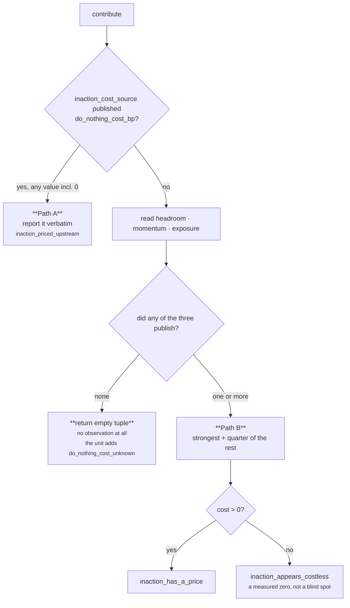

# Plugin · `do_nothing_baseline`

**Class:** `alternative_unit.py:DoNothingBaselinePlugin` (lines 238–290)
**`plugin_id`:** `do_nothing_baseline` — **first** in execution order
**`Observation.kind`:** `alternative.do_nothing` (constant `_BASELINE_KIND`, line 62)
**Publishes into:** `do_nothing_baseline_bp` — the unit's only basis-point metric
**The only plugin in this unit that can stay silent.**

---

## 1 · The claim

*What the null option costs — the one alternative that is always available.*

The argument, from the class docstring:

> *"Doing nothing is never off the table, so an option set that does not price it is incomplete. The
> price is not this unit's to invent: every input is a number another unit already published."*

Pricing the silence is what turns *"should we act?"* into a comparison. Without it a card offers
three moves against an unspecified nothing, and a reader has no way to judge whether any of them is
worth the effort.

The plugin **derives** nothing about the world. It reads up to four metrics that other units
published and either forwards one of them or composes three of them. No fact, no clock, no play.

---

## 2 · The code

```python
class DoNothingBaselinePlugin:
    plugin_id = "do_nothing_baseline"

    def contribute(self, view: UnitView) -> tuple[Observation, ...]:
        priced = _prior_bp(view, "inaction_cost_source", "core.cost", "do_nothing_cost_bp")
        if priced is not None:
            return (Observation(
                plugin_id=self.plugin_id,
                kind=_BASELINE_KIND,
                metrics={"do_nothing_baseline_bp": priced, "signal_count": 1},
                reason_codes=("inaction_priced_upstream",),
            ),)
        signals: list[tuple[int, str]] = []
        for key, default_unit, metric, code in (
            ("headroom_source", "core.opportunity", "opportunity_bp", "headroom_lapses"),
            ("momentum_source", "core.temporal", "drop_bp", "momentum_decays"),
            ("exposure_source", "core.risk", "risk_bp", "exposure_compounds"),
        ):
            value = _prior_bp(view, key, default_unit, metric)
            if value is not None:
                signals.append((value, code))
        if not signals:
            return ()
        ordered = sorted(signals, key=lambda item: (-item[0], item[1]))
        cost = clamp_bp(ordered[0][0] + divide_half_up(sum(v for v, _ in ordered[1:]), 4))
        codes = [code for value, code in ordered if value > 0]
        codes.append("inaction_has_a_price" if cost > 0 else "inaction_appears_costless")
        return (Observation(
            plugin_id=self.plugin_id,
            kind=_BASELINE_KIND,
            metrics={"do_nothing_baseline_bp": cost, "signal_count": len(ordered)},
            reason_codes=tuple(codes),
        ),)
```

### 2.1 · The reader it depends on

```python
# alternative_unit.py:86-89
def _prior_bp(view: UnitView, key: str, default_unit: str, metric: str) -> int | None:
    """One published signal, or None when the unit that owns it did not complete."""
    value = view.prior_metric(_config_id(view, key, default_unit), metric, _ABSENT)
    return None if value == _ABSENT else clamp_bp(value)
```

with `_ABSENT = -1` and the framework's reader underneath:

```python
# unit.py:128-134
def prior_metric(self, reasoner_id: str, name: str, default: int = 0) -> int:
    result = self.prior.get(reasoner_id)
    if result is None or result.status != ResultStatus.COMPLETED:
        return default
    value = result.metrics.get(name, default)
    return default if isinstance(value, bool) or not isinstance(value, int) else value
```

`-1` is chosen as the sentinel because *"basis points are 0..10000 by law, so a negative sentinel can
never collide with a published value. It is how a plugin tells 'the unit measured zero' apart from
'the unit never ran' — the difference between a priced silence and a blind spot."*

That law holds for these four metrics specifically because all of them end in `_bp` and
`unit.py:ReasoningUnit.build` clamps every `_bp` metric through `clamp_bp` before it leaves its
publishing unit. Four ways `_prior_bp` returns `None`:

| Condition | Where |
|---|---|
| The named unit is not in `view.prior` — usually because the capability did not declare it as a dependency | `prior.get(...) is None` |
| The named unit did not complete — `FAILED`, `INSUFFICIENT_CONTEXT`, `SKIPPED` | `status != COMPLETED` |
| The unit completed but published no metric of that name | `metrics.get(name, -1)` |
| The metric is present but not an `int`, or is a `bool` | the last line of `prior_metric` |

### 2.2 · Config keys

| Key | Type | Default | Validated by | Effect |
|---|---|---|---|---|
| `inaction_cost_source` | non-blank str | `"core.cost"` | `_config_id` | which unit's `do_nothing_cost_bp` wins outright |
| `headroom_source` | non-blank str | `"core.opportunity"` | `_config_id` | which unit's `opportunity_bp` reads as lapsing headroom |
| `momentum_source` | non-blank str | `"core.temporal"` | `_config_id` | which unit's `drop_bp` reads as decaying momentum |
| `exposure_source` | non-blank str | `"core.risk"` | `_config_id` | which unit's `risk_bp` reads as compounding exposure |

```python
def _config_id(view: UnitView, key: str, default: str) -> str:
    """Which unit supplies a signal, so a capability can appoint its own authority for it."""
    value = view.config.get(key, default)
    if not isinstance(value, str) or not value.strip():
        raise ValueError(f"{key} must name a reasoning unit")
    return value.strip()
```

The **metric names are hardcoded**. A substitute unit must publish under the same name —
`test_a_capability_may_appoint_its_own_inaction_authority` points `headroom_source` at
`sales.pipeline_decay`, which publishes `opportunity_bp = 8,000`, and the plugin reads it.

`_config_id` is called once per source per run, so a malformed value fails on the first run of the
capability rather than lying dormant. Verified: `{"headroom_source": "   "}` raises
`ValueError: headroom_source must name a reasoning unit`.

---

## 3 · The arithmetic

### 3.1 · Path A — a cost unit is deployed

```text
do_nothing_baseline_bp = clamp_bp( prior[inaction_cost_source].metrics["do_nothing_cost_bp"] )
signal_count           = 1
reason_codes           = ("inaction_priced_upstream",)
```

Verbatim, with no composition. The argument:

> *"Where a cost unit is deployed it owns the price of inaction outright, and this plugin reports
> that figure rather than deriving a second one that would disagree with it in the same card."*

**This path wins on `is not None`, not on truthiness.** A published `0` from `core.cost` is a
number, so it short-circuits the three fallback signals entirely. That is a defect, and it is the
unit's most consequential one — §5.3.

### 3.2 · Path B — compose the three views of one silence

```text
ordered = sort( (value, code) for each source that published,  key = (-value, code) )

do_nothing_baseline_bp = clamp_bp( ordered[0].value + half_up( Σ ordered[1:].value , 4 ) )
signal_count           = len(ordered)
reason_codes           = every code whose value > 0
                       + "inaction_has_a_price"      if cost > 0
                       + "inaction_appears_costless" if cost == 0
```

with

```python
def divide_half_up(numerator: int, denominator: int) -> int:
    if denominator <= 0:
        raise ValueError("denominator must be positive")
    if numerator >= 0:
        return (numerator + denominator // 2) // denominator
    return -((-numerator + denominator // 2) // denominator)

def clamp_bp(value: int) -> int:
    return min(10_000, max(0, int(value)))
```

**Why max-plus-a-quarter and not a sum.** The three readings are *"three views of one silence rather
than three separate silences"*. A deal going quiet shows up as lapsing headroom, decaying momentum
**and** compounding exposure — the same event seen three ways. Summing them would let one quiet week
report 18,000bp and clamp to a maximum-price silence out of one underlying fact. Averaging would let
a source that happened to read low drag down a decisive one. The shape used — strongest reading
leads, the rest add a bounded lift — is the same one `core.opportunity` and `core.cost` use for
corroboration, so the layer is consistent about what corroboration is worth.

**Why the sort key is `(-value, code)`.** *"A total order, so the leading signal never depends on
which unit happened to be scheduled first."* Descending by value puts the strongest reading first;
the code name breaks ties alphabetically, so `exposure_compounds < headroom_lapses <
momentum_decays`. Since the lift sums the tail, a tie changes which code *leads* but never the
arithmetic.

**Why zero-valued codes are dropped but still counted.** `codes` filters on `value > 0` while
`signal_count` counts everything in `ordered`. So a source that published `0` contributes to the
count — *we looked* — but does not claim `headroom_lapses` when no headroom is lapsing.

### 3.3 · The two silences, kept apart



The distinction between the two bottom-left leaves is the whole point of the plugin:

> *"A measured zero is a real finding and must not read like a blind spot: the signals were
> published, they simply said the silence costs nothing."*

and, for the silent branch:

> *"An unknown cost of waiting must stay unknown: reporting it as zero would tell a human that doing
> nothing is free, which is the single most expensive thing this unit could get wrong."*

The plugin honours that. The unit's `calculate` then publishes `do_nothing_baseline_bp = 0` anyway —
see [04 · Calculator](04-Calculator.md) §5 and [README defect 2](README.md#6--known-defects-and-compromises).

---

## 4 · Worked examples

### 4.1 · Path B, the canonical composition

Pinned by `test_the_strongest_lapsing_signal_leads_and_the_rest_corroborate`.

```text
prior   core.opportunity  COMPLETED  opportunity_bp 6000
        core.temporal     COMPLETED  drop_bp        4000
        core.risk         COMPLETED  risk_bp        2000
        (core.cost absent)

priced  = _prior_bp("inaction_cost_source" → "core.cost", "do_nothing_cost_bp")
        = prior_metric("core.cost", ..., -1) = -1  → None

signals = [(6000, "headroom_lapses"), (4000, "momentum_decays"), (2000, "exposure_compounds")]
ordered =  sorted by (-value, code)
        = [(6000, "headroom_lapses"), (4000, "momentum_decays"), (2000, "exposure_compounds")]

tail    = 4000 + 2000 = 6000
lift    = divide_half_up(6000, 4) = (6000 + 2) // 4 = 6002 // 4 = 1500
cost    = clamp_bp(6000 + 1500) = 7500

codes   = ["headroom_lapses", "momentum_decays", "exposure_compounds"]   # all > 0
        + ["inaction_has_a_price"]                                       # 7500 > 0

Observation(plugin_id="do_nothing_baseline", kind="alternative.do_nothing",
            metrics={"do_nothing_baseline_bp": 7500, "signal_count": 3},
            evidence_ids=(),
            reason_codes=("exposure_compounds", "headroom_lapses",
                          "inaction_has_a_price", "momentum_decays"))
```

`reason_codes` come out alphabetically because `Observation.__post_init__` sorts them — the
composition order in `codes` is lost by construction, which is fine because the leading signal is
already reflected in the number.

`7,500bp` means 0.75: standing still costs three quarters of the scale.

### 4.2 · Path A, a deployed cost unit wins

Pinned by `test_a_deployed_cost_unit_owns_the_price_of_inaction`.

```text
prior   core.cost         COMPLETED  do_nothing_cost_bp 6400
        core.opportunity  COMPLETED  opportunity_bp     9000

priced  = clamp_bp(6400) = 6400          ← not None, so the three signals are never read

Observation(metrics={"do_nothing_baseline_bp": 6400, "signal_count": 1},
            reason_codes=("inaction_priced_upstream",))
```

`core.opportunity`'s 9,000bp is discarded on purpose. Two numbers for the same silence on one card is
a contradiction; the deferral is to *"the declared authority"*. `signal_count = 1` says so honestly —
one signal was used, not three.

### 4.3 · Complete silence

Pinned by `test_an_unpriced_silence_stays_unpriced`.

```text
prior   {}                                       # nothing ran, or nothing was declared

priced  → None
signals → []                                     # all three _prior_bp calls return None

return ()                                        # NO observation
```

The unit then adds `do_nothing_cost_unknown` in `evaluate_meaning`, because no observation carries
`_BASELINE_KIND`. A consumer reading reason codes is told; a consumer reading only
`do_nothing_baseline_bp` sees `0` and is misled.

### 4.4 · A measured zero

Pinned by `test_a_measured_zero_is_not_the_same_as_an_unmeasured_one`.

```text
prior   core.opportunity  COMPLETED  opportunity_bp 0

signals = [(0, "headroom_lapses")]
ordered = [(0, "headroom_lapses")]
tail    = 0                                      # ordered[1:] is empty, sum() is 0
lift    = divide_half_up(0, 4) = 0
cost    = clamp_bp(0 + 0) = 0

codes   = []                                     # no value > 0
        + ["inaction_appears_costless"]           # cost == 0

metrics = {"do_nothing_baseline_bp": 0, "signal_count": 1}
codes   = ("inaction_appears_costless",)
```

`headroom_lapses` is deliberately absent: nothing is lapsing. `signal_count = 1` and
`inaction_appears_costless` together say *we measured, and waiting is free* — which is a completely
different statement from §4.3's silence, even though both report `0`.

### 4.5 · A partial zero

Not pinned by any test. Verified live:

```text
prior   core.opportunity  opportunity_bp 0
        core.temporal     drop_bp        4000

signals = [(0, "headroom_lapses"), (4000, "momentum_decays")]
ordered = [(4000, "momentum_decays"), (0, "headroom_lapses")]        # -4000 < 0
tail    = 0
cost    = clamp_bp(4000 + divide_half_up(0, 4)) = 4000

codes   = ["momentum_decays"]                    # headroom_lapses dropped, value is 0
        + ["inaction_has_a_price"]

metrics = {"do_nothing_baseline_bp": 4000, "signal_count": 2}
```

`signal_count = 2` with only one code: two sources reported, one of them found nothing. That pair of
numbers is the honest summary and it cannot be reconstructed from the codes alone.

### 4.6 · Saturation

Verified live:

```text
prior   core.opportunity 9000 · core.temporal 9000 · core.risk 9000

ordered = [(9000, "exposure_compounds"), (9000, "headroom_lapses"), (9000, "momentum_decays")]
          # all equal → tie broken alphabetically by code
lift    = divide_half_up(18000, 4) = (18000 + 2) // 4 = 4500
cost    = clamp_bp(9000 + 4500) = clamp_bp(13500) = 10000

metrics = {"do_nothing_baseline_bp": 10000, "signal_count": 3}
```

`clamp_bp` is what saturates. Three strong readings of one silence reach the top of the scale, which
is the correct claim: waiting is maximally expensive for attention purposes.

### 4.7 · Rounding at the bottom of the scale

```text
prior   opportunity 1 · drop 1 · risk 1

lift = divide_half_up(2, 4) = (2 + 2) // 4 = 1
cost = clamp_bp(1 + 1) = 2
```

Half-up rounding means two corroborating 1bp readings round the lift *up* to 1bp rather than down to
0. At this magnitude it is noise; it is shown because the same rounding rule is what makes
`divide_half_up(6000, 4) = 1500` exact rather than a floating-point artefact.

### 4.8 · The substituted authority

Pinned by `test_a_capability_may_appoint_its_own_inaction_authority`.

```text
config  {"headroom_source": "sales.pipeline_decay"}
prior   sales.pipeline_decay  COMPLETED  opportunity_bp 8000

signals = [(8000, "headroom_lapses")]            # the CODE does not change, only the source
cost    = 8000
metrics = {"do_nothing_baseline_bp": 8000, "signal_count": 1}
```

The reason code stays `headroom_lapses` regardless of which unit supplied the number. The code names
the *kind* of cost, not its author; the author is in the trace.

---

## 5 · Exactly when it stays silent — and the two ways that promise is broken

### 5.1 · The silence condition, precisely

`return ()` happens on exactly one condition: `priced is None` **and** all three fallback
`_prior_bp` calls returned `None`. Four sources, four independent absences.

### 5.2 · Break 1 — the Calculator republishes a zero

Covered in [04 · Calculator](04-Calculator.md). The plugin's contract is honoured; the unit's is not.

### 5.3 · Break 2 — a published zero from the cost authority silences everything

This is the plugin's own defect and it is high severity.

`core.cost` publishes `do_nothing_cost_bp` **unconditionally**. From `cost_unit.py:256-266`:

```python
headroom_bp = clamp_bp(view.prior_metric("core.opportunity", "opportunity_bp", 0))
leading, trailing = max(delay_bp, headroom_bp), min(delay_bp, headroom_bp)
do_nothing_bp = clamp_bp(leading + divide_half_up(trailing, 4))
return {..., "do_nothing_cost_bp": do_nothing_bp, ...}
```

Both inputs default to `0`, so the key is always present in the mapping — even when `core.cost`
measured nothing. Therefore, whenever `core.cost` is a declared dependency and completes,
`_prior_bp` returns an integer and Path B is unreachable.

Verified live:

```text
prior   core.cost         do_nothing_cost_bp 0
        core.opportunity  opportunity_bp     9000

→ {"do_nothing_baseline_bp": 0, "signal_count": 1}  ("inaction_priced_upstream",)
```

A 9,000bp opportunity is sitting in the same run and the card says standing still is free. Worse, the
unit's own escape hatch does not fire: `do_nothing_cost_unknown` is only added when **no baseline
observation exists**, and here one does.

The shipped capability makes this the default path. `deal_cooling_v2.py:122` declares
`core.alternative` with `("core.constraint", "core.cost")` and nothing else, so:

- `core.cost` always answers, so Path B never runs;
- `core.opportunity`, `core.temporal` and `core.risk` are not in `view.prior` at all, so Path B could
  not run even if it were reached.

**Path B, `inaction_appears_costless`, `headroom_lapses`, `momentum_decays` and `exposure_compounds`
are dead code in every shipped capability.** They are exercised only by the unit's own tests, which
construct a `UnitView` by hand with no `core.cost` present.

The fix is one line — treat `priced == 0` as *not priced*, or better, have `core.cost` omit the key
when neither input reported — and either choice changes every existing decision hash.

---

## 6 · Edge cases

| Input | Result | Note |
|---|---|---|
| `prior = {}` | `()` — silent | the canonical unknown |
| `core.cost` `FAILED` | falls through to Path B | `prior_metric` returns the default for a non-`COMPLETED` result |
| `core.cost` `COMPLETED` without the metric | falls through to Path B | `metrics.get("do_nothing_cost_bp", -1)` returns the sentinel |
| `core.cost` publishes `do_nothing_cost_bp = 0` | Path A, `0`, `inaction_priced_upstream` | §5.3 — the fallbacks are silenced |
| `core.cost` publishes `do_nothing_cost_bp = True` | falls through to Path B | `prior_metric` rejects `bool` before `int` |
| `core.cost` publishes `do_nothing_cost_bp = "6400"` | falls through to Path B | not an `int` |
| A source publishes a value above 10,000 | impossible from a framework unit — `build` clamps `_bp` metrics. If it happened, `_prior_bp`'s own `clamp_bp` caps it | belt and braces |
| A source publishes `-1` exactly | read as **absent** | the sentinel collision the docstring rules out by the basis-point law; a non-framework reasoner publishing a non-`_bp` negative would not be clamped |
| Two sources configured to the same unit id | both read the same result but different metric names; both can contribute | e.g. `momentum_source = "core.opportunity"` reads `core.opportunity.drop_bp`, almost certainly absent |
| `config = {"exposure_source": 42}` | `ValueError: exposure_source must name a reasoning unit` → run `FAILED` | `_config_id` rejects non-`str` |
| `config = {"inaction_cost_source": ""}` | `ValueError` — an author cannot disable Path A by blanking the key | only by not declaring the unit as a dependency |

---

| ← | → |
|---|---|
| [03 · Analyzer](03-Analyzer.md) | [03b · `move_distinctness`](03b-plugin-move_distinctness.md) |
