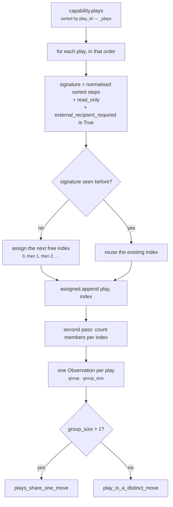

# Plugin · `move_distinctness`

**Class:** `alternative_unit.py:MoveDistinctnessPlugin` (lines 199–235)
**`plugin_id`:** `move_distinctness` — **second** in execution order
**`Observation.kind`:** `alternative.signature:<play_id>` (prefix constant `_SIGNATURE_PREFIX`, line 61)
**Feeds:** `distinct_count`, `duplicate_count`, `option_count`, `has_alternative`
**Config keys:** **none.** This plugin has nothing to tune.

---

## 1 · The claim

*Whether the roster offers different moves, or the same move several times.*

The failure mode it exists to prevent, from the class docstring:

> *"Layer 3 capabilities accumulate plays. Two authors solve the same problem, a variant is added for
> a segment that no longer exists, and the roster quietly grows to five entries that are three
> moves. Counting entries would then report a rich set of alternatives that does not exist."*

And why that is worse than reporting one option honestly, from the module docstring:

> *"A roster of five plays that is really two moves offers a false choice, and a false choice is
> worse than an honest single option because it manufactures a feeling of deliberation nobody did."*

The plugin does not decide anything and does not remove anything. It assigns each play a **group
index**, and plays that are the same move share one. The unit later counts distinct indices, which is
what makes *"how many genuinely different things could we do?"* answerable without re-deriving the
comparison at every read.

---

## 2 · The code

```python
class MoveDistinctnessPlugin:
    plugin_id = "move_distinctness"

    def contribute(self, view: UnitView) -> tuple[Observation, ...]:
        plays = _plays(view)
        if not plays:
            return ()
        # Assignment order follows the sorted roster, so a group index is a property of the
        # capability's content and identical on every replay.
        groups: dict[tuple[object, ...], int] = {}
        assigned: list[tuple[PlayDefinition, int]] = []
        for play in plays:
            signature = _move_signature(play)
            if signature not in groups:
                groups[signature] = len(groups)
            assigned.append((play, groups[signature]))
        sizes: dict[int, int] = {}
        for _, index in assigned:
            sizes[index] = sizes.get(index, 0) + 1
        return tuple(Observation(
            plugin_id=self.plugin_id,
            kind=f"{_SIGNATURE_PREFIX}{play.play_id}",
            metrics={"group": index, "group_size": sizes[index]},
            reason_codes=(("plays_share_one_move",) if sizes[index] > 1
                          else ("play_is_a_distinct_move",)),
        ) for play, index in assigned)
```

Two passes over the roster: the first assigns indices, the second counts group sizes so that every
member of a group can report the size of the group it is in. One observation per play, always.

### 2.1 · The signature

```python
# alternative_unit.py:133-150
def _move_signature(play: PlayDefinition) -> tuple[object, ...]:
    steps = tuple(sorted(" ".join(str(step).lower().split()) for step in play.steps))
    return (steps, play.read_only,
            play.metadata.get("external_recipient_required") is True)
```

Three components, and the choice of exactly these three is the plugin's entire IP.

| In the signature | Why |
|---|---|
| **Steps**, lowercased, whitespace-collapsed, sorted | *"The steps are the move."* Sorting means *"two plays that list the same instructions in a different order are the same work in a different write-up."* |
| **`read_only`** | *"A read-only draft and an auto-send of the same text are genuinely different moves with genuinely different consequences, and collapsing them would hide the only choice that matters between them."* |
| **`metadata["external_recipient_required"] is True`** | Whether the play reaches someone outside the org. An internal note and a customer email built from the same summary have different blast radii |

| Deliberately **not** in the signature | Why |
|---|---|
| `label` | *"A different label … does not change what a human is being asked to do"* |
| `impact_bp`, `success_probability_bp`, `effort_bp`, `risk_bp` | *"a different author's impact estimate"* — an estimate is a guess about the same move |
| `tags` | *"a different tag"* — taxonomy, not instruction |
| `preconditions` | Who may run it is `core.constraint`'s subject, and a play that survives screening is available regardless of *why* |
| `play_id`, `version` | Renaming a play *"would silently manufacture a second option"* |
| `success_events`, `window_days` | Measurement and expiry, not the work |
| Every other `metadata` key | Only the one key participates |

### 2.2 · Step normalisation, exactly

`" ".join(str(step).lower().split())` does three things in one expression:

1. `str(step)` — defensive; `PlayDefinition.__post_init__` already coerced steps to strings.
2. `.lower()` — case-insensitive, so `"Draft a reply"` and `"draft a reply"` match.
3. `.split()` then `" ".join(...)` — splits on **any** run of whitespace and rejoins with single
   spaces, so leading/trailing space, double spaces, tabs and newlines all collapse.

Verified:

```text
"Draft a reply"        → "draft a reply"
"  Draft A Reply "     → "draft a reply"
"Draft  a  reply"      → "draft a reply"
"Draft\ta\nreply"      → "draft a reply"
```

Then `sorted(...)` over the per-play step list, so order within a play does not matter.

---

## 3 · The mechanism



### 3.1 · Why the group index is stable

`groups[signature] = len(groups)` assigns indices in first-encounter order, and first-encounter order
is the **sorted roster** order, not the manifest order. That is why `_plays` sorts.

Without the sort, an author moving a play up in the file would renumber the groups, changing every
`group` metric, every `Finding.metrics`, and therefore the result's `semantic_hash` — for a manifest
that describes exactly the same choice.

`test_the_option_count_does_not_depend_on_the_order_plays_were_authored` pins the metrics half of
this; `test_the_same_situation_reasons_identically_twice` pins the hash.

Note what the index is **not**: it is not a stable identifier across capability versions. Add one
play with a new signature that sorts before the others and every index shifts by one. The index is
only meaningful *within one run*, which is all `calculate` needs it for.

### 3.2 · `group_size` is a property of the whole roster

`group_size` counts every play with that signature, including plays that viability eliminated. So a
duplicate pair where one member was eliminated still reports `group_size = 2` on both observations,
while `duplicate_count` (computed in `calculate` over survivors only) reports `0`.

Both are correct and they answer different questions: *"is this play a duplicate of something in the
manifest?"* versus *"did a duplicate shrink the option set the human is being handed?"*

---

## 4 · Worked examples

### 4.1 · Two entries, one move

Pinned by `test_two_plays_with_the_same_steps_are_one_move`.

```text
plays   reply_now     steps ("Draft a grounded reply",)  read_only True  metadata {}
        send_response steps ("Draft a grounded reply",)  read_only True  metadata {}

sorted roster: reply_now, send_response

reply_now      signature (("draft a grounded reply",), True, False)  → new  → group 0
send_response  signature (("draft a grounded reply",), True, False)  → seen → group 0

sizes = {0: 2}

Observation(kind="alternative.signature:reply_now",
            metrics={"group": 0, "group_size": 2},
            reason_codes=("plays_share_one_move",))
Observation(kind="alternative.signature:send_response",
            metrics={"group": 0, "group_size": 2},
            reason_codes=("plays_share_one_move",))
```

Downstream: `viable_count = 2`, `distinct_count = 1`, `duplicate_count = 1`, `has_alternative = 0`,
`option_count = 2`. Two manifest rows, one real move, plus doing nothing.

### 4.2 · Wording and order are edits, not alternatives

Pinned by `test_wording_and_step_order_do_not_make_a_different_move`.

```text
alpha  steps ("Draft a reply", "Check the contract")
beta   steps ("check   THE contract", "  Draft A Reply ")

alpha  normalise → ["draft a reply", "check the contract"]
       sorted    → ("check the contract", "draft a reply")
beta   normalise → ["check the contract", "draft a reply"]
       sorted    → ("check the contract", "draft a reply")

both signatures = (("check the contract", "draft a reply"), True, False)   → same group
```

Verified by calling `_move_signature` directly on both. Rewriting a play's steps is an edit; it must
not manufacture a second option.

### 4.3 · Reversibility splits an otherwise identical pair

Pinned by `test_an_irreversible_variant_is_a_genuinely_different_move`.

```text
draft_reply  steps ("Send the reply",)  read_only True
auto_send    steps ("Send the reply",)  read_only False

draft_reply  signature (("send the reply",), True,  False)  → group 0
auto_send    signature (("send the reply",), False, False)  → group 1

sizes = {0: 1, 1: 1}
both observations carry ("play_is_a_distinct_move",)
```

Identical text, genuinely different consequences. Collapsing these two *"would hide the only choice
that matters between them"* — and it is precisely the choice a human should be shown.

### 4.4 · External reach splits a pair

Pinned by `test_a_play_that_reaches_outside_the_org_is_its_own_move`.

```text
internal_note  steps ("Share the summary",)  metadata {"external_recipient_required": False}
customer_note  steps ("Share the summary",)  metadata {"external_recipient_required": True}

internal_note  signature (("share the summary",), True, False)  → group 0
customer_note  signature (("share the summary",), True, True)   → group 1
```

Note that `internal_note` and a play with **no** `metadata` at all produce the same signature
component — `.get(...) is True` is `False` for both. Declaring `False` and declaring nothing are the
same claim.

### 4.5 · The canonical five-play roster

From the unit's end-to-end test, verified live:

```text
sorted roster and signatures

  accept_partial_scope  (("offer a reduced first phase",),          True,  False)  → group 0
  auto_send_reminder    (("send the reminder automatically",),      False, False)  → group 1
  escalate_to_sponsor   (("draft a note to the economic sponsor",), True,  False)  → group 2
  reply_to_buyer        (("draft a grounded reply to the buyer",),  True,  False)  → group 3
  reply_to_buyer_v2     (("draft a grounded reply to the buyer",),  True,  False)  → group 3

sizes = {0: 1, 1: 1, 2: 1, 3: 2}

observations
  alternative.signature:accept_partial_scope  {group 0, group_size 1}  play_is_a_distinct_move
  alternative.signature:auto_send_reminder    {group 1, group_size 1}  play_is_a_distinct_move
  alternative.signature:escalate_to_sponsor   {group 2, group_size 1}  play_is_a_distinct_move
  alternative.signature:reply_to_buyer        {group 3, group_size 2}  plays_share_one_move
  alternative.signature:reply_to_buyer_v2     {group 3, group_size 2}  plays_share_one_move
```

`reply_to_buyer_v2`'s authored steps are `"Draft a  Grounded reply TO the buyer"` — different
capitalisation and a double space. It normalises to exactly the same instruction.

### 4.6 · Three entries, one move

Pinned by `test_duplicated_plays_do_not_manufacture_a_choice`.

```text
reply_a  ("Draft a grounded reply",)
reply_b  ("draft a grounded reply",)
reply_c  ("Draft  a  grounded  reply",)

all three → (("draft a grounded reply",), True, False) → group 0, group_size 3

unit metrics  declared_count 3 · viable_count 3 · distinct_count 1 · duplicate_count 2
              option_count 2 · has_alternative 0
reason codes  include false_choice_in_roster and single_course_of_action
```

Three manifest rows delivered as *one* move and the null option, with the false choice named out
loud rather than hidden.

---

## 5 · Exactly when it stays silent

**Never, in practice.** The only silence path is `if not plays: return ()`, and
`CapabilityManifest.__post_init__` raises `ValueError: capability requires at least one play` before
a request carrying an empty roster can exist. The guard is unreachable defensive code — see
[README defect 6](README.md#6--known-defects-and-compromises).

Every play always gets exactly one observation. There is no *"this play has no grouping"* state,
which is why `calculate`'s `groups.get(play_id, -1 - index)` fallback is also unreachable.

---

## 6 · Edge cases

| Input | Result | Note |
|---|---|---|
| One play | `{group: 0, group_size: 1}`, `play_is_a_distinct_move` | a group of one is still a group |
| Two plays, identical everything | one group, `group_size 2` | duplicate `play_id` is impossible — `CapabilityManifest` refuses it |
| A play listing the same step twice: `("X", "X")` | signature `(("x", "x"), ...)` — **different** from a play listing `("X",)` | verified live: they land in different groups. `steps` is a tuple, not a set, so repetition survives normalisation. Arguably a bug; arguably a genuinely longer instruction |
| `metadata = {"external_recipient_required": "true"}` | reads as **False** | `is True` is an identity check. A string, `1`, or a truthy object all read as internal-only. Verified live. A latent trap for any path that round-trips metadata through a format without a boolean type |
| `metadata = {"external_recipient_required": 1}` | reads as **False** | `1 is True` is `False` in CPython |
| `metadata` absent entirely | reads as **False** | same as declaring `False` |
| Steps differing only by punctuation: `"Draft a reply."` vs `"Draft a reply"` | **different** moves | normalisation touches case and whitespace only |
| Steps differing by a synonym: `"Send a note"` vs `"Send a message"` | **different** moves | the plugin compares text, never meaning — deliberately, since guessing would be confidently wrong |
| A play whose steps are a permutation of another's | **same** move | sorting is what makes this true |
| 50 plays, all distinct | 50 observations, groups 0–49 | O(n) in the roster; no pairwise comparison |
| `read_only` non-boolean | impossible — `PlayDefinition.__post_init__` raises `TypeError: read_only must be boolean` | |

---

| ← | → |
|---|---|
| [03a · `do_nothing_baseline`](03a-plugin-do_nothing_baseline.md) | [03c · `play_viability`](03c-plugin-play_viability.md) |
