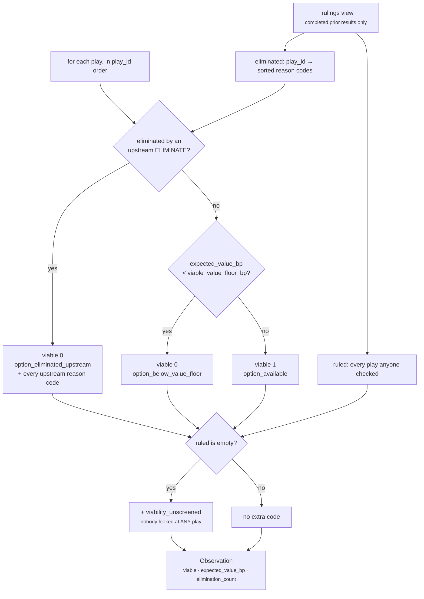

# Plugin · `play_viability`

**Class:** `alternative_unit.py:PlayViabilityPlugin` (lines 153–196)
**`plugin_id`:** `play_viability` — **third** in execution order
**`Observation.kind`:** `alternative.viability:<play_id>` (prefix constant `_VIABILITY_PREFIX`, line 60)
**Feeds:** `declared_count`, `viable_count`, and — through the join with `move_distinctness` —
`distinct_count`, `duplicate_count`, `option_count`, `has_alternative`
**Config key:** `viable_value_floor_bp`, default `500`

---

## 1 · The claim

*Which declared plays are genuinely still on the table.*

Two screens, and the class docstring is explicit that **neither is a ranking**:

> *"The first defers entirely to units that already ruled: a play eliminated on policy or
> precondition is unavailable, and this unit reports that fact rather than re-deriving it. The second
> is a floor, not an order — a play whose expected value sits below the configured floor is nominally
> available but is not something a person would recognise as an option, and presenting it as one
> inflates the apparent breadth of choice."*

And a third thing, which is neither a screen nor a ranking but the honest reporting of an absence:

> *"Where no earlier unit ruled on the roster at all, every play is reported as available **and** the
> observation carries `viability_unscreened`, because an unchecked roster is not a clean one."*

Every play gets an observation, survivor or not. A play that lost stays on the record with the reason
it lost, so *"an option set is only auditable if the things that were ruled out are visible alongside
the things that were not."*

---

## 2 · The code

```python
class PlayViabilityPlugin:
    plugin_id = "play_viability"

    def contribute(self, view: UnitView) -> tuple[Observation, ...]:
        plays = _plays(view)
        if not plays:
            return ()                       # nothing declared; no claim about availability to make
        floor = _config_bp(view, "viable_value_floor_bp", 500)
        eliminated, ruled = _rulings(view)
        observations: list[Observation] = []
        for play in plays:
            blocking = eliminated.get(play.play_id, ())
            value = _expected_value(play)
            codes: list[str] = []
            if blocking:
                codes.append("option_eliminated_upstream")
                codes.extend(blocking)
            elif value < floor:
                codes.append("option_below_value_floor")
            else:
                codes.append("option_available")
            if not ruled:
                codes.append("viability_unscreened")
            observations.append(Observation(
                plugin_id=self.plugin_id,
                kind=f"{_VIABILITY_PREFIX}{play.play_id}",
                metrics={"viable": 0 if (blocking or value < floor) else 1,
                         "expected_value_bp": value,
                         "elimination_count": len(blocking)},
                reason_codes=tuple(codes),
            ))
        return tuple(observations)
```

### 2.1 · Reading what other units already decided

```python
# alternative_unit.py:101-121
def _rulings(view: UnitView) -> tuple[Mapping[str, tuple[str, ...]], frozenset[str]]:
    eliminated: dict[str, set[str]] = {}
    ruled: set[str] = set()
    for _, result in sorted(view.prior.items()):
        if result.status != ResultStatus.COMPLETED:
            continue
        for check in result.checks:
            ruled.add(check.play_id)
            if check.outcome == CheckOutcome.ELIMINATE:
                eliminated.setdefault(check.play_id, set()).add(check.reason_code)
    return ({play_id: tuple(sorted(codes)) for play_id, codes in eliminated.items()},
            frozenset(ruled))
```

Four properties worth naming:

- **Any completed prior unit can eliminate.** The function does not look at `evaluator_id` or
  `stage`. In practice `core.constraint` is the only unit in the shipped roster that emits
  `CheckOutcome.ELIMINATE`, but `core.validation` emits a `safety` check per play and could.
- **Only `ELIMINATE` removes.** `PASS`, `WARN` and `ADJUST` mark a play as *ruled on* and leave it
  available. Pinned by `test_a_warning_is_not_an_elimination` — *"Cost and resource units WARN
  routinely; treating a caution as a block would erase options."*
- **A non-completed result has no opinion.** *"A unit that crashed has no opinion, and the frozen
  contract already forbids a non-completed result from carrying checks at all."*
  `ReasonerResult.__post_init__` enforces the second half.
- **`ruled` is roster-wide, not per play.** It is the set of plays *anyone* ruled on. The plugin only
  ever asks whether it is empty — which is the source of the defect in §5.2.

The `sorted(view.prior.items())` is belt-and-braces: eliminations accumulate into a `set` and are
emitted `sorted`, so the outcome is already order-independent. The sort makes that visible rather
than relying on it.

### 2.2 · Expected value

```python
# alternative_unit.py:124-130
def _expected_value(play: PlayDefinition) -> int:
    """What the play is worth *in expectation* — its impact discounted by its odds.

    A large prize that lands one time in fifty is not an option a human would recognise as one, and
    counting it as such is how an option set gets padded with things nobody would ever take.
    """
    return clamp_bp(divide_half_up(play.impact_bp * play.success_probability_bp, 10_000))
```

```text
expected_value_bp = clamp_bp( half_up( impact_bp × success_probability_bp , 10,000 ) )
```

Both inputs are validated 0–10,000 by `PlayDefinition.__post_init__`, so the product is at most
100,000,000 and the quotient at most 10,000 — `clamp_bp` can never actually bind. The multiplication
happens **before** the division, so no precision is lost to an intermediate, and `divide_half_up`
rounds once on the full numerator.

### 2.3 · Config

| Key | Type | Default | Validated by | Effect |
|---|---|---|---|---|
| `viable_value_floor_bp` | int bp 0–10,000 | `500` | `_config_bp` | strictly-below is not an option. `0` makes every non-eliminated play viable; `10_000` makes almost nothing viable |

```python
def _config_bp(view: UnitView, key: str, default: int) -> int:
    value = view.config.get(key, default)
    if isinstance(value, bool) or not isinstance(value, int) or not 0 <= value <= 10_000:
        raise ValueError(f"{key} must be integer basis points")
    return value
```

Read once per run, immediately after the unreachable empty-roster guard, so a malformed value fails
on the first run rather than lying dormant. Verified:

```text
{"viable_value_floor_bp": 25000}  → ValueError: viable_value_floor_bp must be integer basis points
{"viable_value_floor_bp": True}   → ValueError  (bool rejected before int)
{"viable_value_floor_bp": -1}     → ValueError
{"viable_value_floor_bp": 500.0}  → ValueError raised EARLIER by ReasonerSpec canonicalisation:
                                     "floats are forbidden in semantic artifacts"
```

`test_a_malformed_value_floor_is_a_manifest_fault` pins the first.

**The default 500 is untuned.** It was authored from domain reasoning and no shipped capability
overrides it. It is the single number in this unit that silently removes options.

---

## 3 · The mechanism



### 3.1 · The screens are ordered, and only the first one explains itself

`elif` matters. An eliminated play never reaches the floor test, so its codes are
`("option_eliminated_upstream", *upstream_codes)` and **not** `option_below_value_floor` — even when
its expected value is also below the floor. Verified:

```text
play    x  impact 100 · success 100  → EV = half_up(10,000 / 10,000) = 1   (well below 500)
prior   core.constraint  ELIMINATE x  "pol"

observation  {viable: 0, expected_value_bp: 1, elimination_count: 1}
             codes ("option_eliminated_upstream", "pol")
```

The upstream reason wins because it is the *stronger* explanation: the play is unavailable, not
merely unattractive. `expected_value_bp` still reports the true `1`, so nothing is hidden.

### 3.2 · The expected value of an eliminated play is still published

`_expected_value(play)` is computed unconditionally, before the branch. An eliminated play therefore
carries its real worth into the finding:

```text
auto_send_reminder  {viable: 0, expected_value_bp: 4200, elimination_count: 1}
```

A reader can see that a genuinely valuable option was removed on policy rather than because it was
weak. That is the argument a human might want to have with the policy, and it is only possible
because the number survived the elimination.

### 3.3 · `elimination_count` counts reasons, not eliminators

`eliminated[play_id]` is a **set of reason codes**, so two units eliminating the same play for the
same reason contribute one code and `elimination_count = 1`. Two units eliminating for different
reasons contribute two. The metric answers *"how many distinct grounds are there for removing this?"*
rather than *"how many units objected?"*.

---

## 4 · Worked examples

### 4.1 · An unscreened roster

Pinned by `test_an_unscreened_roster_is_reported_as_unchecked_not_as_clean`.

```text
plays   reply_to_buyer      impact 6000 · success 7000
        escalate_to_sponsor impact 6000 · success 7000
prior   {}                                   # scheduled before any constraint unit

_rulings → ({}, frozenset())                 # ruled is EMPTY
floor    = 500

reply_to_buyer       EV = half_up(6000 × 7000 / 10000) = half_up(42,000,000 / 10,000)
                        = (42,000,000 + 5,000) // 10,000 = 4200
                     blocking = ()  ·  4200 >= 500  → viable 1 → option_available
                     ruled empty                    → + viability_unscreened
escalate_to_sponsor  identical

Observation(kind="alternative.viability:escalate_to_sponsor",
            metrics={"viable": 1, "expected_value_bp": 4200, "elimination_count": 0},
            reason_codes=("option_available", "viability_unscreened"))
```

Both plays are reported available **and** unscreened. *"Silence about policy is a blind spot, not a
pass."* The same result follows when `core.constraint` ran and `FAILED` — pinned by
`test_a_unit_that_did_not_complete_cannot_eliminate_an_option`.

### 4.2 · An upstream elimination

Pinned by `test_an_upstream_elimination_removes_a_play_from_the_option_set`.

```text
plays   auto_send_reminder  read_only False · impact 6000 · success 7000
        reply_to_buyer      read_only True  · impact 6000 · success 7000
prior   core.constraint COMPLETED
          check auto_send_reminder  ELIMINATE  read_only_policy
          check reply_to_buyer      PASS       read_only_policy_pass

_rulings → ({"auto_send_reminder": ("read_only_policy",)},
            frozenset({"auto_send_reminder", "reply_to_buyer"}))

auto_send_reminder  blocking = ("read_only_policy",)
                    metrics {viable 0, expected_value_bp 4200, elimination_count 1}
                    codes   ("option_eliminated_upstream", "read_only_policy")
reply_to_buyer      blocking = ()  ·  4200 >= 500 → viable 1
                    codes   ("option_available",)      ← NO viability_unscreened, ruled is non-empty
```

The upstream reason code travels with the play, so the option set can be argued with rather than
merely accepted.

### 4.3 · A play worth almost nothing

Pinned by `test_a_play_worth_almost_nothing_is_not_presented_as_an_option`.

```text
play    long_shot  impact 2000 · success 2000
config  {}                                    # floor = 500

EV = half_up(2000 × 2000 / 10000)
   = half_up(4,000,000 / 10,000)
   = (4,000,000 + 5,000) // 10,000
   = 4,005,000 // 10,000 = 400

400 < 500 → viable 0
metrics {viable 0, expected_value_bp 400, elimination_count 0}
codes   ("option_below_value_floor", "viability_unscreened")
```

*"2000bp impact landing one time in five is a manifest leftover, not something anyone would take."*
A 20% impact at 20% odds is 4% in expectation, and presenting it as an option would inflate the
apparent breadth of choice.

### 4.4 · A capability sets its own bar

Pinned by `test_a_capability_can_set_its_own_bar_for_what_counts_as_an_option`.

```text
play    long_shot  impact 2000 · success 2000  → EV 400
config  {"viable_value_floor_bp": 100}

400 >= 100 → viable 1 → option_available
```

*"A capability whose plays are all low-probability should still be able to present them."* A
prospecting capability where every play is a 10% shot is not a capability with no options; it is a
capability whose scale is different, and the floor is where that judgement is authored.

### 4.5 · The shipped roster

`sales.deal_cooling_full` authors no config, so the floor is 500. Re-derived live:

```text
clarify_next_step    impact 6500 · success 6000
                     EV = half_up(39,000,000 / 10,000) = 3900   viable 1
multithread_account  impact 7500 · success 4000
                     EV = half_up(30,000,000 / 10,000) = 3000   viable 1
restore_momentum     impact 8000 · success 5500
                     EV = half_up(44,000,000 / 10,000) = 4400   viable 1
```

All three clear the floor by a wide margin, so on the shipped capability the floor screen has never
removed anything. It is untested against real content.

### 4.6 · Rounding at the boundary

Verified live:

```text
impact 1 · success 5000  → half_up(5,000 / 10,000)  = (5,000 + 5,000) // 10,000 = 1
impact 1 · success 4999  → half_up(4,999 / 10,000)  = (4,999 + 5,000) // 10,000 = 0
```

Half-up, exactly at the midpoint, rounds away from zero. Both are below the default floor, so both
are `option_below_value_floor` — but a floor of `0` would separate them, since `0 < 0` is false and
the second would be viable. Verified: with `viable_value_floor_bp: 0`, a play with `impact 0,
success 0` reports `{viable: 1, expected_value_bp: 0}` and `option_available`.

---

## 5 · Exactly when it stays silent — and where the honesty leaks

### 5.1 · The silence path

**Never, in practice.** `if not plays: return ()` is unreachable — `CapabilityManifest` refuses a
manifest with no plays. Every play always produces exactly one observation, whatever its fate. That
is the design: an elimination is a *finding*, not an absence.

### 5.2 · `viability_unscreened` is a roster-level flag reported per play

The check is `if not ruled` — *did anyone rule on **anything**?* — not *was this play ruled on?*

Verified live with two plays and one `PASS` check on play `a`:

```text
prior   core.constraint COMPLETED  check a PASS "ok"

a  codes ("option_available",)
b  codes ("option_available",)      ← b was never looked at, and nothing says so
```

Play `b` is reported clean on the strength of a check that was about a different play. A partially
screened roster is presented as fully screened.

Two situations produce this today:

- A capability whose `core.constraint` spec configures `blocked_play_ids` or precondition checks that
  only reach some plays.
- Any capability whose eliminating unit is play-selective by design.

The per-play fix is `if play.play_id not in ruled` — the same expression length, and it strictly
strengthens the claim. Recorded as [README defect 3](README.md#6--known-defects-and-compromises).

### 5.3 · Upstream reason codes enter this unit's namespace

`codes.extend(blocking)` copies the eliminating unit's `reason_code` into the observation, and
`evaluate_meaning` unions every observation's codes into the unit's own `reason_codes`. A run where
`core.constraint` eliminated on `read_only_policy` publishes `read_only_policy` from
`core.alternative`.

That is intended — the reason must travel with the play — but it means a consumer matching on
`core.alternative`'s reason codes cannot assume a code it sees was authored here. Recorded as
[README defect 4](README.md#6--known-defects-and-compromises).

---

## 6 · Edge cases

| Input | Result | Note |
|---|---|---|
| `prior = {}` | every play `viable 1` + `viability_unscreened` | the canonical unchecked roster |
| A prior result `COMPLETED` with `checks = ()` | contributes nothing to `ruled`; `viability_unscreened` still fires | correct — a unit that emitted no check ruled on nothing |
| A prior result `FAILED` | skipped entirely, including any checks it would have carried | `ReasonerResult` forbids a non-completed result from carrying checks at all |
| `CheckOutcome.WARN` on a play | play stays viable, and `ruled` includes it | pinned by `test_a_warning_is_not_an_elimination` |
| `CheckOutcome.ADJUST` on a play | same as `WARN` | |
| Two units eliminate one play with the same `reason_code` | one code, `elimination_count = 1` | set semantics |
| Two units eliminate one play with different codes | both codes sorted, `elimination_count = 2` | |
| A check names a `play_id` not in the roster | cannot happen in an orchestrated run — `guards.py:validate_candidate_effects` raises `check references unknown play` on the **publishing** unit before its result is accepted. Called directly, `_rulings` would add it to `ruled` and `eliminated`, emitting no observation for it while suppressing `viability_unscreened` for the whole roster | |
| `impact_bp = 10_000`, `success_probability_bp = 10_000` | `EV = 10,000` | the maximum; `clamp_bp` never binds |
| `impact_bp = 0` | `EV = 0` → below any floor above 0 | a play declared worthless is not presented |
| `viable_value_floor_bp = 0` | every non-eliminated play is viable, including `EV = 0` | strictly-below comparison |
| `viable_value_floor_bp = 10_000` | only a perfect play survives the floor | legal, and would report `no_viable_option` on any real roster |
| `viable_value_floor_bp` malformed | `ValueError` → run `FAILED` on the **first** run | not lazy, unlike `core.impact`'s config |

---

| ← | → |
|---|---|
| [03b · `move_distinctness`](03b-plugin-move_distinctness.md) | [04 · Calculator](04-Calculator.md) |
