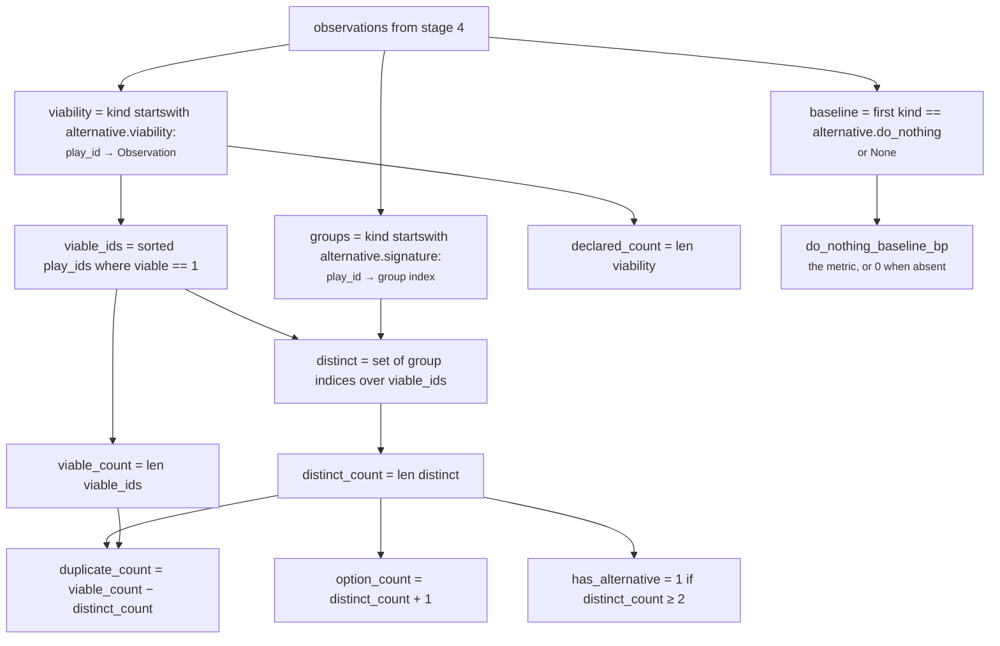

# 04 · Calculator — `core.alternative`

**Stage 5 of eight.** `@abstractmethod` on the base class, so this unit must implement it.
**Source:** `alternative_unit.py:308-341`

---

## 1 · What it is for

*Fold three claims into the shape of the choice a human is being handed.*

The three plugins produced eleven observations about a five-play roster. None of them is the answer.
The Calculator's job is to turn *"here is what we found about each play"* into *"here is the choice
you have"* — seven integers, no judgement, no ordering.

---

## 2 · What exists

```python
def calculate(self, view: UnitView,
              observations: Sequence[Observation]) -> Mapping[str, int]:
    viability = {_suffix(item.kind): item for item in observations
                 if item.kind.startswith(_VIABILITY_PREFIX)}
    groups = {_suffix(item.kind): int(item.metrics["group"]) for item in observations
              if item.kind.startswith(_SIGNATURE_PREFIX)}
    baseline = next((item for item in observations if item.kind == _BASELINE_KIND), None)

    viable_ids = sorted(play_id for play_id, item in viability.items()
                        if int(item.metrics["viable"]) == 1)
    # A play with no published grouping stands alone rather than being folded into group zero;
    # the negative sentinel cannot collide with a real group index.
    distinct = {groups.get(play_id, -1 - index) for index, play_id in enumerate(viable_ids)}
    distinct_count = len(distinct)
    return {"declared_count": len(viability),
            "viable_count": len(viable_ids),
            "distinct_count": distinct_count,
            "duplicate_count": len(viable_ids) - distinct_count,
            "option_count": distinct_count + 1,
            "has_alternative": 1 if distinct_count >= 2 else 0,
            "do_nothing_baseline_bp": int(baseline.metrics["do_nothing_baseline_bp"]) if baseline
            else 0}
```

Pure integer arithmetic. No config is read here; no threshold is applied; nothing is rounded, because
nothing is divided.

### 2.1 · The seven outputs

| Metric | Expression | Range |
|---|---|---|
| `declared_count` | `len(viability)` — one viability observation per declared play | 1–n |
| `viable_count` | `len(viable_ids)` | 0–`declared_count` |
| `distinct_count` | `len(distinct)` — distinct group indices among the survivors | 0–`viable_count` |
| `duplicate_count` | `viable_count − distinct_count` | 0–`viable_count − 1` |
| `option_count` | `distinct_count + 1` | **1**–n, never 0 |
| `has_alternative` | `1 if distinct_count >= 2 else 0` | 0 or 1 |
| `do_nothing_baseline_bp` | the baseline observation's metric, or `0` | 0–10,000 |

---

## 3 · How it works

### 3.1 · Three lookups, then one join



The three dictionaries are keyed by the play id recovered from `Observation.kind` via `_suffix`. Play
ids are unique by contract (`CapabilityManifest.__post_init__` refuses a duplicate), so neither
lookup can lose an entry to a collision.

### 3.2 · Why `distinct_count` counts moves, not manifest rows

The docstring makes the argument directly:

> *"`distinct_count` counts **moves**, not manifest entries: duplicates collapse into their group, so
> five plays that are two moves report two."*

The alternative — counting `viable_count` and calling it the option count — is what the whole unit
exists to avoid. From the module docstring: *"a false choice is worse than an honest single option
because it manufactures a feeling of deliberation nobody did."*

### 3.3 · Why grouping is computed over the whole roster and filtered afterwards

`groups` contains every play, including the ones viability eliminated. `distinct` then takes the
group index only of the survivors.

The ordering is deliberate. Computing groups over the survivors alone would make a group index
depend on what was eliminated, so the same two plays could land in different groups on two runs of
the same capability. Computing over everything and filtering afterwards keeps the index a stable
property of the capability's content — which is also what makes
`test_the_option_count_does_not_depend_on_the_order_plays_were_authored` hold.

The visible consequence: **an eliminated duplicate does not count as a duplicate.** Verified with
two identical plays, one eliminated:

```text
declared_count 2 · viable_count 1 · distinct_count 1 · duplicate_count 0
```

`duplicate_count` answers *"did a duplicate shrink the choice a human is being handed?"* — and here
it did not, because only one member survived screening anyway. The observation-level code
`plays_share_one_move` is still on the record, so nothing is lost.

### 3.4 · Why `option_count = distinct_count + 1`

> *"`option_count` is that plus one, because the null option never leaves the table and an option set
> that omitted it would overstate how forced the situation is."*

The `+1` is unconditional. It does not depend on whether the baseline was priced, because *whether we
know the price* and *whether the option exists* are different questions. Doing nothing is always
available; sometimes we simply have not costed it.

The floor at 1 is the consequence that matters: **`option_count` is never 0.** When every play is
eliminated, the answer is not *"no options"* — it is *"one option, and here is what it costs."*
Pinned by `test_an_option_set_with_nothing_viable_still_reports_the_null_option`.

### 3.5 · Why `has_alternative` is strict at `>= 2`

> *"`has_alternative` is deliberately strict — it is 1 only when at least two genuinely different
> moves survive. Act-or-do-nothing is a decision, but it is not a choice **between courses of
> action**, and conflating the two is how a forced move gets presented as if it had been
> deliberated."*

Note that the threshold is on `distinct_count`, not `option_count`. Since `option_count` is always
`distinct_count + 1`, a "two options" reading built on `option_count >= 2` would be true for every
single-play capability in existence, and the metric would carry no information.

The strict reading has one consequence a reader should expect: `has_alternative = 0` and
`matched = False` on a capability with exactly one good play is the **normal, correct** outcome, not
a failure. That is what `single_course_of_action` says out loud in stage 6.

### 3.6 · The dead fallback

```python
distinct = {groups.get(play_id, -1 - index) for index, play_id in enumerate(viable_ids)}
```

The comment argues that *"a play with no published grouping stands alone rather than being folded
into group zero; the negative sentinel cannot collide with a real group index"* — real indices are
`0, 1, 2, …` and the fallback yields `-1, -2, -3, …`, one distinct value per position.

The reasoning is right and the branch is unreachable. `MoveDistinctnessPlugin` and
`PlayViabilityPlugin` both iterate the identical `_plays(view)` result and both emit one observation
per play, so every key in `viability` is also a key in `groups`. The fallback would only fire if the
two plugins disagreed about the roster, which they structurally cannot. Recorded as
[README defect 6](README.md#6--known-defects-and-compromises).

---

## 4 · A worked combination

The canonical five-play scenario, taking the eleven observations from
[03 · Analyzer](03-Analyzer.md) §4 as input.

```text
input observations (11)

  alternative.do_nothing                       {do_nothing_baseline_bp 7500, signal_count 3}
  alternative.signature:accept_partial_scope   {group 0, group_size 1}
  alternative.signature:auto_send_reminder     {group 1, group_size 1}
  alternative.signature:escalate_to_sponsor    {group 2, group_size 1}
  alternative.signature:reply_to_buyer         {group 3, group_size 2}
  alternative.signature:reply_to_buyer_v2      {group 3, group_size 2}
  alternative.viability:accept_partial_scope   {viable 1, expected_value_bp 3000, elimination_count 0}
  alternative.viability:auto_send_reminder     {viable 0, expected_value_bp 4200, elimination_count 1}
  alternative.viability:escalate_to_sponsor    {viable 1, expected_value_bp 3500, elimination_count 0}
  alternative.viability:reply_to_buyer         {viable 1, expected_value_bp 4200, elimination_count 0}
  alternative.viability:reply_to_buyer_v2      {viable 1, expected_value_bp 4200, elimination_count 0}

three lookups

  viability = {accept_partial_scope, auto_send_reminder, escalate_to_sponsor,
               reply_to_buyer, reply_to_buyer_v2}          → 5 entries
  groups    = {accept_partial_scope: 0, auto_send_reminder: 1, escalate_to_sponsor: 2,
               reply_to_buyer: 3, reply_to_buyer_v2: 3}    → 5 entries
  baseline  = the alternative.do_nothing observation

the join

  viable_ids = sorted([accept_partial_scope, escalate_to_sponsor,
                       reply_to_buyer, reply_to_buyer_v2])
               # auto_send_reminder excluded: viable == 0
  their group indices = 0, 2, 3, 3
  distinct   = {0, 2, 3}
  distinct_count = 3        # group 1 was assigned to the eliminated play and never counted

the seven metrics

  declared_count         = 5
  viable_count           = 4
  distinct_count         = 3
  duplicate_count        = 4 − 3            = 1
  option_count           = 3 + 1            = 4
  has_alternative        = 1                          # 3 >= 2
  do_nothing_baseline_bp = 7500
```

Read as a sentence: *five plays declared; one unavailable on policy; of the four that remain, two are
the same move; so three genuinely different things could be done, plus standing still, which costs
7,500bp.*

### 4.1 · The same arithmetic on three other rosters

| Scenario | `declared` | `viable` | `distinct` | `duplicate` | `option_count` | `has_alternative` | Test |
|---|---|---|---|---|---|---|---|
| One play, nothing screened | 1 | 1 | 1 | 0 | **2** | 0 | `test_a_single_play_capability_is_reported_as_a_forced_move` |
| Three entries, one move | 3 | 3 | 1 | 2 | **2** | 0 | `test_duplicated_plays_do_not_manufacture_a_choice` |
| One play, eliminated | 1 | 0 | 0 | 0 | **1** | 0 | `test_an_option_set_with_nothing_viable_still_reports_the_null_option` |
| Shipped `deal_cooling_full` | 3 | 3 | 3 | 0 | **4** | 1 | re-derived live |

The first two rows are the ones worth staring at. Three manifest entries and one manifest entry
produce the **same** `option_count` of 2, because they describe the same choice. That equality is the
unit's central claim expressed in one number.

---

## 5 · The one place the Calculator breaks a stated law

Law 3 of the layer is *silence is not zero*: *"A published `0` is a claim; an absent metric is an
admission."* Two of the three plugins here honour it — `DoNothingBaselinePlugin` returns `()` rather
than a zero-valued observation, and its docstring says why in the strongest terms available:

> *"Reporting it as zero would tell a human that doing nothing is free, which is the single most
> expensive thing this unit could get wrong."*

And then the Calculator republishes the zero:

```python
"do_nothing_baseline_bp": int(baseline.metrics["do_nothing_baseline_bp"]) if baseline
else 0
```

The three counts and `has_alternative` are always meaningful, so publishing them unconditionally is
correct. `do_nothing_baseline_bp` is not: when `baseline is None`, nothing measured the silence, and
`0` is indistinguishable from a measured `inaction_appears_costless`.

**What mitigates it, and what does not.** `evaluate_meaning` adds `do_nothing_cost_unknown` when no
baseline observation exists, and `test_a_single_play_capability_is_reported_as_a_forced_move` pins
that code. So a consumer reading `reason_codes` is told. A consumer reading `metrics` — which is what
a dashboard, a SQL projection, or any numeric aggregation would do — is not.

Two things make it worse than it first looks:

1. **`core.recommendation`, in the same category, omits its metrics in the same situation.** Two
   units of three obey the law and one does not, so a reader cannot infer the convention from the
   layer.
2. **The mitigation itself has a hole.** `do_nothing_cost_unknown` fires only when *no baseline
   observation exists*. When `core.cost` publishes `do_nothing_cost_bp = 0` — which it does
   unconditionally, see [03a §5.3](03a-plugin-do_nothing_baseline.md#53--break-2--a-published-zero-from-the-cost-authority-silences-everything)
   — a baseline observation **does** exist, carrying `0` and `inaction_priced_upstream`. The metric
   is `0`, the code says it was priced, and neither is a lie, but together they read as *"we measured
   and standing still is free"* when the truth may be *"the cost unit had no inputs either."*

The fix on this side is to drop the key from the returned mapping when `baseline is None`. It is one
line, it changes every existing `semantic_hash`, and it does not address hole 2. Recorded as
[README defect 2](README.md#6--known-defects-and-compromises).

---

## 6 · Edge cases

| Situation | Result | Note |
|---|---|---|
| Every play eliminated | `viable_count 0`, `distinct_count 0`, `duplicate_count 0`, `option_count 1`, `has_alternative 0` | `set()` has length 0; `0 − 0 = 0` |
| One play, viable | `distinct_count 1`, `option_count 2`, `has_alternative 0` | a forced move, correctly reported as one |
| Two viable plays, same move | `distinct_count 1`, `duplicate_count 1`, `has_alternative 0` | the false choice is collapsed |
| Two viable plays, different moves | `distinct_count 2`, `has_alternative 1` | the minimum that counts as a choice |
| Duplicate pair, one member eliminated | `duplicate_count 0` | §3.3 — a duplicate that never survived did not shrink the choice |
| Baseline observation present with value `0` | `do_nothing_baseline_bp 0`, **no** `do_nothing_cost_unknown` | a measured zero — but see §5 hole 2 |
| No baseline observation | `do_nothing_baseline_bp 0` **plus** `do_nothing_cost_unknown` | §5 |
| An observation carries a non-integer metric | impossible — `Observation.__post_init__` rejects anything that is not an `int`, including `bool` | the `int(...)` casts in `calculate` are belt-and-braces |
| `distinct_count > viable_count` | impossible — `distinct` is built from `viable_ids`, so `len(distinct) <= len(viable_ids)` | which is why `duplicate_count` cannot go negative |
| A viable play with no group observation | falls back to `-1 - index`, standing alone | unreachable — §3.6 |
| A metric name not in `publishes` | `ValueError: core.alternative published undeclared metrics: ...` between stages 6 and 7 | the guard sits between the Evaluator and the Builder |

---

| ← | → |
|---|---|
| [03c · `play_viability`](03c-plugin-play_viability.md) | [05 · Evaluator](05-Evaluator.md) |
