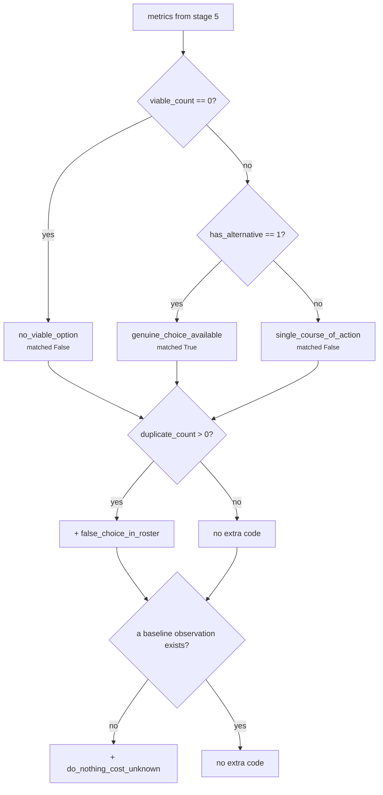

# 05 · Evaluator — `core.alternative`

**Stage 6 of eight.** `@abstractmethod` on the base class, so this unit must implement it.
**Source:** `alternative_unit.py:343-412`

---

## 1 · What it is for

Seven integers do not tell a reader what to think. The Evaluator turns them into meaning — and for
this unit, meaning that stops one step short of advice.

> *"`matched` means 'this situation offers a real choice' — never 'take one of them'."*

It emits **findings only**. No `CandidateAdjustment`, no `CandidateCheck`, no candidate touched in
any way. That is not an omission; it is the boundary the whole unit is built around, and
`test_the_unit_never_touches_a_candidate` asserts `result.adjustments == ()` and
`result.checks == ()`.

---

## 2 · What exists

```python
def evaluate_meaning(self, view: UnitView, metrics: Mapping[str, int],
                     observations: Sequence[Observation]) -> Verdict:
    codes = {code for item in observations for code in item.reason_codes}
    if metrics["viable_count"] == 0:
        codes.add("no_viable_option")
    elif metrics["has_alternative"] == 1:
        codes.add("genuine_choice_available")
    else:
        codes.add("single_course_of_action")
    if metrics["duplicate_count"] > 0:
        codes.add("false_choice_in_roster")
    if not any(item.kind == _BASELINE_KIND for item in observations):
        codes.add("do_nothing_cost_unknown")

    findings = [...]      # one per viability observation
    findings.extend(...)  # one per signature observation with group_size > 1
    findings.extend(...)  # one per baseline observation
    findings.append(...)  # one roster-level summary

    return Verdict(
        matched=metrics["has_alternative"] == 1,
        metrics=dict(metrics),
        findings=tuple(findings),
        reason_codes=tuple(sorted(codes)),
    )
```

`Verdict.adjustments` and `Verdict.checks` are never assigned, so they take their dataclass defaults
of `()`.

### 2.1 · Thresholds

**One, and it is not authored.** `has_alternative == 1`, which the Calculator derived from
`distinct_count >= 2`. There is no `*_threshold_bp` key in this unit and no config is read in this
stage at all.

That is unusual for the roster — `core.impact`, `core.opportunity`, `core.risk` and `core.cost` all
carry a tunable threshold — and it is correct here. *"Are there two or more genuinely different
things we could do?"* is a counting question, not a magnitude question. There is no number a
capability author could sensibly tune.

---

## 3 · What `matched` means

```python
matched = metrics["has_alternative"] == 1
```

**`matched = True` means: this situation offers a real choice between courses of action.** It does
not mean any of them is good, safe, affordable or recommended. `test_a_choice_being_available_is_not_a_recommendation`
pins this from both directions:

```python
assert result.matched is True
assert all(not code.startswith("recommend") for code in result.reason_codes)
assert all(not code.startswith("select") for code in result.reason_codes)
```

`matched` is `bool` here, never `None`. Several units in the roster return `None` to mean *"no
opinion"*; this one always has an opinion, because counting is always possible. Even a run where
every play was eliminated and nothing priced the silence produces a definite `matched = False` — the
claim *"this situation offers no choice between courses of action"* is true and worth publishing.

---

## 4 · The reason codes

### 4.1 · The four the Evaluator itself adds

Each one *"demands something different from the reader"*, which is why they are named individually
rather than collapsed into `matched`.

| Code | Condition | What it asks of the reader |
|---|---|---|
| `no_viable_option` | `viable_count == 0` | *"Everything was screened out. The only thing left is the null option, and its price is the whole story."* |
| `genuine_choice_available` | `viable_count > 0` **and** `has_alternative == 1` | Two or more real moves survive; a decision here is a selection, not a formality |
| `single_course_of_action` | `viable_count > 0` **and** `has_alternative == 0` | *"One move survives. A human should see that it was not chosen from a field, it was the field."* |
| `false_choice_in_roster` | `duplicate_count > 0` | *"The roster looks broader than it is. Said out loud so nobody reads breadth into a duplicate."* |
| `do_nothing_cost_unknown` | no observation with `kind == "alternative.do_nothing"` | *"Nothing priced the silence. A zero here is an absence of measurement, and it must never be read as a measurement of zero."* |

The first three are an `if/elif/else` and therefore **mutually exclusive** — exactly one of them
appears on every run. The last two are independent and may appear alongside any of the three.



Note the first branch tests `viable_count`, not `distinct_count`. They are zero together — a set
built from an empty list is empty — so either would work; `viable_count` is the more direct
statement of *"nothing survived screening"*.

### 4.2 · The codes it inherits from the observations

```python
codes = {code for item in observations for code in item.reason_codes}
```

Everything any plugin said is unioned in. On a full run that is up to eleven more codes:

| From | Codes |
|---|---|
| `play_viability` | `option_available` · `option_below_value_floor` · `option_eliminated_upstream` · `viability_unscreened` · **plus every upstream elimination reason code verbatim** |
| `move_distinctness` | `play_is_a_distinct_move` · `plays_share_one_move` |
| `do_nothing_baseline` | `inaction_priced_upstream` · `headroom_lapses` · `momentum_decays` · `exposure_compounds` · `inaction_has_a_price` · `inaction_appears_costless` |

The set is emitted `tuple(sorted(codes))`, so the published order is alphabetical and stable.

**The leak worth knowing about:** upstream elimination reason codes enter this unit's namespace. A
run where `core.constraint` eliminated on `read_only_policy` publishes `read_only_policy` from
`core.alternative`. That is deliberate — the reason must travel with the play so the option set can
be argued with — but a consumer matching on codes cannot assume a code it sees was authored here.
Recorded as [README defect 4](README.md#6--known-defects-and-compromises).

**A pair that can co-occur and looks contradictory but is not:** `plays_share_one_move` with
`duplicate_count = 0`. That happens when a duplicate pair had one member eliminated — the observation
records that the manifest contains a duplicate; the metric records that no duplicate shrank the
option set. Verified live.

---

## 5 · The findings

Four groups, appended in this order. Findings are emitted **unconditionally** — there is no
suppression below a threshold, unlike `core.opportunity`, which emits nothing when it does not match.

| # | Source | `finding_id` | `matched` | `metrics` | Condition |
|---|---|---|---|---|---|
| 1 | each viability observation | `alternative.viability:<play_id>` | `viable == 1` | the observation's | **always**, one per declared play |
| 2 | each signature observation | `alternative.signature:<play_id>` | **always `False`** | the observation's | only when `group_size > 1` |
| 3 | the baseline observation | `alternative.do_nothing` | **always `True`** | the observation's | only when it exists |
| 4 | the metrics | `alternative.option_set` | `has_alternative == 1` | **all seven unit metrics** | **always** |

All four carry `kind = "alternative"`, and all four carry `evidence_ids` copied from their source
observation — which is `()` in every case, since no plugin in this unit attaches evidence.

### 5.1 · Why every screening is on the record

> *"Every option's screening is on the record whether it survived or not: an option set is only
> auditable if the things that were ruled out are visible alongside the things that were not.
> Duplicates are surfaced too, since a collapsed pair is why a count looks small."*

That is the argument for group 1 emitting a finding for eliminated plays. `viable_count = 3` out of
five declared is not an auditable statement on its own; five findings, two of them
`matched = False` with the reason each lost, is.

### 5.2 · Why signature findings are filtered to `group_size > 1`

A play in a group of one contributes nothing a reader needs. A play in a group of two or more is
*evidence for why `distinct_count` is smaller than `viable_count`*, which is the one question the
counts provoke. So only the duplicates get a finding — 2 of 5 in the canonical scenario, not 5 of 5.

### 5.3 · Why the three `matched` values are what they are

| Finding group | `matched` | Why |
|---|---|---|
| viability | `viable == 1` | the natural reading — this option is or is not on the table |
| signature | hardcoded `False` | *"this play is not a distinct move"*. Setting it `True` would read as an affirmative claim about the play rather than a note about the count. It is also what keeps a duplicate from inflating anything downstream that counts matched findings |
| baseline | hardcoded `True` | the null option *is* available. It is the one option in the set whose availability is never in question |
| `alternative.option_set` | `has_alternative == 1` | mirrors the unit-level `matched` exactly |

### 5.4 · The summary finding

```python
findings.append(Finding(
    finding_id="alternative.option_set",
    kind="alternative",
    matched=metrics["has_alternative"] == 1,
    metrics=dict(metrics),
    reason_codes=tuple(sorted(codes)),
))
```

It is the only finding carrying the unit's metrics rather than an observation's, and the only one
carrying the full reason-code union. It exists so that a consumer holding a single `Finding` — a
card renderer, a trace viewer — has the whole answer without re-joining the other rows.
`test_the_quiet_renewal_...` asserts its presence by id.

Note it explicitly passes no `evidence_ids`, so it takes the default `()`.

---

## 6 · Worked examples

### 6.1 · A genuine choice — the canonical five-play run

```text
metrics  declared 5 · viable 4 · distinct 3 · duplicate 1 · option_count 4 · has_alternative 1
         do_nothing_baseline_bp 7500

codes from observations
   exposure_compounds · headroom_lapses · inaction_has_a_price · momentum_decays
   option_available · option_eliminated_upstream · play_is_a_distinct_move
   plays_share_one_move · read_only_policy

evaluator adds
   viable_count 4 != 0, has_alternative == 1  → genuine_choice_available
   duplicate_count 1 > 0                      → false_choice_in_roster
   a baseline observation exists              → nothing

matched = True

findings (9, in emission order)
   alternative.viability:accept_partial_scope   True   {viable 1, expected_value_bp 3000, elimination_count 0}
   alternative.viability:auto_send_reminder     False  {viable 0, expected_value_bp 4200, elimination_count 1}
   alternative.viability:escalate_to_sponsor    True   {viable 1, expected_value_bp 3500, elimination_count 0}
   alternative.viability:reply_to_buyer         True   {viable 1, expected_value_bp 4200, elimination_count 0}
   alternative.viability:reply_to_buyer_v2      True   {viable 1, expected_value_bp 4200, elimination_count 0}
   alternative.signature:reply_to_buyer         False  {group 3, group_size 2}
   alternative.signature:reply_to_buyer_v2      False  {group 3, group_size 2}
   alternative.do_nothing                       True   {do_nothing_baseline_bp 7500, signal_count 3}
   alternative.option_set                       True   all seven metrics

reason_codes (11, sorted)
   exposure_compounds · false_choice_in_roster · genuine_choice_available · headroom_lapses ·
   inaction_has_a_price · momentum_decays · option_available · option_eliminated_upstream ·
   play_is_a_distinct_move · plays_share_one_move · read_only_policy

adjustments () · checks ()
```

Re-derived by running the live unit. Note the three signature observations with `group_size = 1`
produced no findings, and note that `alternative.viability:auto_send_reminder` is present — the
eliminated play's screening is on the record, which
`test_the_quiet_renewal_presents_three_real_options_and_the_price_of_silence` asserts by id.

### 6.2 · A forced move

Pinned by `test_a_single_play_capability_is_reported_as_a_forced_move`.

```text
metrics  declared 1 · viable 1 · distinct 1 · duplicate 0 · option_count 2 · has_alternative 0
         do_nothing_baseline_bp 0

codes from observations   option_available · play_is_a_distinct_move · viability_unscreened

evaluator adds
   viable_count 1 != 0, has_alternative == 0  → single_course_of_action
   duplicate_count 0                          → nothing
   NO baseline observation                    → do_nothing_cost_unknown

matched = False

findings   alternative.viability:restore_momentum  True
           alternative.option_set                  False
reason_codes  do_nothing_cost_unknown · option_available · play_is_a_distinct_move ·
              single_course_of_action · viability_unscreened
```

Three things a human is told here that a bare `option_count = 2` would have hidden: the move was not
chosen from a field, nobody screened the roster, and nobody priced the silence. All three are
absences, and all three are named.

### 6.3 · A false choice

Pinned by `test_duplicated_plays_do_not_manufacture_a_choice`.

```text
plays  reply_a, reply_b, reply_c — three write-ups of one drafted reply

metrics  declared 3 · viable 3 · distinct 1 · duplicate 2 · option_count 2 · has_alternative 0

evaluator adds  single_course_of_action · false_choice_in_roster · do_nothing_cost_unknown
matched = False

findings  3 viability (all matched True) + 3 signature (all matched False, group_size 3)
          + alternative.option_set (matched False)   = 7
reason_codes  do_nothing_cost_unknown · false_choice_in_roster · option_available ·
              plays_share_one_move · single_course_of_action · viability_unscreened
```

`single_course_of_action` **and** `false_choice_in_roster` together are the honest reading: there is
one move, and the manifest made it look like three.

### 6.4 · Nothing viable

Pinned by `test_an_option_set_with_nothing_viable_still_reports_the_null_option`.

```text
plays  auto_send  read_only False
prior  core.constraint  ELIMINATE auto_send  read_only_policy

metrics  declared 1 · viable 0 · distinct 0 · duplicate 0 · option_count 1 · has_alternative 0
         do_nothing_baseline_bp 0

evaluator adds  no_viable_option · do_nothing_cost_unknown
matched = False

findings  alternative.viability:auto_send  matched False
                                           codes (option_eliminated_upstream, read_only_policy)
          alternative.option_set           matched False
reason_codes  do_nothing_cost_unknown · no_viable_option · option_eliminated_upstream ·
              play_is_a_distinct_move · read_only_policy
```

`option_count = 1`, not `0`. The one remaining option is doing nothing, and the run is honest that it
does not know what that costs.

### 6.5 · The shipped capability

```text
metrics  declared 3 · viable 3 · distinct 3 · duplicate 0 · option_count 4 · has_alternative 1
         do_nothing_baseline_bp 6200

matched = True
reason_codes  genuine_choice_available · inaction_priced_upstream · option_available ·
              play_is_a_distinct_move
findings  3 viability + 1 baseline + 1 option_set = 5
```

Four reason codes and five findings — the cleanest possible reading of an option set. Nothing was
eliminated, nothing duplicated, and the silence was priced by the declared authority.

---

## 7 · Edge cases

| Situation | `matched` | Codes added by the Evaluator |
|---|---|---|
| Every play eliminated | `False` | `no_viable_option` (+ `do_nothing_cost_unknown` if unpriced) |
| One viable play | `False` | `single_course_of_action` |
| Two viable, distinct | `True` | `genuine_choice_available` |
| Two viable, same move | `False` | `single_course_of_action`, `false_choice_in_roster` |
| Duplicate pair, one eliminated | `False` | `single_course_of_action` only — `duplicate_count` is 0, so **no** `false_choice_in_roster`, even though `plays_share_one_move` is inherited from the observation |
| Everything eliminated *and* duplicated | `False` | `no_viable_option` only; `duplicate_count` is 0 |
| Baseline priced at `0` by `core.cost` | unchanged | **no** `do_nothing_cost_unknown` — a baseline observation exists. See [04 §5](04-Calculator.md#5--the-one-place-the-calculator-breaks-a-stated-law) |
| No baseline observation | unchanged | `do_nothing_cost_unknown` |
| A plugin published a code this unit also uses | the two collapse into one set entry | no collision detection; codes are a flat namespace |
| `metrics` missing a key `evaluate_meaning` reads | `KeyError` → run `FAILED` | cannot happen — `calculate` always returns all seven |

---

| ← | → |
|---|---|
| [04 · Calculator](04-Calculator.md) | [06 · Builder and Metrics](06-Builder-and-Metrics.md) |
