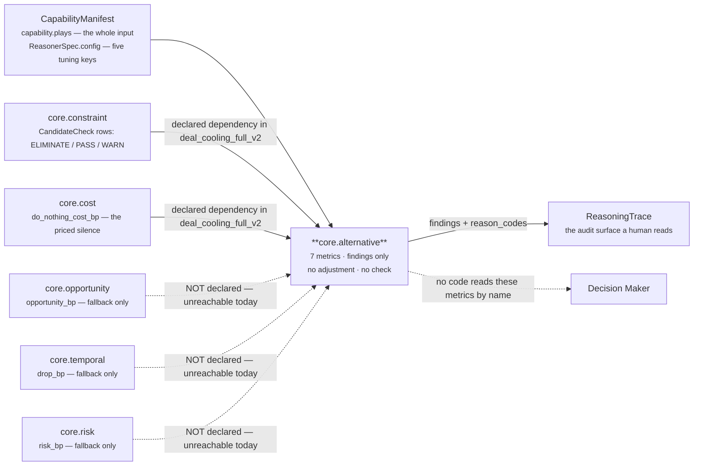
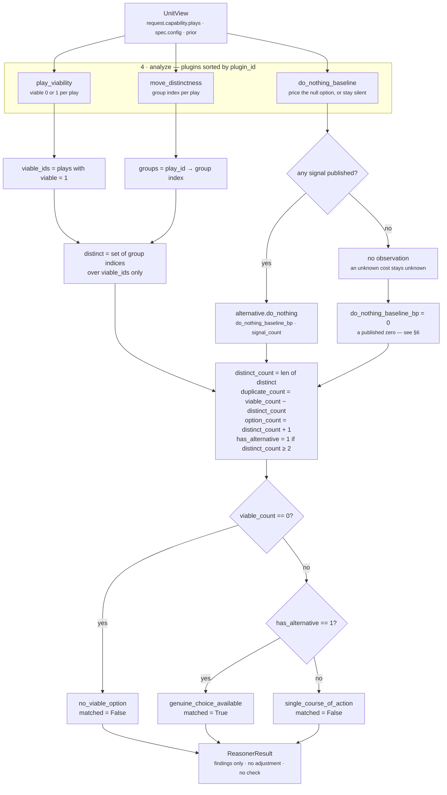

# `core.alternative` — the Alternative Unit

**Source of truth:** `genios_engine/reason/reasoners/alternative_unit.py` (416 lines)
**Class:** `alternative_unit.py:AlternativeUnit` · `unit_id = "core.alternative"` · `version = "1.0.0"`
**Category:** `UnitCategory.DECISION_SUPPORT`
**Contract:** `tests/test_unit_alternative_unit.py` — 26 tests, all passing
**Registered:** `reasoners/__init__.py:52` — `DECISION_SUPPORT = (AlternativeUnit, ValidationUnit, RecommendationUnit)`, **first of three**
**Shipped in:** `packs/capabilities/deal_cooling_v2.py:122` — `_spec("core.alternative", ("core.constraint", "core.cost"))`, no config

---

## 1 · What it is for

*What else could be done here, and what does doing nothing actually cost?*

Every other unit in Part 2 examines the **situation**. This one examines the **option set** — the
thing an executive is actually handed. The module docstring states the case in one sentence:

> *"A recommendation with no visible alternatives is not a recommendation, it is an instruction, and
> an instruction cannot be argued with."*

It answers three separable questions, one per plugin, and refuses a fourth:

| Question | Plugin | Answer shape |
|---|---|---|
| Which declared plays are genuinely still available? | `play_viability` | one claim per play: `viable` 0 or 1 |
| Are two of these "options" the same move wearing different labels? | `move_distinctness` | a group index per play |
| What does standing still cost? | `do_nothing_baseline` | one basis-point price, or **silence** |
| *Which one should we take?* | **none** | refused — that is `reason/decision_maker.py` |

Two boundaries hold it to analysis, and both are enforced structurally rather than by convention:

**It counts options; it never orders them.** `evaluate_meaning` returns a `Verdict` with
`adjustments=()` and `checks=()` — the fields are simply never populated. No candidate is touched.
Pinned by `test_the_unit_never_touches_a_candidate`.

**It defers to the units that already ruled.** It does not re-evaluate preconditions or policies —
`core.constraint` owns that — it reads the `CandidateCheck` rows those units published. Where nobody
screened the roster at all it says so out loud (`viability_unscreened`) rather than reporting an
unchecked roster as a clean bill of health. Likewise it reads a deployed cost unit's price of
inaction instead of deriving a second, disagreeing number for the same silence.

---

## 2 · Its place in the pipeline



The three dotted edges are the unit's central wiring hazard and they are covered in §6. The solid
edge from `core.cost` is the one that matters most, because `core.cost` **always** publishes
`do_nothing_cost_bp` — see §6 defect 1.

`core.alternative` runs **first** of the three Decision Support units. Neither `core.validation` nor
`core.recommendation` declares it as a dependency in the shipped capability, so nothing in the run
consumes what it publishes.

---

## 3 · What exists

### 3.1 · The three plugins

Registered as `plugins = (DoNothingBaselinePlugin(), MoveDistinctnessPlugin(),
PlayViabilityPlugin())`. `unit.py:ReasoningUnit.analyze` sorts by `plugin_id`, so the execution order
is the alphabetical one below — a property of the composition, not of the class body. Observation
order reaches the finding order and therefore the `semantic_hash`, so this sort is load-bearing.

| # | `plugin_id` | Class | `Observation.kind` | Claim | Emits `metrics` | Doc |
|---|---|---|---|---|---|---|
| 1 | `do_nothing_baseline` | `DoNothingBaselinePlugin` | `alternative.do_nothing` | What the null option costs | `do_nothing_baseline_bp`, `signal_count` | [03a](03a-plugin-do_nothing_baseline.md) |
| 2 | `move_distinctness` | `MoveDistinctnessPlugin` | `alternative.signature:<play_id>` | Whether two plays are one move | `group`, `group_size` | [03b](03b-plugin-move_distinctness.md) |
| 3 | `play_viability` | `PlayViabilityPlugin` | `alternative.viability:<play_id>` | Whether a play is still on the table | `viable`, `expected_value_bp`, `elimination_count` | [03c](03c-plugin-play_viability.md) |

Two of the three emit **one observation per play**; only `do_nothing_baseline` emits a single
roster-level observation, and it is the only one that can stay silent.

> **Why the play id travels inside `kind`.** `Observation` has no play field — the framework gives
> plugins no way to name a candidate, deliberately. Where a claim is about one specific play its
> identity rides in the `kind` after a colon, and `_suffix` splits it back out. That same string
> becomes the `finding_id`, so the audit trail says which option each row is talking about.

### 3.2 · The published metrics

```python
publishes = ("declared_count", "viable_count", "distinct_count", "duplicate_count",
             "option_count", "has_alternative", "do_nothing_baseline_bp")
```

| Metric | Range | Meaning | Present when |
|---|---|---|---|
| `declared_count` | 0–n | How many plays the capability declared | **always** |
| `viable_count` | 0–`declared_count` | How many survived both viability screens | **always** |
| `distinct_count` | 0–`viable_count` | How many genuinely different **moves** the survivors are | **always** |
| `duplicate_count` | 0–n | `viable_count − distinct_count` — viable plays collapsed into a shared move | **always** |
| `option_count` | 1–n | `distinct_count + 1` — the moves plus the null option | **always**, never 0 |
| `has_alternative` | 0 or 1 | 1 only when **two or more** distinct moves survive | **always** |
| `do_nothing_baseline_bp` | 0–10,000 | The price of standing still. `7,500bp` means 0.75 | **always — including when nothing measured it.** See §6 defect 2 |

Six of the seven are counts, not basis points, so `unit.py:ReasoningUnit.build`'s `_bp` clamp touches
only the last one. The unit publishes none of the reserved shared metrics — pinned by
`test_the_unit_never_publishes_a_reserved_shared_metric`, which also asserts
`set(result.metrics) <= published`.

### 3.3 · Which stages it implements

| Stage | Overridden? | Doc |
|---|---|---|
| 1 · Input | n/a — fixed by the template method | [01](01-Input-and-Validator.md) |
| 2 · Validator | **no** — base `unit.py:ReasoningUnit.validate` | [01](01-Input-and-Validator.md) |
| 3 · Retriever | **no** — base `unit.py:ReasoningUnit.retrieve` | [02](02-Retriever.md) |
| 4 · Analyzer | **no** — base `unit.py:ReasoningUnit.analyze` | [03](03-Analyzer.md) |
| 5 · Calculator | **yes** — `@abstractmethod`, must be | [04](04-Calculator.md) |
| 6 · Evaluator | **yes** — `@abstractmethod`, must be | [05](05-Evaluator.md) |
| 7 · Builder | **no** — base `unit.py:ReasoningUnit.build` | [06](06-Builder-and-Metrics.md) |
| 8 · Metrics | declared in `publishes` | [06](06-Builder-and-Metrics.md) |

Four of the eight stages are the base class unchanged. `AlternativeUnit` is 120 lines of class body
(`alternative_unit.py:293-412`); the other 296 lines are the module docstring, three plugins, six
module helpers and the prose arguing them.

### 3.4 · The module helpers

| Symbol | Lines | Job |
|---|---|---|
| `_ABSENT = -1` | 55 | Sentinel that cannot collide with a published basis point, so "measured zero" and "never ran" stay distinguishable |
| `_VIABILITY_PREFIX` · `_SIGNATURE_PREFIX` · `_BASELINE_KIND` | 60–62 | The three observation kinds, as constants so `calculate` and `evaluate_meaning` cannot drift from the plugins |
| `_config_bp(view, key, default)` | 65–75 | Read one tuning knob as integer bp, raise on anything else |
| `_config_id(view, key, default)` | 78–83 | Read which unit supplies a signal; raise on non-string or blank |
| `_prior_bp(view, key, default_unit, metric)` | 86–89 | One published signal, or `None` when its owner did not complete |
| `_plays(view)` | 92–94 | The roster in one total order — `sorted(..., key=play_id)` |
| `_suffix(kind)` | 97–98 | Pull the play id back out of an observation kind |
| `_rulings(view)` | 101–121 | `(eliminations by play id, the set of plays anyone ruled on)` |
| `_expected_value(play)` | 124–130 | `impact_bp × success_probability_bp ÷ 10,000`, half-up |
| `_move_signature(play)` | 133–150 | `(normalised sorted steps, read_only, external_recipient_required)` |

---

## 4 · Internal flow



Three rules the module docstring states, and where each lives:

**A play another unit eliminated is not an option.** `_rulings` reads `CandidateCheck` rows out of
every **completed** prior result and collects the `ELIMINATE` ones. `PlayViabilityPlugin` reports
that fact; it never re-derives it. *"A play another unit eliminated is not an option, however good it
looks on paper."*

**An unchecked roster is not a clean one.** `_rulings` returns a second value — the set of plays
anyone ruled on at all — precisely so that "screened and clean" and "nobody looked" produce different
reason codes. Reporting an unscreened roster as fully viable *"would be exactly the fabrication
Layer 4 exists to prevent."*

**An unknown cost of waiting stays unknown.** `DoNothingBaselinePlugin` returns `()` when nothing
published a signal, because *"reporting it as zero would tell a human that doing nothing is free,
which is the single most expensive thing this unit could get wrong."* The plugin honours this; the
Calculator then breaks it — §6 defect 2.

---

## 5 · Every config key

All five are read from `ReasonerSpec.config` — per-capability tuning authored in Layer 3 and
versioned with the manifest. The shipped `sales.deal_cooling_full` authors **none** of them, so the
unit runs on defaults for everything.

| Key | Read by | Type | Default | Validator | Effect when absent |
|---|---|---|---|---|---|
| `viable_value_floor_bp` | `PlayViabilityPlugin` | int bp 0–10,000 | `500` | `_config_bp` | a play worth under 500bp in expectation is not presented as an option |
| `inaction_cost_source` | `DoNothingBaselinePlugin` | non-blank str | `"core.cost"` | `_config_id` | `core.cost` owns the price of inaction |
| `headroom_source` | `DoNothingBaselinePlugin` | non-blank str | `"core.opportunity"` | `_config_id` | headroom read from `core.opportunity.opportunity_bp` |
| `momentum_source` | `DoNothingBaselinePlugin` | non-blank str | `"core.temporal"` | `_config_id` | momentum read from `core.temporal.drop_bp` |
| `exposure_source` | `DoNothingBaselinePlugin` | non-blank str | `"core.risk"` | `_config_id` | exposure read from `core.risk.risk_bp` |

The metric **names** are hardcoded (`do_nothing_cost_bp`, `opportunity_bp`, `drop_bp`, `risk_bp`);
only the unit that supplies each is configurable. So a capability can appoint a domain unit as its
own authority for a signal — `test_a_capability_may_appoint_its_own_inaction_authority` points
`headroom_source` at `sales.pipeline_decay` — but that substitute must publish under the same metric
name.

### 5.1 · Config validation is lazy, but only barely

`_config_bp` is called inside `PlayViabilityPlugin.contribute` **after** the empty-roster guard, and
`_config_id` inside `_prior_bp`, which runs once per source. In practice both are reached on every
run of a real capability, because a manifest must declare at least one play
(`contracts/reasoning.py:380` — *"capability requires at least one play"*). So unlike `core.impact`,
a malformed value here fails on the first run rather than on the first deal that happens to carry a
field.

Verified against the live module:

```text
config={"viable_value_floor_bp": 25000}  → ValueError: viable_value_floor_bp must be integer basis points
config={"viable_value_floor_bp": True}   → ValueError: viable_value_floor_bp must be integer basis points
config={"viable_value_floor_bp": 500.0}  → ValueError raised EARLIER, by ReasonerSpec canonicalisation:
                                            "floats are forbidden in semantic artifacts"
config={"headroom_source": "   "}        → ValueError: headroom_source must name a reasoning unit
```

The float case never reaches `_config_bp` at all — `platform/canonical.py` rejects it when the
`ReasonerSpec` is constructed. The reasoning given in `_config_bp` for failing loudly:

> *"Tuning is authored in Layer 3 and ships inside the versioned capability, so a malformed value is
> a deployment fault. It must fail loudly here rather than quietly become a plausible-looking option
> count somewhere downstream."*

A `ValueError` out of `contribute` propagates through `analyze` and `evaluate` to the orchestrator,
which turns it into `ResultStatus.FAILED` with the message in `diagnostics`.

---

## 6 · Known defects and compromises

| # | What | Where | Severity |
|---|---|---|---|
| 1 | **The three fallback signals are structurally unreachable in the shipped capability, twice over.** `_prior_bp` treats only the `-1` sentinel as absent, and `core.cost` publishes `do_nothing_cost_bp` **unconditionally** — `cost_unit.py:266` always includes the key, defaulting to `clamp_bp(0 + 0) = 0`. So whenever `core.cost` is a declared dependency and completes, `priced` is an integer, the plugin returns immediately, and `headroom_source` / `momentum_source` / `exposure_source` are never read. Independently, `deal_cooling_v2.py:122` declares only `("core.constraint", "core.cost")`, so `core.opportunity`, `core.temporal` and `core.risk` are not in `view.prior` either. Verified: `core.cost` at `do_nothing_cost_bp = 0` alongside `core.opportunity` at `9,000bp` yields `do_nothing_baseline_bp = 0, signal_count = 1, ("inaction_priced_upstream",)`. **On a large deal that has been quiet for days, the card says standing still is free.** | `alternative_unit.py:258-265` + `deal_cooling_v2.py:122` | **high** — silent, and it is the exact failure the plugin docstring names as the worst one |
| 2 | **The Calculator publishes a zero the plugin refused to publish.** `DoNothingBaselinePlugin` returns `()` when nothing measured the silence — Law 3, *silence is not zero*. `calculate` then writes `"do_nothing_baseline_bp": ... if baseline else 0`. A consumer reading `reason_codes` sees `do_nothing_cost_unknown`; a consumer reading only `metrics` sees a measured-looking `0`. `core.recommendation` in the same category omits its metrics in the same situation, so the two units disagree on an absolute law. Fixing it is a one-line change to the returned mapping and it breaks every existing decision hash. | `alternative_unit.py:340-341` | **high** — a known, recorded inconsistency |
| 3 | **`viability_unscreened` is a roster-level flag reported per play.** `_rulings` returns `ruled` as the set of plays *anyone* ruled on, and the plugin appends the code when `ruled` is empty. If a constraint unit ruled on **one** play out of five, the other four are reported `option_available` with no unscreened marker. Verified: two plays, `core.constraint` emitting one `PASS` on play `a` — play `b` comes back `('option_available',)` with no flag. An author reading the audit trail cannot tell that `b` was never looked at. The per-play fix is `play.play_id not in ruled`, which is the same number of characters. | `alternative_unit.py:186-187` | medium |
| 4 | **Upstream reason codes leak into this unit's reason-code namespace.** The eliminating unit's `reason_code` is copied into the viability observation and then unioned into the unit's `reason_codes`. A run where `core.constraint` eliminated on `read_only_policy` produces `read_only_policy` in `core.alternative`'s codes. That is deliberate — *"the reason it left the field travels with it, so the option set can be argued with"* — but it means the code set is not owned by this unit, and a downstream consumer matching on codes cannot assume a code it sees was authored here. | `alternative_unit.py:181` | design note, worth knowing |
| 5 | **Nothing downstream reads any of the seven metrics by name.** A grep across `genios_engine/` for `has_alternative`, `option_count`, `distinct_count` and `do_nothing_baseline_bp` returns hits only inside `alternative_unit.py`. Neither `decision_maker.py` nor `executive/` nor `deliver/` consumes them. The unit's entire mechanical effect on a decision today is zero; its output travels into `ReasoningTrace` as explanation. Defensible for a shadow-mode candidate, but it means defects 1–3 have never been felt by anything. | layer-wide | acknowledged |
| 6 | **Two dead guards.** `if not plays: return ()` appears in both roster plugins, but `CapabilityManifest.__post_init__` already refuses a manifest with no plays, so neither branch can be reached through a valid request. And `groups.get(play_id, -1 - index)` in `calculate` handles a viable play with no grouping — impossible, because both plugins iterate the identical `_plays(view)` result. Harmless defensive code; it reads as though the two plugins could disagree about the roster. | `alternative_unit.py:170, 215, 332` | low |
| 7 | **The value floor is a guess.** `viable_value_floor_bp = 500` was authored from domain reasoning, not fitted to data, and no shipped capability overrides it. It is the only threshold in the unit and it silently removes plays from the option set. | `alternative_unit.py:172` | acknowledged |
| 8 | **The unit cites nothing.** It declares no `required_fields`, so `view.evidence_ids` is empty, and no plugin attaches `evidence_ids` to an observation. Every run therefore produces `result.evidence_ids == ()` while asserting `matched=True` findings — which `validation_unit.py:_asserts_a_claim` counts as an ungrounded claim. It escapes today only because `core.validation` does not declare `core.alternative` as a dependency. See [02 · Retriever](02-Retriever.md) for the one lever an author has. | `alternative_unit.py` throughout | medium, latent |

---

## 7 · The canonical worked example

`test_the_quiet_renewal_presents_three_real_options_and_the_price_of_silence` — a renewal gone quiet
three weeks out, five declared plays, one eliminated on policy, two of the survivors the same drafted
reply written up twice. Every number below was re-derived by running the live unit.

```text
plays (sorted by play_id — never manifest order)
  accept_partial_scope   steps ("Offer a reduced first phase",)          impact 5000  succ 6000  ro True
  auto_send_reminder     steps ("Send the reminder automatically",)      impact 6000  succ 7000  ro False
  escalate_to_sponsor    steps ("Draft a note to the economic sponsor",) impact 7000  succ 5000  ro True
  reply_to_buyer         steps ("Draft a grounded reply to the buyer",)  impact 6000  succ 7000  ro True
  reply_to_buyer_v2      steps ("Draft a  Grounded reply TO the buyer",) impact 6000  succ 7000  ro True

prior (all COMPLETED)
  core.constraint   checks: auto_send_reminder ELIMINATE read_only_policy
                            reply_to_buyer     PASS      read_only_policy_pass
  core.opportunity  opportunity_bp 6000
  core.temporal     drop_bp        4000
  core.risk         risk_bp        2000

4 · analyze  (plugin_id order: do_nothing_baseline, move_distinctness, play_viability)

  do_nothing_baseline
    core.cost absent → fall through to the three signals
    ordered by (-value, code) → 6000 headroom_lapses · 4000 momentum_decays · 2000 exposure_compounds
    cost = 6000 + half_up(4000 + 2000, 4) = 6000 + half_up(6000, 4) = 6000 + 1500 = 7500
    alternative.do_nothing  {do_nothing_baseline_bp 7500, signal_count 3}
      codes: exposure_compounds · headroom_lapses · inaction_has_a_price · momentum_decays

  move_distinctness   (group index assigned in sorted-roster order)
    accept_partial_scope  group 0  size 1   play_is_a_distinct_move
    auto_send_reminder    group 1  size 1   play_is_a_distinct_move
    escalate_to_sponsor   group 2  size 1   play_is_a_distinct_move
    reply_to_buyer        group 3  size 2   plays_share_one_move
    reply_to_buyer_v2     group 3  size 2   plays_share_one_move
      ("Draft a  Grounded reply TO the buyer" lowercases and whitespace-collapses to
       "draft a grounded reply to the buyer" — the same instruction)

  play_viability      (floor 500bp, the default)
    accept_partial_scope  EV = half_up(5000 × 6000 / 10000) = 3000  viable 1  option_available
    auto_send_reminder    EV = half_up(6000 × 7000 / 10000) = 4200  viable 0  option_eliminated_upstream
                                                                              + read_only_policy
    escalate_to_sponsor   EV = half_up(7000 × 5000 / 10000) = 3500  viable 1  option_available
    reply_to_buyer        EV = 4200                                 viable 1  option_available
    reply_to_buyer_v2     EV = 4200                                 viable 1  option_available

5 · calculate
    viable_ids       = [accept_partial_scope, escalate_to_sponsor, reply_to_buyer, reply_to_buyer_v2]
    their groups     = {0, 2, 3, 3}  →  distinct = {0, 2, 3}
    declared_count   = 5
    viable_count     = 4
    distinct_count   = 3
    duplicate_count  = 4 − 3 = 1
    option_count     = 3 + 1 = 4          # three moves plus doing nothing
    has_alternative  = 1                  # 3 >= 2
    do_nothing_baseline_bp = 7500

6 · evaluate_meaning
    viable_count > 0 and has_alternative == 1 → genuine_choice_available
    duplicate_count > 0                       → false_choice_in_roster
    a baseline observation exists             → no do_nothing_cost_unknown
    matched = True

7 · build
    metrics      declared_count 5 · viable_count 4 · distinct_count 3 · duplicate_count 1
                 option_count 4 · has_alternative 1 · do_nothing_baseline_bp 7500
    findings     5 viability + 2 signature (only the group_size > 1 pair) + 1 baseline + 1 option_set = 9
    reason_codes exposure_compounds · false_choice_in_roster · genuine_choice_available ·
                 headroom_lapses · inaction_has_a_price · momentum_decays · option_available ·
                 option_eliminated_upstream · play_is_a_distinct_move · plays_share_one_move ·
                 read_only_policy
    adjustments  ()
    checks       ()
    evidence_ids ()
    semantic_hash 7e7066301ed10826b1ca372df03bee4a212d7ddf5e9dee615176b8dde4021182
```

Read as a sentence: *five plays were declared, one is unavailable on policy and two are the same
move, so three genuinely different things could be done — plus doing nothing, which costs 7,500bp.
Nothing here says which to take.*

### 7.1 · The same unit on the shipped capability

`sales.deal_cooling_full`, three plays, `core.constraint` and `core.cost` as declared dependencies,
`core.cost` reporting `do_nothing_cost_bp = 6,200`. Re-derived live:

```text
clarify_next_step     impact 6500 × succ 6000 → EV 3900   viable 1
multithread_account   impact 7500 × succ 4000 → EV 3000   viable 1
restore_momentum      impact 8000 × succ 5500 → EV 4400   viable 1
all three steps differ → 3 distinct groups

declared_count 3 · viable_count 3 · distinct_count 3 · duplicate_count 0
option_count 4 · has_alternative 1 · do_nothing_baseline_bp 6200
matched True
codes  genuine_choice_available · inaction_priced_upstream · option_available · play_is_a_distinct_move
semantic_hash 03cd7e93f0d2c89f6924bdc6b1db8b2ad53edf8062af1c1298b1e6e0e611d643
```

The shipped roster is clean: three real moves, no duplicates, nothing eliminated. Note what did
**not** happen — `core.opportunity` and `core.temporal` also ran in that plan and neither reached
this unit, because `core.cost` answered first and the manifest never declared them. Had `core.cost`
reported `0`, the answer would have been *"standing still is free"* with no code saying otherwise.

---

## 8 · The files

| File | Stage | Answers |
|---|---|---|
| [01 · Input and Validator](01-Input-and-Validator.md) | 1–2 | What arrives, why `required_fields` is empty, and the one way this unit can refuse to reason |
| [02 · Retriever](02-Retriever.md) | 3 | Why the `UnitView` is empty of facts, and why the unit works anyway |
| [03 · Analyzer](03-Analyzer.md) | 4 | The plugin seam: three independent claims, one shared roster, no cross-talk |
| [03a · `do_nothing_baseline`](03a-plugin-do_nothing_baseline.md) | 4 | Two paths to a price, three ways to stay silent |
| [03b · `move_distinctness`](03b-plugin-move_distinctness.md) | 4 | What makes two plays the same move, and what deliberately does not |
| [03c · `play_viability`](03c-plugin-play_viability.md) | 4 | Two screens, neither a ranking |
| [04 · Calculator](04-Calculator.md) | 5 | Counting moves rather than rows, and the `+1` that never leaves |
| [05 · Evaluator](05-Evaluator.md) | 6 | What `matched` means here, and the four named negatives |
| [06 · Builder and Metrics](06-Builder-and-Metrics.md) | 7–8 | The `ReasonerResult`, the empty evidence tuple, and who reads these metrics |

### Related

| Document | Covers |
|---|---|
| [Category 4 · Decision Support](../README.md) | The three units of this category and how they divide the work |
| [Part 2 · The Unit Framework](../../README.md) | The eight stages, the plugin seam, the roster invariants |
| [Category 3 · Optimization](../../03-Optimization/README.md) | `core.cost`, which owns `do_nothing_cost_bp` — the authority this unit defers to |
| [Category 1 · Situation Understanding](../../01-Situation-Understanding/README.md) | `core.constraint`, which owns the eliminations this unit reads |
| [Layer 4 · Overview](../../../00-Overview.md) | The three parts and the laws that bind all of them |
