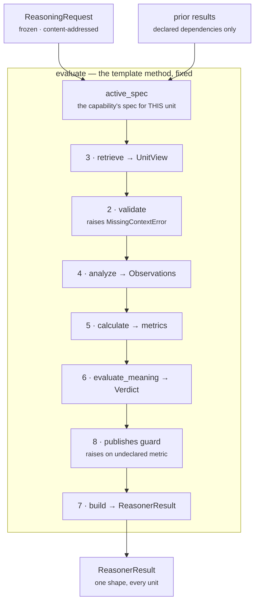
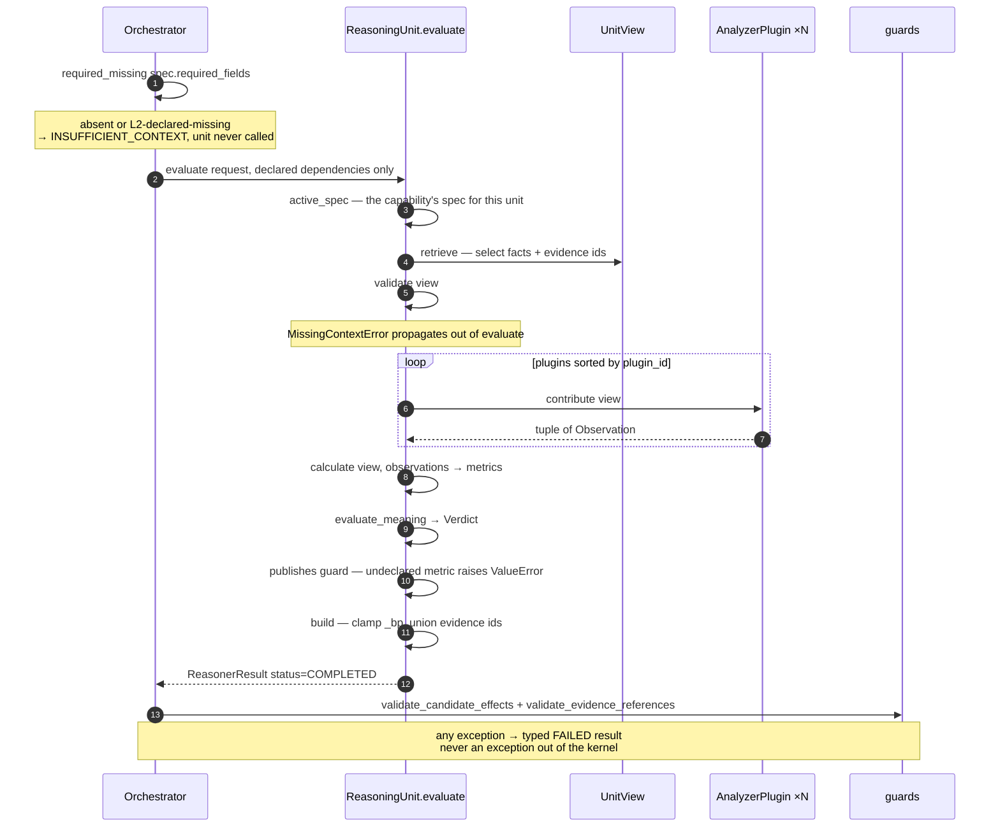
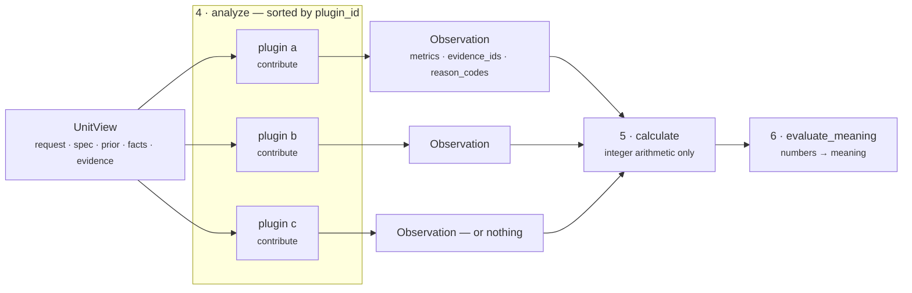
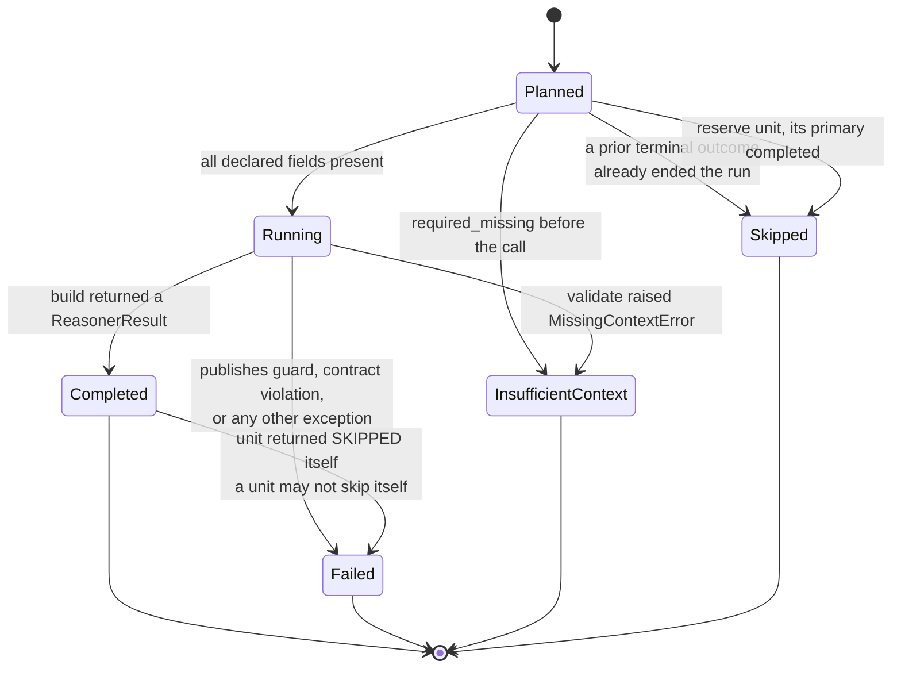
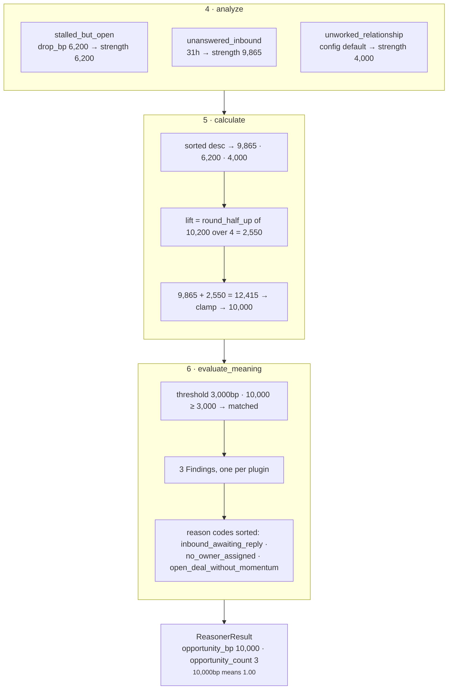

# Part 2 · The Unit Framework

**Module:** `genios_engine/reason/unit.py` (~266 lines)
**Roster:** `genios_engine/reason/reasoners/` — 17 framework units, 6 supplementary reasoners, 52 plugins
**Contract:** `tests/test_unit_roster.py` — 88 parametrised assertions over the roster as a whole
**Question it answers:** *what does every reasoning unit have in common, and what stops any one of them from becoming special?*

The [Overview](../00-Overview.md) covers why Layer 4 exists and how its three parts divide the work.
This document is only about Part 2's substrate: the base class, the plugin seam, and the invariants
that hold across all seventeen units at once.

---

## 1 · What the blueprint asked for

The architecture spends most of its ink on the seventeen units, then makes one structural demand
that turns out to matter more than any individual unit:

> *Instead of designing every unit differently, every unit should have Input → Validator →
> Retriever → Analyzer → Calculator → Evaluator → Output Builder. Exactly the same. This becomes
> your reasoning framework.*

And then a second, sharper one:

> *…I would go one level deeper. Analyzer should itself have plugins. Now Risk isn't one algorithm.
> It's 20 small deterministic algorithms.*

Both sentences are about the same fear. Seventeen bespoke units is seventeen review surfaces,
seventeen test styles, seventeen ways to be subtly wrong, and no way to onboard an engineer onto
the eighteenth. A unit that looks like every other unit can be reviewed, timed, tested, and
replaced by someone who has never seen it before. The plugin demand pushes the same argument one
level down: a monolithic `calculate_risk()` is a single opaque number, whereas *time decay*,
*revenue exposure*, *relationship health* and *policy* are four separate claims, each with its own
evidence, each testable and tunable alone.

The literal reading of the spec adds a third thing that is not stated but is implied by its
TypeScript examples — **eight files per unit** (`input.ts`, `validator.ts`, `retriever.ts`, …).
That part we did not build, for reasons set out in §3.

The framework was also the biggest measured gap in the layer before this pass. From the deployment
record: *"Unit framework — **Zero** units implemented the 8-stage anatomy; each was one `evaluate()`
of 37–142 lines"*, and *"Analyzer plugins — did not exist anywhere in the layer"*.

---

## 2 · What exists

One abstract base class, `unit.py:ReasoningUnit`, plus five supporting types. Every one of the
seventeen core units subclasses it. `UNIT_FRAMEWORK_VERSION` is pinned at `1.0.0`.

### 2.1 · The eight stages, and who owns each

| # | Stage | Symbol | Overridable | Default behaviour |
|---|---|---|---|---|
| 1 | Input | `unit.py:ReasoningUnit.evaluate` argument pair | no | `ReasoningRequest` + `Mapping[str, ReasonerResult]` of *declared dependencies only* |
| 2 | Validator | `unit.py:ReasoningUnit.validate` | yes | Raise `MissingContextError` for any absent `spec.required_fields` |
| 3 | Retriever | `unit.py:ReasoningUnit.retrieve` | yes | Select declared root facts + their evidence ids into a `UnitView` |
| 4 | Analyzer | `unit.py:ReasoningUnit.analyze` | yes (nobody does) | Run every plugin in `plugin_id` order, concatenate their `Observation`s |
| 5 | Calculator | `unit.py:ReasoningUnit.calculate` | **abstract** | — |
| 6 | Evaluator | `unit.py:ReasoningUnit.evaluate_meaning` | **abstract** | — |
| 7 | Builder | `unit.py:ReasoningUnit.build` | yes | Assemble one `ReasonerResult`, clamping every `_bp` metric |
| 8 | Metrics | `ReasoningUnit.publishes` class attribute | declared | Guard raises on any undeclared metric in the `Verdict` |

Stages 5 and 6 are `@abstractmethod`. A subclass that omits either cannot be instantiated, which is
the mechanism that makes "a unit calculates and a unit interprets" a compile-time fact rather than
a code-review note.



Two things in that diagram are worth pausing on, because both are non-obvious and both are
deliberate.

**Retrieve runs before validate.** The spec's ordering is Validator → Retriever. The code inverts
it, because the default validator's own subject is the `UnitView` — it reads `view.spec` and
`view.request` — and building the view is what turns a raw request into the bounded window a
validator can reason about. Nothing is lost: `retrieve` is selection over an immutable mapping and
cannot fail on data it would later reject, so validating after it is strictly the same decision
made with more information in hand.

**The publishes guard sits between the Evaluator and the Builder**, not inside the Builder. A unit
that published an undeclared metric would still produce a well-formed `ReasonerResult`; the guard's
job is to refuse *before* that object exists, so the failure is "this unit is misdeclared" rather
than "this result contains something surprising".

### 2.2 · The five supporting types

| Type | File | What it is | Immutable |
|---|---|---|---|
| `UnitCategory` | `unit.py:UnitCategory` | The four families, declared per unit rather than inferred | `str` enum |
| `UnitView` | `unit.py:UnitView` | The unit's bounded window: request, spec, prior results, selected facts, evidence ids | frozen, slots |
| `Observation` | `unit.py:Observation` | One plugin's partial contribution | frozen, slots, metrics `MappingProxyType` |
| `AnalyzerPlugin` | `unit.py:AnalyzerPlugin` | `runtime_checkable` protocol: `plugin_id` + `contribute(view)` | protocol |
| `Verdict` | `unit.py:Verdict` | The Evaluator's reading, before it becomes a result | frozen, slots |

### 2.3 · The roster on the framework

All 17 core units are framework units. Six supplementary reasoners are not — they implement the
bare `protocols.py:Reasoner` protocol directly with a hand-written `evaluate()`.

| Group | Units | On the framework |
|---|---|---|
| Situation Understanding | `core.context`, `core.timeline`, `core.dependency`, `core.constraint` | yes |
| Business Evaluation | `core.risk`, `core.opportunity`, `core.impact`, `core.priority`, `core.confidence` | yes |
| Optimization | `core.tradeoff`, `core.resource`, `core.scheduling`, `core.cost`, `core.policy` | yes |
| Decision Support | `core.alternative`, `core.validation`, `core.recommendation` | yes |
| Supplementary | `legacy.rule`, `legacy.score_gate`, `core.temporal`, `core.relationship`, `core.signal_composition`, `core.planning` | **no** |

Sixteen framework units register exactly three plugins; `core.scheduling` registers four. **52
plugins total.** Registration is explicit and central in `reasoners/__init__.py` — there is no
auto-discovery, because *"a unit appearing in the runtime because a file happened to be importable
is how a decision gets made by something nobody reviewed"*.

---

## 3 · The gap, and why

### 3.1 · The Retriever does not fetch — it selects

This is the framework's largest departure from the spec, and it is forced rather than chosen.

Units are forbidden database, network, clock, random, environment and LLM access. Retrieval already
happened: Layer 2 froze a `ContextSnapshot` and Layer 4 hashes its content into the request id. A
unit that fetched anything would be reading state the decision was never hashed against, and every
replay of that decision would be a different decision wearing the same id.

So `retrieve` means *select and shape*:

```python
wanted = tuple(field for field in spec.required_fields if not field.startswith("neighbor:"))
facts = {name: request.context.facts[name] for name in wanted if name in request.context.facts}
evidence = tuple(sorted(item.evidence_id for item in request.context.evidence
                        if item.field in facts))
```

Three consequences follow, and only the first is documented in the code.

1. **Evidence is derived from selection, not asserted.** A unit's `evidence_ids` are exactly the
   ids of the fields it was allowed to look at. It cannot cite a row it did not select, and
   `guards.py:validate_evidence_references` re-checks that at the orchestrator boundary anyway.
2. **`neighbor:`-scoped fields are validated but never selected.** `common.py:missing_fields`
   honours the `neighbor:` prefix and will refuse a run whose neighbourhood fact is absent, but
   `retrieve` filters those fields out of `wanted`, so they never reach `view.facts`. A unit that
   needs a neighbour fact must reach for `common.py:fact_value(..., neighbor=True)` or override the
   stage. This is a live inconsistency between the two halves of the same declaration, not a
   designed asymmetry.
3. **The evidence filter ignores `context_scope`.** `EvidenceRef` carries `context_scope` of
   `"root"` or `"neighbor"`; the base retriever matches only on `item.field in facts`. A
   neighbour-scoped evidence item whose field name collides with a selected root fact will be
   attached to the result as though the unit had observed it. Harmless today because no shipped
   capability has a colliding name; it is a one-line fix waiting for the first one that does.

### 3.2 · The stages are methods, not eight files

We built one base class enforcing the same eight stages. Eight files around a forty-line
calculation is ceremony that buys nothing the base class does not already give — uniformity,
isolated testability, and the plugin seam. The 17 units average around 330 lines each *including*
their plugins and their docstrings; splitting each into eight files would produce 136 files, most
of them under twenty lines.

### 3.3 · `evaluate()` is a template method by convention, not by enforcement

The docstring is explicit about the intent — *"Deliberately not overridable in spirit: the sequence
**is** the framework"* — and it is honest about the mechanism by saying *in spirit*. Python has no
`final`. Nothing in `unit.py` prevents a subclass from overriding `evaluate` and skipping
validation entirely.

**Verified:** no `ReasoningUnit` subclass in the roster overrides `evaluate` or `analyze`. Six
subclasses override `validate`, three override `retrieve`, one (`core.confidence`) overrides
`build`. The seam holds today because every author respected it, and because
`tests/test_unit_roster.py` would catch the second-order symptoms — a unit with no plugins, a unit
with no `publishes`, a duplicate publisher — rather than the override itself.

If this layer is going to production, this is the cheapest hardening available: a
`__init_subclass__` hook rejecting a subclass that defines `evaluate`. It is not built.

### 3.4 · The `publishes` guard has an escape hatch, and one unit is in it

The guard reads:

```python
undeclared = sorted(set(verdict.metrics) - set(self.publishes)) if self.publishes else []
```

A unit with an empty `publishes` tuple is unguarded. `test_unit_roster.py` closes that for the
roster — `assert instance.publishes, "a unit must declare what it publishes"` — but the check lives
in the test, not the framework, so a unit that never joins the roster inherits no guard at all.

More interestingly, one shipped unit works *around* the guard on purpose.
`core.confidence` emits `completeness_bp` in its result and its finding, but cannot declare it,
because `core.context` already declares that name and the one-publisher-per-metric invariant would
fail. The unit therefore carries an explicit exception list:

```python
UNDECLARED_METRICS = ("completeness_bp",)
```

`evaluate_meaning` strips those names out of the `Verdict` so the guard passes, and
`confidence.py:ConfidenceReasoner.build` puts them back by assembling the result from the
decomposition finding instead of the verdict. The reason given is preservation, not convenience:
*"removing or renaming it would change every decision hash"*. It is a name collision recorded
rather than fixed, and it is the one place in the roster where the framework's own guard is routed
around by design.

### 3.5 · The roster invariants bind only units that opted in

`test_unit_roster.py` reads `getattr(instance, "publishes", ())`. The six supplementary reasoners
have no such attribute, so they are invisible to both the one-publisher rule and the reserved-metric
rule.

That is not theoretical. `core.temporal` emits `urgency_bp` directly in its
`ReasonerResult.metrics`:

```python
urgency_bp = clamp_bp(drop_bp + min(hours, 168) * 20)
```

`urgency_bp` is a RESERVED metric that, per the test's own docstring, *"may only be published by
core.priority"*. The test passes because `TemporalReasoner` declares no `publishes` tuple.

The system survives this because `decision_maker.py:priority_metrics` does not take the last
`urgency_bp` it sees — it scans results in order and **breaks at the priority authority**, so
`core.priority`'s value is the one that stands provided it runs after `core.temporal`, which it
does by dependency. The invariant is therefore preserved by execution order rather than by the test
that claims to enforce it. Worth writing down before someone reorders a plan.

### 3.6 · The purity scan is a substring match on one module

`test_no_unit_reaches_for_a_clock_or_a_database` calls `inspect.getsource(inspect.getmodule(unit))`
and looks for these tokens:

| Banned token | Guards against |
|---|---|
| `datetime.now`, `time.time`, `time.monotonic` | wall-clock reads |
| `random.` | non-reproducible sampling |
| `os.environ` | machine-dependent config |
| `requests.`, `sqlalchemy` | network and database IO |
| `openai`, `anthropic` | any LLM inside `reason/` |

Two known limits. It scans **only the unit's own module**, so a helper in `reasoners/common.py`
that read a clock would pass unnoticed — and `common.py` is where `datetime` legitimately lives, for
`parse_time` and `elapsed_hours`, both of which measure against `request.evaluation_time` rather
than `now()`. And it is a plain substring match, so a docstring that mentioned `random.` would fail
the build for a unit that is perfectly pure. Both are acceptable for a scan whose purpose is to
catch the obvious mistake early; neither should be mistaken for a proof.

### 3.7 · `Verdict` is unvalidated, and one float path survives

`Observation.__post_init__` rejects any non-integer metric, including `bool`. `ReasonerResult`
rejects floats through `platform/canonical.py:canonicalize` — *"floats are forbidden in semantic
artifacts"*. `Verdict` sits between the two and validates nothing.

The consequence is narrow but real. `build` maps `_bp`-suffixed metrics through
`common.py:clamp_bp`, which is `min(10_000, max(0, int(value)))`. `int()` on a float truncates
silently: `clamp_bp(0.7)` returns `0` and `clamp_bp(9999.9)` returns `9999`. A float `_bp` metric in
a `Verdict` is therefore *quietly truncated* instead of rejected, while a float in any non-`_bp`
metric is *loudly rejected* one layer later. The stricter of the two behaviours is the right one.

### 3.8 · The exemplar unit has no dedicated test file

`tests/` contains a `test_unit_*.py` for sixteen of the seventeen units. There is no
`test_unit_opportunity.py`, and no test file anywhere references `OpportunityUnit` or its plugins by
name. `core.opportunity` is exercised only indirectly, through
`tests/test_capability_deal_cooling_full.py`, `tests/test_l4_end_to_end.py`,
`tests/test_situations.py`, and as *fixture input* to the six downstream units that read
`opportunity_bp`. Its decay curve — the piecewise formula in §4.5 — has no direct assertion
anywhere. This is the gap most likely to bite, because it is the one unit whose arithmetic every
document points at as the example.

---

## 4 · How it works inside

### 4.1 · One evaluation, end to end



The first and last interactions are the ones that make the unit safe to write carelessly. Before
`evaluate` is called at all, the orchestrator has already applied `guards.py:required_missing`, which
is *stricter* than the unit's own default validator: it treats a field as missing when it is absent
**or** when Layer 2 explicitly published it in `context.missing_fields`. The unit's default
validator uses `common.py:missing_fields`, which checks presence only. Two definitions of "missing"
coexist; in the orchestrated path the stricter one runs first and the unit's is effectively
unreachable, which matters mostly when a unit is invoked directly from a test.

At the other end, `orchestrator.py:ReasoningOrchestrator._evaluate` wraps the whole call. A
`MissingContextError` becomes `ResultStatus.INSUFFICIENT_CONTEXT` carrying `exc.fields`; any other
exception — including the `publishes` guard's `ValueError` — becomes `ResultStatus.FAILED` with the
exception type and message in `diagnostics`. `diagnostics` is `compare=False, repr=False` and is
outside `to_semantic_dict`, so a failure message can never move a hash.

### 4.2 · Why plugins, and what an Observation is allowed to say

Risk is not one algorithm. It is time decay *plus* revenue exposure *plus* relationship health
*plus* policy, and folding those into one number makes the reasoning unexplainable at exactly the
moment somebody asks *why*.

In the shipped roster that decomposition is spread wider than `unit.py`'s docstring suggests.
`core.risk` carries three plugins — `momentum_decay`, `relationship_health` and `risk_mitigation` —
while `revenue_exposure_bp` is published by `core.impact` and policy compliance by `core.policy`.
The illustration in the docstring describes the *shape* of the idea, not the current wiring of the
risk unit.



`analyze` iterates `sorted(self.plugins, key=lambda item: item.plugin_id)`. Observation order is
therefore a property of the unit's composition rather than of registration order — and observation
order reaches the result's semantic hash through findings and adjustments, so this sort is not
cosmetic.

An `Observation` is constrained in three ways that together stop a plugin from becoming a decision
authority:

- **Integers only.** `__post_init__` rejects any metric that is not an `int`, and rejects `bool`
  explicitly, because `isinstance(True, int)` is `True` in Python and a boolean masquerading as a
  metric is exactly the kind of accident that reaches a ranking formula.
- **Sets, sorted.** `evidence_ids` and `reason_codes` are deduplicated and sorted at construction.
- **Partial by contract.** *"A plugin says 'the last inbound message was 31 days ago, which reads as
  6,200bp of decay'. It does not say what to do about it."* A plugin returning `()` is the normal
  way to say *this axis has nothing to contribute here* — silence, not a zero.

Returning `()` rather than a zero-valued observation is load-bearing in the Calculator. In
`core.opportunity`, three silent plugins produce `opportunity_bp: 0, opportunity_count: 0` and a
`matched=False` verdict; three plugins each reporting `strength_bp: 0` would produce the same
numbers but with `opportunity_count: 3`, which downstream reads as *three signals looked and found
nothing*, a materially different claim from *nothing looked*.

### 4.3 · UnitView, and how a unit reads a dependency

`UnitView` is the whole reason a reviewer can answer "what was this unit allowed to see?" without
reading its body. It carries five things and exposes one convenience property, `config`, which is
`spec.config` — the per-capability tuning authored in Layer 3 and versioned with it.

The dependency reader is `unit.py:UnitView.prior_metric`:

```python
def prior_metric(self, reasoner_id: str, name: str, default: int = 0) -> int:
    result = self.prior.get(reasoner_id)
    if result is None or result.status != ResultStatus.COMPLETED:
        return default
    value = result.metrics.get(name, default)
    return default if isinstance(value, bool) or not isinstance(value, int) else value
```

Three substitutions of the default, all silent: the dependency did not run, the dependency did not
complete, or the metric is not an integer. That is the right default for a unit that can proceed
without the input, and the wrong one for a unit that cannot — which is why `core.risk` deliberately
does *not* use it, and defines its own `risk.py:_published` that coerces through
`common.py:integer` and lets a malformed metric raise:

> *"Risk is summed into the ranking math, so a metric the system cannot read as an integer is an
> authoring fault worth surfacing, not a value to quietly replace with zero."*

The silent path has a sharper edge than the docstring admits. `prior` contains only the
dependencies the capability **declared** in `ReasonerSpec.dependencies` — the orchestrator builds it
as `{item: prior[item] for item in spec.dependencies if item in prior}`, precisely so that passing
every earlier result cannot create hidden order-dependent edges. So a capability author who wires
`core.opportunity` without declaring `core.temporal` as a dependency gets
`prior_metric("core.temporal", "drop_bp", 0) == 0`, which makes `StalledButOpenPlugin` return `()`,
which makes an entire opportunity axis disappear. No error, no reason code, no telemetry. The plan
is valid, the run is deterministic, and one third of the unit is switched off.

### 4.4 · The result lifecycle as the orchestrator sees it



Every one of those transitions produces a `StepTrace` with an `input_hash` and an `output_hash`.
Nothing is dropped: even a reserve unit that stood down is recorded with reason code
`primary_completed:<id>`, so the trace shows the substitute was considered and why it stayed on the
bench.

The `Completed → Failed` edge is the least obvious and the most important. A unit may not decide it
is irrelevant: if it returns `ResultStatus.SKIPPED`, the orchestrator overwrites the result with a
`FAILED` carrying `reasoner_returned_skipped`. Skipping is a scheduling decision, and scheduling
belongs to Part 1.

Note also what `ReasonerResult.__post_init__` enforces at the contract layer: a non-`COMPLETED`
result *cannot* carry `matched`, metrics, findings, adjustments, checks or evidence ids. A unit that
failed halfway cannot leave a partial claim behind for the Decision Maker to trip over.

### 4.5 · Worked example — `core.opportunity`, end to end

`reasoners/opportunity.py` is 153 lines and is the unit to read first, because it is the smallest
one that uses every stage for something.

**What it answers:** *where is there value to gain here that nobody has taken?* Never "this looks
promising" — a specific, evidenced gap between what the situation makes possible and what has
actually happened.

**Declaration.**

```python
unit_id  = "core.opportunity"
version  = "1.0.0"
category = UnitCategory.BUSINESS_EVALUATION
publishes = ("opportunity_bp", "opportunity_count")
plugins  = (UnansweredInboundPlugin(), StalledButOpenPlugin(), UnworkedRelationshipPlugin())
```

It overrides neither `validate` nor `retrieve` nor `build` — the base implementations of all three
are correct for it, which is the framework paying for itself.

**Stage 4 · the three plugins.**

| Plugin | Claim | Source | Emits |
|---|---|---|---|
| `unanswered_inbound` | They reached out and nobody replied | `deal.last_inbound` vs `deal.last_outbound`, against `evaluation_time` | `strength_bp`, `waiting_hours` |
| `stalled_but_open` | The deal is still winnable and nothing is happening | `deal.status` + `core.temporal`'s `drop_bp` | `strength_bp` |
| `unworked_relationship` | A live relationship with no one working it | `deal.owner` absent | `strength_bp` from config |

`UnansweredInboundPlugin` carries the only real arithmetic in the unit, and it is a piecewise decay:

```python
strength = clamp_bp(divide_half_up(min(inbound_hours, 168) * 10_000, 24)) if inbound_hours <= 24 \
    else clamp_bp(10_000 - divide_half_up((min(inbound_hours, 336) - 24) * 6_000, 312))
```

Two branches, both integer, both rounded half-up by `common.py:divide_half_up` so the same inputs
give the same basis points on every machine. The stated rationale: *"Ripe by roughly a day, decaying
in value thereafter — an answer tomorrow is worth much less than an answer today."*

Computed values, read straight out of the formula:

| Hours since inbound | `strength_bp` | Meaning |
|---|---|---|
| 0 | 0 | it just arrived; a reply is not yet late |
| 6 | 2,500 | 0.25 — still below the default threshold |
| 8 | 3,333 | first hour it clears the 3,000bp threshold on its own |
| 12 | 5,000 | 0.50 |
| 24 | 10,000 | 1.00 — peak ripeness, exactly one day |
| 31 | 9,865 | |
| 72 | 9,077 | |
| 168 | 7,231 | one week |
| 336 | 4,000 | fourteen days — the floor |
| 8,760 | 4,000 | one year — still the floor |

Two honest observations about that table. The docstring says *"after a week the moment has mostly
passed"*; the arithmetic says a week is still 7,231bp — 72% of peak. And the decay **floors at
4,000bp and never falls further**, so an unanswered inbound from a year ago still reports 4,000bp of
opportunity strength forever. Neither is wrong on its face — an unanswered message does remain an
unanswered message — but the prose and the numbers describe different curves, and nothing in the
test suite pins either.

One dead clamp: in the `inbound_hours <= 24` branch, `min(inbound_hours, 168)` can never bind,
because the branch condition already caps the value at 24. Harmless, but it reads as though the
first branch handles a week when it handles a day.

**Stage 5 · the Calculator.**

```python
strengths = sorted((int(item.metrics.get("strength_bp", 0)) for item in observations), reverse=True)
lift = divide_half_up(sum(strengths[1:]), 4)
return {"opportunity_bp": clamp_bp(strengths[0] + lift), "opportunity_count": len(strengths)}
```

> *"Deliberately not a sum: three weak hints are not a strong opportunity, and averaging would let
> one weak plugin drag down a genuinely ripe one. The strongest claim sets the level and
> corroboration adds a bounded lift."*

That is the whole business argument, and it is the right one. Summing would let three 4,000bp hints
manufacture a maximum-strength opportunity out of nothing. Averaging would let the `no_owner`
plugin — which fires on a config default, not on an observation — pull a genuinely ripe unanswered
inbound down toward the mean. Max-plus-a-quarter-of-the-rest says: *the strongest evidenced claim is
the claim; everything else is corroboration.*

**Stage 6 · the Evaluator.** One threshold, `opportunity_threshold_bp`, default **3,000bp** (0.30),
authored per capability and validated by `opportunity.py:_config_bp` to be an integer in
`0..10_000`. Below it, the unit emits `matched=False`, **no findings and no reason codes** — the
metrics are still published, so a downstream unit can see that opportunity was measured and found
thin, but nothing is asserted as a claim. Above it, every observation becomes a `Finding` with id
`opportunity.<plugin_id>`, and the union of all reason codes is published sorted.

**A full run, with real numbers.** An inbound 31 hours old with no outbound since, a deal in status
`open`, `core.temporal` reporting `drop_bp: 6,200`, and no owner assigned:



Note that the plugins appear in the diagram in `plugin_id` order — `stalled_but_open`,
`unanswered_inbound`, `unworked_relationship` — which is the order `analyze` produces and therefore
the order the findings are emitted in. Alphabetical order looks arbitrary until you remember the
alternative is registration order, and registration order is whatever the class body happened to
say the day someone added a plugin.

**Stage 8 · the guard, on this run.** `Verdict.metrics` is `{"opportunity_bp", "opportunity_count"}`
and `publishes` is exactly that pair, so `undeclared` is empty and `build` proceeds. Had a fourth
plugin been added tomorrow that also wanted to report, say, `headroom_bp`, the run would raise
`ValueError: core.opportunity published undeclared metrics: headroom_bp` — at development time, on
the first test, and not six months later when a downstream unit started reading a metric nobody
knew was moving.

### 4.6 · The invariants, and what each one actually prevents

`tests/test_unit_roster.py` is 131 lines and expands to 88 assertions. Its framing is precise:
*"Individual unit tests prove each unit works. These prove the **roster** holds together — the
properties that only break when units are built independently and then meet for the first time."*

| Invariant | Test | What breaks without it |
|---|---|---|
| Four categories, 4/5/5/3 = 17 | `test_the_roster_covers_all_four_categories` | The roster silently drifts from the frozen architecture |
| Every unit satisfies `Reasoner` | `test_every_unit_satisfies_the_reasoner_protocol` | A capability names a unit that cannot be called — a failed deployment discovered at runtime |
| Ids present, versioned, prefixed `core.` or `legacy.` | `test_every_unit_declares_an_identity` | Unnamespaced ids collide across packs |
| Ids unique | `test_every_unit_id_is_unique` | The registry silently keeps one of two units |
| Registry accepts the whole roster | `test_the_registry_accepts_the_whole_roster` | Duplicate ids and protocol violations surface separately instead of together |
| Framework units declare category, plugins, publishes | `test_framework_units_declare_a_category_and_plugins` | *"a unit with no plugins is a monolith wearing the framework"* |
| Exactly one publisher per metric name | `test_no_unit_publishes_a_metric_another_unit_owns` | Two writers of one name; the Validation unit reports it as a contradiction in the reasoning |
| Only `core.confidence` publishes `confidence_bp`; only `core.priority` publishes `urgency_bp` and `priority_override_bp` | `test_only_the_named_authority_publishes_a_shared_decision_metric` | *"every ranked decision in the system would silently re-score the day that unit joined a capability"* |
| Plugin ids unique within a unit | `test_plugin_ids_are_unique_within_a_unit` | `analyze`'s sort becomes ambiguous, and so does every hash below it |
| No clock, DB, randomness, or LLM in any unit module | `test_no_unit_reaches_for_a_clock_or_a_database` | *"Determinism is only as strong as the least pure unit in the plan"* |

The reserved-metric rule is the one with teeth, and the reason is worth stating in the Decision
Maker's terms rather than the framework's. `decision_maker.py:calculate_confidence` scans results in
plan order, taking any `confidence_bp` it finds, and **breaks** when it reaches
`CONFIDENCE_AUTHORITY` — `"core.confidence"`. `priority_metrics` does the same against
`PRIORITY_AUTHORITY` — `"core.priority"` — and reads `priority_override_bp` *only* from the
authority, because *"an override replaces the weighted utility outright"* and a unit must not be
able to seize ranking control by emitting a metric opportunistically. Both authorities are
overridable per capability via `confidence_authority` / `priority_authority` metadata keys, so the
rule is "exactly one publisher", not "this specific unit forever".

---

## Related

| Document | Covers |
|---|---|
| [00 · Overview](../00-Overview.md) | The three parts, the five laws, and why the layer exists |
| [01 · Orchestrator](../01-Reasoning-Orchestrator/README.md) | Part 1 — planning, dependency passing, guards, failure policy, telemetry |
| [03 · Situation Understanding](01-Situation-Understanding/README.md) | `core.context` · `core.timeline` · `core.dependency` · `core.constraint` |
| [04 · Business Evaluation](02-Business-Evaluation/README.md) | `core.risk` · `core.opportunity` · `core.impact` · `core.priority` · `core.confidence` |
| [05 · Optimization](03-Optimization/README.md) | `core.tradeoff` · `core.resource` · `core.scheduling` · `core.cost` · `core.policy` |
| [06 · Decision Support](04-Decision-Support/README.md) | `core.alternative` · `core.validation` · `core.recommendation` |
| [07 · Decision Maker](../03-Decision-Maker/README.md) | Part 3 — the confidence and priority authorities this document defers to |
| [08 · Contracts & Data Flow](../_reference/Contracts-and-Dataflow.md) | `ReasonerResult`, `Finding`, `CandidateAdjustment`, `CandidateCheck` in full |
| [09 · Determinism, Audit & Replay](../_reference/Determinism-Audit-Replay.md) | Why the sorts in `analyze` and `build` are load-bearing |
