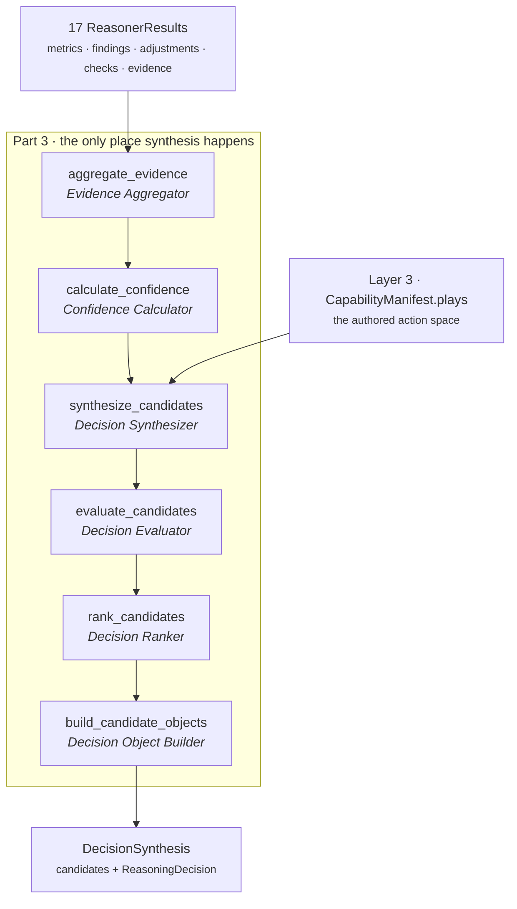
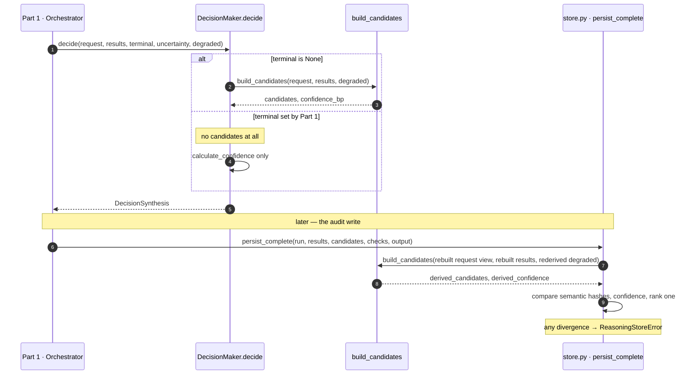
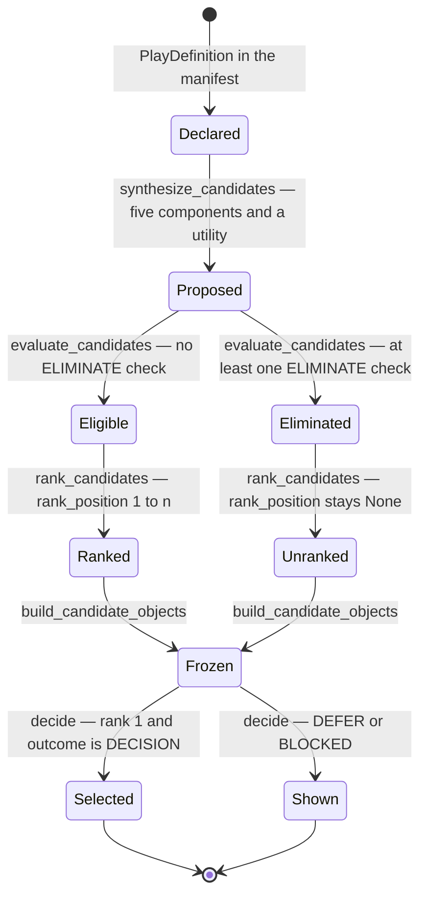
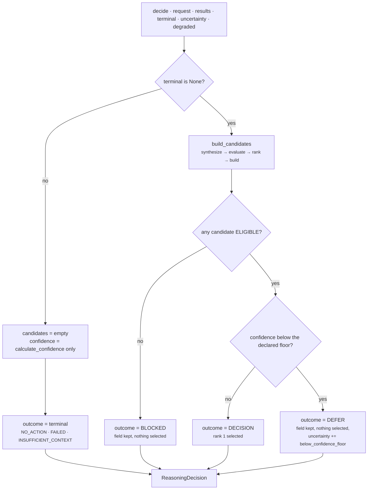

# Part 3 · The Decision Maker

**Module:** `genios_engine/reason/decision_maker.py` (~420 lines)
**Question it answers:** *Of the operations the domain has exposed, which one should happen — and is
this run confident enough to say so at all?*
**Output:** a `DecisionSynthesis` — the frozen candidate field plus the `ReasoningDecision` drawn
from it.
**Tests:** `tests/test_reasoning_decision_maker.py` — 36 tests, all passing.

Part 1 schedules. Part 2 analyses. **Only this module decides.** Everything below exists to make
that sentence structurally true rather than a convention someone remembers to honour. See
[00 · Overview](../00-Overview.md) for how the three parts fit together; this document does not restate
it.

---

## 1 · What the blueprint asked for

The architecture names Part 3 *the only synthesis authority* and specifies six components in a fixed
order. The module docstring reproduces that shape verbatim as its own contents page:

> ```
> Evidence Aggregator     → every citation the units stood behind, deduplicated
> Confidence Calculator   → one authoritative confidence for the whole decision
> Decision Synthesizer    → declared plays become scored candidates
> Decision Evaluator      → hard checks eliminate candidates *before* anything is ranked
> Decision Ranker         → a total order over the survivors
> Decision Object Builder → one immutable, hashable ReasoningDecision
> ```



The ordering in that diagram is not presentational. Three of the six arrows are load-bearing
guarantees, and each one is a specific failure the architecture is refusing:

- **Confidence before synthesis.** One number describes the whole run, resolved once, and every
  candidate carries the same copy. A per-candidate confidence would let a weak play advertise
  strength the run never had.
- **Evaluation before ranking.** A play eliminated by policy leaves the contest. It never competes
  on score, so it can never win and then be quietly demoted — which is the difference between "we
  refused this" and "we ranked this first and then someone removed it".
- **Ranking before object construction.** Ranks are assigned by the ranker and frozen by the
  builder. Nothing downstream may re-sort a candidate field and call the result the same decision.

The blueprint also permits an LLM *consultant* below the confidence floor. That is the one
instruction Part 3 does not follow; the reconciliation is recorded in
[00 · Overview §3.3](../00-Overview.md) and the resulting `DEFER` path is documented in §4.9 below.

And the constraint the whole layer is built around applies most sharply here:

> *"If it starts making decisions, then you've accidentally created two reasoning engines. That's
> architectural leakage. There should only be one place where thinking happens."*

---

## 2 · What exists

All six components, as separate module-level functions with individual tests, plus two entry points
that compose them.

### 2.1 · The symbol map

| Symbol | Role |
|---|---|
| `decision_maker.py:DecisionMaker.decide` | Entry point. Applies terminal outcomes and the confidence floor around the pipeline. |
| `decision_maker.py:build_candidates` | The pipeline itself. **The single entry point** `reason/store.py` re-runs to verify audit rows. |
| `decision_maker.py:aggregate_evidence` | Union of every evidence id cited by results, findings and adjustments. |
| `decision_maker.py:calculate_confidence` | Resolves one `confidence_bp` for the run; caps it when degraded. |
| `decision_maker.py:priority_metrics` | Resolves shared `urgency_bp` and the optional `priority_override_bp`. |
| `decision_maker.py:synthesize_candidates` | Declared plays → `ProposedCandidate` with five scored components. |
| `decision_maker.py:score_candidate` | The weighted-utility formula. |
| `decision_maker.py:evaluate_candidates` | Applies `CandidateCheck`s; marks eliminations. |
| `decision_maker.py:ordered_checks` | Total order over a play's checks, so an audit row is byte-stable. |
| `decision_maker.py:rank_candidates` | Total order over the field; assigns `rank_position`. |
| `decision_maker.py:build_candidate_objects` | Freezes `ProposedCandidate` → immutable `DecisionCandidate`. |
| `decision_maker.py:ProposedCandidate` | Mutable-by-`replace` intermediate; never leaves the module. |
| `decision_maker.py:DecisionSynthesis` | The frozen return type: `candidates` + `decision`. |

### 2.2 · The constants, read out of the code

| Constant | Value | Meaning |
|---|---|---|
| `DECISION_MAKER_VERSION` | `"1.0.0"` | Version of the synthesis rules themselves. |
| `CONFIDENCE_AUTHORITY` | `"core.confidence"` | Default unit whose `confidence_bp` is final. |
| `PRIORITY_AUTHORITY` | `"core.priority"` | Default unit whose `priority_override_bp` is honoured. |
| `CONFIDENCE_AUTHORITY_KEY` | `"confidence_authority"` | Capability metadata key naming a different authority. |
| `PRIORITY_AUTHORITY_KEY` | `"priority_authority"` | As above, for priority. |
| `CONFIDENCE_FLOOR_KEY` | `"confidence_floor_bp"` | Below this, a winner becomes a question. Default **0** — absent declaration disables the gate. |
| `BELOW_FLOOR_REASON` | `"below_confidence_floor"` | Prefix of the uncertainty entry the floor appends. |

Two more thresholds are read from capability metadata rather than declared as module constants,
because they are per-capability tuning rather than engine law:

| Metadata key | Default | Meaning |
|---|---|---|
| `default_confidence_bp` | `5,000bp` (0.50) | Holds until some unit publishes `confidence_bp`. |
| `optional_failure_confidence_cap_bp` | `5,000bp` (0.50) | Ceiling applied when the run is degraded. |

The shipped 17-unit capability declares `confidence_floor_bp: 4_500` — 4,500bp, meaning 0.45 —
in `packs/capabilities/deal_cooling_v2.py`. The shipped v1 capability declares no floor, so it
behaves exactly as it did before the floor existed. Every value in this document is integer basis
points on 0..10,000; `7,500bp` means 0.75. There are no floats anywhere in this module, because a
float would make the decision hash machine-dependent and destroy replay.

### 2.3 · Two callers, one law



The second call is the point. `store.py` does not trust the candidate rows it was handed; it rebuilds
a `CapabilityManifest` and `ContextSnapshot` from the persisted immutable bytes, re-types the
reasoner results, and re-runs **the same function** the engine ran. Because there is exactly one
implementation of the law, a forged row cannot pass by satisfying a weaker second copy of it. That
is why `build_candidates` must stay one entry point, and why the docstring says so explicitly.

---

## 3 · The gap, and why

### 3.1 · Part 3 does not generate the action space, and never will

The action space stays authored in Layer 3. `synthesize_candidates` iterates
`request.capability.plays` and scores what it finds; it cannot add a play.

This is deliberate, and the docstring gives the reason in one line: Law 02 says *domain expertise
never decides, it only exposes operations*. Layer 3 declares **what could be done**; Part 3 decides
**how good each option looks given this situation**. Inventing an action no expert authored would be
the Decision Maker quietly becoming a domain author — the same architectural leakage the blueprint
warns about, running in the other direction.

So "synthesis" here means scoring, checking and ranking what was exposed. That is not a diminished
reading of the architecture; it is the reading that survives the constraint. It also has a practical
consequence worth stating: **the quality ceiling of Part 3 is set by the quality of the authored
play catalogue.** If a domain author never writes the right play, no amount of scoring will produce
it, and no test in this module will notice.

### 3.2 · The confidence floor is enforced in-process, not by the audit verifier

This is the real gap, and it is not small.

`store.py:persist_complete` re-derives candidates only when
`prepared_output["outcome_kind"] in {"decision", "blocked"}`. A `DEFER` row skips the entire
re-derivation block. And from the other side: if a run that *should* have deferred were persisted
as `decision`, the verifier would compute `expected_outcome = "decision"` (candidates are eligible;
the floor is not consulted) and pass.

Stated plainly: **`build_candidates` is proven twice; `DecisionMaker.decide` is proven once.** The
floor, the terminal-outcome handling and the selection rule are enforced only by the in-process
engine. The audit trail can prove that a persisted candidate field is the one the reasoners' effects
imply; it cannot independently prove that the floor was applied.

Three things bound the blast radius today, none of which closes the hole:

- `DEFER` never authorizes delivery — `orchestrator.py:ReasoningExecution.delivery_allowed` requires
  `outcome == DECISION`, so the boundary refuses a deferred decision by construction.
- `ReasoningDecision.__post_init__` refuses a `selected_candidate_id` on any non-`DECISION` outcome,
  so a deferred row cannot name a winner even if someone tried.
- The whole layer is currently shadow-locked, so nothing has been persisted in anger.

The honest fix is to extend the re-derivation set to include `defer`, and to re-read
`confidence_floor_bp` from the persisted manifest when checking `expected_outcome`. That work is not
done.

### 3.3 · Adjustment application is not commutative under saturation

`synthesize_candidates` clamps after **each** adjustment:

```python
components[adjustment.component] = clamp_bp(
    components[adjustment.component] + adjustment.delta_bp)
```

When an intermediate value saturates at 0 or 10,000, the order of adjustments changes the result.
Verified against the shipped code, starting from `risk_bp = 1,000` with default ranking weights:

| Order applied | `risk` after | `utility_bp` |
|---|---|---|
| `+10,000` then `−10,000` | `0bp` | **6,200bp** |
| `−10,000` then `+10,000` | `10,000bp` | **5,700bp** |

A 500bp swing from permutation alone. This is reachable: `core.temporal` emits adjustments on any
component named in its per-play config, while `core.risk`, `core.cost`, `core.impact` and
`core.recommendation` each own one component — so two units adjusting the same component is a
configuration away, not a rewrite away.

It does not currently produce nondeterminism, because both sources of order are fixed: the results
list follows the planner's topological order, and each result's `adjustments` is a tuple frozen at
emission (and `temporal.py` explicitly sorts its config iteration — see the replay-determinism
defect recorded in `Rohit_Updates/Layer 4.md`). But it does mean the deployment note's justification
for that fix — *"adjustments are summed per component, so a permutation cannot move a score"* — is
true only in the non-saturating case. The score is order-dependent whenever a component pins at a
bound.

The mitigation, if it is ever wanted, is to sum deltas per `(play_id, component)` and clamp once at
the end. That changes hashes, so it is a decision, not a cleanup.

### 3.4 · `build_candidates` trusts guards it does not call

`synthesize_candidates` indexes `components[adjustment.component]` without a membership test. An
adjustment naming a sixth component raises `KeyError` rather than a typed fault. Nothing in this
module prevents that; `reason/guards.py:validate_candidate_effects` does, and it is applied by the
orchestrator on every reasoner return and re-applied by `store.py` before its re-derivation.

That is a deliberate division — the guards are public and shared precisely so both callers use the
identical predicate — but it means **`build_candidates` is not safe on unvalidated input.** Any
future third caller must run the guards first.

### 3.5 · The duck-typed request is narrower than it looks

`store.py` builds its request view as
`SimpleNamespace(capability=typed_capability, context=typed_context)`. There is no
`evaluation_time`, no `mode`, no `org_id`.

This works because `build_candidates` and everything below it read **only** `request.capability` —
`.metadata`, `.plays`, `.ranking_weights`. `DecisionMaker.decide` reads `request.evaluation_time`
and `request.context.context_snapshot_id`, but `decide` is not the function `store.py` calls.

The typing is `Any` throughout, so nothing enforces this. It is a real constraint on future change:
**the moment `build_candidates` reads a field outside `request.capability`, the audit verifier
breaks with an `AttributeError` on a code path that only runs against a real database.**

### 3.6 · One defence that cannot fire

`score_candidate` ends with `clamp_bp(divide_half_up(weighted, 100))`. Given the contract
invariants — every component clamped to 0..10,000 by `synthesize_candidates`, `ranking_weights`
validated as five non-negative integers summing to exactly 100 by
`contracts/reasoning.py:CapabilityManifest.__post_init__` — `weighted` is bounded by
`0 ≤ weighted ≤ 1,000,000`, so the quotient is already in range. The clamp is unreachable, and the
negative branch of `divide_half_up` is unreachable from here too. Both are cheap; both are
documented here so nobody mistakes them for evidence that the bounds are enforced at this point.

---

## 4 · How it works inside

### 4.1 · The candidate lifecycle



Two things this diagram is asserting. First, **there is no path from `Eliminated` back to
`Ranked`** — elimination is terminal within the run, which is what "before ranking" buys.
`contracts/reasoning.py:DecisionCandidate.__post_init__` enforces the same rule at the type level:
`"eliminated candidates cannot have a rank"`.

Second, `Eliminated` and `Unranked` still reach `Frozen`. A rejected play is published, carrying the
check that rejected it. A rejection without its reason is indistinguishable from an oversight, and
an audit trail that only records winners is not an audit trail.

### 4.2 · Evidence Aggregator — `aggregate_evidence`

```python
tuple(sorted(set(
    result.evidence_ids
    + tuple(ev for finding in result.findings for ev in finding.evidence_ids)
    + tuple(ev for adjustment in result.adjustments for ev in adjustment.evidence_ids)
    for result in results)))
```

Three levels of citation are unioned: what the unit stood behind directly, what each finding cited,
and what each adjustment cited. `set` then `sorted` gives dedup plus a total order in one step — the
order matters because this tuple enters the candidate's semantic hash, and `sorted` is the only
ordering that survives a JSON round-trip through the audit store.

The result is attached to **every** candidate, eligible and eliminated alike. The docstring gives
the reason: a candidate carries the whole evidential basis of the run rather than one unit's slice,
*so the explanation a human sees can never cite less than what actually moved the score.* The
tradeoff is real and accepted — the candidate over-cites rather than under-cites. Under-citing is
the failure that loses trust; over-citing is noise.

Note that only `COMPLETED` results can contribute: `ReasonerResult.__post_init__` refuses evidence
ids on any non-completed result, so a failed unit's citations cannot reach here at all.

### 4.3 · Confidence Calculator — `calculate_confidence`

One confidence describes the whole decision. Resolution runs in declared plan order:

| Step | Rule |
|---|---|
| 1 | Start at `default_confidence_bp` from capability metadata, default `5,000bp`. |
| 2 | For each result, if it is `COMPLETED` and publishes `confidence_bp`, that value replaces the running value, clamped to 0..10,000. |
| 3 | If the result's `reasoner_id` is the confidence authority **and** it is `COMPLETED`, stop scanning. |
| 4 | If the run is degraded, cap at `optional_failure_confidence_cap_bp`, default `5,000bp`. |

The named authority is the whole point, and the docstring argues it: several units legitimately
observe confidence along the way — a legacy rule, a gate, a temporal decay — but exactly one gets to
publish the value the decision is built on. Without a named authority the winner would be *whichever
emitter happened to run last*, so **adding a unit to a capability could silently move every score in
the system.** `tests/test_unit_roster.py` enforces the other half of that contract: only
`core.confidence` may declare `confidence_bp` in its `publishes` set.

Four behaviours fall out of the exact code, each pinned by a test:

- A unit running *after* the authority cannot move confidence — the scan has already stopped.
  (`test_a_unit_running_after_the_authority_cannot_move_confidence`)
- A **failed** authority publishes nothing and does not stop the scan, so the last completed
  observer's value stands. A unit that did not complete has no opinion, and its absence must not be
  read as agreement. (`test_a_failed_authority_does_not_publish_a_value`)
- A **completed authority that publishes no `confidence_bp`** still ends the scan. So "the authority
  has the last word" means *the authority closes the question*, not *the authority must answer it* —
  in that case the previous observer's value is what ships. This is a subtlety worth knowing before
  changing the loop.
- A capability may appoint its own authority through `confidence_authority`; a blank or non-string
  value is an `OrchestrationError` at synthesis time, not a silent fallback.

The degraded cap is applied last, as a `min`, so it can only lower. The reasoning is stated in the
docstring: a decision reached with a blind spot must never present itself as well-evidenced as one
reached with every input intact. `degraded` is computed by Part 1 as *any optional unit failed or
came up short on context*, and `store.py` re-derives the same boolean from persisted
`failure_policy` and status before re-running the pipeline.

### 4.4 · The priority authority — `priority_metrics`

Returns `(urgency_bp, priority_override_bp | None)`. Two different sourcing rules in one scan:

- **`urgency_bp`** is read from any `COMPLETED` result that publishes it — last writer before the
  authority wins. Default `5,000bp`, neutral.
- **`priority_override_bp`** is read **only** from the priority authority.

The asymmetry is the safety property. An override *replaces the weighted utility outright*, so
allowing any unit to emit it would let a unit seize ranking control by publishing a metric
opportunistically. `test_only_the_priority_authority_may_override_ranking` pins exactly that: a
`core.risk` result carrying `priority_override_bp=10_000` is ignored, and the authority's
`urgency_bp` is what survives.

The `request` parameter is required rather than optional, and the docstring explains why: an
authority resolved from a default instead of from the capability would quietly answer a different
question than the caller asked. That is the kind of convenience default that produces a wrong answer
with no error.

Note the standing caveat recorded in `Rohit_Updates/Layer 4.md`: `core.priority` reads its source's
`priority_bp` and republishes it as `priority_override_bp`, and in the shipped configuration the
source publishes no `priority_bp` — **so the override path is inert in production today.** The
mechanism below is correct; it is simply not currently fed.

### 4.5 · Decision Synthesizer — `synthesize_candidates` and `score_candidate`

Plays are iterated `sorted(..., key=play_id)`, so the proposal list has a total order before
anything is scored. Each play seeds five components:

| Component | Source | Sense |
|---|---|---|
| `impact` | `play.impact_bp` | benefit |
| `success` | `play.success_probability_bp` | benefit |
| `urgency` | shared, from `priority_metrics` | benefit |
| `effort` | `play.effort_bp` | **cost** |
| `risk` | `play.risk_bp` | **cost** |

`urgency` is the only component that is not a property of the play — it describes the *situation*,
so every candidate in a run receives the same value. Units then move components by publishing typed
`CandidateAdjustment`s naming a play and a component, bounded to `−10,000..+10,000`. A unit cannot
write a score directly; that restriction is what keeps analysis and synthesis separable.

The formula, in full:

```
weighted =  impact              × w_impact
          + success             × w_success
          + urgency             × w_urgency
          + (10,000 − effort)   × w_effort
          + (10,000 − risk)     × w_risk

utility_bp = divide_half_up(weighted, 100)
```

Weights come from `CapabilityManifest.ranking_weights`, validated as five non-negative integers
summing to exactly 100. The shipped default, used by both deal-cooling capabilities:

| Weight | Value |
|---|---|
| `impact` | 35 |
| `success` | 30 |
| `urgency` | 20 |
| `effort` | 10 |
| `risk` | 5 |

**Why `10,000 − effort` rather than a subtraction.** Effort and risk are costs, so the candidate is
rewarded for their *absence*. Expressing the cost as a benefit — "how cheap is this", "how safe is
this" — keeps every term in the sum positive and on the same 0..10,000 scale, which is what lets the
weights sum to 100 and makes the quotient a basis point without further scaling. It also makes the
business claim explicit rather than emergent: *a cheap, safe play with modest impact can rightly beat
an expensive, dangerous one with high impact.* That is a statement about how the organisation wants
to act, and the weights are where it is tuned.

A worked example. A play with `impact 6,000bp`, `success 6,000bp`, neutral `urgency 5,000bp`,
`effort 2,000bp`, `risk 1,000bp`, on the default weights:

| Term | Arithmetic | Contribution |
|---|---|---|
| impact | `6,000 × 35` | 210,000 |
| success | `6,000 × 30` | 180,000 |
| urgency | `5,000 × 20` | 100,000 |
| effort | `(10,000 − 2,000) × 10` | 80,000 |
| risk | `(10,000 − 1,000) × 5` | 45,000 |
| **weighted** | | **615,000** |
| **utility** | `divide_half_up(615,000, 100)` | **6,150bp** |

And the cost sense, from `test_effort_and_risk_are_costs_not_merits` — two plays identical except
for their costs:

| Play | effort | risk | utility |
|---|---|---|---|
| `cheap` | `0bp` | `0bp` | **5,750bp** |
| `costly` | `10,000bp` | `10,000bp` | **4,250bp** |

The 1,500bp gap is exactly `(w_effort + w_risk) × 10,000 ÷ 100`, which is the most direct way to see
what the weights are actually buying.

**Half-up division, and why it is written out.** `reasoners/common.py:divide_half_up` computes
`(numerator + denominator // 2) // denominator` for non-negative input. With `weighted = 615,050` the
exact quotient is `6,150.5` and the function returns **6,151bp** — rounding away from zero. Python's
built-in `round()` would return `6,150` under banker's rounding. The two differ on exactly the
values a scoring system produces most often, so the tie-breaking rule is spelled out in integer
arithmetic rather than inherited from a language default that could change or differ by
implementation.

**`priority_override` replaces the formula outright.** The first line of `score_candidate` is
`if priority_override is not None: return priority_override`. No weighting, no components, no
half-up division — the override *is* the utility. The docstring's justification: this is for *the
cases where an organisation's own rule outranks the general scoring model*. That is a strong power,
which is why §4.4 restricts who may hand it over. Note the consequence: with an override in force,
**every candidate in the run gets the same utility**, because the override is resolved once per run
and passed to every play. Ranking then falls entirely to the `play_id` tie-break.

### 4.6 · Decision Evaluator — `evaluate_candidates` and `ordered_checks`

For each proposal, collect the checks naming its `play_id`, order them, and set the disposition:

```python
eliminated = any(item.outcome == CheckOutcome.ELIMINATE for item in play_checks)
```

`CheckOutcome` has four members — `PASS`, `WARN`, `ELIMINATE`, `ADJUST` — and only `ELIMINATE`
removes a candidate. A `WARN` travels with the candidate and changes nothing about its standing,
which is the point of having it: a concern that is not disqualifying should be visible without being
fatal.

`evaluate_candidates` **does not reorder**. It returns proposals in the order it received them, with
dispositions attached; ordering is the ranker's job and only the ranker's job. That separation is
pinned by `test_the_evaluator_eliminates_without_reordering`, which asserts the output sequence is
unchanged after an elimination.

`ordered_checks` sorts on a five-part key:

```
(stage, evaluator_id, evaluator_version, reason_code, semantic_hash(detail))
```

`detail` is a free-form mapping, so it cannot be compared directly; hashing it yields a stable
scalar. The key is exhaustive enough that two checks tying on all five are genuinely
indistinguishable, which means the sort is total and the persisted row is byte-stable across runs
regardless of which unit emitted which check first.

Checks can only come from completed units — `store.py` refuses a persisted bundle where a
non-completed reasoner contributed checks — and their `stage` must be one of the seven in
`guards.py:CHECK_STAGES`: `precondition`, `constraint`, `policy`, `permission`, `safety`,
`cost_benefit`, `ranking`. An unknown stage is a deployment fault, never a silent no-op.

### 4.7 · Decision Ranker — `rank_candidates`

```python
eligible   = sorted(..., key=lambda item: (-item.utility_bp, item.play.play_id))
eliminated = sorted(..., key=lambda item: item.play.play_id)
ranked     = tuple(replace(item, rank_position=rank)
                   for rank, item in enumerate(eligible, start=1))
return ranked + tuple(eliminated)
```

Three properties, in order of how much they matter:

**The order is total.** Every candidate has a distinct `play_id` — `CapabilityManifest` rejects
duplicates — so `(-utility_bp, play_id)` can never tie. There is no path where the outcome depends
on the sequence the plays arrived in. The docstring is blunt about why this is not cosmetic: *two
equally-scored plays must resolve the same way on every machine and every replay.*

**Ties break on `play_id`, never on iteration order.** This is the specific defect the rule exists to
prevent, and it is subtle because it would not show up in a single run — only in a replay, or on a
different machine, or after a JSON round-trip through the audit store re-sorted a mapping. A tie
broken by iteration order is a decision that cannot be reproduced, and a decision that cannot be
reproduced cannot be audited. `test_equal_utility_is_broken_by_play_id_not_iteration_order`
constructs two plays with identical scores declared in the order `zeta, alpha` and asserts the
ranking is `alpha, zeta`.

**Eliminated candidates are appended, unranked.** They keep `rank_position = None`, sorted by
`play_id` for stability, and they appear *after* every survivor. So the candidate tuple reads as
"here is the contest, and here is what was disqualified" — never as a single blended list where a
reader has to check dispositions to know what actually competed.

### 4.8 · Decision Object Builder — `build_candidate_objects`

Freezes each `ProposedCandidate` into a `DecisionCandidate`, attaching the run-wide `confidence_bp`
and the run-wide evidence tuple, and copying seven play attributes into `parameters`:

| Parameter | Why it travels with the candidate |
|---|---|
| `label`, `steps` | What the human is being asked to do. |
| `read_only` | **The delivery authority bit.** Adapters refuse anything else. |
| `tags`, `metadata` | Domain-authored routing and policy inputs. |
| `success_events` | What Layer 7 will watch for to score this decision later. |
| `window_days` | How long that outcome window stays open. |

`read_only` is the one that matters operationally, and the code comments say so. The candidate — not
the manifest, not the request — is what a delivery adapter reads, so the authority bit is copied
onto the candidate rather than looked up later.
`orchestrator.py:ReasoningExecution.delivery_allowed` requires `selected.parameters["read_only"] is
True` alongside live mode, `live_delivery_enabled`, and a `DECISION` outcome, and `store.py` refuses
any persisted candidate whose `read_only` differs from its declared play.

`DecisionCandidate.candidate_id` is a property, not a field: `stable_id("cand", to_semantic_dict())`.
It is content-addressed, so identical candidate content produces the same id on a replay. That is
correct semantically and inconvenient for a tenant-wide primary key, which is why
`store.py:_prepare_candidates` re-keys with `stable_id("cand", {run_id, candidate_hash})` and keeps
the contract id as an `external_candidate_id` alias so checks and selection still resolve.

### 4.9 · The entry point — `DecisionMaker.decide`



**Terminal runs publish no candidate field at all.** `terminal` is Part 1's report that *execution*
ended the run — a required unit failed, required context was absent, or a gating unit said this
situation does not apply. The docstring draws the line precisely: those are facts about execution,
not judgements, which is why Part 1 determines them and Part 3 merely records them. And the
consequence is absolute — `candidates = ()`. Ranking plays that no unit ever validated would be
exactly the fabrication this architecture exists to prevent. `ReasoningDecision.__post_init__`
enforces the same rule independently: `NO_ACTION`, `INSUFFICIENT_CONTEXT` and `FAILED` may not carry
candidates at all.

Confidence is still computed on a terminal run, because "we could not decide, and here is how
confident we were in the partial picture" is more useful than a null.

**The floor turns a weak recommendation into a question.** When a winner exists but
`confidence_bp < confidence_floor_bp`:

- the outcome becomes `DEFER`;
- `f"{BELOW_FLOOR_REASON}:{confidence_bp}<{floor_bp}"` is appended to uncertainty — the *numbers*
  travel, not just the label, so a reader can see how far short the run fell;
- **the candidate field is kept**, ranked, with rank 1 assigned;
- `selected_candidate_id` stays `None`.

Both halves of that are deliberate. The field is kept because a human being asked to decide needs to
see what was considered — withholding it just hides the reasoning
(`test_an_ask_still_shows_what_was_considered`). Nothing is selected because
`selected_candidate_id` is the field every downstream adapter reads as an instruction, and an
unselected field cannot be misread as one
(`test_an_asked_decision_can_never_authorize_delivery`). `DEFER` is the only outcome in the system
that carries eligible, ranked candidates with no selection — `ReasoningDecision.__post_init__`
permits exactly that combination and forbids it everywhere else.

The comparison is `confidence_bp < floor_bp`, strictly less than. **The floor is a minimum, not a
margin** — confidence exactly at 4,500bp against a 4,500bp floor decides
(`test_confidence_at_the_floor_still_decides`). And the default of `0` means an undeclared floor
disables the gate entirely, so adding the feature changed no existing capability's behaviour.

The floor is also checked *after* the `BLOCKED` determination, so it can never manufacture a
decision where none existed; and it is inside the `terminal is None` branch, so it can never
override a terminal outcome (`test_the_floor_cannot_manufacture_a_decision_from_a_terminal_run`).

**Two derived fields.** `expires_at = request.evaluation_time + timedelta(hours=capability.
expiry_hours)` — computed from the *passed-in* evaluation time, never `now()`, which is what lets a
replay six months later reason about the same moment. Default `expiry_hours` is 168, one week.
`outcome_window_days` is copied from the *selected* play's `window_days` and is `None` for every
non-`DECISION` outcome: it is the window Layer 7 will use to judge whether the decision worked, and
a decision that was never made has no window to judge.

### 4.10 · The six outcomes, and what each means downstream

| Outcome | Candidates | `selected_candidate_id` | Set by | Delivery |
|---|---|---|---|---|
| `DECISION` | ranked field | rank 1 | Part 3 | Yes, if live + `live_delivery_enabled` + `read_only` |
| `DEFER` | ranked field | `None` | Part 3 · confidence floor | Never |
| `BLOCKED` | eliminated only | `None` | Part 3 · all candidates eliminated | Never |
| `NO_ACTION` | none | `None` | Part 1 · gating unit did not match | Never |
| `INSUFFICIENT_CONTEXT` | none | `None` | Part 1 · required field absent | Never |
| `FAILED` | none | `None` | Part 1 · required unit failed | Never |

Five of the six are the system declining to advise. That distribution is intentional: silence and a
question are both valid outputs, and shipping a weakly-evidenced recommendation as though it were a
strong one is how an intelligence layer loses trust it cannot re-earn.

### 4.11 · The second caller, in detail

`store.py:persist_complete` re-derives before it commits. For a `decision` or `blocked` bundle it:

1. Rebuilds a typed `CapabilityManifest` from the persisted manifest bytes
   (`replay.py:capability_from_manifest`) and a typed `ContextSnapshot` from the persisted payload
   (`replay.py:context_from_payload`), checking the payload hash first.
2. Refuses the bundle if `guards.py:required_missing` shows a decision was reached without required
   context.
3. Re-types every reasoner result and re-runs `guards.py:validate_candidate_effects` and
   `validate_evidence_references` against it.
4. Re-derives `degraded` from the persisted `failure_policy` of each spec and each result's status.
5. Calls `build_candidates(request_view, typed_results, degraded)`.

Then it compares four things, and any mismatch is a `ReasoningStoreError` that aborts the write:

| Comparison | Error message |
|---|---|
| outcome kind vs. derived eligibility | `"persisted outcome differs from deterministic reasoner effects"` |
| every candidate's `semantic_hash`, positionally | `"candidate values/ranks differ from deterministic reasoner effects"` |
| `confidence_bp` | `"decision confidence differs from deterministic reasoner effects"` |
| selected id vs. derived rank one | `"selected candidate differs from deterministic rank one"` |

Because the comparison is over `DecisionCandidate.semantic_hash`, it covers utility, components,
disposition, rank, confidence, evidence, checks and parameters in one equality — the candidate's
whole content, not a chosen subset. Four adjacent checks make it hard to route around: candidate
checks must be an exact multiset of the checks embedded in the immutable reasoner outputs; a
candidate's play must appear in the manifest; a `read_only` bit must match its declared play; and a
`decision` or `blocked` outcome must cover every declared play exactly once.

`test_the_pipeline_and_its_parts_agree` guards the composition from the other end: it runs
`build_candidates` whole and the four components piecewise and asserts the `semantic_hash` lists are
identical. If someone reorders the pipeline inside `build_candidates`, that test fails before the
store ever gets a chance to reject a row.

### 4.12 · Edge cases worth knowing

| Situation | Behaviour |
|---|---|
| No unit publishes `confidence_bp` | `default_confidence_bp` stands, default `5,000bp`. |
| Confidence authority completes but publishes nothing | Scan stops; the previous observer's value stands. |
| Confidence authority `FAILED` | Does not stop the scan and publishes nothing. |
| No unit publishes `urgency_bp` | `5,000bp`, neutral. |
| `confidence_authority` metadata blank or non-string | `OrchestrationError`, `"must name a reasoner"`. |
| `confidence_floor_bp` out of 0..10,000, or a bool | `OrchestrationError`, `"must be integer basis points"`. |
| Adjustment drives a component past a bound | Clamped to 0 or 10,000 per adjustment — see §3.3. |
| Adjustment names an unknown component | `KeyError` here; caught upstream by `validate_candidate_effects`. |
| Every candidate eliminated | `BLOCKED`; the eliminated field is still published with its checks. |
| `priority_override` present | Every candidate shares one utility; `play_id` decides the ranking. |
| Two plays tie on utility | Lower `play_id` ranks first, on every machine and every replay. |
| `DecisionMaker(version="   ")` | `ValueError`, `"decision maker version is required"`. |

---

## Related

| Document | Covers |
|---|---|
| [00 · Overview](../00-Overview.md) | The three parts, the five laws, the four ways a run can end |
| [01 · Orchestrator](../01-Reasoning-Orchestrator/README.md) | Part 1 — who sets `terminal`, `degraded` and `uncertainty` |
| [02 · Unit Framework](../02-Reasoning-Units/README.md) | Part 2 — how a unit emits metrics, adjustments and checks |
| [04 · Business Evaluation](../02-Reasoning-Units/02-Business-Evaluation/README.md) | `core.confidence` and `core.priority` — the two metric authorities |
| [05 · Optimization](../02-Reasoning-Units/03-Optimization/README.md) | `core.policy` and `core.constraint` — where `ELIMINATE` checks come from |
| [06 · Decision Support](../02-Reasoning-Units/04-Decision-Support/README.md) | `core.recommendation` — why it proposes and never selects |
| [08 · Contracts & Data Flow](../_reference/Contracts-and-Dataflow.md) | `DecisionCandidate`, `ReasoningDecision`, `CandidateCheck` |
| [09 · Determinism, Audit & Replay](../_reference/Determinism-Audit-Replay.md) | `reason/store.py` re-derivation and replay in full |
