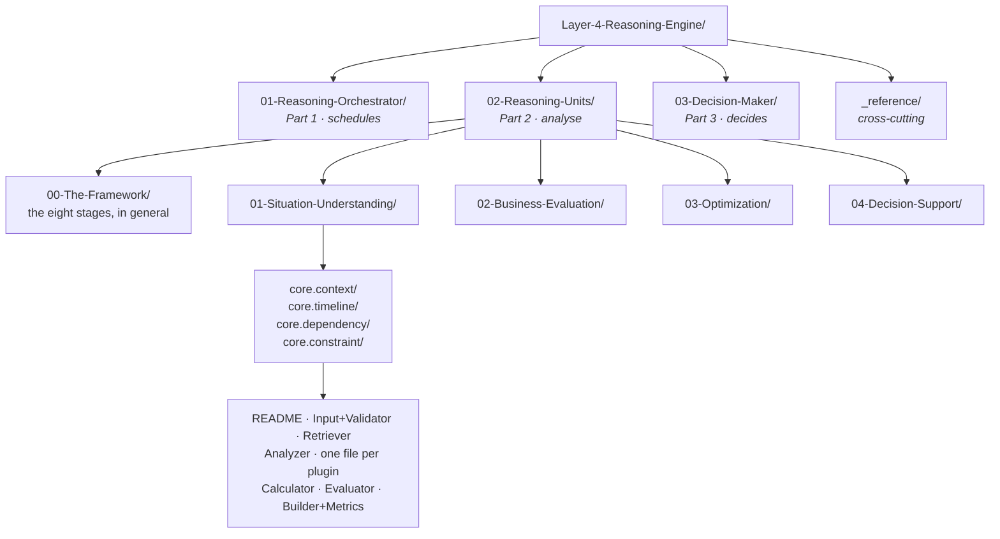

# Layer 4 · Reasoning Engine — the folder map

**This folder is the live truth of `genios_engine/reason/`.** It is the source consulted before any
action, update or improvement to Layer 4. If a document and the code disagree, the document is
wrong — fix it in the same change that moved the code.

Start at **[00-Overview.md](00-Overview.md)** if you want the layer in one sitting. Use this page
when you know what you are looking for.

---

## How the folder is shaped

The nesting mirrors the architecture exactly: three parts, four categories, seventeen units, and
inside each unit the eight stages it is built from.

Every folder has a `README.md` that maps its contents. Every file answers the same four questions:
**what it is for → what exists → how it works → examples and edge cases.**

---

## The three parts

| Folder | Part | Owns | Never does |
|---|---|---|---|
| [01-Reasoning-Orchestrator/](01-Reasoning-Orchestrator/README.md) | Part 1 | Which units run, in what order, what happens when one fails, and the immutable record of all of it | Analyse a situation · pick a winner |
| [02-Reasoning-Units/](02-Reasoning-Units/README.md) | Part 2 | Seventeen domain-agnostic analyses, each producing evidence | Decide · rank · name a winner |
| [03-Decision-Maker/](03-Decision-Maker/README.md) | Part 3 | The single point of synthesis — score, eliminate, rank, decide, or refuse to | Analyse · author an action the domain never exposed |

If any one of them starts doing another's job, the layer has failed regardless of what the tests
say. Most of the design exists to make that boundary physical rather than a convention.

---

## The seventeen units

| Category | Units | Question |
|---|---|---|
| [01 · Situation Understanding](02-Reasoning-Units/01-Situation-Understanding/README.md) | [`core.context`](02-Reasoning-Units/01-Situation-Understanding/core.context/README.md) · [`core.timeline`](02-Reasoning-Units/01-Situation-Understanding/core.timeline/README.md) · [`core.dependency`](02-Reasoning-Units/01-Situation-Understanding/core.dependency/README.md) · [`core.constraint`](02-Reasoning-Units/01-Situation-Understanding/core.constraint/README.md) | What is true, in what order, and what blocks what? |
| [02 · Business Evaluation](02-Reasoning-Units/02-Business-Evaluation/README.md) | [`core.risk`](02-Reasoning-Units/02-Business-Evaluation/core.risk/README.md) · [`core.opportunity`](02-Reasoning-Units/02-Business-Evaluation/core.opportunity/README.md) · [`core.impact`](02-Reasoning-Units/02-Business-Evaluation/core.impact/README.md) · [`core.priority`](02-Reasoning-Units/02-Business-Evaluation/core.priority/README.md) · [`core.confidence`](02-Reasoning-Units/02-Business-Evaluation/core.confidence/README.md) | What is this worth, and what does it threaten? |
| [03 · Optimization](02-Reasoning-Units/03-Optimization/README.md) | [`core.tradeoff`](02-Reasoning-Units/03-Optimization/core.tradeoff/README.md) · [`core.resource`](02-Reasoning-Units/03-Optimization/core.resource/README.md) · [`core.scheduling`](02-Reasoning-Units/03-Optimization/core.scheduling/README.md) · [`core.cost`](02-Reasoning-Units/03-Optimization/core.cost/README.md) · [`core.policy`](02-Reasoning-Units/03-Optimization/core.policy/README.md) | Among the possible paths, which is best — and when? |
| [04 · Decision Support](02-Reasoning-Units/04-Decision-Support/README.md) | [`core.alternative`](02-Reasoning-Units/04-Decision-Support/core.alternative/README.md) · [`core.validation`](02-Reasoning-Units/04-Decision-Support/README.md) · [`core.recommendation`](02-Reasoning-Units/04-Decision-Support/README.md) | Prepare the field the Decision Maker judges — without judging it |

The units are **global**. Sales uses them, HR uses them, Finance uses them. Reasoning never changes;
only Domain Expertise (Layer 3) changes. That is what makes a second domain cheap.

---

## Cross-cutting

| Document | Answers |
|---|---|
| [_reference/Contracts-and-Dataflow.md](_reference/Contracts-and-Dataflow.md) | What exactly crosses each boundary, and what it is not allowed to say |
| [_reference/Determinism-Audit-Replay.md](_reference/Determinism-Audit-Replay.md) | Six months from now, can we **prove** this decision — not assert it? |
| [_reference/Integration-and-Activation.md](_reference/Integration-and-Activation.md) | What Layer 4 reads, what it hands on, who may believe it, and what is still switched off |

---

## Finding your way

| You are here to… | Go to |
|---|---|
| Understand the layer for the first time | [00-Overview.md](00-Overview.md) |
| Change how a unit calculates something | that unit's `04-Calculator.md` |
| Add a new analyzer plugin | the unit's `03-Analyzer.md`, then [the framework's Analyzer section](02-Reasoning-Units/00-The-Framework/README.md) |
| Add a whole new unit | [02-Reasoning-Units/00-The-Framework/README.md](02-Reasoning-Units/00-The-Framework/README.md) |
| Change what gets scheduled or in what order | [01-Reasoning-Orchestrator/](01-Reasoning-Orchestrator/README.md) |
| Change how a winner is chosen | [03-Decision-Maker/](03-Decision-Maker/README.md) |
| Understand why a decision cannot be replayed | [_reference/Determinism-Audit-Replay.md](_reference/Determinism-Audit-Replay.md) |
| Ship it to production | [`Rohit_Updates/Layer 4.md`](../../Rohit_Updates/Layer%204.md) — the runbook, not this folder |

---

## The rules this layer never breaks

1. **Integer basis points only**, 0–10,000. A float would make a decision hash machine-dependent.
2. **Every ordering is total.** Never "whatever order the mapping arrived in".
3. **Silence is not zero.** A metric is omitted rather than zeroed — a published `0` is a claim, an
   absent metric is an admission.
4. **Fail closed, and record the failure.** A failure that escapes is just an outage.
5. **Nothing is cited that the frozen snapshot cannot produce.**
6. **No language model participates.** Test-enforced, not a convention.
