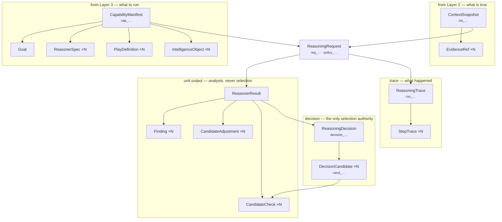
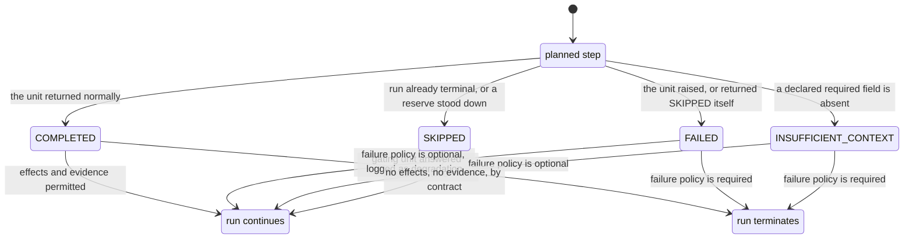
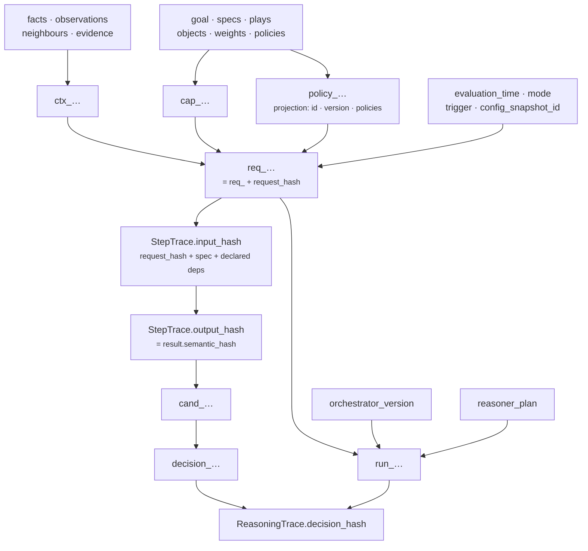
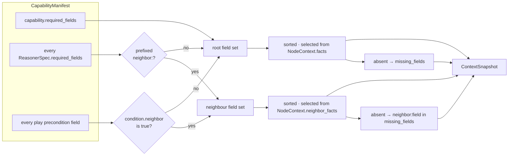
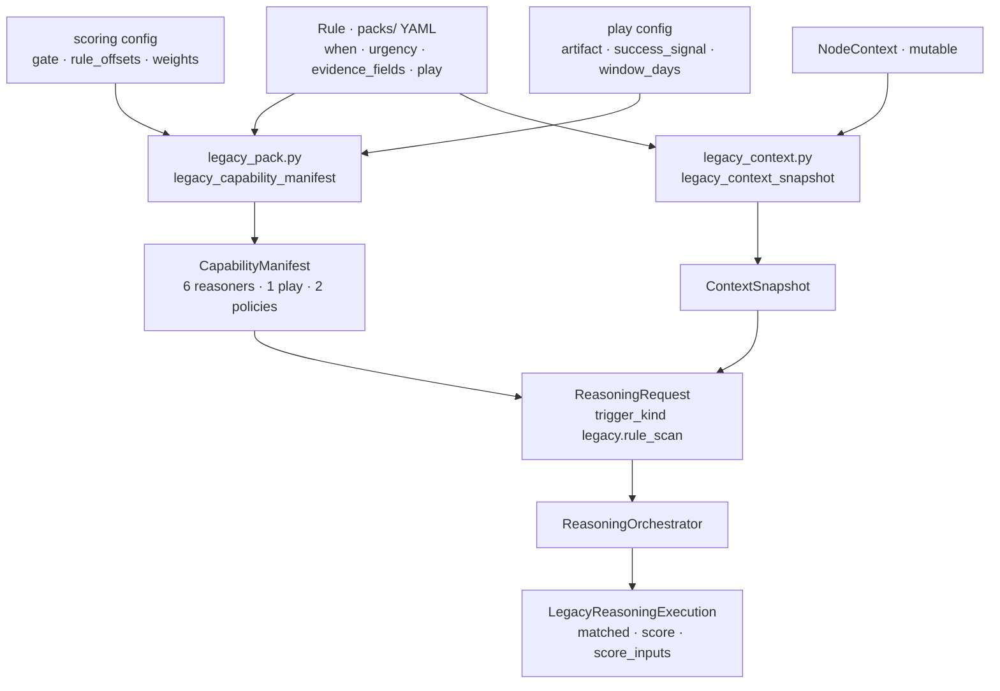

# Contracts & Data Flow

**Package:** `genios_engine/contracts/reasoning.py` · `genios_engine/reason/adapters/`
**Question it answers:** *What exactly crosses each boundary, and what is it not allowed to say?*
**Output:** sixteen frozen dataclasses, seven content addresses, and one journey from a mutable graph
row to a committed audit bundle.

This document is the reference for the types. [00 · Overview](../00-Overview.md) explains what the
layer is for; [07 · Decision Maker](../03-Decision-Maker/README.md) explains how the winner is chosen;
[09 · Determinism, Audit & Replay](Determinism-Audit-Replay.md) explains why the hashes are
believable months later. Here we care only about the shapes and the rules they enforce on
themselves.

---

## 1 · What the blueprint asked for

The architecture never specifies a type system. It specifies three properties, and the type system
is what those properties cost:

> *…transforms both into high-quality executive decisions in a **deterministic, explainable, and
> testable** way.*

Each word lands on the contracts, not on the algorithms.

**Deterministic** means the same inputs produce the same bytes. That is impossible if any object
crossing a boundary can be mutated after it is read, if any number is a float, or if any collection
has an order that depends on how a `dict` was populated. So every boundary type is
`@dataclass(frozen=True, slots=True)`, every collection is normalised to a total order in
`__post_init__`, and the canonical encoder refuses floats outright:

> *Semantic hashes are part of the reasoning contract. They must not depend on dict insertion
> order, locale, timezone, Python hash randomization, host formatting, or `default=str` fallbacks.
> This module therefore accepts only explicitly supported values and rejects floats entirely;
> probabilities, scores, money and weights belong in integer basis/minor units.*
> — `platform/canonical.py` module docstring

**Explainable** means a conclusion can name what produced it. That is a structural claim about the
types: a unit's output must be able to cite evidence, and the citation must resolve to something the
frozen input actually contained. The `ContextSnapshot` enforces the second half of that at
construction time.

**Testable** means the invariants are checkable without running the engine. Every rule below lives
in a `__post_init__`, so constructing an illegal object raises rather than producing a plausible-
looking artifact that fails three layers downstream.

The one architectural rule from `docs/LAYER_MAP.md` explains why this file sits in `contracts/`
rather than in `reason/`:

> *a lower layer never imports a higher one. Cross-layer needs are met by injection … or by data*

`contracts/` imports `platform/` and nothing else. Layer 2 can build a `ContextSnapshot` and Layer 5
can read a `ReasoningDecision` without either of them importing `reason/`.

### 1.1 · What the blueprint asked for that is carried but not consumed

The Domain Brain in the architecture is compiled expertise: named knowledge slices with universal,
organisational, behavioural and adaptive overlays. `IntelligenceObject` is that shape, and
`sales.deal_cooling` ships four of them — `sales.cadence_deviation`, `sales.stakeholder_coverage`,
`sales.deal_momentum_risk`, `sales.next_step_quality`. **No reasoner reads them.** They are
validated, hashed into `capability_snapshot_id`, persisted, and rehydrated on replay, and that is
all. Section 3 says what that costs.

---

## 2 · What exists

Sixteen frozen types and six enums in one 854-line module. Nothing in `reason/` defines a
cross-boundary type of its own.



The arrows are containment, not calls. Read it as: a decision holds candidates, a candidate holds
the checks that shaped it, and both a decision and a trace can be reduced to a single hash because
everything they contain can be.

| Type | Address | Role |
|---|---|---|
| `Goal` | — | What the capability is trying to achieve, in words |
| `EvidenceRef` | — | One cited fact, with provenance and authority |
| `ContextSnapshot` | `ctx_…` | The frozen situation. Layer 2's output, Layer 4's only input |
| `IntelligenceObject` | — | A compiled expertise slice. Carried, not consumed |
| `ReasonerSpec` | — | One unit's declaration: deps, budget, failure policy, config |
| `PlayDefinition` | — | One thing that could be done, with its economics |
| `CapabilityManifest` | `cap_…` | The immutable bundle of all of the above |
| `ReasoningRequest` | `req_…` | Capability + context + time + mode. The whole world |
| `Finding` | — | One observation a unit made |
| `CandidateAdjustment` | — | A signed move of one score component on one play |
| `CandidateCheck` | — | A pass/warn/eliminate/adjust verdict on one play |
| `ReasonerResult` | — | One unit's complete output, plus its status |
| `DecisionCandidate` | `cand_…` | One play, scored, ranked or eliminated |
| `ReasoningDecision` | `decision_…` | The outcome and, at most, one selection |
| `StepTrace` | — | One executed step, input hash and output hash |
| `ReasoningTrace` | `run_…` | The hash chain of the whole run |

Six enums close the vocabularies: `ExecutionMode` — `live`, `shadow`, `simulation`, `replay`;
`FailurePolicy` — `required`, `optional`; `ResultStatus` — `completed`, `skipped`, `failed`,
`insufficient_context`; `DecisionOutcome` — `decision`, `no_action`, `defer`,
`insufficient_context`, `blocked`, `failed`; `CandidateDisposition` — `eligible`, `eliminated`;
`CheckOutcome` — `pass`, `warn`, `eliminate`, `adjust`.

### 2.1 · The five validators every field passes through

| Helper | Rule | Why |
|---|---|---|
| `_text` | non-empty after strip | An empty label is a missing label, not a valid one |
| `_identifier` | `^[A-Za-z0-9][A-Za-z0-9_.:@/-]{0,191}$` — max 192 chars | IDs appear in SQL, URLs, JSON keys and log lines; the set is the intersection of what all four tolerate |
| `_aware` | timezone-aware `datetime`, normalised to UTC | A naive datetime hashes differently depending on the host's zone |
| `_bp` | `int`, `0 ≤ v ≤ 10_000`, `bool` explicitly rejected | Basis points. `7,500bp` means 0.75. `bool` is an `int` subclass in Python, so `True` would silently become 1bp |
| `_hash64` | `^[0-9a-f]{64}$` | A hash field must hold a hash, not an opaque label |

`_freeze` sits behind every `Mapping` and nested value: it calls `canonicalize` first — which throws
on floats, non-string mapping keys, and reserved `$decimal`/`$datetime`/`$date`/`$uuid` keys — then
converts mappings to `MappingProxyType`, lists to tuples, and sets to tuples sorted by each item's
`semantic_hash`. Validate-then-freeze, in that order, so a value that cannot be hashed never gets
stored in a frozen object where it will explode later.

### 2.2 · `ContextSnapshot` — what is true, and nothing else

| Field | Type | Normalisation |
|---|---|---|
| `org_id`, `root_entity_id`, `root_entity_type`, `selector_version` | `str` | identifier |
| `graph_version`, `edge_count` | `int` | non-negative; `bool` rejected |
| `evaluation_time` | `datetime` | timezone-aware, UTC |
| `facts`, `neighbor_facts`, `metadata` | `Mapping` | deep-frozen |
| `observations` | `tuple[Mapping, ...]` | frozen, **order preserved** |
| `neighbor_observations`, `missing_fields` | `tuple[str, ...]` | sorted, deduplicated |
| `evidence` | `tuple[EvidenceRef, ...]` | sorted by `evidence_id` |

Three invariants, and the third is the one that matters.

1. `evidence_id` must be unique across the tuple.
2. Every `EvidenceRef.field` must be present in the mapping named by its `context_scope` —
   `facts` for `root`, `neighbor_facts` for `neighbor`.
3. **Evidence must match its fact.** The snapshot unwraps the stored record — `record["value"]` if
   the record is a mapping with that key, else `record["value_bp"]`, else the record itself — and
   compares `semantic_hash(actual) == semantic_hash(item.value)`. If the fact is a list or tuple,
   membership counts: the citation may name any one element.

Rule 3 is what stops a unit from inventing a citation. Without it, `EvidenceRef` would be a free-text
annotation: a reasoner could attach `evidence_id=e1, field="deal.value", value=900000` to a snapshot
where `deal.value` is 90,000 and the decision would carry a provenance chain that reads correctly
and is false. The check is structural, so the lie is impossible to construct rather than merely
discouraged. The `value_bp` branch exists because Layer 2 publishes some facts already in basis
points — `reason/reasoners/temporal.py` reads exactly that shape.

`ContextSnapshot` also carries the negative space. `missing_fields` is Layer 2 publishing *"I looked
and it is not there"*, which `reason/guards.py:required_missing` treats identically to absence:

> *A field counts as missing when it is absent **or** when Layer 2 explicitly published it as
> missing — an unknown fact and a known-absent fact must both stop reasoning rather than be
> silently treated as a default value.*

### 2.3 · `EvidenceRef` — one cited fact

| Field | Default | Rule |
|---|---|---|
| `evidence_id`, `field` | — | identifier |
| `value` | — | deep-frozen; floats rejected |
| `context_scope` | `"root"` | must be `root` or `neighbor` |
| `source_ref_id`, `fact_version_id` | `None` | **not validated** |
| `occurred_at` | `None` | timezone-aware if present |
| `confidence_bp` | `5_000` | 0–10,000bp; 5,000bp means 0.50 |
| `authority_rank` | `1` | integer 1–4 |
| `independence_group` | `None` | **not validated** |

`authority_rank` and `independence_group` exist for corroboration arithmetic — two facts from the
same independence group are one source, not two, and rank 3 or higher is treated as fully
corroborated by `reason/engine.py:score_rule`. Both adapters default `independence_group` to
`"unattributed"` rather than `None` when the source record does not name one, so an unattributed
fact never accidentally looks independent of another unattributed fact.

### 2.4 · `CapabilityManifest` — immutable, content-addressed, and opinionated

| Field | Default | Rule |
|---|---|---|
| `capability_id`, `version`, `domain`, `root_entity_type` | — | identifier |
| `goal` | — | `Goal` |
| `reasoners` | — | ≥1, unique `reasoner_id` |
| `plays` | — | ≥1, unique `play_id` |
| `required_fields` | `()` | sorted, deduplicated |
| `intelligence_objects` | `()` | unique `object_id`; each must name this `capability_id` |
| `ranking_weights` | `{impact 35, success 30, urgency 20, effort 10, risk 5}` | exactly those five keys, non-negative integers, **sum == 100** |
| `policies` | `("read_only",)` | subset of `SUPPORTED_CAPABILITY_POLICIES` |
| `live_delivery_enabled` | `True` | bool |
| `do_nothing_consequence` | `"The condition may remain unresolved."` | non-empty |
| `expiry_hours` | `168` | 1–8,760, i.e. one hour to one year |

`SUPPORTED_CAPABILITY_POLICIES` is a closed frozenset: `read_only`, `human_approval_required`,
`evidence_required`, `no_unverified_recipient`. An unrecognised policy raises with the offending
names listed. A policy the engine does not understand is worse than no policy — it reads like a
guarantee and enforces nothing — so it is a deployment fault, not a warning.

Two cross-field rules do real work:

**Policies require an enforcer.**

```python
requires_constraint = bool(policies) or any(play.preconditions for play in self.plays)
```

If a manifest declares any policy, or any play carries preconditions, the manifest must also declare
a `core.constraint` reasoner with `failure_policy=REQUIRED`. Because `policies` defaults to
`("read_only",)`, in practice **every** manifest needs `core.constraint` unless it explicitly passes
`policies=()`. The reasoning is that a policy is a promise made to a human, and a promise with no
unit responsible for checking it is a lie held in configuration. Requiring `REQUIRED` rather than
merely present closes the other half: an `optional` constraint unit could fail, be logged as a
degradation, and let the run proceed with its promise unchecked.

**`no_unverified_recipient` requires every play to declare its blast radius.** Each play's metadata
must contain a boolean `external_recipient_required`. The declaration is per-play because the answer
differs per-play inside the same capability: in `sales.deal_cooling`, `draft_reengagement_email` and
`multithread_account` set it `True`, `clarify_next_step` sets it `False`. A capability-level flag
would force the strictest play's constraints onto the safest one.

`ranking_weights` is the one place in this layer that is **not** basis points. Five integers summing
to 100. They are relative weights normalised by their own sum, so the scale is arbitrary; 100 keeps
a hand-authored manifest readable. Section 3 flags the trap this creates.

### 2.5 · `ReasonerSpec` and `PlayDefinition`

`ReasonerSpec` is a unit's declaration of itself inside one capability — not a global registration.
The same `core.risk` implementation can appear in ten capabilities with ten different configs, ten
different dependency sets and ten different budgets.

| Field | Default | Rule |
|---|---|---|
| `reasoner_id`, `version` | — | identifier |
| `input_kind` | `"context_snapshot"` | identifier · **never read at runtime** |
| `output_kind` | `"finding"` | identifier · **never read at runtime** |
| `dependencies`, `required_fields` | `()` | sorted, deduplicated |
| `latency_budget_ms` | `100` | 1–60,000 |
| `failure_policy` | `REQUIRED` | coerced from string |
| `gating` | `False` | strict bool |
| `config` | `{}` | deep-frozen |

One cross-field rule: **a gating reasoner must be `REQUIRED`.** A gate answers *"does this situation
apply at all?"*, and the orchestrator turns `matched=False` from a gate into a terminal `NO_ACTION`.
If a gate could be `optional`, its failure would be recorded as a degradation and the run would
continue past a gate that never answered — the system would produce advice about a situation it
could not confirm exists. Fail-closed requires that the gate's failure stop the run, and only
`REQUIRED` does that.

`PlayDefinition` is one thing that could be done, with its economics declared up front rather than
computed:

| Field | Default | Rule |
|---|---|---|
| `play_id`, `version` | — | identifier |
| `label` | — | non-empty text |
| `steps` | — | ≥1, **order preserved** |
| `preconditions` | `()` | frozen mappings, order preserved |
| `read_only` | `True` | strict bool |
| `impact_bp`, `success_probability_bp`, `effort_bp`, `risk_bp` | `5_000` each | 0–10,000bp |
| `tags`, `success_events` | `()` | sorted, deduplicated |
| `window_days` | `7` | 1–365 |

`steps` keeps its order because the order is the instruction — "identify the stakeholder, then draft
the note, then hand it to the owner" is not the same play in reverse. `tags` gets sorted because its
order carries nothing, and an unsorted set of tags would make the same play hash two ways after a
JSON round-trip.

The four `_bp` economics are the play's *prior*, before this situation is considered. Units move
them with `CandidateAdjustment`; the Decision Maker combines them using `ranking_weights`.

### 2.6 · `ReasoningRequest` — the whole world, and two derived addresses

| Field | Rule |
|---|---|
| `org_id`, `trigger_kind` | identifier |
| `capability` | `CapabilityManifest` |
| `context` | `ContextSnapshot` |
| `evaluation_time` | timezone-aware |
| `trigger_ref`, `config_snapshot_id` | identifier if present |
| `mode` | `ExecutionMode`, default `LIVE` |
| `policy_snapshot_id` | **derived**, or verified against the derivation |
| `request_id` | **derived**, or verified against the derivation |

Three consistency checks fire first: `org_id` must equal `context.org_id`, `evaluation_time` must
equal `context.evaluation_time`, and `capability.root_entity_type` must equal
`context.root_entity_type`. Each catches a distinct wiring error — a cross-tenant read, a snapshot
frozen at a different moment than the one being reasoned about, and a capability pointed at the
wrong kind of entity.

Then the two IDs. Both are **derived, not accepted**:

```python
# Policies are capability-local in v1. Their exact bytes already live inside the immutable
# manifest, so derive a content address instead of accepting an opaque, unverifiable ID.
expected_policy_id = stable_id("policy", {
    "capability_id": self.capability.capability_id,
    "capability_version": self.capability.version,
    "policies": self.capability.policies,
})
```

If the caller supplies `None`, the derived value is used. If the caller supplies a value that does
not match, construction raises. There is no third option, and that is the point: an opaque
`policy_snapshot_id` handed in by a caller is a claim — *"these were the policies in force"* — that
nothing can check. An audit row carrying such a claim is worth nothing, because the only thing
proving it is the same caller whose behaviour is under audit. Deriving it from the manifest bytes
turns the claim into a checksum. `request_id` follows the identical pattern over the full request
content.

Accepting-with-verification rather than always overwriting is what lets a stored request be
rehydrated: replay passes the persisted IDs back in, and construction proves they still match the
rehydrated bodies. Silently overwriting would let a corrupted payload rebuild into a valid-looking
object with a fresh, wrong address.

### 2.7 · `ReasonerResult` and its parts

`Finding` — one observation. `metrics` keys ending in `_bp` are range-checked; keys that do not are
not, which is how `legacy.rule` carries a raw 0–100 `legacy_score` alongside a `priority_bp` of
`score × 100`.

`CandidateAdjustment` — a signed move of one score component on one play. `delta_bp` is the only
signed basis-point field in the layer: **-10,000 to +10,000**, because an adjustment can subtract.
The component name is validated as an identifier here and against the closed set
`{impact, success, urgency, effort, risk}` in `reason/guards.py:CANDIDATE_COMPONENTS`.

`CandidateCheck` — a verdict. `stage` is checked against
`guards.py:CHECK_STAGES` = `{precondition, constraint, policy, permission, safety, cost_benefit,
ranking}`. `score_before_bp` and `score_after_bp` are optional and range-checked; a check that
adjusts records both, a check that only passes records neither.

The closed sets live in `guards.py`, not in the contract, deliberately. The contract answers *"is
this a well-formed object?"*; the guards answer *"may this output be trusted as a decision input?"*.
The orchestrator applies the guards the moment a reasoner returns, and `reason/store.py` re-applies
the same functions when re-deriving a persisted run — two independent callers proving the same law,
so a drifted audit row cannot pass by satisfying a weaker copy of the rule.

`ReasonerResult` is the unit's complete output:

| Field | Rule |
|---|---|
| `reasoner_id`, `reasoner_version` | identifier |
| `status` | `ResultStatus` |
| `matched` | strict bool or `None` |
| `metrics` | frozen; `_bp` keys range-checked |
| `findings`, `adjustments`, `checks` | tuples, order preserved |
| `evidence_ids`, `missing_fields`, `reason_codes` | sorted, deduplicated |
| `diagnostics` | frozen; `compare=False`, `repr=False`, **excluded from `to_semantic_dict`** |

#### Why a non-completed result cannot carry decision effects

```python
if self.status != ResultStatus.COMPLETED and (
        self.matched is not None or self.metrics or self.findings or self.adjustments
        or self.checks or self.evidence_ids):
    raise ValueError(
        "non-completed reasoner results cannot carry decision effects or evidence")
```

`missing_fields` and `reason_codes` remain legal — a failure must be able to explain itself. Four
things depend on this rule.

**A half-computed number must not get a vote.** A unit that raised on its fourth of six stages has
locals holding partially-computed metrics. If it could return them, the Decision Maker would score a
candidate on arithmetic that was never finished, and the trace would show `status=failed` sitting
next to a decision built from that unit's output. Fail-closed means the failure has no vote, and the
cheapest place to enforce that is the constructor, before the result is ever handed to Part 3.

**It makes a failed gate unambiguous.** The orchestrator requires a completed gating reasoner to
return a real boolean, and `matched` on a non-completed result is forced to `None`. So a gate that
failed cannot look like a gate that answered "no". A failed gate terminates the run as `FAILED`; only
a gate that ran and answered `False` produces `NO_ACTION`. Those are different facts about the world
— *"we could not tell"* versus *"we checked and this does not apply"* — and the contract keeps them
from collapsing into each other.

**It makes non-completed steps trivially reproducible.** For any non-`COMPLETED` step the semantic
hash is a function of identity, status, reason codes and missing fields only. Replay can prove the
step without re-entering the code path that failed.

**It lets the orchestrator's own synthetic results use the same constructor.** `_skipped_result` and
`_failed_result` in `reason/orchestrator.py` build `ReasonerResult` objects the orchestrator invents
— for units skipped after a terminal outcome, or for a reserve unit that stood down. They are
validated by the identical rule, so there is no privileged path that produces a result no unit could
have produced.

The whole lifecycle, and where each status is allowed to influence the run:



Only one edge in that diagram leads to a state where a unit's numbers reach the Decision Maker, and
it starts at `COMPLETED`. Every other path either stops the run or contributes nothing but a reason
code and a list of missing fields. Note also that a reasoner cannot skip *itself*: if an
implementation returns `SKIPPED`, the orchestrator rewrites it as `FAILED` with the reason code
`reasoner_returned_skipped`. Skipping is a scheduling decision, and Part 1 is the only part allowed
to make scheduling decisions.

`diagnostics` is the pressure valve. An exception's type and message are captured there and
persisted by `reason/audit.py:_result_rows`, but excluded from `to_semantic_dict` and marked
`compare=False`. An engineer can read why a unit died; the message cannot change a hash. If it
could, a Python version bump that reworded a `KeyError` would break every replay in the store.

### 2.8 · `DecisionCandidate` and `ReasoningDecision`

`DecisionCandidate` is one play after scoring:

| Field | Rule |
|---|---|
| `play_id`, `play_version` | identifier |
| `disposition` | `ELIGIBLE` or `ELIMINATED` |
| `utility_bp`, `confidence_bp` | 0–10,000bp |
| `score_components` | every value 0–10,000bp |
| `rank_position` | positive int or `None` |
| `checks` | every check's `play_id` must equal this candidate's |
| `evidence_ids` | sorted, deduplicated |
| `parameters` | frozen — carries `read_only`, which the delivery gate reads |

One cross-field rule: **an eliminated candidate cannot have a rank.** Ranking is a statement about
relative preference among things that could actually happen; ranking something that was struck out
invites a downstream reader to treat "best of the eliminated" as an option.

`ReasoningDecision` carries the six invariants that make the outcome enum trustworthy:

| # | Invariant | What it prevents |
|---|---|---|
| 1 | `candidate_id` unique | Two identical candidates double-counting |
| 2 | Eligible ranks are contiguous `1..n` | A gap or a tie that hides a dropped candidate |
| 3 | `DECISION` ⇒ selected id exists, is `ELIGIBLE`, and has `rank_position == 1` | Selecting something that lost, or something eliminated |
| 4 | Any outcome other than `DECISION` ⇒ `selected_candidate_id is None` | A `DEFER` that a naive adapter reads as an instruction |
| 5 | `BLOCKED` ⇒ no eligible candidates | Claiming everything was blocked while something survived |
| 6 | `NO_ACTION`, `INSUFFICIENT_CONTEXT`, `FAILED` ⇒ **no candidates at all** | Publishing a shortlist for a run that never reached scoring |

Invariants 3 and 4 together are the reason `DEFER` is safe to expose. A deferred decision keeps its
full ranked field, so a human sees exactly what was considered and in what order; it selects
nothing, so no downstream reader can mistake it for advice. Every delivery path checks
`decision.outcome == DECISION` and reads `selected_candidate_id`; under invariant 4 that field is
structurally `None` for the other five outcomes, so the safe behaviour does not depend on any
adapter remembering to check the enum.

Invariant 6 distinguishes *"we scored and nothing survived"* — `BLOCKED`, which keeps its eliminated
candidates and their checks so the elimination is auditable — from *"we never got that far"*, which
must be empty because any candidate list would be fiction.

`expires_at` is `evaluation_time + capability.expiry_hours`; `outcome_window_days` comes from the
selected play's `window_days`, which is what Layer 6 Learning later measures outcomes against.

### 2.9 · `StepTrace` and `ReasoningTrace`

`StepTrace` is deliberately thin: ordinal, identity, status, `input_hash`, `output_hash`, reason
codes, missing fields. Both hashes are `_hash64`-validated, so a step cannot record a human-readable
label where a hash belongs.

`ReasoningTrace` binds the run together and enforces two structural rules:

- Step ordinals must be contiguous from 1 — no step silently dropped from the record.
- `tuple(step.reasoner_id for step in steps)` must **equal** `reasoner_plan`, in order. The plan is
  what the orchestrator committed to before any unit saw the situation; the steps are what actually
  ran. Requiring exact equality means a run cannot quietly add, drop or reorder a unit relative to
  its own committed plan. Skips are recorded as steps with `SKIPPED` status, not as absences.

`run_id` is the only field of `ReasoningTrace` excluded from its own `to_semantic_dict`. It is
derived from a strict subset of the trace, so including it would be hashing the same bytes twice.

---

## 3 · The gap, and why

### 3.1 · Declared and never read

`ReasonerSpec.input_kind` and `output_kind` are validated as identifiers and then read by nothing —
not the planner, not the registry, not the orchestrator. `legacy_pack.py` sets them carefully
(`"reasoner_results"`, `"candidate_plays"`, `"ranked_candidates"`, `"planning_checks"`) and nothing
checks them. They are documentation that participates in `capability_snapshot_id`.

`IntelligenceObject` is the larger case: four objects in `sales.deal_cooling`, each with a
`purpose`, `required_context`, a `relationships` graph and a four-overlay `knowledge` block, and no
consumer. The one manifest field that a unit does read is `capability.goal.goal_id`, in
`reason/reasoners/impact_unit.py`, which uses it to detect that a situation is linked to the
capability's own goal.

This is unfinished, not deliberate — the objects encode the compiled-expertise layer the
architecture asks for and the units currently reimplement the same thresholds in their `config`
blocks. The cost is real in two directions. Hashing content nobody reads means an editorial fix to a
`purpose` string mints a new `capability_snapshot_id`, hence a new `request_id`, hence a new
`run_id`, and the audit store treats the next scan as a fresh run rather than a duplicate. And
maintaining two copies of a threshold — one in an `IntelligenceObject.knowledge` block, one in a
`ReasonerSpec.config` — guarantees they diverge, with the unread copy drifting silently.

### 3.2 · `ranking_weights` is the one non-basis-point scale

Everything in this layer is basis points, `0..10_000`, with `7,500bp` meaning 0.75 — except
`ranking_weights`, which is five integers summing to **100**. The justification is that weights are
normalised by their own sum, so the scale is free, and 100 reads better in a hand-authored manifest.
The trap is that `{"impact": 3_500, ...}` looks obviously right to anyone who has read the rest of
the file and raises `ranking_weights must sum to 100`. The error message is clear; the asymmetry is
still a wart.

### 3.3 · Evidence provenance is inside the hash but outside the validator

`source_ref_id`, `fact_version_id` and `independence_group` are typed `str | None` and pass through
`__post_init__` untouched — no `_identifier`, no length limit, no character set. They are then
hashed into `context_snapshot_id`. A stray whitespace or a raw database URI in one of these fields
produces a different context address for an identical situation, and nothing at the boundary
complains. The adapters normalise them in practice by construction, which is exactly the kind of
invariant that holds until a third producer appears.

### 3.4 · Observation ordering lives in the adapters, not the contract

`ContextSnapshot` sorts `neighbor_observations` but preserves the order of `observations`. Both
adapters compensate by sorting observations by `canonical_dumps` before constructing the snapshot
(`native.py:native_context_snapshot`, `legacy_context.py:legacy_context_snapshot`). A future
producer that skips that sort will mint a different `context_snapshot_id` for the same situation,
and the failure mode is a silent replay miss rather than an exception. The invariant is enforced
twice, by convention, in the two places that happen to exist.

### 3.5 · The legacy path cannot express "known absent"

`legacy_context_snapshot` never populates `missing_fields`; it defaults to `()`. On that path,
`required_missing` can only detect absence from `facts`, so *"Layer 2 looked and the fact is not
there"* is indistinguishable from *"the selector never asked for it"*. `native_context_snapshot`
computes it properly, including `neighbor:`-prefixed entries for missing neighbour facts. This is a
real asymmetry between the two adapters, and it is a gap rather than a decision.

### 3.6 · `_confidence_bp` in the native adapter misreads small basis-point values

```python
raw = record.get("confidence_bp", record.get("confidence", 5_000))
...
if amount <= 1:      amount *= 10_000
elif amount <= 100:  amount *= 100
```

The heuristic — a fraction below 1, a percentage below 100, otherwise already basis points — is
sound for the `confidence` key it was written for. It is applied to `confidence_bp` too. A record
that honestly says `confidence_bp: 50`, meaning 0.5%, becomes 5,000bp, meaning 50%. A record saying
`confidence_bp: 1` becomes 10,000bp. Only values above 100 survive unscaled. Layer 2 currently writes
`confidence` as a fraction, so this has not fired, but the key name promises a scale the function
does not honour. `legacy_context.py:_confidence_bp` reads only `confidence` and does not have the
problem.

### 3.7 · `selector_version` is a label, not a checksum

Both adapters hard-code it: `f"{capability.capability_id}.selector.v1"` in the native path,
`"legacy.selector.v1"` in the legacy path. Changing the selection logic in `_selected_fields` does
not move the string. The exposure is smaller than it looks, because the selected payload is itself
hashed into `context_snapshot_id`, so a selection change that alters which fields are captured
changes the address anyway. What the label cannot detect is a selector change that produces the
identical payload by a different route — which is, by definition, a change with no semantic effect.
So the version string is documentation, and should be read as documentation.

### 3.8 · Evidence membership matching is intentionally loose

For a list-valued fact, `EvidenceRef.value` passes if it equals **any** element:

```python
if not matches and isinstance(actual, (tuple, list)):
    matches = any(semantic_hash(member) == semantic_hash(item.value) for member in actual)
```

This is deliberate — a fact like `contact.roles` holds several values and a unit should be able to
cite the one it used. The consequence is that a citation into a fifty-element list carries no index,
so the reference proves membership, not position. For the facts in play today that is the right
trade; if a unit ever needs to cite a specific element of an ordered list, the reference will need
one more field.

### 3.9 · Two decanonicalisers

`platform/canonical.py:decanonicalize` and `reason/replay.py:decanonicalize` decode the same four
tagged scalars, and disagree about containers: the platform version returns lists, the replay version
returns tuples. `reason/store.py:_decanonicalize` is a third copy, kept local to avoid a
`store → replay → store` import cycle. All three feed contract constructors that re-normalise
containers anyway, so the divergence is currently harmless — but it is three implementations of one
law, and only one of them is the one the module docstring calls "the single hashing law".

---

## 4 · How it works inside

### 4.1 · Content addressing: what each ID is, and what it buys

Every address is `stable_id(prefix, value)`, which is literally `f"{prefix}_{semantic_hash(value)}"`.
So each ID **is** its object's semantic hash with a typed prefix bolted on.

| Address | Prefix | Derived from | Identity |
|---|---|---|---|
| `capability_snapshot_id` | `cap_` | the full manifest — goal, every spec, every play, every intelligence object, weights, policies, expiry, metadata | `"cap_" + capability.semantic_hash` |
| `context_snapshot_id` | `ctx_` | the full snapshot — facts, observations, neighbours, evidence, missing fields, metadata | `"ctx_" + context.semantic_hash` |
| `policy_snapshot_id` | `policy_` | `{capability_id, capability_version, policies}` | a projection, not the whole manifest |
| `request_id` | `req_` | `org_id`, `capability_snapshot_id`, `context_snapshot_id`, `evaluation_time`, `trigger_kind`, `trigger_ref`, `mode`, `config_snapshot_id`, `policy_snapshot_id` | `"req_" + request.semantic_hash` |
| `run_id` | `run_` | `{request_hash, orchestrator_version, reasoner_plan}` | names the run that was *asked for* |
| `candidate_id` | `cand_` | play identity, disposition, utility, confidence, components, rank, checks, evidence, parameters | `"cand_" + candidate.semantic_hash` |
| `decision_id` | `decision_` | outcome, capability identity, context id, all candidates, selection, confidence, uncertainty, expiry | `"decision_" + decision.semantic_hash` |
| idempotency key | `idem_` | `{request_hash, mode, replay_of_run_id}` — `reason/audit.py` | dedupes the write, not the run |



Note the shape of the request address: it references `cap_…` and `ctx_…` rather than embedding their
bodies. The hash is cheap to compute and stable, and it still transitively covers every byte of both,
because a change anywhere inside either object changes the child address that the request hashed.
This is a Merkle tree, built by composition rather than by a tree library.

Five things this buys:

1. **Equality without comparison.** Two artifacts are the same artifact if and only if their IDs
   match. `reason/replay.py:compare_executions` compares tuples of hashes, not object graphs.
2. **Forgery resistance.** A persisted row's address can be re-derived from its own payload.
   `reason/store.py` does exactly that on every replay verification, and `_integrity_equal` raises
   `ReplayIntegrityError` on mismatch. An audit row cannot be edited and still verify.
3. **Idempotency for free.** The same situation re-scanned at the same `evaluation_time` produces
   the same `request_hash`, therefore the same `run_id`, therefore the same idempotency key. Re-running
   a sweep returns the already-committed bundle instead of minting a second authoritative decision.
4. **Typed prefixes prevent category confusion.** A `ctx_` and a `decision_` can never be mistaken
   for one another in a log, a column, or a URL, even if you only see the first eight characters.
5. **Cheap tenant-overlay versioning.** Because IDs are derived from bytes, a capability whose
   effective config changed is automatically a different capability — see the legacy adapter's
   version string in 4.5.

And one deliberate exclusion. **`run_id` covers the request, the orchestrator version and the plan —
not the results and not the decision.** It names *what was asked and how it was scheduled*, so two
executions of the same request are the same run. If `run_id` covered the output, a run that produced
a different answer for identical input would look like a *different run* rather than what it actually
is: a contradiction that determinism forbids and replay must be able to detect. Keeping the output
outside the run's identity is what makes the check possible.

The one non-derived input to the whole scheme is the hand-maintained version strings —
`ORCHESTRATOR_VERSION = "4.0.0"`, each `ReasonerSpec.version`, `selector_version`. Nothing forces
them to change when the code they name changes. That is the seam where determinism becomes a human
discipline rather than a mechanism, and it is worth knowing about before changing a unit's
arithmetic.

### 4.2 · The canonical encoder, exactly

Every hash in this layer routes through `platform/canonical.py`. `genios_engine.reason.canonical` is
a re-export shim that exists only because `contracts/` may depend on `platform/` and not on
`reason/`.

| Input | Canonical form | Note |
|---|---|---|
| object with `to_semantic_dict` | recurse into that dict | how contracts choose what counts |
| any other dataclass | every field, by declared name | fallback |
| `Enum` | its `.value` | so `ExecutionMode.LIVE` hashes as `"live"` |
| `None`, `str`, `bool`, `int` | itself | |
| `float` | **`CanonicalizationError`** | no exceptions |
| `Decimal` | `{"$decimal": "<normalised>"}` | must be finite |
| `datetime` | `{"$datetime": "…Z"}`, microsecond precision | must be aware |
| `date`, `UUID` | `{"$date": …}`, `{"$uuid": …}` | |
| `Mapping` | keys must be `str`; the four `$`-tags are reserved | a non-string key could collide after stringification |
| `Set` | sorted by each item's canonical JSON | sets have no order to preserve |
| `list`, `tuple` | order preserved | *"order is often semantic — reasoner plan, ranked candidates, play steps"* |
| anything else | `CanonicalizationError` | |

Serialisation is `json.dumps(..., ensure_ascii=False, sort_keys=True, separators=(",", ":"),
allow_nan=False)`, then SHA-256 of the UTF-8 bytes.

One subtlety worth knowing: `_freeze` converts a `set` to a tuple sorted by each item's
`semantic_hash`, while `canonicalize` sorts a `set` by each item's canonical JSON. Two different
total orders. It does not matter, because a set that arrives in a contract field is always frozen
into a tuple first and `canonicalize` then preserves that tuple's order — the path is consistent, so
the result is. It would matter if a raw `set` were ever hashed directly *and* compared against the
same set hashed through a contract field.

### 4.3 · One decision, end to end

```mermaid
sequenceDiagram
    autonumber
    participant G as L2 graph · Postgres
    participant R as reason/runner.py
    participant A as adapter
    participant O as ReasoningOrchestrator
    participant U as unit
    participant GD as guards
    participant D as DecisionMaker
    participant S as reason/store.py

    G->>R: graph_nodes + facts + observations + edges
    R->>R: build mutable NodeContext<br/>baselines · derived · sentiment · neighbourhood
    R->>R: capture graph_version

    R->>A: NodeContext + CapabilityManifest + evaluation_time
    A->>A: select declared fields only
    A->>A: mint EvidenceRef per selected fact
    A-->>R: ContextSnapshot · ctx_…
    Note over A: the evidence-matches-fact rule fires here,<br/>at construction, not later

    A->>O: ReasoningRequest · req_…
    Note over A,O: request_id and policy_snapshot_id derived<br/>from the bytes, never accepted opaquely

    O->>O: plan · refuse an unschedulable capability first
    loop each planned step
        O->>U: evaluate with declared dependencies only
        U-->>O: ReasonerResult
        O->>GD: validate_candidate_effects + validate_evidence_references
        Note over O,GD: exception becomes a typed FAILED result,<br/>never an exception out of the kernel
        O->>O: append StepTrace · input_hash + output_hash
    end

    O->>D: results + terminal + uncertainty + degraded
    D-->>O: candidates · cand_… and ReasoningDecision · decision_…
    O->>O: ReasoningTrace · run_…
    O-->>R: ReasoningExecution

    R->>S: persist_execution
    S->>S: put_capability_snapshot + put_context_snapshot
    S->>S: persist_complete in one transaction
    S-->>R: bundle with run_id
    R->>R: re-check graph_version; drift means discard, not deliver
```

Two details in that flow carry more weight than their line count suggests.

**The `graph_version` re-check.** The runner captures `graph_version` before building the context and
re-checks it after every capability and every rule. If the graph moved underneath the read, the
result is thrown away as `graph_changed_retry` and the affected rules are marked *indeterminate* —
never auto-resolved. A snapshot is only frozen if the thing it is a snapshot of held still while it
was taken.

**Persistence covers all six outcomes.** `reason/audit.py:_PERSISTABLE_OUTCOMES` includes `FAILED`,
`BLOCKED`, `NO_ACTION`, `DEFER` and `INSUFFICIENT_CONTEXT` alongside `DECISION`:

> *Failed and negative outcomes are audit records, never delivery authority. Persisting them is what
> makes fail-closed behavior inspectable and replayable instead of leaving only a log line.*

Authority is a separate question from durability, and `ReasoningExecution.delivery_allowed` answers
it in one place: `mode == LIVE` **and** `capability.live_delivery_enabled` **and**
`outcome == DECISION` **and** a selected candidate exists **and** its
`parameters["read_only"] is True`. All five, or nothing crosses into Layer 5.2 Delivery.

### 4.4 · The native adapter — bounded context from a manifest

`native.py:native_context_snapshot` answers one question: *given this capability, which fields of
this node is Layer 4 allowed to see?* The answer is computed from the manifest, never from the graph:



Everything the graph holds and the manifest did not ask for is simply not in the snapshot, so a unit
cannot read it, cite it, or be influenced by it. This is what makes a capability's blast radius
readable from its manifest alone.

Each selected fact becomes an `EvidenceRef` whose `evidence_id` is itself a content address over
`{org_id, node_id, partition, field, value_hash, source_ref_id, fact_version_id, occurred_at}`. Two
scans of an unchanged fact mint the same evidence id, so a citation is stable across runs; the same
value arriving from a different source is a different piece of evidence, which is exactly what
corroboration counting needs.

The snapshot's metadata is `{"bounded": True, "capability_id": …}`, which means **two capabilities
looking at the same node produce two different `context_snapshot_id`s even when they select
identical facts.** That is deliberate: a snapshot is scoped to the capability that justified reading
it, so the audit record cannot be read as "Layer 4 loaded this deal" without saying why. The cost is
that snapshot payloads are not shared between capabilities in the store.

`reason_native_capability` then builds the request with `trigger_kind="capability.graph_scan"` and
`trigger_ref=capability.capability_id`, and hands it to a module-level default orchestrator wired
from `default_registry()`.

### 4.5 · The legacy adapter — compiling one rule into a strangler manifest

The legacy path is the strangler seam: existing pack rules run unchanged, but they run *inside* the
same kernel, produce the same contracts, and land in the same audit store. Three modules do it.



**The compiled DAG is fixed and six units wide**, all `REQUIRED`:

| Reasoner | Depends on | Gating | Config |
|---|---|---|---|
| `legacy.rule` | — | **yes** | the whole rule and scoring config, frozen |
| `legacy.score_gate` | `legacy.rule` | no | `score_min`, `confidence_min` |
| `core.constraint` | `legacy.rule`, `legacy.score_gate` | no | — |
| `core.priority` | `legacy.rule`, `core.constraint` | no | `source_reasoner: legacy.rule` |
| `core.confidence` | `legacy.rule` | no | `source_reasoner: legacy.rule` |
| `core.planning` | `core.constraint`, `core.priority`, `core.confidence` | no | — |

`legacy.rule` is the gate, which is why it must be `REQUIRED` — a rule that does not match ends the
run as `NO_ACTION` before anything is scored. `core.constraint` is present because the manifest
declares `policies=("read_only", "human_approval_required")`, and the manifest's own invariant
demands an enforcer for them.

**The gate thresholds are where Layer 6 Learning writes down:**

```python
base_score_min = integer(gate_config.get("s_min", 55), "gate.s_min")
score_min = max(40, min(90, base_score_min + integer(offsets.get(rule.id, 0), …)))
```

The pack's `gate.s_min` defaults to 55, `gate.c_min` to 60. Layer 6 Learning writes `lvl3_config.rule_offsets`
as data, and the offset shifts one rule's threshold. The `max(40, min(90, …))` clamp is the
load-bearing part: the learning layer can make a rule harder or easier within a band, but it cannot
push a threshold to 0 and force a noisy rule to fire on everything, and it cannot push it to 100 and
silently disable a rule that an operator believes is on. Learning tunes; it does not legislate.
Muting a rule outright is a separate, explicit mechanism.

**The version string is how tenant overlays stay immutable:**

```python
version = f"{pack_version}-{snapshot_marker}-{effective_hash}"
```

where `snapshot_marker` is the first 16 hex characters of `semantic_hash(config_snapshot_id)` or the
literal `"base"`, and `effective_hash` is `semantic_hash({rule, scoring, play})`. The comment states
the intent directly:

> *Tenant overlays may change effective scoring without publishing a new pack. Binding the effective
> config snapshot into the adapter version preserves immutable capability bytes.*

Two tenants running pack version `1` with different scoring overlays therefore run two *different*
capabilities with different `capability_snapshot_id`s. Nothing has to remember to bump a version by
hand, and no two tenants can ever share an audit record that was produced under different effective
config.

**The play is deliberately minimal.** One step — `"Prepare <artifact> for human review."` —
`read_only=True`, `expiry_hours` clamped from `rule.cooldown_hours` into `1..8_760`, and metadata
declaring `execution_boundary: human_approval_required` and `external_recipient_required: False`,
with the reason inline: *"This adapter creates a review artifact only; delivery owns recipient
selection."*

**And then the round trip.** `reasoners/legacy_rule.py` reconstructs a `NodeContext` *from the frozen
snapshot* — facts unwrapped back into `{value, …}` dicts, `baselines` read out of
`context.metadata["baselines"]`, neighbour facts unwrapped to bare values — and calls the original
`engine.evaluate` and `engine.score_rule`. The legacy code is bit-for-bit unchanged; what changed is
that its input is now an immutable, hashed, evidence-checked snapshot instead of a live graph read.
That is the whole trick of the strangler: same arithmetic, new boundary.

The 0–100 legacy score is carried in both scales. `metrics["legacy_score"]` keeps the raw integer —
legal precisely because the key does not end in `_bp`, so `_bp` validation does not apply — while
`priority_bp`, `confidence_bp`, `urgency_bp`, `impact_bp` and `recency_bp` are the same values ×100.
`LegacyReasoningExecution.score_inputs` divides by 100 to hand callers back the original `U/I/R/C`
integers, so legacy consumers see exactly what they saw before.

### 4.6 · Persistence and re-derivation

`reason/audit.py:persist_execution` writes the capability snapshot, the context snapshot, every
reasoner result, every candidate, every check and the output in one transaction. Three details of the
contract surface here:

- The **idempotency key** defaults to `stable_id("idem", {request_hash, mode, replay_of_run_id})`.
  Mode is inside it, so a `shadow` run and a `live` run of the same situation are different rows —
  shadow output must never satisfy a live write.
- The **context payload has a TTL**: `expires_at = evaluation_time + context_payload_ttl_hours`,
  default 720 hours — 30 days. Snapshot *metadata* and the source manifest persist; the payload is
  purgeable. `ContextPayloadExpired` is a distinct error from a missing snapshot, so a replay that
  cannot run because the payload aged out is not confused with a replay of something that never
  existed.
- **Policies are re-proved from the checks.** `store.py:_POLICY_CHECK_REQUIREMENTS` maps each of the
  four supported policies to the `(stage, reason_code)` pair that must appear among the persisted
  checks — `read_only → (policy, read_only_policy_pass)`,
  `human_approval_required → (permission, human_approval_boundary_pass)`, and so on. The store does
  not trust the manifest's claim that a policy was enforced; it looks for the check.

Replay closes the loop. `reason/replay.py:capability_from_manifest` and `context_from_payload`
rebuild the contracts from stored JSON — which means every `__post_init__` runs again, on data that
has been through Postgres and back. The evidence-matches-fact rule, the ranking-weight sum, the
`core.constraint` requirement, the rank contiguity: all of it is re-proved against the stored bytes
before a single unit re-executes. A persisted run that cannot be reconstructed into legal contracts
fails loudly, at the boundary, rather than replaying into a subtly different answer.

---

## Related

| Document | Covers |
|---|---|
| [00 · Overview](../00-Overview.md) | The three parts, the five laws, and the four ways a run can end |
| [01 · Orchestrator](../01-Reasoning-Orchestrator/README.md) | How the plan is built, and how guards are applied to each result |
| [02 · Unit Framework](../02-Reasoning-Units/README.md) | The eight stages that produce a `ReasonerResult` |
| [07 · Decision Maker](../03-Decision-Maker/README.md) | How `ReasonerResult`s become `DecisionCandidate`s and one `ReasoningDecision` |
| [09 · Determinism, Audit & Replay](Determinism-Audit-Replay.md) | The hash chain, the store's re-derivation, and replay comparison |
| [10 · Integration & Activation](Integration-and-Activation.md) | Where the adapters are called from, and how to switch the native path on |
