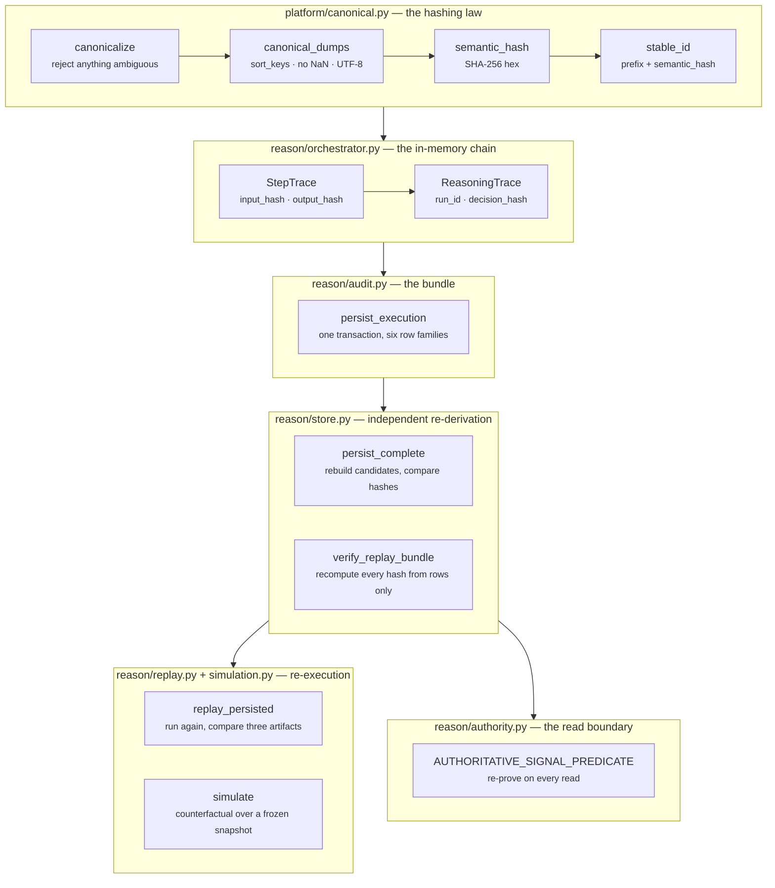
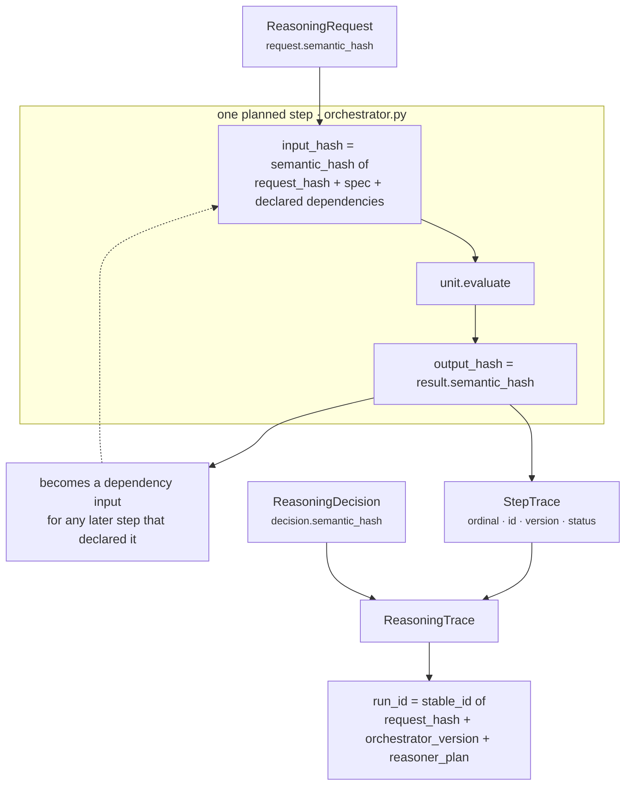
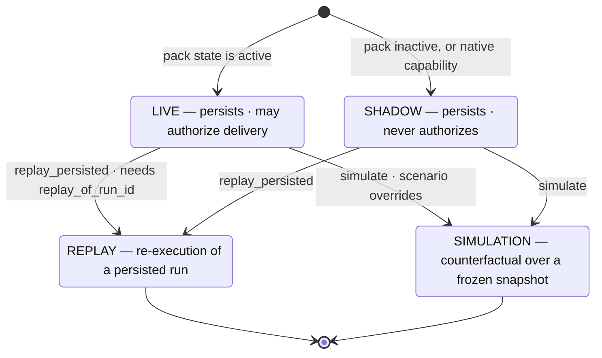
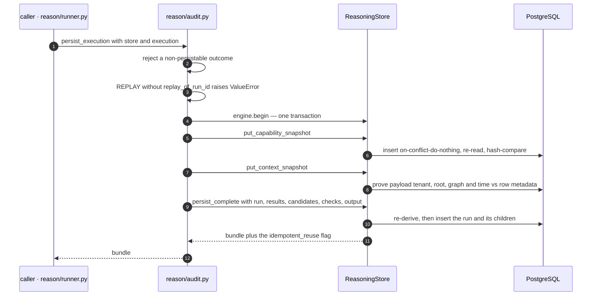
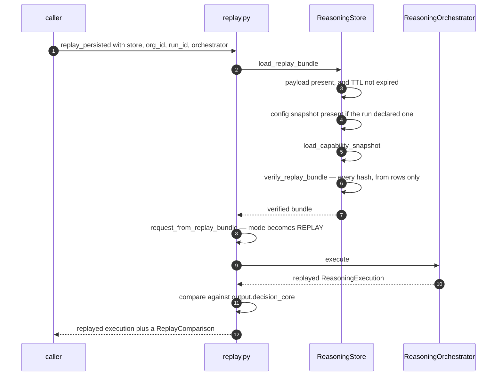
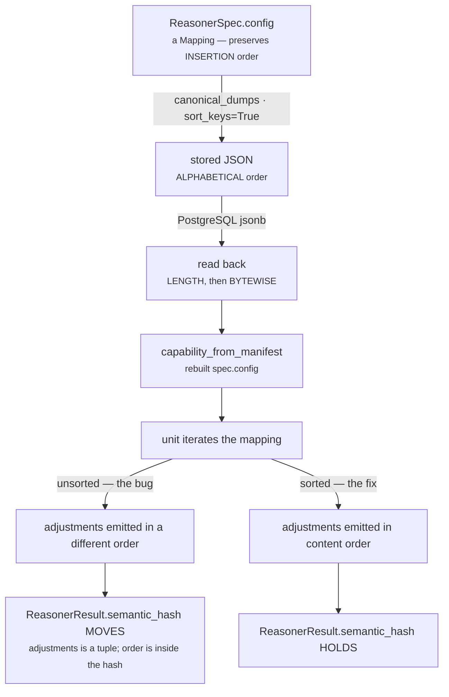

# Determinism, Audit & Replay

**Modules:** `platform/canonical.py` (~125 lines) · `reason/audit.py` (~212) · `reason/store.py`
(~1,950) · `reason/replay.py` (~190) · `reason/simulation.py` (~158) · `reason/authority.py` (~304)
**Question they answer:** *Six months from now, can we prove this decision — not assert it?*
**Output:** a hash chain, an audit bundle, a replay comparison, and a SQL predicate that re-proves
the decision on every downstream read.
**Tests:** `tests/test_reasoning_audit_replay.py` (26) · `tests/test_reasoning_config_order.py` (8) ·
`tests/test_reason_store.py` (12) · `tests/test_reasoning_authority.py` (33).

[00 · Overview](../00-Overview.md) states the five laws; [08 · Contracts & Data Flow](Contracts-and-Dataflow.md)
tabulates every content address and the canonical encoder's type rules. This document does not
repeat either. It covers the *machinery of proof*: what each hash binds, what the store independently
re-derives before it will accept a row, what replay actually compares, what the SQL authority
boundary re-proves on every read — and one defect, in full, because the way it hid is the most
instructive thing in the layer.

---

## 1 · What the blueprint asked for

The architecture makes reproducibility a property of the layer, not a testing convenience:

> *…the Reasoning Engine is what transforms both into high-quality executive decisions in a
> **deterministic, explainable, and testable** way.*

Three words, three different obligations, and only the first is about arithmetic:

| Word | What it actually demands |
|---|---|
| deterministic | the same inputs give byte-identical outputs on any machine, at any time |
| explainable | the intermediate state that produced the answer survives, not just the answer |
| testable | the claim can be *checked by something other than the code that made it* |

The blueprint specifies the first two directly. It does not specify the third's mechanism, and that
is where most of this code lives. Two of the four things documented here are not in the architecture
at all:

- **`reason/store.py`'s independent re-derivation** — the persistence layer refusing to write child
  rows unless it can reproduce them from the immutable inputs.
- **`reason/authority.py`'s SQL predicate** — every downstream reader re-proving the decision at
  query time rather than trusting the read model it is reading.

Both exist because "deterministic" is a claim about the engine, and an audit trail has to survive
the possibility that something *other than the engine* wrote a row. The engine can be perfect and
the database still be wrong.

What the architecture does prescribe, and what is built as specified, is the mode taxonomy — live,
shadow, simulation, replay — and the requirement that a decision be reconstructible from an
immutable snapshot rather than by re-querying the world.

---

## 2 · What exists

Six modules, in a strict order of trust. Each layer trusts only what the layer below it can prove.



| Module | Responsibility | Trusts |
|---|---|---|
| `platform/canonical.py` | one total encoding of a value into bytes | nothing |
| `reason/orchestrator.py` | binds each step's inputs and outputs into a chain | the encoder |
| `reason/audit.py` | assembles the bundle and commits it atomically | the chain |
| `reason/store.py` | **re-derives** the bundle before accepting it | only the immutable inputs |
| `reason/replay.py` | re-executes and compares | the store's verification |
| `reason/authority.py` | re-proves the decision at read time | only the persisted rows |

The dependency arrow that matters is the one from `store.py` back into `decision_maker.py` and
`guards.py`. Persistence importing the decision logic looks backwards until you see what it buys:
the store does not *store* a winner, it *reproduces* one and checks the caller's against it.

---

## 3 · The gap, and why

### 3.1 · The re-derivation covers `decision` and `blocked`, not `defer`

`store.py:persist_complete` runs its candidate re-derivation only when
`prepared_output["outcome_kind"] in {"decision", "blocked"}`. `no_action`, `insufficient_context`
and `failed` are structurally required to carry no candidates at all, so there is nothing to
re-derive. **`defer` is the exception.** A `DEFER` outcome deliberately keeps its ranked candidate
field — [00 · Overview](../00-Overview.md) explains why: a human being asked to decide should see what
was considered. Those candidate rows are written with their utilities, their score components and
their ranks, and no independent re-derivation runs against them.

The blast radius is bounded: `_prepare_output` refuses a `selected_candidate_id` on any non-decision
outcome, and `authority.py` requires `ro.outcome_kind='decision'`, so a `defer` bundle can never
become delivery authority no matter what its candidate rows say. What it *can* do is mislead a human
reading the deferred field. This is unfinished, not decided.

### 3.2 · The re-derivation proves consistency, not correctness

`persist_complete` re-derives candidates by calling `decision_maker.build_candidates` — the same
function that produced the values it is checking. That catches a corrupted child row, a forged pass,
a hand-edited utility, a mis-assembled bundle, and a caller that skipped a gate. It cannot catch a
bug *in* `build_candidates`, because both sides of the comparison come from the same implementation.

This is the right trade and it should be named rather than implied. The store's job is to make the
persisted rows an honest index of the immutable inputs. Proving the algorithm is the unit tests' job.

### 3.3 · `_PERSISTABLE_OUTCOMES` cannot currently reject anything

`audit.py:_PERSISTABLE_OUTCOMES` lists all six members of `DecisionOutcome`, and
`persist_execution` raises `ReasoningStoreError` for anything outside it. The guard is unreachable
today. It is kept deliberately: it is the seam where a future non-persistable outcome would be
excluded, and it documents the rule that persistence is *not* the same permission as delivery. Worth
knowing before anyone deletes it as dead code.

### 3.4 · `replay_persisted` does not verify; the concrete store does

Integrity verification lives in `ReasoningStore.load_replay_bundle`, which calls
`verify_replay_bundle` before returning. `replay_persisted` calls `store.load_replay_bundle` and
trusts it. Any store double satisfying the same method name — as
`tests/test_reasoning_audit_replay.py:_ReplayBundleStore` does — replays with no verification at
all. That is fine for a test, and a real hazard for anyone writing a second store implementation.
The verification is a property of the class, not of the replay function.

### 3.5 · Three decanonicalisers, one law

`platform/canonical.py:decanonicalize`, `reason/replay.py:decanonicalize` and
`reason/store.py:_decanonicalize` all decode the same four `$`-tagged scalars. They disagree about
containers: platform returns lists, replay returns tuples, store returns lists. The store's copy is
local specifically to avoid a `store → replay → store` import cycle, which is a real constraint and
a reasonable answer to it. It is still three implementations of something the encoder's own
docstring calls "the single hashing law." See [08 · Contracts & Data Flow](Contracts-and-Dataflow.md)
§3.9.

### 3.6 · Clamping makes adjustment summation order-sensitive at saturation

`decision_maker.py:synthesize_candidates` applies each adjustment as
`components[c] = clamp_bp(components[c] + delta)`, clamping **per adjustment** rather than once at
the end. Summation is therefore order-independent only while no intermediate value leaves
`[0, 10_000]`. Start a component at `9,000bp`, apply `+2,000` then `-1,000`: clamp to `10,000` then
`9,000`. Reverse the two: `8,000` then `10,000`. Different score, same inputs.

In the shipped `sales.deal_cooling` capability no `(play, component)` pair receives more than one
adjustment, so every sum is a single term and the hazard is unreachable. It becomes reachable the
first time two units adjust the same component of the same play. This matters for §5, where "the
decision was never wrong" depends on exactly this property.

### 3.7 · The projection law is implemented twice

`authority.py` carries `AUTHORITATIVE_SCORE_SQL = "((selected_rc.final_utility_bp + 50) / 100)"`
and `projected_score(utility_bp) = (utility_bp + 50) // 100`. PostgreSQL integer division and
Python floor division agree for non-negative operands, and `_bp` already bounds the input to
`0..10,000`, so the two agree today. The code comment names this — *"Non-negative half-up rounding
is the single projection law in Python and SQL"* — but it is one law with two implementations, and
only `test_basis_point_utility_projection_uses_half_up_rounding` holds the Python half.

---

## 4 · How it works inside

### 4.1 · Canonicalisation: why floats are rejected rather than rounded

`platform/canonical.py` opens by naming its threat model:

> *Semantic hashes are part of the reasoning contract. They must not depend on dict insertion order,
> locale, timezone, Python hash randomization, host formatting, or `default=str` fallbacks.*

Every clause is a real way two identical situations produce two different hashes. The encoder
answers each one by **refusing** the ambiguous case rather than resolving it:

| Ambiguity | Answer | Where |
|---|---|---|
| dict insertion order | `sort_keys=True` at dump time | `canonical_dumps` |
| non-string mapping keys | `CanonicalizationError` — *"silently stringifying a key could create collisions"* | `canonicalize` |
| naive datetimes | `CanonicalizationError` — must be timezone-aware, then normalised to UTC at microsecond precision | `_utc` |
| set iteration order | sorted by each item's own canonical JSON | `canonicalize` |
| list order | **preserved** — *"order is often semantic: reasoner plan, ranked candidates, play steps"* | `canonicalize` |
| an unknown type | `CanonicalizationError` — there is no `default=str` escape hatch | `canonicalize` |
| a float | `CanonicalizationError` | `canonicalize` |

The float rule is the one people argue with, so it deserves the full argument. Rounding a float to
basis points would be the obvious accommodation, and it is wrong for three separate reasons:

1. **It invents a contract nobody versioned.** A rounding rule is a decision — half-up, half-even,
   toward zero? — that would silently become part of every hash in the system, changeable by a
   one-line edit, with no version to pin it to. Two runs on two engine builds could then disagree
   about a decision while both believing they agreed.
2. **It hides collisions.** `0.7500001` and `0.7499999` would round to the same `7,500bp`. A caller
   who believed those were different values would get one hash, and the audit trail would record
   that two different situations were the same situation.
3. **A float in a semantic artifact is a bug at its source, not a formatting problem.** Layer 4's
   arithmetic is integer basis points end to end — the score, the confidence, the utility, the
   weights. A float can only arrive because something upstream did floating-point arithmetic where
   it should have done integer arithmetic. Rejecting turns that into a loud failure at the boundary;
   rounding turns it into an invisible precision policy that nobody chose.

So `7,500bp` means 0.75 and is stored as the integer `7500`. `Decimal` is accepted — tagged
`{"$decimal": "<normalised>"}` and required to be finite — because a `Decimal` carries its own exact
value rather than a host-dependent approximation of one.

`semantic_hash(value)` is SHA-256 of `canonical_dumps(value)` as UTF-8.
`stable_id(prefix, value)` is literally `f"{prefix}_{semantic_hash(value)}"` after validating the
prefix is alphanumeric-plus-underscore. Every identifier in the layer is therefore *the content*,
with a type label attached — there is no ID allocator, no sequence, and nothing to keep in sync.

### 4.2 · The hash chain across one run

The orchestrator builds two hashes per step and three per run. What each one *binds* is the whole
point; the values themselves are inert.



The subtlety that makes the chain a *proof* rather than a log is in the dependency map:

```python
dependencies = {item: prior[item] for item in spec.dependencies if item in prior}
input_hash = semantic_hash({
    "request_hash": request.semantic_hash,
    "spec": spec,
    "dependencies": dependencies,
})
```

`dependencies` is filtered to what the spec **declared**, not to everything that had already run.
So `input_hash` records what the unit was *permitted* to see. A unit that reached for an undeclared
earlier result could not do so — it never receives one — and the hash proves that constraint held,
rather than merely asserting the convention.

| Hash | Binds | Excludes, deliberately |
|---|---|---|
| `StepTrace.input_hash` | request identity, the full spec including its config, the declared dependencies' full results | everything the unit was not allowed to see |
| `StepTrace.output_hash` | `ReasonerResult.semantic_hash` — matched, metrics, findings, adjustments, checks, evidence, missing fields, reason codes | `diagnostics`, which is `compare=False` and outside `to_semantic_dict` |
| `ReasoningTrace.decision_hash` | the whole `ReasoningDecision` | `mode` — see below |
| `ReasoningTrace.run_id` | request hash, orchestrator version, the reasoner plan | the results, so the run is named by what was *asked for* |
| `ReasoningExecution.semantic_hash` | request hash, results, candidates, decision, trace | `plan` and `telemetry`, both `compare=False` |

**Mode is inside the request hash and outside the decision hash**, and that asymmetry is
load-bearing. `ReasoningRequest.to_semantic_dict` includes `mode`, so a shadow run and a live run of
the same situation get different `request_id`s, different step input hashes, different `run_id`s and
different idempotency keys — they are different rows and can never satisfy each other's writes.
`ReasoningDecision.to_semantic_dict` does *not* include mode, so a replay in `REPLAY` mode produces
a decision hash directly comparable to the live original. Replay would be meaningless if it did not,
and idempotency would be unsafe if the request hash did not.

`ReasoningExecution` excludes `plan` and `telemetry` from equality and from the hash for two
different reasons. The plan is derived from the capability and already summarised in
`trace.reasoner_plan`, so including it would let *describing* a run change the run. Telemetry is a
stopwatch reading, and admitting a stopwatch into a hash makes the same situation irreproducible on
a busier machine. Both fields are `compare=False` so that a generated `__eq__` cannot consult them
either — identity for this type is `semantic_hash` and nothing else.

### 4.3 · The four execution modes



| Mode | Set by | Persisted | Delivery | What it is for |
|---|---|---|---|---|
| `LIVE` | `runner.py` when `effective["state"] == "active"` | yes | possible | the only mode `authority.py` will accept |
| `SHADOW` | `runner.py` otherwise; `runner.py:run` also pins every native capability to shadow regardless of pack state | yes | never | run the engine in production against real situations with no consequence |
| `SIMULATION` | `simulation.py:_scenario_request` | via the same path | never | ask "what would have happened if" against a captured snapshot |
| `REPLAY` | `replay.py:replay_execution` and `request_from_replay_bundle` | yes, and `persist_execution` **requires** `replay_of_run_id` | never | prove a past decision |

`delivery_allowed` is a four-way conjunction and mode is only the first term: live **and**
`capability.live_delivery_enabled` **and** outcome is `DECISION` **and** the selected candidate's
`parameters["read_only"] is True`. `authorizes_external_mutation` returns a hard-coded `False` —
*"GeniOS v1 may deliver intelligence or a draft, never mutate an external system."*

Simulation deserves one note beyond its mode. `_scenario_request` does not merely swap facts; it
**drops the evidence for every field the scenario overrode**, because a counterfactual value has no
source. Keeping the original evidence would let a made-up fact inherit real corroboration and make
the simulated confidence look stronger than the scenario earns. It also suffixes
`selector_version` with `.simulation.v1` and stamps `simulation_scenario_id` and
`simulation_scenario_hash` into the context metadata, so a simulated snapshot can never be mistaken
for a real one by content address. Scenarios run in `sorted()` order by `scenario_id`, and duplicate
IDs are refused, so a batch of counterfactuals is itself reproducible.

### 4.4 · `persist_execution` and the audit bundle



The whole bundle is one transaction when the store is a real `ReasoningStore`; a lightweight
protocol double gets the same call sequence without one, which keeps contract tests cheap.

Three details of the bundle carry weight:

- **The idempotency key defaults to `stable_id("idem", {request_hash, mode, replay_of_run_id})`.**
  Mode is inside it. A shadow run cannot satisfy the write of a live run of the same situation.
- **The context payload has a TTL**: `expires_at = evaluation_time + context_payload_ttl_hours`,
  default `720` hours — 30 days, validated to be a positive non-boolean integer. Snapshot *metadata*
  and the source manifest are permanent; the payload is purgeable by
  `purge_expired_context_payloads`. `ContextPayloadExpired` is a distinct exception from a missing
  snapshot, so "this run's evidence aged out" is never confused with "this run never existed."
- **The source manifest records provenance and not values.** `audit.py:_source_manifest` writes
  `evidence_id`, `field`, `source_ref_id`, `fact_version_id`, `occurred_at`, `confidence_bp`,
  `authority_rank` and `independence_group` — never `value`. The value lives in the payload, under
  the payload's own hash and the payload's own TTL. Provenance outlives the data it describes.

`_trigger_family` collapses an arbitrary `trigger_kind` into five families — `replay`, `query`,
`schedule`, `manual`, `event` — by substring, with `replay` forced whenever the mode is `REPLAY`.
The original string is not lost: it is preserved as `input_manifest.original_trigger_kind`, and
`request_from_replay_bundle` reads it back so a replayed request reconstructs the *original*
trigger rather than the family. The DB column is a bounded enum for indexing; the audit record keeps
the truth.

### 4.5 · `persist_complete`'s independent re-derivation

This is the part of the layer that would be hardest to rebuild from scratch, so it is worth
following in full. The method validates everything it can *before* opening the transaction, then
runs a ladder of checks inside it. Each rung answers a specific way a bundle could lie.

```mermaid
flowchart TD
    IN["caller-supplied run + results + candidates + checks + output"]

    IN --> H1["recompute input_hash and output_hash<br/><small>supplied values, if any, must match</small>"]
    H1 --> T1["idempotency row, locked FOR SHARE<br/><small>same key + different hashes → IdempotencyConflict</small>"]
    T1 --> T2["context snapshot belongs to this tenant<br/>and agrees on capability, eval time, root node"]
    T2 --> T3["payload still exists → else ContextPayloadExpired"]
    T3 --> T4["capability manifest bytes re-read from the DB"]
    T4 --> P1["policy_snapshot_id recomputed from<br/>the stored policy bytes"]
    P1 --> P2["reasoner_plan recomputed by lexical Kahn<br/>from the stored spec bytes"]
    P2 --> P3["per-result: ordinal, identity, version,<br/>and input_hash re-derived from the DAG"]
    P3 --> P4["required completed · gating matched ·<br/>no checks from a non-completed unit"]
    P4 --> P5["candidate plays declared · read_only agrees ·<br/>decision/blocked covers every play exactly once"]
    P5 --> P6["check rows = embedded reasoner checks<br/><small>exact multiset, by semantic hash</small>"]
    P6 --> RD["RE-DERIVE"]

    subgraph RD2["decision · blocked only"]
        RD --> R1["capability_from_manifest + context_from_payload<br/><small>from stored bytes, not from the caller</small>"]
        R1 --> R2["guards: required_missing · validate_candidate_effects ·<br/>validate_evidence_references"]
        R2 --> R3["decision_maker.build_candidates"]
        R3 --> R4["compare: outcome · every candidate hash ·<br/>confidence_bp · rank-one selection"]
    end

    R4 --> POL["each declared policy has exactly one passing<br/>core.constraint check at the pinned version"]
    POL --> CFG["config snapshot id recomputed from<br/>its own effective bytes; pack must match domain"]
    CFG --> W["insert run and children"]
```



Four rungs are worth spelling out, because each closes a class of forgery.

**The plan is re-derived, not accepted.** `_topological_spec_ids` runs a lexical Kahn sort over the
*persisted* spec bytes — `heapq` for the ready set, `sorted(children[...])` for the successors — and
the caller's `reasoner_plan` must equal it exactly. Duplicate reasoner identity, a dependency that
names an unknown or itself, and a cycle all raise `ReplayIntegrityError`. A caller cannot persist a
run whose plan the capability's DAG could not have produced.

**Each result's `input_hash` is re-derived from the DAG.** For every ordinal the store rebuilds
`{request_hash, spec, dependencies}` from the manifest's declared dependency list and the results it
has already accepted, hashes it, and compares. A result claiming to have seen a dependency the spec
never declared fails here — *"reasoner result input hash differs from declared DAG dependencies."*

**Check rows must be an exact multiset of the reasoners' own checks.** The store normalises both
sides through `_contract_check` — which reconstructs the contract shape by substituting the
candidate's `play_id` back in for the run-local candidate ID — and compares
`sorted(_semantic_hash(item) ...)` on each side. Exact multiset equality, not containment, so a
caller can neither forge a pass, hide an elimination, nor duplicate one generic check to satisfy
several policies.

**The winner is reproduced.** For `decision` and `blocked`, the store rebuilds the typed capability
from the stored manifest and the typed context from the stored payload, re-runs the same guards the
orchestrator ran, recomputes `degraded` from the specs' failure policies, and calls
`build_candidates`. Then it compares four things:

| Compared | Failure message |
|---|---|
| outcome (`decision` iff any derived candidate is eligible) | *persisted outcome differs from deterministic reasoner effects* |
| the ordered list of candidate semantic hashes | *candidate values/ranks differ from deterministic reasoner effects* |
| `confidence_bp` | *decision confidence differs from deterministic reasoner effects* |
| selected ID against derived `rank_position == 1` | *selected candidate differs from deterministic rank one* |

The comment in the code states the threat model exactly: *"Child rows cannot independently assert a
10,000 utility winner when the reasoners produced a gate miss, elimination or lower score."* There is
also a standalone invariant — `initial_utility_bp` must equal `final_utility_bp`, because in this
engine a candidate's utility is a pure projection of its components and there is no post-hoc
adjustment step that could legitimately move it.

`verify_replay_bundle` is the same idea run in the opposite direction and from rows alone: ~510
lines that recompute the capability, selector, context, run-input, per-result, candidate, check,
decision and aggregate output hashes, plus the *contract-level* request, result, candidate and
decision hashes embedded in the audit envelope. It also re-proves the `trace_run_id` by recomputing
`stable_id("run", {request_hash, orchestrator_version, reasoner_plan})`. Everything is wrapped so
that a `KeyError`, `TypeError`, `ValueError` or `AttributeError` surfaces as `ReplayIntegrityError`
rather than as a deserialisation stack trace — a malformed bundle and a tampered bundle are the same
answer to the caller: *do not replay this*.

`tests/test_reasoning_audit_replay.py` parametrises fourteen single-field tamperings across the
capability manifest, the selector, five run fields, the config, a reasoner output, a candidate, a
check and the output. Each names the specific hash that catches it.

### 4.6 · Replay, and what "matches" means



Replay never touches the graph. `capability_from_manifest` and `context_from_payload` rebuild the
contracts from stored JSON, which means every `__post_init__` runs again on data that has been
through PostgreSQL and back — the evidence-matches-fact rule, the rank contiguity check, the
`gating ⇒ required` rule, all of it re-proved against the stored bytes before a single unit
re-executes. A persisted run that cannot be reconstructed into legal contracts fails at the
boundary rather than replaying into a subtly different answer.

`ReplayComparison` carries three independent booleans and a `differences` tuple naming the ones that
failed:

| Field | Compared against |
|---|---|
| `decision_matches` | `output.decision_core.contract_decision_hash` |
| `reasoners_match` | `output.decision_core.reasoner_result_hashes` — `(reasoner_id, hash)` pairs, in order |
| `candidates_match` | `output.decision_core.candidate_hashes`, in order |

`matches` is the conjunction. Three separate flags rather than one because *where* a replay diverged
is the whole diagnostic value: a decision hash that moved while every reasoner hash held means the
Decision Maker changed; reasoner hashes that moved while the decision held means a unit changed in a
way the synthesis absorbed — which is exactly the shape of the defect in §5.

`compare_executions` is the same comparison between two in-memory executions, used by
`replay_execution` and by the config-order tests. `replay_execution` does one thing worth noting:

```python
request = replace(execution.request, mode=ExecutionMode.REPLAY, request_id=None)
```

`request_id` must be cleared. It is content-derived and `mode` is part of that content, so carrying
the old ID forward would fail `__post_init__`'s *"request_id does not match request content"* check.

### 4.7 · The SQL authority boundary, and the cost of getting it wrong

`reason/authority.py` states its premise in the first line of the docstring: *"Signals are convenient
read models, not decision authority by themselves."* A `signals` row is a projection. Every consumer
that could surface or compose a recommendation must prove that the projection still points at the
exact live, unexpired winner of a completed run.

```mermaid
flowchart LR
    S["signals row<br/><small>the read model</small>"]

    subgraph J["AUTHORITATIVE_SIGNAL_JOINS"]
        direction TB
        RR["reasoning_runs"]
        RO["reasoning_run_outputs"]
        RC["reasoning_candidates<br/><small>the selected one</small>"]
        CAP["reasoning_capability_snapshots"]
        PLAY["lateral: the declared play<br/><small>from manifest jsonb</small>"]
        CON["core.constraint result<br/><small>status = completed</small>"]
        CTX["reasoning_context_snapshots"]
        CFG["config_snapshots + tenant_packs"]
    end

    S --> J
    J --> P["AUTHORITATIVE_SIGNAL_PREDICATE"]
    P --> OK["row survives → the surface may show it"]
    P --> NONE["any conjunct false → zero rows<br/><small>no error, no log line</small>"]
```



The predicate is roughly forty conjuncts. Grouped by what each family proves:

| Family | Representative conjuncts |
|---|---|
| the run is authoritative | `rr.status='completed'`, `rr.mode='live'`, `rr.root_node_id=s.subject_node_id`, `s.authority_binding_version=1` |
| the snapshots agree | context's capability id, version, snapshot id and `evaluation_time` all equal the run's; `rcap` identity equals the run's |
| the decision is the one the signal claims | `ro.outcome_kind='decision'`, `ro.decision_hash=s.reasoning_decision_hash`, `ro.ranked_candidate_ids->>0=ro.selected_candidate_id`, `selected_rc.rank_position=1`, `selected_rc.disposition='eligible'` |
| the projection is arithmetically correct | `s.score = ((selected_rc.final_utility_bp + 50) / 100)`, `s.rule_id` and `s.reason_code` re-derived from `rr.capability_id` |
| no unit was bypassed | no declared `required` reasoner lacks a `completed` result at the manifest's pinned version; no `gating` reasoner lacks `output->'matched'='true'` |
| the act is read-only | `selected_rc.parameters->'read_only'='true'` **and** `authority_play.declared_play->'read_only'='true'` |
| checks are an exact index | two symmetric `NOT EXISTS` — no persisted check without a matching embedded `core.constraint` check, and no embedded check without a matching persisted row, compared on stage, outcome, reason code, evaluator, version, detail and both scores |
| every policy is proved | for each entry in `manifest->'policies'`, exactly one passing check at the mapped `(stage, reason_code)` pair, at `core.constraint`'s pinned version, corroborated by the embedded output |
| the pack still stands behind it | `live_delivery_enabled`, `authority_pack_revision > 0` and equal to `tenant_packs.authority_revision`, pack `state='active'`, config `state='active'`, `rr.completed_at >= authority_pack.updated_at` |
| nothing has moved since | `authority_ctx.graph_version = max(graph_versions)` for the tenant |
| it has not expired | `s.authority_expires_at` is non-null, equals `ro.decision_core->'expires_at'->>'$datetime'`, and is `> :authority_time` |

Two of those are worth pausing on. The read-only check is asserted **twice** — on the persisted
candidate's parameters *and* on the play as declared in the immutable manifest — because either
alone would be a single row an attacker or a bug could flip. And the expiry conjunct reaches into
the canonical `$datetime` tag inside jsonb: the encoder's tagging scheme from §4.1 is not merely a
Python convention, it is parsed by SQL, so changing a tag name would break the authority boundary
in a language that has never heard of `platform/canonical.py`.

`AUDITED_SIGNAL_PREDICATE` is the historical variant used by learning: it omits the "still current"
family — pack revision equality, graph version, `authority_time` — because a card judged last month
was legitimately authoritative *then*. `AUDITED_CARD_JUDGMENTS_CTES` builds on it to reduce a card's
event history to exactly one canonical human judgment via
`row_number() over (partition by card_id order by occurred_at desc, id desc)`, so retries and
corrections cannot turn one recommendation into several wins.

**And here is the operational hazard.** This is a `WHERE` clause, not a `CHECK` constraint. Every
join in `AUTHORITATIVE_SIGNAL_JOINS` is an inner join. If any conjunct is false — or if any joined
row is simply absent, such as a `core.constraint` result that did not complete — the row disappears
from the result set. Not an error. Not a warning. **Zero rows.**

The predicate is used by `api/intelligence_routes.py`, `api/routes.py`, `deliver/pipeline.py`,
`deliver/store.py`, `deliver/outbox.py`, `deliver/agent_api.py`, `reason/runner.py`,
`reason/intelligence.py`, `reason/foresight.py` and `feedback/calibrate.py`. Get one conjunct wrong
and **every one of those surfaces silently shows nothing**: empty card list, empty digest, an outbox
that sends nothing, an agent API that answers "no signal", a calibration pass that sees no audited
cards and therefore learns nothing. The system looks healthy, every process is green, and no user
sees any intelligence at all.

That is the correct failure direction — fail closed, never surface an unproven recommendation — but
it is invisible by construction. Anyone editing this file should assume that a mistake will present
as "the product stopped working and nothing is in the logs," and should reach for the authority
tests (`tests/test_reasoning_authority.py` and the sibling `test_agent_api_authority.py`,
`test_executive_authority.py`, `test_learning_authority.py`, `test_context_match_authority.py` and
`test_intelligence_authority_routes.py` suites) before
reaching for the query planner.

---

## 5 · Case study — the replay-determinism defect

Found by adversarial review, reproduced end to end against the shipped `sales.deal_cooling`
capability. `Rohit_Updates/Layer 4.md` records it as a ship-blocking bug and the fix that cleared
it. This section is the mechanism, because *how it hid* generalises far beyond the two units it
touched.

### 5.1 · The mechanism

Three separate components each impose their own ordering on the same mapping, and all three
disagree.



For `core.risk`'s `play_risk_reduction_bp` in the shipped capability, all three orders are genuinely
distinct:

| Ordering | Result |
|---|---|
| insertion, as authored in `packs/capabilities/deal_cooling.py` | `restore_momentum`, `multithread_account`, `clarify_next_step` |
| `sort_keys=True`, as the store writes it | `clarify_next_step`, `multithread_account`, `restore_momentum` |
| jsonb — length, then bytewise — as PostgreSQL returns it | `restore_momentum` (16), `clarify_next_step` (17), `multithread_account` (19) |

The values are `1,800bp`, `1,600bp` and `1,200bp` respectively — identical in every ordering. Only
the sequence changed.

`ReasonerResult.adjustments` is a `tuple`, and `canonicalize` preserves list and tuple order
*deliberately*, because for the reasoner plan, the ranked candidate field and a play's steps order
carries meaning. So a permuted adjustment tuple is, to the encoder, a different value — and
`ReasonerResult.semantic_hash` moves.

### 5.2 · Why nothing upstream noticed

This is the part worth internalising. Every identifier the system checks is computed from
**already-sorted bytes**, so reordering is invisible to all of them:

| Identifier | Derived from | Sees the reordering? |
|---|---|---|
| `capability_snapshot_id` | `stable_id("cap", manifest)` → `canonical_dumps` → `sort_keys=True` | no |
| `CapabilityManifest.semantic_hash` | same path | no |
| `request_id` / `request.semantic_hash` | includes `capability_snapshot_id`, not the raw config | no |
| `StepTrace.input_hash` | `semantic_hash({request_hash, spec, dependencies})` — the spec goes through the same sorted serialiser | **no** |
| `ReasonerResult.semantic_hash` | includes the *adjustments tuple*, whose order came from iteration | **yes** |

`tests/test_reasoning_config_order.py:test_the_identifiers_that_hid_the_bug_stay_stable` asserts
exactly this, which is the right way to encode a lesson: it proves the *invisibility*, so the next
reader understands why no guard fired.

The input side of the hash chain was clean and the output side had moved. `replay_persisted()`
therefore reported **every persisted `deal_cooling` run as non-reproducible**, with
`differences == ("reasoner_results",)` and a clean `decision_hash`, and with nothing upstream
signalling that any input had changed.

### 5.3 · Why the decision was still correct — and the caveat

`decision_maker.py:synthesize_candidates` sums adjustments per `(play, component)`. A permutation of
the summands cannot move a sum, so no score, no rank and no selection ever changed. The decision was
never wrong. What broke was the mechanism that *proves* it was right, which for an audit trail is
nearly as bad — an auditor cannot distinguish "the engine is deterministic and the hash bookkeeping
has a bug" from "the engine is not deterministic" without reading the code, and if they could read
the code they would not need the audit trail.

The caveat from §3.6 applies here and should be carried forward: summation is order-independent only
because `clamp_bp` never saturates on these inputs. In the shipped capability no `(play, component)`
pair receives more than one adjustment, so each sum is a single term. Add a second unit that adjusts
`restore_momentum.urgency` and the "a permutation cannot move a score" argument stops holding at the
bounds.

### 5.4 · The fix

Ordering now comes from content and nowhere else, at three sites:

| Site | Change |
|---|---|
| `reasoners/temporal.py` | `for play_id, config in sorted(dict(spec.config.get("play_adjustments") or {}).items())` |
| `reasoners/temporal.py` | inner loop: `for component, delta in sorted(config.items())` |
| `reasoners/risk.py:PlayMitigationPlugin.contribute` | `for play_id, reduction in sorted(authored.items())` |
| `reasoners/risk.py` build step | `for play_id in sorted(observation.metrics)` — the consumer sorts again |

The load-bearing sort in `core.risk` is the consumer one: `Observation.metrics` is an internal
mapping that never reaches a hash directly, so it is the adjustment tuple built from it that must be
ordered. The plugin's own `sorted()` is defence in depth, and the class docstring says so — *"The
scan is `sorted()`, and the consumer sorts again."*

Each fix carries the reasoning inline rather than a bare `# sorted`. `temporal.py`:

> *Sorted, not insertion-ordered. Adjustment order is inside this result's semantic hash, and the
> manifest makes a round trip through JSON on its way to the audit store — which re-sorts object
> keys. Iterating in whatever order the mapping arrived in would make a replayed run hash differently
> from the original while the request hash stayed identical, reporting every persisted run as
> non-reproducible.*

That comment is the actual fix. The `sorted()` is trivial to re-break; the sentence explaining why
it is there is what stops someone from doing it.

### 5.5 · Why the existing replay tests could not see it

`tests/test_reasoning_audit_replay.py` builds every persisted row with `canonicalize()` — a pure
Python transform that converts values to JSON primitives and **preserves mapping key order**. The
store does not use `canonicalize()`; it uses `canonical_dumps()`, which is
`json.dumps(canonicalize(v), ..., sort_keys=True)`. One function call apart, and the ordering
behaviour is opposite.

So the replay suite proved that a manifest survives *tagging* and comes back identical, which is
true and worth proving, and never exercised the *serialisation* the store actually performs. The new
test file closes that with `_store_serialised`:

```python
return capability_from_manifest(json.loads(canonical_dumps(capability.to_semantic_dict())))
```

— the exact bytes the store writes, parsed back the way a database read returns them.

A second parametrisation, `_keys_reordered`, reverses every object's keys as a database-free stand-in
for jsonb's length-then-bytewise rule. **Worth knowing:** for `deal_cooling` specifically, reversing
the alphabetically-sorted keys happens to reproduce the authored insertion order exactly — for both
`play_adjustments` and `play_risk_reduction_bp`. So today only the `store_serialised` parametrisation
actually discriminates; `keys_reordered` is currently a tautology for this capability. It earns its
place against a *future* capability whose key names sort differently under the two rules, but nobody
should read a green `keys_reordered` as independent evidence right now.

### 5.6 · Guarding the guard

The first version of the regression test **passed with the bug reintroduced.** Its fixture
capability authored no per-play config, so there was no mapping to reorder and the test proved
nothing while looking green — the most dangerous state a test can be in.

Hence `test_the_fixture_still_exercises_order_sensitive_config`, which asserts two things about the
fixture rather than about the engine:

```python
assert exercised, f"no unit authors any of {ORDER_SENSITIVE_KEYS}"
assert any(len(dict(spec.config.get(key, {}))) > 1
           for spec in DEAL_COOLING_V1.reasoners for key in ORDER_SENSITIVE_KEYS), \
    "a single-entry mapping cannot be reordered, so it cannot detect the regression"
```

Some unit must author one of the order-sensitive keys, and at least one of those mappings must have
more than one entry — because a single-entry mapping has exactly one ordering and cannot detect
anything. `ORDER_SENSITIVE_KEYS` is a named module constant, so a future author adding a per-play
config block can see immediately that ordering is load-bearing here.

The file's eight tests split into four intents:

| Test | Proves |
|---|---|
| `test_the_fixture_still_exercises_order_sensitive_config` | the other seven are not vacuous |
| `test_a_capability_reasons_identically_after_a_store_round_trip` | the end-to-end claim, via `compare_executions` |
| `test_every_unit_hashes_identically_after_a_round_trip` | which unit drifted, by name, rather than "replay broke" |
| `test_adjustment_order_is_a_function_of_content_not_arrival_order` | the precise mechanism, asserted directly — and refuses to pass if the run produced no adjustments |
| `test_the_identifiers_that_hid_the_bug_stay_stable` | why no upstream guard fired |

The last one is the one to copy the pattern from. A regression test that only proves the bug is gone
lets the next reader assume it was obvious. A test that also proves *the bug was invisible* tells
them why to be careful.

### 5.7 · What this costs, operationally

Runs persisted *before* the fix still replay as diverged; they always did. There is nothing to
migrate, because the native kernel is shadow-locked and no persisted authority exists yet — see
`Rohit_Updates/Layer 4.md` for the activation sequence. The generalisable rule is the one the two
docstrings now carry: **anywhere a mapping's iteration order reaches a semantic artifact, the order
must be a function of the content.** The audit store re-sorts, PostgreSQL re-sorts again, and neither
of them will tell you.

---

## 6 · Edge cases and failure modes

| Situation | Behaviour |
|---|---|
| A float anywhere in a semantic artifact | `CanonicalizationError`, *"floats are forbidden"*. Never rounded. |
| A naive `datetime` in a semantic artifact | `CanonicalizationError`, *"semantic datetimes must be timezone-aware"*. |
| A mapping key literally named `$decimal`, `$datetime`, `$date` or `$uuid` | `CanonicalizationError` — reserved for scalar tagging. |
| A non-string mapping key | `CanonicalizationError` — stringifying could collide. |
| `stable_id` prefix with punctuation | `ValueError`, *"stable id prefix must be alphanumeric/underscore"*. |
| Same idempotency key, different content | `IdempotencyConflict`, raised both before and after the insert attempt. |
| Same idempotency key, same content | Returns the committed bundle with `idempotent_reuse: True`; never a second decision. |
| Context payload purged or past its TTL | `ContextPayloadExpired` — distinct from a missing snapshot, checked in both `load_replay_bundle` and `verify_replay_bundle`. |
| Capability snapshot missing at replay time | `ReasoningStoreError`, *"capability snapshot is unavailable for replay"*. |
| Run declared a `config_snapshot_id` but the row is gone | `ReasoningStoreError`, *"effective config snapshot is unavailable for replay"*. |
| Any single byte tampered in a persisted row | `ReplayIntegrityError`, naming the specific hash that failed. |
| A malformed bundle — missing key, wrong type | Also `ReplayIntegrityError`, via the `KeyError`/`TypeError`/`ValueError`/`AttributeError` wrapper. |
| `persist_execution` in `REPLAY` mode without `replay_of_run_id` | `ValueError` in `audit.py`; the store raises again independently. |
| `context_payload_ttl_hours` of `0`, negative, or `True` | `ValueError` — booleans are explicitly rejected as integers. |
| A required reasoner incomplete on a `decision` bundle | `ReasoningStoreError` at write time; `ReplayIntegrityError` at verify time; the row is excluded by the SQL predicate at read time. Three independent refusals. |
| A gating reasoner that did not match, on a `decision` | Same three refusals. |
| Duplicate simulation `scenario_id` | `ValueError`, *"simulation scenario IDs must be unique"*. |
| A simulation overriding a fact that had evidence | Evidence for that field is dropped, so confidence reflects the counterfactual honestly. |
| `authority_time` naive | `ValueError`, *"authority_time must be timezone-aware"*. |
| `projected_score` given a bool, or a value outside `0..10,000` | `TypeError` / `ValueError`. |
| Any authority conjunct false | **Zero rows, no error.** See §4.7. |

---

## Related

| Document | Covers |
|---|---|
| [00 · Overview](../00-Overview.md) | The five laws, and why there are no wall-clock timeouts |
| [01 · Orchestrator](../01-Reasoning-Orchestrator/README.md) | Where `StepTrace` is built, and how a failure becomes a typed result |
| [02 · Unit Framework](../02-Reasoning-Units/README.md) | The eight stages, and why a unit may not fetch anything |
| [04 · Business Evaluation](../02-Reasoning-Units/02-Business-Evaluation/README.md) | `core.risk` — the unit whose adjustment ordering broke replay |
| [07 · Decision Maker](../03-Decision-Maker/README.md) | `build_candidates`, the function `store.py` re-derives against |
| [08 · Contracts & Data Flow](Contracts-and-Dataflow.md) | Every content address, the canonical encoder's type table, the two decanonicalisers |
| [10 · Integration & Activation](Integration-and-Activation.md) | Where `persist_execution` is called from, and the shadow-to-live sequence |
