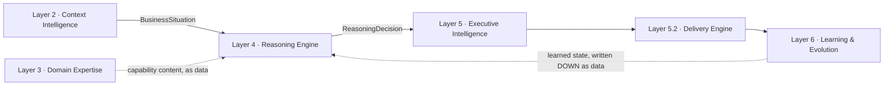
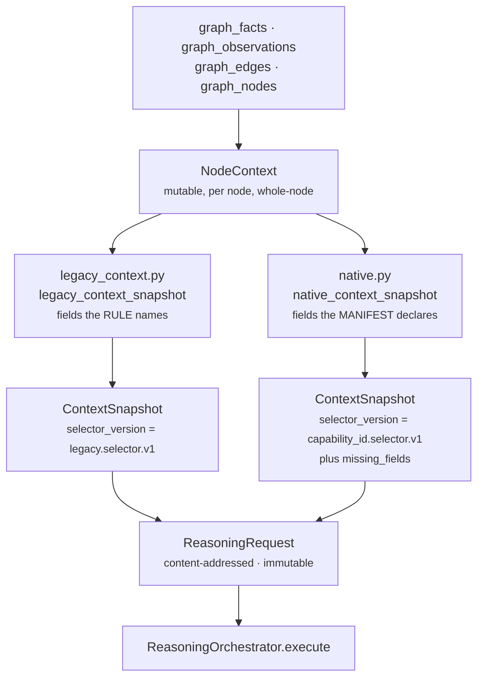
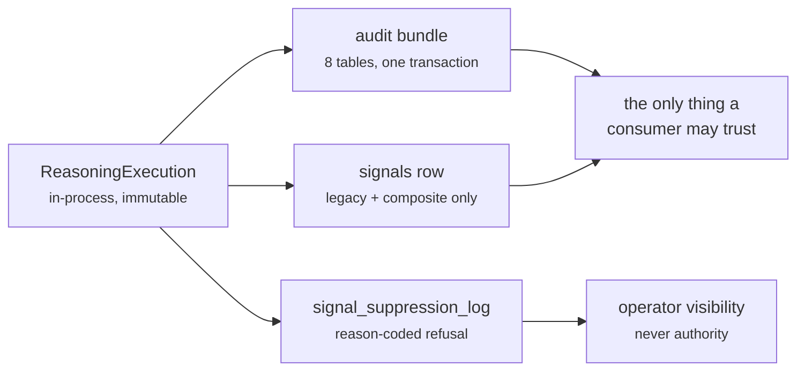
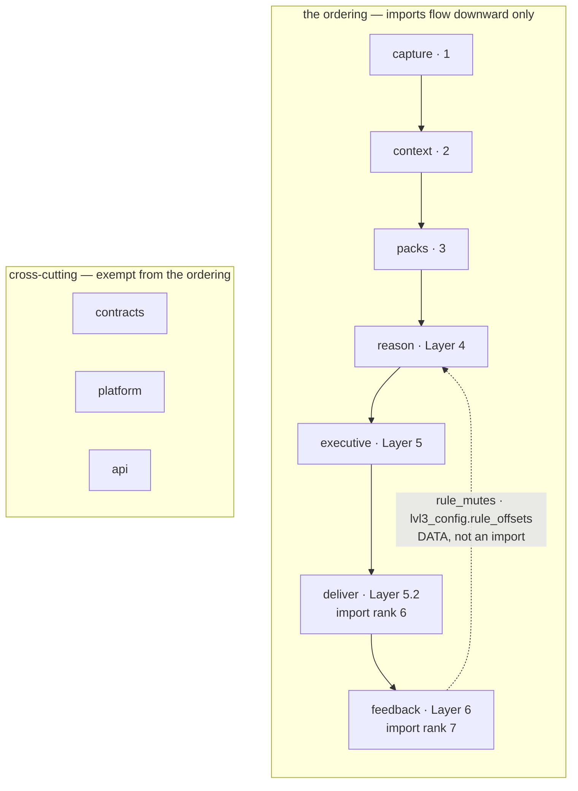
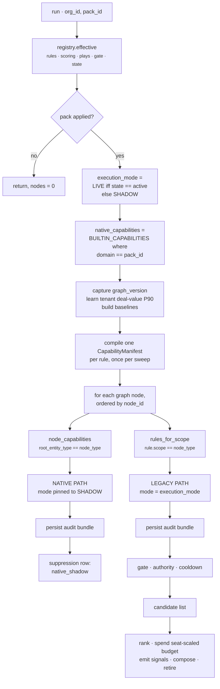
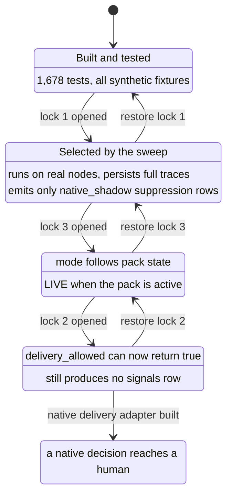
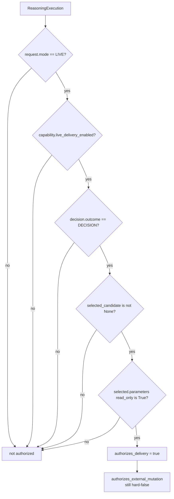
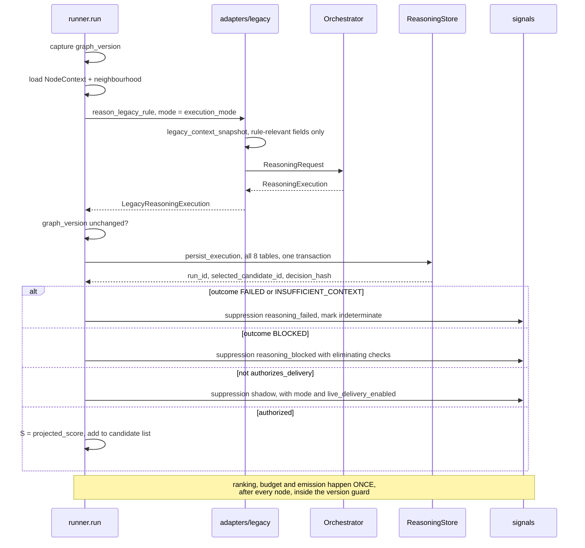
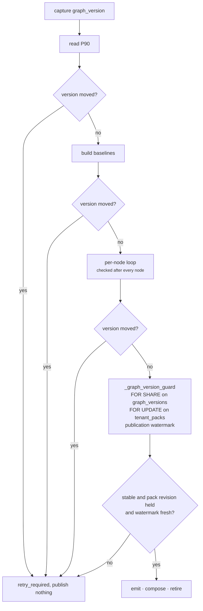

# Integration & Activation

**Package:** `genios_engine/reason/` — the seams, not the cognition
**Question it answers:** *What does Layer 4 read, what does it hand on, who is allowed to believe it,
and what is still switched off?*
**Status:** every seam on the legacy path is live. Every seam on the native path is built and pinned
to shadow, and one of them — the native delivery adapter — does not exist yet.

The cognition itself is described in [00 · Overview](../00-Overview.md) and the documents it indexes.
This document is about the edges: the two layers below that feed L4, the four packages above that
read it, the one rule that keeps that traffic one-directional, and the three deliberate locks
standing between a built engine and a live one.

---

## 1 · What the blueprint asked for

The architecture draws Layer 4 with exactly one arrow in and one arrow out:



Three things in that picture are load-bearing, and the specs say so explicitly.

**The input is a situation, not a row.** The blueprint's entry point is `Business Situation` — a
correlated cluster of events with a confidence attached — not "a node in the graph". Layer 2's own
code agrees; `context/situations.py:active_situations` carries the docstring *"What the Reasoning
Engine asks for instead of asking for the graph."*

**Expertise arrives as data, never as an import.** From `docs/LAYER_MAP.md`: *"The four brains +
capability content, shipped as data."* Layer 4 must not know that "sales" exists as a concept in its
own code; it must receive a manifest that happens to be about sales.

**Nothing above L4 may reason.** The warning in the architecture is aimed at exactly this seam:

> *"If it starts making decisions, then you've accidentally created two reasoning engines. That's
> architectural leakage. There should only be one place where thinking happens."*

That sentence is why the integration surface is a *predicate* rather than a table read. If Layer 5
could select its own winner from a list of candidates, Layer 5 would be reasoning.

And the whole ordering rests on one rule, stated in `System Design/README.md` and again in
`genios_engine/LAYERS.py`: **a lower layer never imports a higher one.** Cross-layer needs are met
two ways only — injection from `platform/wiring.py`, or a table written above and read below.

---

## 2 · What exists

### 2.1 · What Layer 4 consumes

Two inputs, and one back-channel from above that arrives as data rather than as an import.

| From | Mechanism | Symbol | Shape |
|---|---|---|---|
| L2 · context | direct SQL over `graph_facts`, `graph_observations`, `graph_edges`, `graph_nodes` | `reason/runner.py:_load_context`, `reason/runner.py:_neighbor_index` | mutable `NodeContext` |
| L2 · context | derived metrics + baselines | `reason/baselines.py:build_baselines`, `reason/baselines.py:load_node_metrics` | folded into `NodeContext.facts` |
| L3 · packs | tenant-effective config resolution | `packs/registry.py:PackRegistry.effective` | `{rules, scoring, plays, gate, budget, state}` + `config_snapshot_id` |
| L3 · packs | native capability manifests | `packs/capabilities/__init__.py:BUILTIN_CAPABILITIES` | immutable `CapabilityManifest` |
| Layer 6 · feedback | `rule_mutes` table | `reason/runner.py:_muted_rules` | set of silenced rule ids |
| Layer 6 · feedback | `lvl3_config.rule_offsets` inside the effective config | `reason/adapters/legacy_pack.py:legacy_capability_manifest` | per-rule score-gate offset |

The mutable `NodeContext` never reaches the kernel. Two adapters stand between it and
`ReasoningRequest`, and they differ in exactly one respect — *who decides which fields are relevant*.



`legacy_context_snapshot` derives its field set from the rule itself —
`legacy_context.py:_relevant_fields` walks `rule.evidence_fields`, `rule.urgency["path"]`, every
`when` condition's `path`/`exists`/`absent`, adds `deal.value` when `rule.linked_deal` is set, and
routes `neighbor_fact` keys into a separate neighbour partition. `native_context_snapshot` derives
its set from the manifest — `native.py:_selected_fields` unions `capability.required_fields`, every
`ReasonerSpec.required_fields`, and every play precondition `field`, splitting anything prefixed
`neighbor:` into the neighbour partition.

The consequence is worth stating plainly: **the snapshot is the smallest thing that could have
produced the decision.** A rule that names three fields cannot cite a fourth, because the fourth is
not in the frozen input at all. That is not a size optimisation — it is what makes
`guards.py:validate_evidence_references` able to reject a citation as forged.

Only the native adapter records `missing_fields`. The legacy adapter silently omits an absent field,
because the legacy rule language already treats absence as a condition (`absent`) rather than as a
defect.

### 2.2 · What Layer 4 produces

Three artifacts, in descending order of authority.



**`ReasoningExecution`** (`reason/orchestrator.py:ReasoningExecution`) is the complete semantic
result: the request, the ordered `ReasonerResult`s, the candidates, the decision, and the trace. Its
`plan` and `telemetry` fields are `compare=False` and excluded from `to_semantic_dict`, so describing
a run can never change the run.

**The audit bundle.** `reason/audit.py:persist_execution` commits eight tables inside one
transaction:

| Table | Written by | Holds |
|---|---|---|
| `reasoning_capability_snapshots` | `store.py:ReasoningStore.put_capability_snapshot` | the manifest bytes, content-addressed |
| `reasoning_context_snapshots` | `store.py:ReasoningStore.put_context_snapshot` | selector, graph version, evaluation time, source manifest |
| `reasoning_context_payloads` | same | the frozen facts, TTL `context_payload_ttl_hours` = **720 hours** |
| `reasoning_runs` | `store.py:ReasoningStore.persist_complete` | idempotency key, mode, trigger family, plan, engine build |
| `reasoning_reasoner_results` | same | one row per unit, with `input_hash` and `output_hash` |
| `reasoning_candidates` | same | every candidate, eligible and eliminated |
| `reasoning_candidate_checks` | same | every check, including the ones that eliminated |
| `reasoning_run_outputs` | same | outcome kind, selected id, ranked ids, decision core, `decision_hash` |

Six outcomes are persistable (`audit.py:_PERSISTABLE_OUTCOMES`): `DECISION`, `NO_ACTION`, `DEFER`,
`INSUFFICIENT_CONTEXT`, `BLOCKED`, `FAILED`. That list is the whole enum, and that is the point —
the docstring says it: *"Failed and negative outcomes are audit records, never delivery authority.
Persisting them is what makes fail-closed behavior inspectable and replayable instead of leaving
only a log line."*

**The `signals` row.** Only two paths write one. `reason/runner.py:_emit` writes it for a legacy
rule; `reason/composer.py:compose_deal_health` writes it for the composite. Both stamp the row with
`reasoning_run_id`, `reasoning_candidate_id`, `reasoning_decision_hash`, `authority_expires_at`,
`authority_pack_revision`, and `authority_binding_version=1`. Those five columns are not metadata —
they are the join keys the authority predicate uses to re-derive the decision from the audit bundle
on every downstream read. A `signals` row with them missing is unreadable by design.

### 2.3 · Who consumes it, and through what

Every consumer goes through one of two SQL fragments exported by `reason/authority.py`. There is no
second path, and the fragment's own docstring explains why:

> *"Signals are convenient read models, not decision authority by themselves. Every consumer that
> can surface or compose a recommendation must prove that the signal still points at the exact live,
> unexpired winner from a completed reasoning run. Keeping that proof in one fragment prevents
> query, composition, and delivery from quietly drifting apart."*

| Consumer | File | Fragment used |
|---|---|---|
| Executive · brief composition | `executive/brief.py:load_briefs` | `AUTHORITATIVE_SIGNAL_JOINS` + `AUTHORITATIVE_SIGNAL_PREDICATE` |
| Executive · attention/authority helpers | `executive/authority.py` | re-exports the fragments to L5 |
| Executive · memory, summary, modes, sweep | `executive/memory.py`, `executive/summary.py`, `executive/modes.py`, `executive/sweep.py` | predicate |
| Executive · execution-object guard | `executive/execution_store.py` | predicate, at the transition boundary |
| Deliver · card build, outbox, push, agent API, actions | `deliver/pipeline.py`, `deliver/outbox.py`, `deliver/push.py`, `deliver/agent_api.py`, `deliver/actions.py`, `deliver/store.py` | predicate |
| Feedback · calibration | `feedback/calibrate.py` | `AUDITED_CARD_JUDGMENTS_CTES` |
| Reason · foresight | `reason/foresight.py` | `AUDITED_CARD_JUDGMENTS_CTES` |
| Reason · composite + on-demand intelligence | `reason/composer.py`, `reason/intelligence.py` | predicate |
| API · signals, insights, cards | `api/routes.py`, `api/intelligence_routes.py` | predicate |

Two fragments, two jobs. `AUTHORITATIVE_SIGNAL_PREDICATE` answers *"may this be shown right now"* —
it is `AUDITED_SIGNAL_PREDICATE` plus six liveness clauses: the tenant pack is `active`, the signal's
`authority_pack_revision` matches the pack's current revision, the config snapshot's effective
version matches the pack's version, the run completed at or after the pack was last updated, the
context's `graph_version` equals the org's current maximum, and
`s.authority_expires_at > :authority_time`. `AUDITED_SIGNAL_PREDICATE` alone answers *"was this ever
a valid decision"*, which is the correct question for learning — a card judged three weeks ago is
still a real judgement even though the signal has since expired. `tests/test_learning_authority.py`
pins that difference by asserting the expiry clause is **absent** from the learning path.

### 2.4 · The import-direction rule, and how it is enforced

`genios_engine/LAYERS.py` records product identifiers and the separate integer import ranks used
by the topology comparison. Product numbering ends at Layer 6; rank 7 means only that
`feedback/` is last in this dependency ordering.



`tests/test_layer_topology.py:test_import_direction` walks every `.py` file under each declared
layer package with `ast`, collects the top-level `genios_engine.*` subpackages it imports, and fails
the build if any imported package's import rank exceeds the importing package's. Nothing is
executed, so the check costs nothing and cannot be defeated by a lazy import inside a function —
`api/routes.py` imports `reason.runner` inside the handler body and the AST still sees it.

Three consequences that matter when reading the code:

- **`reason/` importing `context/` is legal and intentional.** `runner.py` imports
  `context.graph_store:GraphStore`, and `signals_derived.py` imports `context.vocabulary`. Layer 2 is
  *below* Layer 4; the rule forbids upward imports, not downward ones.
- **`deliver/` and `executive/` importing `reason.authority` is legal.** Product Layers 5 and
  5.2 have higher import ranks than Layer 4.
  This is how the predicate reaches its consumers without L4 knowing they exist.
- **Layer 6 Learning can never import Layer 4.** So everything Layer 6 learns must land in a table. It does:
  `rule_mutes`, read by `runner.py:_muted_rules`, and `lvl3_config.rule_offsets`, read by
  `legacy_pack.py:legacy_capability_manifest` where it shifts the score gate. `_muted_rules` carries
  the reasoning in its docstring — *"never as an upward code import; the layer-topology test enforces
  that."*

A second test, `test_contracts_import_nothing_above_platform`, holds `contracts/` to `platform` and
stdlib only. That is what lets a `ReasoningDecision` cross any boundary without dragging a layer
behind it.

### 2.5 · The runner sweep

`reason/runner.py:run` is the composition point where all of the above meets. It is entered from
three places, all in `api/routes.py`: the background pass after an L2 update (`_run_l2`), the manual
`POST /context/reason`, and the daily internal cron `POST /context/sweep`. All three call
`runner.py:run_all`, which enumerates the org's `active` and `shadow` packs and calls `run` once per
pack.



**Capability selection is two equality checks, and nothing else.** A native manifest is in scope for
this pack when `capability.domain == effective["pack_id"]`, and in scope for this node when
`capability.root_entity_type == nd.node_type`. There is no registration step, no feature flag table,
no per-tenant enablement row. That is deliberate — the selection is a property of the manifest's own
immutable bytes, so it survives replay. It also means a capability whose `root_entity_type` matches
nothing in the graph runs zero times and reports nothing, which is the single most common reason a
newly added capability appears to do nothing.

**The two paths differ in five ways.**

| | Legacy path | Native path |
|---|---|---|
| Entry | `adapters/legacy.py:reason_legacy_rule` | `adapters/native.py:reason_native_capability` |
| Manifest | compiled per rule by `legacy_pack.py:legacy_capability_manifest` | authored in `packs/capabilities/` |
| Units | `legacy.rule`, `legacy.score_gate`, `core.constraint`, `core.priority`, `core.confidence`, `core.planning` | the manifest's declared DAG — 7 units in v1, 17 in v2 |
| Mode | `execution_mode` — `LIVE` when the pack is `active` | **hard-pinned** to `ExecutionMode.SHADOW` |
| Output beyond audit | a `signals` row | a `native_shadow` suppression row, and nothing else |

The native path also has a side effect on the legacy path that is easy to miss:
`need_neighbors = _rules_need_neighbors(all_rules) or bool(native_capabilities)`. Adding any native
capability to a pack forces the three org-wide neighbour queries to run for every sweep, whether or
not any rule needs them. That is correct — native manifests can declare `neighbor:` fields, and
`_selected_fields` cannot know in advance whether they will be populated — but it changes the sweep's
query profile.

---

## 3 · The gap, and why

### 3.1 · Layer 4 reasons about nodes, not situations

The blueprint's input is a `BusinessSituation`. The code's input is a `NodeContext`, one per row of
`graph_nodes`. `context/situations.py:active_situations` exists, is tested, is exposed at
`/v1/situations`, and has **zero callers inside `reason/`** — the only production caller is
`api/situation_routes.py`.

This is an admission, not a decision that turned out well. It is recorded as deliberate deferral in
`Rohit_Updates/Layer 4.md` Part 6: the unit roster and the input contract were not going to change in
the same move.

What Layer 4 loses by reasoning per node:

- **Correlation confidence is invisible.** A situation carries `confidence_overall` decomposed into
  evidence, freshness, consistency and identity. A `NodeContext` carries per-fact confidence and no
  view of whether the cluster it belongs to hangs together.
- **The join is reconstructed rather than received.** `runner._neighborhood` rebuilds a one-hop
  neighbourhood per node from a bulk index, and `signals_derived.deal_activity_facts` cross-joins
  the CRM deal to the email thread. Layer 2 already did that work when it built the correlation; L4
  is doing it again, from a different angle, with a different tie-break.
- **Coverage and `missing` are not consulted.** A situation records what it knows it is missing.
  The native adapter computes its own `missing_fields` from the capability's declared field list,
  which answers a narrower question: *this capability's inputs* rather than *this situation's gaps*.

The cost of closing it is a new context adapter — call it `adapters/situation_context.py` — plus a
selection rule keyed on `situation_type` instead of `node_type`. The unit roster does not change; the
units already read a `ContextSnapshot` and do not know where it came from. That is the one piece of
good news in this gap: the seam was built in the right place.

### 3.2 · The three locks

Three edits stand between the engine as built and the engine as live. Each is one line, each is
independently reversible, and each was placed for a different reason.

| # | Location | `file:symbol` | Effect |
|---|---|---|---|
| 1 | `BUILTIN_CAPABILITIES = (DEAL_COOLING_V1,)` | `packs/capabilities/__init__.py:BUILTIN_CAPABILITIES` | The 17-unit v2 manifest is never selected by the sweep |
| 2 | `live_delivery_enabled=False` | `packs/capabilities/deal_cooling.py:build_deal_cooling_manifest` and `packs/capabilities/deal_cooling_v2.py:build_deal_cooling_full_manifest` | No native decision can satisfy `delivery_allowed` |
| 3 | `mode=ExecutionMode.SHADOW` | `reason/runner.py:run`, at the `reason_native_capability` call | The native path is shadow regardless of pack state |



Lock 1 is about **exposure**: v2 has never seen a real deal, and the cheapest way to learn what
twelve additional units say is to let them say it into an audit table. Lock 3 is about **ordering**:
the runner computes `execution_mode` correctly and then ignores it for native capabilities, so
opening lock 1 cannot accidentally open lock 3. Lock 2 is about **the manifest's identity**: flipping
`live_delivery_enabled` changes the manifest bytes and therefore its `capability_snapshot_id`, which
is correct — a capability that may advise a human is not the same capability as one that may not.

The step-by-step runbook, including the verification SQL and the rollback, is in
[`Rohit_Updates/Layer 4.md`](../../../Rohit_Updates/Layer%204.md) Part 5. It is not repeated here.

### 3.3 · The delivery authority boundary

`ReasoningExecution.delivery_allowed` is four conjunctions, and its docstring states the intent:
*"Only a live, successful, read-only decision may cross into the delivery layer."*



`authorizes_external_mutation` returns the literal `False`, with no condition attached:
*"GeniOS v1 may deliver intelligence or a draft, never mutate an external system."* Nothing in the
codebase reads it as a variable — it is a named, testable statement of scope, pinned by
`tests/test_reasoning_composition.py` and `tests/test_reasoning_orchestrator.py`.

The `read_only` check is doubled deliberately. The Python property reads
`selected.parameters.get("read_only") is True` — the candidate's own frozen parameters, which came
from the play. The SQL predicate checks **both** `selected_rc.parameters->'read_only' = 'true'::jsonb`
*and* `authority_play.declared_play->'read_only' = 'true'::jsonb`, the latter read out of the manifest
snapshot via a lateral join. A candidate row claiming read-only for a play the manifest declares as
mutating fails the second check. That redundancy exists because the two rows can be corrupted
independently.

**Two asymmetries in this boundary are worth knowing before you change anything.**

First, `CapabilityManifest.live_delivery_enabled` defaults to **`True`**
(`contracts/reasoning.py:CapabilityManifest`). `legacy_pack.py:legacy_capability_manifest` never
mentions the field, so every compiled legacy capability is delivery-enabled by omission. That is why
the legacy path works at all — but it also means a new native manifest that forgets the flag ships
live on its first deploy. The two `deal_cooling` manifests are locked because they say `False`
explicitly, not because anything defaults them shut.

Second, the brief for this document said both native capabilities are locked at
`live_delivery_enabled=False`, and that is true of the two `deal_cooling` manifests — but there is a
**third** native manifest. `packs/capabilities/deal_health.py:build_deal_health_manifest` sets
`live_delivery_enabled=True`. It is not in `BUILTIN_CAPABILITIES`, so the sweep never selects it;
instead `reason/composer.py:compose_deal_health` reasons it directly, with
`mode=execution_mode` — `LIVE` when the pack is active — and writes a real `signals` row. So the
native kernel already reaches production today, through the composite path rather than the sweep.
That is the closest thing to a worked example of the adapter described next, and anyone building the
missing one should read `composer.py` lines around `_reason_composite` before writing a new line.

### 3.4 · The missing native delivery adapter

This is the largest remaining build item in Layer 4.

Today the native path ends at `persist_execution` plus a `native_shadow` row in
`signal_suppression_log`. There is nothing that turns a `ReasoningExecution` into something a
consumer can read. The legacy path has `runner.py:_emit`; the composite path has the insert inside
`composer.py:compose_deal_health`; the native sweep path has nothing.

**What it must emit.** A `signals` row is not a notification — it is a claim that a specific audited
decision is currently authoritative. `AUTHORITATIVE_SIGNAL_PREDICATE` re-derives that claim on every
read, and it will reject the row unless all of the following hold:

| Requirement | Where it comes from |
|---|---|
| `reasoning_run_id`, `reasoning_candidate_id`, `reasoning_decision_hash` all set and mutually consistent | the audit bundle returned by `persist_execution` |
| `authority_binding_version = 1` | literal |
| `rr.mode = 'live'` and `rr.status = 'completed'` | requires locks 2 and 3 already open |
| `ro.outcome_kind = 'decision'` and `ranked_candidate_ids[0] = selected_candidate_id` | the Decision Maker, unchanged |
| `selected_rc.disposition = 'eligible'` and `rank_position = 1` | the Decision Maker, unchanged |
| `s.play = selected_rc.play_id` | the emitter must copy the play id, not re-derive it |
| `s.score = (final_utility_bp + 50) / 100` | must use `authority.py:projected_score`, not a second rounding rule |
| `s.rule_id = regexp_replace(capability_id, '^.*\.', '')` | for `sales.deal_cooling` that is `deal_cooling` |
| `s.reason_code` equals the same expression for non-legacy capabilities | `AUTHORITATIVE_REASON_CODE_SQL` |
| every `required` and every `gating` reasoner in the manifest has a `completed` result row | the orchestrator produces these; the emitter must not filter them |
| every declared policy has one distinct matching `pass` check row, at the right stage and reason code | `core.constraint`, indexed into `reasoning_candidate_checks` |
| `s.authority_expires_at` equals `decision_core.expires_at` **exactly** | `ReasoningDecision.expires_at` |
| `s.authority_pack_revision > 0` and equals `tenant_packs.authority_revision` | `runner._pack_authority_revision` |
| `s.pack_id` / `s.pack_version` match the config snapshot's effective pack and version | `registry.effective` |
| `rcap.manifest->>'domain' = authority_cfg.pack_id` for non-legacy capabilities | the manifest's own `domain` |
| `authority_ctx.graph_version` equals the org's current maximum | the sweep's drift guard already enforces this |

**Why getting it wrong fails silently.** The predicate is a `WHERE` clause. A row that fails any
clause is not an error — it is simply not returned. `executive/brief.py:load_briefs` returns an empty
list. `deliver/pipeline.py` builds no cards. `api/routes.py:context_signals` returns
`{"signals": []}`. No exception is raised, no log line is written, and the audit tables are full of
perfectly good decisions. The failure mode of a wrong adapter is *a system that appears to have
nothing to say*.

The mitigation is to build it against the predicate rather than against the schema: write the row,
then immediately re-select it with `AUTHORITATIVE_SIGNAL_JOINS + AUTHORITATIVE_SIGNAL_PREDICATE` and
fail loudly if the round-trip returns zero rows. The legacy path does not do this today, which is why
`runner.py:_recent_signal` — the cooldown check, which *does* use the predicate — is quietly also the
only place the legacy emission is ever proved readable.

---

## 4 · How it works inside

### 4.1 · Assembling the `NodeContext`

`runner.py:_load_context` runs two queries per node. The facts query is the one to read carefully:

```sql
order by f.field, f.authority_rank desc nulls last,
         f.confidence desc nulls last,
         f.occurred_at desc nulls last, f.fact_version_id desc
```

…and the loop keeps the **first** row per `field`. So the winning claim for a field is decided by
authority rank first, then confidence, then recency, with `fact_version_id` as the final total-order
tie-break. There is no "latest wins" anywhere — a high-authority CRM value beats a newer inferred
one, and two facts that agree on all four keys cannot both win because `fact_version_id` is unique.

Each retained fact carries `independence_group`, computed as `f"source:{source_group}"` or the
literal `"unattributed"`, and `src_count`, the number of distinct sources behind the fact's lineage.
Those two feed corroboration accounting downstream — two facts from the same connector are one
opinion, not two.

The sweep then folds four derived layers into the same `facts` mapping:

| Layer | Source | Notes |
|---|---|---|
| `baselines` + `derived.momentum` / `derived.engagement` | `baselines.py:load_node_metrics` | one query returns both |
| `derived.sentiment` | `signals_derived.py:sentiment_facts` | 90-day observation window |
| `deal.status` / `deal.value` | `signals_derived.py:deal_facts` | derived from `deal.stage` / `deal.amount`, deal nodes only |
| `deal.last_inbound` and friends | `signals_derived.py:deal_activity_facts` | uses `setdefault`, so a real CRM or human value always wins |

`relationship.verified_stakeholder_count` is computed rather than read, by
`runner.py:_verified_stakeholder_count`, and its thresholds are strict on purpose. A neighbour counts
only when its `node_type` is one of `person`, `contact`, `stakeholder`, **and** one of five
verification fields is present, **and** that fact has `authority_rank >= 2` and `confidence >= 0.8`,
**and** its value is boolean `True` or the string `"true"`. The docstring gives the reason: *"Generic
edges are graph structure, not proof of customer stakeholder coverage."* Counting edges would have
made every well-connected deal look multi-threaded.

### 4.2 · Normalising into basis points

Both adapters convert legacy confidence into integer basis points through the same three-branch
ladder (`legacy_context.py:_confidence_bp`, mirrored in `native.py:_confidence_bp`):

| Input range | Multiplier | Example |
|---|---|---|
| `<= 1` | × 10,000 | `0.75` → **7,500bp** |
| `<= 100` | × 100 | `75` → **7,500bp** |
| otherwise | none | already basis points |

Everything is then clamped to `0 … 10,000bp` and quantised with `ROUND_HALF_UP`. A non-finite value
becomes `0`; an unparseable one becomes the neutral `5,000bp`. **7,500bp means 0.75** — there are no
floats anywhere below this line, because a float in the decision path would make the decision hash
depend on the machine's FPU.

`authority_rank` is clamped to `1 … 4`, defaulting to `1`. Floats that survive into the snapshot at
all are converted to `Decimal` by `legacy_context.py:semantic_legacy_value`, which also raises on
non-finite floats, normalises naive datetimes to UTC, converts lists and tuples to tuples, and sorts
sets by their canonical serialisation so that set iteration order can never reach a hash.

### 4.3 · One legacy node, end to end



The ordering in that diagram is the interesting part. **Every outcome is persisted before any
outcome is judged.** `persist_execution` runs before the outcome is inspected, so a `BLOCKED` run and
a `DECISION` run leave identical evidence behind; only what happens *after* differs. And emission is
deferred to a single ranked pass, because spending the daily budget in node-scan order would give the
first deal in the alphabet a permanent advantage over the most urgent one.

The counters `run` returns are the operator's whole view of a sweep:

| Counter | Meaning |
|---|---|
| `detected` | rule matched and cleared the gate |
| `emitted` / `duplicate_race` | signal written / lost the insert race to a concurrent sweep |
| `shadow` | authorized nothing because mode or `live_delivery_enabled` said no |
| `below_gate` | outcome was `BLOCKED` |
| `cooldown` / `budget` | suppressed by rate limiting, before and after ranking |
| `muted` | silenced by Layer 6 Learning's `rule_mutes` |
| `authority_invalid` | defensive: delivery was authorized but `selected_candidate` was `None`. `delivery_allowed` already requires a selected candidate, so this branch is unreachable today — it exists so that a future change to the property fails closed and loudly rather than emitting a signal with no candidate id |
| `native_<outcome>` / `native_failed` | the shadow native path's outcome distribution |
| `resolved` | an open signal whose rule no longer fires, retired |
| `graph_changed_retry` / `pack_changed_retry` | the sweep refused to publish; caller must retry |
| `composite` / `composite_budget` / `composite_audit_failed` | the deal-health composer's own tally |

### 4.4 · The score projection

Native candidates carry `final_utility_bp` in basis points. The `signals` table and every card
surface carry the historical integer `0 … 100`. There is exactly one conversion law, and it is
written twice — once in Python (`authority.py:projected_score`) and once in SQL
(`authority.py:AUTHORITATIVE_SCORE_SQL`) — because the predicate must be able to re-derive the score
without calling Python:

```
projected_score(utility_bp) = (utility_bp + 50) // 100        # non-negative half-up
AUTHORITATIVE_SCORE_SQL     = ((final_utility_bp + 50) / 100) # PostgreSQL integer division
```

| `utility_bp` | Projected score |
|---|---|
| 7,649bp | 76 |
| 7,650bp | 77 |
| 8,849bp | 88 |
| 8,850bp | 89 |
| 10,000bp | 100 |

`projected_score` raises `TypeError` on a bool or non-int and `ValueError` outside `0 … 10,000`, so a
malformed utility fails at emission rather than becoming a silently wrong score. The predicate then
asserts `s.score = (AUTHORITATIVE_SCORE_SQL)` on every read — if anyone ever writes a score by a
different rule, every consumer stops seeing that signal immediately.

### 4.5 · The budget, and who it belongs to

`budget_per_day` defaults to `7` (`scoring.budget_per_user_day`), and the daily cap is
`budget_per_day × _active_seats(org)`. `runner.py:_active_seats` counts active rows in `org_seats`,
clamps to at least 1, and caps at the tier's licensed seat count:

| Tier | Licensed seats |
|---|---|
| `trial` | 2 |
| `startup` | 5 |
| `growth` | 15 |
| `scale` | 50 |
| unknown | 2 |

`runner.py:_budget_used` counts **every** signal the org created today, with no pack filter. That is
intentional and documented in `run_all`'s docstring: the budget is *shared* across packs rather than
additive, so enabling a second pack does not double the interruption a team receives.

The tenant's own deal-value P90 is learned the same way — `runner.py:_tenant_deal_p90` reads every
active `deal.value` fact, requires at least **5** deals before it will override the pack's static
default, and takes the value at index `ceil(0.9 × n) − 1`. When it fires, the effective config is
re-snapshotted with `cause="runtime_tenant_p90"`, so the decision records the impact scale it was
actually judged against.

### 4.6 · The drift guards

The sweep reads the graph many times and publishes once. Between the first read and the publish, any
number of L1/L2 writers may commit. Four mechanisms stop a mixed read from becoming authority:



`runner.py:_graph_version_guard` is where the reasoning is densest. `FOR SHARE` on the tenant's
`graph_versions` row gives the publication phase a tenant-scoped read barrier — as the docstring puts
it, *"a writer either commits before the lock and fails the equality check, or after the publication
transaction releases it. It cannot commit a mixed graph in between."* `FOR UPDATE` on `tenant_packs`
serialises two concurrent sweeps for the same tenant and pack, so a second worker cannot re-spend the
budget or replace the first worker's fresh signal. And
`reasoning_publication_watermarks.last_evaluation_time` refuses a sweep whose `evaluation_time` is
older than one already published, which is what stops a delayed cron run from overwriting a newer
manual one.

`runner.py:_graph_version` is called **nine** times inside one sweep. Three of those calls sit inside
the version guard, where PostgreSQL's row lock already makes them redundant; they are there anyway,
and the comment says why: *"the explicit check also fails closed for test doubles and any future
backend that cannot provide equivalent row-lock semantics."* The other six are the sweep's own
staging — after the P90 read, after baseline construction, after every node, after every native
capability, and after every legacy rule — because a drift detected at node 200 should not require
re-reasoning nodes 1 through 199 before anyone notices.

One subtlety: when a sweep aborts with `retry_required`, the audit rows it already wrote stay. That
is correct — they are immutable records of runs that genuinely happened, and none of them is
authority until a `signals` row points at them. Only the *publication* is refused.

### 4.7 · Known issues at these seams

Documented rather than fixed, because each is a behaviour change rather than a repair.

1. **Native suppression rows put a capability id in a rule column.** `runner.run`'s native branch
   calls `_suppress(store, org_id, capability.capability_id, …)`, so `signal_suppression_log.rule_id`
   holds `sales.deal_cooling` where every other writer puts a bare rule id like `unanswered_email`.
   Anything grouping that table by `rule_id` will see native and legacy rows in different namespaces.

2. **Native capabilities have no lifecycle.** The retire pass at the end of `run` is scoped to
   `pack_owns = {r.id for r in all_rules}` — legacy rules only. Nothing retires a native decision when
   its condition clears, because nothing publishes one yet. Whoever builds the delivery adapter owns
   this too, and the two must be built together or the first native signal ever emitted will never
   close.

3. **The runbook's verification SQL names a table that does not exist.**
   `Rohit_Updates/Layer 4.md` Step 2 joins `reasoning_outputs`; the table is `reasoning_run_outputs`
   (`migrations/0026_l4_reasoning_trace.sql`, joined in `authority.py:AUTHORITATIVE_SIGNAL_JOINS`).
   Copy-pasting that query returns a relation-does-not-exist error, which reads at a glance like
   "the capability is not running".

4. **`live_delivery_enabled` defaults to `True`.** Covered in §3.3. It is the one place where the
   fail-closed principle is inverted, and it is inverted because the legacy path depends on it.

5. **The legacy path never proves its own emission is readable.** `_emit` writes the row; nothing
   re-selects it through the predicate. The cooldown check does use the predicate, so a *second*
   sweep would notice — but the first one cannot.

---

## Related

| Document | Covers |
|---|---|
| [00 · Overview](../00-Overview.md) | The layer in one page, and the four deliberate departures from the blueprint |
| [01 · Orchestrator](../01-Reasoning-Orchestrator/README.md) | Planning, scheduling, guards, telemetry, fallback |
| [07 · Decision Maker](../03-Decision-Maker/README.md) | How a winner is selected, and why `DEFER` exists |
| [08 · Contracts & Data Flow](Contracts-and-Dataflow.md) | `ContextSnapshot`, `CapabilityManifest`, `ReasoningDecision` in detail |
| [`Rohit_Updates/Layer 4.md`](../../../Rohit_Updates/Layer%204.md) | The deployment runbook: what changed, and the exact sequence to ship it |
| [`docs/LAYER_MAP.md`](../../../docs/LAYER_MAP.md) | The three numbering vocabularies, and where the 5/6 line sits |
