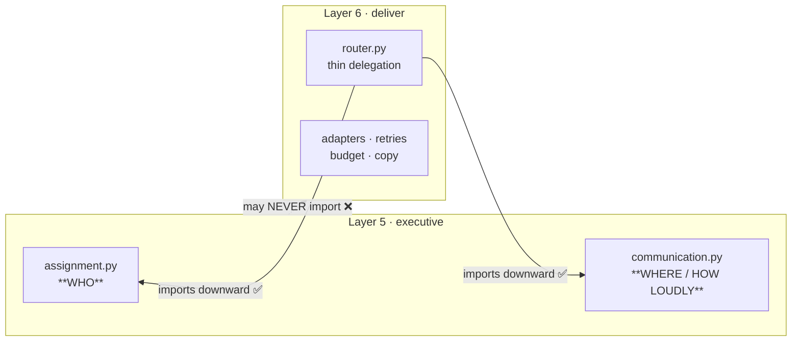
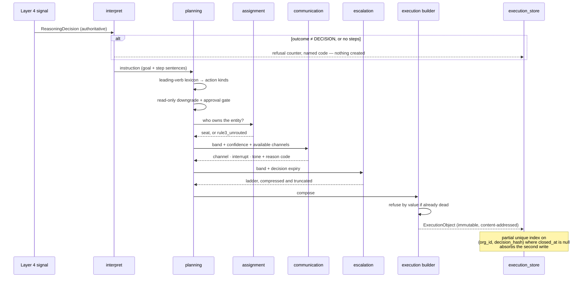
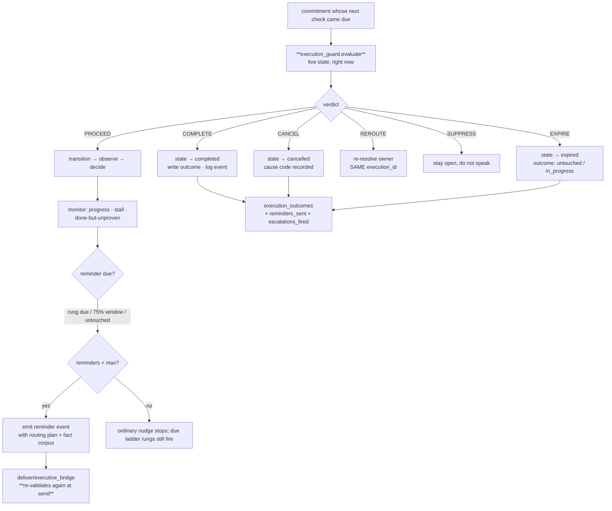
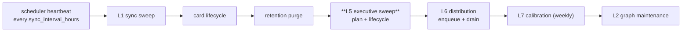

[Folder map](README.md) · [System Design index](../README.md)

---

# Layer 5 — The Executive Engine (`executive/`)

> Layer 4 answers **"what should happen?"**
> Layer 5 answers **"how do we make it happen?"**
>
> A conclusion is an opinion. **A commitment is an opinion with a name and a date attached.**

GeniOS could produce an excellent recommendation and had no idea whether anyone ever did it.
Layer 5 turns a recommendation into a **commitment** — with an owner, a deadline, a channel,
an escalation ladder and a clock — and then watches it until it is done, dead, or out of time.

---

## §0 · At a glance

| | |
|---|---|
| **Package** | `genios_engine/executive/` |
| **Layer number** | 5 |
| **Size** | 23 Python modules |
| **Input** | authoritative Layer 4 decisions (`signals` proving out against `reason/authority.py`) |
| **Output** | **exactly one artifact** — the Execution Object (`execution.v1`) |
| **May import** | `reason/` (L4), `packs/` (L3), `context/` (L2), `capture/` (L1), `contracts/`, `platform/` |
| **May NOT import** | `deliver/` (L6) — enforced by `tests/test_layer_topology.py` |
| **LLM calls** | **Zero.** A model may improve the *wording* of a reminder; it may never decide anything |
| **Tests** | 195, in eleven `test_executive*.py` files |
| **Migration** | `0041_l5_execution.sql` — 5 tables + one column on `org_seats` |
| **Runs** | inside the existing scheduler heartbeat — **no new cron, worker, or service** |
| **Status** | Atlas core aligned; concrete per-action multi-owner seat allocation, digest batching and live-Postgres proof remain open |

---

---

## §1 · What is built now

Layer 5 contains both decision presentation and the Atlas operational engine.

### 1.1 Decision intelligence

| What | Where |
|---|---|
| **Decision Briefs** — what / why / urgency / evidence / what-if-nothing | `brief.py` |
| **Verb taxonomy** — do · consider · delay · escalate · delegate · approve · reject · don't | `verbs.py` |
| **Preventive mode** — *"this rule trips in 14 hours"*, act **before** the miss | `modes.py` |
| **Summary ladder** — one line / one minute / five minutes, **counted never estimated** | `summary.py` |
| **Executive memory** — so the next decision is not amnesiac | `memory.py` |
| **Why-not receipts** — *"why didn't you tell me about X?"* answered from stored suppressions | `explain.py` |
| **The invention validator** — rendered copy may only use facts that exist | `validate.py` |
| **Law 08** — below 5 observations a play says *"new play — no data yet"*, **never a number** | `brief.py` |

> **The most important thing that was already right:** this layer never lets a model decide.
> Every number it produces is arithmetic over stored truth.

### 1.2 Atlas operational chain

```text
1   Decision Interpreter          6   Monitoring
2   Execution Planning            7   Escalation
2.5 Execution Coordination        8   Execution Tracking
3   Communication Planning        9   Feedback Collection
4   Execution Validation         10   Execution Object Builder
5   Reminder
```

All ten units exist. `coordination.py` projects ready/waiting/completed actions from the frozen
dependency graph, blocks out-of-order completion, and exposes that state through the commitment
API. The remaining Atlas refinement is **concrete per-action multi-owner seat/agent allocation**;
today the object carries action audiences and one concrete commitment owner.

---

---

## §2 · The fork that had to be settled first

**The architecture document contradicts itself.** Layer 5 claims an Owner Planner and a
Channel Selector; Layer 5.2 splits Delivery out as its own layer. Both cannot be true.

**Settled: Layer 5 owns *who* and *channel* too.**

> Deciding whether to interrupt someone is part of the **commitment**, not part of the
> transport. *"Slack this person right now"* and *"let them find it in tomorrow's digest"* are
> two different promises about how much of their attention this is worth — and that judgement
> belongs with the layer that decided the work was worth doing at all.

**How it was done without breaking the topology ratchet:**



Layer 6 may import Layer 5; Layer 5 may never import Layer 6. `tests/test_layer_topology.py`
still passes, and `executive/validate.py` already documented exactly this pattern.

**Behaviour is byte-identical.** Same three ordered rules, same reason codes. *Moving code and
changing it in the same step is how a refactor becomes an outage.*

---

---

## §4 · The workflows

### W1 · A decision becomes a commitment



### W2 · One lifecycle tick



### W3 · Where it sits in the heartbeat



> Layer 5 runs **before** distribution on purpose: *a reminder decided in this tick should
> leave in the same tick rather than waiting a whole interval for the next one.*

---

---

## §5 · Strategies

### S1 · Identity excludes routing

One decision, one commitment — regardless of who ends up holding it.

### S2 · Nothing fires without re-validation

Before the first delivery, before every reminder, before every escalation rung. *Validation is
cheap; a wrong nudge is not.*

### S3 · Immutable artifact, mutable pointer

The execution object never changes; a row points at it and moves through states. *An object
that mutates cannot answer "why did this escalate on day 7?" after the pack is retuned.*

### S4 · Approval boundaries cannot be probabilistic

A fixed, ordered lexicon classifies steps. Unknown → `PREPARE`, the kind with no external
effect.

### S5 · Business relevance, not the calendar

Proportion of window burned, not fixed hours. Fatigue is a hard stop, not a taper.

### S6 · No silent drops

An unroutable commitment is created, tracked, escalated and reported as `rule3_unrouted`.
*Dropping it is how a system quietly stops mentioning the accounts nobody owns.*

### S7 · No reopening a closed outcome

Terminal → archived only. A changed world means a **new** decision and a **new** commitment.

### S8 · Autonomy is granted per action, never per plan

A plan claims autonomy only if **every single action** is free of external effects and approval
gates. **No shipped pack qualifies today, and that is the intended answer.**

### S9 · Emit downward, never import upward

Layer 5 writes `execution_outcomes`; Layer 7 reads it. Layer 5 writes a reminder event; Layer 6
reads it. The dependency always points down.

---

---

## §8 · What this layer will not do, on purpose

1. **No model decides anything.** An LLM may improve the *wording* of a reminder. It may never
   decide whether to remind, who to escalate to, what the steps are, or how urgent something is.
2. **No autonomy by default.** Granted per action, never per plan. No shipped pack qualifies.
3. **No load balancing on ownership.** *An owner who cannot predict what reaches them stops
   trusting the queue.*
4. **No reopening a completed commitment.** Terminal → archived only.
5. **No silent drops.** Unroutable work is created, tracked and reported.

---

---

## §9 · Where we disagreed with the architecture spec

| Spec says | We did | Why |
|---|---|---|
| Layer 5 owns Owner Planner + Channel Selector; Layer 5.2 splits Delivery out | Layer 5 **authors** the communication plan; Layer 6 **executes** it | The spec contradicts itself. Interruption is part of the commitment; adapters, retries and copy are transport |
| *"Layer 5 returns exactly one thing: an Execution Object"* | Kept exactly — but the object is **immutable**, and state lives in a row that points at it | An object that mutates cannot answer *"why did this escalate on day 7?"* after the pack is retuned |
| A Delivery Unit inside Layer 5 | Built as `deliver/executive_bridge.py` | Layer 5 cannot import Layer 6 without breaking the ratchet. So Layer 5 **writes its decision down** and Layer 6 reads it: the dependency points downward and the send has **one owner, not two** |
| Reminder Unit decides on "business relevance" | Implemented as *proportion of window burned* + the promised ladder + untouched detection | *"Business relevance" needs a definition a machine can compute deterministically, or it becomes a model call* |

---

---

## §11 · The map

### 11.1 Files

| Half | Files |
|---|---|
| **Decision intelligence** (pre-existing) | `brief.py`, `verbs.py`, `modes.py`, `summary.py`, `memory.py`, `explain.py`, `validate.py`, `authority.py` |
| **Execution engine** | `interpret.py`, `planning.py`, `coordination.py`, `communication.py`, `execution.py`, `execution_guard.py`, `reminder.py`, `monitor.py`, `escalation.py`, `lifecycle.py`, `collect.py`, `assignment.py` |
| **Machinery** | `execution_store.py` (the only SQL), `sweep.py` (the loop) |
| **Contract** | `contracts/execution.py` |
| **The wire** | `deliver/executive_bridge.py` (lives in Layer 6) |

### 11.2 Tables

`executions` · `execution_actions` · `execution_escalations` · `execution_events` ·
`execution_outcomes` · `org_seats.manager_seat_id`

### 11.3 Endpoints

| Endpoint | Purpose |
|---|---|
| `GET /v1/executive/commitments` · `/{id}` | the commitment list and one commitment in full |
| `POST .../commitments/{id}/actions/{aid}/complete` | tick a step |
| `POST .../commitments/{id}/transition` | record running, waiting, blocked or resumed work |
| `POST .../commitments/{id}/dismiss` | a human cancels |
| `POST .../commitments/{id}/reassign` | change the owner — **same `execution_id`** |
| `POST /v1/executive/sweep` | force a pass for one tenant |
| `GET /v1/executive/briefs` · `/summary` · `/memory` · `/preventive` · `/why-not` | the decision-intelligence half |

### 11.4 Scorecard

| Capability | Status |
|---|---|
| Execution Object — frozen, content-addressed, replayable | ✅ round-trip proven |
| Decision Interpreter — refuses non-instructions **by name** | ✅ |
| Execution planning — kinds, waves, owners, deadlines | ✅ deterministic, no model |
| Coordination — dependencies, parallel waves, ready/waiting projection | ✅ runtime-enforced; ⚠️ concrete per-action multi-owner seats not yet modelled |
| Owner resolution owned by Layer 5 | ✅ moved down, behaviour identical, ratchet green |
| Channel + interrupt owned by Layer 5 | ✅ reason-coded |
| **Execution Validation (stale suppression)** | ✅ runs before **every** outbound moment |
| Reminders on business relevance | ✅ fatigue-capped |
| Escalation — urgency-scaled, expiry-capped | ✅ frozen at plan time; resolved target reaches the actual outbox recipient |
| Monitoring — progress, stalls, done-but-unproven | ✅ |
| State machine + full audit trail | ✅ one transition table shared by code, SQL and tests |
| Outcome records for Atlas Layer 6 learning | ✅ written, indexed and consumed by `feedback/store.py::load_batch` |
| Tenant-tunable via pack data | ✅ `sales` v1.8.0 `execution` block |
| Orchestrator executed end to end | ✅ exercised against a strict in-memory database double |
| **A reminder actually reaches a human** | ✅ bridge and outbox scenarios cover target, dedupe and staleness |
| Pending means queued; delivery means adapter success | ✅ separately audited as `execution.queued` / `execution.delivery_confirmed` |
| Runs automatically — no new cron/worker/service | ✅ in the heartbeat, **before** distribution |
| **Ever executed against Postgres** | ❌ **not once** |

### 11.5 The one number to watch

**The ratio of `succeeded` to `completed_unproven` in `execution_outcomes`.**

> It is the only measure of whether a play *works* rather than whether people are willing to do
> it. **If `completed_unproven` dominates, the play is busywork that feels productive** — and no
> click metric will ever tell you.
