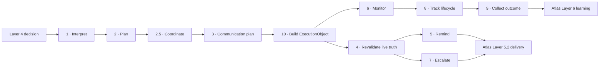

# Layer 5 overview

Layer 5 turns a recommendation into a commitment. It decides **what operational work exists, who
owns it, when it is due, how attention may be spent, and what proof closes it**. Layer 5.2
transports the resulting communication; it does not silently re-plan it.

## Runtime ownership

| Decision | Owner |
|---|---|
| Whether an executable commitment may exist | Decision Interpreter + Builder |
| Action kinds, dependency waves and deadlines | Execution Planning |
| Which actions are ready or blocked | Execution Coordination |
| Work-owner/audience seed, tone and presentation intent | Communication Planning; Layer 5.2 resolves current recipient, channel and interruption |
| Whether an outbound moment is still valid | Execution Validation |
| Reminder/escalation timing | Reminder + Escalation |
| Progress, state and proof | Monitoring + Execution Tracking |
| Ground-truth learning label | Feedback Collection |
| Transport, retry and provider handling | Atlas Layer 5.2, not this layer |

## Non-negotiable laws

- No model decides action kind, owner, deadline, gate, escalation or lifecycle state.
- Every outbound moment is checked against current truth, not only queue-time truth.
- An action cannot complete before its dependencies, and only its effective owner may complete it.
- `completed_unproven` is not promoted to success.
- Reassignment changes routing, not commitment identity.
- Queued and delivered are different audit facts.
- Read-only plays cannot acquire an external side effect while being interpreted.

## Storage and runtime path

`ExecutionObject` is immutable. Mutable lifecycle data lives in execution, action, event and
outcome tables. `execution_store.py` is the SQL authority. `sweep.py` performs an idempotent
planning pass and a lifecycle pass; the platform heartbeat invokes it. Delivery is reached only
through the lower-to-higher import-safe bridge in `deliver/`.

The detailed component truth is in [Executive Units](01-Executive-Units/README.md); remaining
production work is never hidden inside a completion percentage—see [STATUS.md](STATUS.md).
