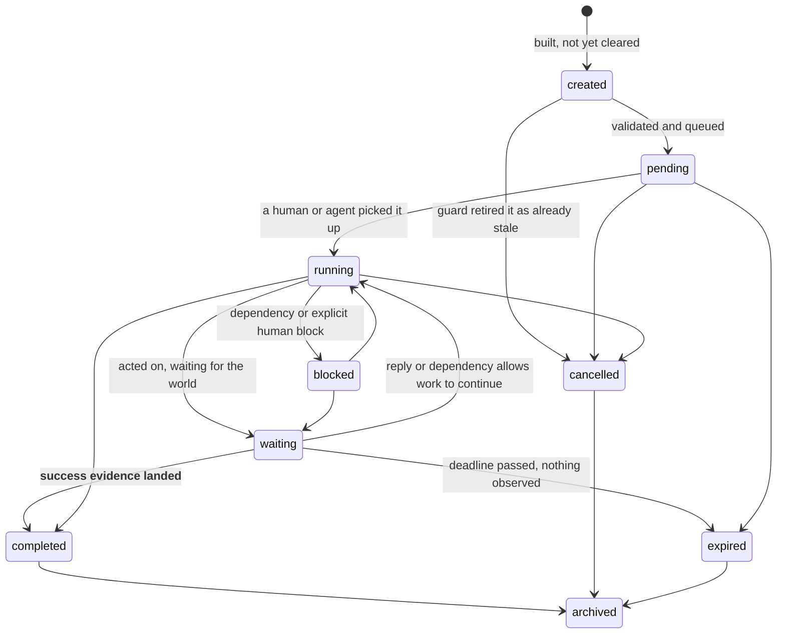

← [Layer 5 — The Executive Engine (`executive/`)](00-Overview.md) · [Folder map](README.md) · → [Decision Interpretation and Execution Planning](02-Interpretation-and-Planning.md)

---

# The Execution Object

---

## The contract — `contracts/execution.py`

Three properties earn this file its weight.

#### It is immutable and content-addressed

> Nothing here is a mutable row. The lifecycle — `created → pending → running → … → archived`
> — lives in a database row that **points at** an execution object; the object itself never
> changes. That separation is what makes *"why did this remind me on day 7?"* answerable
> months later: **the ladder that fired is still byte-for-byte the ladder that was planned,
> even if the pack has since been retuned.**

#### Identity is the decision plus the plan — never the routing

```python
execution_id = stable_id(org_id, decision_hash, plan_hash)   # routing DELIBERATELY excluded
```

| Property | Why |
|---|---|
| Reassigning to a different person must **not** mint a second commitment | otherwise the escalation ladder chases two of them |
| A *different plan* for the same decision **is** genuinely a different commitment | so the plan hash belongs in the identity |
| Running the sweep twice produces **one row** | idempotence is a property of the artifact, not a flag somebody remembered to check |

Enforced in the database too, by a partial unique index on
`(org_id, decision_hash) where closed_at is null`.

`semantic_hash` still covers **every** field, so audit and replay see the whole artifact.

#### Every number is an integer

Floats are refused by `platform.canonical`. Priority and confidence are basis points. *A
content address that drifted with the platform's float formatting would make two identical
executions look different.*

#### The state machine, as data



`created` exists separately from `pending` because *an execution object is built before it is
validated: the guard can retire one that was already stale by the time it was planned, and
that retirement must be visible as a state, not as a row that silently never appears.*

`ALLOWED_TRANSITIONS` lives in **the contract**, so the Python state machine, the SQL guard
and the tests all read one table. *A transition that is legal in Python and illegal in
Postgres is how audit trails start disagreeing with themselves.*

`pending` is intentionally **not** called delivered. Layer 5 emits `execution.queued` when the
commitment clears validation; only Layer 5.2 adapter success sets `delivered_at` and emits
`execution.delivery_confirmed`.

---
