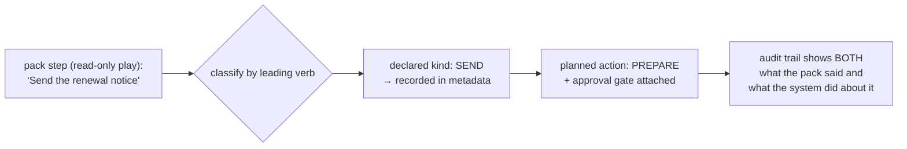

← [The Execution Object](01-The-Execution-Object.md) · [Folder map](README.md) · → [Owner Resolution and Communication Planning](03-Owner-and-Communication.md)

---

# Decision Interpretation and Execution Planning

---

## Unit 1 — the Decision Interpreter (`interpret.py`)

> Layer 4 hands over a judgement. Before anything can be planned, it has to be read as an
> **instruction**: what is being committed to, about which entity, under what constraints, and
> does a human have to be in the loop.

**Front doors are where fail-closed matters most.**

| Layer 4 outcome | Layer 5's answer |
|---|---|
| `DECISION` | → produces an execution context |
| `NO_ACTION` | **refused** — *the reasoner looked and concluded nothing should happen; turning that into a task would be the system inventing work* |
| `DEFER` · `BLOCKED` · `INSUFFICIENT_CONTEXT` · `FAILED` | **refused, each with its own code** — so an operator can tell *"we decided not to"* apart from *"we could not decide"* |
| `DECISION` with **no declared steps** | **refused rather than padded** — *a commitment whose steps GeniOS made up is not traceable to a pack, and the whole execution chain rests on the pack being the author of what a human is asked to do* |

**Time and world-state are deliberately not checked here.** Interpretation is *structural*.
Whether the instruction is still worth acting on belongs to the Validation Unit.

> Splitting them means a decision can be interpreted and planned **deterministically from
> stored bytes alone**, and re-validated cheaply as often as we like.

---

---

## Unit 2 — Execution Planning (`planning.py`)

Turns step sentences into **actions with kinds, dependencies, waves, owners, resources and
individual deadlines** — with no model anywhere in the path.

#### Why no model

> A plan is the thing a human is asked to do and the thing an agent may be allowed to do
> unattended. If a language model classified *"Send the renewal notice"* as an internal draft
> on Monday and as an outbound send on Tuesday, the same play would sometimes require approval
> and sometimes not. **Approval boundaries cannot be probabilistic.**

Classification is a fixed, ordered lexicon. The **leading verb** of the sentence decides — not
a whole-sentence keyword scan. When the lexicon does not recognise a step it falls to
`PREPARE`, *the kind with no external effect and therefore no way to cause harm by being
wrong.*

#### The read-only downgrade — the one piece of genuine interpretation

> A read-only play that says *"Send the follow-up"* is not asking GeniOS to send anything; it
> is asking GeniOS to **get a send ready for a person to approve.**

The contract itself refuses a read-only action carrying an external effect.

#### Two classifier bugs found by sweeping every shipped play

| # | Bug | Fix |
|---|---|---|
| 1 | *"Review the deal history"* typed as an **approval gate** | bare `review` removed from approval phrases; **the leading verb decides** |
| 2 | *"Draft a warm outreach note"* classified as `SEND` because "outreach" appeared later | leading-verb table beats whole-sentence keyword scan |

---
