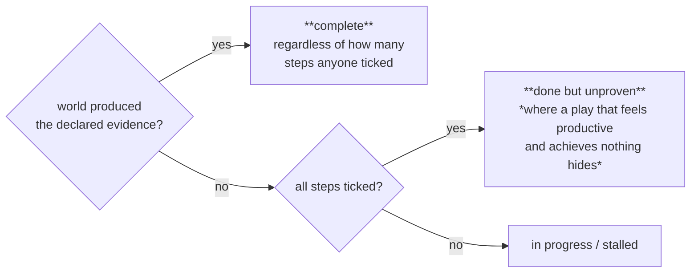

← [The Execution Validation Unit](05-Execution-Validation.md) · [Folder map](README.md) · → [Execution Tracking and Feedback Collection](07-Lifecycle-and-Outcomes.md)

---

# Reminders and Monitoring

---

## Unit 6 — Reminder (`reminder.py`)

> A reminder engine that fires on a timer is a **nag**. A reminder engine that fires when the
> *business situation* still holds and has got worse is a **colleague**. The difference is
> entirely in what triggers it.

Nothing counts days for its own sake. Three triggers, each a statement about the commitment's
standing in the world:

1. an escalation rung the plan itself promised has come due
2. the outcome window is running out with nothing observed
3. nobody has so much as looked at it since it landed

#### Elapsed fraction, not fixed hours

```python
"deadline_warning_bp": 7_500      # three quarters of the window burned
```

> A two-day commitment and a fourteen-day commitment are **not both urgent two days out**;
> treating them alike is how a system ends up shouting about routine work and whispering about
> the fire.

#### Fatigue is a hard stop, not a taper

```python
"max_reminders": 4,  "min_interval_hours": 20     # never twice inside a working day
```

> After the configured number the unit **stops asking** and lets escalation take over. **A
> fifth identical nudge does not produce action; it produces a filter rule** — and after that
> GeniOS is talking to nobody.

And every reminder must first survive the guard. *That single guarantee is what buys the right
to nudge at all.*

---

---

## Unit 7 — Monitoring (`monitor.py`)

> The guard answers a binary question at a single moment: *may this fire now.* Monitoring
> answers a continuous one: *how far has this actually got, and has it stopped moving.*
> Conflating them produces a system that only ever knows "done" or "not done" — **exactly the
> resolution at which a stalled commitment is indistinguishable from a fresh one.**

Two sources of progress, deliberately **not merged into one number**:

| Source | Nature |
|---|---|
| **Action completions** | a person or agent marked a step done — self-reported, immediate, and the only signal available for internal work with no external trace |
| **Observed events** | the world produced the evidence the play declared — slower, but **not self-reported**, which makes it the one that counts for Layer 7 |



---
