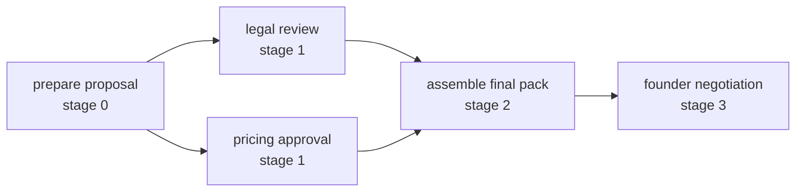

[← Atlas alignment](10-Atlas-Layer-5-Alignment.md) · [Folder map](README.md)

# Unit 2.5 · Execution Coordination

Planning freezes the action dependency graph. Coordination answers a different question:
**which declared actions can move now?** It never adds a step, moves a deadline, changes priority
or guesses around an unmet dependency.

## Contract

```text
ExecutionObject + completed action ids
    → deterministic CoordinationSnapshot
        → completed actions
        → ready actions
        → waiting actions + unmet dependencies
        → invalid historical completions
        → current executable stage
```

`CoordinationSnapshot` is a recomputable projection, not a second mutable plan. The immutable
ExecutionObject stays the authority; completion timestamps in `execution_actions` are the only
runtime facts.

## Status calculation

| Condition | Projection |
|---|---|
| action has a completion record and all dependencies were complete | `completed` |
| action is open and every dependency is complete | `ready` |
| action is open and one or more dependencies are incomplete | `waiting` + exact dependency ids |
| action claims completion while a dependency remains open | `completed` plus `invalid_completion_ids` corruption signal |

The current stage is the earliest ready stage; when nothing is ready it is the earliest waiting
stage; after every action completes it moves one position beyond the terminal stage.



After A, B and C become ready together. D waits until both finish. E cannot be ticked early: the
completion endpoint computes this projection and refuses `dependencies_unmet` in the same database
transaction that would otherwise write the timestamp.

## Ownership boundary

Owner-scoped actions inherit the commitment's mutable assignee. Widened audience classes remain
unresolved until their stage or escalation activates. This keeps concrete routing out of
`execution_id`, so reassigning the commitment does not mint a duplicate plan.

Atlas-style concrete per-action Sales/Legal/Finance/Founder seat or agent allocation is the
remaining gap. The dependency and completion engine is real; the contract currently carries an
audience class plus one concrete commitment owner, not an independent assignee for every action.

## Runtime integration

- `GET /v1/executive/commitments/{id}` returns the coordination projection.
- `POST .../actions/{action_id}/complete` refuses unknown, already-completed, corrupt-order or
  dependency-blocked actions.
- Completion is allowed only for live `OPEN_STATES`, never for `CREATED` or terminal work.
- `tests/test_executive_coordination.py`, route tests and strict database doubles cover parallel
  waves, joins, invalid history and race-safe completion.

## Why this is not a workflow engine

Coordination does not execute external actions. It exposes readiness and records authenticated
completion. Any external mutation remains approval-bound and customer-executed through the
delivery/agent handoff. This unit schedules declared work; it does not acquire new authority.
