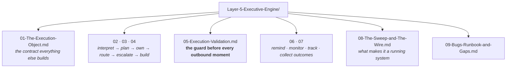

# Layer 5 · The Executive Engine — the folder map

**This folder is the live truth of `genios_engine/executive/`.** It is the source consulted before any action,
update or improvement to this layer. If a document and the code disagree, the document is wrong —
fix it in the same change that moved the code.

Start at **[00-Overview.md](00-Overview.md)** for the layer in one sitting. Use this page when you
already know what you are looking for.

---

## The one question this layer answers

> **How does that decision become reality?**

---

## The documents

| # | Document | Answers |
|---|---|---|
| 00 | [Overview](00-Overview.md) | The two halves, the fork over who owns channel, workflows, strategies |
| 01 | [The Execution Object](01-The-Execution-Object.md) | Immutable, content-addressed, and why identity excludes routing |
| 02 | [Interpretation and Planning](02-Interpretation-and-Planning.md) | Reading a decision as an instruction; steps → actions without a model |
| 03 | [Owner and Communication](03-Owner-and-Communication.md) | The three ordered ownership rules; interruption as a budget |
| 04 | [Escalation and the Builder](04-Escalation-and-The-Builder.md) | The ladder frozen at plan time; the last place that can refuse cheaply |
| 05 | [Execution Validation](05-Execution-Validation.md) | **The most important unit in the layer** — six verdicts, not a boolean |
| 06 | [Reminders and Monitoring](06-Reminders-and-Monitoring.md) | Business relevance not the calendar; done-but-unproven |
| 07 | [Lifecycle and Outcomes](07-Lifecycle-and-Outcomes.md) | The state machine, and the labels Layer 7 will learn from |
| 08 | [The Sweep and the Wire](08-The-Sweep-and-The-Wire.md) | validate → transition → observe → decide → speak |
| 09 | [Bugs, Runbook and Gaps](09-Bugs-Runbook-and-Gaps.md) | Eight defects found, the deployment steps, and the unproven SQL |

---

## Where this layer sits

| | |
|---|---|
| **Package** | `genios_engine/executive/` |
| **Layer number** | 5 — `genios_engine/LAYERS.py` |
| **Reads from** | authoritative Layer 4 decisions |
| **Hands to** | **exactly one artifact** — the Execution Object (`execution.v1`) |
| **May import** | everything below. **Never `deliver/`** — enforced by `tests/test_layer_topology.py` |
| **LLM calls** | Zero. A model may improve a reminder's *wording*; it may never decide anything |

[← System Design index](../README.md)
