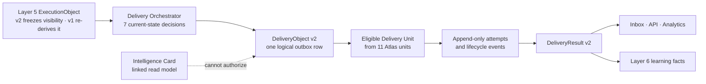

# Layer 5.2 overview

Layer 5.2 is the delivery control plane between an approved Layer 5 execution and the human,
agent or system expected to receive it. It spends attention, selects a currently valid route,
governs transport and records what happened. It does not decide whether the underlying business
work should exist.

## Ownership split

| Decision or fact | Authority |
|---|---|
| Commitment, work owner, actions, deadline, business priority, execution lifecycle | Layer 5 |
| Whether an execution is still live and permitted to communicate | Layer 5 re-proof at send time |
| Source-derived visibility ceiling | Layer 1 evidence, narrowed into `ExecutionObject` v2 and enforced by Layer 5.2 |
| Current delivery audience and recipient | Layer 5.2 Audience Resolver, within the inherited visibility ceiling |
| Registered destination and route ladder | Layer 5.2 Destination Router + Channel Planner |
| Presentation format and concrete channel | Layer 5.2 Channel Planner |
| Send, defer or suppress; quiet/busy behavior; final interruptibility | Layer 5.2 Timing + Policy |
| Queue rank and aging | Layer 5.2 Priority Scheduler |
| Provider acknowledgement, attempt history and fallback | Delivery Unit + Delivery Management |
| Viewed, ignored, accepted, executed or expired delivery lifecycle | Layer 5.2 Delivery Tracker |
| Whether the business execution succeeded | Layer 5 outcome evidence, never inferred from delivery alone |

## The seven orchestration decisions

1. **Delivery Context Resolver** loads tenant preferences, TTL-bound presence, busy state and
   registered capability.
2. **Audience Resolver** determines the current active event target, agent, manager, owner/team or
   deterministic administrator fallback without widening the source evidence audience.
3. **Destination Router** validates tenant-scoped registered destinations and orders eligible
   routes.
4. **Channel Planner** chooses the current channel, channel class and presentation format. Legacy
   v1 channel/interrupt fields are treated as hints, not authority.
5. **Timing and Interruptibility** applies timezone, quiet hours, presence and burst constraints;
   chat interruption is restricted to critical, sufficiently confident, non-busy delivery.
6. **Delivery Policy** composes tenant/user admission rules into `SEND`, `DEFER` or `SUPPRESS`.
7. **Priority Scheduler** maps business-priority basis points into `background`, `low`, `medium`,
   `high` or `critical`, then ages waiting work without exceeding critical.

## Admission and queue laws

Every admission constraint returns `SEND`, `DEFER` or `SUPPRESS`. First suppress wins; among
deferrals, the latest safe time binds; otherwise the object may send. Deferral does not spend a
physical transport attempt. Due work is ordered using priority aging with per-organisation
fairness.

A worker uses a time-bounded fenced claim. The rolling-hour and recipient-local-day attention
reservations plus the `started` physical-attempt row commit in one PostgreSQL transaction before
the provider call. Slack and Teams share one organization-wide hourly chat stream, while the
daily budget remains per recipient and local calendar day. A definite non-delivery releases its
reservation; an unknown acknowledgement keeps it because attention may already have been spent.

## Retry, ambiguity and failover laws

- Every physical send has an append-only `delivery_attempts` record.
- Retryable, definite terminal and ambiguous outcomes are distinct.
- A definite terminal outcome may advance to the next registered route on the **same logical
  outbox row**, after current execution authority and policy are rechecked.
- An ambiguous provider acknowledgement is marked unknown and does not cross-channel fail over;
  otherwise one intent could reach the recipient twice.
- Webhook and agent transports carry stable idempotency keys, but external transport remains
  at-least-once where a receiver cannot prove deduplication. Slack/Teams incoming webhooks cannot
  provide receiver-side idempotency, so an ambiguous outcome stops for explicit operator
  reconciliation instead of automatic retry or fallback.

## Lifecycle and outputs

Transport state and user lifecycle are separate. The tracker supports `queued`, `deferred`,
`delivered`, `viewed`, `ignored`, `accepted`, `executed`, `failed`, `expired`, `suppressed` and
`cancelled` with a validated transition graph and idempotent event append. `DeliveryResult` is the
stable output projection; analytics and Layer 6 can consume its typed facts without interpreting
provider-specific payloads.

## Runtime surfaces versus integrations

The backend has concrete Slack, Teams, signed webhook, signed agent-webhook and authenticated pull
paths. Agent pull is the scoped `delivery/inbox?channel=api` resource with lifecycle receipts; the
old raw signal/card endpoints are authenticated `410 Gone` migration sentinels, not a second
execution plane. Pull makes an object durably available to human, dashboard, extension, mobile and
application clients; it is not evidence that those UI/device clients are shipped. Native email
and APNs/FCM/system notification transports are not implemented. Presence can be published through
a TTL-bound self-bound context API, but trusted automatic publication from every real client
remains integration work.

See [STATUS.md](STATUS.md) for the component-by-component engine, integration and deployment truth.
