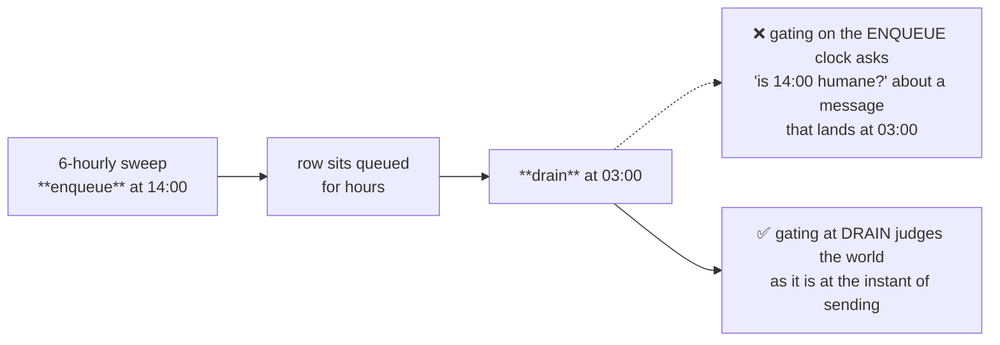
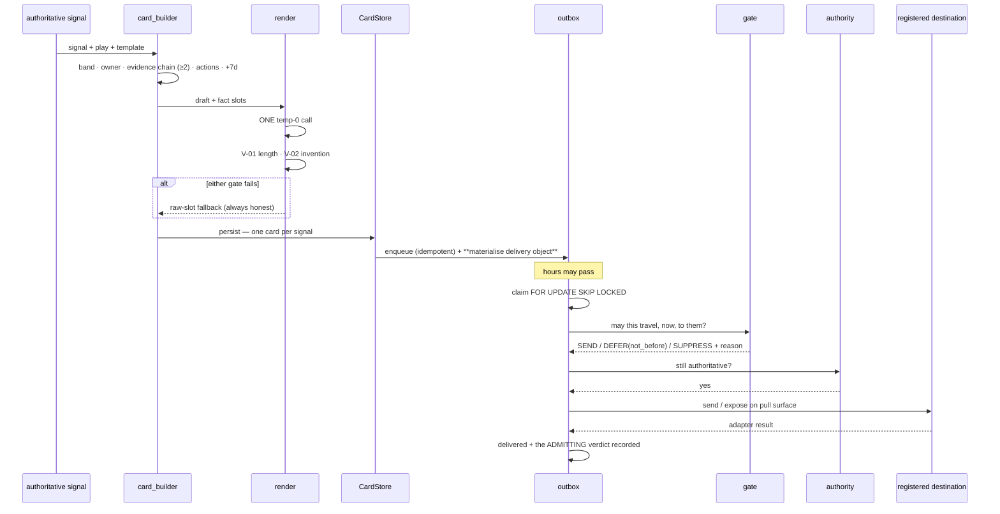
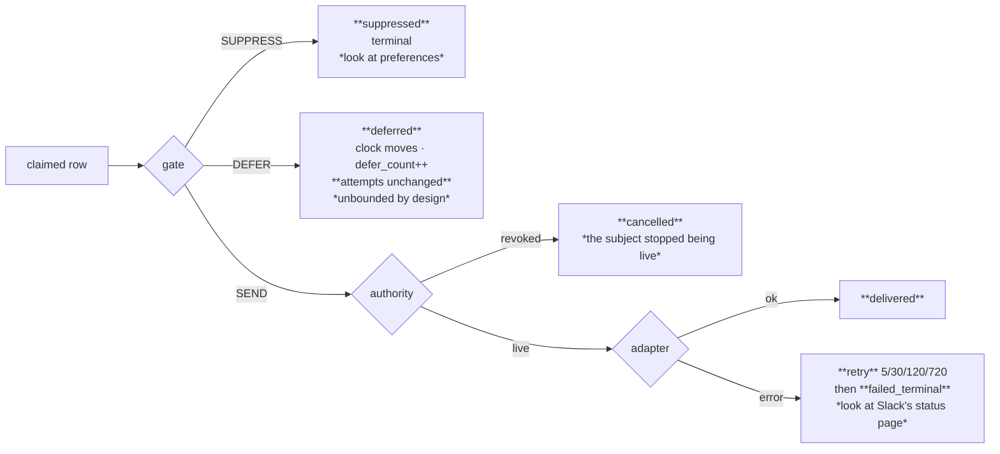

[Folder map](README.md) · [System Design index](../README.md)

---

# Layer 6 — Intelligence Distribution (`deliver/`)

> Layer 4 answers **"what should happen?"**
> Layer 5 answers **"how do we make it happen?"**
> Layer 6 answers **"may this reach them, now — and how does it look when it arrives?"**

Layer 6 is transport plus admission. It **executes** the communication plan Layer 5 authored:
it builds the card, renders the copy, decides whether the moment is humane, and gets the
message there with retries — without ever re-deciding *what* to say or *whether* to say it.

> **The most important thing that was already right:** delivery is **state, not hope.** Nothing
> is a fire-and-forget HTTP call inside the reasoning sweep.

---

## §0 · At a glance

| | |
|---|---|
| **Package** | `genios_engine/deliver/` |
| **Layer number** | 6 — **this is the spec's "Layer 5.2"** (§2) |
| **Size** | 27 Python files · ~3,813 lines |
| **Input** | authoritative signals (L4) · execution events (L5) |
| **Output** | typed delivery results · Slack/Teams · signed webhooks · pull inboxes · digest · agent delivery |
| **May import** | `executive/` (L5) and everything below. **Layer 5 may never import this** |
| **LLM calls** | **One temp-0 call per card**, for copy only — behind two deterministic gates |
| **Tests** | full local suite green; 9 focused Atlas-alignment tests plus the admission/outbox/bridge suites |
| **Migrations** | `0008_l5_delivery.sql`, `0032_l6_channels.sql`, `0042_l6_delivery_gate.sql`, `0044_l52_atlas_delivery.sql` |
| **Status** | Atlas core aligned in the existing drain. Native email and APNs/FCM remain open; SQL and external adapters still need live-infrastructure proof |

---

---

## §1 · What was supposed to be built

### 1.1 The transport half — already built, and solid

| What | Where |
|---|---|
| **The outbox** — every send is a row: `queued → delivered \| failed_terminal` | `outbox.py` |
| **Bounded backoff** — `(5, 30, 120, 720)` minutes, then terminal. **Never an infinite retry** | `outbox.py` |
| **Claim safety** — `FOR UPDATE SKIP LOCKED`, so two instances never send the same message | `outbox.py` |
| **Idempotent enqueue** — unique on `(org_id, card_id, channel)`; a re-run is a no-op | `0032` |
| **Authority re-validation at send time** — a queued card proves it is *still* live before it goes | `outbox.py` |
| **The Layer 5 wire** — commitments become real messages, exactly once | `executive_bridge.py` |
| **Daily budget** — `budget_per_user_day`, *"a property of the channel's politeness"* | `router.py` |
| **Band cuts from pack config** — a tenant redefines "critical" in one place | `bands.py` |
| **Card pipeline** — build → render → validate → persist → push | `pipeline.py`, `card_builder.py`, `render.py`, `store.py` |

### 1.2 The admission half — the gap this layer already closed

Before the admission build, everything between the claim and the send was absent. At that point
`quiet_hours`, `interrupt`, `opted_out` and `defer` appeared nowhere in `deliver/`; the outbox had
exactly two outcomes and neither meant *not yet*. The table below is the historical defect list
that motivated the current gate, not the current implementation status.

| Missing | Consequence |
|---|---|
| Any notion of the recipient's **local time** | A Kolkata tenant's critical card fired at **03:00 IST**. No timezone stored anywhere per seat |
| **Quiet hours** | None. The only dial was *how many* per day, never *when* |
| **A burst limit** | `budget_per_user_day` allows 7 cards. **All seven could land in the same minute** |
| **An opt-out** | A person who wanted Slack pushes off had no way to say so, and no column to say it in |
| **A tenant kill switch / compliance hold** | Disabling delivery meant deleting the webhook, which also lost the config |
| **A verdict that is not "send" or "fail"** | Holding a message could only be expressed as a *failure*, **which burned the retry ladder** |
| **Any record of why a message did not arrive** | *"Why wasn't I told?"* was a log-grep against a clock that had already moved |

> A 03:14 notification is not a delivery bug — **it is how a tenant mutes the channel in week
> three, and once it is muted every other layer's accuracy is worth exactly zero.**

---

---

## §2 · The two forks

### Fork 1 — is "Layer 5.2" a new layer?

**Settled: `deliver` (6) *is* the spec's Layer 5.2.** No renumbering, no new package.

> The layer already existed and already sat in the right place in the DAG. **What was missing
> was not a home, it was the units.** Renumbering would have touched `LAYERS.py`,
> `test_layer_topology.py`, and every import in `deliver/` — a large, risky diff that changes no
> behaviour. *The work is filling the gap, not moving the furniture.*

### Fork 2 — does the gate run at enqueue or at drain?

**Settled: drain.**

> The codebase had already settled this question once, for **authority**: never trusted from
> queue time, always re-validated immediately before the send. **Admission obeys the same law
> for the same reason.**
>
> Enqueue's job is to **materialise** the delivery object onto the row. The gate's job is to
> **judge** it against the world as it is at the instant of sending.

---

---

## §4 · The workflows

### W1 · A signal becomes a message

### W2 · The three outcomes and what each costs

---

---

## §5 · Strategies

### S1 · Delivery is state, not hope

Every outbound notification is a row with a status, a cause and a history. Nothing is a
fire-and-forget HTTP call inside the reasoning sweep.

### S2 · Judge at the moment of sending, not the moment of queuing

Both authority and admission. The world moves between enqueue and drain.

### S3 · Deferral is unbounded; failure is bounded

> Every deferral has a real end: a quiet window opens, a burst clears, a hold lifts. **Staleness
> stays owned by the authority re-validation** — a second age check here would be a second,
> weaker copy of a predicate that already exists.

### S4 · Constraints compose; they do not race

Intersection semantics with deterministic tie-breaks. A new unit can only make the system
quieter.

### S5 · Never fail open on ambiguity

> Every fallback resolves toward **silence**: an unrecognised channel class is assumed
> **intrusive** and gated; an unreadable band becomes `standard`, which cannot break glass; a row
> carrying both a stop and a pause resolves to **the stop**; a card with no recorded confidence
> **cannot interrupt.**

The one deliberate exception is a structurally impossible quiet window, *where sending slightly
rudely beats never sending at all* — and the contract refuses that config at construction, so it
is unreachable.

### S6 · A card always ships, and always honestly

The deterministic slot fallback guarantees both halves of that sentence at once.

### S7 · Every blocked delivery explains itself **in the row**

Thirteen reason codes plus `/delivery/held`. *By the time anybody asks, the clock has moved and
the log has rotated.*

### S8 · One authority per question

No second daily cap. No second "are they handling it?" check. No second confidence rule. *The
failure mode is not that a message gets blocked twice — it is that a support engineer finds one
limit, changes it, and nothing happens.*

---

---

## §8 · What this layer will not do, on purpose

1. **It never decides that somebody should not be told something.** That judgement was made
   upstairs. `evaluate_timing` returning `SUPPRESS` is *impossible*, and a test sweeps every
   reachable combination across eight days to prove it.
2. **It never reads the message.** The candidate carries no headline, no facts, no payload. *A
   timing unit that could read the body would eventually be asked to make an exception for an
   important-sounding one — and at that point "should I interrupt?" has quietly become a second
   reasoning engine sitting below the real one.*
3. **It never reassigns.** A deactivated seat is a **suppression**, not a reroute. *Choosing a
   different person at delivery time would invent an owner the commitment never had.* The
   commitment stays live, keeps escalating, stays visible on the card surface. Only this push
   stops.
4. **It never fails open on ambiguity.** Every fallback resolves toward silence.
5. **It never lets a hold become a loss.** Deferral is unbounded by design.

---

---

## §9 · Where we disagreed with the architecture spec

| Spec says | We did | Why |
|---|---|---|
| Layer 5.2 is a distinct layer | It **is** `deliver` (6), which already sat between executive and feedback | Renumbering touches the topology file, its ratchet test and every import, and changes no behaviour. *The layer had a home; it was missing units* |
| A "Delivery Object" | Materialised as **columns on the outbox row**, not a new table | *The outbox already **is** the delivery ledger. A second table would be a second write per send and a second thing to keep true* |
| A notification-history table for rate limiting | Answered from `delivery_outbox` itself, with a partial index | Once the row carries `recipient` and `channel_class`, *"how many intrusive messages this hour?"* is a range scan over rows the system already writes |
| Interrupt decided at delivery | Interrupt is **decided by Layer 5** and only *honoured* here | *Re-deriving it below would put a second, weaker copy of a confidence rule under the real one* |
| Quiet hours as a delivery-time filter | Quiet hours produce a **DEFER with a clock**, never a drop | *A filter loses the message. The whole layer turns on deferral being distinct from both failure and refusal* |

---

---

## §11 · The map

### 11.1 Files

| Concern | File |
|---|---|
| Admission contract | `contracts/delivery.py` |
| Policy · timing · gate | `policy.py`, `timing.py`, `gate.py` |
| Transport | `outbox.py`, `destination.py`, `channels/base.py`, `channels/slack.py`, `channels/teams.py`, `channels/webhook.py`, `channels/surface.py` |
| Live recipient context | `presence.py` |
| Typed delivery output | `results.py` |
| Delivery analytics | `analytics.py` |
| Card production | `card_builder.py`, `slots.py`, `render.py`, `bands.py`, `pipeline.py`, `store.py` |
| Round trip | `actions.py` |
| Ownership | `router.py` (delegates to L5) |
| Other exits | `digest.py`, `push.py`, `agent_api.py`, `executive_bridge.py` |

### 11.2 Tables

`cards` · `card_events` · `delivery_outbox` (+ 7 gate columns) · `delivery_preferences` ·
`delivery_presence` · `org_channels` · `agent_webhooks`

### 11.3 Endpoints

| Endpoint | Purpose |
|---|---|
| `GET /cards` · `/cards/{id}` · `POST /cards/{id}/action` | the card surface + the four buttons |
| `GET /digest` | the 08:30 one-liner |
| `GET /api/org/{org}/delivery/preferences` · `PUT` · `DELETE .../{seat}/{channel}` | the four specificities |
| `GET /api/org/{org}/delivery/effective` | **a dry run of the real gate** at any instant |
| `GET /api/org/{org}/delivery/held` | the operator view — what is held, by which unit, and why |
| `PUT/GET/DELETE /api/org/{org}/delivery/context...` | publish and inspect leased activity, current surface and busy state |
| `GET /api/org/{org}/delivery/results...` | stable typed result history and one materialised delivery object |
| `GET /api/org/{org}/delivery/inbox` | authenticated durable pull surfaces |
| `GET /api/org/{org}/delivery/analytics` | status/channel counts, attempts, deferrals, failures and latency |
| `GET /api/org/{org}/channels` · dedicated Slack routes · generic `/{channel}` routes | Slack, Teams, signed webhook and pull-surface registration/testing |
| `GET /v1/signals` · `POST /v1/signals/{id}/claim` · `/result` | the agent surface |

### 11.4 Scorecard

| Capability | Status |
|---|---|
| SEND / DEFER / SUPPRESS as a closed, typed contract | ✅ both halves of the DEFER invariant enforced at construction |
| Quiet hours in the recipient's own timezone | ✅ DST-correct |
| Timing unit **can never** suppress | ✅ exhaustively swept |
| Break-glass inheriting Layer 5's confidence floor | ✅ a low-confidence crisis cannot wake anyone |
| Burst limit, distinct from the daily budget | ✅ counts this pass's own sends |
| Per-org / per-channel / per-seat policy | ✅ field-by-field, four specificities |
| Deferral never spends a retry | ✅ **locked at the SQL level by test** |
| `suppressed` distinct from `cancelled` and `failed_terminal` | ✅ three outcomes, three fixes |
| Every blocked delivery explains itself in the row | ✅ 13 reason codes + `/delivery/held` |
| Bad config degrades in the engine, refused at the door | ✅ same predicate, opposite responses |
| Card always ships and never invents | ✅ V-01 + V-02 + slot fallback |
| Authority re-proved at send | ✅ |
| Bounded retry, claim safety, idempotent enqueue | ✅ pre-existing, untouched |
| Leased live activity/current-surface context | ✅ surface-published; automatic calendar projection remains open |
| Typed `DeliveryObject` and `DeliveryResult` without a second ledger | ✅ outbox projections |
| Deterministic destination routing and card failover | ✅ terminal transport failures only; never bypasses policy/authority |
| Slack, Teams and signed webhook adapters | ✅ code-complete; real-provider proof pending |
| App/dashboard/API/application/extension/mobile pull inbox | ✅ mobile is pull, not APNs/FCM |
| Delivery analytics | ✅ deterministic outbox-derived metrics |
| Native email delivery | ❌ provider and lifecycle decision required |
| Native mobile/OS notification push | ❌ APNs/FCM lifecycle required |
| **Run against a real Postgres** | ❌ **Steps 1 + 3 of the runbook** |
