# Atlas Layer 5.2 overview

Layer 5.2 spends human and machine attention. It resolves current context, applies policy and
timing, selects a registered destination, transports through a typed adapter, and records the
result. It does **not** reopen Layer 5's decision or silently change who owns the work.

```mermaid
flowchart LR
    E["Layer 5 ExecutionObject"] --> C["Context Resolver"]
    C --> A["Audience boundary"]
    A --> D["Destination Router"]
    D --> CH["Channel Planner"]
    CH --> T["Timing & Interruptibility"]
    T --> P["Delivery Policy"]
    P --> S["Priority Scheduler"]
    S --> U["One of 11 Delivery Units"]
    U --> M["Tracking · Retry · Recovery · Dedupe · Rate · Analytics"]
    M --> R["DeliveryResult"]
    R --> L6["Atlas Layer 6 learning"]
```

## The two authorities that must not blur

| Question | Owner |
|---|---|
| Who should act and what attention promise was made? | Layer 5 |
| Is this destination registered and usable now? | Layer 5.2 |
| May this channel be used for this tenant/seat? | Delivery Policy |
| Is now a humane/allowed moment? | Timing and Interruptibility |
| Did the provider accept, fail or require retry? | Delivery Unit + Outbox |
| Did the business execution succeed? | Layer 5 outcome, not a delivery receipt |

## Composition law

Every admission constraint produces `SEND`, `DEFER` or `SUPPRESS`. First suppress wins;
among deferrals the latest safe time binds; otherwise send. Deferral spends no transport attempt.
A terminal provider failure may try a registered fallback only after rechecking authority.

## Supported runtime surfaces

Native runtime paths exist for Slack, Teams, signed HTTPS webhook and durable pull surfaces used by
human, dashboard, extension, mobile and application clients. Agent polling/claim/result and signed
push exist. Native email and APNs/FCM do not.

See [STATUS.md](STATUS.md) before interpreting “11 Delivery Units” as eleven complete provider
integrations.
