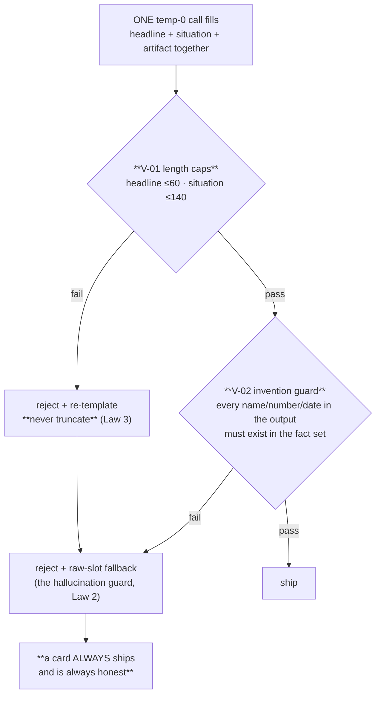

← [Layer 6 — Intelligence Distribution (`deliver/`)](00-Overview.md) · [Folder map](README.md) · → [The Admission Contract](02-The-Admission-Contract.md)

---

# Card Production

---

## Card production

#### `slots.py` — the only values a card may state

> Fact-derived slots. Both the deterministic fallback template **and** the invention validator
> draw from here: the LLM's output may contain a name, number or date **only if it appears in
> this slot set** (or the raw facts). Everything computed from typed facts plus the passed
> evaluation time — **no wall clock, no invention.**

#### `card_builder.py` — compose `card.v1`, deterministically

No LLM. Attaches the band, the owner, the **evidence chain (≥2 references — Law 2)**,
on-device context tags, the four actions, and a +7 day expiry.

One detail worth keeping: the source map is keyed on the **real connector source**
(`graph_source_refs.source`), *not* on the field name. There is deliberately no `deal` entry —
*a `deal.*` field is just a field name; the L2 extractor writes it from an email as readily as
a CRM does.*

#### `render.py` — one model call, two deterministic gates



The fallback is pure slot interpolation from facts. That is what makes *"a card always ships"*
compatible with *"a card never invents"*.

#### `bands.py` — 14 lines, and a documented limitation

```python
S >= cfg["critical"] (85) → "critical"
S >= cfg["high"]     (70) → "high"
else                      → "standard"
```

The cuts are **pack data, not engine constants** — a tenant redefines "critical" in exactly one
place. *Small-deal tenants cannot reach critical by construction; that is documented, not a bug.*

#### `router.py` — 51 lines of delegation

The ownership rules moved **down** to `executive/assignment.py`:

> That was the wrong home: Layer 6 answers *how intelligence travels*, and **who holds a
> commitment is part of the commitment itself, not part of its transport.**

Behaviour unchanged — same three ordered rules, same reason codes. `deliver` (6) may import
`executive` (5); `executive` may never import `deliver`.

#### `store.py` — the queue state machine

> Every transition writes a timestamped `card_event` with an **enumerated cause**; nothing moves
> without one. **One card per signal**, enforced by a unique index — a re-run never
> double-delivers.

Every read is joined through `reason/authority.py`'s predicate, so **a revoked decision cannot
be resurrected by a queue read**.

#### `actions.py` — the round trip

Four buttons plus requeue, each landing as **both** a Layer 1 human event **and** a card
lifecycle transition, all timestamped.

```python
BUTTONS       = {"run_play", "do_it_myself", "snooze", "wrong", "requeue"}
WRONG_REASONS = {"not_relevant", "wrong_facts", "bad_timing"}
```

A `wrong` verdict **requires** one closed reason, *so a terminal action cannot silently
disappear from learning.* **Requeue is not a fifth button:** logged as `ui.requeued`, excluded
from precision math, expires normally.

---
