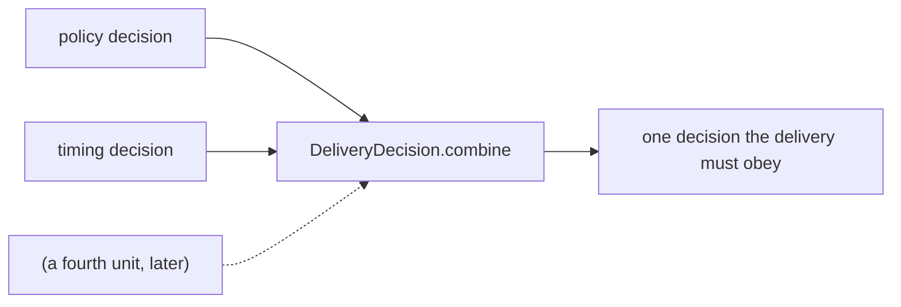

← [Card Production](01-Card-Production.md) · [Folder map](README.md) · → [The Policy and Timing Units](03-Policy-and-Timing.md)

---

# The Admission Contract

---

## The admission contract — `contracts/delivery.py`

**Exactly three answers exist, and the set is deliberately closed:**

| Verdict | Means |
|---|---|
| `SEND` | the moment is fine — hand it to the adapter |
| `DEFER` | **the message is right, the moment is wrong.** It waits until `not_before` |
| `SUPPRESS` | it must never travel this way. Not later, not louder |

#### Why `DEFER` is not a failure — the single most important distinction

> The outbox already has a retry ladder for *failures* — a webhook timing out, a 500 from Slack
> — and that ladder is **bounded**, because a channel that never works must eventually stop
> being tried. **Deferral is the opposite kind of event: nothing is broken, the recipient is
> simply asleep.**
>
> If deferral consumed retry attempts, a message queued at 22:00 would burn its four attempts
> against quiet hours and be declared permanently undeliverable **by breakfast — the exact
> message the recipient most wanted.**

So `_defer` moves `next_attempt_at`, bumps a **separate** `defer_count`, and touches nothing
else. A test loops **ten** deferrals and asserts the row never goes terminal; another asserts
the SQL `SET` clause **literally does not contain the word `attempts`**.

#### `INTRUSIVE_CHANNEL_CLASSES` — physics, not intent

```python
INTRUSIVE_CHANNEL_CLASSES = frozenset({ChannelClass.CHAT})
```

> Layer 5's `CommunicationPlan.interrupt` means *this deserves attention*. It does **not** mean
> *this will make a phone buzz*: a high-band card is pushed to Slack with `interrupt=False` and
> **still lights a lock screen at midnight.** Gating on the channel's **physics** rather than
> the sender's intent is what closes that gap.

The omissions are deliberate rather than pending: `IN_APP` and `DIGEST` are surfaces a person
visits when *they* choose to; `EMAIL` is absent because *an inbox at 03:00 is not an
interruption, it is a queue.* **The day an email adapter ships with different semantics, that
frozenset is the one line that changes.**

#### `combine` — intersection, not a vote

> **First SUPPRESS wins. Among DEFERs, the latest window binds. Otherwise the first SEND.**



Rather than an if/elif ladder **whose order silently decides the answer**, each check produces
its own decision and they are folded.

> Adding a fourth unit later is adding a line to a list — and **it can only ever make the system
> quieter, never louder**, which is the correct direction for a mechanism that spends human
> attention.

The tie-breaks are deterministic *on purpose*:

> Two units that both suppress must always name the **same** reason in the audit row, or the
> same delivery blocked twice would be explained two different ways depending on dictionary
> ordering — **the kind of nondeterminism that turns an incident review into an argument.**

---
