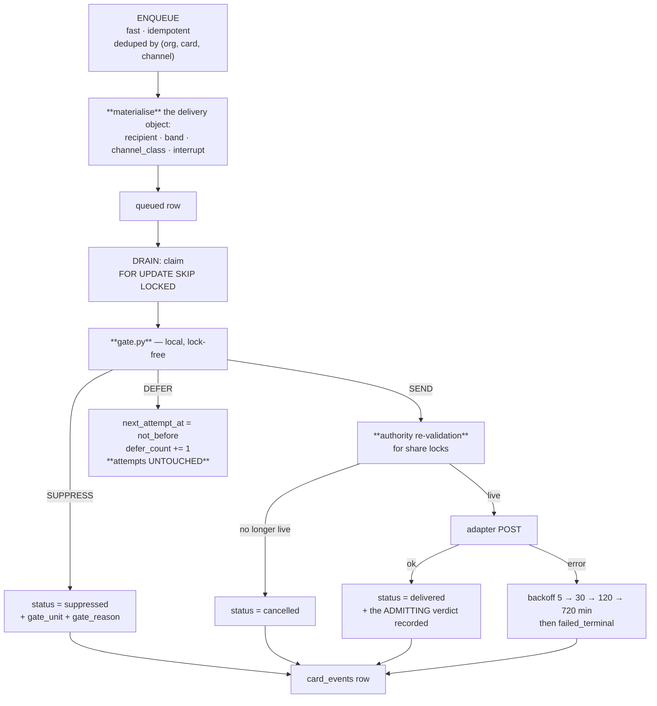

← [The Thirteen Reason Codes](05-Reason-Codes.md) · [Folder map](README.md) · → [Channels, Digest and Agent Delivery](07-Channels-Digest-and-Agents.md)

---

# Transport and the Outbox

---

## Transport — `outbox.py`

**Dispatch policy** mirrors the card pipeline's push law without touching it: `HIGH` and
`CRITICAL` notify; `STANDARD` stays a dashboard rotation. The daily digest goes once per org per
UTC day **under a synthetic card id** — same dedup machinery, zero special cases.

---
