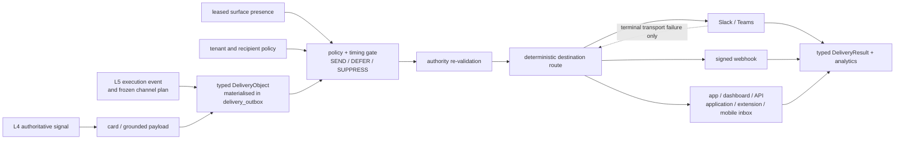

← [Bugs, Runbook and Gaps](08-Bugs-Runbook-and-Gaps.md) · [Folder map](README.md)

---

# Atlas Layer 5.2 Alignment

The Atlas calls this capability **Layer 5.2 · Delivery Engine**. The repository calls the same
runtime boundary **Layer 6 · Intelligence Distribution** and implements it in
`genios_engine/deliver/`. There is no second delivery layer and no renumbering migration.

This page records what the code does now. A checked item means an executable code path exists;
it does not claim that an external provider has been exercised with production credentials.

## The as-built boundary

`DeliveryObject` and `DeliveryResult` are typed projections of `delivery_outbox`. The outbox
remains the one durable ledger, so a delivery cannot disagree with a second result table.

## Atlas component matrix

| Atlas component | As-built status | Repository evidence / boundary |
|---|---|---|
| Delivery Context Resolver | **Built, owner-surface-reported** | `presence.py`, `delivery_presence`, and `/delivery/context`; meeting, focus and active-surface state is leased and expires automatically |
| Audience Resolver | **Upstream-owned** | recipient and assignee are frozen by Layer 5/card production; delivery never invents or reassigns one |
| Destination Router | **Built for card delivery** | `destination.py` orders active registered destinations by explicit/default priority |
| Channel Planner | **Split by authority** | Layer 5 owns commitment channel plans; Layer 5.2 chooses a card's registered primary and terminal-failure fallbacks |
| Timing & Interruptibility | **Built** | recipient timezone, quiet hours, live busy/focus context, break-glass, DST-safe deferral |
| Delivery Policy | **Built** | org, channel, seat and seat-channel settings; opt-out, hold, channel floor and kill switch |
| Priority Scheduler | **Built** | urgency bands, due-time ordering, burst admission and bounded transport backoff |
| Delivery Object Builder | **Built** | immutable `DeliveryObject`; existing outbox row is its persistence model |
| Delivery Tracker | **Built** | durable status, attempts, deferrals, reason code, error and timestamps |
| Retry Manager | **Built** | 5 / 30 / 120 / 720 minute transport ladder, then terminal failure |
| Failure Recovery | **Built for cards** | next registered destination is queued only after terminal transport failure and fresh authority proof |
| Deduplication | **Built** | unique `(org_id, card_id, channel)` intent and deterministic executive synthetic ids |
| Rate Limiter | **Built** | daily card budget plus per-recipient intrusive burst limit |
| Delivery Analytics | **Built** | `/delivery/analytics` reports status/channel counts, attempts, deferrals, failure rate and latency percentiles |
| Delivery Result | **Built** | immutable `DeliveryResult` maps private outbox states to a stable public lifecycle |

## Delivery units

| Atlas delivery unit | Status | Exact meaning here |
|---|---|---|
| Human Delivery | **Built** | grounded intelligence cards and Layer 5 commitment reminders |
| Agent Delivery | **Built** | metered signal poll/claim/result API plus HMAC push |
| API Delivery | **Built as pull** | authenticated `/delivery/inbox?channel=api` |
| Application Delivery | **Built as pull** | durable `application` inbox surface |
| Notification Delivery | **Partial** | chat notifications work; native OS notification service is not implemented |
| Dashboard Delivery | **Built as pull** | durable `dashboard` inbox surface |
| Webhook Delivery | **Built** | customer HTTPS endpoint with HMAC-SHA256 signature and basic SSRF validation |
| Extension Delivery | **Built as pull** | durable `extension` inbox plus presence publishing seam |
| Mobile Delivery | **Partial** | authenticated `mobile` inbox exists; APNs/FCM device push does not |
| Email Delivery | **Not built** | provider, sender/domain policy, templates, bounce and unsubscribe handling still require a product/infrastructure choice |
| Slack / Teams Delivery | **Built** | Slack webhook plus Teams Incoming Webhook/anonymous Workflow adapter; real endpoints are needed for live proof |

> A pull-surface row marked `delivered` means **available through the authenticated inbox**. It
> does not mean a native device notification was sent.

## Routing and failover law

For high/critical card pushes the router chooses one primary destination, then a deterministic
fallback ladder. A fallback can be created only when the previous transport is
`failed_terminal`; it cannot route around quiet hours, opt-out, compliance suppression,
recipient-busy deferral, or revoked authority.

Layer 5 commitment reminders are stricter: their frozen channel plan is executed exactly. Layer
5.2 does not silently move a commitment to another destination, because that would replace an
upstream decision below its authority boundary.

## Public control and observation surface

| Endpoint family | Purpose |
|---|---|
| `PUT/GET/DELETE /api/org/{org}/delivery/context...` | owner-authenticated publish/inspect of leased recipient activity/surface state |
| `GET /api/org/{org}/delivery/results...` | typed delivery lifecycle and one delivery's materialised object |
| `GET /api/org/{org}/delivery/inbox` | authenticated pull delivery for app/dashboard/API/application/extension/mobile |
| `GET /api/org/{org}/delivery/analytics` | reproducible metrics from the outbox ledger |
| `PUT/DELETE/POST /api/org/{org}/channels/{channel}...` | register/test Teams, signed webhooks and pull surfaces; Slack keeps its compatible dedicated routes |

## What remains before Atlas-complete production readiness

1. Choose and implement a native email provider, sender/domain verification, unsubscribe and
   bounce lifecycle.
2. Choose and implement APNs/FCM device-token lifecycle and native push receipts.
3. Add an automatic trusted calendar/client presence publisher. The resolver is live today, but
   context must be posted by a surface; calendar events are not silently treated as real-time
   presence. A scoped per-seat publisher also needs a real seat identity in the auth contract;
   until then context mutation is owner-only.
4. Exercise migration `0044`, concurrent claims/failover and analytics against live PostgreSQL.
5. Exercise Slack, Teams and signed-webhook sends with real credentials and controlled failure
   injection. Application URL validation is defense in depth; production egress controls remain
   required.

The Teams adapter deliberately targets endpoint-secret/anonymous webhook flows. A Teams Workflow
configured for tenant or specific-user authentication requires an OAuth integration and is not
reported as supported by this adapter.

---

[Folder map](README.md) · [System Design index](../README.md)
